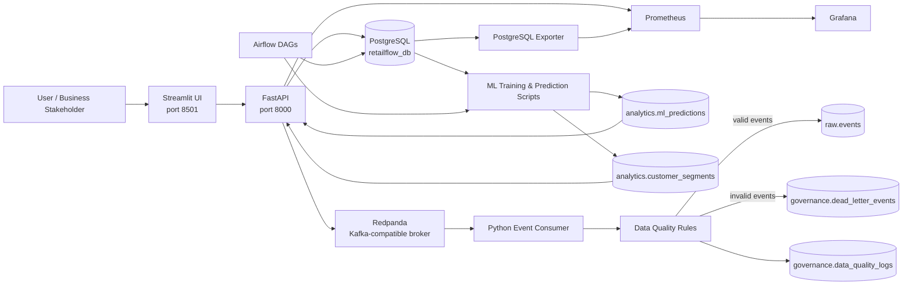
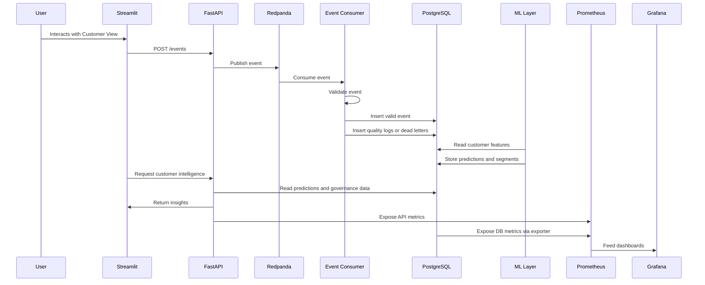
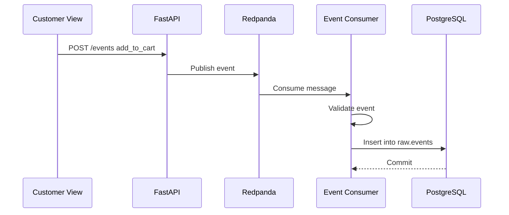
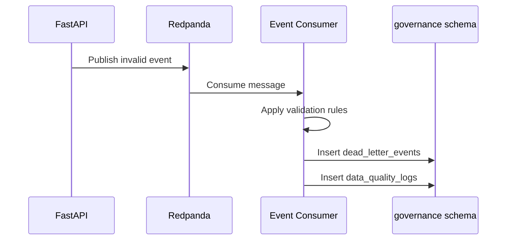
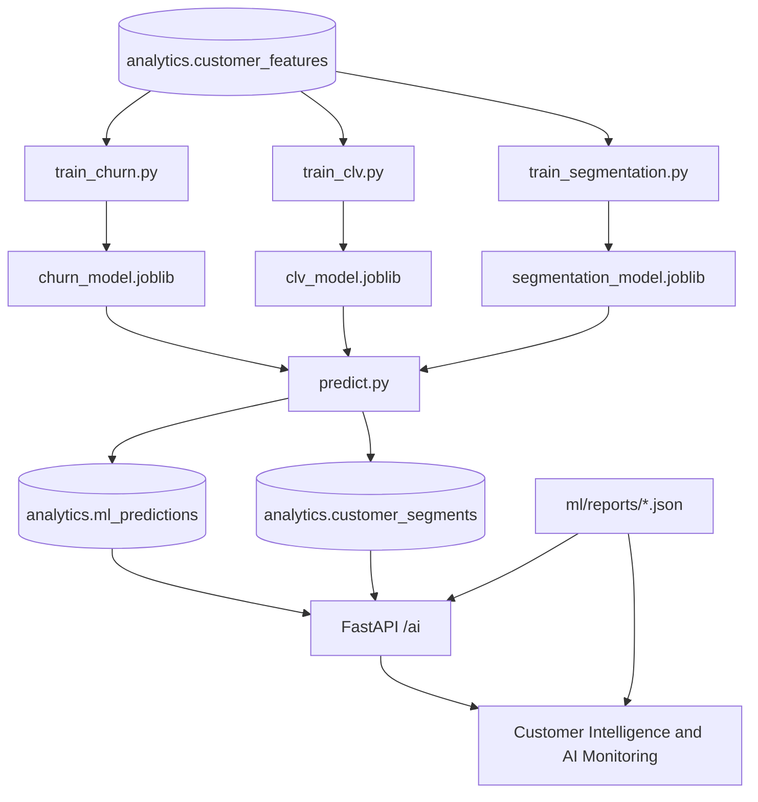
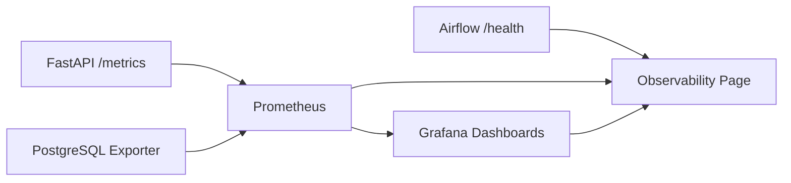

# RetailFlow

## End-to-End Retail Intelligence Platform

**Real-Time Data Pipelines • AI-Powered Customer Intelligence • Data Governance • Observability**

RetailFlow is an end-to-end Retail Intelligence platform designed for modern e-commerce organizations that need to transform operational, behavioral and customer data into actionable business intelligence.

The platform combines event-driven data ingestion, governed data storage, customer analytics, machine learning, API serving, operational monitoring and executive dashboards into a single integrated architecture.

---

## Table of Contents

1. [Overview](#overview)
2. [Product Vision](#product-vision)
3. [Business Context](#business-context)
4. [Problem Statement](#problem-statement)
5. [Platform Objectives](#platform-objectives)
6. [Key Capabilities](#key-capabilities)
7. [Global Architecture](#global-architecture)
8. [Architecture Principles](#architecture-principles)
9. [Technology Stack](#technology-stack)
10. [Capability Mapping](#capability-mapping)
11. [Data Governance](#Data Governance#)
12. Real-Time Data Pipelines
13. AI & MLOps
14. Observability
15. Streamlit Platform
16. API Layer
17. Project Structure
18. Installation
19. Running the Platform
20. Demonstration Flow
21. Development Milestones
22. Future Improvements

---

## Overview

RetailFlow is built as a complete data and AI platform for e-commerce intelligence.

It connects the main layers of a modern data architecture:

- customer-facing event generation;
- real-time event ingestion;
- data validation and dead-letter handling;
- governed PostgreSQL storage;
- customer feature engineering;
- churn prediction;
- customer lifetime value estimation;
- customer segmentation;
- API-based serving;
- Streamlit business dashboards;
- Airflow orchestration;
- Prometheus and Grafana observability.

The goal of RetailFlow is not only to display analytics. The goal is to demonstrate how an e-commerce organization can build a coherent platform where business events become trusted data, trusted data becomes intelligence, and intelligence becomes operational decision support.

RetailFlow is designed around the following end-to-end path:

```text
Customer behavior
→ real-time event ingestion
→ validation and quality controls
→ PostgreSQL storage
→ feature engineering
→ machine learning models
→ FastAPI serving
→ Streamlit dashboards
→ operational monitoring
```

---

## Product Vision

RetailFlow is positioned as a Retail Intelligence platform for e-commerce teams that need to understand and act on customer behavior.

The platform helps answer questions such as:

- Which customers are most valuable?
- Which customers are at risk of churn?
- Which customer segments should be targeted differently?
- Are customer events being ingested correctly?
- Are data quality issues isolated and traceable?
- Are ML models monitored and interpretable?
- Is the platform observable from an operational point of view?

The product vision is to provide one integrated platform for:

| Area | RetailFlow capability |
|---|---|
| Customer Intelligence | Churn, CLV, segmentation and recommendations |
| Data Engineering | Real-time event ingestion and validation |
| Data Governance | Consent, retention, anonymization and auditability |
| MLOps | Model reports, drift monitoring and model serving |
| Observability | Prometheus, Grafana, FastAPI metrics and platform health |
| Business Demonstration | Streamlit interface for live platform exploration |

---

## Business Context

Modern e-commerce companies generate large volumes of heterogeneous data:

- product catalog data;
- customer profiles;
- orders and payments;
- delivery and return information;
- browsing sessions;
- product views;
- cart events;
- checkout events;
- support tickets;
- reviews;
- consent and governance records;
- ML predictions and customer segments.

These data sources are valuable only if they are collected, governed, processed, monitored and transformed into decisions.

RetailFlow addresses this challenge by connecting business events to a data platform that supports both operational and analytical use cases.

The business goal is to improve decision-making across the customer lifecycle:

```text
Acquire customers
→ understand behavior
→ detect risks
→ estimate value
→ personalize actions
→ monitor outcomes
```

RetailFlow therefore supports a modern retail operating model where data engineering, governance, analytics and AI are not separate silos but parts of the same product platform.

---

## Problem Statement

The guiding problem is:

> How can a modern e-commerce data platform combine real-time data pipelines, artificial intelligence and observability in order to improve business decision-making?

This problem requires more than a dashboard and more than a standalone model.

It requires a platform able to:

1. collect customer events;
2. validate and store them reliably;
3. enforce governance and auditability;
4. build customer intelligence features;
5. train and monitor AI models;
6. expose insights through APIs;
7. provide interactive business dashboards;
8. monitor platform health and operational behavior.

RetailFlow answers this by implementing a full local platform using Docker Compose, PostgreSQL, Redpanda, FastAPI, Airflow, Streamlit, Prometheus, Grafana and Scikit-Learn.

---

## Platform Objectives

RetailFlow was designed with the following objectives.

### 1. Build a coherent end-to-end platform

The platform must cover the complete path from customer events to business intelligence.

This includes ingestion, storage, governance, ML and visualization.

### 2. Support real-time customer event processing

Customer actions such as product views, add-to-cart events and checkout events should be captured through an event-driven pipeline.

### 3. Make data quality visible

Invalid events should not silently pollute the analytical layer.

They must be rejected, isolated and traceable.

### 4. Make governance operational

Governance should not remain theoretical.

It should be represented through tables, policies, consent data, retention logs and dashboards.

### 5. Serve AI outputs through APIs

ML outputs should not remain inside notebooks.

Predictions and segments must be persisted, exposed through FastAPI and consumed by Streamlit dashboards.

### 6. Monitor models and platform components

RetailFlow must expose model metrics, drift signals, FastAPI metrics, PostgreSQL exporter metrics and platform health indicators.

### 7. Provide a strong live demonstration path

The platform must be easy to demonstrate through a narrative flow:

```text
Platform Overview
→ Customer View
→ Customer Intelligence
→ Data Governance
→ Data Quality
→ AI Monitoring
→ Observability
```

---

## Key Capabilities

### Customer Intelligence

RetailFlow provides a customer intelligence layer built on behavioral, transactional and analytical features.

It includes:

- churn risk ranking;
- customer lifetime value estimation;
- customer segmentation;
- customer-level AI profile;
- segment-level exploration;
- business recommendations;
- consent-aware customer exploration.

The Customer Intelligence dashboard connects the AI layer to business decision-making.

It allows users to identify:

- high-risk customers;
- high-value customers;
- segment-specific populations;
- customers eligible for analytics exploration;
- actions to prioritize by segment or risk profile.

---

### Real-Time Pipelines

RetailFlow uses a Kafka-compatible event streaming architecture with Redpanda.

The real-time pipeline supports:

- storefront event generation;
- FastAPI event publishing;
- Redpanda topic ingestion;
- Python consumer processing;
- validation rules;
- PostgreSQL persistence;
- dead-letter handling;
- quality logs.

The pipeline demonstrates how an e-commerce platform can decouple customer-facing applications from analytical storage.

---

### Data Quality

RetailFlow includes a data quality layer focused on event reliability.

It supports:

- event schema validation;
- allowed event type validation;
- customer existence validation;
- product existence validation;
- timestamp validation;
- dead-letter event storage;
- quality rule summaries;
- Streamlit quality monitoring.

This design prevents invalid data from silently entering trusted analytical tables.

---

### Data Governance

RetailFlow includes a governance layer covering:

- customer consent tracking;
- analytics consent filtering;
- marketing consent indicators;
- personalization consent indicators;
- retention policies;
- anonymization status;
- retention action logs;
- risk register;
- governance dashboards.

Governance is implemented in both the database layer and the Streamlit interface.

It is connected to Customer Intelligence through consent-aware analytics filtering.

---

### AI & MLOps

RetailFlow includes a complete AI layer with:

- churn model;
- CLV model;
- customer segmentation model;
- model reports;
- feature importance;
- cross-validation reports;
- drift monitoring;
- prediction distribution monitoring;
- FastAPI serving endpoints;
- Streamlit AI Monitoring dashboard.

The AI layer is designed to support decision-making, not just model experimentation.

---

### Observability

RetailFlow includes operational monitoring through:

- Prometheus;
- Grafana;
- FastAPI `/metrics` endpoint;
- PostgreSQL exporter;
- Airflow health endpoint;
- Prometheus target monitoring;
- documented alerting rules;
- Streamlit observability page.

The observability layer shows that the platform is not only functional but also monitorable.

---

## Global Architecture

RetailFlow is deployed locally through Docker Compose.

The platform is composed of several specialized services connected through a shared Docker network.



---

## Runtime Architecture

The main runtime flow can be summarized as follows.



---

## Data Flow Overview

RetailFlow uses several data flows.

### 1. Historical operational data flow

```text
Data generation
→ CSV files
→ PostgreSQL loading
→ core/raw/governance/analytics schemas
```

### 2. Live event data flow

```text
Streamlit interaction
→ FastAPI POST /events
→ Redpanda topic
→ Python consumer
→ validation
→ raw.events or governance.dead_letter_events
```

### 3. AI data flow

```text
analytics.customer_features
→ model training
→ model reports
→ predictions
→ analytics.ml_predictions
→ FastAPI /ai
→ Streamlit dashboards
```

### 4. Governance data flow

```text
customer data
→ consent fields
→ retention policies
→ retention logs
→ governance endpoints
→ Streamlit Data Governance
```

### 5. Observability data flow

```text
FastAPI metrics
→ Prometheus
→ Grafana

PostgreSQL exporter
→ Prometheus
→ Grafana

Airflow health
→ Streamlit Observability
```

---

## Architecture Principles

RetailFlow is designed around the following principles.

### Modular architecture

Each component has a clear responsibility.

| Component | Responsibility |
|---|---|
| Streamlit | User interface and demonstration layer |
| FastAPI | API and service layer |
| PostgreSQL | Structured storage and analytics warehouse |
| Redpanda | Event streaming broker |
| Event Consumer | Streaming validation and persistence |
| Airflow | Orchestration and scheduled workflows |
| ML scripts | Training, prediction and drift reports |
| Prometheus | Metrics collection |
| Grafana | Metrics visualization |

---

### Separation of concerns

RetailFlow separates:

- application interaction;
- event transport;
- validation logic;
- storage;
- governance;
- analytics;
- AI outputs;
- monitoring.

This separation improves maintainability and allows each layer to evolve independently.

---

### Event-driven design

Customer interactions are not written directly to the database from the UI.

Instead, they follow an event-driven pattern:

```text
UI
→ API producer
→ broker
→ consumer
→ validation
→ storage
```

This pattern is closer to production architectures where event ingestion must be decoupled from frontend applications.

---

### Governed analytics

Customer analytics is connected to consent management.

The Customer Intelligence dashboard supports filtering customers based on analytics consent.

This creates a direct link between governance and AI usage.

---

### Production-oriented observability

RetailFlow includes metrics and dashboards for operational monitoring.

The platform includes:

- service status;
- API request metrics;
- PostgreSQL health;
- Prometheus targets;
- Grafana dashboards;
- documented alerting rules;
- Airflow health checks.

---

### Demonstrability

The platform is designed to be demonstrated live.

The Streamlit navigation follows a narrative order:

```text
Platform Overview
→ Customer View
→ Customer Intelligence
→ Data Governance
→ Data Quality
→ AI Monitoring
→ Observability
```

This makes it possible to explain the entire platform in a structured and business-oriented way.

---

## Technology Stack

### Summary

| Layer | Technologies |
|---|---|
| User interface | Streamlit |
| API layer | FastAPI |
| Database | PostgreSQL |
| Streaming broker | Redpanda |
| Streaming consumer | Python |
| Orchestration | Apache Airflow |
| Machine Learning | Scikit-Learn, Pandas, Joblib |
| Metrics | Prometheus |
| Visualization | Grafana |
| Database metrics | PostgreSQL Exporter |
| Containerization | Docker, Docker Compose |
| Development environment | WSL2, Ubuntu, Python 3.11 |
| Version control | Git, GitHub |

---

### Streamlit

Streamlit is used as the interactive platform interface.

It provides:

- a landing page;
- a platform overview;
- a customer-facing demo journey;
- customer intelligence dashboards;
- governance dashboards;
- data quality dashboards;
- AI monitoring dashboards;
- observability views.

Streamlit was chosen because it enables fast development of business-facing dashboards while remaining Python-native.

---

### FastAPI

FastAPI is the service layer.

It exposes:

- health endpoints;
- product endpoints;
- event endpoints;
- quality endpoints;
- AI endpoints;
- governance endpoints;
- model report endpoints;
- metrics endpoint.

FastAPI was chosen because it provides:

- strong performance;
- automatic OpenAPI documentation;
- clean endpoint structure;
- easy integration with SQLAlchemy and Python services.

---

### PostgreSQL

PostgreSQL is the central data platform.

It is organized into multiple schemas:

| Schema | Role |
|---|---|
| `raw` | Raw events and ingested behavioral data |
| `core` | Clean business entities |
| `analytics` | Features, predictions, segments and aggregates |
| `governance` | Consent, retention, quality and auditability |

PostgreSQL was chosen because it provides a stable relational foundation for structured analytics, governance and operational queries.

---

### Redpanda

Redpanda is used as a Kafka-compatible streaming broker.

It supports:

- event topics;
- producer/consumer architecture;
- local deployment without Zookeeper;
- Kafka-compatible client libraries.

Redpanda was chosen to demonstrate event streaming patterns with a simpler local deployment model.

---

### Airflow

Airflow is used for orchestration.

RetailFlow includes DAGs for:

- daily data quality;
- daily sales aggregation;
- ML retraining;
- retention cleanup.

Airflow provides scheduling, workflow structure and visibility over recurring data operations.

---

### Scikit-Learn

Scikit-Learn is used for the ML layer.

RetailFlow includes:

- churn classification;
- CLV regression;
- customer segmentation;
- feature importance reports;
- cross-validation outputs;
- drift analysis reports.

Scikit-Learn was selected for its transparency, simplicity and suitability for explainable tabular ML workflows.

---

### Prometheus

Prometheus collects metrics from:

- FastAPI;
- PostgreSQL exporter;
- platform targets.

It is used to validate service health, request metrics and database monitoring.

---

### Grafana

Grafana visualizes the metrics collected by Prometheus.

RetailFlow includes dashboards for API and platform observability.

---

### Docker Compose

Docker Compose is used to run the complete platform locally.

It manages:

- PostgreSQL;
- pgAdmin;
- Redpanda;
- FastAPI;
- event consumer;
- Streamlit;
- Airflow;
- Prometheus;
- Grafana;
- PostgreSQL exporter.

Docker Compose was selected because it provides a reliable local deployment strategy while keeping the architecture easy to reproduce.

---

## Capability Mapping

RetailFlow is organized around four major capability domains.

These domains structure the platform and make the architecture easier to understand.

---

### 1. Data Governance

RetailFlow includes a governance layer covering:

- customer consent management;
- analytics consent usage;
- data retention policies;
- anonymization status;
- retention action logs;
- data quality logs;
- dead-letter events;
- risk management.

Main implementation areas:

| Asset | Description |
|---|---|
| `governance.customer_consents` | Consent history and governance records |
| `governance.data_retention_policies` | Retention policy definitions |
| `governance.retention_actions_log` | Retention and anonymization audit trail |
| `governance.data_quality_logs` | Quality rule execution logs |
| `governance.dead_letter_events` | Rejected events and error context |
| `/governance/*` | FastAPI governance endpoints |
| Data Governance page | Streamlit governance dashboard |

---

### 2. Data Architecture

RetailFlow implements a modular data architecture.

Main components:

| Asset | Description |
|---|---|
| Docker Compose | Local multi-service deployment |
| PostgreSQL | Central database and analytics warehouse |
| Redpanda | Event streaming broker |
| FastAPI | Service and API layer |
| Streamlit | User-facing platform |
| Airflow | Orchestration layer |
| Prometheus | Metrics collection |
| Grafana | Metrics visualization |

The architecture is designed to support both analytical and operational workloads.

---

### 3. Real-Time Data Pipelines

RetailFlow implements a real-time pipeline for customer events.

Main capabilities:

- event publishing;
- event streaming;
- event consumption;
- validation;
- persistence;
- rejection handling;
- monitoring.

Main implementation areas:

| Asset | Description |
|---|---|
| `/events` | FastAPI event publishing endpoint |
| `retailflow_events` | Redpanda topic |
| `pipeline/consumer/event_consumer.py` | Python consumer |
| `pipeline/consumer/validators.py` | Validation rules |
| `raw.events` | Valid event storage |
| `governance.dead_letter_events` | Invalid event storage |
| Data Quality page | Streamlit pipeline quality dashboard |

---

### 4. AI & MLOps

RetailFlow implements an AI layer for customer intelligence.

Main capabilities:

- churn scoring;
- customer lifetime value prediction;
- customer segmentation;
- model reports;
- feature importance;
- cross-validation;
- drift monitoring;
- prediction serving;
- AI dashboards.

Main implementation areas:

| Asset | Description |
|---|---|
| `ml/src/train_churn.py` | Churn training workflow |
| `ml/src/train_clv.py` | CLV training workflow |
| `ml/src/train_segmentation.py` | Segmentation training workflow |
| `ml/src/predict.py` | Batch prediction workflow |
| `ml/src/evaluate_drift.py` | Drift report generation |
| `analytics.ml_predictions` | Persisted churn and CLV predictions |
| `analytics.customer_segments` | Persisted customer segments |
| `/ai/*` | FastAPI AI endpoints |
| AI Monitoring page | Streamlit AI monitoring dashboard |
| Customer Intelligence page | Streamlit business AI dashboard |

---

## Current Stable Release

Current stable tag:

```text
v17-ux-demo-polish-stable
```

Current stable branch:

```text
develop
```

Latest stable milestone:

```text
UX, customer intelligence and demonstration platform
```

The platform is currently in a stable state after the V17 milestone.

V17 transformed RetailFlow from a collection of technical components into a coherent, business-facing and demonstration-ready platform.

---

## Platform Navigation

RetailFlow Streamlit includes the following navigation structure:

| Page | Purpose |
|---|---|
| Home | Minimal product landing page |
| Platform Overview | Problem, architecture, status and demo path |
| Customer View | Product catalog, cart, checkout and event generation |
| Customer Intelligence | Churn, CLV, segments, consent-aware exploration |
| Data Governance | Consent, retention, anonymization and auditability |
| Data Quality | Dead letters, quality rules and pipeline errors |
| AI Monitoring | Model metrics, feature importance, drift and validation |
| Observability | Prometheus, Grafana, Airflow and platform health |

This navigation supports a complete product demonstration from business context to operational monitoring.

---

## Value Proposition

RetailFlow delivers value across multiple roles.

### For business teams

RetailFlow helps business teams:

- identify valuable customers;
- detect churn risks;
- understand customer segments;
- prioritize retention actions;
- monitor customer behavior;
- connect customer intelligence to actions.

### For data teams

RetailFlow helps data teams:

- ingest events reliably;
- validate data quality;
- structure data across schemas;
- trace invalid events;
- build features;
- expose analytics through APIs.

### For AI teams

RetailFlow helps AI teams:

- train customer models;
- monitor metrics;
- explain drivers;
- detect drift;
- expose predictions;
- connect models to business dashboards.

### For platform teams

RetailFlow helps platform teams:

- run services locally;
- monitor API health;
- monitor database health;
- inspect Prometheus targets;
- visualize metrics in Grafana;
- document alerting rules.

---

## Why RetailFlow Matters

RetailFlow demonstrates how a modern e-commerce platform can evolve from raw operational data to actionable customer intelligence.

It shows that a data product is not only a model or a dashboard.

A complete data product requires:

- governed data;
- reliable ingestion;
- quality controls;
- explainable analytics;
- operational monitoring;
- API-based serving;
- business-facing interfaces.

RetailFlow brings these dimensions together in a single coherent platform.


---

## 9. Data Governance

RetailFlow includes a dedicated governance layer designed to make data usage controlled, traceable and operationally auditable.

The governance approach is not limited to documentation.
It is implemented through database schemas, consent attributes, retention policies, quality logs, dead-letter events and Streamlit dashboards.

The goal is to show how governance principles can be translated into technical controls inside a data platform.

### 9.1 Governance Goals

RetailFlow governance is built around the following objectives:

| Goal | Description |
|---|---|
| Consent awareness | Customer analytics usage must be aligned with consent indicators. |
| Data retention | Data domains must have explicit retention rules and actions. |
| Auditability | Quality checks, retention actions and rejected events must be traceable. |
| Data quality | Invalid events should be detected before contaminating analytical layers. |
| Risk management | Privacy, quality, operational and ML risks must be visible. |
| Accountability | Roles and responsibilities must be clearly mapped. |

The platform therefore connects governance to daily operations:

```text
customer consent
→ governed analytics
→ data quality checks
→ dead-letter isolation
→ retention policies
→ audit trail
```

### 9.2 Governance Schema

The database contains a dedicated PostgreSQL schema:

```text
governance
```

This schema contains the governance and quality tables used by the platform.

| Table | Purpose |
|---|---|
| `governance.customer_consents` | Stores customer consent records. |
| `governance.data_retention_policies` | Stores retention policies by table and domain. |
| `governance.retention_actions_log` | Stores retention and anonymization execution logs. |
| `governance.data_quality_logs` | Stores failed data quality checks. |
| `governance.dead_letter_events` | Stores rejected streaming events. |

These tables make the governance layer observable from both the API and the Streamlit interface.

### 9.3 Consent Management

RetailFlow uses consent flags to control analytical usage.

The main consent dimensions are:

| Consent | Meaning |
|---|---|
| `marketing_consent` | Permission for marketing activation. |
| `analytics_consent` | Permission for analytical usage and customer intelligence exploration. |
| `personalization_consent` | Permission for personalized recommendations or targeting. |

The Streamlit Customer Intelligence page uses the `analytics_consent` field to restrict the customer explorer by default.

This creates a direct connection between:

```text
Data Governance
↓
Consent Management
↓
Customer Intelligence
↓
Responsible Analytics
```

### 9.4 Governed Customer Intelligence

In the Customer Intelligence dashboard, the customer selector contains a governance-aware filter:

```text
Show only customers with analytics consent
```

When enabled, only customers with:

```text
analytics_consent = true
```

are available in the customer AI profile explorer.

This is important because customer intelligence involves derived data such as:

- churn scores;
- predicted customer lifetime value;
- behavioral features;
- customer segments;
- business recommendations.

These outputs can influence marketing or retention decisions, so the dashboard demonstrates how governance rules can be integrated into analytics workflows.

### 9.5 Data Retention Policies

RetailFlow includes a retention policy table:

```text
governance.data_retention_policies
```

The purpose is to define how long each data domain should be retained and what action should be taken when a policy applies.

Example policy dimensions:

| Field | Meaning |
|---|---|
| `policy_id` | Unique policy identifier. |
| `data_domain` | Business domain affected by the policy. |
| `table_name` | Target table. |
| `data_category` | Type of data concerned. |
| `retention_days` | Retention duration. |
| `retention_trigger` | Trigger condition. |
| `retention_action` | Action to apply. |
| `legal_basis` | Governance or compliance justification. |
| `owner_role` | Responsible role. |

Example retention actions include:

- anonymize;
- pseudonymize;
- refresh;
- archive;
- delete.

### 9.6 Retention Actions Log

Retention operations are logged in:

```text
governance.retention_actions_log
```

This table provides an audit trail of actions applied to data records.

It supports questions such as:

- Which policy was applied?
- Which table was affected?
- Which record was processed?
- Was the action successful?
- When was the action executed?
- Which component executed the action?

This auditability is exposed through the Data Governance page.

### 9.7 Data Quality Logs

The table:

```text
governance.data_quality_logs
```

stores failed quality checks produced by the pipeline.

Typical fields include:

| Field | Meaning |
|---|---|
| `check_id` | Unique quality check identifier. |
| `rule_id` | Rule identifier. |
| `rule_name` | Human-readable rule name. |
| `table_name` | Target table. |
| `record_id` | Identifier of the affected record. |
| `status` | Passed or failed status. |
| `severity` | Severity level. |
| `action` | Action applied by the pipeline. |
| `error_message` | Reason for failure. |
| `checked_at` | Timestamp of the check. |
| `source` | Component that produced the check. |

The quality log is used by the Data Quality page to show failed rules and pipeline reliability.

### 9.8 Dead-Letter Events

Invalid streaming events are isolated in:

```text
governance.dead_letter_events
```

A dead-letter event is a message that failed validation and was not inserted into the trusted event table.

Dead-letter handling prevents invalid messages from contaminating:

- raw event history;
- analytics features;
- business dashboards;
- ML training datasets;
- operational monitoring.

The dead-letter table captures:

| Field | Meaning |
|---|---|
| `dead_letter_id` | Unique dead-letter identifier. |
| `event_id` | Original event identifier. |
| `source_topic` | Streaming topic. |
| `event_type` | Event type. |
| `error_reason` | Validation failure reason. |
| `raw_payload` | Original message payload. |
| `severity` | Error severity. |
| `reprocessed` | Reprocessing status. |
| `created_at` | Insertion timestamp. |

### 9.9 Governance API

RetailFlow exposes governance data through FastAPI.

| Endpoint | Purpose |
|---|---|
| `GET /governance/summary` | Governance KPIs. |
| `GET /governance/customer-consents` | Customer consent sample. |
| `GET /governance/retention-policies` | Retention policy table. |
| `GET /governance/retention-actions` | Retention action logs. |

These endpoints are consumed by Streamlit.

### 9.10 Data Governance Page

The Streamlit Data Governance page shows:

- governance overview KPIs;
- customer consent rates;
- retention policies;
- anonymization indicators;
- retention action logs;
- stakeholder roles;
- risk register;
- governance evidence.

It answers the following question:

> How does RetailFlow control data usage, compliance, retention, quality and risk?

### 9.11 Governance Roles

RetailFlow defines a governance operating model with clear responsibilities.

| Role | Responsibility |
|---|---|
| Data Owner | Owns business meaning and accountability for a data domain. |
| Data Steward | Monitors quality, metadata and operational consistency. |
| DPO / Compliance | Oversees privacy, retention and regulatory alignment. |
| Data Engineer | Implements pipelines, controls and data storage layers. |
| ML Engineer | Monitors ML lifecycle, serving, validation and drift. |
| Business Owner | Uses insights for operational and marketing decisions. |

### 9.12 Governance Risk Register

RetailFlow identifies several governance risks.

| Risk | Description | Mitigation |
|---|---|---|
| Personal data exposure | Customer data may include identifiable attributes. | Consent, retention and anonymization controls. |
| Data quality propagation | Invalid events may affect analytics and ML outputs. | Validation, quality logs and dead-letter handling. |
| ML drift | Customer behavior may change over time. | Drift monitoring and retraining process. |
| Compliance gaps | Retention and consent rules may be inconsistently applied. | Policy tables and action logs. |
| Operational opacity | Failures may be hard to diagnose. | Observability dashboards and logs. |

### 9.13 Governance Value

The governance layer demonstrates that RetailFlow is not only a technical platform.

It also provides:

- decision traceability;
- data quality accountability;
- compliance-oriented data handling;
- visibility into consent and retention;
- responsible use of customer intelligence.

---

## 10. Real-Time Data Pipelines

RetailFlow includes a real-time event pipeline designed to capture customer interactions and persist them after validation.

The pipeline follows an event-driven architecture:

```text
Streamlit Customer View
→ FastAPI /events
→ Redpanda topic
→ Python consumer
→ validation rules
→ PostgreSQL raw events or governance dead letters
```

### 10.1 Pipeline Objectives

The real-time pipeline is built to demonstrate the following capabilities:

| Capability | Description |
|---|---|
| Event ingestion | Capture customer actions from the storefront. |
| Decoupling | Separate event production from database persistence. |
| Validation | Check event integrity before insertion. |
| Persistence | Store valid events in PostgreSQL. |
| Isolation | Store invalid events in dead-letter tables. |
| Monitoring | Expose event quality and recent events in dashboards. |

### 10.2 Event Sources

Events are generated from the Customer View page.

Typical customer actions include:

| User Action | Event Type |
|---|---|
| Product consultation | `product_view` |
| Add to cart | `add_to_cart` |
| Start checkout | `checkout_started` |
| Complete purchase | `purchase` |

These events are produced during the live demo.

### 10.3 Event Payload

A live event contains fields such as:

```json
{
  "customer_id": "cust_000001",
  "session_id": "sess_demo_xxxxxxxx",
  "event_type": "add_to_cart",
  "product_id": "prod_000001",
  "page_url": "/product/prod_000001",
  "raw_payload": {
    "cart_size": 1,
    "price_incl_tax": 129.99
  }
}
```

FastAPI enriches the event with an event identifier and publishes it to Redpanda.

### 10.4 Redpanda Broker

RetailFlow uses Redpanda as the event broker.

Redpanda is Kafka-compatible and provides the same core streaming concepts:

- topics;
- producers;
- consumers;
- offsets;
- message streaming.

The main topic is:

```text
retailflow_events
```

Redpanda was selected because it is simpler to run locally than a full Kafka cluster while preserving event streaming patterns.

### 10.5 Event Producer

The producer lives inside the FastAPI service.

Main responsibility:

```text
POST /events
→ validate request schema
→ create live event id
→ publish message to Redpanda
→ return publication status
```

FastAPI does not directly insert live events into PostgreSQL.

Instead, it produces a message to the broker.

This design creates a clear separation:

| Component | Responsibility |
|---|---|
| Streamlit | Simulates user interactions. |
| FastAPI | Receives event requests and publishes messages. |
| Redpanda | Buffers and transports events. |
| Consumer | Validates and persists events. |
| PostgreSQL | Stores trusted data and audit logs. |

### 10.6 Event Consumer

The consumer is implemented in Python.

Location:

```text
pipeline/consumer/event_consumer.py
```

It performs the following steps:

1. subscribe to the Redpanda topic;
2. poll messages;
3. parse event payloads;
4. apply validation rules;
5. write valid events to `raw.events`;
6. write invalid events to `governance.dead_letter_events`;
7. write quality failures to `governance.data_quality_logs`.

### 10.7 Event Validation Rules

Validation logic is implemented in:

```text
pipeline/consumer/validators.py
```

The core rules are:

| Rule ID | Rule | Purpose | Action |
|---|---|---|---|
| R001 | `event_id_not_null` | Ensure traceability. | reject |
| R002 | `event_type_allowed` | Reject unsupported event types. | reject |
| R003 | `customer_exists` | Ensure customer integrity. | reject |
| R004 | `product_exists` | Ensure product integrity. | reject |
| R005 | `timestamp_valid` | Detect invalid timestamps. | reject |

These rules are designed to catch realistic integration issues.

### 10.8 Valid Event Flow



### 10.9 Invalid Event Flow



### 10.10 Data Quality Integration

The pipeline is directly connected to the governance layer.

When an event fails validation:

```text
invalid event
→ dead-letter table
→ quality log
→ Streamlit Data Quality page
→ auditability
```

This demonstrates that pipeline reliability is not only a technical concern but also a governance concern.

### 10.11 Recent Event Preview

The Customer View page includes a recent event preview.

It reads from:

```text
GET /events/recent
```

This allows the user to verify that generated events are being processed and persisted.

### 10.12 Pipeline Monitoring in Streamlit

The Data Quality page shows:

- dead-letter events;
- rejected event types;
- severity distribution;
- failed quality rules;
- rule frequency;
- quality summaries;
- technical evidence.

This page answers:

> How does RetailFlow detect, isolate and monitor data errors in real-time flows?

### 10.13 Pipeline Value

The real-time pipeline demonstrates:

- event-driven design;
- decoupled architecture;
- streaming ingestion;
- validation before persistence;
- governance-aware error handling;
- operational visibility.

It is one of the most important components of RetailFlow because it connects the customer journey to the data platform.

---

## 11. AI & MLOps

RetailFlow includes an AI layer designed to transform customer behavior into actionable intelligence.

The AI layer supports three main use cases:

1. churn risk prioritization;
2. customer lifetime value estimation;
3. customer segmentation.

The goal is not to keep models isolated in notebooks.

The models are trained, persisted, reported, stored in the database, exposed through FastAPI and visualized through Streamlit.

### 11.1 AI Objectives

| Objective | Description |
|---|---|
| Churn prediction | Identify customers likely to disengage. |
| CLV estimation | Estimate future customer value. |
| Segmentation | Group customers into business-readable clusters. |
| Explainability | Surface feature importance and model drivers. |
| Monitoring | Track metrics, drift and validation reports. |
| Serving | Expose predictions through API endpoints. |

### 11.2 AI Architecture



### 11.3 Feature Layer

The main feature table is:

```text
analytics.customer_features
```

It contains customer-level behavioral indicators such as:

| Feature | Meaning |
|---|---|
| `total_orders` | Total number of orders. |
| `total_spent` | Total customer spending. |
| `avg_order_value` | Average basket value. |
| `days_since_last_order` | Recency indicator. |
| `return_rate` | Share of returned orders or products. |
| `cart_abandon_rate` | Cart abandonment behavior. |
| `session_count_30d` | Recent engagement. |
| `pages_viewed_30d` | Browsing intensity. |
| `support_tickets_count` | Support friction indicator. |
| `avg_rating_given` | Customer satisfaction proxy. |
| `discount_usage_rate` | Promotion sensitivity. |
| `preferred_category` | Main product interest. |

### 11.4 Churn Model

The churn model is used to rank customers by risk level.

Script:

```text
ml/src/train_churn.py
```

Output:

```text
ml/models/churn_model.joblib
ml/reports/churn_model_report.json
ml/reports/churn_model_report.txt
```

Stored predictions:

```text
analytics.ml_predictions
```

Prediction labels:

| Label | Meaning |
|---|---|
| `low_risk` | Low churn risk. |
| `medium_risk` | Medium churn risk. |
| `high_risk` | High churn risk. |

The churn model is used primarily for prioritization.

It supports business actions such as:

- retention campaigns;
- lifecycle marketing;
- churn prevention;
- customer care prioritization.

### 11.5 CLV Model

The CLV model estimates customer value.

Script:

```text
ml/src/train_clv.py
```

Output:

```text
ml/models/clv_model.joblib
ml/reports/clv_model_report.json
ml/reports/clv_model_report.txt
```

Prediction labels:

| Label | Meaning |
|---|---|
| `low_value` | Low predicted value. |
| `medium_value` | Medium predicted value. |
| `high_value` | High predicted value. |

The CLV model supports:

- loyalty strategy;
- upsell prioritization;
- retention budget allocation;
- customer portfolio management.

### 11.6 Segmentation Model

The segmentation model groups customers into readable business categories.

Script:

```text
ml/src/train_segmentation.py
```

Output:

```text
ml/models/segmentation_model.joblib
ml/reports/segmentation_model_report.json
ml/reports/segmentation_model_report.txt
```

Stored segments:

```text
analytics.customer_segments
```

Business segment labels include:

| Segment | Business Interpretation |
|---|---|
| High Value Loyal Customers | Customers with high spending and strong purchase history. |
| Standard Active Customers | Customers with balanced activity and medium value. |
| Promo-Sensitive Browsers | Customers influenced by discounts and browsing behavior. |
| Return-Prone Customers | Customers with comparatively high return behavior. |
| Dormant Low Value Customers | Customers with long inactivity and weaker engagement. |

### 11.7 Prediction Storage

Predictions are stored in:

```text
analytics.ml_predictions
```

This table contains:

| Field | Meaning |
|---|---|
| `prediction_id` | Unique prediction identifier. |
| `customer_id` | Customer being scored. |
| `model_name` | Model name. |
| `model_version` | Model version. |
| `prediction_value` | Numeric prediction. |
| `prediction_label` | Business label. |
| `prediction_timestamp` | Prediction timestamp. |
| `input_features_hash` | Hash of input features. |

Using a database table for predictions makes the outputs reusable by:

- APIs;
- dashboards;
- monitoring;
- business workflows;
- future automation.

### 11.8 AI Reports

ML reports are stored in:

```text
ml/reports/
```

Main reports:

| Report | Purpose |
|---|---|
| `model_summary.json` | Overall model summary. |
| `churn_model_report.json` | Churn metrics and feature importance. |
| `clv_model_report.json` | CLV metrics and feature importance. |
| `segmentation_model_report.json` | Segmentation metrics and cluster summaries. |
| `drift_report.json` | Lightweight drift monitoring report. |

These reports are exposed through FastAPI and displayed in the AI Monitoring page.

### 11.9 Drift Monitoring

RetailFlow includes lightweight drift monitoring.

The drift report compares reference and current customer feature distributions.

The output includes:

- drift status;
- drifted feature count;
- threshold;
- feature-level distribution changes.

The AI Monitoring page explains drift in business terms:

> Drift can indicate that customer behavior has changed and that model reliability should be reassessed.

### 11.10 AI API

FastAPI exposes the AI layer through endpoints.

| Endpoint | Purpose |
|---|---|
| `GET /ai/summary` | Prediction and segment summary. |
| `GET /ai/churn-top` | Highest churn risk customers. |
| `GET /ai/clv-top` | Highest predicted CLV customers. |
| `GET /ai/segments` | Segment summaries. |
| `GET /ai/customers` | Enriched customer list with consent and AI outputs. |
| `GET /ai/customer/{customer_id}` | Complete customer AI profile. |
| `GET /ai/model-reports` | Available ML reports. |
| `GET /ai/model-report/{report_name}` | Detailed report content. |

### 11.11 Customer Intelligence Page

The Customer Intelligence page is the business-facing AI dashboard.

It includes:

- business overview KPIs;
- top churn risk customers;
- top predicted CLV customers;
- customer segments;
- segment-level customer explorer;
- segment business recommendations;
- consent-aware customer selector;
- customer AI profile;
- behavioral features;
- business recommendations.

It answers:

> How does RetailFlow help an e-commerce business understand and act on customer behavior?

### 11.12 AI Monitoring Page

The AI Monitoring page is the model-facing dashboard.

It includes:

- executive model overview;
- churn metrics;
- CLV metrics;
- segmentation summaries;
- prediction distribution;
- feature importance;
- drift monitoring;
- cross-validation details;
- interpretation guides.

It answers:

> Are the models performant, monitored and explainable?

### 11.13 Metric Interpretation

The AI Monitoring page includes French interpretation guides for model metrics.

This helps a mixed audience understand:

- what the metric measures;
- how it should be interpreted;
- what it means for business decisions.

Examples:

| Metric | Business Meaning |
|---|---|
| ROC AUC | Ability to rank customers by churn risk. |
| F1 Score | Balance between detecting risk and avoiding false alerts. |
| Precision | Reliability of churn alerts. |
| Recall | Coverage of at-risk customers. |
| Brier Score | Quality of probability calibration. |
| MAE | Average monetary error for CLV. |
| RMSE | Sensitivity to large CLV errors. |
| R² | Share of CLV variance explained by the model. |

### 11.14 MLOps Value

RetailFlow demonstrates a practical MLOps lifecycle:

```text
features
→ training
→ model artifacts
→ reports
→ predictions
→ API serving
→ dashboard monitoring
→ drift reporting
→ retraining orchestration
```

This is not only a modeling exercise.

It is a platform integration exercise.

---

## 12. Observability

RetailFlow includes a monitoring and observability layer based on Prometheus and Grafana.

Observability is used to monitor platform health, API metrics, PostgreSQL status, Airflow health and alerting rules.

### 12.1 Observability Objectives

| Objective | Description |
|---|---|
| Platform health | Verify that critical services are available. |
| API monitoring | Track FastAPI metrics and request behavior. |
| Database monitoring | Track PostgreSQL availability and connections. |
| Orchestration monitoring | Check Airflow scheduler and metadata database. |
| Alerting | Document operational alert rules. |
| Demonstrability | Provide visibility for the live demo. |

### 12.2 Monitoring Stack

| Component | Role |
|---|---|
| Prometheus | Collects metrics from FastAPI and PostgreSQL exporter. |
| Grafana | Visualizes platform metrics. |
| PostgreSQL Exporter | Exposes PostgreSQL metrics to Prometheus. |
| FastAPI Metrics | Exposes API metrics on `/metrics`. |
| Airflow Health | Exposes orchestration health on `/health`. |
| Streamlit Observability Page | Aggregates health signals in the UI. |

### 12.3 Prometheus

Prometheus is configured with scrape jobs for:

```text
retailflow-fastapi
retailflow-postgres
```

Configuration file:

```text
monitoring/prometheus/prometheus.yml
```

Key endpoint:

```text
http://127.0.0.1:9090
```

The Prometheus targets page allows verification that metrics are being scraped successfully.

### 12.4 FastAPI Metrics

FastAPI exposes Prometheus-compatible metrics through:

```text
GET /metrics
```

Metrics include HTTP request counters and latency metrics.

These metrics are scraped by Prometheus and visualized in Grafana.

### 12.5 PostgreSQL Exporter

PostgreSQL exporter exposes database metrics on:

```text
http://127.0.0.1:9187/metrics
```

Prometheus queries include:

```promql
pg_up
```

and PostgreSQL connection metrics.

The exporter confirms that the database is reachable from the monitoring layer.

### 12.6 Grafana

Grafana is available at:

```text
http://127.0.0.1:3000
```

It contains dashboards for platform observability.

Dashboard files are stored in:

```text
monitoring/grafana/dashboards/
```

Grafana provisioning is stored in:

```text
monitoring/grafana/provisioning/
```

### 12.7 Alerting Rules

Alerting documentation is stored in:

```text
monitoring/grafana/alerts/alert_rules.md
```

Documented alerts include:

| Alert | Query / Trigger | Meaning |
|---|---|---|
| FastAPI Down | `up{job="retailflow-fastapi"} == 0` | API unreachable. |
| PostgreSQL Down | `pg_up{job="retailflow-postgres"} == 0` | Database unavailable. |
| High API Error Rate | HTTP 5xx rate | API generating server errors. |
| High API Latency | p95 latency threshold | API response time too high. |
| Drift Detected | Conceptual ML alert | Drift report indicates model risk. |

### 12.8 Airflow Health

Airflow exposes health status through:

```text
http://127.0.0.1:8080/health
```

The Observability page reads this endpoint and displays:

- metadatabase health;
- scheduler health;
- DAG processor status;
- triggerer status.

This avoids incorrectly scraping the Airflow health endpoint as Prometheus metrics.

### 12.9 Observability Page

The Streamlit Observability page displays:

- FastAPI status;
- PostgreSQL status;
- Airflow scheduler status;
- Grafana health;
- Prometheus targets;
- API request metrics;
- PostgreSQL metrics;
- Airflow health JSON;
- links to tools;
- alerting rules.

It answers:

> How is the RetailFlow platform monitored?

### 12.10 Observability Architecture



### 12.11 Operational Value

The observability layer demonstrates:

- production mindset;
- operational readiness;
- service health monitoring;
- database monitoring;
- documented alerting;
- clear separation between metrics, dashboards and health checks.

---

## 13. Streamlit Platform

Streamlit is the main user interface of RetailFlow.

It provides a guided demonstration across business, data engineering, governance, AI and observability views.

The interface is designed to be used during a live demo.

### 13.1 Streamlit Role

Streamlit acts as:

- a product demo interface;
- a customer journey simulator;
- a business intelligence dashboard;
- a governance dashboard;
- a data quality monitoring interface;
- an AI monitoring cockpit;
- an observability console.

### 13.2 Streamlit Structure

Current pages:

```text
streamlit_app/app.py
streamlit_app/pages/1_Platform_Overview.py
streamlit_app/pages/2_Customer_View.py
streamlit_app/pages/3_Customer_Intelligence.py
streamlit_app/pages/4_Data_Governance.py
streamlit_app/pages/5_Data_Quality.py
streamlit_app/pages/6_AI_Monitoring.py
streamlit_app/pages/7_Observability.py
```

Shared UI components:

```text
streamlit_app/components.py
streamlit_app/styles/custom.css
```

### 13.3 Home Page

File:

```text
streamlit_app/app.py
```

Purpose:

- minimal landing page;
- introduce RetailFlow;
- summarize capabilities;
- recommend the demo flow.

The page is intentionally lightweight.

The detailed project explanation lives in Platform Overview.

### 13.4 Platform Overview

File:

```text
streamlit_app/pages/1_Platform_Overview.py
```

Purpose:

- explain the problem statement;
- show platform status;
- display architecture overview;
- map the platform to major capability areas;
- show Airflow orchestration;
- recommend live demo flow.

This is the best starting point for the demo.

### 13.5 Customer View

File:

```text
streamlit_app/pages/2_Customer_View.py
```

Purpose:

- simulate an e-commerce customer journey;
- browse products;
- select products;
- add to cart;
- start checkout;
- complete purchase;
- generate live events;
- display recent event stream preview.

This page connects the business journey to the real-time pipeline.

### 13.6 Customer Intelligence

File:

```text
streamlit_app/pages/3_Customer_Intelligence.py
```

Purpose:

- show top churn risk customers;
- show top predicted CLV customers;
- show customer segments;
- explore customers by segment;
- display segment recommendations;
- filter customers by analytics consent;
- display a complete AI profile.

This page is the main business-facing AI dashboard.

### 13.7 Data Governance

File:

```text
streamlit_app/pages/4_Data_Governance.py
```

Purpose:

- show governance KPIs;
- display consent indicators;
- display retention policies;
- show retention action logs;
- explain stakeholder roles;
- present risk register;
- connect governance to operational controls.

### 13.8 Data Quality

File:

```text
streamlit_app/pages/5_Data_Quality.py
```

Purpose:

- show dead-letter events;
- show quality rule failures;
- show severity distribution;
- show impacted event types;
- explain validation logic;
- support pipeline quality monitoring.

### 13.9 AI Monitoring

File:

```text
streamlit_app/pages/6_AI_Monitoring.py
```

Purpose:

- show model overview;
- display churn metrics;
- display CLV metrics;
- display segmentation summaries;
- show prediction distribution;
- show feature importance;
- show drift monitoring;
- explain metrics in business terms.

### 13.10 Observability

File:

```text
streamlit_app/pages/7_Observability.py
```

Purpose:

- show platform health;
- show Prometheus targets;
- show FastAPI metrics;
- show PostgreSQL metrics;
- show Airflow health;
- link to Grafana, Prometheus, Airflow and FastAPI docs;
- present alerting rules.

### 13.11 UI Design

RetailFlow uses a custom dark dashboard style.

Shared styling is located in:

```text
streamlit_app/styles/custom.css
```

The design direction is:

- dark professional interface;
- custom cards;
- reusable sections;
- minimal animations;
- clear academic and business storytelling.

### 13.12 Demo Navigation

Demo order:

1. Home;
2. Platform Overview;
3. Customer View;
4. Customer Intelligence;
5. Data Governance;
6. Data Quality;
7. AI Monitoring;
8. Observability.

This order follows the platform narrative:

```text
problem and architecture
→ customer journey
→ customer intelligence
→ governance
→ quality
→ AI monitoring
→ platform monitoring
```

---

## 14. API Layer

FastAPI is the backend service layer of RetailFlow.

It exposes business data, product data, events, quality, governance, AI and monitoring endpoints.

### 14.1 API Role

FastAPI is responsible for:

- connecting Streamlit to PostgreSQL;
- exposing product and customer data;
- publishing live events to Redpanda;
- exposing recent events;
- exposing quality monitoring;
- exposing governance data;
- exposing AI predictions;
- exposing ML reports;
- exposing health and metrics endpoints.

### 14.2 API Structure

Main files:

```text
api/app/main.py
api/app/database.py
api/app/routes/
api/app/services/
```

Main route files:

| File | Role |
|---|---|
| `health.py` | Health checks. |
| `customers.py` | Customer profile API. |
| `analytics.py` | Business analytics API. |
| `products.py` | Product catalog API. |
| `events.py` | Event publishing and recent events. |
| `quality.py` | Data quality and dead-letter monitoring. |
| `ai.py` | AI predictions and ML reports. |
| `governance.py` | Governance dashboards data. |

### 14.3 API Health

Endpoint:

```text
GET /health
```

Purpose:

- confirm API availability;
- confirm PostgreSQL connectivity.

Example response:

```json
{
  "status": "ok",
  "database": "connected",
  "service": "retailflow-api"
}
```

### 14.4 Product Endpoints

| Endpoint | Purpose |
|---|---|
| `GET /products` | Product catalog. |
| `GET /products/{product_id}` | Product details. |

These endpoints are used by Customer View.

### 14.5 Event Endpoints

| Endpoint | Purpose |
|---|---|
| `POST /events` | Publish a live event to Redpanda. |
| `GET /events/recent` | Read recent persisted events from PostgreSQL. |

The live event endpoint is central to the streaming demo.

### 14.6 Quality Endpoints

| Endpoint | Purpose |
|---|---|
| `GET /quality/dead-letters` | List rejected events. |
| `GET /quality/summary` | Data quality rule summary. |
| `GET /quality/dead-letter-summary` | Dead-letter aggregation. |

These endpoints are used by Data Quality.

### 14.7 Governance Endpoints

| Endpoint | Purpose |
|---|---|
| `GET /governance/summary` | Governance KPIs. |
| `GET /governance/retention-policies` | Retention policy table. |
| `GET /governance/retention-actions` | Retention action logs. |
| `GET /governance/customer-consents` | Consent sample. |

These endpoints are used by Data Governance.

### 14.8 AI Endpoints

| Endpoint | Purpose |
|---|---|
| `GET /ai/summary` | Global prediction and segment summary. |
| `GET /ai/churn-top` | Top churn risk customers. |
| `GET /ai/clv-top` | Top predicted CLV customers. |
| `GET /ai/segments` | Segment summaries. |
| `GET /ai/customers` | Enriched customer list with consent and AI outputs. |
| `GET /ai/customer/{customer_id}` | Full AI profile for one customer. |
| `GET /ai/model-reports` | Available report paths. |
| `GET /ai/model-report/{report_name}` | Report JSON content. |

### 14.9 Metrics Endpoint

Endpoint:

```text
GET /metrics
```

Purpose:

- expose Prometheus-compatible application metrics.

This endpoint is scraped by Prometheus.

### 14.10 API Documentation

FastAPI automatically exposes Swagger UI:

```text
http://127.0.0.1:8000/docs
```

This is useful for:

- exploring endpoints;
- testing requests;
- explaining API contracts;
- demonstrating the serving layer.

---

## 15. Project Structure

RetailFlow follows a modular repository structure.

```text
retailflow-platform/
├── airflow/
├── api/
├── data/
├── data_generator/
├── database/
├── docs/
├── k8s/
├── kafka_kraft/
├── ml/
├── monitoring/
├── pipeline/
├── streamlit_app/
├── tests/
├── docker-compose.yml
├── Makefile
├── README.md
└── requirements.txt
```

### 15.1 Repository Areas

| Directory | Purpose |
|---|---|
| `airflow/` | DAGs and orchestration logic. |
| `api/` | FastAPI backend. |
| `data/` | Raw and generated datasets. |
| `data_generator/` | Dataset generation and loading scripts. |
| `database/` | PostgreSQL schema initialization scripts. |
| `docs/` | Detailed documentation by capability area. |
| `k8s/` | Future Kubernetes manifests. |
| `kafka_kraft/` | Kafka KRaft experimentation area. |
| `ml/` | ML training, prediction, models and reports. |
| `monitoring/` | Prometheus and Grafana configuration. |
| `pipeline/` | Streaming producer/consumer logic. |
| `streamlit_app/` | Streamlit user interface. |
| `tests/` | Automated tests. |

### 15.2 API Directory

```text
api/
├── Dockerfile
├── app/
│   ├── database.py
│   ├── main.py
│   ├── routes/
│   ├── schemas/
│   └── services/
└── requirements.txt
```

### 15.3 Streamlit Directory

```text
streamlit_app/
├── Dockerfile
├── app.py
├── components.py
├── pages/
│   ├── 1_Platform_Overview.py
│   ├── 2_Customer_View.py
│   ├── 3_Customer_Intelligence.py
│   ├── 4_Data_Governance.py
│   ├── 5_Data_Quality.py
│   ├── 6_AI_Monitoring.py
│   └── 7_Observability.py
├── requirements.txt
└── styles/
    └── custom.css
```

### 15.4 ML Directory

```text
ml/
├── models/
│   ├── churn_model.joblib
│   ├── clv_model.joblib
│   └── segmentation_model.joblib
├── reports/
│   ├── churn_model_report.json
│   ├── clv_model_report.json
│   ├── drift_report.json
│   ├── model_summary.json
│   └── segmentation_model_report.json
├── src/
│   ├── build_features.py
│   ├── db.py
│   ├── evaluate_drift.py
│   ├── ml_utils.py
│   ├── predict.py
│   ├── train_churn.py
│   ├── train_clv.py
│   └── train_segmentation.py
└── tests/
```

### 15.5 Pipeline Directory

```text
pipeline/
├── config/
│   └── topics.yaml
├── consumer/
│   ├── Dockerfile
│   ├── event_consumer.py
│   ├── validators.py
│   └── writer.py
├── producer/
│   ├── ecommerce_event_producer.py
│   └── order_event_producer.py
└── requirements.txt
```

### 15.6 Monitoring Directory

```text
monitoring/
├── grafana/
│   ├── alerts/
│   ├── dashboards/
│   └── provisioning/
└── prometheus/
    └── prometheus.yml
```

### 15.7 Documentation Directory

```text
docs/
├── bloc1_governance/
├── bloc2_architecture/
├── bloc3_pipeline/
└── bloc4_ai/
```

This directory will be expanded during the documentation phase.

### 15.8 Data Directory

```text
data/
├── governance/
├── processed/
├── raw/
└── reference/
```

The `data/raw/` folder contains generated CSV files used to populate the platform.

### 15.9 Tests

Current tests are stored in:

```text
tests/
├── test_api.py
├── test_data_quality.py
└── test_ml.py
```

Tests cover core platform areas and should be expanded in future iterations.

## 14. Installation

RetailFlow is designed to run locally through Docker Compose.

The platform is composed of multiple services:

- PostgreSQL for structured storage.
- Redpanda for Kafka-compatible event streaming.
- FastAPI for backend APIs and event publishing.
- Streamlit for the product and monitoring interface.
- Airflow for orchestration.
- Prometheus for metrics collection.
- Grafana for metrics visualization.
- PostgreSQL Exporter for database observability.
- A Python event consumer for real-time ingestion and validation.

The installation process is intentionally centered on local reproducibility.

---

### 14.1 Prerequisites

Environment:

| Requirement | Recommended version / setup |
|---|---|
| Operating system | Linux or WSL2 Ubuntu |
| Python | 3.11 |
| Docker | Docker Desktop or Docker Engine |
| Docker Compose | Compose V2 |
| Git | Latest stable version |
| Terminal | Bash-compatible shell |
| Browser | Chrome, Edge, Firefox, or equivalent |

Local development setup:

```bash
Windows
└── WSL2 Ubuntu
    └── Docker Desktop integration
        └── Python 3.11 virtual environment
            └── RetailFlow repository
```

---

### 14.2 Clone the repository

```bash
git clone https://github.com/HugoB-AS/retailflow-platform.git
cd retailflow-platform
```

Working branch:

```bash
git checkout develop
```

The current stable version is:

```text
v17-ux-demo-polish-stable
```

To checkout the stable release:

```bash
git checkout v17-ux-demo-polish-stable
```

---

### 14.3 Create and activate the Python environment

Create a local virtual environment:

```bash
python3.11 -m venv .venv
```

Activate it:

```bash
source .venv/bin/activate
```

Upgrade core packaging tools:

```bash
python -m pip install --upgrade pip setuptools wheel
```

Install development dependencies if needed:

```bash
pip install -r requirements-dev.txt
```

Install component-specific dependencies only when running scripts outside Docker:

```bash
pip install -r data_generator/requirements.txt
pip install -r ml/requirements.txt
pip install -r api/requirements.txt
pip install -r streamlit_app/requirements.txt
```

Most runtime components are executed through Docker Compose, so installing every requirement locally is not always required.

---

### 14.4 Start the platform

Start all services:

```bash
docker compose up -d
```

Check containers:

```bash
docker compose ps
```

Expected services:

| Service | Container | Role |
|---|---|---|
| `postgres` | `retailflow_postgres` | Main database |
| `pgadmin` | `retailflow_pgadmin` | PostgreSQL admin UI |
| `redpanda` | `retailflow_redpanda` | Event streaming broker |
| `fastapi` | `retailflow_fastapi` | Backend API |
| `event_consumer` | `retailflow_event_consumer` | Streaming consumer |
| `streamlit` | `retailflow_streamlit` | User interface |
| `airflow-webserver` | `retailflow_airflow_webserver` | Airflow UI |
| `airflow-scheduler` | `retailflow_airflow_scheduler` | Airflow scheduler |
| `airflow_postgres` | `retailflow_airflow_postgres` | Airflow metadata DB |
| `prometheus` | `retailflow_prometheus` | Metrics collection |
| `grafana` | `retailflow_grafana` | Dashboards |
| `postgres_exporter` | `retailflow_postgres_exporter` | PostgreSQL metrics |
| `airflow_init` | `retailflow_airflow_init` | Airflow initialization |

---

### 14.5 Service URLs

| Component | URL |
|---|---|
| Streamlit UI | `http://127.0.0.1:8501` |
| FastAPI Docs | `http://127.0.0.1:8000/docs` |
| FastAPI Health | `http://127.0.0.1:8000/health` |
| PostgreSQL | `localhost:5432` |
| pgAdmin | `http://127.0.0.1:5050` |
| Airflow | `http://127.0.0.1:8080` |
| Prometheus | `http://127.0.0.1:9090` |
| Grafana | `http://127.0.0.1:3000` |
| PostgreSQL Exporter | `http://127.0.0.1:9187/metrics` |
| Redpanda Admin API | `http://127.0.0.1:9644` |

---

### 14.6 Health checks

FastAPI:

```bash
curl http://127.0.0.1:8000/health
```

Expected response:

```json
{
  "status": "ok",
  "database": "connected",
  "service": "retailflow-api"
}
```

Prometheus readiness:

```bash
curl http://127.0.0.1:9090/-/ready
```

Grafana health:

```bash
curl http://127.0.0.1:3000/api/health
```

Airflow health:

```bash
curl http://127.0.0.1:8080/health
```

PostgreSQL exporter:

```bash
curl http://127.0.0.1:9187/metrics | head
```

---

### 14.7 API checks

Core API:

```bash
curl "http://127.0.0.1:8000/products?limit=3"
```

AI summary:

```bash
curl -s "http://127.0.0.1:8000/ai/summary" | python -m json.tool
```

Customer intelligence endpoint:

```bash
curl -s "http://127.0.0.1:8000/ai/customers?limit=3&analytics_consent_only=true" | python -m json.tool
```

Governance summary:

```bash
curl -s "http://127.0.0.1:8000/governance/summary" | python -m json.tool
```

Quality summary:

```bash
curl -s "http://127.0.0.1:8000/quality/summary" | python -m json.tool
```

Prometheus target state:

```bash
curl -s "http://127.0.0.1:9090/api/v1/targets" | python -m json.tool
```

PostgreSQL exporter health metric:

```bash
curl -s "http://127.0.0.1:9090/api/v1/query?query=pg_up"
```

Expected result:

```json
{
  "status": "success",
  "data": {
    "resultType": "vector",
    "result": [
      {
        "metric": {
          "__name__": "pg_up",
          "instance": "postgres_exporter:9187",
          "job": "retailflow-postgres"
        },
        "value": [
          "...",
          "1"
        ]
      }
    ]
  }
}
```

---

## 15. Running the Platform

This section describes the operational workflow once the platform is installed.

---

### 15.1 Standard startup workflow

From the project root:

```bash
cd ~/projects/Master_Thesis/retailflow-platform
source .venv/bin/activate
git checkout develop
docker compose up -d
docker compose ps
```

Open the main UI:

```text
http://127.0.0.1:8501
```

Entry point:

```text
Home
→ Platform Overview
```

---

### 15.2 Standard shutdown workflow

Stop all services:

```bash
docker compose down
```

Leave the Python environment:

```bash
deactivate
```

---

### 15.3 Rebuild selected services

Rebuild FastAPI only:

```bash
docker compose up -d --build fastapi
```

Rebuild Streamlit only:

```bash
docker compose up -d --build streamlit
```

Rebuild FastAPI and Streamlit together:

```bash
docker compose up -d --build fastapi streamlit
```

Rebuild all services:

```bash
docker compose up -d --build
```

---

### 15.4 Logs

FastAPI logs:

```bash
docker logs retailflow_fastapi --tail 100
```

Streamlit logs:

```bash
docker logs retailflow_streamlit --tail 100
```

Event consumer logs:

```bash
docker logs retailflow_event_consumer --tail 100
```

Airflow scheduler logs:

```bash
docker logs retailflow_airflow_scheduler --tail 100
```

Airflow webserver logs:

```bash
docker logs retailflow_airflow_webserver --tail 100
```

Prometheus logs:

```bash
docker logs retailflow_prometheus --tail 100
```

Grafana logs:

```bash
docker logs retailflow_grafana --tail 100
```

---

### 15.5 Data generation workflow

Generate the dataset:

```bash
python data_generator/generate_dataset.py --profile medium
```

Load data into PostgreSQL:

```bash
python data_generator/loaders/load_to_postgres.py
```

Run ML training:

```bash
python -m ml.src.train_churn
python -m ml.src.train_clv
python -m ml.src.train_segmentation
```

Generate predictions:

```bash
python -m ml.src.predict
```

Evaluate drift:

```bash
python -m ml.src.evaluate_drift
```

Rebuild API and UI after refreshing reports or predictions:

```bash
docker compose up -d --build fastapi streamlit
```

---

### 15.6 ML workflow

The ML workflow is composed of five steps:

```text
customer features
→ churn training
→ CLV training
→ segmentation training
→ prediction generation
→ report generation
```

Run all core ML commands manually:

```bash
python -m ml.src.train_churn
python -m ml.src.train_clv
python -m ml.src.train_segmentation
python -m ml.src.predict
python -m ml.src.evaluate_drift
```

Generated model artifacts:

```text
ml/models/churn_model.joblib
ml/models/clv_model.joblib
ml/models/segmentation_model.joblib
```

Generated reports:

```text
ml/reports/model_summary.json
ml/reports/churn_model_report.json
ml/reports/clv_model_report.json
ml/reports/segmentation_model_report.json
ml/reports/drift_report.json
```

---

### 15.7 Airflow workflow

Airflow is used to orchestrate operational jobs.

Main DAGs:

```text
daily_sales_aggregation
daily_data_quality
ml_retraining
retention_cleanup
```

Open Airflow:

```text
http://127.0.0.1:8080
```

Check Airflow health:

```bash
curl http://127.0.0.1:8080/health
```

Airflow supports the platform by demonstrating:

- scheduled analytics jobs;
- data quality jobs;
- ML retraining jobs;
- retention and governance jobs.

---

### 15.8 Monitoring workflow

Prometheus:

```text
http://127.0.0.1:9090
```

Grafana:

```text
http://127.0.0.1:3000
```

Key Prometheus queries:

```promql
up{job="retailflow-fastapi"}
```

```promql
pg_up{job="retailflow-postgres"}
```

```promql
sum(rate(http_requests_total[1m])) * 60
```

```promql
sum(rate(http_requests_total{status=~"5.."}[1m]))
```

```promql
histogram_quantile(
  0.95,
  sum by (le) (
    rate(http_request_duration_seconds_bucket[5m])
  )
)
```

---

## 16. Demonstration Flow

The demonstration is designed as a narrative sequence.

The goal is not to show disconnected tools.  
The goal is to show how RetailFlow turns customer behavior into governed, monitored, AI-powered business intelligence.

---

### 16.1 Live demo path

```text
Home
→ Platform Overview
→ Customer View
→ Customer Intelligence
→ Data Governance
→ Data Quality
→ AI Monitoring
→ Observability
```

---

### 16.2 Demo step 1 — Home

Open:

```text
http://127.0.0.1:8501
```

Purpose:

- introduce RetailFlow;
- present the platform positioning;
- guide the audience toward the full demo.

Main message:

```text
RetailFlow is an end-to-end Retail Intelligence platform combining real-time pipelines, AI, governance and observability.
```

---

### 16.3 Demo step 2 — Platform Overview

Open:

```text
Platform Overview
```

Show:

- problem statement;
- platform status;
- architecture overview;
- academic block mapping;
- Airflow orchestration;
- Demo flow.

Main message:

```text
The project is a complete platform, not a collection of independent dashboards.
```

Explanation:

```text
The architecture starts from customer events, routes them through the streaming pipeline, stores them in PostgreSQL, exposes them through FastAPI, and visualizes them in Streamlit and Grafana.
```

---

### 16.4 Demo step 3 — Customer View

Open:

```text
Customer View
```

Show:

- customer session;
- product catalog;
- product details;
- product view event;
- add to cart;
- checkout;
- purchase;
- recent event stream preview.

Suggested actions:

1. Select a product.
2. Generate a product view event.
3. Add the product to cart.
4. Start checkout.
5. Complete purchase.
6. Show the recent event stream.

Main message:

```text
Customer behavior generates events that can be captured by the real-time pipeline.
```

---

### 16.5 Demo step 4 — Customer Intelligence

Open:

```text
Customer Intelligence
```

Show:

- top churn customers;
- top CLV customers;
- customer segments;
- segment customer explorer;
- business recommendations;
- analytics consent filter;
- customer AI profile.

Suggested actions:

1. Show the business overview.
2. Explain churn and CLV use cases.
3. Select a customer segment.
4. Show the customer table for that segment.
5. Open the customer explorer.
6. Enable analytics-consented customers only.
7. Load a customer AI profile.
8. Show recommendations.

Main message:

```text
Customer data is converted into actionable intelligence: risk, value, segments and recommendations.
```

---

### 16.6 Demo step 5 — Data Governance

Open:

```text
Data Governance
```

Show:

- governance overview;
- roles and responsibilities;
- consent management;
- retention policies;
- anonymization and audit trail;
- risk register;
- GDPR alignment.

Main message:

```text
Governance is operationalized through database tables, API endpoints and dashboard visibility.
```

Good explanation:

```text
The platform does not only analyze customers. It also tracks consent, retention, anonymization and auditability.
```

---

### 16.7 Demo step 6 — Data Quality

Open:

```text
Data Quality
```

Show:

- dead-letter events;
- failed rules;
- severity;
- impacted event types;
- quality control logic;
- dead letters by severity;
- dead letters by event type;
- quality rules summary.

Main message:

```text
Invalid events are detected, isolated and traced instead of silently polluting analytical tables.
```

Good explanation:

```text
The data quality layer protects the downstream analytics and AI layers.
```

---

### 16.8 Demo step 7 — AI Monitoring

Open:

```text
AI Monitoring
```

Show:

- model overview;
- churn metrics;
- CLV metrics;
- segmentation;
- prediction distribution;
- feature importance;
- drift monitoring;
- validation details.

Suggested actions:

1. Show executive model overview.
2. Open the churn metric guide.
3. Open the CLV metric guide.
4. Show feature importance.
5. Show drift monitoring.
6. Explain validation details.

Main message:

```text
The platform monitors model performance, explainability and behavioral drift signals.
```

---

### 16.9 Demo step 8 — Observability

Open:

```text
Observability
```

Show:

- FastAPI status;
- PostgreSQL status;
- Airflow health;
- Grafana health;
- API requests/min;
- PostgreSQL connections;
- Prometheus targets;
- FastAPI observability;
- PostgreSQL observability;
- alerting rules.

Suggested actions:

1. Show platform health metrics.
2. Show Prometheus targets.
3. Open Grafana.
4. Open Prometheus.
5. Open FastAPI docs.
6. Show alerting rules.

Main message:

```text
RetailFlow is not only functional; it is observable.
```

---

### 16.10 Optional technical proof commands during demo

FastAPI health:

```bash
curl http://127.0.0.1:8000/health
```

AI summary:

```bash
curl -s "http://127.0.0.1:8000/ai/summary" | python -m json.tool
```

Governance summary:

```bash
curl -s "http://127.0.0.1:8000/governance/summary" | python -m json.tool
```

Prometheus targets:

```bash
curl -s "http://127.0.0.1:9090/api/v1/targets" | python -m json.tool
```

PostgreSQL exporter:

```bash
curl -s "http://127.0.0.1:9090/api/v1/query?query=pg_up"
```

---

### 16.11 Short demo script

A short live demo can be done in five minutes:

```text
1. Open Platform Overview.
2. Explain the architecture.
3. Open Customer View.
4. Generate product and checkout events.
5. Open Customer Intelligence.
6. Show churn, CLV and segments.
7. Open AI Monitoring.
8. Show metrics and drift.
9. Open Observability.
10. Show Prometheus/Grafana readiness.
```

---

### 16.12 Full demo script

A complete demo can be done in fifteen to twenty minutes:

```text
1. Business context.
2. Architecture overview.
3. Customer event generation.
4. Real-time ingestion.
5. Customer intelligence.
6. Data governance.
7. Data quality.
8. ML monitoring.
9. Platform observability.
10. Technical conclusion.
```

---

### 16.13 Narrative transitions

Transition from architecture to customer journey:

```text
Now that the architecture is clear, the next step is to show how customer behavior enters the platform.
```

Transition from customer journey to intelligence:

```text
These events and customer features become the basis for customer intelligence.
```

Transition from customer intelligence to governance:

```text
Because these insights rely on customer data, governance is a core part of the platform.
```

Transition from governance to quality:

```text
Governance is not only documentation; it is enforced through data quality controls.
```

Transition from quality to AI monitoring:

```text
Once data is controlled, AI models can be monitored and interpreted.
```

Transition from AI monitoring to observability:

```text
Finally, the platform itself must be monitored as an operational system.
```

---

## 17. Development Milestones

RetailFlow was built incrementally across stable milestones.

This section documents the evolution from project foundation to a complete demo-ready Retail Intelligence platform.

---

### 17.1 Milestone overview

| Version | Milestone | Major achievement |
|---|---|---|
| V1 | Foundation Setup | Project foundation and repository structure |
| V2 | Data Model Design | PostgreSQL schemas and e-commerce data model |
| V3 | Dataset Generation | Retail dataset generation workflow |
| V4 | PostgreSQL Integration | Database initialization and loading |
| V5 | Real-Time Event Architecture | Event-driven design with Redpanda |
| V6 | Event Consumer Pipeline | Streaming consumer and persistence |
| V7 | Data Quality Foundations | Validation rules and dead-letter handling |
| V8 | Airflow Orchestration | Orchestrated workflows and scheduled jobs |
| V9 | Customer Intelligence Features | Feature engineering for customer analytics |
| V10 | Machine Learning Platform | Churn, CLV and segmentation models |
| V11 | API & Serving Layer | FastAPI serving and business endpoints |
| V12 | Monitoring & Observability | Prometheus and Grafana foundations |
| V13 | ML Realism & Drift | More realistic ML validation and drift monitoring |
| V14 | AI API Hardening | Hardened AI endpoints and customer intelligence API |
| V15 | AI Monitoring Dashboard | Streamlit AI monitoring and report visualization |
| V16 | Platform Observability & Alerting | PostgreSQL exporter, dashboards and alert rules |
| V17 | UX Demo Polish | Complete Streamlit demo platform and governed intelligence |

---

### 17.2 V1 — Foundation Setup

Objective:

```text
Create the initial project foundation.
```

Main work:

- repository structure;
- Python environment;
- Docker-first direction;
- initial folders;
- development workflow;
- first stable project baseline.

Outcome:

```text
RetailFlow exists as a structured data platform project.
```

---

### 17.3 V2 — Data Model Design

Objective:

```text
Design the core e-commerce data model.
```

Main work:

- database schemas;
- table design;
- entity relationships;
- separation between raw, core, analytics and governance layers.

Outcome:

```text
The data architecture is defined around clear domain layers.
```

---

### 17.4 V3 — Dataset Generation

Objective:

```text
Create a controlled retail dataset generation workflow.
```

Main work:

- customers;
- products;
- suppliers;
- orders;
- payments;
- shipments;
- returns;
- sessions;
- support tickets;
- reviews;
- events;
- customer features;
- consent data.

Outcome:

```text
The platform has a complete retail data foundation.
```

---

### 17.5 V4 — PostgreSQL Integration

Objective:

```text
Persist the retail dataset into PostgreSQL.
```

Main work:

- PostgreSQL initialization scripts;
- data loader;
- schema creation;
- reference data;
- views.

Outcome:

```text
Retail data is centralized in PostgreSQL.
```

---

### 17.6 V5 — Real-Time Event Architecture

Objective:

```text
Introduce event-driven architecture.
```

Main work:

- Redpanda service;
- Kafka-compatible topic;
- event publishing pattern;
- event architecture design.

Outcome:

```text
RetailFlow starts moving from static analytics to real-time events.
```

---

### 17.7 V6 — Event Consumer Pipeline

Objective:

```text
Consume customer events and persist them.
```

Main work:

- Python consumer;
- Redpanda polling;
- event parsing;
- database writing;
- Dockerized consumer.

Outcome:

```text
The streaming pipeline becomes functional.
```

---

### 17.8 V7 — Data Quality Foundations

Objective:

```text
Protect the pipeline from invalid events.
```

Main work:

- validation rules;
- event type control;
- customer existence checks;
- product existence checks;
- timestamp validation;
- dead-letter events;
- data quality logs.

Outcome:

```text
Invalid events are rejected, isolated and auditable.
```

---

### 17.9 V8 — Airflow Orchestration

Objective:

```text
Add workflow orchestration to the platform.
```

Main work:

- Airflow services;
- Airflow metadata database;
- DAG structure;
- daily data quality;
- daily sales aggregation;
- ML retraining;
- retention cleanup.

Outcome:

```text
RetailFlow gains workflow orchestration capabilities.
```

---

### 17.10 V9 — Customer Intelligence Features

Objective:

```text
Prepare customer-level analytical features.
```

Main work:

- customer aggregation;
- behavioral indicators;
- purchase features;
- support features;
- return features;
- engagement features.

Outcome:

```text
The customer intelligence layer gets its feature foundation.
```

---

### 17.11 V10 — Machine Learning Platform

Objective:

```text
Build the AI layer.
```

Main work:

- churn model;
- CLV model;
- segmentation model;
- model persistence;
- prediction generation;
- database storage of scores.

Outcome:

```text
RetailFlow gains AI-powered customer intelligence.
```

---

### 17.12 V11 — API & Serving Layer

Objective:

```text
Expose platform data and intelligence through APIs.
```

Main work:

- FastAPI routes;
- product endpoints;
- event endpoints;
- analytics endpoints;
- quality endpoints;
- AI endpoints.

Outcome:

```text
The platform becomes service-oriented.
```

---

### 17.13 V12 — Monitoring & Observability

Objective:

```text
Make the platform observable.
```

Main work:

- FastAPI metrics;
- Prometheus integration;
- Grafana dashboards;
- API monitoring;
- metrics endpoint.

Outcome:

```text
The platform can be monitored through operational metrics.
```

---

### 17.14 V13 — ML Realism & Drift

Objective:

```text
Strengthen ML quality and monitoring.
```

Main work:

- improved ML reporting;
- calibrated churn probabilities;
- model validation;
- feature importance;
- drift reporting;
- model summary artifacts.

Outcome:

```text
ML outputs become more interpretable and easier to defend.
```

---

### 17.15 V14 — AI API Hardening

Objective:

```text
Harden the AI serving layer.
```

Main work:

- customer intelligence endpoints;
- churn top endpoint;
- CLV top endpoint;
- segment endpoint;
- customer AI profile;
- model report API;
- summary API.

Outcome:

```text
AI results become reliably consumable by dashboards and external clients.
```

---

### 17.16 V15 — AI Monitoring Dashboard

Objective:

```text
Expose model monitoring through Streamlit.
```

Main work:

- model report visualization;
- churn metrics;
- CLV metrics;
- segmentation summary;
- feature importance;
- drift view.

Outcome:

```text
The AI layer becomes visible and explainable.
```

---

### 17.17 V16 — Platform Observability & Alerting

Objective:

```text
Strengthen operational monitoring.
```

Main work:

- PostgreSQL exporter;
- Prometheus PostgreSQL scrape job;
- Grafana platform dashboard;
- alerting rules documentation;
- Airflow health approach;
- platform overview monitoring.

Outcome:

```text
RetailFlow gains platform-level observability.
```

---

### 17.18 V17 — UX Demo Polish

Objective:

```text
Transform the technical components into a coherent demo platform.
```

Main work:

- new Streamlit structure;
- reusable components;
- custom CSS;
- homepage redesign;
- Platform Overview page;
- Customer View page;
- Customer Intelligence page;
- Data Governance page;
- Data Quality page;
- AI Monitoring page;
- Observability page;
- analytics consent filtering;
- segment-level customer explorer;
- business recommendations.

Outcome:

```text
RetailFlow becomes a complete, demo-ready Retail Intelligence platform.
```

---

### 17.19 Current stable release

Current stable tag:

```text
v17-ux-demo-polish-stable
```

Current stable branch:

```text
develop
```

Current stable commit:

```text
27fc5c3
```

---

## 18. Future Improvements

RetailFlow is already a complete end-to-end platform, but several improvements would make it closer to a production-grade SaaS data product.

---

### 18.1 CI/CD pipeline

Improvements:

- GitHub Actions workflow;
- Python linting;
- tests on pull requests;
- Docker build checks;
- API smoke tests;
- Streamlit smoke tests;
- container health validation.

Potential workflow:

```text
push / pull request
→ install dependencies
→ run unit tests
→ run API tests
→ build Docker images
→ run smoke checks
```

Example checks:

```bash
pytest tests/
```

```bash
docker compose config
```

```bash
curl http://127.0.0.1:8000/health
```

---

### 18.2 Test coverage improvements

Existing tests can be extended with:

- API route tests;
- data quality validator tests;
- ML report validation tests;
- schema validation tests;
- event payload tests;
- governance endpoint tests;
- Streamlit smoke tests.

Test categories:

| Test category | Goal |
|---|---|
| API tests | Ensure routes respond correctly |
| Database tests | Validate schema and table availability |
| Quality tests | Validate event rejection rules |
| ML tests | Validate report structure and metrics |
| Pipeline tests | Validate event consumer logic |
| Governance tests | Validate retention and consent endpoints |

---

### 18.3 Model registry

A model registry would improve:

- model versioning;
- model promotion;
- traceability;
- rollback;
- production governance.

Direction:

```text
training run
→ registered model
→ validation
→ promotion
→ serving
→ monitoring
```

Potential tools:

- MLflow Model Registry;
- custom registry table;
- artifact storage;
- model metadata table.

---

### 18.4 Advanced drift monitoring

Current drift monitoring can be extended into:

- scheduled drift reports;
- feature-level thresholds;
- data drift alerts;
- prediction drift alerts;
- segment drift monitoring;
- integration with Grafana or alerting.

Potential workflow:

```text
reference data
→ current data
→ drift calculation
→ report
→ alert if threshold exceeded
```

---

### 18.5 Data catalog

A data catalog would improve governance and discoverability.

Potential catalog content:

- table ownership;
- column descriptions;
- sensitivity classification;
- business definitions;
- lineage;
- retention policy;
- data quality rules.

Possible implementation:

```text
docs/data_catalog.md
```

or a dedicated metadata table:

```text
governance.data_catalog
```

---

### 18.6 Data lineage automation

Current lineage is documented conceptually.

A future improvement would track lineage automatically:

```text
source table
→ transformation
→ target table
→ consuming endpoint
→ dashboard page
```

Potential implementation:

- metadata tables;
- dbt lineage;
- OpenLineage;
- Airflow lineage;
- manual YAML registry.

---

### 18.7 Role-based access control

Future platform versions could add:

- admin role;
- analyst role;
- data steward role;
- marketing role;
- ML engineer role;
- viewer role.

Example access model:

| Role | Access |
|---|---|
| Admin | All pages and endpoints |
| Data Steward | Governance and quality pages |
| Marketing | Customer intelligence |
| ML Engineer | AI monitoring |
| Platform Engineer | Observability |
| Viewer | Read-only overview |

---

### 18.8 API authentication

Future improvements:

- API keys;
- OAuth2;
- JWT;
- service-to-service credentials;
- role-based scopes.

Potential endpoints:

```text
/auth/login
/auth/token
/auth/me
```

---

### 18.9 Secrets management

Future improvements:

- `.env` management;
- Docker secrets;
- Vault;
- cloud secret manager;
- no credentials committed to Git.

Direction:

```text
development .env
production secrets manager
```

---

### 18.10 Cloud deployment

Potential deployment targets:

- GCP Cloud Run;
- GCP GKE;
- AWS ECS;
- Azure Container Apps;
- Kubernetes cluster.

Architecture:

```text
Container registry
→ managed database
→ managed metrics
→ deployed API
→ deployed UI
```

---

### 18.11 Kubernetes deployment

The `k8s/` folder can be expanded with:

- API deployment;
- Streamlit deployment;
- consumer deployment;
- service manifests;
- config maps;
- secrets;
- ingress;
- horizontal pod autoscaling.

Possible future manifests:

```text
k8s/api-deployment.yaml
k8s/api-service.yaml
k8s/streamlit-deployment.yaml
k8s/streamlit-service.yaml
k8s/consumer-deployment.yaml
k8s/postgres-secret.yaml
k8s/configmap.yaml
```

---

### 18.12 dbt transformation layer

A dbt layer would improve:

- transformation documentation;
- testability;
- lineage;
- SQL modularity;
- analytics engineering quality.

Potential models:

```text
stg_customers
stg_orders
stg_events
int_customer_activity
mart_customer_features
mart_daily_sales
mart_ml_predictions
```

---

### 18.13 Recommendation engine

Future AI use case:

```text
product recommendations by segment and customer behavior
```

Possible first version:

- recommend popular products by segment;
- recommend products from preferred category;
- exclude already purchased items;
- rank by margin or conversion probability.

Potential endpoint:

```text
GET /ai/recommendations/{customer_id}
```

Potential Streamlit section:

```text
Customer Intelligence
→ Recommended products
```

---

### 18.14 Real-time feature refresh

Future improvement:

```text
events
→ streaming aggregation
→ feature update
→ near-real-time intelligence
```

This would make RetailFlow closer to a real-time decision platform.

Potential tools:

- Python consumer aggregations;
- PostgreSQL materialized views;
- streaming feature store;
- Redis;
- Flink;
- Spark Structured Streaming.

---

### 18.15 Advanced alerting

Current alert rules are documented.

Future alerting could include:

- Slack alerts;
- email alerts;
- webhook alerts;
- Grafana-managed alert rules;
- incident severity;
- alert runbooks.

Possible alert categories:

| Alert | Trigger |
|---|---|
| FastAPI Down | `up == 0` |
| PostgreSQL Down | `pg_up == 0` |
| High API Latency | p95 > threshold |
| High Error Rate | 5xx rate > threshold |
| Drift Detected | drift flag true |
| High Dead-Letter Rate | rejected events > threshold |

---

### 18.16 Business experimentation layer

RetailFlow could evolve into a platform supporting:

- retention campaign testing;
- churn intervention analysis;
- segment-level campaign performance;
- A/B testing;
- uplift modeling.

Potential tables:

```text
analytics.campaigns
analytics.customer_campaign_assignments
analytics.campaign_outcomes
analytics.uplift_scores
```

---

### 18.17 Production deployment checklist

Before production deployment, the platform would require:

- authentication;
- authorization;
- secrets management;
- backup strategy;
- disaster recovery plan;
- CI/CD;
- infrastructure as code;
- real monitoring alerts;
- data catalog;
- model registry;
- production-grade drift monitoring;
- privacy impact assessment;
- load testing;
- security testing.

---

## 19. Troubleshooting

This section summarizes common problems and fixes.

---

### 19.1 Docker is not running

Symptom:

```text
Cannot connect to the Docker daemon
```

Fix:

1. Start Docker Desktop.
2. Wait until Docker is fully running.
3. Restart the command.

Check:

```bash
docker ps
```

---

### 19.2 Containers are not starting

Check status:

```bash
docker compose ps
```

Check logs:

```bash
docker compose logs --tail=100
```

Rebuild:

```bash
docker compose up -d --build
```

---

### 19.3 FastAPI cannot connect to PostgreSQL

Check PostgreSQL:

```bash
docker compose ps postgres
```

Check FastAPI logs:

```bash
docker logs retailflow_fastapi --tail 100
```

Check health:

```bash
curl http://127.0.0.1:8000/health
```

---

### 19.4 Streamlit cannot reach FastAPI

Check Streamlit logs:

```bash
docker logs retailflow_streamlit --tail 100
```

Check FastAPI from host:

```bash
curl http://127.0.0.1:8000/health
```

Inside Docker, Streamlit uses:

```text
http://fastapi:8000
```

not:

```text
http://127.0.0.1:8000
```

---

### 19.5 Prometheus target is down

Open:

```text
http://127.0.0.1:9090/targets
```

Check config:

```bash
cat monitoring/prometheus/prometheus.yml
```

Restart Prometheus:

```bash
docker compose restart prometheus
```

---

### 19.6 PostgreSQL exporter is not up

Check exporter:

```bash
docker compose ps postgres_exporter
```

Check metrics:

```bash
curl http://127.0.0.1:9187/metrics | head
```

Check Prometheus query:

```bash
curl -s "http://127.0.0.1:9090/api/v1/query?query=pg_up"
```

---

### 19.7 Airflow health endpoint connection reset

Airflow may need time to initialize.

Wait and retry:

```bash
sleep 10
curl http://127.0.0.1:8080/health
```

Check containers:

```bash
docker compose ps airflow-webserver airflow-scheduler
```

---

### 19.8 Streamlit page does not appear in sidebar

Streamlit page discovery depends on the `pages/` folder.

Check file names:

```bash
ls streamlit_app/pages
```

Expected pages:

```text
1_Platform_Overview.py
2_Customer_View.py
3_Customer_Intelligence.py
4_Data_Governance.py
5_Data_Quality.py
6_AI_Monitoring.py
7_Observability.py
```

Rebuild Streamlit:

```bash
docker compose up -d --build streamlit
```

---

### 19.9 HTML appears as code in Streamlit

Cause:

- HTML block interpreted as Markdown code due to indentation.

Fix:

- use compact HTML strings;
- render through helper functions;
- ensure `unsafe_allow_html=True`.

Relevant file:

```text
streamlit_app/components.py
```

---

### 19.10 Model reports not found

Check reports:

```bash
ls -lh ml/reports
```

Regenerate:

```bash
python -m ml.src.train_churn
python -m ml.src.train_clv
python -m ml.src.train_segmentation
python -m ml.src.predict
python -m ml.src.evaluate_drift
```

Rebuild FastAPI:

```bash
docker compose up -d --build fastapi
```

---

## 20. Operational Runbook

This runbook provides common operational actions.

---

### 20.1 Full restart

```bash
docker compose down
docker compose up -d
docker compose ps
```

---

### 20.2 Full rebuild

```bash
docker compose down
docker compose up -d --build
docker compose ps
```

---

### 20.3 Rebuild API and UI only

```bash
docker compose up -d --build fastapi streamlit
```

---

### 20.4 Validate platform

```bash
curl http://127.0.0.1:8000/health
curl http://127.0.0.1:9090/-/ready
curl http://127.0.0.1:3000/api/health
curl http://127.0.0.1:8080/health
```

---

### 20.5 Validate AI layer

```bash
curl -s "http://127.0.0.1:8000/ai/summary" | python -m json.tool
curl -s "http://127.0.0.1:8000/ai/model-report/model_summary" | python -m json.tool
curl -s "http://127.0.0.1:8000/ai/customers?limit=3&analytics_consent_only=true" | python -m json.tool
```

---

### 20.6 Validate governance layer

```bash
curl -s "http://127.0.0.1:8000/governance/summary" | python -m json.tool
curl -s "http://127.0.0.1:8000/governance/retention-policies" | python -m json.tool
curl -s "http://127.0.0.1:8000/governance/customer-consents?limit=3" | python -m json.tool
```

---

### 20.7 Validate quality layer

```bash
curl -s "http://127.0.0.1:8000/quality/dead-letters?limit=3" | python -m json.tool
curl -s "http://127.0.0.1:8000/quality/summary" | python -m json.tool
curl -s "http://127.0.0.1:8000/quality/dead-letter-summary" | python -m json.tool
```

---

### 20.8 Validate observability

```bash
curl -s "http://127.0.0.1:9090/api/v1/targets" | python -m json.tool
curl -s "http://127.0.0.1:9090/api/v1/query?query=pg_up"
curl http://127.0.0.1:9187/metrics | head
```

---

## 21. Repository Workflow

Workflow:

```text
develop
→ feature branch
→ commit
→ push
→ merge into develop
→ tag stable release
```

---

### 21.1 Create a feature branch

```bash
git checkout develop
git pull origin develop
git checkout -b feature/my-feature
```

---

### 21.2 Commit changes

```bash
git status
git add .
git commit -m "Describe the change"
git push origin feature/my-feature
```

---

### 21.3 Merge into develop

```bash
git checkout develop
git merge feature/my-feature
git push origin develop
```

---

### 21.4 Create a stable tag

```bash
git tag vXX-description-stable
git push origin vXX-description-stable
```

---

### 21.5 Current stable chain

```text
v12-monitoring-observability-stable
v13-ml-realism-improvement-stable
v14-api-ml-hardening-stable
v15-streamlit-ai-monitoring-stable
v16-platform-observability-alerting-stable
v17-ux-demo-polish-stable
```

---

## 22. Design Principles

RetailFlow follows several design principles.

---

### 22.1 End-to-end over isolated components

The goal is not to build a single model or a single dashboard.

The goal is to connect:

```text
events
→ data quality
→ storage
→ orchestration
→ AI
→ API
→ monitoring
→ decision support
```

---

### 22.2 Demo stability over unnecessary complexity

The platform favors:

- Docker Compose;
- local reproducibility;
- clear service boundaries;
- observable components.

It avoids unnecessary complexity unless it strengthens the architecture.

---

### 22.3 Business readability

The interface is designed so that both technical and business stakeholders can understand:

- what the platform does;
- why the data matters;
- how AI outputs support decisions;
- how governance and monitoring reduce risk.

---

### 22.4 Operational transparency

RetailFlow exposes:

- health checks;
- metrics;
- reports;
- governance summaries;
- quality logs;
- model monitoring.

---

### 22.5 Governance by design

Governance is not a separate document only.

It is embedded in:

- consent tracking;
- retention policies;
- anonymization logs;
- data quality logs;
- dead-letter events;
- governed customer exploration.

---

### 22.6 AI as a platform capability

AI is treated as one layer of the platform.

It is:

- trained;
- reported;
- persisted;
- served;
- visualized;
- monitored.

---

## 23. Conclusion

RetailFlow demonstrates how a modern retail organization can connect customer behavior, data governance, real-time data pipelines, machine learning and observability into a single coherent platform.

The platform provides:

- a retail data foundation;
- a real-time event pipeline;
- a governed analytical layer;
- customer intelligence models;
- API-based serving;
- monitoring and observability;
- a Streamlit demonstration interface.

The current stable release, `v17-ux-demo-polish-stable`, provides a complete end-to-end demonstration of the platform.

It is suitable for:

- technical architecture review;
- data engineering demonstration;
- AI and customer intelligence demonstration;
- governance and quality discussion;
- platform observability walkthrough;
- portfolio presentation.

RetailFlow is designed to be understandable, reproducible and extensible.

It demonstrates not only how to build data and AI components, but how to integrate them into a product-oriented data platform.
