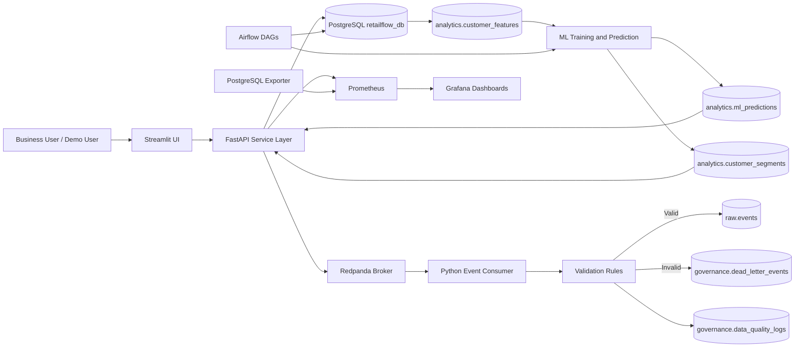
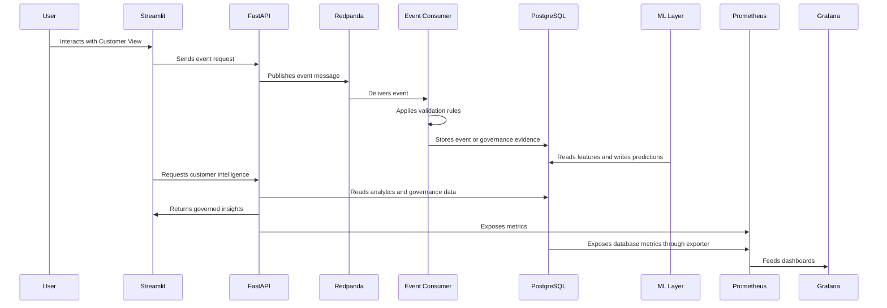

# RetailFlow

## End-to-End Retail Intelligence Platform

**Real-Time Data Pipelines • AI-Powered Customer Intelligence • Data Governance • Observability • CI/CD**

**Official repository:** https://github.com/HugoB-AS/retailflow-platform.git

RetailFlow is an end-to-end Retail Intelligence platform designed for modern e-commerce organizations that need to transform operational, behavioral and customer data into governed, monitored and actionable business intelligence.

The platform combines event-driven data ingestion, PostgreSQL data storage, data governance, customer analytics, machine learning, API serving, orchestration, CI/CD, observability and business-facing dashboards into one coherent architecture.

This README is structured in two parts.

**Part 1** presents the project vision, architecture, platform components, data domains, governance layer, real-time pipelines, AI and MLOps layer, observability layer, Streamlit application, API layer and repository structure.

**Part 2** presents installation, execution, validation commands, operational workflows, demonstration flow, CI/CD, testing, troubleshooting, milestones, limitations and future roadmap.

---

# Table of Contents

## Part 1 — Platform Overview, Architecture and Components

1. [Overview](#1-overview)
2. [Product Vision](#2-product-vision)
3. [Business Context](#3-business-context)
4. [Problem Statement](#4-problem-statement)
5. [Platform Objectives](#5-platform-objectives)
6. [Key Capabilities](#6-key-capabilities)
7. [Global Architecture](#7-global-architecture)
8. [Runtime Architecture](#8-runtime-architecture)
9. [Architecture Principles](#9-architecture-principles)
10. [Technology Stack](#10-technology-stack)
11. [Data Architecture](#11-data-architecture)
12. [Data Governance](#12-data-governance)
13. [Real-Time Data Pipelines](#13-real-time-data-pipelines)
14. [AI and MLOps](#14-ai-and-mlops)
15. [Observability and Monitoring](#15-observability-and-monitoring)
16. [Streamlit Platform](#16-streamlit-platform)
17. [FastAPI Layer](#17-fastapi-layer)
18. [Airflow Orchestration](#18-airflow-orchestration)
19. [CI/CD and Operations Overview](#19-cicd-and-operations-overview)
20. [Project Structure](#20-project-structure)

## Part 2 — Operations, Demo, Validation and Roadmap

21. Installation and prerequisites  
22. Running the platform  
23. Service URLs and credentials  
24. Health checks and validation commands  
25. Data generation and loading workflow  
26. ML training, prediction and report generation  
27. Airflow operational workflow  
28. Prometheus and Grafana workflow  
29. PostgreSQL administration and backup/restore  
30. Demonstration flow  
31. Git and repository workflow  
32. CI/CD workflow and security checks  
33. Automated tests  
34. Troubleshooting  
35. Operational runbook  
36. Development milestones  
37. Known boundaries and production roadmap  
38. Future improvements  
39. Conclusion  

---

# 1. Overview

RetailFlow is built as a complete local data and AI platform for e-commerce intelligence.

The project demonstrates how an organization can connect customer behavior, streaming ingestion, data quality, governance, machine learning, API serving, orchestration and monitoring into a single product-oriented platform.

RetailFlow is not limited to a dashboard or to isolated machine learning scripts. It is designed as an integrated system where customer events are captured, validated, stored, enriched, governed, transformed into customer intelligence and monitored through operational tools.

The core value chain is:

```text
Customer behavior
→ real-time event ingestion
→ validation and quality controls
→ PostgreSQL storage
→ governance and consent controls
→ customer feature engineering
→ machine learning models
→ FastAPI serving
→ Streamlit dashboards
→ monitoring and continuous improvement
```

This architecture supports both a business demonstration and a technical review. A business stakeholder can navigate Streamlit to understand customer value, churn risk, segmentation, governance and platform health. A technical stakeholder can inspect FastAPI, PostgreSQL, Redpanda, Airflow, Prometheus, Grafana, GitHub Actions and the repository structure.

---

# 2. Product Vision

RetailFlow is positioned as a **Retail Intelligence Platform** for modern e-commerce organizations.

The platform is designed to answer questions such as:

- Which customers have the highest value potential?
- Which customers are at risk of churn?
- Which customer segments require different actions?
- Are customer events being ingested correctly?
- Are invalid events isolated and traceable?
- Are customer data usages aligned with consent?
- Are AI models monitored and explainable?
- Is the technical platform observable?

The product vision is to transform customer events into trusted intelligence and to make this intelligence usable by business, data, AI and platform teams.

RetailFlow supports this vision through five major capability areas:

| Capability area | RetailFlow implementation |
|---|---|
| Customer Intelligence | Churn, CLV, segmentation, customer profiles and business recommendations |
| Data Engineering | Real-time event ingestion, validation, persistence and quality controls |
| Data Governance | Consent, retention, anonymization, auditability, risk and compliance evidence |
| MLOps | Model reports, registry metadata, drift monitoring, retraining and AI serving |
| Observability | Prometheus, Grafana, FastAPI metrics, PostgreSQL exporter and alert rules |

---

# 3. Business Context

RetailFlow is demonstrated in the context of a multi-category e-commerce organization.

The business generates customer and operational data through product browsing, cart interactions, checkout, purchases, returns, customer support, reviews and consent preferences. These data sources have value only when they are collected reliably, governed properly, processed consistently and converted into decisions.

The platform supports the customer lifecycle from behavior capture to business action:

```text
Acquire customers
→ observe behavior
→ detect risks
→ estimate customer value
→ group customers into segments
→ recommend actions
→ monitor outcomes
```

RetailFlow is therefore designed to serve several stakeholders.

Business teams use the platform to understand customers and prioritize actions. Data teams use it to validate ingestion, quality and traceability. AI teams use it to train, monitor and serve models. Platform teams use it to observe services, health checks, dashboards and alerts. Governance stakeholders use it to review consent, retention, quality, audit evidence and risk.

---

# 4. Problem Statement

The guiding problem is:

> How can a modern e-commerce data platform combine real-time data pipelines, artificial intelligence, data governance and observability in order to improve business decision-making?

This problem requires more than a single dashboard or a standalone model.

RetailFlow answers this problem by implementing a platform able to collect customer events, validate and persist them, govern customer data usage, build customer intelligence features, train and serve models, display actionable dashboards, orchestrate recurring workflows, validate changes through CI/CD and monitor service health.

---

# 5. Platform Objectives

RetailFlow was designed around seven main objectives.

| Objective | Description |
|---|---|
| End-to-end integration | Connect events, data, governance, AI, APIs, dashboards and monitoring |
| Real-time event processing | Capture customer interactions through an event-driven pipeline |
| Data quality visibility | Reject, isolate and explain invalid events |
| Operational governance | Represent consent, retention, audit and risks in platform assets |
| AI serving | Store predictions and expose them through FastAPI and Streamlit |
| Monitoring | Monitor models, services, metrics, alerts and workflows |
| Demonstrability | Provide a guided live demo through Streamlit and supporting tools |

The objective is not only to prove that each component can run. The objective is to show how all components work together as a coherent Retail Intelligence platform.

---

# 6. Key Capabilities

## 6.1 Customer Intelligence

RetailFlow provides a customer intelligence layer built from behavioral, transactional and analytical features.

The Customer Intelligence page supports churn risk prioritization, customer lifetime value analysis, customer segmentation, customer profile exploration and business recommendations. It is designed for business users who need to understand which customers require attention and what actions may be appropriate.

When analytics consent is not granted for a selected customer profile, customer-level AI predictions are not available or not provided in the interface. This keeps the customer intelligence experience aligned with the governance model while preserving a clear user experience.

## 6.2 Real-Time Pipelines

RetailFlow uses Redpanda as a Kafka-compatible event broker and a Python consumer to process live customer events.

The pipeline follows this pattern:

```text
Streamlit Customer View
→ FastAPI event endpoint
→ Redpanda topic
→ Python event consumer
→ validation rules
→ PostgreSQL storage
```

Valid events are persisted in the raw data layer. Invalid events are isolated in governance tables and surfaced through the Data Quality page.

## 6.3 Data Quality

Data quality is treated as an operational layer.

The event consumer validates identifiers, event types, customer references, product references and timestamps. Rejected records are stored as dead-letter events, while quality logs provide rule-level evidence. This prevents invalid records from silently entering trusted analytics and AI workflows.

## 6.4 Data Governance

RetailFlow includes governance capabilities for consent, retention, anonymization, auditability, quality, risks and AI usage.

Governance is implemented through PostgreSQL schemas, FastAPI endpoints, Airflow workflows and Streamlit dashboards. It is not only described in documentation; it is visible in the platform.

## 6.5 AI and MLOps

RetailFlow includes three AI use cases: churn prediction, CLV estimation and customer segmentation.

The ML layer includes training scripts, model artifacts, reports, prediction persistence, API serving, model monitoring, drift reports, retraining workflow evidence and a model registry file.

## 6.6 Observability

RetailFlow includes Prometheus, Grafana, PostgreSQL exporter, FastAPI metrics, Airflow health checks and Streamlit observability pages.

The monitoring layer covers service health, API behavior, database availability, alert rules and dashboard links.

## 6.7 CI/CD and Operations

RetailFlow includes GitHub Actions workflows for automated validation. The CI pipeline validates Python code, automated tests, Docker Compose configuration, Docker image build readiness and security-oriented checks.

Operational maturity is reinforced through health checks, backup and restore scripts, environment configuration examples and a read-only database role.

---

# 7. Global Architecture

RetailFlow is deployed locally through Docker Compose.

The platform is composed of specialized services connected through a shared Docker network.



This architecture separates the user interface, API layer, streaming broker, consumer logic, database, orchestration, ML workflows and monitoring stack.

---

# 8. Runtime Architecture

The main runtime flow is:



This runtime pattern demonstrates how live business actions become data records, how data records become intelligence, and how the platform remains observable.

---

# 9. Architecture Principles

## 9.1 Modularity

Each service has a focused responsibility. Streamlit handles user interaction. FastAPI handles services and event publication. Redpanda handles streaming. The event consumer handles validation and persistence. PostgreSQL stores data. Airflow orchestrates recurring workflows. Prometheus and Grafana monitor the platform.

## 9.2 Separation of Concerns

RetailFlow separates frontend interaction, API logic, event transport, validation, persistence, governance, analytics, AI outputs, orchestration and monitoring.

This makes the project easier to maintain and easier to explain during a technical review.

## 9.3 Event-Driven Design

Customer interactions are not written directly from Streamlit to PostgreSQL.

The platform uses a producer-broker-consumer pattern:

```text
UI
→ API producer
→ broker
→ consumer
→ validation
→ storage
```

This is closer to production e-commerce architectures, where ingestion must be decoupled from user-facing applications.

## 9.4 Governance by Design

Governance is embedded in consent fields, retention policies, anonymization workflow, quality logs, dead-letter events, governance dashboards, API endpoints and AI usage rules.

## 9.5 Observability by Design

RetailFlow exposes health signals, metrics, targets, dashboards and alerting rules so the platform can be monitored as an operational system.

## 9.6 Demonstrability

The platform is designed to be demonstrated live through a structured flow:

```text
Platform Overview
→ Customer View
→ Customer Intelligence
→ Data Governance
→ Data Architecture
→ Data Quality
→ AI Monitoring
→ Observability
→ CI/CD and Operations
→ Project Evidence
```

---

# 10. Technology Stack

| Layer | Technologies |
|---|---|
| User interface | Streamlit |
| API layer | FastAPI |
| Database | PostgreSQL |
| Database administration | pgAdmin |
| Streaming broker | Redpanda |
| Streaming consumer | Python |
| Orchestration | Apache Airflow |
| Machine Learning | Scikit-Learn, Pandas, Joblib |
| Metrics | Prometheus |
| Visualization | Grafana |
| Database metrics | PostgreSQL Exporter |
| Containerization | Docker, Docker Compose |
| CI/CD | GitHub Actions |
| Development environment | WSL2, Ubuntu, Python 3.11 |
| Version control | Git, GitHub |

The selected stack is intentionally practical. It allows the full platform to run locally while preserving patterns that are close to real production architectures.

---

# 11. Data Architecture

PostgreSQL is the central data platform.

It is organized into multiple logical schemas.

| Schema | Role |
|---|---|
| `raw` | Event-level and ingestion-oriented data |
| `core` | Clean business entities such as customers, products and orders |
| `analytics` | Features, predictions, segments and aggregates |
| `governance` | Consent, retention, quality, audit and dead-letter evidence |

This schema separation supports modularity, governance and analytical clarity.

## 11.1 Main Data Domains

RetailFlow covers several domains:

| Domain | Main assets |
|---|---|
| Customer | Customer profiles, status, loyalty and consent |
| Product | Products, categories, prices and suppliers |
| Commerce | Orders, order items, payments, shipments and returns |
| Interaction | Sessions, raw events, reviews and support tickets |
| Analytics | Customer features, daily sales and aggregates |
| AI | Predictions, segments, reports and model metadata |
| Governance | Consents, retention policies, logs, risks and quality evidence |

## 11.2 Analytical Layer

The analytical layer is designed around customer features, daily sales, machine learning predictions and customer segments.

Key tables include:

```text
analytics.customer_features
analytics.daily_sales
analytics.ml_predictions
analytics.customer_segments
```

These tables are used by FastAPI, Streamlit, Airflow and ML scripts.

## 11.3 Governance Layer

The governance schema is used to store consent, retention, data quality and audit evidence.

Key tables include:

```text
governance.customer_consents
governance.data_retention_policies
governance.retention_actions_log
governance.dead_letter_events
governance.data_quality_logs
```

This makes governance queryable, auditable and visible through dashboards.

---

# 12. Data Governance

RetailFlow includes a governance layer designed to make customer data usage controlled, traceable and operationally auditable.

The governance approach covers consent management, retention, anonymization, data quality, risk management, ownership, accessibility, AI governance and auditability.

## 12.1 Governance Objectives

RetailFlow governance is built around the following objectives:

| Objective | Platform implementation |
|---|---|
| Consent awareness | Consent fields and governance dashboards |
| Data retention | Retention policy table and cleanup workflow |
| Auditability | Retention logs, quality logs and dead-letter events |
| Data quality | Validation rules and Data Quality page |
| Risk management | Data risk register and governance evidence |
| Accountability | Roles, stakeholders and governance operating model |
| AI governance | Consent-aware intelligence, drift monitoring and model reports |

## 12.2 Consent Management

RetailFlow uses three customer consent dimensions:

| Consent field | Meaning |
|---|---|
| `marketing_consent` | Permission for marketing activation |
| `analytics_consent` | Permission for analytics and customer intelligence exploration |
| `personalization_consent` | Permission for personalization use cases |

The Customer Intelligence interface is connected to analytics consent. Customer-level AI predictions are provided only when analytics consent is available for the selected customer context.

## 12.3 Data Retention and Anonymization

Retention policies are stored in:

```text
governance.data_retention_policies
```

Retention actions are logged in:

```text
governance.retention_actions_log
```

The Airflow DAG `retention_cleanup` supports the retention workflow. It can identify records affected by retention rules, apply anonymization logic, update consent flags and write an audit trail.

## 12.4 Data Quality and Dead Letters

Data quality is connected to governance because invalid events represent a risk for analytics and AI.

Invalid streaming events are isolated in:

```text
governance.dead_letter_events
```

Quality rule failures are logged in:

```text
governance.data_quality_logs
```

The Data Quality page makes these controls visible and reviewable.

## 12.5 Governance Operating Model

RetailFlow uses a hybrid governance model with central standards and domain accountability.

The operating model includes Executive Sponsor, Governance Council, Data Owner, Data Steward, Data Custodian, DPO / Compliance Lead, ML Owner, Business Owner and Data Users.

The model clarifies who defines policies, who operates controls, who reviews data quality, who governs AI and who uses insights.

## 12.6 Data Risk Register

The governance layer includes a risk register covering personal data exposure, consent misuse, data quality propagation, retention failure, ML drift, operational opacity and accessibility gaps.

The risk register helps explain how governance reduces platform and business risk.

## 12.7 Data Governance Page

The Streamlit Data Governance page presents:

| Section | Purpose |
|---|---|
| Governance overview | High-level governance status |
| Consent management | Marketing, analytics and personalization consent |
| Retention and anonymization | Retention policies and audit logs |
| Operating model | Roles and responsibilities |
| Risk register | Risks, impacts, mitigations and owners |
| Governance evidence | Endpoints, tables and workflows |

This page answers how RetailFlow controls data usage, compliance, retention, quality and risk.

---

# 13. Real-Time Data Pipelines

RetailFlow includes a real-time event pipeline designed to capture customer interactions and persist them after validation.

The pipeline follows an event-driven architecture:

```text
Streamlit Customer View
→ FastAPI /events
→ Redpanda topic
→ Python consumer
→ validation rules
→ PostgreSQL raw events or governance dead-letter records
```

## 13.1 Event Sources

Events are generated from the Customer View page.

Typical customer actions include product view, add to cart, checkout started and purchase. These events represent the main stages of an e-commerce funnel.

## 13.2 Event Producer

The producer logic lives in the FastAPI service.

The endpoint receives event requests, creates or forwards event information, publishes the message to Redpanda and returns the publication status to the user interface.

## 13.3 Redpanda Broker

The main topic is:

```text
retailflow_events
```

Redpanda decouples event production from event consumption. FastAPI does not need to know when the consumer will persist the event; it publishes the message and the consumer processes it asynchronously.

## 13.4 Event Consumer

The event consumer is implemented in Python.

Key files include:

```text
pipeline/consumer/event_consumer.py
pipeline/consumer/validators.py
pipeline/consumer/writer.py
```

The consumer subscribes to the topic, parses messages, applies validation rules and writes either trusted events or governance evidence.

## 13.5 Validation Rules

Core validation checks include event identifier, allowed event type, customer existence, product existence and timestamp validity.

When a rule fails, the event is rejected from trusted persistence and is stored with diagnostic context.

## 13.6 Data Quality Integration

The pipeline is connected to the Data Quality page and governance tables.

This creates the following control flow:

```text
invalid event
→ dead-letter event
→ quality log
→ Data Quality dashboard
→ steward review
```

## 13.7 Recent Events

FastAPI exposes a recent events endpoint:

```text
GET /events/recent
```

The Customer View page uses it to show evidence that live events have been processed and persisted.

---

# 14. AI and MLOps

RetailFlow includes an AI layer designed to transform customer behavior into actionable intelligence.

The AI layer supports three main use cases:

| Use case | Objective |
|---|---|
| Churn prediction | Identify customers with higher disengagement risk |
| CLV prediction | Estimate customer value potential |
| Customer segmentation | Group customers into interpretable behavioral segments |

The models are trained, persisted, reported, stored in the database, served through FastAPI and displayed in Streamlit.

## 14.1 Feature Layer

The main feature table is:

```text
analytics.customer_features
```

It contains customer-level indicators such as total orders, total spent, average order value, recency, return rate, cart abandonment, sessions, pages viewed, support tickets, ratings, discount usage and preferred category.

## 14.2 Training Scripts

Training is implemented through:

```text
ml/src/train_churn.py
ml/src/train_clv.py
ml/src/train_segmentation.py
```

Prediction generation is implemented through:

```text
ml/src/predict.py
```

Drift evaluation is implemented through:

```text
ml/src/evaluate_drift.py
```

## 14.3 Model Artifacts and Reports

Model artifacts are stored under:

```text
ml/models/
```

Reports are stored under:

```text
ml/reports/
```

Key reports include:

```text
ml/reports/churn_model_report.json
ml/reports/clv_model_report.json
ml/reports/segmentation_model_report.json
ml/reports/model_summary.json
ml/reports/drift_report.json
ml/reports/retraining_runs.json
```

A generated model registry is available in:

```text
ml/model_registry.json
```

## 14.4 Prediction Storage

Churn and CLV outputs are stored in:

```text
analytics.ml_predictions
```

Customer segments are stored in:

```text
analytics.customer_segments
```

Persisting predictions makes AI outputs reusable by APIs, dashboards, monitoring and future operational workflows.

## 14.5 AI Serving

FastAPI exposes AI endpoints such as:

```text
GET /ai/summary
GET /ai/churn-top
GET /ai/clv-top
GET /ai/segments
GET /ai/customers
GET /ai/customer/{customer_id}
GET /ai/model-reports
GET /ai/model-report/{report_name}
```

These endpoints are consumed by the Customer Intelligence and AI Monitoring pages.

## 14.6 Customer Intelligence

The Customer Intelligence page is the business-facing AI dashboard.

It presents business overview metrics, retention priorities, customer value views, segment exploration, customer decision explorer, recommendations and governed AI profile access.

When analytics consent is not granted, customer-level AI predictions are not provided for that profile.

## 14.7 AI Monitoring

The AI Monitoring page is the model-facing dashboard.

It presents AI use cases, prediction availability, model registry, training and retraining evidence, model reports, drift monitoring, MLOps controls and the AI operational lifecycle.

The page uses high-level availability metrics such as Predicted customers and Prediction rows without requiring the user to inspect the underlying implementation details.

## 14.8 Retraining

The Airflow DAG `ml_retraining` orchestrates the ML lifecycle.

It can run churn training, CLV training, segmentation training, prediction refresh and drift evaluation.

Retraining runs are documented through the ML reports and displayed in AI Monitoring.

## 14.9 Responsible AI

RetailFlow treats AI as decision support.

Model outputs are translated into business-readable labels and recommendations. The platform supports human oversight, model monitoring, feature importance, drift awareness and consent-aware customer intelligence.

---

# 15. Observability and Monitoring

RetailFlow includes an observability layer based on Prometheus, Grafana, PostgreSQL exporter, FastAPI metrics and Streamlit monitoring views.

## 15.1 Monitoring Stack

| Component | Role |
|---|---|
| Prometheus | Collects service and database metrics |
| Grafana | Visualizes operational dashboards |
| PostgreSQL Exporter | Exposes PostgreSQL metrics |
| FastAPI `/metrics` | Exposes API metrics |
| Airflow `/health` | Exposes scheduler and metadata health |
| Streamlit Observability | Consolidates monitoring evidence |

## 15.2 Prometheus

Prometheus is configured through:

```text
monitoring/prometheus/prometheus.yml
```

Alert rules are configured under:

```text
monitoring/prometheus/rules/
```

Prometheus targets provide evidence that FastAPI and PostgreSQL exporter are being scraped.

## 15.3 Grafana

Grafana dashboards are provisioned under:

```text
monitoring/grafana/
```

The project includes dashboards such as RetailFlow API Overview and RetailFlow Platform Overview.

## 15.4 Alert Rules

RetailFlow includes Prometheus alert rules for:

```text
RetailFlowFastAPIDown
RetailFlowPostgresExporterDown
RetailFlowHighFastAPIRequestLatency
RetailFlowFastAPIHighErrorRate
RetailFlowPostgresTooManyConnections
```

These rules demonstrate a production-oriented monitoring approach.

## 15.5 Observability Page

The Streamlit Observability page presents health and monitoring evidence from FastAPI, PostgreSQL, Airflow, Prometheus, Grafana and alert rules.

It also provides direct links to monitoring tools and shows which operational signals should be reviewed during a demo.

---

# 16. Streamlit Platform

Streamlit is the main user-facing application.

It provides a guided demonstration across business, data engineering, governance, AI, observability and evidence views.

## 16.1 Streamlit Pages

The current Streamlit pages are:

| Page | Purpose |
|---|---|
| `1_Platform_Overview.py` | Business context, architecture, status and demo path |
| `2_Customer_View.py` | Customer journey simulation and event generation |
| `3_Customer_Intelligence.py` | Churn, CLV, segmentation and governed AI profile exploration |
| `4_Data_Governance.py` | Consent, retention, risks, roles and governance evidence |
| `5_Data_Architecture.py` | Architecture layers, services, data model and operational design |
| `6_Data_Quality.py` | Dead letters, quality rules, invalid events and remediation workflow |
| `7_AI_Monitoring.py` | Model registry, reports, drift, retraining and MLOps controls |
| `8_Observability.py` | Prometheus, Grafana, Airflow, platform health and alerts |
| `9_CI_CD_and_Operations.py` | GitHub Actions, security checks, backups, healthchecks and operations |
| `10_Project_Evidence.py` | Final evidence matrix and Skills evidence matrix |

## 16.2 Shared UI Components

Shared components are implemented in:

```text
streamlit_app/components.py
streamlit_app/styles/custom.css
```

The shared components support consistent cards, page sections, block badges, technical evidence, academic mapping and footer notes.

## 16.3 Streamlit Design Direction

The interface is designed to be professional, readable and demonstration-oriented.

The visible pages prioritize business interpretation and practical evidence. More technical details are available through expandable sections so the interface remains clear during a live presentation.

---

# 17. FastAPI Layer

FastAPI is the backend service layer of RetailFlow.

It connects Streamlit to PostgreSQL, Redpanda, governance tables, AI outputs, ML reports and metrics.

## 17.1 API Responsibilities

FastAPI is responsible for:

```text
product data
customer data
event publication
recent events
quality summaries
dead-letter records
governance data
AI predictions
ML reports
health checks
Prometheus metrics
```

## 17.2 Main Route Groups

| Route group | Purpose |
|---|---|
| `/products` | Product catalog and product details |
| `/events` | Event publishing and recent events |
| `/quality` | Data quality summaries and dead-letter events |
| `/governance` | Consent, retention and governance KPIs |
| `/ai` | Predictions, segments, customers and model reports |
| `/health` | API and database health |
| `/metrics` | Prometheus-compatible metrics |

## 17.3 API Documentation

Swagger UI is available at:

```text
http://127.0.0.1:8000/docs
```

This page is useful for testing endpoints and explaining the service contract.

---

# 18. Airflow Orchestration

Airflow orchestrates scheduled workflows for analytics, data quality, ML and governance.

## 18.1 Main DAGs

| DAG | Purpose |
|---|---|
| `daily_sales_aggregation` | Refresh daily sales aggregates |
| `daily_data_quality` | Check quality indicators and dead-letter volumes |
| `ml_retraining` | Retrain models, refresh predictions and evaluate drift |
| `retention_cleanup` | Apply retention and anonymization logic |

Airflow provides workflow visibility and demonstrates that RetailFlow is not limited to ad hoc scripts.

## 18.2 Orchestration Value

Airflow supports:

```text
scheduled execution
task visibility
workflow dependency management
data quality checks
ML lifecycle automation
retention and anonymization evidence
```

---

# 19. CI/CD and Operations Overview

RetailFlow includes GitHub Actions as the automated validation layer.

The CI/CD workflow validates the repository through Python compilation, automated tests, Docker Compose validation, Docker image build checks and security-oriented reports.

## 19.1 CI/CD Capabilities

| Capability | Implementation |
|---|---|
| Python validation | `python -m compileall` |
| Automated tests | `pytest` |
| Docker Compose validation | `docker compose config` |
| Docker image build validation | FastAPI, Streamlit and consumer images |
| Security checks | Python dependency and code security reports |
| Report artifacts | CI-generated artifacts for review |

## 19.2 Operations Capabilities

RetailFlow includes operational assets such as:

| Capability | Location |
|---|---|
| Example environment configuration | `.env.example` |
| PostgreSQL backup script | `scripts/backup_postgres.sh` |
| PostgreSQL restore script | `scripts/restore_postgres.sh` |
| Docker healthchecks | `docker-compose.yml` |
| Read-only database role | PostgreSQL initialization scripts |
| Monitoring documentation | `docs/MONITORING.md` and `docs/MONITORING_EVIDENCE.md` |
| CI/CD documentation | `docs/CI_CD.md` |
| Infrastructure operations documentation | `docs/INFRA_OPERATIONS.md` |

The CI/CD and Operations Streamlit page makes these proofs visible in the application.

---

# 20. Project Structure

RetailFlow follows a modular repository structure.

```text
retailflow-platform/
├── airflow/
├── api/
├── data/
├── data_generator/
├── database/
├── docs/
├── k8s/
├── kafka_kraft/
├── ml/
├── monitoring/
├── pipeline/
├── scripts/
├── streamlit_app/
├── tests/
├── docker-compose.yml
├── Makefile
├── README.md
├── requirements.txt
└── requirements-dev.txt
```

## 20.1 Repository Areas

| Directory | Purpose |
|---|---|
| `airflow/` | DAGs and orchestration logic |
| `api/` | FastAPI backend |
| `data/` | Generated and processed datasets |
| `data_generator/` | Dataset generation and loading scripts |
| `database/` | PostgreSQL initialization scripts and migrations |
| `docs/` | Technical documentation |
| `k8s/` | Future Kubernetes manifests |
| `kafka_kraft/` | Kafka KRaft experimentation area |
| `ml/` | ML training, prediction, models, reports and registry |
| `monitoring/` | Prometheus and Grafana configuration |
| `pipeline/` | Event producer and consumer logic |
| `scripts/` | Operational scripts such as backup and restore |
| `streamlit_app/` | Streamlit application and shared UI components |
| `tests/` | Automated tests |
| `.github/workflows/` | GitHub Actions CI/CD workflows |

## 20.2 API Directory

```text
api/
├── Dockerfile
├── app/
│   ├── database.py
│   ├── main.py
│   ├── routes/
│   ├── schemas/
│   └── services/
└── requirements.txt
```

## 20.3 Streamlit Directory

```text
streamlit_app/
├── Dockerfile
├── app.py
├── components.py
├── pages/
│   ├── 1_Platform_Overview.py
│   ├── 2_Customer_View.py
│   ├── 3_Customer_Intelligence.py
│   ├── 4_Data_Governance.py
│   ├── 5_Data_Architecture.py
│   ├── 6_Data_Quality.py
│   ├── 7_AI_Monitoring.py
│   ├── 8_Observability.py
│   ├── 9_CI_CD_and_Operations.py
│   └── 10_Project_Evidence.py
├── requirements.txt
└── styles/
    └── custom.css
```

## 20.4 ML Directory

```text
ml/
├── models/
├── reports/
├── src/
├── tests/
└── model_registry.json
```

## 20.5 Monitoring Directory

```text
monitoring/
├── grafana/
│   ├── dashboards/
│   └── provisioning/
└── prometheus/
    ├── prometheus.yml
    └── rules/
```

## 20.6 Documentation Directory

```text
docs/
├── CI_CD.md
├── INFRA_OPERATIONS.md
├── MONITORING.md
├── MONITORING_EVIDENCE.md
└── ...
```

---

## 21. Installation and Local Runtime

RetailFlow is designed to run locally through Docker Compose. The local runtime reproduces the main platform components required to demonstrate the full Retail Intelligence lifecycle: PostgreSQL, Redpanda, FastAPI, the event consumer, Streamlit, Airflow, Prometheus, Grafana and PostgreSQL exporter.

The recommended environment is WSL2 Ubuntu with Python 3.11 and Docker Compose V2. The platform can also run on a Linux environment with Docker Engine, provided that the ports used by the platform are available.

### 21.1 Prerequisites

| Requirement | Recommended setup |
|---|---|
| Operating system | Linux or WSL2 Ubuntu |
| Python | 3.11 |
| Docker | Docker Desktop or Docker Engine |
| Docker Compose | Compose V2 |
| Git | Current stable version |
| Shell | Bash-compatible terminal |
| Browser | Chrome, Edge, Firefox or equivalent |

The project is normally operated from the repository root:

```bash
cd ~/projects/Master_Thesis/retailflow-platform
```

### 21.2 Clone the Repository

```bash
git clone https://github.com/HugoB-AS/retailflow-platform.git
cd retailflow-platform
git checkout develop
```

The `develop` branch is the validated project branch used for the current RetailFlow implementation.

### 21.3 Python Environment

A Python virtual environment is useful for local scripts, tests, code validation and development tools. Most runtime services are executed through Docker Compose.

```bash
python3.11 -m venv .venv
source .venv/bin/activate
python -m pip install --upgrade pip setuptools wheel
```

Install development dependencies when local validation or testing is needed:

```bash
pip install -r requirements-dev.txt
```

Component dependencies can also be installed locally when running scripts outside Docker:

```bash
pip install -r data_generator/requirements.txt
pip install -r ml/requirements.txt
pip install -r api/requirements.txt
pip install -r pipeline/requirements.txt
pip install -r streamlit_app/requirements.txt
```

### 21.4 Environment Configuration

RetailFlow includes an example environment file to document expected configuration values. The goal is to keep credentials, hostnames and runtime settings explicit without hardcoding them in the application code.

```bash
cp .env.example .env
```

The default Docker Compose environment is designed for local demonstration. For production or shared environments, credentials and secrets must be managed through a dedicated secret management mechanism.

### 21.5 Start the Platform

From the repository root, start the platform with:

```bash
docker compose up -d
```

To rebuild images after code changes:

```bash
docker compose up -d --build
```

To rebuild only the user interface after Streamlit changes:

```bash
docker compose up -d --build streamlit
```

To rebuild the API and UI together:

```bash
docker compose up -d --build fastapi streamlit
```

### 21.6 Check Container Status

```bash
docker compose ps
```

Expected core services include PostgreSQL, pgAdmin, Redpanda, FastAPI, the event consumer, Streamlit, Airflow webserver and scheduler, Prometheus, Grafana and PostgreSQL exporter.

### 21.7 Service URLs

| Component | URL |
|---|---|
| Streamlit UI | `http://127.0.0.1:8501` |
| FastAPI documentation | `http://127.0.0.1:8000/docs` |
| FastAPI health | `http://127.0.0.1:8000/health` |
| pgAdmin | `http://127.0.0.1:5050` |
| Airflow | `http://127.0.0.1:8080` |
| Prometheus | `http://127.0.0.1:9090` |
| Grafana | `http://127.0.0.1:3000` |
| PostgreSQL exporter | `http://127.0.0.1:9187/metrics` |
| Redpanda Admin API | `http://127.0.0.1:9644` |

### 21.8 Default Local Access

The local PostgreSQL database is exposed on `localhost:5432`. Inside the Docker network, services use the hostname `postgres`. The default database is `retailflow_db`.

pgAdmin can be used to inspect tables, schemas, events, governance logs and predictions. In pgAdmin, the PostgreSQL server should be configured with host `postgres`, port `5432`, database `retailflow_db`, user `retailflow` and password `retailflow`.

Grafana is available locally on port `3000`. The default local demonstration credentials are `admin / admin` unless changed in the environment configuration.

---

## 22. Running and Validating the Platform

After the containers are started, the platform should be validated before running a demonstration. Validation confirms that the API, database, UI, orchestration and monitoring components are reachable.

### 22.1 Core Health Checks

FastAPI health:

```bash
curl http://127.0.0.1:8000/health
```

Streamlit health:

```bash
curl -i http://127.0.0.1:8501/_stcore/health
```

Prometheus readiness:

```bash
curl http://127.0.0.1:9090/-/ready
```

Grafana health:

```bash
curl http://127.0.0.1:3000/api/health
```

Airflow health:

```bash
curl http://127.0.0.1:8080/health
```

PostgreSQL exporter metrics:

```bash
curl http://127.0.0.1:9187/metrics | head
```

### 22.2 API Validation

Product catalog:

```bash
curl "http://127.0.0.1:8000/products?limit=3"
```

Governance summary:

```bash
curl -s "http://127.0.0.1:8000/governance/summary" | python -m json.tool
```

AI summary:

```bash
curl -s "http://127.0.0.1:8000/ai/summary" | python -m json.tool
```

Consent-aware customer list:

```bash
curl -s "http://127.0.0.1:8000/ai/customers?limit=3&analytics_consent_only=true" | python -m json.tool
```

Quality summary:

```bash
curl -s "http://127.0.0.1:8000/quality/summary" | python -m json.tool
```

Recent events:

```bash
curl -s "http://127.0.0.1:8000/events/recent?limit=5" | python -m json.tool
```

### 22.3 Monitoring Validation

Prometheus targets:

```bash
curl -s "http://127.0.0.1:9090/api/v1/targets" | python -m json.tool
```

PostgreSQL exporter status in Prometheus:

```bash
curl -s "http://127.0.0.1:9090/api/v1/query?query=pg_up" | python -m json.tool
```

FastAPI target status in Prometheus:

```bash
curl -s "http://127.0.0.1:9090/api/v1/query?query=up%7Bjob%3D%22retailflow-fastapi%22%7D" | python -m json.tool
```

### 22.4 Python and Compose Validation

Before committing changes, the recommended local validation is:

```bash
python -m compileall api ml pipeline data_generator tests streamlit_app
docker compose config --quiet
```

When Streamlit is modified, rebuild and check the UI service:

```bash
docker compose up -d --build streamlit
curl -i http://127.0.0.1:8501/_stcore/health
```

When API code is modified, rebuild and check FastAPI:

```bash
docker compose up -d --build fastapi
curl http://127.0.0.1:8000/health
```

---

## 23. Streamlit Demonstration Flow

The Streamlit application is the main demonstration interface. It is designed to guide the audience through the complete RetailFlow narrative, from business context to operational evidence.

### 23.1 Recommended Demo Order

```text
Home
→ Platform Overview
→ Customer View
→ Customer Intelligence
→ Data Governance
→ Data Architecture
→ Data Quality
→ AI Monitoring
→ Observability
→ CI/CD and Operations
→ Project Evidence
```

This order presents RetailFlow as an integrated platform rather than a set of independent tools. It starts with the product vision, demonstrates customer behavior, shows the intelligence layer, explains governance and architecture, then closes with monitoring, operations and evidence.

### 23.2 Platform Overview

The Platform Overview page introduces the project scope, platform positioning, main architecture and demonstration logic. It is the best starting point for explaining that RetailFlow combines real-time data pipelines, governance, AI and observability in a single Retail Intelligence platform.

The key message is that RetailFlow is an end-to-end platform. It does not only display dashboards. It connects customer events, governed data, AI outputs, APIs, orchestration and operational monitoring.

### 23.3 Customer View

The Customer View page simulates an e-commerce customer journey. It allows the user to browse products, select items, generate customer events, start checkout and complete a purchase. These actions are sent to FastAPI, published to Redpanda and processed by the event consumer.

The page also shows recent events so the user can verify that the event pipeline is active and that generated events are visible from the application layer.

### 23.4 Customer Intelligence

The Customer Intelligence page is the business-facing AI dashboard. It presents churn, customer lifetime value, segmentation and business recommendations. It connects predictions and segments to practical decision support.

The page includes a customer decision explorer. When a customer does not have analytics consent, customer-level AI outputs are not provided in the interface. This demonstrates that the customer intelligence experience is connected to the governance layer while keeping the business narrative understandable for non-technical users.

### 23.5 Data Governance

The Data Governance page presents consent management, retention policies, anonymization evidence, stakeholder responsibilities, regulatory alignment, risk management and governance operating principles.

This page shows that governance is implemented through the platform. It is visible in PostgreSQL tables, FastAPI endpoints, Airflow workflows and Streamlit dashboards.

### 23.6 Data Architecture

The Data Architecture page explains the platform structure, PostgreSQL schemas, service responsibilities, data flows, runtime infrastructure and operational design choices. It is useful for explaining why the platform is modular, how services communicate and how the architecture supports maintainability.

The page connects the theoretical architecture to implemented services such as PostgreSQL, Redpanda, FastAPI, Streamlit, Airflow, Prometheus and Grafana.

### 23.7 Data Quality

The Data Quality page demonstrates how invalid events are detected, isolated and reviewed. It exposes dead-letter events, failed quality rules, severity, impacted event types and remediation logic.

The page is a key proof that the real-time pipeline does not blindly persist invalid data. Data quality is treated as an operational and governance concern.

### 23.8 AI Monitoring

The AI Monitoring page is the MLOps dashboard. It presents prediction availability, model registry information, retraining runs, model reports, drift monitoring and MLOps controls.

The page uses consent-aware counts for visible AI-authorized prediction indicators. It also exposes model artifacts and operational evidence such as reports, drift output and retraining logs.

### 23.9 Observability

The Observability page consolidates platform monitoring. It shows FastAPI status, PostgreSQL status, Prometheus targets, Grafana dashboard access, Airflow health and alert rules.

This page demonstrates that RetailFlow is not only functional, but also monitorable. It provides links and evidence for platform health, service metrics and operational alerting.

### 23.10 CI/CD and Operations

The CI/CD and Operations page explains the engineering workflow, GitHub Actions validation, Docker build checks, security reports, backup and restore scripts, healthchecks and operational documentation.

This page is important for demonstrating professional software engineering practice. It connects the codebase to continuous validation and operational readiness.

### 23.11 Project Evidence

The Project Evidence page is the final proof matrix. It links implementation assets to academic blocks, skills and evaluation evidence. It includes a final evidence matrix, a skills evidence matrix, a live demo path and a tool map.

This page is designed to be used near the end of the demonstration to prove that the platform covers governance, architecture, pipelines, AI, monitoring, CI/CD and operations.

---

## 24. FastAPI Service Layer

FastAPI is the backend service layer of RetailFlow. It connects Streamlit to PostgreSQL, publishes live events to Redpanda, exposes governance and quality data, serves AI outputs and provides metrics to Prometheus.

### 24.1 Main Route Groups

| Route group | Purpose |
|---|---|
| `/health` | API and database health checks |
| `/products` | Product catalog and product details |
| `/events` | Live event publishing and recent event access |
| `/quality` | Dead-letter and data quality summaries |
| `/governance` | Consent, retention and governance KPIs |
| `/ai` | Predictions, customer intelligence and model reports |
| `/metrics` | Prometheus-compatible metrics |

### 24.2 API Documentation

FastAPI automatically exposes Swagger documentation:

```text
http://127.0.0.1:8000/docs
```

The documentation can be used to test endpoints, inspect payload structures and demonstrate the API serving layer.

### 24.3 Event API

The event API receives customer journey events and publishes them to Redpanda. This design keeps the UI separate from event persistence and allows the event consumer to apply validation rules before storage.

Main endpoints:

| Endpoint | Purpose |
|---|---|
| `POST /events` | Publish a customer event |
| `GET /events/recent` | Return recent persisted events |

### 24.4 Governance API

The governance API exposes consent, retention and governance indicators to Streamlit. It is consumed by both Data Governance and AI Monitoring when governance-linked metrics are needed.

Main endpoints:

| Endpoint | Purpose |
|---|---|
| `GET /governance/summary` | Governance KPIs and consent summary |
| `GET /governance/customer-consents` | Customer consent sample |
| `GET /governance/retention-policies` | Retention policy definitions |
| `GET /governance/retention-actions` | Retention and anonymization actions |

### 24.5 Quality API

The quality API exposes dead-letter and quality information. It makes rejected events visible to Streamlit and supports pipeline quality monitoring.

Main endpoints:

| Endpoint | Purpose |
|---|---|
| `GET /quality/dead-letters` | List rejected events |
| `GET /quality/summary` | Data quality rule summary |
| `GET /quality/dead-letter-summary` | Aggregated dead-letter statistics |

### 24.6 AI API

The AI API exposes customer intelligence and model reporting. It allows Streamlit to consume model outputs without directly reading model files or querying raw prediction tables.

Main endpoints:

| Endpoint | Purpose |
|---|---|
| `GET /ai/summary` | Prediction and segment summary |
| `GET /ai/churn-top` | Highest churn risk customers |
| `GET /ai/clv-top` | Highest predicted CLV customers |
| `GET /ai/segments` | Customer segment summaries |
| `GET /ai/customers` | Enriched customer list with AI and consent fields |
| `GET /ai/customer/{customer_id}` | Full customer AI profile when available |
| `GET /ai/model-reports` | Available model reports |
| `GET /ai/model-report/{report_name}` | Detailed model report content |

### 24.7 Metrics API

The metrics endpoint exposes Prometheus-compatible metrics:

```text
GET /metrics
```

Prometheus scrapes this endpoint and Grafana visualizes the collected metrics.

---

## 25. Data and ML Workflows

RetailFlow includes data generation, PostgreSQL loading, feature engineering, model training, prediction generation and drift evaluation. These workflows can be run manually for development and through Airflow for scheduled orchestration.

### 25.1 Data Generation

Generate a local dataset:

```bash
python data_generator/generate_dataset.py --profile medium
```

Load the generated dataset into PostgreSQL:

```bash
python data_generator/loaders/load_to_postgres.py
```

The generated data covers customers, products, suppliers, orders, payments, returns, sessions, events, support tickets, reviews, consent fields, customer features and analytics-ready tables.

### 25.2 ML Training

Train the three core models:

```bash
python -m ml.src.train_churn
python -m ml.src.train_clv
python -m ml.src.train_segmentation
```

The training scripts produce model artifacts and reports under `ml/models/` and `ml/reports/`.

### 25.3 Prediction Refresh

Refresh predictions and segments:

```bash
python -m ml.src.predict
```

Predictions are stored in PostgreSQL and served through the AI API.

### 25.4 Drift Evaluation

Generate the drift report:

```bash
python -m ml.src.evaluate_drift
```

The drift report is made available to the AI Monitoring page.

### 25.5 Model Registry and Retraining Logs

RetailFlow includes generated model registry evidence and retraining run logs. These files support MLOps traceability and are displayed in AI Monitoring.

Important artifacts include:

| Artifact | Purpose |
|---|---|
| `ml/model_registry.json` | Model registry evidence |
| `ml/reports/retraining_runs.json` | Retraining execution log |
| `ml/reports/model_summary.json` | Consolidated model summary |
| `ml/reports/drift_report.json` | Drift monitoring output |

### 25.6 Airflow Orchestration

Airflow provides the scheduled workflow layer. Main DAGs include daily sales aggregation, daily data quality, weekly ML retraining and retention cleanup.

| DAG | Purpose |
|---|---|
| `daily_sales_aggregation` | Refresh analytical sales aggregates |
| `daily_data_quality` | Execute scheduled data quality checks |
| `ml_retraining` | Train models, refresh predictions and evaluate drift |
| `retention_cleanup` | Apply retention and anonymization logic |

Airflow is available at:

```text
http://127.0.0.1:8080
```

---

## 26. Monitoring, Alerting and Operations

RetailFlow includes operational monitoring through Prometheus, Grafana, PostgreSQL exporter, healthchecks and Streamlit Observability. The monitoring layer helps prove that services are available, metrics are collected and operational risks are visible.

### 26.1 Prometheus

Prometheus is available at:

```text
http://127.0.0.1:9090
```

Prometheus scrapes FastAPI metrics and PostgreSQL exporter metrics. The main configuration is stored in:

```text
monitoring/prometheus/prometheus.yml
```

Alerting rules are stored under:

```text
monitoring/prometheus/rules/
```

### 26.2 Grafana

Grafana is available at:

```text
http://127.0.0.1:3000
```

Grafana dashboards provide visual monitoring for the RetailFlow API and the platform overview. Dashboard provisioning is stored under:

```text
monitoring/grafana/
```

### 26.3 PostgreSQL Exporter

PostgreSQL exporter exposes database metrics to Prometheus. It allows the platform to monitor PostgreSQL availability and connection metrics.

Key validation command:

```bash
curl -s "http://127.0.0.1:9090/api/v1/query?query=pg_up" | python -m json.tool
```

### 26.4 Alert Rules

RetailFlow includes Prometheus alert rules covering service availability, API latency, API error rate and PostgreSQL connection risk.

Main alerts include:

| Alert | Purpose |
|---|---|
| `RetailFlowFastAPIDown` | Detect FastAPI unavailability |
| `RetailFlowPostgresExporterDown` | Detect PostgreSQL exporter unavailability |
| `RetailFlowHighFastAPIRequestLatency` | Detect high API latency |
| `RetailFlowFastAPIHighErrorRate` | Detect high API server error rate |
| `RetailFlowPostgresTooManyConnections` | Detect PostgreSQL connection pressure |

### 26.5 Healthchecks

Docker Compose healthchecks are used for core services. They help the local runtime report whether services are healthy and support a more reliable demonstration environment.

### 26.6 Backup and Restore

RetailFlow includes PostgreSQL backup and restore scripts. They support operational recovery and demonstrate that database continuity is considered in the platform design.

Typical workflow:

```bash
./scripts/backup_postgres.sh
```

```bash
./scripts/restore_postgres.sh backups/<backup_file>.sql
```

Local backup files are ignored by Git to avoid committing environment-specific database dumps.

### 26.7 Read-Only Database Role

The platform includes a read-only PostgreSQL role. This supports the principle of least privilege and demonstrates a practical security control for database access.

This role can be used for inspection, reporting or restricted analytical use cases where write access is not required.

---

## 27. CI/CD and Quality Validation

GitHub Actions is used as the continuous integration layer. The workflow validates the codebase, tests, Docker Compose configuration and Docker image builds.

### 27.1 CI/CD Objectives

The CI/CD pipeline provides automated confidence that core platform components remain valid after code changes. It supports software engineering discipline, reduces regression risk and demonstrates a production-oriented development process.

### 27.2 Workflow Coverage

The CI workflow includes Python validation, automated tests, Docker Compose validation, Docker image build validation and security reporting.

| Area | CI/CD contribution |
|---|---|
| Python code | Syntax validation and tests |
| API layer | OpenAPI and endpoint-level checks |
| Data quality | Validator and rejection behavior tests |
| ML artifacts | Report and registry validation |
| Docker Compose | Configuration validation |
| Docker images | Build validation for deployable services |
| Security | Automated dependency and code security reports |

### 27.3 Recommended Local Checks Before Commit

```bash
python -m compileall api ml pipeline data_generator tests streamlit_app
python -m pytest tests/test_*.py -q
docker compose config --quiet
```

### 27.4 GitHub Actions Result

The `develop` branch should remain green in GitHub Actions before being considered stable for demonstration. A green CI result confirms that the repository passed the automated validation checks associated with the workflow.

### 27.5 Security Reports

The CI includes automated security checks to detect vulnerable Python dependencies and common security-sensitive code patterns. These checks generate report artifacts that can be reviewed from GitHub Actions.

---

## 28. Operational Runbook

This runbook summarizes the most common operational commands.

### 28.1 Full Restart

```bash
docker compose down
docker compose up -d
docker compose ps
```

### 28.2 Full Rebuild

```bash
docker compose down
docker compose up -d --build
docker compose ps
```

### 28.3 Rebuild Selected Services

```bash
docker compose up -d --build fastapi
```

```bash
docker compose up -d --build streamlit
```

```bash
docker compose up -d --build fastapi streamlit
```

### 28.4 Logs

```bash
docker logs retailflow_fastapi --tail 100
```

```bash
docker logs retailflow_streamlit --tail 100
```

```bash
docker logs retailflow_event_consumer --tail 100
```

```bash
docker logs retailflow_airflow_scheduler --tail 100
```

```bash
docker logs retailflow_prometheus --tail 100
```

```bash
docker logs retailflow_grafana --tail 100
```

### 28.5 PostgreSQL Access

From the host:

```bash
psql -h localhost -p 5432 -U retailflow -d retailflow_db
```

From Docker:

```bash
docker exec -it retailflow_postgres psql -U retailflow -d retailflow_db
```

### 28.6 Inspect Important Tables

```sql
SELECT COUNT(*) FROM raw.events;
SELECT COUNT(*) FROM governance.dead_letter_events;
SELECT COUNT(*) FROM governance.data_quality_logs;
SELECT COUNT(*) FROM analytics.ml_predictions;
SELECT COUNT(*) FROM analytics.customer_segments;
```

### 28.7 Validate Streamlit Inside Docker

```bash
docker exec -it retailflow_streamlit ls /app/streamlit_app/pages
```

```bash
docker exec -it retailflow_streamlit ls /app/ml/reports
```

### 28.8 Validate Prometheus Alerts

```bash
curl -s "http://127.0.0.1:9090/api/v1/rules" | python -m json.tool
```

```bash
curl -s "http://127.0.0.1:9090/api/v1/alerts" | python -m json.tool
```

---

## 29. Troubleshooting

### 29.1 Docker Is Not Running

If Docker is not running, commands may fail with a daemon connection error. Start Docker Desktop or Docker Engine, wait until it is ready and retry:

```bash
docker ps
```

### 29.2 Containers Do Not Start

Inspect service status and logs:

```bash
docker compose ps
docker compose logs --tail=100
```

If required, rebuild the platform:

```bash
docker compose up -d --build
```

### 29.3 FastAPI Cannot Reach PostgreSQL

Check PostgreSQL and FastAPI logs:

```bash
docker compose ps postgres
docker logs retailflow_fastapi --tail 100
curl http://127.0.0.1:8000/health
```

Inside Docker, the database hostname is `postgres`, not `localhost`.

### 29.4 Streamlit Cannot Reach FastAPI

Check Streamlit logs and FastAPI health:

```bash
docker logs retailflow_streamlit --tail 100
curl http://127.0.0.1:8000/health
```

Inside Docker, Streamlit uses `http://fastapi:8000`.

### 29.5 Streamlit Shows an Old Version

Rebuild the Streamlit image and force-refresh the browser:

```bash
docker compose up -d --build streamlit
curl -i http://127.0.0.1:8501/_stcore/health
```

Then use `Ctrl + F5` or a private browser window.

### 29.6 Prometheus Target Is Down

Open the Prometheus targets page:

```text
http://127.0.0.1:9090/targets
```

Check configuration and restart Prometheus if needed:

```bash
cat monitoring/prometheus/prometheus.yml
docker compose restart prometheus
```

### 29.7 PostgreSQL Exporter Is Not Up

```bash
docker compose ps postgres_exporter
curl http://127.0.0.1:9187/metrics | head
curl -s "http://127.0.0.1:9090/api/v1/query?query=pg_up"
```

### 29.8 Airflow Needs Time to Initialize

Airflow may require additional startup time. Wait, then retry the health endpoint:

```bash
sleep 10
curl http://127.0.0.1:8080/health
```

### 29.9 Model Reports Are Missing

Check report files and regenerate the ML layer if needed:

```bash
ls -lh ml/reports
python -m ml.src.train_churn
python -m ml.src.train_clv
python -m ml.src.train_segmentation
python -m ml.src.predict
python -m ml.src.evaluate_drift
```

Rebuild services that read reports from the container image:

```bash
docker compose up -d --build fastapi streamlit
```

### 29.10 Git Working Tree Is Not Clean

Check local changes:

```bash
git status
git diff --stat
```

Commit intended changes or restore unintended ones before continuing.

---

## 30. Repository Workflow

RetailFlow uses Git and GitHub as the source control workflow. The `develop` branch is the validated project branch.

### 30.1 Standard Workflow

```bash
git checkout develop
git pull origin develop
git checkout -b feature/my-feature
```

After changes:

```bash
git status
git add .
git commit -m "Describe the change"
git push origin feature/my-feature
```

Merge into develop once the change is validated.

### 30.2 Commit Guidelines

Commits should be small, explicit and tied to a clear change. Recommended commit messages use direct wording such as `add Prometheus alert rules`, `improve Streamlit AI monitoring page` or `document infrastructure operations`.

### 30.3 Stable Validation

A change is considered stable when:

```text
local validation passes
→ Docker services start
→ Streamlit and FastAPI are healthy
→ GitHub Actions is green
→ working tree is clean
```

### 30.4 Current Validated Baseline

The current validated baseline is on the `develop` branch with GitHub Actions green. The latest Streamlit and documentation improvements include the final consistency fixes and AI monitoring consent metrics.

---

## 31. Project Evidence and Evaluation Mapping

RetailFlow includes a Project Evidence page that connects the implementation to academic blocks and expected skills. This page is designed to support the final evaluation by showing where each proof can be found in the platform.

### 31.1 Evidence Matrix

The evidence matrix maps each major block to the concrete implementation areas.

| Block | Main evidence |
|---|---|
| Bloc 1 | Data governance, consent, retention, risks, auditability and accessibility |
| Bloc 2 | Data architecture, Docker Compose, PostgreSQL, services, monitoring and operations |
| Bloc 3 | Real-time pipeline, event validation, dead-letter handling, quality and traceability |
| Bloc 4 | AI models, MLOps, serving, monitoring, retraining, drift and CI/CD |

### 31.2 Skills Evidence Matrix

The Skills Evidence Matrix maps detailed evaluation criteria to the implementation. It identifies the relevant tools, files and pages to inspect for each skill. This provides a structured way to prove coverage of governance, architecture, real-time pipelines, AI and professional engineering practices.

### 31.3 Live Evidence Tools

Key evidence tools include Streamlit, FastAPI Docs, pgAdmin, Airflow, Prometheus, Grafana, GitHub Actions and VSCode. Each tool supports a different type of proof: business demonstration, API contract, database inspection, orchestration, monitoring, CI validation and source code review.

---

## 32. Future Improvements

RetailFlow already demonstrates a complete end-to-end Retail Intelligence platform. Future improvements would focus on enterprise hardening, cloud deployment, advanced MLOps and stronger governance automation.

### 32.1 Enterprise Access Control

Future versions should add authentication, authorization, role-based access control, user-level audit logging and API scopes. This would allow the platform to separate business users, data stewards, ML engineers, platform engineers and administrators.

### 32.2 Data Catalog and Automated Lineage

A formal data catalog would improve discoverability, ownership visibility and metadata management. Automated lineage could connect source events, transformations, database tables, API endpoints and dashboards.

### 32.3 Production Model Registry

A production-grade model registry would improve model versioning, model promotion, rollback, approval workflows and governance around ML artifacts.

### 32.4 Advanced Drift and Fairness Monitoring

The existing drift report can be extended with automated alerts, feature-level thresholds, fairness checks and business impact analysis.

### 32.5 Cloud and Kubernetes Deployment

Future deployment could use a container registry, managed PostgreSQL, managed Kafka-compatible streaming, Kubernetes, cloud monitoring and managed Airflow.

### 32.6 Advanced Alerting and Incident Response

Prometheus alert rules can be extended with Grafana-managed alerting, Slack or email notifications, escalation policies and incident runbooks.

### 32.7 Near Real-Time Feature Refresh

The platform can evolve toward near real-time customer feature updates. This would allow faster refresh of customer intelligence signals after behavioral events.

### 32.8 Recommendation Engine

A future AI use case could provide product recommendations or next-best-action logic based on segment, category preference, churn risk and CLV.

### 32.9 Production Readiness Checklist

Before a production deployment, RetailFlow would require stronger IAM, secret management, backup retention policy, disaster recovery testing, load testing, security testing, privacy impact assessment, model approval workflows and automated deployment.

---

## 33. Conclusion

RetailFlow demonstrates how a modern e-commerce organization can connect customer behavior, governed data, real-time pipelines, AI and observability inside one coherent platform.

The project covers the complete path from event generation to business decision support. Customer interactions are ingested through an event-driven pipeline, validated before persistence, stored in PostgreSQL, transformed into features, used by ML models, exposed through FastAPI and visualized in Streamlit.

Governance is embedded through consent management, retention policies, anonymization evidence, data quality logs, dead-letter handling and auditability. AI is treated as a platform capability with model reports, prediction storage, serving endpoints, drift monitoring and retraining workflows. Observability is supported by Prometheus, Grafana, PostgreSQL exporter, alert rules and healthchecks.

RetailFlow is therefore not only a technical prototype. It is a professional demonstration of a data and AI platform that connects data engineering, governance, machine learning, operations and business value.

---

## 34. Quick Reference

Repository:

```text
https://github.com/HugoB-AS/retailflow-platform.git
```

Main branch:

```text
develop
```

Start platform:

```bash
docker compose up -d
```

Validate platform:

```bash
curl http://127.0.0.1:8000/health
curl -i http://127.0.0.1:8501/_stcore/health
curl http://127.0.0.1:9090/-/ready
curl http://127.0.0.1:3000/api/health
```

Main UI:

```text
http://127.0.0.1:8501
```

FastAPI Docs:

```text
http://127.0.0.1:8000/docs
```

Prometheus:

```text
http://127.0.0.1:9090
```

Grafana:

```text
http://127.0.0.1:3000
```

Airflow:

```text
http://127.0.0.1:8080
```
