# RetailFlow — Official Deliverables Full Package
**Name:** Hugo BRAUN
This document consolidates the official written deliverables of the RetailFlow project.

The full deliverable package is structured into five parts:

1. **Part 1 — Executive Context and Integrated Project Presentation**
2. **Part 2 — Data Governance Plan**
3. **Part 3 — Data Architecture Design**
4. **Part 4 — Real-Time Data Pipeline Design**
5. **Part 5 — Artificial Intelligence Solution Design**

The project source code, configuration files, technical implementation and CI/CD workflows are available in the GitHub repository below:

**GitHub repository:** https://github.com/HugoB-AS/retailflow-platform.git

---

# RetailFlow — Executive Context and Integrated Project Presentation

## End-to-End Retail Intelligence Platform

**Real-Time Data Pipelines • AI-Powered Customer Intelligence • Data Governance • Observability • CI/CD Evidence**

**Document type:** Official written deliverable  
**Part:** P1 — Executive context and integrated project presentation  
**Platform:** RetailFlow Platform  
**Updated scope:** final Streamlit platform, governance-aware AI views, monitoring evidence, CI/CD evidence and project evidence matrix  
**Language:** English  

---

## Document Purpose

This document presents the general context, business positioning, implementation scope, architecture vision and integrated storyline of the RetailFlow project.

It is the first document in the official RetailFlow deliverable package:

1. **P1 — Executive Context and Integrated Project Presentation**
2. **P2 — Data Governance Plan**
3. **P3 — Data Architecture Design**
4. **P4 — Real-Time Data Pipeline Design**
5. **P5 — Artificial Intelligence Solution Design**

The objective of this first document is to explain why RetailFlow was designed, what business problem it addresses, how the platform is structured and how the main capability areas connect into one coherent data product.

RetailFlow is not presented as a set of isolated technical components.

I designed it as an integrated Retail Intelligence platform where:

```text
customer events
→ governed data
→ quality-controlled analytics
→ AI-powered customer intelligence
→ monitored operational decision support
```

---

# 1. Executive Summary

RetailFlow is a recently established company developing the **RetailFlow Platform**, an end-to-end Retail Intelligence solution for modern e-commerce organizations.

The platform is designed for retailers that need to transform large volumes of customer, product, transactional and behavioral data into reliable business insights, operational monitoring and AI-powered customer intelligence.

The main idea behind RetailFlow is:

```text
Customer behavior
        ↓
Real-time event ingestion
        ↓
Validation and quality controls
        ↓
Governed PostgreSQL storage
        ↓
Customer intelligence models
        ↓
Consent-aware business dashboards
        ↓
Monitoring, CI/CD and continuous improvement
```

I implemented RetailFlow as a complete data platform using:

- Docker Compose;
- PostgreSQL;
- Redpanda;
- FastAPI;
- Python event consumer;
- Apache Airflow;
- Streamlit;
- Scikit-Learn;
- Prometheus;
- Grafana;
- PostgreSQL exporter;
- GitHub Actions;
- WSL and VSCode.

RetailFlow demonstrates how a modern data platform can combine:

- data governance;
- data architecture;
- real-time data pipelines;
- machine learning;
- API serving;
- orchestration;
- observability;
- CI/CD;
- dashboard-based business interaction.

The platform supports a multi-category e-commerce scenario where customer interactions generate events such as product views, cart actions and checkout events.

These events are ingested through a streaming architecture, validated, persisted, transformed into analytical features, used by machine learning models and exposed to business users through dashboards and APIs.

RetailFlow therefore answers a central question:

> How can a modern e-commerce data platform combine real-time pipelines, artificial intelligence, governance and observability in order to improve business decision-making?

---

# 2. Business Storytelling

## 2.1 Company Context

RetailFlow is a company that has recently entered the Retail Intelligence market.

Its product, the **RetailFlow Platform**, is designed for e-commerce organizations that operate across several product categories and want to better understand their customers, monitor their operations and industrialize their use of data and artificial intelligence.

The platform is demonstrated through the scenario of a multi-category retail e-commerce company.

This company generates data from:

- customer profiles;
- consent preferences;
- product catalogs;
- browsing sessions;
- product views;
- cart interactions;
- checkout flows;
- orders;
- payments;
- returns;
- reviews;
- support tickets;
- customer intelligence models;
- monitoring systems.

In this context, the key business challenge is not the absence of data.

The challenge is the ability to transform this data into trusted, governed, observable and actionable intelligence.

---

## 2.2 Business Problem

A modern e-commerce organization can face several data-related problems.

| Challenge | Business Impact | RetailFlow Response |
|---|---|---|
| Fragmented customer data | Teams cannot easily build a unified customer view. | PostgreSQL schemas, customer features and dashboards. |
| Uncontrolled event flows | Invalid events can affect analytics and ML outputs. | Validation rules, dead-letter events and data quality dashboard. |
| Limited customer intelligence | Marketing teams cannot prioritize churn or value actions reliably. | Churn, CLV and segmentation models. |
| Weak governance | Consent, retention and auditability become difficult to control. | Governance schema, consent indicators, retention workflow and audit logs. |
| Poor model monitoring | AI outputs may become unreliable without monitoring. | AI Monitoring dashboard, model reports, drift report and retraining evidence. |
| Low observability | Operational failures may remain invisible. | Prometheus, Grafana, alert rules and Streamlit Observability. |
| Weak delivery controls | Code changes may introduce regressions. | GitHub Actions CI/CD, tests, Docker build checks and security reports. |

RetailFlow addresses these problems by integrating data engineering, governance, machine learning, operations and monitoring into a single platform.

---

## 2.3 RetailFlow Storyline

The RetailFlow storyline follows a logical platform journey.

A customer interacts with an e-commerce journey. These interactions generate events. The events are sent to a real-time pipeline. The pipeline validates them, stores valid events and isolates invalid events. The platform then uses governed data to create customer features, train AI models and expose intelligence through dashboards.

The same platform also monitors infrastructure health, API behavior, database status, data quality, CI/CD validation and ML drift.

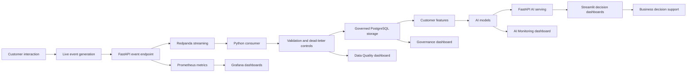

This design shows that RetailFlow is not only a dashboard and not only a machine learning project.

It is a complete platform combining product thinking, data architecture, governance, real-time data engineering, AI, operations and evidence.

---

# 3. Product Vision

## 3.1 Vision Statement

The vision of RetailFlow is:

> To transform customer events into trusted data, trusted data into customer intelligence, and customer intelligence into measurable business decisions.

This vision is implemented through an end-to-end data lifecycle:

```text
Generate
→ Ingest
→ Validate
→ Govern
→ Store
→ Transform
→ Predict
→ Serve
→ Monitor
→ Improve
```

---

## 3.2 Product Positioning

RetailFlow is positioned as a **Retail Intelligence Platform**.

It helps e-commerce organizations answer questions such as:

- Which customers are most likely to churn?
- Which customers have the highest future value?
- Which customer segments should receive specific business actions?
- Are customer events being processed correctly?
- Are invalid events isolated and traceable?
- Are customer data usages aligned with consent?
- Are AI models monitored and explainable?
- Is the technical platform observable?
- Is the delivery workflow controlled by CI/CD evidence?

RetailFlow connects customer behavior, data governance, machine learning and operational monitoring into one integrated product.

---

## 3.3 Value Proposition

### Business teams

RetailFlow helps business teams:

- identify high-value customers;
- detect churn risk;
- understand customer segments;
- prioritize retention actions;
- support lifecycle marketing;
- interpret customer intelligence outputs.

### Data teams

RetailFlow helps data teams:

- capture events reliably;
- validate incoming data;
- isolate invalid records;
- structure data into domains;
- expose trusted datasets;
- monitor data quality.

### AI teams

RetailFlow helps AI teams:

- train customer models;
- monitor model performance;
- analyze feature importance;
- detect drift;
- serve predictions through APIs;
- connect models to business workflows.

### Platform teams

RetailFlow helps platform teams:

- monitor service health;
- inspect API metrics;
- observe database status;
- visualize Prometheus metrics in Grafana;
- use alerting rules;
- verify CI/CD and orchestration workflows.

---

# 4. Project Objectives

I designed RetailFlow around seven main objectives.

## Objective 1 — Build an end-to-end Retail Intelligence platform

The first objective was to build a coherent platform rather than a set of disconnected tools.

RetailFlow connects:

- customer event generation;
- event streaming;
- data validation;
- PostgreSQL storage;
- governance tables;
- feature engineering;
- machine learning;
- API serving;
- dashboards;
- monitoring;
- CI/CD validation.

## Objective 2 — Implement real-time customer event ingestion

The second objective was to demonstrate how customer-facing actions can be converted into events and ingested by a streaming pipeline.

The platform supports events such as:

- product views;
- add-to-cart actions;
- checkout starts;
- purchases;
- invalid demo events used to prove rejection and dead-letter handling.

These events are published through FastAPI and processed through Redpanda and a Python consumer.

## Objective 3 — Operationalize data governance by design

Because RetailFlow is a recently established company, I designed the governance framework from the beginning.

Governance is integrated directly into:

- database schemas;
- consent management;
- data retention;
- anonymization;
- quality controls;
- audit logs;
- dashboards;
- AI usage rules.

This is a **Data Governance by Design** approach.

## Objective 4 — Provide customer intelligence through AI

RetailFlow includes three customer intelligence models.

| Model | Purpose |
|---|---|
| Churn prediction | Identify customers at risk of leaving or disengaging. |
| CLV prediction | Estimate customer lifetime value. |
| Customer segmentation | Group customers into business-readable profiles. |

These models support decisions related to retention, loyalty, campaign targeting and customer prioritization.

## Objective 5 — Make data quality visible and traceable

Invalid events should not silently contaminate analytical tables or model inputs.

I implemented a data quality approach based on:

- validation rules;
- rejected events;
- dead-letter storage;
- quality logs;
- severity levels;
- dashboard visibility;
- remediation workflow explanation.

## Objective 6 — Monitor both the platform and the models

RetailFlow includes monitoring at two levels.

### Platform observability

- FastAPI health;
- PostgreSQL health;
- Prometheus targets;
- Grafana dashboards;
- Airflow health;
- PostgreSQL exporter metrics;
- Prometheus alert rules;
- Streamlit observability page.

### AI monitoring

- model registry;
- model reports;
- retraining runs;
- prediction availability;
- analytics-consent-based AI counts;
- drift monitoring;
- MLOps controls.

## Objective 7 — Provide a guided demonstration and evidence interface

The Streamlit interface was designed as a guided platform experience.

It now includes ten pages:

1. Platform Overview;
2. Customer View;
3. Customer Intelligence;
4. Data Governance;
5. Data Architecture;
6. Data Quality;
7. AI Monitoring;
8. Observability;
9. CI/CD and Operations;
10. Project Evidence.

This navigation follows the logic of the platform and makes it possible to explain the end-to-end value of RetailFlow.

The Project Evidence page also includes:

- a final evidence matrix;
- a skills evidence matrix;
- filters by block and skill ID;
- demo path;
- tool map;
- technical evidence.

---

# 5. Project Scope

## 5.1 In Scope

The RetailFlow project includes the following capabilities.

### Data Governance

- consent management;
- analytics-consent-aware AI usage;
- retention policies;
- anonymization workflow;
- governance audit logs;
- data quality logs;
- dead-letter events;
- governance KPIs;
- risk register;
- governance operating model;
- breach response procedure;
- accessibility and inclusion principles;
- AI governance principles.

### Data Architecture

- Docker Compose architecture;
- PostgreSQL database;
- multi-schema data model;
- FastAPI backend;
- Streamlit user interface;
- Redpanda event broker;
- event consumer;
- Airflow orchestration;
- Prometheus monitoring;
- Grafana dashboards;
- PostgreSQL exporter;
- healthchecks;
- backup and restore scripts;
- readonly database role;
- example environment configuration;
- GitHub Actions CI/CD.

### Real-Time Data Pipelines

- event generation;
- event publishing;
- Redpanda streaming ingestion;
- Python consumer;
- validation rules;
- event persistence;
- dead-letter handling;
- quality monitoring;
- recent events endpoint;
- invalid event demo;
- producer performance metrics;
- pipeline documentation.

### AI and MLOps

- churn model;
- CLV model;
- customer segmentation model;
- model reports;
- generated model registry;
- retraining run logs;
- predictions stored in PostgreSQL;
- FastAPI serving;
- consent-aware Customer Intelligence dashboard;
- AI Monitoring dashboard;
- drift monitoring;
- Airflow retraining workflow;
- AI robustness tests;
- GitHub Actions CI/CD validation.

### Observability and Operations

- FastAPI metrics;
- Prometheus scraping;
- Grafana dashboards;
- PostgreSQL exporter;
- Airflow health checks;
- documented alerting rules;
- Streamlit Observability page;
- CI/CD and Operations page;
- infrastructure operations documentation.

---

## 5.2 Out of Scope

The following capabilities are outside the current scope.

| Out-of-scope area | Reason |
|---|---|
| Enterprise Identity and Access Management | The project focuses on platform architecture, data governance controls and demo reproducibility. |
| Single Sign-On | Authentication federation is a future enterprise extension. |
| Multi-region deployment | The current architecture is designed for local reproducibility and clear platform demonstration. |
| 24/7 production support and on-call operations | Operational runbooks and alerts are documented, but full production support organization is outside the current scope. |
| Full enterprise data catalog platform | Data cataloging is documented as a future improvement rather than a fully deployed enterprise catalog. |
| Advanced MDM platform | Core customer and product entities are modeled, but a full dedicated MDM platform is not implemented. |
| Full production high availability | Healthchecks, monitoring and backup exist, but production-grade failover is not fully implemented. |
| Automated dead-letter replay workflow | Dead-letter handling is implemented; replay automation remains a future improvement. |
| Full production model registry | A generated registry exists; enterprise promotion, rollback and approval workflows remain future improvements. |

This scoping decision keeps the project realistic while preserving a clear production evolution path.

---

# 6. Integrated Capability Map

RetailFlow is structured around four major capability domains.

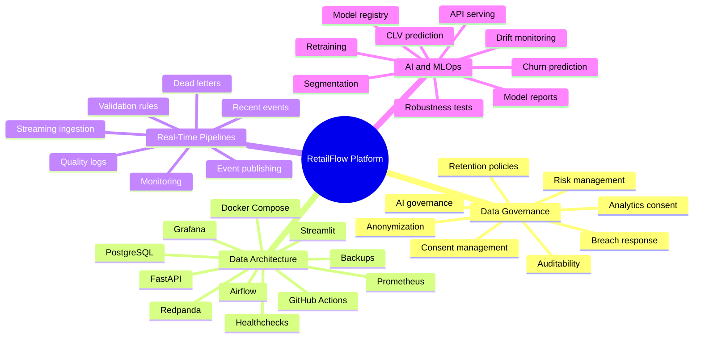

---

## 6.1 Capability Summary

| Capability | Main question answered | Main RetailFlow implementation |
|---|---|---|
| Data Governance | How is data controlled, compliant and auditable? | Governance schema, consent flags, retention policies, anonymization, logs and Data Governance page. |
| Data Architecture | How is the infrastructure designed and deployed? | Docker Compose, PostgreSQL, Redpanda, FastAPI, Streamlit, Airflow, Prometheus and Grafana. |
| Real-Time Pipelines | How are customer events ingested and monitored? | FastAPI producer, Redpanda, Python consumer, validators, dead-letter events and Data Quality page. |
| AI and MLOps | How is customer intelligence modeled, served and monitored? | Churn, CLV, segmentation, model reports, model registry, FastAPI endpoints and AI Monitoring page. |
| Observability and Operations | How is platform reliability demonstrated? | Prometheus targets, alert rules, Grafana dashboards, CI/CD page, healthchecks and operations documentation. |

---

# 7. Global Architecture

## 7.1 Architecture Overview

RetailFlow is deployed as a modular platform.

Each service has a clearly defined role.

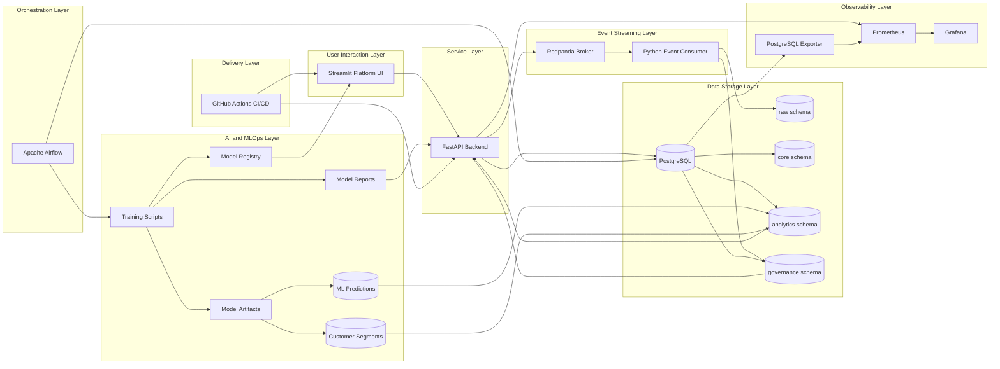

---

## 7.2 Event-to-Decision Flow

The following diagram summarizes the complete path from customer interaction to decision support.

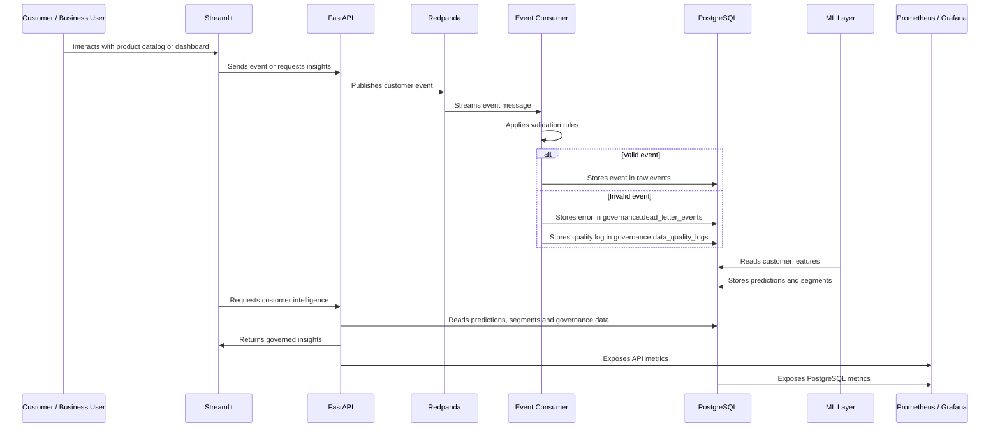

---

# 8. Platform Components

## 8.1 Component Summary

| Component | Technology | Purpose |
|---|---|---|
| User interface | Streamlit | Platform navigation, dashboards and live demo. |
| Backend API | FastAPI | Service layer, event publication, governance and AI APIs. |
| Database | PostgreSQL | Central storage for raw, core, analytics and governance data. |
| Streaming broker | Redpanda | Kafka-compatible event ingestion. |
| Event consumer | Python | Event validation and persistence. |
| Orchestration | Apache Airflow | Scheduled workflows for quality, sales, ML and retention. |
| ML layer | Scikit-Learn | Churn, CLV and segmentation models. |
| Monitoring | Prometheus | Metrics collection and alert evaluation. |
| Dashboards | Grafana | Operational observability. |
| Database monitoring | PostgreSQL Exporter | PostgreSQL metrics. |
| Containerization | Docker Compose | Local multi-service deployment. |
| CI/CD | GitHub Actions | Automated test, validation, security reporting and Docker build workflow. |
| Documentation | Markdown docs | Operations, CI/CD, monitoring and evidence documentation. |

---

## 8.2 Streamlit Platform

Streamlit is the user-facing platform interface.

The current platform contains ten pages.

| Page | Purpose |
|---|---|
| `1_Platform_Overview.py` | Presents the platform, architecture, tool links and project storyline. |
| `2_Customer_View.py` | Simulates customer journeys and generates valid or invalid events. |
| `3_Customer_Intelligence.py` | Displays governed AI decision support for customers and segments. |
| `4_Data_Governance.py` | Presents governance, consent, retention, roles, risks and compliance evidence. |
| `5_Data_Architecture.py` | Explains architecture, schemas, reliability and operational design. |
| `6_Data_Quality.py` | Shows dead letters, quality summaries and remediation workflow. |
| `7_AI_Monitoring.py` | Shows prediction availability, registry, reports, retraining and drift. |
| `8_Observability.py` | Shows Prometheus targets, alert rules and Grafana dashboards. |
| `9_CI_CD_and_Operations.py` | Shows CI/CD, operations, security reports and runbooks. |
| `10_Project_Evidence.py` | Consolidates final evidence, skills matrix, demo path and tool map. |

This interface makes the project demonstrable from both a business and technical perspective.

---

## 8.3 FastAPI

FastAPI acts as the backend service layer.

It exposes:

- product endpoints;
- event endpoints;
- recent event endpoint;
- quality endpoints;
- governance endpoints;
- AI endpoints;
- health checks;
- Prometheus metrics.

FastAPI is also responsible for publishing events to Redpanda when customer interactions are generated from the UI.

---

## 8.4 PostgreSQL

PostgreSQL is the central data platform.

It is organized into several schemas.

| Schema | Purpose |
|---|---|
| `raw` | Event-level and ingestion-oriented data. |
| `core` | Clean business entities such as customers, orders and products. |
| `analytics` | Features, predictions, segments and aggregates. |
| `governance` | Consent, retention, quality, dead letters and audit logs. |

This structure supports operational, analytical, AI and governance use cases.

---

## 8.5 Redpanda

Redpanda is used as a Kafka-compatible broker.

It supports the real-time event architecture without requiring a full Kafka and Zookeeper setup.

The main event flow is:

```text
FastAPI producer
→ Redpanda topic
→ Python consumer
→ PostgreSQL
```

---

## 8.6 Airflow

Airflow orchestrates recurring workflows.

| DAG | Schedule | Purpose |
|---|---|---|
| `daily_sales_aggregation` | Daily | Refreshes analytical sales aggregates. |
| `daily_data_quality` | Daily | Checks data quality and dead-letter counts. |
| `ml_retraining` | Weekly | Retrains models, refreshes predictions and evaluates drift. |
| `retention_cleanup` | Weekly | Applies governance retention and anonymization logic. |

---

## 8.7 Prometheus and Grafana

Prometheus collects platform metrics and evaluates alert rules.

Grafana visualizes operational dashboards.

The monitoring layer covers:

- FastAPI metrics;
- PostgreSQL metrics;
- service availability;
- API behavior;
- alert rules;
- platform dashboards.

The current dashboards include:

- RetailFlow API Overview;
- RetailFlow Platform Overview.

---

## 8.8 GitHub Actions CI/CD

GitHub Actions provides the automated validation layer.

The CI/CD workflow validates:

- Python syntax;
- automated tests;
- ML report availability;
- Docker Compose configuration;
- Docker image builds;
- repository checks;
- security report generation.

This supports reproducibility and reduces regression risk.

---

# 9. Data Domains

RetailFlow covers several business and technical domains.

## 9.1 Customer Domain

Customer data includes:

- customer profile;
- geographic information;
- loyalty status;
- account status;
- consent flags;
- behavioral features;
- churn score;
- CLV score;
- segment assignment.

## 9.2 Product Domain

Product data includes:

- product catalog;
- product categories;
- prices;
- suppliers;
- product interactions.

## 9.3 Order Domain

Order data includes:

- orders;
- order items;
- payments;
- shipments;
- returns;
- refunds.

## 9.4 Behavioral Event Domain

Event data includes:

- product views;
- cart actions;
- checkout actions;
- purchase events;
- session behavior;
- invalid demo events used for quality evidence.

## 9.5 Governance Domain

Governance data includes:

- consent records;
- retention policies;
- anonymization logs;
- quality logs;
- dead-letter events;
- audit trail;
- breach response evidence;
- risk register.

## 9.6 AI Domain

AI data includes:

- model inputs;
- model reports;
- generated model registry;
- predictions;
- segments;
- drift metrics;
- retraining run logs.

---

# 10. Current Platform Maturity

Because RetailFlow was recently created, I had the opportunity to design governance, quality, observability and AI monitoring from the beginning.

This allowed the platform to reach a relatively advanced maturity level despite being new.

## 10.1 Maturity Assessment

| Dimension | Current Maturity | Justification |
|---|---|---|
| Data ownership | Advanced | Governance roles and responsibilities are defined. |
| Consent management | Advanced | Marketing, analytics and personalization consent are stored and used. |
| Data retention | Advanced | Retention policies and anonymization workflow are implemented. |
| Auditability | Advanced | Retention actions, dead letters and quality logs are traceable. |
| Data quality | Advanced | Validation rules and dead-letter mechanisms are implemented. |
| Platform observability | Advanced | Prometheus, Grafana, health checks and alert rules are in place. |
| AI monitoring | Advanced | Model reports, model registry, retraining logs and drift monitoring are available. |
| CI/CD validation | Advanced | Tests, compile checks, Docker validation and security reports run in GitHub Actions. |
| Metadata management | Developing | Metadata is documented but not yet fully automated through a catalog. |
| Enterprise data catalog | Planned | Identified as a future improvement. |
| Enterprise IAM | Planned | Out of scope for the current version. |
| Full production HA | Developing | Healthchecks and backups exist; full failover remains a future improvement. |

This maturity profile is intentionally realistic.

It recognizes the controls already implemented while clearly identifying production hardening areas.

---

## 10.2 Governance by Design Impact

The governance-by-design approach produced several benefits:

- governance tables are part of the database model;
- consent is directly connected to customer intelligence;
- AI outputs are hidden in the interface when analytics consent is absent;
- AI Monitoring uses analytics-consented customer counts for visible prediction availability;
- retention is connected to Airflow automation;
- anonymization produces audit logs;
- invalid events are isolated instead of ignored;
- ML monitoring is part of the platform experience;
- observability is integrated into the runtime architecture.

---

# 11. Implemented Development Milestones

RetailFlow has been developed incrementally.

| Lot / Area | Main Achievement |
|---|---|
| Platform foundation | Project structure, Docker Compose runtime and PostgreSQL baseline. |
| Data model | Raw, core, analytics and governance schemas. |
| Data generator | Retail dataset generation and database initialization. |
| Real-time pipeline | FastAPI producer, Redpanda broker, event consumer and PostgreSQL persistence. |
| Data quality | Validation rules, dead-letter events and Data Quality page. |
| Airflow | Sales aggregation, data quality, retention cleanup and ML retraining DAGs. |
| AI solution | Churn, CLV, segmentation, prediction serving and model reports. |
| API serving | FastAPI endpoints for products, events, governance, quality and AI. |
| Monitoring | Prometheus, Grafana, PostgreSQL exporter and alert rules. |
| Infrastructure hardening | Healthchecks, backup/restore scripts, readonly DB role and operations docs. |
| CI/CD | GitHub Actions, tests, Docker validation and security reports. |
| Streamlit finalization | Ten-page interface, proof cards, academic mappings and project evidence matrix. |

---

# 12. Current Streamlit Demonstration Path

The recommended live demonstration path is:

| Step | Page / Tool | What to show |
|---|---|---|
| 1 | Streamlit > Platform Overview | Platform narrative, architecture and tool links. |
| 2 | Streamlit > Customer View | Generate a customer journey and an invalid event. |
| 3 | Streamlit > Data Quality | Show dead-letter evidence and quality remediation logic. |
| 4 | Streamlit > Customer Intelligence | Show governed AI decision support and consent behavior. |
| 5 | Streamlit > Data Governance | Show roles, consent, retention, risk register and breach response. |
| 6 | Streamlit > Data Architecture | Show schemas, services, reliability and scalability design. |
| 7 | Streamlit > AI Monitoring | Show model registry, reports, retraining, drift and prediction availability. |
| 8 | Streamlit > Observability | Show Prometheus targets, alert rules and Grafana dashboards. |
| 9 | Streamlit > CI/CD and Operations | Show CI/CD, security reports, runbooks and operational controls. |
| 10 | Streamlit > Project Evidence | Show final evidence matrix and skills evidence matrix. |
| 11 | GitHub Actions | Show CI green on the latest commit. |
| 12 | pgAdmin | Show raw events, dead letters, predictions and governance tables. |
| 13 | Airflow | Show operational DAGs. |
| 14 | Prometheus / Grafana | Show monitoring targets and dashboards. |

---

# 13. Evidence and Assessment Mapping

RetailFlow includes a dedicated Project Evidence page.

This page consolidates:

- evidence by block;
- proof locations;
- tools to open;
- final evidence matrix;
- skills evidence matrix;
- demo path;
- technical proof references.

The skills evidence matrix uses the following columns:

```text
Bloc
ID
Compétence
Preuve RetailFlow
Outils
Où chercher
Statut
```

It supports filtering by:

- block;
- skill ID.

This makes the final demonstration easier to connect to the official assessment criteria.

---

# 14. Operations and Reliability Evidence

RetailFlow includes several operational controls.

| Control | Implementation |
|---|---|
| Healthchecks | Docker Compose healthchecks for core services. |
| Backup | PostgreSQL backup script and local backup directory handling. |
| Restore | PostgreSQL restore script. |
| Readonly role | Dedicated readonly PostgreSQL role. |
| Environment configuration | Example environment file for reproducible setup. |
| Monitoring | Prometheus targets, alert rules and Grafana dashboards. |
| Documentation | Infrastructure operations, monitoring and CI/CD docs. |
| CI/CD | Automated checks on GitHub Actions. |

The current environment is appropriate for a reproducible local demonstration.

It is not presented as a fully hardened enterprise production deployment.

---

# 15. Future Improvement Roadmap

RetailFlow already provides an integrated platform, but several improvements can strengthen its production maturity.

## 15.1 Short-Term Improvements

| Improvement | Objective |
|---|---|
| Expand governance KPIs | Add more detailed governance scorecards. |
| Add data catalog documentation | Improve discoverability and ownership visibility. |
| Strengthen API tests | Improve CI/CD regression protection. |
| Add Streamlit smoke tests | Validate dashboard availability automatically. |
| Expand alerting | Add more operational and ML alert rules. |
| Automate dead-letter replay | Improve operational recovery after data quality errors. |

## 15.2 Medium-Term Improvements

| Improvement | Objective |
|---|---|
| Add role-based access control | Restrict features by user role. |
| Add production model registry | Improve model versioning, promotion and rollback. |
| Add data lineage automation | Track source-to-dashboard lineage. |
| Add dbt transformation layer | Improve SQL transformation structure and testing. |
| Expand drift monitoring | Add automated thresholds and alert escalation. |
| Add broker-level metrics | Improve Redpanda and consumer lag monitoring. |

## 15.3 Long-Term Improvements

| Improvement | Objective |
|---|---|
| Kubernetes deployment | Move beyond Docker Compose for scalable deployment. |
| Cloud-native infrastructure | Prepare managed services for production. |
| Enterprise data catalog | Improve metadata and governance at scale. |
| Advanced IAM / SSO | Support enterprise authentication and authorization. |
| Recommendation engine | Add product recommendation use cases. |
| Real-time feature refresh | Move closer to near-real-time personalization. |
| Multi-region availability | Improve business continuity for production. |

---

# 16. Deliverable Structure

The official RetailFlow deliverables are organized into five parts.

## Part 1 — Executive Context and Integrated Project Presentation

This document explains:

- company context;
- product vision;
- platform objectives;
- project scope;
- integrated architecture;
- capability mapping;
- maturity positioning;
- final demonstration path.

## Part 2 — Data Governance Plan

The Data Governance Plan explains:

- governance vision;
- governance operating model;
- personas and roles;
- data policies;
- consent management;
- retention and anonymization;
- data classification;
- business glossary;
- governance KPIs;
- audit and controls;
- inclusion and accessibility;
- governance roadmap.

## Part 3 — Data Architecture Design

The Data Architecture Design explains:

- infrastructure architecture;
- data model;
- schemas;
- Docker Compose deployment;
- service interactions;
- monitoring architecture;
- CI/CD architecture;
- reliability controls;
- future cloud target architecture.

## Part 4 — Real-Time Data Pipeline Design

The Pipeline Design explains:

- event sources;
- Redpanda streaming;
- producer and consumer design;
- validation rules;
- dead-letter handling;
- quality monitoring;
- Airflow automation;
- pipeline observability;
- error handling and recovery roadmap.

## Part 5 — Artificial Intelligence Solution Design

The AI Solution Design explains:

- AI use cases;
- feature engineering;
- model training;
- model reports;
- prediction persistence;
- FastAPI serving;
- customer intelligence dashboard;
- AI monitoring dashboard;
- drift monitoring;
- retraining;
- CI/CD and responsible AI.

---

# 17. Conclusion

RetailFlow demonstrates how a modern e-commerce data platform can combine real-time data engineering, governance, AI and observability into a coherent Retail Intelligence product.

The project is valuable because it does not stop at model training, dashboard creation or database design.

It connects all components into an operational storyline:

```text
Customer event
→ validated pipeline
→ governed storage
→ analytical features
→ AI prediction
→ consent-aware dashboard
→ monitoring and evidence
```

The final implementation includes:

- real-time event ingestion with Redpanda;
- FastAPI event and AI serving;
- PostgreSQL data platform with raw, core, analytics and governance schemas;
- data quality controls and dead-letter handling;
- governance policies, consent indicators, retention and anonymization evidence;
- AI models for churn, CLV and segmentation;
- model registry, reports, drift monitoring and retraining evidence;
- Streamlit dashboards for business, governance, AI, quality, observability, operations and final proof;
- Prometheus and Grafana observability;
- GitHub Actions CI/CD validation;
- project evidence and skills evidence matrix.

RetailFlow is therefore a complete, demonstrable and extensible Retail Intelligence platform.

It is not yet a fully hardened enterprise production system, but it provides a strong foundation for production evolution through cloud deployment, IAM, full model registry, advanced lineage and expanded alerting.

---

# Appendix A — Main Local URLs

| Tool | URL |
|---|---|
| Streamlit | `http://localhost:8501` |
| FastAPI Docs | `http://localhost:8000/docs` |
| pgAdmin | `http://localhost:5050` |
| Airflow | `http://localhost:8080` |
| Prometheus | `http://localhost:9090` |
| Grafana | `http://localhost:3000` |

---

# Appendix B — Main Evidence Files

| Area | Path |
|---|---|
| Streamlit pages | `streamlit_app/pages/` |
| Shared Streamlit components | `streamlit_app/components.py` |
| FastAPI app | `api/app/` |
| Event consumer | `pipeline/consumer/` |
| Airflow DAGs | `airflow/dags/` |
| ML scripts | `ml/src/` |
| ML reports | `ml/reports/` |
| Model registry | `ml/model_registry.json` |
| Monitoring configuration | `monitoring/` |
| CI/CD workflows | `.github/workflows/` |
| Infrastructure operations docs | `docs/INFRA_OPERATIONS.md` |
| Monitoring docs | `docs/MONITORING.md` and `docs/MONITORING_EVIDENCE.md` |
| CI/CD docs | `docs/CI_CD.md` |

---

# Appendix C — Implementation Boundaries

The current implementation demonstrates the main academic and technical requirements.

The following areas are intentionally positioned as future production hardening:

| Boundary | Current state | Future target |
|---|---|---|
| High availability | Healthchecks and monitoring | Multi-instance deployment, failover and disaster recovery. |
| Authentication | Local demo without enterprise IAM | RBAC, SSO and API authorization. |
| Model registry | Generated registry file | Full registry with promotion, approval and rollback. |
| Dead-letter replay | Reprocessing concept and evidence | Automated replay workflow with approval. |
| Alert routing | Prometheus rules and dashboards | Slack/email/on-call escalation. |
| Deployment | Docker Compose local runtime | Kubernetes and cloud-native managed services. |
# Data Governance Plan

## RetailFlow Platform

**Official Deliverable — Data Governance**

**Document purpose:** present the data governance framework I designed for RetailFlow.

**Document language:** English.

**Document scope:** governance strategy, operating model, policies, standards, GDPR alignment, consent management, quality controls, auditability, AI governance, KPIs, change management and roadmap.

**Updated version:** this version integrates the latest RetailFlow implementation updates: final Streamlit consistency fixes, consent-aware AI display enforcement, AI Monitoring metrics based on `analytics_consent_count`, Project Evidence skills matrix, Prometheus alert rules, Grafana dashboard evidence, CI/CD security reports, healthchecks, backup/restore scripts and read-only database role evidence.

---

## Table of Contents

1. Executive Summary
2. Governance Context
3. Governance Vision
4. Governance Objectives
5. Governance Scope
6. Governance by Design
7. Operating Model
8. Roles, Responsibilities and Personas
9. Governance Decision Model
10. Data Domains Under Governance
11. Data Classification
12. Data Policies
13. Consent Management Policy
14. Retention and Anonymization Policy
15. Data Quality Policy
16. Data Security and Access Policy
17. AI Governance Policy
18. Business Glossary
19. Governance Processes
20. Data Quality Controls
21. Metadata, Lineage and Traceability
22. Auditability and Evidence
23. Technology and Tooling
24. Governance KPIs
25. Risk Management
26. Inclusion and Accessibility
27. Change Management
28. Implementation Roadmap
29. Future Improvements
30. Conclusion

---

## 1. Executive Summary

RetailFlow is a recently established company that develops the **RetailFlow Platform**, a Retail Intelligence platform designed for e-commerce organizations.

The purpose of RetailFlow Platform is to transform customer events into trusted data, trusted data into customer intelligence, and customer intelligence into operational and strategic decision support.

Because RetailFlow is a new organization, I had the opportunity to design its data governance framework from the ground up.

Instead of adding governance after the platform had already grown, I designed RetailFlow according to a **Data Governance by Design** approach.

This means that data ownership, consent management, retention policies, quality controls, auditability, privacy principles and AI monitoring were integrated directly into the platform architecture.

The governance framework I defined covers:

- governance vision and scope;
- operating model and decision rights;
- roles and personas;
- consent management;
- data retention and anonymization;
- data quality controls;
- data classification;
- data security and access principles;
- auditability and evidence;
- AI governance;
- governance KPIs;
- risk management;
- change management;
- inclusion and accessibility;
- continuous improvement roadmap.

The governance framework is not only theoretical.

I implemented governance mechanisms directly in the platform through PostgreSQL schemas, FastAPI endpoints, Airflow DAGs, Streamlit governance dashboards and operational logs.

The most important governance implementation areas are:

| Area | Implementation in RetailFlow |
|---|---|
| Consent management | Customer consent indicators, consent-aware analytics filtering and AI display blocking when analytics consent is absent |
| Data retention | Retention policy table and automated retention cleanup workflow |
| Anonymization | Customer anonymization logic and audit trail |
| Data quality | Validation rules, dead-letter events and quality logs |
| Auditability | Retention action logs, quality logs, dead-letter tables and operational evidence |
| AI governance | Consent-aware customer intelligence, model monitoring and drift reporting |
| Monitoring | Streamlit governance dashboard, FastAPI endpoints, Airflow workflows, Prometheus alert rules and Grafana dashboards |

The result is a governance framework that is aligned with business value, technical implementation and regulatory expectations.

---

## 2. Governance Context

RetailFlow Platform is designed for an e-commerce context.

The platform collects and processes multiple categories of data:

- customer profiles;
- customer consent information;
- product catalog data;
- orders;
- payments;
- returns;
- shipments;
- sessions;
- product views;
- cart events;
- checkout events;
- support tickets;
- reviews;
- customer behavioral features;
- machine learning predictions;
- customer segments;
- data quality logs;
- retention and anonymization logs.

These data assets support different business and technical use cases:

- customer understanding;
- churn prevention;
- customer lifetime value estimation;
- segmentation;
- campaign prioritization;
- real-time event monitoring;
- ML performance monitoring;
- data quality management;
- compliance evidence;
- operational observability.

Because RetailFlow uses customer-level data and derived AI outputs, governance is a core platform requirement.

The main governance challenge is to ensure that data is:

- trusted;
- compliant;
- traceable;
- secure;
- usable;
- auditable;
- understandable;
- aligned with business purpose.

Without governance, the platform could expose the company to several risks:

- customer data misuse;
- analytics performed without consent;
- uncontrolled data retention;
- poor data quality affecting AI outputs;
- lack of accountability;
- unclear data ownership;
- inability to explain or audit decisions;
- model monitoring gaps;
- operational blind spots.

I therefore designed the governance layer as an integrated part of the platform rather than as a separate administrative document.

---

## 3. Governance Vision

The governance vision for RetailFlow is:

> I designed RetailFlow governance to ensure that customer data can be used as a trusted, compliant and valuable asset while preserving privacy, accountability, quality and auditability across the platform.

This vision supports the broader product vision:

```text
Customer Events
      ↓
Trusted Data
      ↓
Customer Intelligence
      ↓
Business Decisions
      ↓
Continuous Monitoring
```

The governance layer ensures that each step of this value chain remains controlled.

| Value chain step | Governance contribution |
|---|---|
| Customer Events | Validation rules and dead-letter handling |
| Trusted Data | Data quality controls and schema organization |
| Customer Intelligence | Consent-aware analytics and AI governance |
| Business Decisions | Clear definitions, roles and quality KPIs |
| Continuous Monitoring | Audit logs, dashboards and governance KPIs |

The key principle is simple:

> Data should only become intelligence if it is governed, reliable, traceable and used for a legitimate purpose.

---

## 4. Governance Objectives

I defined the following governance objectives for RetailFlow.

### 4.1 Ensure clear data ownership

Each critical data domain must have an accountable owner.

This avoids ambiguity around:

- who validates definitions;
- who approves business usage;
- who owns data quality targets;
- who resolves business conflicts;
- who decides whether a data product is fit for use.

### 4.2 Protect customer data

RetailFlow processes customer-related data.

I therefore integrated privacy principles such as:

- purpose limitation;
- consent management;
- minimization;
- storage limitation;
- anonymization;
- accountability;
- auditability.

### 4.3 Make analytics consent-aware

Customer intelligence can influence marketing, retention and personalization decisions.

For this reason, I implemented a consent-aware analytics principle:

```text
Customer-level AI predictions must only be displayed when analytics consent is granted.
```

This is visible in the Customer Intelligence interface.

The user can filter customers by analytics consent.

If the filter is disabled for governance demonstration purposes and a customer without analytics consent is selected, the platform does not display churn, CLV, segmentation or AI recommendations.

Instead, Streamlit displays a governance message explaining that AI predictions are not available because analytics consent was not granted.

This makes the consent rule observable and testable inside the application rather than only documented as a policy.

### 4.4 Control data quality

Invalid events must not silently enter trusted analytical tables.

I implemented a pipeline quality strategy based on:

- validation rules;
- rejection logic;
- dead-letter events;
- quality logs;
- monitoring dashboards.

### 4.5 Ensure auditability

Governance must produce evidence.

I therefore designed and implemented audit traces for:

- retention actions;
- anonymization actions;
- dead-letter events;
- data quality checks;
- ML reports;
- Airflow workflows;
- platform monitoring.

### 4.6 Govern the AI lifecycle

RetailFlow includes churn, CLV and segmentation models.

I included AI governance principles covering:

- model purpose;
- data eligibility;
- explainability;
- monitoring;
- drift detection;
- retraining;
- human oversight;
- responsible use of predictions.

### 4.7 Support business adoption

Governance should enable decision-making rather than slow down the business.

I therefore designed governance as:

- practical;
- role-based;
- measurable;
- integrated into tools;
- visible through dashboards;
- connected to business value.

---

## 5. Governance Scope

The governance scope is focused on the data domains that are most critical for RetailFlow Platform.

### 5.1 In scope

The following areas are in scope.

| Domain | Included assets |
|---|---|
| Customer Data | Customer profile, consent, account status, anonymization status |
| Behavioral Events | Product views, cart events, checkout events, purchase events |
| Transaction Data | Orders, order items, payments, returns, shipments |
| Product Data | Product catalog, categories, supplier references |
| Customer Features | Behavioral and transactional aggregates |
| AI Outputs | Churn predictions, CLV predictions, customer segments |
| Governance Data | Consent records, retention policies, retention action logs |
| Quality Data | Dead-letter events and data quality logs |
| Monitoring Data | Platform health, API metrics, PostgreSQL metrics, Airflow health |

### 5.2 Out of scope

The following areas are not covered by the current governance scope:

- Enterprise Identity and Access Management;
- Single Sign-On;
- multi-region deployment;
- 24/7 production support and on-call operations.

These areas are identified as future enterprise-level capabilities.

### 5.3 Scope rationale

I deliberately focused the governance scope on the most valuable and risky domains first.

Customer data, behavioral events and AI outputs are the most important areas because they directly affect:

- customer privacy;
- business decision-making;
- ML reliability;
- retention actions;
- customer segmentation;
- marketing activation;
- compliance obligations.

This phased governance scope avoids trying to govern everything at once while still covering the most critical platform risks.

---

## 6. Governance by Design

RetailFlow was designed as a new platform.

This created an opportunity to implement governance from the beginning rather than adding it later.

I used a **Governance by Design** approach.

This means that governance principles are integrated into the platform architecture, data model, pipelines, dashboards and operational workflows.

### 6.1 Governance by Design principles

| Principle | Implementation in RetailFlow |
|---|---|
| Privacy by Design | Consent fields, anonymization logic and retention policies are part of the data model. |
| Quality by Design | Event validation happens before event persistence. |
| Auditability by Design | Retention actions and quality issues are logged. |
| AI Governance by Design | ML predictions are monitored and linked to consent-aware exploration. |
| Observability by Design | Platform health and metrics are exposed through Prometheus, Grafana and Streamlit. |
| Accountability by Design | Roles and personas are defined for ownership, stewardship and compliance. |

### 6.2 Governance maturity

Although RetailFlow is a recently established organization, its governance maturity is relatively high because governance was integrated early.

I evaluate the current maturity as follows:

| Dimension | Current maturity | Explanation |
|---|---|---|
| Data ownership | Advanced | Roles and personas are defined by domain. |
| Consent management | Advanced | Consent flags are integrated into customer data and analytics usage. |
| Retention and anonymization | Advanced | Retention policies and anonymization workflow are implemented. |
| Auditability | Advanced | Logs exist for retention actions and quality issues. |
| Data quality | Advanced | Validation, dead-letter events and quality dashboards exist. |
| AI governance | Intermediate to Advanced | ML metrics, drift and explainability are implemented. |
| Metadata management | Developing | Technical metadata exists, but cataloging can be improved. |
| Enterprise data catalog | Planned | A full data catalog is a future improvement. |
| Access management | Developing | Future role-based access control can strengthen governance. |

This maturity profile is realistic.

It recognizes that the project already contains strong governance controls while also identifying areas that would need to be expanded in an enterprise environment.

---

## 7. Operating Model

I designed a hybrid governance operating model.

The central governance layer defines common policies, standards and controls.

Domain-specific actors apply these rules in their business or technical areas.

### 7.1 Hybrid governance model

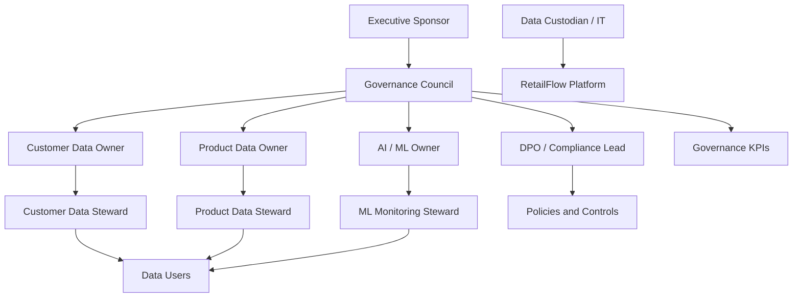

### 7.2 Why hybrid governance

A fully centralized model would be too rigid for a platform that includes business, engineering and AI topics.

A fully decentralized model would create inconsistent definitions and weak accountability.

The hybrid model provides:

- central consistency;
- domain accountability;
- faster operational execution;
- clear escalation paths;
- scalable governance practices.

### 7.3 Governance cadence

I defined the following governance cadence.

| Activity | Frequency | Responsible role |
|---|---|---|
| Governance KPI review | Monthly | Governance Council |
| Data quality issue review | Weekly | Data Steward |
| Retention action review | Monthly | DPO / Compliance Lead |
| ML monitoring review | Monthly | ML Owner |
| Risk register review | Quarterly | Governance Council |
| Policy review | Quarterly | Governance Council |
| Accessibility and training review | Quarterly | Executive Sponsor and Governance Council |

---

## 8. Roles, Responsibilities and Personas

To make the governance model concrete, I associated each governance role with a realistic RetailFlow persona.

These personas are not necessarily separate full-time positions.

They can be responsibilities assigned to existing job roles.

### 8.1 Role and persona mapping

| Governance role | RetailFlow persona | Main responsibility |
|---|---|---|
| Executive Sponsor | Chief Data & Analytics Officer | Sponsors the data governance program and validates strategic priorities. |
| Governance Council | Cross-functional governance committee | Approves policies, reviews risks and arbitrates decisions. |
| Data Owner | Head of Customer Intelligence | Owns customer analytics definitions, usage priorities and quality targets. |
| Data Steward | Senior CRM & Analytics Manager | Monitors quality, glossary definitions, consent usage and issue resolution. |
| Data Custodian | Lead Data Engineer | Operates data systems, pipelines, security controls and retention workflows. |
| DPO / Compliance Lead | Privacy & Compliance Manager | Oversees GDPR alignment, consent, retention and audit readiness. |
| ML Owner | Lead Machine Learning Engineer | Owns model monitoring, drift analysis, retraining and explainability. |
| Business Owner | Head of E-Commerce Performance | Uses customer intelligence for business decisions and campaign prioritization. |
| Data Users | Marketing analysts, CRM specialists, business analysts | Consume governed data and report quality issues. |

### 8.2 Executive Sponsor

**Persona:** Chief Data & Analytics Officer.

The Executive Sponsor provides authority, funding and visibility.

Responsibilities:

- approve the governance strategy;
- validate priorities;
- remove cross-functional blockers;
- sponsor the governance roadmap;
- ensure alignment with business objectives;
- review governance maturity.

### 8.3 Governance Council

**Persona:** Monthly cross-functional committee.

Typical members:

- Chief Data & Analytics Officer;
- Head of Customer Intelligence;
- Privacy & Compliance Manager;
- Lead Data Engineer;
- Lead Machine Learning Engineer;
- Head of E-Commerce Performance;
- Senior CRM & Analytics Manager.

Responsibilities:

- approve governance policies;
- define common standards;
- review KPIs;
- review risks;
- resolve ownership conflicts;
- prioritize governance improvements;
- validate change management actions.

### 8.4 Data Owner

**Persona:** Head of Customer Intelligence.

The Data Owner is accountable for the business meaning and usage of customer intelligence data.

Responsibilities:

- define business definitions;
- approve customer analytics use cases;
- validate quality targets;
- prioritize customer data improvements;
- arbitrate business conflicts around metrics;
- ensure the domain produces value.

### 8.5 Data Steward

**Persona:** Senior CRM & Analytics Manager.

The Data Steward manages governance in daily operations.

Responsibilities:

- monitor quality indicators;
- maintain glossary definitions;
- review data quality issues;
- validate consent usage practices;
- coordinate issue resolution;
- communicate governance rules to users.

### 8.6 Data Custodian

**Persona:** Lead Data Engineer.

The Data Custodian implements governance controls technically.

Responsibilities:

- operate PostgreSQL schemas;
- maintain pipelines;
- implement validation rules;
- maintain Airflow workflows;
- implement retention cleanup;
- maintain quality and audit logs;
- support monitoring and observability.

### 8.7 DPO / Compliance Lead

**Persona:** Privacy & Compliance Manager.

The DPO / Compliance Lead oversees privacy and regulatory alignment.

Responsibilities:

- validate GDPR alignment;
- review consent management;
- review retention policies;
- oversee anonymization logic;
- ensure audit evidence is available;
- review privacy risk controls;
- validate training material for privacy awareness.

### 8.8 ML Owner

**Persona:** Lead Machine Learning Engineer.

The ML Owner governs the AI lifecycle.

Responsibilities:

- validate model purpose;
- monitor model metrics;
- review feature importance;
- monitor drift reports;
- validate retraining workflows;
- ensure model outputs are explainable;
- document responsible use of predictions.

### 8.9 Business Owner

**Persona:** Head of E-Commerce Performance.

The Business Owner ensures that governed data supports decision-making.

Responsibilities:

- use churn, CLV and segmentation outputs;
- prioritize business actions;
- validate business usefulness;
- provide feedback on dashboards;
- ensure insights are used responsibly.

### 8.10 Data Users

**Personas:** Marketing analysts, CRM specialists and business analysts.

Data Users consume governed data under approved rules.

Responsibilities:

- follow data usage policies;
- respect consent constraints;
- use approved definitions;
- report data quality issues;
- request clarification when definitions are unclear;
- participate in training.

---

## 9. Governance Decision Model

I defined decision rights to clarify who decides what.

### 9.1 Decision rights matrix

| Decision area | Decision owner | Consulted roles | Evidence required |
|---|---|---|---|
| New customer analytics use case | Data Owner | DPO, ML Owner, Business Owner | Purpose, data fields, consent requirement |
| New data quality rule | Data Steward | Data Custodian, Data Owner | Rule definition, severity, remediation path |
| Retention policy update | DPO / Compliance Lead | Data Owner, Data Custodian | Legal basis, target table, action |
| Model retraining approval | ML Owner | Data Owner, Data Custodian | Metrics, drift report, validation output |
| Glossary definition update | Data Steward | Data Owner, Data Users | Definition, examples, owner approval |
| Governance KPI target update | Governance Council | Executive Sponsor | KPI history, business impact |
| Access policy update | Governance Council | DPO, Data Custodian | Role mapping and security impact |

### 9.2 Escalation path

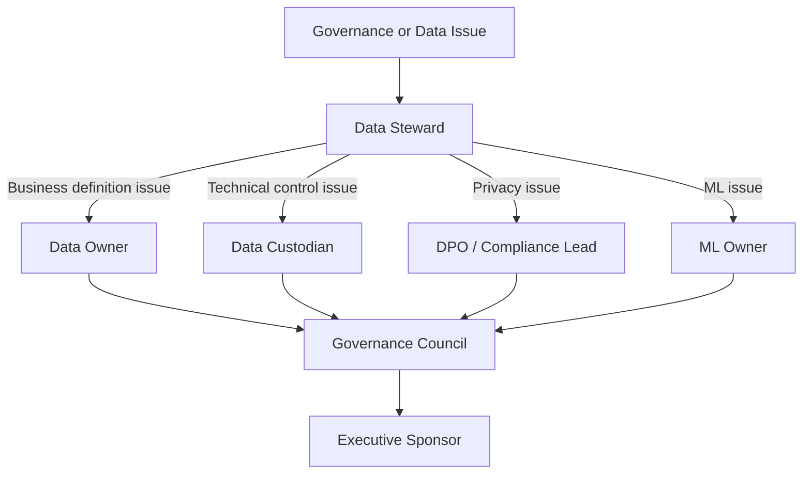

---

## 10. Data Domains Under Governance

I structured governance around core domains.

### 10.1 Customer domain

The customer domain includes:

- customer identifier;
- demographic attributes;
- account status;
- loyalty status;
- consent indicators;
- anonymization status;
- last interaction timestamp.

Governance focus:

- privacy;
- consent;
- retention;
- segmentation eligibility;
- analytics usage;
- anonymization.

### 10.2 Event domain

The event domain includes:

- product views;
- add-to-cart events;
- checkout events;
- purchase events;
- session events;
- raw payloads.

Governance focus:

- validation;
- traceability;
- timeliness;
- dead-letter handling;
- quality monitoring.

### 10.3 Transaction domain

The transaction domain includes:

- orders;
- order items;
- payments;
- shipments;
- returns;
- refunds.

Governance focus:

- accuracy;
- financial consistency;
- reporting reliability;
- retention requirements.

### 10.4 Product domain

The product domain includes:

- product catalog;
- category;
- supplier;
- product availability;
- price;
- product metadata.

Governance focus:

- completeness;
- consistency;
- reference values;
- product recommendations;
- catalog quality.

### 10.5 AI output domain

The AI output domain includes:

- churn scores;
- churn risk labels;
- CLV predictions;
- CLV value bands;
- customer segments;
- model versions;
- prediction timestamps;
- drift metrics.

Governance focus:

- explainability;
- monitoring;
- model versioning;
- responsible use;
- consent-aware exploration;
- retraining.

---

## 11. Data Classification

I defined a simple classification model adapted to RetailFlow.

The goal is to classify data by sensitivity and apply appropriate controls.

### 11.1 Classification levels

| Classification | Description | Examples | Governance controls |
|---|---|---|---|
| Public | Information that can be shared externally without customer risk. | Product catalog, product category labels, generic platform description | Basic integrity controls |
| Internal | Operational or analytical information intended for internal use. | Aggregated sales KPIs, model monitoring summaries, operational metrics | Internal access rules and documentation |
| Confidential | Customer-related or business-sensitive data requiring stronger controls. | Customer profiles, consent flags, transaction history, behavioral features, ML predictions | Consent rules, retention, audit logs, limited access |

### 11.2 Classification by data domain

| Data domain | Classification | Reason |
|---|---|---|
| Product catalog | Public / Internal | Product information can be public, but internal pricing or margin can be sensitive. |
| Customer profiles | Confidential | Contains customer-level information. |
| Consent data | Confidential | Directly related to privacy rights and permitted usage. |
| Orders and payments | Confidential | Transactional and potentially sensitive business data. |
| Behavioral events | Confidential | Can describe individual customer behavior. |
| Customer features | Confidential | Derived customer-level analytical data. |
| ML predictions | Confidential | Can influence customer treatment and marketing actions. |
| Aggregated KPIs | Internal | Business performance metrics should remain internal. |
| Monitoring metrics | Internal | Operational information for platform teams. |
| Public documentation | Public | Non-sensitive product and architecture descriptions. |

### 11.3 Handling rules

| Classification | Handling rules |
|---|---|
| Public | Can be documented and shared externally if validated. |
| Internal | Accessible to approved internal users only. |
| Confidential | Requires purpose, role, consent consideration, retention rule and auditability. |

### 11.4 Classification diagram

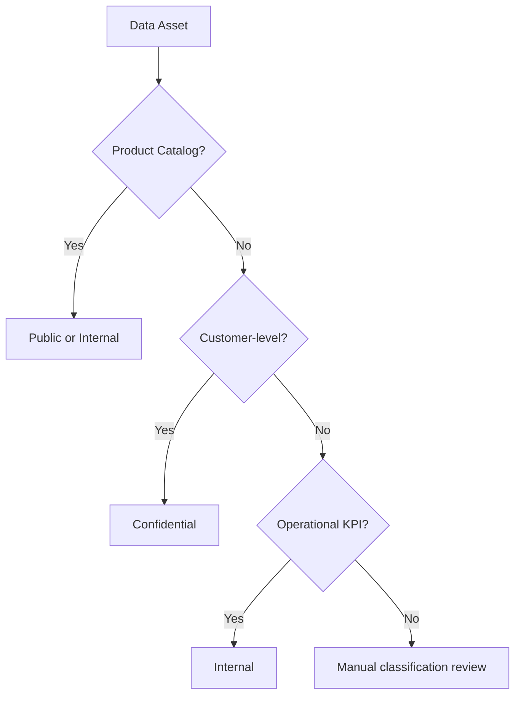

---

## 12. Data Policies

I defined governance policies that translate the governance principles into operational rules.

### 12.1 Policy overview

| Policy | Purpose |
|---|---|
| Customer data policy | Define how customer data may be used. |
| Consent management policy | Control marketing, analytics and personalization usage. |
| Retention policy | Define how long data is retained and what action is applied. |
| Anonymization policy | Define how customer identity data is removed or neutralized. |
| Data quality policy | Define validation rules and issue management. |
| AI governance policy | Define responsible use of ML predictions. |
| Access and security policy | Define access principles and technical controls. |
| Audit policy | Define evidence, logging and review expectations. |

### 12.2 Customer data policy

Customer data may only be used for approved purposes.

Approved purposes include:

- customer intelligence;
- service improvement;
- churn prevention;
- segmentation;
- CLV analysis;
- operational monitoring;
- data quality analysis;
- compliance and retention processes.

Customer data must not be used for undefined purposes without review.

The Data Owner and DPO / Compliance Lead must be consulted for any new customer-level analytical use case.

### 12.3 Acceptable use policy

Users consuming RetailFlow data must:

- use approved dashboards and endpoints;
- respect consent indicators;
- avoid exporting unnecessary customer-level data;
- use aggregated data where possible;
- report quality issues;
- follow glossary definitions;
- avoid unsupported interpretations of AI outputs.

### 12.4 Policy review

Policies must be reviewed quarterly by the Governance Council.

Policy updates should be triggered when:

- new data domains are added;
- new ML use cases are introduced;
- a privacy risk is identified;
- recurring quality issues appear;
- new compliance requirements emerge;
- business usage changes.

---

## 13. Consent Management Policy

Consent management is central to RetailFlow governance.

The platform tracks consent at customer level.

### 13.1 Consent dimensions

| Consent field | Purpose |
|---|---|
| `marketing_consent` | Indicates whether the customer can be targeted for marketing activation. |
| `analytics_consent` | Indicates whether the customer can be used in analytics and customer intelligence exploration. |
| `personalization_consent` | Indicates whether the customer can be used for personalization-related use cases. |

### 13.2 Consent usage principles

I defined the following principles:

1. Consent must be explicit enough to support the intended purpose.
2. Customer-level AI predictions should be displayed only when analytics consent is granted.
3. Marketing activation should require marketing consent.
4. Personalization use cases should require personalization consent.
5. Consent values must be visible to data users where they affect usage.
6. Consent must be checked before using or displaying AI outputs for customer-level actions.

### 13.3 Consent-aware analytics

RetailFlow connects governance to analytics through the Customer Intelligence page.

The customer explorer contains a default filter:

```text
Show only customers with analytics consent
```

This filter is enabled by default.

The page also implements a stronger governance rule.

When a customer does not have analytics consent, RetailFlow hides customer-level AI outputs from the interface:

- churn prediction;
- CLV prediction;
- segmentation result;
- AI-driven recommended actions;
- raw AI profile.

The page displays the following business-readable governance message:

```text
Ce client n’a pas donné son consentement analytics. Les prédictions IA ne sont donc pas disponibles.
```

This demonstrates that analytics consent is enforced at the application display layer and not only stored in the database.

### 13.4 Consent flow

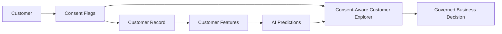

### 13.5 Consent monitoring

Consent rates are visible in the Data Governance dashboard.

The dashboard tracks:

- marketing consent rate;
- analytics consent rate;
- personalization consent rate;
- anonymized customers;
- customer count.

The AI Monitoring page also uses `analytics_consent_count` as the visible count for AI-authorized customer outputs.

This means the AI monitoring view is aligned with the same governance rule as the Customer Intelligence dashboard.

This makes consent not only stored, but also monitored and connected to AI visibility.

### 13.6 Current consent implementation evidence

| Evidence | Implementation | Where to verify |
|---|---|---|
| Customer consent storage | `marketing_consent`, `analytics_consent`, `personalization_consent` | PostgreSQL `core.customers` and governance dashboards |
| Governance summary | Consent counts exposed by API | FastAPI `GET /governance/summary` |
| Consent-aware customer list | Analytics consent filter in customer API | FastAPI `GET /ai/customers?analytics_consent_only=true` |
| AI display control | Churn, CLV, segmentation and recommendations hidden when analytics consent is absent | Streamlit `Customer Intelligence` |
| AI monitoring count | `analytics_consent_count` used for visible AI-authorized customer outputs | Streamlit `AI Monitoring` |

---

## 14. Retention and Anonymization Policy

RetailFlow includes a retention policy framework and automated anonymization workflow.

### 14.1 Retention policy table

Retention policies are stored in:

```text
governance.data_retention_policies
```

This table defines:

- policy identifier;
- target domain;
- target table;
- retention duration;
- retention action;
- owner role;
- legal basis or governance basis.

### 14.2 Retention principles

I defined the following retention principles:

1. Data should not be retained indefinitely without purpose.
2. Customer personal data should be anonymized when the retention condition is met.
3. Retention actions must be logged.
4. The retention workflow must be auditable.
5. Retention policies must be reviewed periodically.

### 14.3 Anonymization workflow

The Airflow DAG `retention_cleanup` supports the retention process.

The workflow:

1. identifies customers affected by the retention policy;
2. anonymizes personal fields;
3. disables consent flags;
4. changes account status to anonymized;
5. records the action in the retention audit log.

### 14.4 Anonymized fields

The anonymization process affects fields such as:

- first name;
- last name;
- email;
- phone number;
- birth date;
- gender;
- city;
- postal code;
- consent flags;
- account status.

### 14.5 Retention action log

Retention actions are logged in:

```text
governance.retention_actions_log
```

The log stores:

- action identifier;
- policy identifier;
- table name;
- record identifier;
- action type;
- action status;
- execution timestamp;
- executing component;
- action details.

### 14.6 Retention workflow diagram

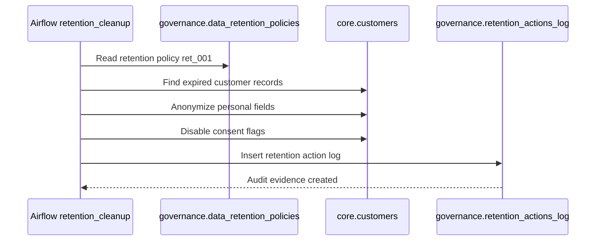

---

## 15. Data Quality Policy

Data quality is a governance requirement in RetailFlow.

The objective is to prevent incorrect data from contaminating downstream analytics and ML outputs.

### 15.1 Quality dimensions

I defined quality controls around the following dimensions:

| Dimension | Meaning in RetailFlow |
|---|---|
| Completeness | Required fields must be present. |
| Validity | Event types and values must be allowed. |
| Consistency | Events must reference existing customers and products. |
| Timeliness | Timestamps must be valid and usable. |
| Traceability | Errors must be logged and explainable. |

### 15.2 Quality validation rules

The real-time pipeline includes validation rules such as:

| Rule | Purpose | Action |
|---|---|---|
| Event identifier required | Ensure event traceability | Reject invalid event |
| Event type allowed | Prevent unsupported event categories | Reject invalid event |
| Customer exists | Ensure customer referential integrity | Reject invalid event |
| Product exists | Ensure product referential integrity | Reject invalid event |
| Timestamp valid | Ensure event chronology is usable | Reject invalid event |

### 15.3 Dead-letter handling

Invalid events are stored in:

```text
governance.dead_letter_events
```

This prevents invalid data from entering trusted analytical tables.

### 15.4 Quality logs

Failed rules are logged in:

```text
governance.data_quality_logs
```

This allows quality issues to be:

- counted;
- reviewed;
- categorized;
- assigned;
- monitored;
- audited.

### 15.5 Quality monitoring

The Data Quality dashboard displays:

- dead-letter events;
- failed rules;
- severity distribution;
- impacted event types;
- quality rule summaries;
- technical evidence.

### 15.6 Quality workflow diagram

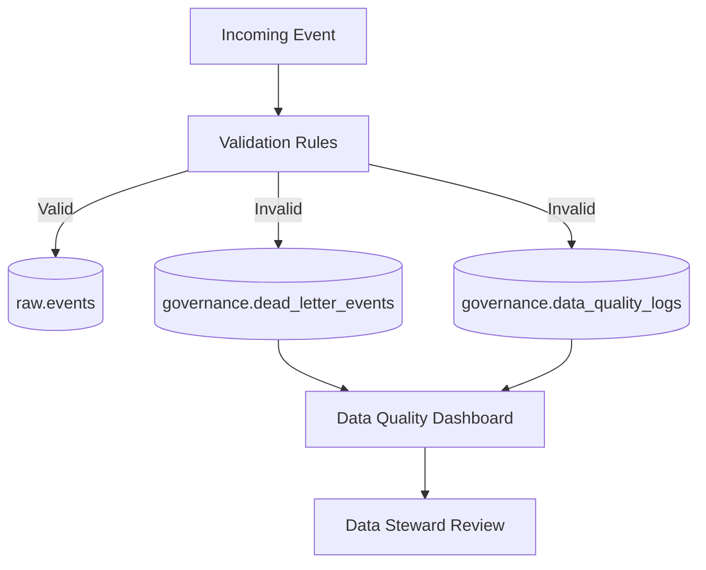

---

## 16. Data Security and Access Policy

RetailFlow is not currently positioned as a complete enterprise IAM platform.

However, I defined security principles that guide data access and future implementation.

### 16.1 Security principles

| Principle | Description |
|---|---|
| Least privilege | Users should access only what they need. |
| Purpose-based access | Access should be linked to a business purpose. |
| Confidentiality | Customer-level data should be protected. |
| Auditability | Sensitive actions should be traceable. |
| Segregation of duties | Governance decisions and technical implementation should not be controlled by one person only. |
| Secure defaults | Sensitive data should not be exposed by default. |

### 16.2 Access expectations by role

| Role | Expected access |
|---|---|
| Data Owner | Domain-level KPIs, definitions and governance reports |
| Data Steward | Quality logs, glossary, consent indicators and issue tracking |
| Data Custodian | Technical schemas, pipelines, logs and platform operations |
| DPO / Compliance Lead | Consent, retention, anonymization and audit trails |
| ML Owner | Features, model reports, prediction summaries and drift outputs |
| Business User | Approved dashboards and aggregated insights |

### 16.3 Future access improvements

Future access improvements should include:

- role-based access control;
- authentication;
- API authorization scopes;
- audit logging for user-level access;
- secrets management;
- masking for sensitive attributes;
- stronger separation between user personas.

---

## 17. AI Governance Policy

RetailFlow includes AI outputs that can influence business decisions.

I therefore designed a specific AI governance policy.

### 17.1 Governed AI use cases

| Model | Use case | Governance concern |
|---|---|---|
| Churn model | Identify customers at risk | Avoid over-automated treatment and ensure explainability |
| CLV model | Estimate customer value | Avoid unfair resource allocation without business review |
| Segmentation model | Group customers | Ensure segments are understandable and actionable |

### 17.2 AI governance principles

I defined the following principles:

1. AI predictions must support decisions, not replace human judgment.
2. Customer-level AI exploration must enforce analytics consent before displaying predictions.
3. Models must be monitored with metrics and drift signals.
4. Model outputs must be explainable to business users.
5. Retraining must be scheduled and traceable.
6. AI outputs must be versioned and timestamped.
7. Business users must understand the limits of model predictions.
8. AI dashboards must make the consent boundary visible and testable.

### 17.3 Model monitoring

RetailFlow monitors:

- churn ROC AUC;
- churn F1;
- churn precision;
- churn recall;
- Brier score;
- CLV MAE;
- CLV RMSE;
- CLV R²;
- segmentation quality;
- feature importance;
- prediction distribution;
- drift status.

### 17.4 Drift monitoring

Drift monitoring detects changes in customer behavior that may reduce model reliability.

The AI Monitoring page displays drift status and drifted feature count.

### 17.5 Retraining governance

The Airflow DAG `ml_retraining` orchestrates:

- churn model training;
- segmentation training;
- CLV model training;
- prediction refresh;
- drift evaluation.

### 17.6 Current AI governance implementation evidence

| Control | Current RetailFlow implementation | Evidence location |
|---|---|---|
| Consent-aware AI display | Customer-level AI outputs are hidden when `analytics_consent = false`. | Streamlit `Customer Intelligence` |
| AI-authorized customer count | AI Monitoring uses `analytics_consent_count` to represent visible AI-authorized customer outputs. | Streamlit `AI Monitoring` |
| Human-readable actioning | Decision framework translates churn, CLV and segment outputs into business recommendations. | Streamlit `Customer Intelligence` |
| Model registry | Model registry is generated and displayed. | `ml/model_registry.json`, Streamlit `AI Monitoring` |
| Model reports | Churn, CLV, segmentation, model summary and drift reports are displayed. | `ml/reports/`, Streamlit `AI Monitoring` |
| Retraining traceability | Retraining runs are logged and exposed in the monitoring page. | `ml/reports/retraining_runs.json`, Airflow `ml_retraining` |
| CI/CD validation | Tests and security checks run in GitHub Actions. | GitHub Actions, `.github/workflows/ci.yml` |

### 17.6 AI governance lifecycle

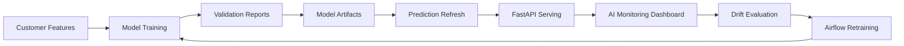

---

## 18. Business Glossary

I defined a business glossary to clarify key terms used in RetailFlow.

| Term | Definition | Owner |
|---|---|---|
| Active customer | A customer with recent purchase or behavioral activity in the platform. | Head of Customer Intelligence |
| Analytics consent | Permission indicator allowing customer data to be used for analytics and customer intelligence exploration. | DPO / Compliance Lead |
| Marketing consent | Permission indicator allowing marketing activation. | DPO / Compliance Lead |
| Personalization consent | Permission indicator allowing personalized recommendations or experiences. | DPO / Compliance Lead |
| Customer event | A behavioral action generated by a customer, such as product view, cart or checkout activity. | Data Steward |
| Valid event | An event that passes required validation rules before persistence. | Data Custodian |
| Dead-letter event | An event rejected by validation and isolated for review. | Data Steward |
| Churn risk | Probability or label indicating the likelihood of customer disengagement. | ML Owner |
| CLV | Customer Lifetime Value, the estimated future value of a customer. | Head of Customer Intelligence |
| Customer segment | Business-readable group of customers with similar behavior or value profile. | ML Owner |
| Retention policy | Rule defining how long a data asset is kept and what action is applied. | DPO / Compliance Lead |
| Anonymization | Process of removing or neutralizing identifying customer attributes. | DPO / Compliance Lead |
| Data quality rule | A rule used to validate data completeness, validity or consistency. | Data Steward |
| Drift | A change in data distribution that can affect model reliability. | ML Owner |
| Audit trail | Recorded evidence of governance-related actions. | Governance Council |

---

## 19. Governance Processes

I defined governance processes to make policies operational.

### 19.1 Consent review process

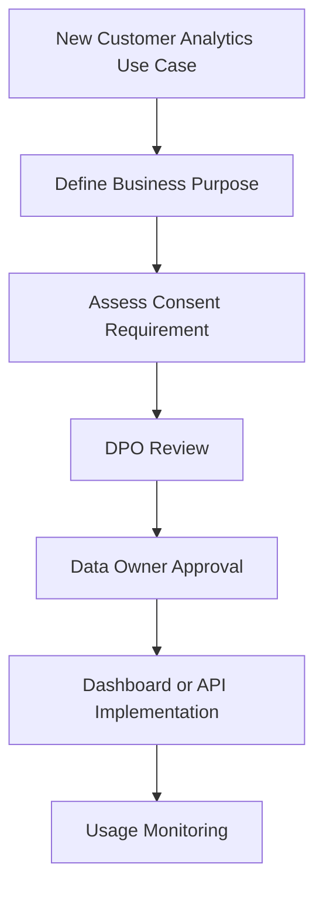

### 19.2 Data quality issue process

1. Data quality issue is detected.
2. Issue is logged in the governance schema.
3. Data Steward reviews severity.
4. Data Custodian investigates technical cause.
5. Data Owner validates business impact.
6. Corrective action is implemented.
7. Issue is monitored for recurrence.

### 19.3 Retention process

1. Retention policy is defined.
2. Airflow retention workflow identifies eligible records.
3. Customer record is anonymized.
4. Consent flags are disabled.
5. Retention action is logged.
6. Governance dashboard exposes the action.
7. Compliance Lead reviews the audit trail.

### 19.4 AI monitoring process

1. Models are trained.
2. Predictions are refreshed.
3. Metrics are generated.
4. Drift is evaluated.
5. AI Monitoring dashboard displays outputs.
6. ML Owner reviews model status.
7. Retraining or investigation is triggered if needed.

---

## 20. Data Quality Controls

Data quality controls protect the platform from poor input data.

### 20.1 Preventive controls

| Control | Description |
|---|---|
| API schemas | Incoming requests must follow expected structures. |
| Event validation | The consumer validates business and technical rules. |
| Referential checks | Customer and product identifiers are checked. |
| Allowed event types | Unsupported event types are rejected. |
| Timestamp validation | Invalid timestamps are rejected. |

### 20.2 Detective controls

| Control | Description |
|---|---|
| Dead-letter monitoring | Rejected events are visible in dashboards. |
| Quality summaries | Failed rules are counted and reviewed. |
| Airflow data quality DAG | Quality checks are scheduled. |
| Streamlit Data Quality page | Quality issues are exposed to users. |

### 20.3 Corrective controls

| Control | Description |
|---|---|
| Dead-letter review | Data Steward reviews rejected events. |
| Rule adjustment | Data quality rules can be adjusted if needed. |
| Pipeline correction | Data Custodian fixes technical causes. |
| Reprocessing path | Future improvement for corrected events. |

---

## 21. Metadata, Lineage and Traceability

Metadata and lineage are important for trust.

RetailFlow currently implements practical traceability through schemas, logs and dashboards.

### 21.1 Technical metadata

Technical metadata exists through:

- PostgreSQL schemas;
- table names;
- column structures;
- model report files;
- Airflow DAGs;
- API endpoints;
- dashboard pages.

### 21.2 Business metadata

Business metadata exists through:

- glossary definitions;
- role ownership;
- retention policies;
- quality rule names;
- segment labels;
- model labels;
- dashboard descriptions.

### 21.3 Lineage overview

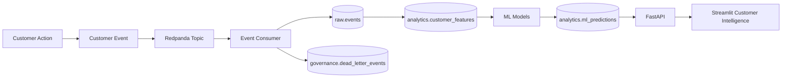

### 21.4 Future lineage improvements

Future improvements include:

- formal data catalog;
- automated lineage extraction;
- data asset owner registry;
- metadata tables;
- dbt documentation;
- OpenLineage integration.

---

## 22. Auditability and Evidence

Auditability is a core part of the RetailFlow governance framework.

Governance decisions and technical controls must produce evidence.

### 22.1 Audit evidence sources

| Evidence source | Purpose |
|---|---|
| `governance.retention_actions_log` | Proves retention and anonymization actions. |
| `governance.dead_letter_events` | Proves invalid event isolation. |
| `governance.data_quality_logs` | Proves quality rule execution and failures. |
| Airflow DAG logs | Prove scheduled workflow execution. |
| ML reports | Prove model validation and monitoring. |
| Prometheus metrics | Prove platform monitoring. |
| Grafana dashboards | Visualize operational health. |
| Streamlit governance page | Provides governance visibility. |
| Streamlit Customer Intelligence page | Proves that customer-level AI predictions are blocked when analytics consent is absent. |
| Streamlit AI Monitoring page | Proves that AI-authorized prediction visibility is aligned with `analytics_consent_count`. |
| Streamlit Project Evidence page | Provides a final evidence matrix and skills evidence matrix for traceability to evaluation criteria. |
| Prometheus alert rules | Prove operational monitoring controls for service availability, latency, error rate and PostgreSQL status. |
| GitHub Actions reports | Prove CI/CD validation, tests and automated security checks. |

### 22.2 Audit questions RetailFlow can answer

RetailFlow can answer governance questions such as:

- Which customers have analytics consent?
- Which retention policies exist?
- Which customer records were anonymized?
- When was an anonymization action executed?
- Which component executed the action?
- Which events were rejected?
- Why were events rejected?
- Which quality rule failed?
- Are AI models monitored?
- Has drift been detected?
- Are platform services healthy?
- Are AI predictions hidden for customers without analytics consent?
- How many customers are authorized for AI visibility according to `analytics_consent_count`?
- Which implemented page or tool proves each academic skill or block requirement?

### 22.3 Audit flow

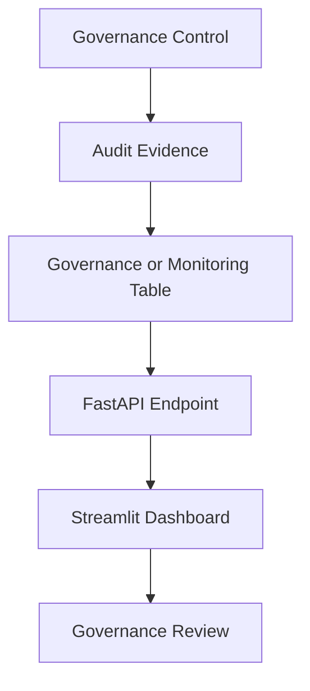

---

## 23. Technology and Tooling

RetailFlow uses technical tools to make governance operational.

### 23.1 Governance technology map

| Capability | Tool / component |
|---|---|
| Consent storage | PostgreSQL customer and governance tables |
| Retention policy storage | `governance.data_retention_policies` |
| Retention automation | Airflow `retention_cleanup` DAG |
| Anonymization audit | `governance.retention_actions_log` |
| Event validation | Python event consumer validators |
| Dead-letter handling | `governance.dead_letter_events` |
| Quality logs | `governance.data_quality_logs` |
| Governance API | FastAPI `/governance/*` endpoints |
| Governance dashboard | Streamlit Data Governance page |
| Quality dashboard | Streamlit Data Quality page |
| AI monitoring | Streamlit AI Monitoring page |
| Project evidence traceability | Streamlit Project Evidence page with final evidence matrix and skills evidence matrix |
| Operational monitoring | Prometheus alert rules and Grafana dashboards |
| CI/CD governance evidence | GitHub Actions tests and security reports |
| Database access control evidence | PostgreSQL read-only role |
| Backup and restore evidence | PostgreSQL backup and restore scripts |
| Workflow orchestration | Airflow |

### 23.2 Governance dashboard architecture

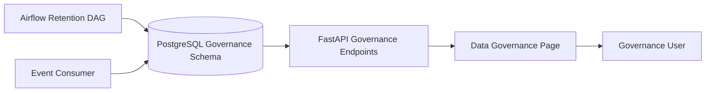

---

## 24. Governance KPIs

I defined governance KPIs to make governance measurable.

### 24.1 KPI table

| KPI | Definition | Target | Owner |
|---|---|---|---|
| Analytics consent coverage | Share of customers with analytics consent enabled. | >= 75% | DPO / Compliance Lead |
| AI-authorized customer count | Number of customers whose AI outputs may be displayed according to `analytics_consent_count`. | Monitored and explained | DPO / Compliance Lead and ML Owner |
| Marketing consent coverage | Share of customers with marketing consent enabled. | >= 50% | Business Owner |
| Personalization consent coverage | Share of customers with personalization consent enabled. | >= 50% | Business Owner |
| Retention policy coverage | Share of critical governed domains covered by a retention policy. | 100% for critical domains | DPO / Compliance Lead |
| Retention action traceability | Share of executed retention actions recorded in the audit log. | 100% | Data Custodian |
| Data quality execution rate | Share of scheduled quality checks executed successfully. | >= 95% | Data Steward |
| Dead-letter rate | Share of rejected events among ingested events. | < 2% | Data Steward |
| High severity issue resolution time | Average time to resolve high severity quality issues. | < 5 business days | Data Steward |
| ML monitoring coverage | Share of production ML models with metrics and drift monitoring. | 100% | ML Owner |
| Evidence coverage | Share of major academic criteria mapped to an implemented proof. | 100% for defended scope | Governance Council |
| Governance review cadence | Share of planned governance reviews completed. | >= 90% | Governance Council |

### 24.2 KPI dashboard logic

Governance KPIs should be reviewed monthly.

They should be presented to the Governance Council with:

- current value;
- target;
- trend;
- owner;
- issue explanation;
- corrective actions.

### 24.3 KPI diagram

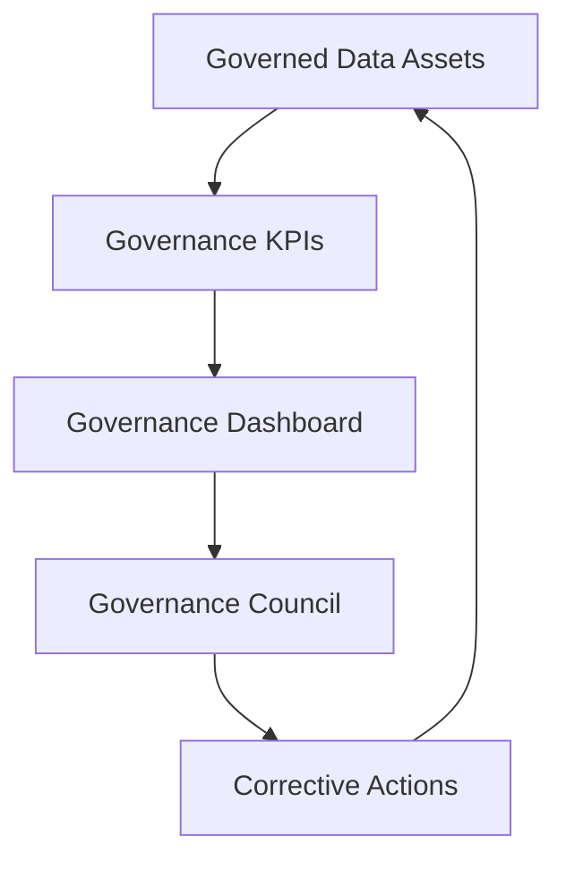

---

## 25. Risk Management

I defined a governance risk register to identify and mitigate data risks.

### 25.1 Risk register

| Risk | Description | Impact | Mitigation | Owner |
|---|---|---|---|---|
| Personal data exposure | Customer data may be accessed or used beyond intended purpose. | High | Consent management, classification, access principles, anonymization | DPO / Compliance Lead |
| Consent misuse | Customer data may be used for analytics or marketing without appropriate consent. | High | Consent-aware dashboards, AI display blocking when analytics consent is absent and policy review | DPO / Compliance Lead |
| Retention failure | Data may be kept longer than needed. | High | Retention policies, Airflow cleanup, audit logs | Data Custodian |
| Poor data quality | Invalid events may affect analytics and ML models. | High | Validation rules, quality logs, dead-letter handling | Data Steward |
| ML drift | Customer behavior may change and reduce model reliability. | Medium | Drift monitoring and retraining DAG | ML Owner |
| Unclear ownership | Issues may remain unresolved if accountability is unclear. | Medium | Operating model and role mapping | Governance Council |
| Dashboard misuse | Users may overinterpret AI outputs. | Medium | Training, metric guides, human oversight and business-readable governance messages | Business Owner |
| Metadata gaps | Users may misunderstand data meaning or lineage. | Medium | Glossary and future catalog roadmap | Data Steward |
| Accessibility gap | Some users may not be able to follow standard training formats. | Medium | Accessible materials and multi-format training | Executive Sponsor |

### 25.2 Risk review process

Risks should be reviewed quarterly by the Governance Council.

For each risk, the council should review:

- current likelihood;
- current impact;
- controls in place;
- control effectiveness;
- open actions;
- owner;
- deadline.

---

## 26. Inclusion and Accessibility

I included inclusion and accessibility in the governance framework because governance only works if users understand and can apply it.

Training and adoption cannot assume that every employee has the same language, learning style, availability or accessibility needs.

### 26.1 Inclusion principles

I defined the following principles:

1. Governance training should be understandable for both technical and non-technical users.
2. Training should be available in multiple languages when teams are international.
3. Documentation should avoid unnecessary jargon.
4. Important policies should be available in accessible formats.
5. Alternative training formats should be provided when needed.
6. Reasonable accommodations should be planned for people with disabilities.
7. Governance adoption should be measured without excluding users who need adapted support.

### 26.2 Multi-language training

RetailFlow should provide governance awareness material in multiple languages when required by the organization.

Priority languages should be based on workforce composition.

Training should cover:

- data ownership;
- consent usage;
- data quality responsibilities;
- retention and anonymization;
- AI output interpretation;
- incident reporting.

### 26.3 Accessibility accommodations

Training and documentation should support:

- screen-reader compatible documents;
- captions for recorded training;
- clear visual contrast;
- readable font sizes;
- non-visual alternatives for diagrams;
- extra time or assisted sessions when needed;
- simplified summaries for non-specialist audiences.

### 26.4 Inclusion in change management

Inclusion must not be treated as a separate afterthought.

It should be integrated into the governance change management plan.

This ensures that governance adoption is fair, accessible and realistic.

---

## 27. Change Management

Governance succeeds only if people adopt it.

I therefore included a change management plan.

### 27.1 Change management objectives

The change management plan aims to:

- explain why governance matters;
- clarify responsibilities;
- train data users;
- reduce resistance;
- make governance part of daily work;
- support inclusion and accessibility;
- create feedback loops.

### 27.2 Stakeholder communication

| Audience | Message |
|---|---|
| Executive Sponsor | Governance protects data value, trust and platform scalability. |
| Data Owners | Governance clarifies accountability and improves decision quality. |
| Data Stewards | Governance gives structure to quality and issue resolution. |
| Data Custodians | Governance requirements are translated into technical controls. |
| Business Users | Governance makes dashboards more trustworthy and usable. |
| ML Users | Governance improves responsible use of predictions. |

### 27.3 Training plan

| Training module | Audience | Format |
|---|---|---|
| Governance fundamentals | All data users | Short online module |
| Consent and privacy | Marketing, analytics, business users | Workshop and quick reference sheet |
| Data quality issue reporting | Data users and stewards | Practical session |
| AI output interpretation | Business and ML users | Dashboard walkthrough |
| Retention and anonymization | DPO, data custodians, stewards | Process training |
| Accessibility and inclusion | Managers and trainers | Awareness session |

### 27.4 Adoption strategy

I defined the following adoption strategy:

1. Start with customer and event domains.
2. Train the most active data users first.
3. Use dashboards to make governance visible.
4. Review KPIs monthly.
5. Collect feedback from users.
6. Improve policies based on recurring issues.
7. Extend governance to additional domains.

---

## 28. Implementation Roadmap

RetailFlow already includes several governance components.

The roadmap therefore includes both completed work and future improvements.

### 28.1 Completed governance implementation

| Area | Completed implementation |
|---|---|
| Consent management | Customer consent fields and consent dashboard |
| Analytics consent | Consent-aware customer explorer and AI display blocking when analytics consent is absent |
| Retention policies | Retention policy table |
| Retention workflow | Airflow `retention_cleanup` DAG |
| Anonymization | Customer anonymization logic |
| Audit trail | Retention action log |
| Data quality | Validation rules and quality logs |
| Dead-letter handling | Invalid events stored in governance dead-letter table |
| Governance dashboard | Streamlit Data Governance page |
| Data Quality dashboard | Streamlit Data Quality page |
| AI governance | AI monitoring, drift, model registry, retraining evidence and consent-aware AI visibility |
| Project evidence | Final evidence matrix and skills evidence matrix mapped to blocks and skills |
| Observability evidence | Prometheus alert rules, Grafana dashboards and Streamlit Observability page |
| CI/CD governance evidence | GitHub Actions tests, Docker validation and security reports |
| Operational resilience evidence | Healthchecks, backup/restore scripts and PostgreSQL read-only role |
| Orchestration | Airflow governance and ML workflows |

### 28.2 Future roadmap

| Phase | Improvement | Purpose |
|---|---|---|
| Phase 1 | Formal data catalog | Improve discoverability and ownership visibility. |
| Phase 2 | Automated lineage | Trace data from source events to dashboards and ML outputs. |
| Phase 3 | Role-based access control | Strengthen access governance by persona. |
| Phase 4 | User-level audit logging | Track who accessed sensitive datasets or dashboards. |
| Phase 5 | Advanced privacy impact assessment | Formalize privacy review for new use cases. |
| Phase 6 | Extended AI governance | Add fairness checks, model registry and approval workflow. |
| Phase 7 | Governance training program | Institutionalize awareness and adoption. |
| Phase 8 | Accessibility governance | Ensure training and documentation remain inclusive. |

### 28.3 Roadmap diagram

```mermaid
flowchart LR
    Done[Current Implementation] --> Catalog[Data Catalog]
    Catalog --> Lineage[Automated Lineage]
    Lineage --> RBAC[Role-Based Access Control]
    RBAC --> Audit[User-Level Audit Logging]
    Audit --> PIA[Privacy Impact Assessment]
    PIA --> AIGov[Advanced AI Governance]
    AIGov --> Training[Governance Training Program]
    Training --> Accessibility[Accessibility Governance]
```

---

## 29. Future Improvements

The governance framework is already strong for the current stage of RetailFlow, but I identified several future improvements.

### 29.1 Data catalog

A data catalog would make assets easier to find and understand.

It should include:

- table descriptions;
- column descriptions;
- owner;
- steward;
- classification;
- retention policy;
- glossary links;
- quality rules;
- lineage.

### 29.2 Metadata automation

Metadata is currently documented through schemas, code and dashboards.

A future improvement would automate metadata collection.

### 29.3 Advanced lineage

Lineage should be extended to show:

```text
source event
→ raw table
→ feature table
→ ML prediction
→ API endpoint
→ Streamlit dashboard
```

### 29.4 Role-based access control

Future platform versions should enforce access based on roles such as:

- Data Steward;
- Business User;
- ML Engineer;
- Compliance Lead;
- Platform Engineer.

### 29.5 Model registry and AI approval

The AI governance framework can be strengthened with:

- model registry;
- approval workflow;
- deployment stages;
- rollback strategy;
- production validation checklist.

### 29.6 Governance issue tracker

A dedicated governance issue tracker would help manage:

- quality issues;
- glossary updates;
- policy questions;
- access requests;
- privacy reviews.

### 29.7 Accessibility review process

Accessibility should be reviewed periodically for:

- training content;
- dashboards;
- Project Evidence and Skills Evidence matrices;
- AI Monitoring metrics aligned with `analytics_consent_count`;
- Prometheus alert rules, Grafana dashboards and CI/CD evidence;
- documentation;
- diagrams;
- onboarding material.

---

## 30. Conclusion

I designed the RetailFlow data governance framework as an operational component of the platform, not as a separate theoretical layer.

The framework covers ownership, policies, consent, retention, anonymization, quality, AI monitoring, auditability, inclusion and continuous improvement.

The main strength of the approach is that governance is embedded directly into the platform design and visible in the final application experience.

This is visible through:

- consent-aware customer intelligence with AI prediction blocking when analytics consent is absent;
- retention policies and anonymization workflow;
- dead-letter event handling;
- quality logs;
- governance APIs;
- dashboards;
- Project Evidence and Skills Evidence matrices;
- AI Monitoring metrics aligned with `analytics_consent_count`;
- Prometheus alert rules, Grafana dashboards and CI/CD evidence;
- Airflow workflows;
- AI monitoring;
- risk and KPI management.

RetailFlow therefore demonstrates a mature approach to data governance for a modern Retail Intelligence platform.

The governance framework makes customer data more trustworthy, business intelligence more reliable, AI outputs more responsible and platform operations more auditable.

# Bloc 2 — RetailFlow Data Architecture Design

## Official Deliverable — Updated Version

**Project:** RetailFlow Platform  
**Document type:** Official written deliverable  
**Scope:** Data architecture, infrastructure, data model, deployment, observability, security foundations and operational readiness  
**Language:** English  
**Updated with latest implementation:** Streamlit final evidence pages, AI consent metrics, Prometheus alert rules, Grafana dashboards, CI/CD security checks, healthchecks, backup/restore scripts and readonly database role.

---

## Table of Contents

1. Executive Summary
2. Architecture Objectives
3. Business and Technical Context
4. Current Implementation Snapshot
5. High-Level Architecture
6. Design Principles
7. Runtime Infrastructure
8. Service Responsibilities
9. Network and Communication Design
10. PostgreSQL Data Architecture
11. Data Model and Domains
12. Analytical Star Schema Design
13. Data Flow Architecture
14. API Architecture
15. Streamlit Application Architecture
16. Airflow Orchestration Architecture
17. Machine Learning Integration
18. Observability and Alerting Architecture
19. CI/CD Architecture
20. Security and Privacy Architecture
21. Backup, Restore and Continuity
22. Infrastructure as Code Approach
23. Operational Runbook
24. Block 2 Competency Mapping
25. Limitations and Risk Awareness
26. Future Architecture Roadmap
27. Conclusion
28. Appendix A — Component Inventory
29. Appendix B — Main Evidence Locations

---

# 1. Executive Summary

I designed the RetailFlow Platform as an end-to-end Retail Intelligence architecture for modern e-commerce organizations.

The platform transforms customer events, operational retail data, governance controls and machine learning outputs into a governed, observable and decision-ready system.

The architecture combines:

- Docker Compose for reproducible local deployment;
- PostgreSQL as the central operational, analytical and governance database;
- Redpanda as a Kafka-compatible streaming broker;
- FastAPI as the service and event publication layer;
- a Python event consumer for validation and persistence;
- Streamlit as the guided business, governance, AI and evidence interface;
- Apache Airflow for scheduled workflows;
- Prometheus and Grafana for observability;
- PostgreSQL exporter for database metrics;
- GitHub Actions for CI/CD validation;
- security and operations controls such as healthchecks, readonly role, backup and restore scripts and automated security reports.

The architecture is not limited to a set of isolated tools. I designed it as a coherent data platform where each component has a clear responsibility and where governance, observability and AI are integrated by design.

The main architecture value chain is:

```text
Customer interaction
→ event publication
→ streaming ingestion
→ validation and quality control
→ governed PostgreSQL storage
→ analytical features
→ AI predictions and segments
→ API serving
→ Streamlit decision support
→ monitoring, CI/CD and operations
```

This document presents the architecture from both a conceptual and implementation point of view.

---

# 2. Architecture Objectives

The RetailFlow architecture was designed around the following objectives.

| Objective | Architectural Response |
|---|---|
| Build an end-to-end data platform | Docker Compose stack integrating UI, API, streaming, database, orchestration, monitoring and ML |
| Support real-time event ingestion | FastAPI event producer, Redpanda topic and Python consumer |
| Separate data concerns | PostgreSQL schemas: `raw`, `core`, `analytics`, `governance` |
| Make governance operational | Consent, retention, audit, quality logs and dead-letter tables |
| Support AI and MLOps | Feature tables, prediction tables, model reports, AI API endpoints and AI Monitoring dashboard |
| Improve reliability | Docker healthchecks, Prometheus targets, alert rules and documented operations |
| Support security foundations | readonly database role, environment configuration example, security CI reports |
| Support maintainability | modular codebase, CI/CD validation, documentation and evidence matrix |
| Prepare future production evolution | cloud and Kubernetes roadmap, monitoring roadmap and access-control roadmap |

The goal is to demonstrate a realistic architecture that is understandable, maintainable and defendable during the master thesis evaluation.

---

# 3. Business and Technical Context

RetailFlow is a Retail Intelligence platform designed for a multi-category e-commerce organization.

The platform must handle multiple types of information:

- customer profiles;
- product catalog data;
- browsing sessions;
- product view events;
- cart and checkout events;
- orders, payments, shipments and returns;
- reviews and support tickets;
- consent indicators;
- data quality evidence;
- ML features, predictions and segments;
- monitoring and operational metrics.

The architecture supports business questions such as:

- Which customers are likely to churn?
- Which customers have high future value?
- Which customer segments require differentiated actions?
- Are customer events being ingested correctly?
- Are invalid events isolated and traceable?
- Are customer intelligence outputs aligned with analytics consent?
- Are the platform services healthy?
- Are the models monitored and retrainable?

From a technical point of view, the platform demonstrates:

- event-driven ingestion;
- relational data modeling;
- governance by design;
- ML serving;
- observability;
- CI/CD;
- operational documentation;
- reproducible deployment.

---

# 4. Current Implementation Snapshot

The latest implementation includes the following major components.

| Area | Current implementation |
|---|---|
| Runtime | Docker Compose local multi-service platform |
| Database | PostgreSQL with `raw`, `core`, `analytics`, `governance` schemas |
| Streaming | Redpanda topic `retailflow_events` |
| API | FastAPI endpoints for products, events, quality, governance, AI, health and metrics |
| Consumer | Python consumer with validation and dead-letter persistence |
| UI | Streamlit 10-page guided platform |
| Orchestration | Airflow DAGs for sales aggregation, data quality, ML retraining and retention cleanup |
| Monitoring | Prometheus targets, Grafana dashboards and Streamlit Observability page |
| Alerting | Prometheus alert rules for API, PostgreSQL exporter, latency, error rate and DB connections |
| CI/CD | GitHub Actions with tests, compile checks, Docker validation and security reports |
| Security foundation | readonly PostgreSQL role, environment example, dependency audit and static security checks |
| Continuity | PostgreSQL backup and restore scripts |
| Evidence | Project Evidence page with final evidence matrix and Skills evidence matrix |

The latest Streamlit structure is:

| Page | Purpose |
|---|---|
| `1_Platform_Overview.py` | Global architecture and platform entry point |
| `2_Customer_View.py` | Customer event demo and event generation |
| `3_Customer_Intelligence.py` | Governed AI decision support and consent-aware customer intelligence |
| `4_Data_Governance.py` | Governance operating model, consent, retention, risks and policies |
| `5_Data_Architecture.py` | Architecture evidence and technical mapping |
| `6_Data_Quality.py` | Dead-letter events, quality rules and remediation workflow |
| `7_AI_Monitoring.py` | Model registry, reports, drift, retraining and consent-aware AI metrics |
| `8_Observability.py` | Prometheus, Grafana, targets, alerts and platform health |
| `9_CI_CD_and_Operations.py` | CI/CD, operations, backup, restore and security evidence |
| `10_Project_Evidence.py` | Final evidence matrix and Skills evidence matrix |

---

# 5. High-Level Architecture

RetailFlow follows a layered platform architecture.

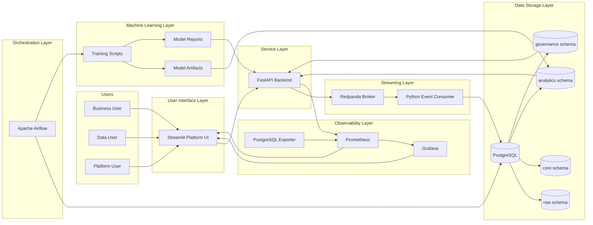

The design separates:

- user interaction;
- service access;
- streaming transport;
- persistence;
- orchestration;
- AI lifecycle;
- monitoring;
- evidence and documentation.

---

# 6. Design Principles

## 6.1 Modularity

Each component has a dedicated responsibility.

| Component | Main responsibility |
|---|---|
| Streamlit | Guided interface and proof dashboard |
| FastAPI | Backend service, API contract and event producer |
| Redpanda | Event broker |
| Event consumer | Event validation and persistence |
| PostgreSQL | Central database |
| Airflow | Scheduled workflows |
| ML scripts | Training, prediction, drift and model registry generation |
| Prometheus | Metrics collection |
| Grafana | Metrics visualization |
| GitHub Actions | Continuous validation |

This modularity improves explainability and maintainability.

## 6.2 Separation of Concerns

The platform separates UI, API, streaming, storage, governance, analytics, ML and monitoring concerns.

For example:

- Streamlit does not write live events directly into `raw.events`;
- FastAPI publishes events to Redpanda;
- the consumer validates events before database insertion;
- governance evidence is stored in dedicated governance tables;
- AI predictions are stored in analytics tables and served through API endpoints;
- monitoring is handled by Prometheus and Grafana rather than by business pages only.

## 6.3 Governance by Design

Governance is embedded in the architecture through:

- consent fields;
- retention policies;
- retention action logs;
- anonymization workflow;
- dead-letter events;
- quality logs;
- AI consent controls;
- governance dashboards.

## 6.4 Observability by Design

Observability is embedded through:

- service healthchecks;
- FastAPI `/metrics`;
- PostgreSQL exporter metrics;
- Prometheus targets;
- Grafana dashboards;
- alert rules;
- Streamlit Observability page.

## 6.5 Local Reproducibility

Docker Compose is used as the main runtime.

This allows the complete project to be launched and evaluated consistently on a local machine.

## 6.6 Future-Ready Deployment

The current runtime is local, but the architecture can evolve toward:

- Kubernetes;
- managed PostgreSQL;
- managed Kafka-compatible broker;
- container registry;
- managed Airflow;
- cloud monitoring;
- IAM and SSO;
- production secrets management.

---

# 7. Runtime Infrastructure

The Docker Compose runtime contains the following services.

| Service | Container name | Role |
|---|---|---|
| PostgreSQL | `retailflow_postgres` | Main database |
| pgAdmin | `retailflow_pgadmin` | Database administration |
| Redpanda | `retailflow_redpanda` | Kafka-compatible broker |
| FastAPI | `retailflow_fastapi` | Backend service layer |
| Event consumer | `retailflow_event_consumer` | Streaming ingestion and validation |
| Streamlit | `retailflow_streamlit` | Platform UI |
| Airflow webserver | `retailflow_airflow_webserver` | Airflow UI |
| Airflow scheduler | `retailflow_airflow_scheduler` | DAG scheduler |
| Airflow PostgreSQL | `retailflow_airflow_postgres` | Airflow metadata database |
| Prometheus | `retailflow_prometheus` | Metrics collection |
| Grafana | `retailflow_grafana` | Dashboards |
| PostgreSQL exporter | `retailflow_postgres_exporter` | Database metrics exporter |

The platform is started with:

```bash
docker compose up -d
```

The Streamlit and FastAPI images are buildable from their Dockerfiles, and the event consumer has its own Dockerfile.

---

# 8. Service Responsibilities

## 8.1 PostgreSQL

PostgreSQL is the central database of RetailFlow.

It stores:

- raw events;
- clean business entities;
- analytical features;
- ML predictions;
- customer segments;
- retention policies;
- retention action logs;
- quality logs;
- dead-letter events.

## 8.2 pgAdmin

pgAdmin provides a visual database administration interface.

It is useful for demonstrating:

- schemas;
- tables;
- records;
- dead-letter evidence;
- retention logs;
- AI prediction records.

## 8.3 Redpanda

Redpanda provides the streaming layer.

It receives customer events from FastAPI and exposes them to the event consumer.

## 8.4 FastAPI

FastAPI exposes service endpoints for:

- product data;
- customer events;
- recent events;
- quality summaries;
- governance summaries;
- AI predictions;
- model reports;
- health checks;
- Prometheus metrics.

## 8.5 Event Consumer

The consumer reads from Redpanda and applies validation rules.

It persists:

- valid events into `raw.events`;
- invalid events into `governance.dead_letter_events`;
- quality failures into `governance.data_quality_logs`.

## 8.6 Streamlit

Streamlit is the main guided demonstration interface.

It exposes business, technical and academic evidence in a structured way.

## 8.7 Airflow

Airflow orchestrates recurring workflows:

- daily sales aggregation;
- daily data quality checks;
- weekly ML retraining;
- retention cleanup.

## 8.8 Prometheus and Grafana

Prometheus collects metrics, while Grafana visualizes platform health.

The Observability page links these tools and summarizes their evidence.

## 8.9 GitHub Actions

GitHub Actions validates code, tests, Docker configuration, Docker builds and security checks.

This makes the architecture maintainable and safer to evolve.

---

# 9. Network and Communication Design

Services communicate through the Docker Compose network using service names.

| From | To | Internal endpoint |
|---|---|---|
| Streamlit | FastAPI | `http://fastapi:8000` |
| FastAPI | PostgreSQL | `postgres:5432` |
| FastAPI | Redpanda | `redpanda:9092` |
| Consumer | Redpanda | `redpanda:9092` |
| Consumer | PostgreSQL | `postgres:5432` |
| Airflow | PostgreSQL | `postgres:5432` |
| Prometheus | FastAPI | `fastapi:8000/metrics` |
| Prometheus | PostgreSQL exporter | `postgres_exporter:9187/metrics` |
| Grafana | Prometheus | `prometheus:9090` |

External access is available through localhost ports.

| Component | Local URL |
|---|---|
| Streamlit | `http://localhost:8501` |
| FastAPI Docs | `http://localhost:8000/docs` |
| PostgreSQL | `localhost:5432` |
| pgAdmin | `http://localhost:5050` |
| Airflow | `http://localhost:8080` |
| Prometheus | `http://localhost:9090` |
| Grafana | `http://localhost:3000` |
| PostgreSQL exporter | `http://localhost:9187/metrics` |

This network design keeps internal service communication stable while allowing the evaluator to access tools through a browser.

---

# 10. PostgreSQL Data Architecture

PostgreSQL is organized into four main schemas.

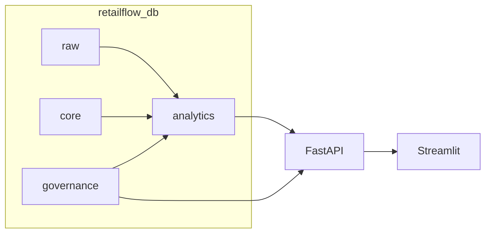

| Schema | Purpose |
|---|---|
| `raw` | Ingested event-level data |
| `core` | Clean business entities |
| `analytics` | Derived features, aggregates, predictions and segments |
| `governance` | Consent, retention, quality, dead-letter and audit records |

This separation is important because it avoids mixing raw ingestion, trusted operational data, analytical outputs and governance evidence.

---

# 11. Data Model and Domains

RetailFlow is organized around business and technical domains.

| Domain | Main tables | Purpose |
|---|---|---|
| Customer | `core.customers`, `governance.customer_consents` | Customer identity, account state and consent context |
| Product | `core.products`, `core.suppliers` | Product catalog and supplier reference |
| Commerce | `core.orders`, `core.order_items`, `core.payments`, `core.shipments`, `core.returns` | Transaction lifecycle |
| Interaction | `raw.events`, `core.sessions`, `core.reviews`, `core.support_tickets` | Behavior and experience signals |
| Analytics | `analytics.customer_features`, `analytics.daily_sales` | BI and ML-ready indicators |
| AI | `analytics.ml_predictions`, `analytics.customer_segments` | Customer intelligence outputs |
| Governance | `governance.data_retention_policies`, `governance.retention_actions_log`, `governance.dead_letter_events`, `governance.data_quality_logs` | Compliance, audit and quality evidence |

## 11.1 Main Relationships

| Relationship | Meaning |
|---|---|
| `customers → orders` | A customer can place multiple orders |
| `orders → order_items` | An order contains one or more products |
| `products → order_items` | A product can be sold in many order lines |
| `customers → sessions` | A customer can generate multiple browsing sessions |
| `sessions → raw.events` | A session contains customer events |
| `customers → analytics.customer_features` | Features summarize customer behavior |
| `customers → analytics.ml_predictions` | Predictions are generated at customer level |
| `customers → analytics.customer_segments` | Customers are assigned to segments |
| `dead_letter_events → data_quality_logs` | Rejected events are linked to rule failures |
| `retention_policies → retention_actions_log` | Retention actions are executed under policy control |

## 11.2 Logical ERD

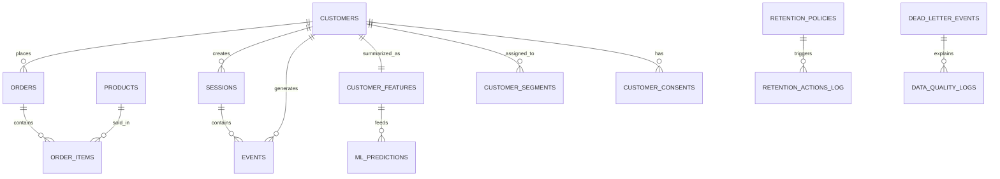

---

# 12. Analytical Star Schema Design

The relational model is normalized for consistency and governance.

On top of it, the analytical layer behaves like star schemas for reporting, dashboards and AI.

## 12.1 Sales Analytics Star Schema

| Star object | Implemented physical representation |
|---|---|
| `fact_sales` | `core.orders`, `core.order_items`, `core.payments`, `core.returns`, `analytics.daily_sales` |
| `dim_customer` | `core.customers` |
| `dim_product` | `core.products` |
| `dim_supplier` | `core.suppliers` |
| `dim_date` | derived from order timestamps and aggregation dates |
| `dim_category` | product category from `core.products` |

Supported questions:

- How does revenue evolve by day?
- Which categories generate revenue?
- Which products or customers contribute most?
- How do returns affect net revenue?

## 12.2 Customer Activity Star Schema

| Star object | Implemented physical representation |
|---|---|
| `fact_customer_activity` | `raw.events`, `core.sessions` |
| `dim_customer` | `core.customers` |
| `dim_product` | `core.products` |
| `dim_event_type` | validated event type values |
| `dim_session` | `core.sessions` |

Supported questions:

- Which event types occur most often?
- Which customers are active?
- Which products generate views or cart actions?
- Where do invalid events appear?

## 12.3 AI Predictions Star Schema

| Star object | Implemented physical representation |
|---|---|
| `fact_ai_predictions` | `analytics.ml_predictions` |
| `dim_customer` | `core.customers` |
| `dim_segment` | `analytics.customer_segments` |
| `dim_model` | model metadata and report files |
| `dim_date` | derived from prediction timestamps |

Supported questions:

- Which customers have high churn risk?
- Which customers have high predicted CLV?
- Which segments contain the most customers?
- Which model version generated the prediction?

---

# 13. Data Flow Architecture

## 13.1 Historical Data Flow

```mermaid
flowchart LR
    Generator[Data Generator] --> CSV[CSV Files]
    CSV --> Loader[Database Loader]
    Loader --> Core[core schema]
    Loader --> Raw[raw schema]
    Loader --> Analytics[analytics schema]
    Loader --> Governance[governance schema]
```

This initializes the platform with realistic e-commerce data.

## 13.2 Real-Time Event Flow

```mermaid
flowchart LR
    CustomerAction[Customer Action] --> Streamlit[Customer View]
    Streamlit --> FastAPI[POST /events]
    FastAPI --> Redpanda[retailflow_events]
    Redpanda --> Consumer[Python Consumer]
    Consumer --> Validation[Validation Rules]
    Validation -->|Valid| RawEvents[(raw.events)]
    Validation -->|Invalid| DeadLetters[(governance.dead_letter_events)]
    Validation --> QualityLogs[(governance.data_quality_logs)]
```

This flow shows how customer behavior becomes trusted or rejected event data.

## 13.3 Analytics and AI Flow

```mermaid
flowchart LR
    Core[core schema] --> Features[analytics.customer_features]
    Raw[raw.events] --> Features
    Features --> Train[ML Training]
    Train --> Models[Model Artifacts]
    Models --> Predict[predict.py]
    Predict --> Predictions[analytics.ml_predictions]
    Predict --> Segments[analytics.customer_segments]
    Predictions --> API[FastAPI /ai]
    Segments --> API
    API --> UI[Customer Intelligence and AI Monitoring]
```

## 13.4 Governance Flow

```mermaid
flowchart LR
    Customers[core.customers] --> Consents[Consent Fields]
    Policies[governance.data_retention_policies] --> DAG[retention_cleanup DAG]
    DAG --> Customers
    DAG --> Logs[governance.retention_actions_log]
    DeadLetters[governance.dead_letter_events] --> Quality[Data Quality Page]
    Consents --> GovernanceAPI[FastAPI /governance]
    Logs --> GovernanceAPI
    GovernanceAPI --> GovernanceUI[Data Governance Page]
```

## 13.5 Observability Flow

```mermaid
flowchart LR
    FastAPI[FastAPI /metrics] --> Prometheus
    PGExporter[PostgreSQL Exporter] --> Prometheus
    Prometheus --> Grafana
    Prometheus --> ObservabilityUI[Streamlit Observability]
    Grafana --> ObservabilityUI
    AlertRules[Prometheus Alert Rules] --> Prometheus
```

---

# 14. API Architecture

FastAPI is the central access layer between Streamlit, the database, Redpanda and monitoring tools.

```mermaid
flowchart TB
    Streamlit --> API[FastAPI]
    API --> ProductRoutes[/products]
    API --> EventRoutes[/events]
    API --> QualityRoutes[/quality]
    API --> GovernanceRoutes[/governance]
    API --> AIRoutes[/ai]
    API --> Health[/health]
    API --> Metrics[/metrics]
    EventRoutes --> Redpanda
    ProductRoutes --> PostgreSQL
    QualityRoutes --> PostgreSQL
    GovernanceRoutes --> PostgreSQL
    AIRoutes --> PostgreSQL
    AIRoutes --> Reports[ml/reports]
    Metrics --> Prometheus
```

Main endpoint groups:

| Endpoint group | Purpose |
|---|---|
| `/products` | Product catalog and product details |
| `/events` | Event publication and recent events |
| `/quality` | Dead-letter and quality summaries |
| `/governance` | Consent, retention and governance summaries |
| `/ai` | Predictions, segments, customer profiles and model reports |
| `/health` | Service and database status |
| `/metrics` | Prometheus-compatible metrics |

The AI endpoints support consent-aware customer exploration through parameters such as `analytics_consent_only`.

---

# 15. Streamlit Application Architecture

Streamlit is structured as a multi-page product interface and evidence layer.

```mermaid
flowchart TB
    Home[Streamlit Home]
    Home --> Overview[Platform Overview]
    Home --> CustomerView[Customer View]
    Home --> CustomerIntel[Customer Intelligence]
    Home --> Governance[Data Governance]
    Home --> Architecture[Data Architecture]
    Home --> Quality[Data Quality]
    Home --> AIMonitoring[AI Monitoring]
    Home --> Observability[Observability]
    Home --> CICD[CI/CD and Operations]
    Home --> Evidence[Project Evidence]
```

The latest UI improvements include:

- block badges on pages;
- shared UI components in `streamlit_app/components.py`;
- business-friendly proof cards;
- technical evidence expanders;
- academic mapping tables;
- final Project Evidence matrix;
- Skills evidence matrix;
- consent-aware AI display logic;
- Streamlit pages aligned with the four competency blocks.

## 15.1 Customer Intelligence Consent Logic

The Customer Intelligence page uses analytics consent as an architectural governance boundary.

If a customer does not have analytics consent, the page displays a governance message and hides:

- churn prediction;
- CLV prediction;
- segmentation output;
- AI recommendations;
- raw AI profile.

This demonstrates that architecture and governance are connected in the application layer.

## 15.2 AI Monitoring Consent Metric

The AI Monitoring page uses `analytics_consent_count` as the visible count for AI-authorized customers and prediction availability.

This prevents confusion between raw technical prediction rows and authorized visible AI outputs.

## 15.3 Project Evidence Architecture

The Project Evidence page provides:

- a final evidence matrix by block;
- a Skills evidence matrix by competency ID;
- tool map;
- live demo path;
- academic mapping;
- technical evidence inventory.

This page acts as the final presentation layer for the architecture work.

---

# 16. Airflow Orchestration Architecture

Airflow orchestrates recurring data and MLOps workflows.

```mermaid
flowchart TB
    Airflow[Apache Airflow]
    Airflow --> Sales[daily_sales_aggregation]
    Airflow --> Quality[daily_data_quality]
    Airflow --> ML[ml_retraining]
    Airflow --> Retention[retention_cleanup]

    Sales --> DailySales[(analytics.daily_sales)]
    Quality --> DeadLetters[(governance.dead_letter_events)]
    ML --> Reports[ml/reports]
    ML --> Predictions[(analytics.ml_predictions)]
    Retention --> Customers[(core.customers)]
    Retention --> RetentionLogs[(governance.retention_actions_log)]
```

| DAG | Purpose |
|---|---|
| `daily_sales_aggregation` | Refreshes analytical sales aggregates |
| `daily_data_quality` | Checks data quality and dead-letter signals |
| `ml_retraining` | Retrains models, refreshes predictions and evaluates drift |
| `retention_cleanup` | Applies retention and anonymization logic |

Airflow provides scheduling, operational visibility and repeatability.

---

# 17. Machine Learning Integration

The ML layer is integrated into the data architecture rather than being isolated in notebooks.

```mermaid
flowchart TB
    Features[(analytics.customer_features)] --> Churn[train_churn.py]
    Features --> CLV[train_clv.py]
    Features --> Segmentation[train_segmentation.py]

    Churn --> ChurnModel[churn_model.joblib]
    CLV --> CLVModel[clv_model.joblib]
    Segmentation --> SegmentModel[segmentation_model.joblib]

    ChurnModel --> Predict[predict.py]
    CLVModel --> Predict
    SegmentModel --> Predict

    Predict --> Predictions[(analytics.ml_predictions)]
    Predict --> Segments[(analytics.customer_segments)]

    Reports[ml/reports/*.json] --> API[FastAPI /ai]
    Predictions --> API
    Segments --> API
    API --> CustomerIntel[Customer Intelligence]
    API --> AIMonitoring[AI Monitoring]
```

Implemented AI use cases:

| Use case | Output | Storage |
|---|---|---|
| Churn prediction | churn probability and risk label | `analytics.ml_predictions` |
| CLV prediction | predicted customer lifetime value and band | `analytics.ml_predictions` |
| Customer segmentation | business-readable segment label | `analytics.customer_segments` |

The Streamlit Dockerfile copies the `ml` directory so that model reports are available to the AI Monitoring page inside the container.

---

# 18. Observability and Alerting Architecture

RetailFlow includes operational monitoring through Prometheus, Grafana and Streamlit.

## 18.1 Monitoring Components

| Component | Role |
|---|---|
| FastAPI `/metrics` | Exposes application metrics |
| PostgreSQL exporter | Exposes database metrics |
| Prometheus | Scrapes metrics and evaluates alert rules |
| Grafana | Visualizes operational dashboards |
| Streamlit Observability | Provides a guided evidence page |

## 18.2 Grafana Dashboards

The implemented Grafana dashboards include:

- `RetailFlow API Overview`;
- `RetailFlow Platform Overview`.

These dashboards support evidence of platform monitoring and operational visibility.

## 18.3 Prometheus Alert Rules

The implemented alert rules include:

| Alert | Purpose |
|---|---|
| `RetailFlowFastAPIDown` | Detect FastAPI unavailability |
| `RetailFlowPostgresExporterDown` | Detect PostgreSQL exporter unavailability |
| `RetailFlowHighFastAPIRequestLatency` | Detect latency degradation |
| `RetailFlowFastAPIHighErrorRate` | Detect API error rate increase |
| `RetailFlowPostgresTooManyConnections` | Detect excessive PostgreSQL connections |

These rules provide production-oriented monitoring evidence.

## 18.4 Observability Evidence

The monitoring evidence is documented and visible through:

- `docs/MONITORING.md`;
- `docs/MONITORING_EVIDENCE.md`;
- Streamlit Observability page;
- Prometheus targets;
- Prometheus alerts;
- Grafana dashboards.

---

# 19. CI/CD Architecture

GitHub Actions validates the platform before changes are considered stable.

```mermaid
flowchart LR
    Push[Push / Pull Request] --> CI[GitHub Actions]
    CI --> Install[Install Dependencies]
    Install --> Compile[Python compileall]
    Compile --> Tests[Run tests]
    Tests --> Compose[Docker Compose validation]
    Compose --> Security[Security checks]
    Security --> Build[Docker image validation]
    Build --> Result[CI result]
```

## 19.1 Implemented CI/CD Capabilities

| Capability | Implementation |
|---|---|
| Python validation | `python -m compileall` |
| Test execution | `pytest` tests |
| Docker Compose validation | `docker compose config` |
| Docker image validation | FastAPI, Streamlit and consumer Docker builds |
| Security static checks | Bandit-style security scan |
| Dependency audit | pip-audit dependency report |
| Report artifacts | CI security reports stored as artifacts |
| Documentation | `docs/CI_CD.md` |

## 19.2 CI/CD Scope Boundary

The current pipeline validates code and build readiness.

It does not automatically deploy to a production Kubernetes cluster.

The current maturity is therefore:

```text
code validation
→ test validation
→ security report generation
→ container build readiness
```

The future production evolution would be:

```text
build image
→ push to registry
→ deploy to Kubernetes
→ run smoke tests
→ monitor rollout
```

---

# 20. Security and Privacy Architecture

RetailFlow includes security foundations adapted to the project scope.

## 20.1 Current Security Controls

| Control | Implementation |
|---|---|
| Database schema separation | `raw`, `core`, `analytics`, `governance` |
| Least privilege foundation | readonly PostgreSQL role |
| Environment configuration | `.env.example` |
| CI security checks | automated static and dependency checks |
| Consent-aware AI display | Customer Intelligence hides AI outputs without analytics consent |
| Retention workflow | Airflow `retention_cleanup` |
| Auditability | retention logs, dead-letter records and quality logs |
| Container separation | services isolated by Docker Compose |

## 20.2 Privacy Controls

Privacy is addressed through:

- customer consent fields;
- analytics consent count;
- consent-aware AI dashboards;
- data retention policies;
- anonymization workflow;
- audit logs;
- governance documentation;
- responsible AI principles.

## 20.3 Security Roadmap

Future security hardening should include:

- API authentication;
- RBAC in dashboards;
- secret manager integration;
- encrypted production storage;
- centralized audit logs;
- SSO;
- network policies;
- production-grade IAM.

---

# 21. Backup, Restore and Continuity

RetailFlow includes backup and restore scripts for PostgreSQL.

This supports operational continuity in a local demonstration and future production design.

## 21.1 Backup Strategy

The current backup strategy includes:

- PostgreSQL SQL backups;
- backup directory tracked with `.gitkeep` but SQL dump files ignored;
- documented backup and restore commands;
- operations documentation.

## 21.2 Continuity Controls

| Control | Current status |
|---|---|
| PostgreSQL backup script | Implemented |
| PostgreSQL restore script | Implemented |
| Docker healthchecks | Implemented for core services |
| Monitoring targets | Implemented |
| Alert rules | Implemented |
| Full HA / failover cluster | Future improvement |

This is realistic for the current local platform scope.

---

# 22. Infrastructure as Code Approach

RetailFlow uses configuration files as infrastructure evidence.

| Asset | Purpose |
|---|---|
| `docker-compose.yml` | Main local runtime definition |
| `api/Dockerfile` | FastAPI container build |
| `streamlit_app/Dockerfile` | Streamlit container build |
| `pipeline/consumer/Dockerfile` | Event consumer build |
| `monitoring/prometheus/` | Prometheus configuration and alert rules |
| `monitoring/grafana/` | Grafana provisioning and dashboards |
| `database/init/` | PostgreSQL initialization scripts |
| `airflow/dags/` | Workflow definitions |
| `.github/workflows/` | CI/CD workflows |
| `docs/` | Operations, monitoring and CI/CD documentation |

This approach makes the platform reproducible, reviewable and version-controlled.

---

# 23. Operational Runbook

## 23.1 Start the Platform

```bash
docker compose up -d
```

## 23.2 Rebuild Streamlit After UI Changes

```bash
docker compose up -d --build streamlit
```

## 23.3 Check Core Services

```bash
docker compose ps
```

## 23.4 Check FastAPI Health

```bash
curl -i http://localhost:8000/health
```

## 23.5 Check Streamlit Health

```bash
curl -i http://localhost:8501/_stcore/health
```

## 23.6 Check Prometheus Targets

Open:

```text
http://localhost:9090/targets
```

## 23.7 Check Prometheus Alerts

Open:

```text
http://localhost:9090/alerts
```

## 23.8 Check Grafana

Open:

```text
http://localhost:3000
```

Dashboards:

```text
RetailFlow API Overview
RetailFlow Platform Overview
```

## 23.9 Check Airflow

Open:

```text
http://localhost:8080
```

Main DAGs:

```text
daily_sales_aggregation
daily_data_quality
ml_retraining
retention_cleanup
```

## 23.10 Check Git Status

```bash
git status
git log --oneline -5
```

---

# 24. Block 2 Competency Mapping

| Competency Area | RetailFlow Evidence |
|---|---|
| Architecture adapted to project requirements | Modular platform covering e-commerce events, governance, analytics, AI and monitoring |
| Flexibility | Docker Compose services separated by responsibility and API-based integration |
| Volume, variety and velocity | Redpanda event flow, PostgreSQL schemas, JSON payloads, ML reports and monitoring metrics |
| Reliability and availability | healthchecks, backup/restore, Prometheus targets, alert rules and Grafana dashboards |
| Scalability | broker/consumer/API separation, future partitioning and Kubernetes roadmap |
| Continuity | backup/restore scripts and operations documentation |
| Security and privacy | readonly DB role, consent-aware AI views, retention policies and CI security reports |
| GDPR alignment | consent, retention, anonymization and auditability integrated into schemas and workflows |
| Documentation | README, operations docs, monitoring docs, CI/CD docs and Streamlit evidence pages |
| Code quality | modular repository, tests, compileall and GitHub Actions CI |

---

# 25. Limitations and Risk Awareness

The current architecture is strong for a master thesis demonstrator, but it is not a fully production-hardened enterprise platform.

| Limitation | Explanation | Future improvement |
|---|---|---|
| Local runtime | Docker Compose is the primary runtime | Kubernetes or cloud deployment |
| No enterprise IAM | Authentication and authorization are not fully implemented | SSO, RBAC, API auth |
| No full HA database cluster | PostgreSQL runs as a local service | managed PostgreSQL, replicas, failover |
| Limited broker monitoring | Basic service observability exists | broker metrics, consumer lag dashboards |
| No fully automated DLQ replay | Dead-letter evidence exists | controlled replay workflow |
| Limited production deployment automation | CI validates builds but does not deploy to cloud | registry push and Kubernetes rollout |
| Lightweight ML monitoring | Drift report exists | advanced model monitoring and alerting |

These limitations are explicitly identified because the objective is to demonstrate architecture design, implementation and risk awareness, not to overclaim enterprise production maturity.

---

# 26. Future Architecture Roadmap

## 26.1 Short-Term Improvements

| Improvement | Value |
|---|---|
| Add API authentication | Protect endpoints |
| Add Streamlit smoke tests | Improve CI coverage for dashboards |
| Add broker metrics | Monitor topic throughput and consumer lag |
| Expand PostgreSQL indexes | Improve query performance |
| Add more integration tests | Strengthen regression protection |

## 26.2 Medium-Term Improvements

| Improvement | Value |
|---|---|
| Add RBAC | Control access by role |
| Add data catalog | Improve discoverability and lineage |
| Add dbt layer | Improve SQL transformations and documentation |
| Add model registry | Improve ML lifecycle governance |
| Add automated DLQ replay | Improve data quality operations |

## 26.3 Long-Term Improvements

| Improvement | Value |
|---|---|
| Kubernetes deployment | Production-grade orchestration |
| Cloud-managed PostgreSQL | Reliability and scalability |
| Managed Kafka-compatible broker | Operational resilience |
| Managed Airflow | Scalable orchestration |
| Enterprise IAM / SSO | Security and user governance |
| Advanced observability | Alert routing, SLOs and incident management |

---

# 27. Conclusion

The RetailFlow data architecture demonstrates a coherent and integrated platform for retail intelligence.

It combines:

- real-time event ingestion;
- relational data modeling;
- governance by design;
- analytical data preparation;
- AI integration;
- API serving;
- Streamlit dashboards;
- Airflow orchestration;
- Prometheus and Grafana observability;
- CI/CD automation;
- operational documentation;
- security and continuity foundations.

The architecture is realistic because it includes both implemented capabilities and honest boundaries.

It is not presented as a fully production-hardened enterprise system.

It is presented as a complete, reproducible, observable and governed platform demonstrator with a clear path toward production maturity.

---

# Appendix A — Component Inventory

| Component | Path or Location | Role |
|---|---|---|
| Docker Compose | `docker-compose.yml` | Local multi-service runtime |
| FastAPI app | `api/app/` | Backend service layer |
| FastAPI Dockerfile | `api/Dockerfile` | API image build |
| Streamlit app | `streamlit_app/` | Platform UI |
| Streamlit Dockerfile | `streamlit_app/Dockerfile` | Streamlit image build |
| Event consumer | `pipeline/consumer/` | Redpanda consumer and validation |
| Consumer Dockerfile | `pipeline/consumer/Dockerfile` | Consumer image build |
| Database scripts | `database/init/` | PostgreSQL schemas and seed logic |
| Airflow DAGs | `airflow/dags/` | Scheduled workflows |
| ML scripts | `ml/src/` | Training, prediction and drift |
| ML reports | `ml/reports/` | Model reports and monitoring evidence |
| Model registry | `ml/model_registry.json` | Model metadata evidence |
| Prometheus config | `monitoring/prometheus/` | Metrics and alert rules |
| Grafana dashboards | `monitoring/grafana/` | Operational dashboards |
| CI workflow | `.github/workflows/` | GitHub Actions validation |
| Operations docs | `docs/INFRA_OPERATIONS.md` | Infrastructure operations |
| Monitoring docs | `docs/MONITORING.md`, `docs/MONITORING_EVIDENCE.md` | Observability evidence |
| CI/CD docs | `docs/CI_CD.md` | CI/CD evidence |

---

# Appendix B — Main Evidence Locations

| Evidence | Where to show it |
|---|---|
| Architecture overview | Streamlit > Data Architecture |
| Service health | Docker Compose and Streamlit > Observability |
| Database schemas | pgAdmin > retailflow_db |
| Real-time events | Streamlit > Customer View and pgAdmin > raw.events |
| Dead-letter evidence | Streamlit > Data Quality and pgAdmin > governance.dead_letter_events |
| Governance controls | Streamlit > Data Governance |
| Consent-aware AI | Streamlit > Customer Intelligence |
| AI monitoring | Streamlit > AI Monitoring |
| Prometheus targets | Prometheus > Targets |
| Alert rules | Prometheus > Alerts |
| Grafana dashboards | Grafana > RetailFlow dashboards |
| Airflow DAGs | Airflow > DAGs |
| CI/CD | GitHub > Actions |
| Final proof matrix | Streamlit > Project Evidence |
| Skills evidence | Streamlit > Project Evidence > Skills evidence matrix |

# Bloc 3 — Real-Time Data Pipelines

## RetailFlow Platform

## Real-Time Data Pipeline Design, Automation, Quality Controls and Monitoring

---

## Document Purpose

This document presents the real-time data pipeline layer that I designed and implemented for the RetailFlow Platform.

The objective of this block is to demonstrate how I built a complete data pipeline capable of ingesting customer events, validating them, storing them, monitoring their quality, isolating invalid records and connecting the resulting data to downstream analytics and machine learning workflows.

The pipeline is not presented as an isolated technical component.

It is part of the broader RetailFlow architecture.

It connects customer behavior to business intelligence, data governance, machine learning and observability.

---

## Executive Summary

RetailFlow is a Retail Intelligence platform designed to transform customer events into trusted, usable and monitored business data.

The real-time data pipeline is the operational layer that enables this transformation.

I implemented an event-driven architecture based on a Kafka-compatible broker, a Python consumer, validation rules, PostgreSQL persistence, data quality logs, dead-letter handling and Airflow orchestration.

The pipeline follows this core flow:

```text
Customer interaction
→ FastAPI event endpoint
→ Redpanda topic
→ Python event consumer
→ validation rules
→ PostgreSQL storage
→ data quality monitoring
→ downstream analytics and AI
```

The design ensures that customer events are not inserted blindly into analytical storage.

Every event is validated before persistence.

Valid events are inserted into trusted event tables.

Invalid events are isolated in a dead-letter mechanism and logged for quality analysis.

This approach supports three important objectives:

1. reliable streaming ingestion;
2. data quality by design;
3. traceability and auditability of pipeline errors.

---

## Final Implementation Update

The final RetailFlow implementation strengthened the pipeline block with additional operational and demonstration evidence.

The following elements are now part of the current project state.

| Area | Final implementation update | Evidence location |
|---|---|---|
| Customer event demo | The Customer View page supports a guided customer journey and explicit invalid event generation for quality demonstration. | `streamlit_app/pages/2_Customer_View.py` |
| Recent events API | The platform exposes recent ingested events through FastAPI for demo validation and operational inspection. | `GET /events/recent` |
| Dead-letter evidence | Invalid events are visible from the Data Quality page with rejection reason, severity, source topic and raw payload context. | `streamlit_app/pages/6_Data_Quality.py` |
| Quality remediation workflow | The Data Quality page documents how rejected events should be reviewed, corrected, replayed or archived. | Streamlit > Data Quality |
| Pipeline metrics evidence | The producer layer includes lightweight performance and event reporting evidence. | `pipeline/reports/pipeline_metrics.json` |
| Airflow orchestration | Pipeline-related batch controls are covered by daily quality and sales aggregation DAGs. | `airflow/dags/daily_data_quality.py`, `airflow/dags/daily_sales_aggregation.py` |
| Platform healthchecks | Core services include Docker healthchecks to support operational reliability. | `docker-compose.yml` |
| Monitoring and alerting | Prometheus alert rules monitor FastAPI, PostgreSQL exporter, latency, error rate and database connection pressure. | `monitoring/prometheus/rules/retailflow_alerts.yml` |
| Grafana dashboards | Operational dashboards are provisioned for API and platform overview monitoring. | Grafana > RetailFlow API Overview, RetailFlow Platform Overview |
| CI/CD validation | GitHub Actions validates Python syntax, tests, Docker Compose configuration, Docker image builds and security reports. | `.github/workflows/ci.yml` |
| Final evidence mapping | The Project Evidence page includes a skills evidence matrix connecting competencies to RetailFlow proofs. | `streamlit_app/pages/10_Project_Evidence.py` |

This update confirms that the pipeline is not only designed conceptually. It is also demonstrable through live events, observable quality controls, operational monitoring, CI validation and documented evidence mapping.

---

## Scope of the Pipeline Block

This document covers the following areas:

| Area | Scope |
|---|---|
| Event ingestion | Customer events are generated through the RetailFlow interface and published through FastAPI. |
| Streaming transport | Events are transported through Redpanda, a Kafka-compatible streaming broker. |
| Event consumption | A Python consumer reads events from the broker. |
| Validation | Events are checked against quality and consistency rules. |
| Persistence | Valid events are stored in PostgreSQL. |
| Error isolation | Invalid events are redirected to dead-letter tables. |
| Quality monitoring | Failed rules and rejected records are made visible through quality logs and dashboards. |
| Orchestration | Airflow schedules recurring quality and analytics workflows. |
| Observability | Pipeline health is supported through application metrics, dashboards and operational checks. |

---

## Pipeline Objectives

I designed the RetailFlow pipeline around several objectives.

### Objective 1 — Capture Customer Behavior

The first objective is to capture customer actions as events.

The platform records interactions such as:

- product view;
- add to cart;
- checkout started;
- purchase completed.

These events represent the behavioral foundation of the platform.

They are used later for analytics, customer intelligence and ML-based decision support.

---

### Objective 2 — Decouple the Frontend from Persistence

The second objective is to avoid direct database writes from the user interface.

Instead of writing events directly into PostgreSQL, the platform uses an event-driven flow:

```text
Streamlit
→ FastAPI
→ Redpanda
→ Consumer
→ PostgreSQL
```

This separation improves modularity and reflects the design of modern event-based systems.

---

### Objective 3 — Validate Events Before Trusting Them

The third objective is to prevent invalid data from entering trusted analytical layers.

The consumer validates each event before insertion.

This ensures that analytical tables and ML workflows are protected from malformed or inconsistent records.

---

### Objective 4 — Isolate Invalid Events

When an event fails validation, it is not ignored.

It is redirected to a dead-letter mechanism.

This allows errors to be analyzed, corrected and audited.

---

### Objective 5 — Make Data Quality Observable

The fifth objective is to make pipeline quality measurable and visible.

Rejected events, failed rules and severity levels are exposed through the Data Quality dashboard.

This turns data quality from a hidden technical concern into an operational monitoring capability.

---

### Objective 6 — Support Downstream Analytics and AI

The pipeline is designed to feed downstream components:

- customer features;
- sales aggregations;
- churn prediction;
- CLV prediction;
- segmentation;
- monitoring dashboards.

This means that the pipeline is directly connected to the value produced by the platform.

---

## Business Context

RetailFlow is used in the context of a multi-category e-commerce retailer.

The retailer generates customer events continuously through browsing, shopping and checkout behavior.

These events must be transformed into reliable data assets.

Without a governed and monitored pipeline, several issues may appear:

- incomplete customer journeys;
- unreliable behavioral analytics;
- incorrect customer features;
- biased or degraded ML models;
- poor traceability of data errors;
- lack of confidence in dashboards.

The pipeline solves these issues by implementing validation, controlled persistence and quality monitoring.

---

## Real-Time Pipeline Architecture

The real-time pipeline is organized around five main layers:

1. event source;
2. API producer;
3. streaming broker;
4. event consumer;
5. storage and monitoring.

---

## High-Level Architecture Diagram

```mermaid
flowchart LR
    User[Customer / Demo User]
    UI[Streamlit Customer View]
    API[FastAPI Event API]
    Broker[Redpanda Topic<br/>retailflow_events]
    Consumer[Python Event Consumer]
    Validator[Validation Rules]
    RawEvents[(PostgreSQL<br/>raw.events)]
    DeadLetters[(PostgreSQL<br/>governance.dead_letter_events)]
    QualityLogs[(PostgreSQL<br/>governance.data_quality_logs)]
    QualityUI[Streamlit Data Quality Page]
    Analytics[(analytics.customer_features<br/>analytics.daily_sales)]
    ML[ML Training and Prediction]

    User --> UI
    UI --> API
    API --> Broker
    Broker --> Consumer
    Consumer --> Validator
    Validator -->|Valid event| RawEvents
    Validator -->|Invalid event| DeadLetters
    Validator -->|Quality failure| QualityLogs
    RawEvents --> Analytics
    Analytics --> ML
    DeadLetters --> QualityUI
    QualityLogs --> QualityUI
```

---

## Detailed Event Flow

The pipeline begins when a user interacts with the Customer View page.

The interface simulates a normal e-commerce journey.

A customer can view products, add items to the cart, start checkout and complete a purchase.

Each interaction can trigger an event.

The event is sent to FastAPI.

FastAPI publishes the event to Redpanda.

The event consumer reads the message from Redpanda and applies validation rules.

If the event is valid, it is written to PostgreSQL.

If the event is invalid, it is sent to a dead-letter table and a data quality log is created.

---

## Event Sequence Diagram

```mermaid
sequenceDiagram
    participant Customer as Customer View
    participant API as FastAPI /events
    participant Broker as Redpanda
    participant Consumer as Event Consumer
    participant Rules as Validation Rules
    participant Raw as raw.events
    participant DLQ as governance.dead_letter_events
    participant DQ as governance.data_quality_logs

    Customer->>API: Submit customer event
    API->>API: Build event payload
    API->>Broker: Publish message
    Broker->>Consumer: Deliver event
    Consumer->>Rules: Validate event
    alt Event is valid
        Rules->>Raw: Insert trusted event
    else Event is invalid
        Rules->>DLQ: Store rejected event
        Rules->>DQ: Store quality failure
    end
```

---

## Event Sources

The primary event source is the RetailFlow Customer View page.

This page simulates the customer-facing side of the platform.

The supported events include:

| Event type | Description | Business value |
|---|---|---|
| `product_view` | A customer views a product page. | Measures product interest and browsing behavior. |
| `add_to_cart` | A customer adds an item to the cart. | Captures purchase intent. |
| `checkout_started` | A customer begins checkout. | Tracks conversion funnel progress. |
| `purchase` | A customer completes an order. | Confirms conversion and business value. |

These event types cover the main stages of a basic e-commerce funnel.

---

## Event Payload Design

A RetailFlow event contains business and technical attributes.

Typical event fields include:

| Field | Description |
|---|---|
| `event_id` | Unique event identifier. |
| `customer_id` | Customer associated with the event. |
| `session_id` | Session identifier. |
| `event_type` | Type of customer interaction. |
| `product_id` | Product involved in the event, when applicable. |
| `event_timestamp` | Time of event creation. |
| `page_url` | Page or context of the interaction. |
| `raw_payload` | Additional event-specific information. |

Example event payload:

```json
{
  "event_id": "evt_live_abc123",
  "customer_id": "cust_000002",
  "session_id": "sess_demo_001",
  "event_type": "add_to_cart",
  "product_id": "prod_000001",
  "page_url": "/product/prod_000001",
  "raw_payload": {
    "cart_size": 1,
    "price_incl_tax": 129.99
  }
}
```

---

## FastAPI Event Producer

FastAPI acts as the event producer.

The event endpoint receives payloads from Streamlit and publishes them to Redpanda.

This design allows the user interface to remain lightweight.

It also centralizes event publication logic in the API layer.

---

## Producer Responsibilities

The producer layer is responsible for:

- receiving event requests;
- validating basic request structure;
- generating or forwarding event identifiers;
- publishing events to the broker;
- returning publication status to the frontend;
- supporting demo feedback messages.

---

## Producer Design Pattern

```mermaid
flowchart TD
    Streamlit[Streamlit Customer View]
    Endpoint[FastAPI POST /events]
    Payload[Event Payload Builder]
    BrokerProducer[Redpanda Producer]
    Topic[retailflow_events Topic]

    Streamlit --> Endpoint
    Endpoint --> Payload
    Payload --> BrokerProducer
    BrokerProducer --> Topic
```

---

## Redpanda Streaming Broker

RetailFlow uses Redpanda as the streaming broker.

Redpanda is Kafka-compatible and supports standard streaming concepts such as:

- topics;
- producers;
- consumers;
- offsets;
- message retention;
- asynchronous event processing.

I selected Redpanda because it provides Kafka-compatible streaming behavior while remaining simpler to deploy locally with Docker Compose.

---

## Broker Role

The broker decouples event production from event consumption.

This means the API does not need to know exactly when or how the event will be persisted.

The broker provides a buffer between the customer-facing interaction and the persistence layer.

This is important for resilience and scalability.

---

## Topic Design

The main event topic is:

```text
retailflow_events
```

This topic receives customer behavioral events.

A future evolution could split topics by domain:

| Future topic | Purpose |
|---|---|
| `retailflow.customer_events` | Browsing and customer behavior. |
| `retailflow.order_events` | Order lifecycle events. |
| `retailflow.payment_events` | Payment status events. |
| `retailflow.support_events` | Support and service interactions. |

For the current platform, a single customer event topic is sufficient and easier to demonstrate.

---

## Event Consumer

The event consumer is implemented in Python.

Its purpose is to read messages from Redpanda and write them to PostgreSQL after validation.

The consumer is a central component of the real-time pipeline.

It transforms streamed messages into trusted database records.

---

## Consumer Responsibilities

The consumer performs the following operations:

1. connect to Redpanda;
2. subscribe to the event topic;
3. poll messages;
4. parse event payloads;
5. apply validation rules;
6. insert valid events into PostgreSQL;
7. insert invalid events into dead-letter storage;
8. create quality log records;
9. commit processing state.

---

## Consumer Processing Diagram

```mermaid
flowchart TD
    Start[Poll message from Redpanda]
    Parse[Parse JSON payload]
    Validate[Apply validation rules]
    Decision{Valid event?}
    InsertRaw[Insert into raw.events]
    InsertDLQ[Insert into governance.dead_letter_events]
    InsertDQ[Insert into governance.data_quality_logs]
    Commit[Commit processing]

    Start --> Parse
    Parse --> Validate
    Validate --> Decision
    Decision -->|Yes| InsertRaw
    Decision -->|No| InsertDLQ
    InsertDLQ --> InsertDQ
    InsertRaw --> Commit
    InsertDQ --> Commit
```

---

## Validation Layer

The validation layer is responsible for checking whether an event can be trusted.

Validation is performed before database insertion.

This protects downstream analytical layers from invalid records.

---

## Validation Principles

I designed the validation rules around five principles:

1. traceability;
2. business consistency;
3. referential integrity;
4. event type control;
5. timestamp validity.

---

## Core Validation Rules

| Rule ID | Rule name | Description | Action |
|---|---|---|---|
| R001 | `event_id_not_null` | The event must have an identifier. | Reject |
| R002 | `event_type_allowed` | The event type must belong to the authorized list. | Reject |
| R003 | `customer_exists` | The customer must exist in the customer domain. | Reject |
| R004 | `product_exists` | Product references must be valid when required. | Reject |
| R005 | `timestamp_valid` | The event timestamp must be valid and interpretable. | Reject |

---

## Why These Rules Matter

### Event identifier rule

Every event must have an identifier.

Without an event identifier, traceability becomes difficult.

This affects debugging, monitoring and auditability.

---

### Event type rule

Only supported event types should enter the platform.

This avoids polluting the event table with undefined or unexpected messages.

---

### Customer existence rule

Customer events must refer to known customers.

This protects customer-level analytics from broken joins and orphan records.

---

### Product existence rule

Product-related events must reference valid products.

This protects product analytics, funnel analytics and recommendation features.

---

### Timestamp rule

A valid timestamp is required to analyze event order, recency and temporal behavior.

Invalid timestamps can break time-based reporting and ML features.

---

## Valid Event Persistence

Valid events are inserted into PostgreSQL.

The main target is the raw event layer.

The raw layer keeps behavioral event history available for analytics and downstream processing.

---

## Trusted Event Flow

```mermaid
flowchart LR
    Event[Validated Event]
    Raw[(raw.events)]
    Analytics[Feature Engineering]
    Reports[Business Dashboards]
    ML[ML Models]

    Event --> Raw
    Raw --> Analytics
    Analytics --> Reports
    Analytics --> ML
```

---

## Dead-Letter Handling

Dead-letter handling is used for invalid events.

A dead-letter event is an event that could not be inserted into the trusted event table because it failed one or more validation rules.

The purpose of the dead-letter mechanism is not only to reject data.

Its purpose is to preserve evidence of the failure.

---

## Dead-Letter Storage

Invalid events are stored in:

```text
governance.dead_letter_events
```

This table captures:

- original event id;
- event type;
- source topic;
- error reason;
- severity;
- raw payload;
- creation timestamp;
- reprocessing status.

---

## Dead-Letter Design

```mermaid
flowchart TD
    Invalid[Invalid Event]
    Reason[Validation Failure Reason]
    Payload[Raw Payload]
    Severity[Severity Level]
    DLQ[(governance.dead_letter_events)]
    UI[Data Quality Dashboard]

    Invalid --> Reason
    Invalid --> Payload
    Invalid --> Severity
    Reason --> DLQ
    Payload --> DLQ
    Severity --> DLQ
    DLQ --> UI
```

---

## Data Quality Logs

In addition to dead-letter storage, quality failures are logged in:

```text
governance.data_quality_logs
```

This creates a structured record of rule failures.

The quality log allows aggregation by:

- rule id;
- rule name;
- severity;
- source table;
- record id;
- failure status;
- error message;
- timestamp.

---

## Quality Log Purpose

The quality log supports:

- operational monitoring;
- pipeline debugging;
- auditability;
- quality KPI calculation;
- recurring issue analysis;
- governance reporting.

---

## Error Handling Strategy

The error handling strategy follows four steps:

1. detect the invalid record;
2. isolate the invalid record;
3. preserve the error context;
4. expose the error through monitoring.

This approach prevents silent failures.

---

## Error Handling Diagram

```mermaid
flowchart LR
    Failure[Validation Failure]
    Reject[Reject from trusted insert]
    Store[Store raw payload]
    Log[Create quality log]
    Monitor[Expose in dashboard]
    Review[Review and correct]

    Failure --> Reject
    Reject --> Store
    Store --> Log
    Log --> Monitor
    Monitor --> Review
```

---

## Data Quality Dashboard

The Data Quality dashboard is implemented in Streamlit.

It provides a business-readable view of pipeline errors.

The page shows:

- number of dead-letter events;
- failed rules;
- high-severity errors;
- impacted event types;
- rejected event details;
- rules summary;
- error distribution by severity;
- error distribution by event type.

---

## Data Quality Dashboard Role

The dashboard answers the following question:

> How does RetailFlow detect, isolate and monitor errors in real-time data flows?

The dashboard is important because it makes pipeline quality visible.

It also connects the technical pipeline to the governance framework.

### Final Data Quality demo evidence

The final Streamlit Data Quality page provides a direct demonstration path for the pipeline block.

The user can generate an invalid event from Customer View and then inspect the resulting dead-letter evidence from Data Quality.

A typical rejected event includes:

| Field | Purpose |
|---|---|
| `event_id` | Links the rejected record to the original attempted event. |
| `event_type` | Shows the invalid or unsupported event type. |
| `source_topic` | Confirms that the event came from the streaming topic. |
| `error_reason` | Explains why the event was rejected. |
| `severity` | Supports prioritization of the quality issue. |
| `raw_payload` | Preserves diagnostic evidence for investigation. |
| `reprocessed` | Tracks whether the event has been corrected or replayed. |

This makes the pipeline error path visible, auditable and easy to explain during the live demonstration.

---

## Data Quality Page Flow

```mermaid
flowchart TD
    DLQ[(governance.dead_letter_events)]
    Logs[(governance.data_quality_logs)]
    API[FastAPI Quality Endpoints]
    Streamlit[Streamlit Data Quality Page]
    User[Data Steward / Data Engineer]

    DLQ --> API
    Logs --> API
    API --> Streamlit
    Streamlit --> User
```

---

## Quality Endpoints

RetailFlow exposes quality data through FastAPI endpoints.

| Endpoint | Purpose |
|---|---|
| `GET /quality/dead-letters` | Returns rejected events. |
| `GET /quality/summary` | Returns quality rule summaries. |
| `GET /quality/dead-letter-summary` | Returns aggregated dead-letter statistics. |

These endpoints are consumed by the Data Quality page.

### Event inspection endpoint

The event layer also exposes a recent events endpoint.

| Endpoint | Purpose |
|---|---|
| `GET /events/recent` | Returns recently ingested customer events for demo validation and operational inspection. |

This endpoint is useful to verify that generated events reach the platform and become visible after ingestion.

---

## Pipeline and Governance Integration

The pipeline is integrated with the governance layer.

This integration is one of the most important design choices.

Data quality failures are not only treated as technical errors.

They are treated as governance evidence.

---

## Governance Connection

The real-time pipeline contributes to governance through:

- error traceability;
- dead-letter records;
- quality logs;
- rule-based validation;
- audit-ready error context;
- dashboard visibility.

This supports accountability for data quality.

---

## Governance-Aware Pipeline Diagram

```mermaid
flowchart LR
    Events[Customer Events]
    Pipeline[Real-Time Pipeline]
    Controls[Data Quality Controls]
    Governance[Governance Evidence]
    Decisions[Trusted Business Decisions]

    Events --> Pipeline
    Pipeline --> Controls
    Controls --> Governance
    Governance --> Decisions
```

---

## Airflow Orchestration

RetailFlow uses Airflow to orchestrate recurring data workflows.

For the pipeline block, two DAGs are particularly relevant:

1. `daily_data_quality`;
2. `daily_sales_aggregation`.

These DAGs demonstrate how pipeline monitoring and analytical aggregation can be scheduled and automated.

---

## Daily Data Quality DAG

The `daily_data_quality` DAG runs every day.

Its responsibilities include:

- checking PostgreSQL connectivity;
- counting dead-letter events;
- providing a scheduled control point for pipeline quality.

This DAG supports operational monitoring of the data quality layer.

---

## Daily Data Quality DAG Diagram

```mermaid
flowchart LR
    Start[Daily Schedule]
    Check[Check PostgreSQL Connection]
    Count[Count Dead-Letter Events]
    Result[Quality Control Output]

    Start --> Check
    Check --> Count
    Count --> Result
```

---

## Daily Sales Aggregation DAG

The `daily_sales_aggregation` DAG refreshes analytical sales aggregates.

It inserts or updates records in the `analytics.daily_sales` table.

The workflow computes:

- number of orders;
- revenue excluding tax;
- tax amount;
- revenue including tax;
- average order value;
- returns count;
- refund amount.

This DAG demonstrates scheduled transformation and analytical preparation.

---

## Daily Sales Aggregation DAG Diagram

```mermaid
flowchart TD
    Schedule[Daily Schedule]
    Orders[(core.orders)]
    Returns[(core.returns)]
    Aggregate[Compute Daily Sales Metrics]
    Upsert[(analytics.daily_sales)]
    Validate[Validate Row Count]

    Schedule --> Aggregate
    Orders --> Aggregate
    Returns --> Aggregate
    Aggregate --> Upsert
    Upsert --> Validate
```

---

## Orchestration Value

Airflow adds value because it provides:

- scheduling;
- retry logic;
- workflow visibility;
- clear task dependencies;
- operational traceability;
- separation between streaming ingestion and batch controls.

---

## Streaming and Batch Complementarity

RetailFlow combines two types of data processing:

| Processing type | Role |
|---|---|
| Streaming | Handles live customer events. |
| Batch orchestration | Refreshes aggregates, quality checks and ML workflows. |

The combination is intentional.

Real-time ingestion captures behavior as it happens.

Batch jobs ensure recurring controls, aggregations and model refreshes.

---

## End-to-End Pipeline View

```mermaid
flowchart TD
    Customer[Customer Interaction]
    EventAPI[FastAPI Event API]
    Broker[Redpanda]
    Consumer[Python Consumer]
    Validation[Validation Rules]
    Raw[(raw.events)]
    DLQ[(governance.dead_letter_events)]
    DQLogs[(governance.data_quality_logs)]
    AirflowQuality[Airflow daily_data_quality]
    AirflowSales[Airflow daily_sales_aggregation]
    Analytics[(analytics.daily_sales<br/>analytics.customer_features)]
    Dashboards[Streamlit Dashboards]

    Customer --> EventAPI
    EventAPI --> Broker
    Broker --> Consumer
    Consumer --> Validation
    Validation -->|valid| Raw
    Validation -->|invalid| DLQ
    Validation -->|failure log| DQLogs
    DLQ --> AirflowQuality
    DQLogs --> AirflowQuality
    Raw --> AirflowSales
    AirflowSales --> Analytics
    Analytics --> Dashboards
    DLQ --> Dashboards
    DQLogs --> Dashboards
```

---

## Pipeline Monitoring

RetailFlow monitors the pipeline through several mechanisms:

- Streamlit Data Quality dashboard;
- FastAPI quality endpoints;
- Airflow DAG execution;
- Prometheus metrics;
- Grafana dashboards;
- container logs;
- PostgreSQL queries.

---

## Monitoring Layers

| Layer | Monitoring mechanism |
|---|---|
| API | FastAPI metrics and health endpoint. |
| Broker | Redpanda container and event flow behavior. |
| Consumer | Docker logs and persisted outputs. |
| Database | PostgreSQL exporter and SQL checks. |
| Quality | Dead-letter and quality summary endpoints. |
| Orchestration | Airflow DAG status. |
| UI | Streamlit Data Quality page. |

### Final monitoring evidence

The final platform includes both service-level monitoring and pipeline-oriented quality visibility.

| Monitoring asset | What it proves | Where to verify |
|---|---|---|
| Prometheus targets | FastAPI and PostgreSQL exporter are scraped. | Prometheus > Status > Targets |
| Prometheus alert rules | Alert rules are loaded and evaluated. | Prometheus > Alerts |
| `RetailFlowFastAPIDown` | Detects FastAPI unavailability. | Prometheus alert rules |
| `RetailFlowPostgresExporterDown` | Detects PostgreSQL exporter unavailability. | Prometheus alert rules |
| `RetailFlowHighFastAPIRequestLatency` | Detects degraded API response time. | Prometheus alert rules |
| `RetailFlowFastAPIHighErrorRate` | Detects elevated API error rate. | Prometheus alert rules |
| `RetailFlowPostgresTooManyConnections` | Detects PostgreSQL connection pressure. | Prometheus alert rules |
| Grafana API Overview dashboard | Visualizes API operational behavior. | Grafana > RetailFlow API Overview |
| Grafana Platform Overview dashboard | Visualizes platform-level availability and metrics. | Grafana > RetailFlow Platform Overview |
| Streamlit Observability page | Centralizes monitoring links, targets and alert rules for the demo. | Streamlit > Observability |

---

## Observability Connection

The pipeline benefits from the platform observability layer.

Prometheus and Grafana are used to monitor service-level metrics.

The Observability page exposes platform health and links to technical tools.

This means the pipeline can be evaluated from both a data quality angle and an operational angle.

---

## Pipeline KPIs

I defined several KPIs to evaluate pipeline reliability.

| KPI | Definition | Target |
|---|---|---|
| Event ingestion availability | Availability of the event API and consumer path. | > 99% in demonstration environment |
| Event validation coverage | Share of incoming events evaluated by validation rules. | 100% |
| Dead-letter rate | Share of events rejected by validation. | < 2% during normal operation |
| High-severity error count | Number of high-severity rejected events. | 0 unresolved high-severity errors |
| Quality log completeness | Share of rejected events with quality log context. | 100% |
| Data quality DAG success rate | Successful execution of scheduled quality checks. | 100% expected in stable runs |
| Sales aggregation freshness | Daily sales aggregates refreshed by schedule. | Daily |
| Event traceability | Share of persisted events with event identifier. | 100% |

---

## Data Quality Dimensions

The pipeline quality controls address several data quality dimensions.

| Dimension | Example in RetailFlow |
|---|---|
| Completeness | Required event fields must be present. |
| Validity | Event type must belong to the authorized list. |
| Consistency | Product and customer references must be coherent. |
| Timeliness | Timestamps must be valid. |
| Traceability | Every event must have an identifier. |
| Integrity | Invalid events must not enter trusted tables. |

---

## Pipeline Security Considerations

The current pipeline is designed for a controlled platform environment.

Security considerations include:

- controlled API endpoints;
- Docker network isolation;
- database schema separation;
- limited component responsibilities;
- future API authentication;
- future role-based access control;
- future secrets management improvements.

---

## Data Protection in the Pipeline

Customer events may contain identifiers and behavioral information.

Therefore, the pipeline must align with data governance principles.

Key protections include:

- limiting event payloads to useful business attributes;
- storing rejected payloads only for diagnostic purposes;
- linking customer intelligence usage to consent controls;
- connecting retention policies to customer data lifecycle.

---

## Issue Resolution Workflow

When a pipeline issue is detected, the resolution workflow is:

1. identify the failed rule;
2. inspect the dead-letter record;
3. review the raw payload;
4. determine whether the issue comes from the producer, payload or reference data;
5. correct the source if needed;
6. reprocess or archive the event depending on severity;
7. update validation rules if the issue is recurring.

---

## Issue Resolution Diagram

```mermaid
flowchart TD
    Alert[Quality Issue Detected]
    Inspect[Inspect Dead-Letter Event]
    Analyze[Analyze Error Reason]
    Source{Root Cause}
    Producer[Fix Producer Logic]
    Data[Fix Reference Data]
    Rule[Update Validation Rule]
    Reprocess[Optional Reprocessing]
    Close[Close Issue]

    Alert --> Inspect
    Inspect --> Analyze
    Analyze --> Source
    Source -->|Producer issue| Producer
    Source -->|Reference data issue| Data
    Source -->|Rule issue| Rule
    Producer --> Reprocess
    Data --> Reprocess
    Rule --> Reprocess
    Reprocess --> Close
```

---

## Data Stewardship in the Pipeline

Pipeline quality involves both technical and business responsibilities.

| Role | Pipeline responsibility |
|---|---|
| Data Engineer | Maintains producer, consumer, validation and persistence logic. |
| Data Steward | Reviews recurring quality issues and rule definitions. |
| Data Owner | Validates business definitions and acceptable data quality thresholds. |
| Data Custodian | Operates the database, broker and infrastructure services. |
| Business User | Reports downstream anomalies visible in dashboards. |

---

## Pipeline Control Points

The pipeline includes several control points.

| Control point | Purpose |
|---|---|
| FastAPI request validation | Prevent malformed API requests. |
| Broker topic boundary | Decouple producers and consumers. |
| Consumer parsing | Ensure message can be interpreted. |
| Business validation rules | Protect analytical consistency. |
| Dead-letter insertion | Preserve invalid events. |
| Quality log insertion | Preserve rule-level evidence. |
| Airflow daily check | Monitor accumulated issues. |
| Streamlit dashboard | Make quality visible. |

---

## Testing Strategy

The pipeline testing strategy includes several types of tests.

| Test type | Purpose |
|---|---|
| API tests | Verify that event endpoints respond correctly. |
| Validator tests | Verify that invalid events are rejected. |
| Database tests | Verify that records are inserted into correct tables. |
| Quality tests | Verify that dead-letter and quality logs are populated. |
| Integration tests | Verify the full event flow. |
| Smoke tests | Verify service availability after deployment. |

---

## CI/CD Integration

The pipeline is integrated into the GitHub Actions CI/CD workflow.

The CI/CD workflow is designed to validate code quality and platform reliability before changes are merged.

The implemented checks include:

- Python dependency installation;
- Python syntax validation with `compileall`;
- automated tests for API, data quality and ML artifacts;
- Docker Compose configuration validation;
- Docker image build validation for deployable services;
- automated security reports for Python dependencies and risky code patterns.

The current CI workflow validates build readiness and regression safety.

Full production deployment automation, such as pushing images to a registry and deploying to Kubernetes, remains a future production hardening step.

---

## CI/CD Pipeline Diagram

```mermaid
flowchart LR
    Commit[Git Commit]
    CI[GitHub Actions]
    Compile[Python Syntax Validation]
    Tests[Automated Tests]
    Compose[Docker Compose Validation]
    Docker[Docker Image Build Validation]
    Security[Security Report Artifacts]
    Result[Validated Develop Branch]

    Commit --> CI
    CI --> Compile
    Compile --> Tests
    CI --> Compose
    Tests --> Docker
    Compose --> Docker
    CI --> Security
    Docker --> Result
    Security --> Result
```

---

## Pipeline Deployment Model

The current pipeline runs through Docker Compose.

Docker Compose manages the following pipeline-related services:

- FastAPI;
- Redpanda;
- event consumer;
- PostgreSQL;
- Streamlit;
- Airflow;
- Prometheus;
- Grafana.

This deployment model makes the pipeline reproducible locally.

---

## Cloud Target Architecture

The current implementation is Docker Compose based, but the architecture is designed to be portable.

A future cloud architecture could map components as follows:

| Current component | Cloud equivalent |
|---|---|
| FastAPI container | Managed container service |
| Redpanda | Managed Kafka-compatible broker |
| PostgreSQL | Managed relational database |
| Event consumer | Containerized worker |
| Airflow | Managed Airflow or orchestrator |
| Prometheus/Grafana | Managed observability stack |
| GitHub Actions | CI/CD pipeline |

---

## Scalability Considerations

The pipeline can scale across several dimensions.

### Producer scaling

FastAPI instances can be replicated behind a load balancer.

### Broker scaling

Streaming topics can be partitioned by customer, event type or region.

### Consumer scaling

Multiple consumers can process partitions in parallel.

### Database scaling

PostgreSQL can be optimized through indexes, partitioning and read replicas.

### Monitoring scaling

Prometheus and Grafana dashboards can be expanded with more service metrics.

---

## Future Partitioning Strategy

A future streaming design could partition events by:

- customer id;
- event type;
- country;
- timestamp bucket;
- business domain.

The recommended first strategy would be partitioning by customer id.

This keeps customer event ordering easier to reason about.

---

## Reprocessing Strategy

Dead-letter events may be reprocessed if the root cause is corrected.

A future reprocessing workflow could include:

1. select unresolved dead-letter events;
2. review error reason;
3. fix missing reference or malformed payload;
4. republish corrected event;
5. mark original dead-letter as reprocessed;
6. retain the original record for audit.

---

## Reprocessing Diagram

```mermaid
flowchart LR
    DLQ[(Dead-Letter Event)]
    Review[Review Error]
    Fix[Correct Payload or Reference]
    Republish[Republish Event]
    Validate[Validate Again]
    Raw[(raw.events)]
    Mark[Mark DLQ as Reprocessed]

    DLQ --> Review
    Review --> Fix
    Fix --> Republish
    Republish --> Validate
    Validate --> Raw
    Raw --> Mark
```

---

## Data Lineage

The pipeline provides a clear lineage from event generation to downstream usage.

```text
Customer interaction
→ Event payload
→ Redpanda message
→ Consumer validation
→ raw.events
→ customer features
→ ML predictions
→ dashboards
```

This lineage helps explain how business dashboards are connected to original customer behavior.

---

## Lineage Diagram

```mermaid
flowchart TD
    Interaction[Customer Interaction]
    Event[Event Payload]
    Broker[Redpanda Message]
    Raw[raw.events]
    Features[analytics.customer_features]
    Predictions[analytics.ml_predictions]
    BI[Customer Intelligence Dashboard]
    Quality[Data Quality Dashboard]

    Interaction --> Event
    Event --> Broker
    Broker --> Raw
    Raw --> Features
    Features --> Predictions
    Predictions --> BI
    Broker --> Quality
```

---

## Pipeline Dependencies

The pipeline depends on several platform components.

| Dependency | Reason |
|---|---|
| FastAPI | Receives and publishes event requests. |
| Redpanda | Transports event messages. |
| Event consumer | Processes messages. |
| PostgreSQL | Stores valid and invalid records. |
| Governance schema | Stores quality logs and dead letters. |
| Streamlit | Generates events and displays quality state. |
| Airflow | Schedules quality and aggregation jobs. |

---

## Failure Scenarios

I identified several possible failure scenarios.

| Scenario | Impact | Mitigation |
|---|---|---|
| FastAPI unavailable | Events cannot be published. | Health checks and observability. |
| Broker unavailable | Events cannot be transported. | Container monitoring and restart strategy. |
| Consumer stopped | Events remain unprocessed. | Docker logs and service monitoring. |
| PostgreSQL unavailable | Events cannot be persisted. | Health checks and exporter metrics. |
| Invalid payload spike | Dead-letter volume increases. | Data Quality dashboard and root cause analysis. |
| Validation rule too strict | Valid events may be rejected. | Steward review and rule adjustment. |
| Validation rule too weak | Bad data may enter trusted tables. | Quality monitoring and periodic rule review. |

---

## Operational Runbook

The following commands can be used to operate or validate the pipeline.

---

## Start the Platform

```bash
docker compose up -d
```

---

## Check Services

```bash
docker compose ps
```

---

## Check FastAPI Health

```bash
curl http://127.0.0.1:8000/health
```

---

## Check Recent Events

```bash
curl -s "http://127.0.0.1:8000/events/recent" | python -m json.tool
```

---

## Check Data Quality Summary

```bash
curl -s "http://127.0.0.1:8000/quality/summary" | python -m json.tool
```

---

## Check Dead Letters

```bash
curl -s "http://127.0.0.1:8000/quality/dead-letters?limit=10" | python -m json.tool
```

---

## Check Airflow Health

```bash
curl http://127.0.0.1:8080/health
```

---

## Check Event Consumer Logs

```bash
docker logs retailflow_event_consumer --tail 100
```

---

## Check Redpanda Container

```bash
docker compose ps redpanda
```

---

## Check PostgreSQL Metrics

```bash
curl -s "http://127.0.0.1:9090/api/v1/query?query=pg_up"
```

---

## Operational Roles

| Role | Operational responsibility |
|---|---|
| Data Engineer | Maintains the pipeline code and consumer processing. |
| Data Steward | Reviews quality issues and recurring rule failures. |
| Platform Engineer | Monitors services and infrastructure health. |
| Business Owner | Defines business impact of pipeline failures. |
| ML Engineer | Assesses downstream model impact of pipeline issues. |

---

## Relationship with AI Workflows

The pipeline feeds the AI workflows indirectly through customer features.

Events and transactional data are used to build behavioral indicators.

Those indicators then feed:

- churn prediction;
- customer lifetime value prediction;
- segmentation.

This means data quality issues in the pipeline can affect ML quality.

For this reason, pipeline monitoring is also a prerequisite for AI monitoring.

---

## AI Dependency Diagram

```mermaid
flowchart TD
    Events[Customer Events]
    Quality[Data Quality Controls]
    Features[Customer Features]
    Churn[Churn Model]
    CLV[CLV Model]
    Segments[Segmentation Model]
    Monitoring[AI Monitoring]

    Events --> Quality
    Quality --> Features
    Features --> Churn
    Features --> CLV
    Features --> Segments
    Churn --> Monitoring
    CLV --> Monitoring
    Segments --> Monitoring
```

---

## Relationship with Data Governance

The pipeline supports governance because it creates evidence.

Every rejected event can be traced.

Every quality failure can be reviewed.

Every validation rule has a purpose.

This supports the governance principles of accountability, transparency and control.

---

## Relationship with Data Architecture

The pipeline is implemented as part of the broader architecture.

It uses:

- FastAPI for service entry;
- Redpanda for streaming;
- Python for processing;
- PostgreSQL for storage;
- Streamlit for visibility;
- Airflow for scheduled controls;
- Prometheus and Grafana for monitoring.

The pipeline therefore demonstrates how architecture choices support data engineering requirements.

---

## Relationship with Observability

The pipeline is supported by operational observability.

The platform can monitor:

- API health;
- database health;
- Prometheus targets;
- Airflow scheduler health;
- PostgreSQL exporter status;
- Grafana dashboards.

This provides confidence that the pipeline is not only designed but also operationally visible.

---

## Strengths of the Pipeline Design

The main strengths are:

- clear separation between event production and persistence;
- Kafka-compatible streaming architecture;
- validation before storage;
- dead-letter handling;
- governance-oriented quality logs;
- dashboard visibility;
- Airflow automation;
- downstream AI integration;
- monitoring and observability integration.

---

## Limitations

The current implementation has several limitations.

| Limitation | Explanation |
|---|---|
| Local deployment | The runtime is currently Docker Compose based. |
| Limited event types | The current event taxonomy focuses on the customer journey. |
| No advanced stream processing engine | The pipeline uses a Python consumer rather than Flink or Spark Streaming. |
| Limited replay automation | Dead-letter reprocessing is conceptually defined but can be automated further. |
| Limited broker monitoring | Broker-level metrics can be expanded. |
| Limited event partitioning | The current demo does not require complex partitioning. |

---

## Improvement Roadmap

I identified several future improvements for the pipeline.

---

## Improvement 1 — Automated Dead-Letter Reprocessing

A future version should include a controlled reprocessing mechanism.

This would allow data stewards or data engineers to correct and replay selected events.

---

## Improvement 2 — Advanced Broker Monitoring

Broker-level metrics could be added to Prometheus and Grafana.

Examples:

- topic throughput;
- consumer lag;
- message retention;
- partition health.

---

## Improvement 3 — More Event Domains

Additional event domains could be added:

- payment events;
- delivery events;
- return events;
- support events;
- marketing campaign events.

---

## Improvement 4 — Stream Processing Engine

A future production version could introduce a stream processing engine.

Possible options:

- Apache Flink;
- Spark Structured Streaming;
- Kafka Streams;
- Redpanda-compatible stream processing.

---

## Improvement 5 — Near Real-Time Feature Updates

The platform could evolve toward near real-time customer feature updates.

This would allow faster refresh of customer intelligence signals.

---

## Improvement 6 — Data Contract Management

Producer and consumer contracts could be formalized.

This would improve compatibility between event producers and downstream consumers.

Potential tools:

- JSON Schema;
- Avro schema registry;
- Protobuf;
- data contract YAML files.

---

## Improvement 7 — Pipeline SLA Dashboard

A future dashboard could include:

- ingestion latency;
- event throughput;
- dead-letter rate;
- consumer lag;
- DAG success rate;
- freshness of downstream tables.

---

## Improvement 8 — Cloud-Native Deployment

The pipeline could be deployed to a cloud target with:

- managed Kafka-compatible streaming;
- managed PostgreSQL;
- containerized consumers;
- managed Airflow;
- managed monitoring.

---

## Current Implementation Summary

| Capability | Status | Evidence |
|---|---|---|
| Event publishing | Implemented | FastAPI `/events` endpoint and Customer View demo. |
| Recent event inspection | Implemented | FastAPI `GET /events/recent`. |
| Redpanda streaming | Implemented | `retailflow_events` topic and Redpanda container. |
| Python consumer | Implemented | `pipeline/consumer/`. |
| Event validation | Implemented | Validation rules for event id, event type, customer, product and timestamp. |
| PostgreSQL persistence | Implemented | Valid events stored in `raw.events`. |
| Dead-letter handling | Implemented | Rejected records stored in `governance.dead_letter_events`. |
| Data quality logs | Implemented | Rule failures stored in `governance.data_quality_logs`. |
| Invalid event demo | Implemented | Customer View can generate an invalid demo event. |
| Data Quality dashboard | Implemented | `streamlit_app/pages/6_Data_Quality.py`. |
| Airflow quality DAG | Implemented | `airflow/dags/daily_data_quality.py`. |
| Airflow sales aggregation DAG | Implemented | `airflow/dags/daily_sales_aggregation.py`. |
| Monitoring integration | Implemented | Prometheus, Grafana and Streamlit Observability. |
| Prometheus alert rules | Implemented | FastAPI, PostgreSQL exporter, latency, error rate and connection alerts. |
| Grafana dashboards | Implemented | RetailFlow API Overview and RetailFlow Platform Overview. |
| Docker healthchecks | Implemented | Core service healthchecks in Docker Compose. |
| CI/CD validation | Implemented | GitHub Actions tests, Docker validation, Docker builds and security reports. |
| Final evidence matrix | Implemented | Project Evidence page with skills evidence matrix. |
| Advanced replay automation | Future improvement | Controlled replay remains documented but not fully automated. |
| Advanced broker observability | Future improvement | Broker-level lag and throughput monitoring can be expanded. |

---

## Conclusion

The real-time data pipeline is a central component of RetailFlow.

I designed it to transform customer events into reliable, traceable and governed data.

The pipeline combines event-driven ingestion, validation, persistence, error isolation, quality monitoring and orchestration.

It supports downstream analytics and machine learning by ensuring that behavioral data is captured and controlled before it is used.

The most important design choice is the integration between pipeline engineering and data governance.

Invalid events are not simply dropped.

They are captured, explained, stored and monitored.

This makes the pipeline reliable, auditable and suitable for a broader Retail Intelligence platform.

---

## Appendix — Pipeline Components

| Component | File or location | Role |
|---|---|---|
| Customer View | `streamlit_app/pages/2_Customer_View.py` | Generates customer interactions and invalid demo events. |
| Event API | `api/app/routes/events.py` | Publishes events and exposes recent event inspection. |
| Event producer service | `api/app/services/event_producer.py` | Produces events to Redpanda. |
| Event consumer | `pipeline/consumer/event_consumer.py` | Consumes and processes events. |
| Validators | `pipeline/consumer/validators.py` | Applies quality rules. |
| Writer | `pipeline/consumer/writer.py` | Writes events and errors to PostgreSQL. |
| Topics config | `pipeline/config/topics.yaml` | Defines streaming topics. |
| Producer metrics | `pipeline/reports/pipeline_metrics.json` | Stores lightweight pipeline performance evidence. |
| Data Quality page | `streamlit_app/pages/6_Data_Quality.py` | Displays quality monitoring and dead-letter evidence. |
| Observability page | `streamlit_app/pages/8_Observability.py` | Displays monitoring targets, alerts and Grafana links. |
| Project Evidence page | `streamlit_app/pages/10_Project_Evidence.py` | Maps pipeline evidence to evaluation criteria and skills. |
| Daily data quality DAG | `airflow/dags/daily_data_quality.py` | Schedules quality checks. |
| Daily sales DAG | `airflow/dags/daily_sales_aggregation.py` | Refreshes sales analytics. |
| Monitoring configuration | `monitoring/` | Stores Prometheus and Grafana configuration. |
| PostgreSQL schema | `database/init/` | Defines storage structures. |

---

## Appendix — Key Tables

| Table | Purpose |
|---|---|
| `raw.events` | Stores valid event records. |
| `governance.dead_letter_events` | Stores rejected events. |
| `governance.data_quality_logs` | Stores validation failures. |
| `analytics.daily_sales` | Stores daily sales aggregates. |
| `analytics.customer_features` | Stores customer-level features used by AI. |

---

## Appendix — Quality Rule Examples

| Rule | Example failure |
|---|---|
| Event ID required | Event has no unique identifier. |
| Allowed event type | Event type is not recognized. |
| Customer exists | Customer id does not exist. |
| Product exists | Product id does not exist for product event. |
| Timestamp valid | Event timestamp is missing or invalid. |

---

## Appendix — Final Demo Validation Checklist

The following checklist can be used to validate the pipeline during the final demonstration.

| Step | Action | Expected proof |
|---|---|---|
| 1 | Open Streamlit Customer View. | Customer event demo is available. |
| 2 | Generate a full demo journey. | Events are published and recent events can be inspected. |
| 3 | Generate an invalid demo event. | The event is rejected and stored as a dead-letter record. |
| 4 | Open Streamlit Data Quality. | Dead-letter event, error reason and raw payload are visible. |
| 5 | Open FastAPI docs. | `/events`, `/events/recent` and `/quality/*` endpoints are visible. |
| 6 | Open Prometheus. | FastAPI and PostgreSQL exporter targets are up. |
| 7 | Open Prometheus Alerts. | RetailFlow alert rules are loaded and evaluated. |
| 8 | Open Grafana dashboards. | API and platform dashboards are provisioned. |
| 9 | Open Airflow. | `daily_data_quality` and `daily_sales_aggregation` DAGs are visible. |
| 10 | Open Project Evidence. | Pipeline criteria and skills are mapped to concrete proofs. |

---

## Appendix — Mermaid Diagram Index

This document includes the following diagrams:

1. High-Level Architecture Diagram.
2. Event Sequence Diagram.
3. Producer Design Pattern.
4. Consumer Processing Diagram.
5. Trusted Event Flow.
6. Dead-Letter Design.
7. Error Handling Diagram.
8. Data Quality Page Flow.
9. Governance-Aware Pipeline Diagram.
10. Daily Data Quality DAG Diagram.
11. Daily Sales Aggregation DAG Diagram.
12. End-to-End Pipeline View.
13. Issue Resolution Diagram.
14. CI/CD Pipeline Diagram.
15. Reprocessing Diagram.
16. Lineage Diagram.
17. AI Dependency Diagram.

---

# RetailFlow AI Solution Design

## Block 4 — End-to-End Artificial Intelligence Solution

**Document type:** Official written deliverable  
**Scope:** AI solution design, model implementation, API serving, retraining, CI/CD, AI monitoring and responsible AI governance  
**Platform:** RetailFlow Platform  
**Language:** English  
**Updated version:** v3 — updated after final Streamlit, monitoring, CI/CD and consent-governance improvements  

---

## Table of Contents

1. Executive Summary
2. AI Solution Vision
3. Business Context
4. Scope of the AI Solution
5. Current Implementation Baseline
6. AI Architecture Overview
7. AI Lifecycle
8. Feature Engineering Layer
9. Churn Prediction Model
10. Customer Lifetime Value Model
11. Customer Segmentation Model
12. Prediction Persistence
13. Model Reports and Registry
14. FastAPI Serving Layer
15. Customer Intelligence Dashboard
16. AI Monitoring Dashboard
17. Airflow Retraining Workflow
18. Drift Monitoring
19. Responsible AI Principles
20. AI Governance Controls
21. Security and Privacy Considerations
22. Monitoring and Observability Integration
23. CI/CD and Security Validation
24. Testing Strategy and Robustness
25. Operational Runbook for AI
26. Evidence Matrix for Block 4
27. Limitations and Risk Awareness
28. Future Improvement Roadmap
29. Conclusion
30. Appendices

---

## 1. Executive Summary

I designed and implemented the AI layer of RetailFlow as an end-to-end customer intelligence capability for a modern retail e-commerce organization.

The objective is to transform customer behavior, transactional history and engagement signals into actionable and governed business intelligence.

The AI solution covers three complementary use cases.

| AI use case | Objective | Business value |
|---|---|---|
| Churn prediction | Estimate whether a customer may disengage or stop purchasing | Prioritize retention actions |
| Customer Lifetime Value estimation | Estimate the future value potential of a customer | Prioritize loyalty, upsell and retention investment |
| Customer segmentation | Group customers into interpretable behavioral segments | Support targeting, lifecycle marketing and portfolio analysis |

I implemented the solution as a platform capability rather than as isolated notebooks.

The AI layer is integrated with:

- PostgreSQL for feature storage and prediction persistence;
- Scikit-Learn for training and validation;
- model artifacts and JSON reports for traceability;
- FastAPI for AI serving endpoints;
- Streamlit for Customer Intelligence and AI Monitoring dashboards;
- Airflow for scheduled retraining, prediction refresh and drift evaluation;
- Prometheus and Grafana for operational observability;
- GitHub Actions for automated CI validation, Docker build checks and security reports;
- governance controls for consent-aware analytics and responsible AI usage.

The final AI lifecycle follows this path:

```text
Customer behavior
→ customer features
→ model training
→ model validation
→ model artifacts and reports
→ batch prediction
→ PostgreSQL persistence
→ FastAPI serving
→ Streamlit dashboards
→ monitoring and drift review
→ retraining workflow
```

This demonstrates how an AI solution can be industrialized inside a broader data platform.

---

## 2. AI Solution Vision

The vision of the RetailFlow AI solution is to make customer intelligence operational, explainable, monitorable and governed.

The AI layer must answer three categories of questions.

### 2.1 Business questions

- Which customers should be prioritized for retention?
- Which customers have the highest future value?
- Which customer segments require specific business actions?
- Which customers should receive lifecycle marketing, premium treatment or low-cost reactivation?
- How can business users translate model outputs into decisions?

### 2.2 Technical questions

- How are customer features generated?
- Where are model outputs persisted?
- Which model versions and reports are available?
- How are predictions served to dashboards?
- How are retraining runs logged?
- How is drift monitored?
- How are code changes validated before integration?

### 2.3 Governance questions

- Are AI outputs used in a consent-aware context?
- Are predictions hidden when analytics consent is missing?
- Can model outputs be traced back to artifacts and reports?
- Are dashboards clear enough for business users?
- Are limitations and future production hardening needs documented?

The guiding principle is:

> AI should support business decisions only when data eligibility, model lifecycle, monitoring and governance controls are visible and traceable.

---

## 3. Business Context

RetailFlow Platform is designed for e-commerce organizations that generate large volumes of behavioral and transactional data.

The platform uses data related to:

- customer profiles;
- orders;
- payments;
- returns;
- sessions;
- product views;
- cart events;
- checkout events;
- support tickets;
- product reviews;
- consent preferences;
- customer features;
- model predictions;
- customer segments.

For an e-commerce organization, customer intelligence needs are mainly related to retention, value, targeting and operational monitoring.

| Need | Business challenge | AI contribution |
|---|---|---|
| Retention | Detect customers likely to disengage | Churn scoring |
| Value management | Identify high-potential customers | CLV prediction |
| Targeting | Understand behavior patterns | Customer segmentation |
| Prioritization | Decide which action matters first | Combined AI profile |
| Monitoring | Ensure models remain reliable | Reports, drift and lifecycle evidence |

The AI layer addresses these needs through a structured ML architecture integrated into the platform.

---

## 4. Scope of the AI Solution

### 4.1 In scope

The AI solution includes:

- customer feature engineering;
- churn model training;
- CLV model training;
- segmentation model training;
- model artifact persistence;
- model report generation;
- model registry generation;
- batch prediction generation;
- prediction persistence in PostgreSQL;
- customer segment persistence;
- FastAPI AI serving endpoints;
- Customer Intelligence dashboard;
- AI Monitoring dashboard;
- consent-aware AI visualization;
- Airflow retraining workflow;
- retraining run logging;
- drift monitoring;
- CI/CD validation;
- automated security reports in CI;
- Streamlit evidence pages for academic proof;
- responsible AI principles.

### 4.2 Out of scope

The following elements are not part of the current implementation scope:

- enterprise IAM and SSO;
- role-based access control inside Streamlit;
- multi-region deployment;
- 24/7 on-call production organization;
- online inference for every click;
- advanced production feature store;
- managed enterprise model registry;
- automated model promotion workflow;
- automated campaign execution;
- advanced fairness dashboard;
- automated alert routing to Slack or email.

These items are future production hardening opportunities.

---

## 5. Current Implementation Baseline

The current implementation includes the following AI and MLOps assets.

| Capability | Current status | Main proof |
|---|---|---|
| Churn training | Implemented | `ml/src/train_churn.py` |
| CLV training | Implemented | `ml/src/train_clv.py` |
| Segmentation training | Implemented | `ml/src/train_segmentation.py` |
| Prediction refresh | Implemented | `ml/src/predict.py` |
| Model registry | Implemented as generated JSON registry | `ml/model_registry.json` |
| Model reports | Implemented | `ml/reports/*.json` |
| Drift report | Implemented | `ml/reports/drift_report.json` |
| Retraining log | Implemented | `ml/reports/retraining_runs.json` |
| AI serving | Implemented | FastAPI `/ai/*` endpoints |
| Customer Intelligence UI | Implemented and consent-aware | `streamlit_app/pages/3_Customer_Intelligence.py` |
| AI Monitoring UI | Implemented | `streamlit_app/pages/7_AI_Monitoring.py` |
| CI validation | Implemented | `.github/workflows/ci.yml` |
| Security reports | Implemented in CI | Bandit and pip-audit reports |

The final Streamlit implementation also includes a Project Evidence page with a Skills Evidence Matrix mapping block competencies to project proofs.

---

## 6. AI Architecture Overview

The AI architecture connects the analytical feature layer to training, prediction storage, API serving, dashboards and monitoring.

```mermaid
flowchart TD
    subgraph DataLayer[Data Layer]
        Core[(core.* tables)]
        Raw[(raw.events)]
        Features[(analytics.customer_features)]
        Customers[(core.customers)]
    end

    subgraph TrainingLayer[Training Layer]
        ChurnTrain[train_churn.py]
        CLVTrain[train_clv.py]
        SegTrain[train_segmentation.py]
    end

    subgraph ArtifactLayer[Model Artifacts and Reports]
        Models[ml/models/*.joblib]
        Registry[ml/model_registry.json]
        Reports[ml/reports/*.json]
    end

    subgraph PredictionLayer[Prediction Layer]
        Predict[predict.py]
        Predictions[(analytics.ml_predictions)]
        Segments[(analytics.customer_segments)]
    end

    subgraph ServingLayer[Serving Layer]
        FastAPI[FastAPI /ai endpoints]
        CustomerDash[Customer Intelligence]
        AIDash[AI Monitoring]
    end

    subgraph MonitoringLayer[Monitoring and Operations]
        Drift[evaluate_drift.py]
        Airflow[Airflow ml_retraining DAG]
        CICD[GitHub Actions]
        Prometheus[Prometheus]
        Grafana[Grafana]
    end

    Core --> Features
    Raw --> Features
    Customers --> Features
    Features --> ChurnTrain
    Features --> CLVTrain
    Features --> SegTrain
    ChurnTrain --> Models
    CLVTrain --> Models
    SegTrain --> Models
    ChurnTrain --> Reports
    CLVTrain --> Reports
    SegTrain --> Reports
    Models --> Registry
    Models --> Predict
    Predict --> Predictions
    Predict --> Segments
    Predictions --> FastAPI
    Segments --> FastAPI
    Reports --> FastAPI
    Registry --> AIDash
    FastAPI --> CustomerDash
    FastAPI --> AIDash
    Features --> Drift
    Drift --> Reports
    Airflow --> ChurnTrain
    Airflow --> CLVTrain
    Airflow --> SegTrain
    Airflow --> Predict
    Airflow --> Drift
    CICD --> TrainingLayer
    CICD --> ServingLayer
    FastAPI --> Prometheus
    Prometheus --> Grafana
```

The architecture separates:

- feature production;
- model training;
- artifact management;
- prediction generation;
- prediction persistence;
- API serving;
- dashboard visualization;
- monitoring;
- orchestration;
- CI/CD validation.

---

## 7. AI Lifecycle

The lifecycle is repeatable and operational.

```mermaid
flowchart LR
    A[Feature Engineering] --> B[Model Training]
    B --> C[Validation Reports]
    C --> D[Model Artifacts]
    D --> E[Model Registry]
    E --> F[Batch Prediction]
    F --> G[Prediction Storage]
    G --> H[FastAPI Serving]
    H --> I[Streamlit Dashboards]
    I --> J[Monitoring and Drift]
    J --> K[Retraining Decision]
    K --> B
```

| Stage | Description | Output |
|---|---|---|
| Feature engineering | Build customer-level behavioral features | `analytics.customer_features` |
| Training | Train churn, CLV and segmentation models | `.joblib` artifacts |
| Validation | Evaluate model quality | JSON and TXT reports |
| Registry | Register model metadata | `ml/model_registry.json` |
| Prediction | Generate customer scores and segments | PostgreSQL prediction and segment tables |
| Serving | Expose AI outputs through API | `/ai/*` endpoints |
| Visualization | Display business and technical views | Streamlit dashboards |
| Monitoring | Track reports, drift and availability | AI Monitoring page |
| Retraining | Refresh models and predictions | Airflow `ml_retraining` DAG |

---

## 8. Feature Engineering Layer

### 8.1 Feature table

The main feature table is:

```text
analytics.customer_features
```

It contains customer-level features derived from transactional, behavioral and engagement data.

### 8.2 Feature families

| Feature family | Examples | Purpose |
|---|---|---|
| Purchase behavior | `total_orders`, `total_spent`, `avg_order_value` | Customer value and activity |
| Recency | `days_since_last_order` | Disengagement or inactivity |
| Returns | `return_rate` | Friction and return-prone behavior |
| Cart behavior | `cart_abandon_rate` | Checkout friction |
| Engagement | `session_count_30d`, `pages_viewed_30d` | Recent interest |
| Support | `support_tickets_count` | Customer service friction |
| Satisfaction | `avg_rating_given` | Approximate satisfaction |
| Price sensitivity | `discount_usage_rate` | Promotion sensitivity |
| Category preference | `preferred_category` | Targeting and segmentation |

### 8.3 Feature governance

The feature layer follows these principles:

- features are interpretable;
- features are customer-level;
- features are reusable across models;
- features are stored in a stable analytics schema;
- features support monitoring and reporting;
- customer-level AI usage must respect analytics consent in the interface.

---

## 9. Churn Prediction Model

### 9.1 Objective

The churn model estimates customer churn risk and supports retention prioritization.

It answers:

> Which customers should be prioritized for retention actions?

The model supports decisions but does not automatically execute campaigns.

### 9.2 Business use

The churn score supports:

- retention campaign prioritization;
- CRM follow-up;
- lifecycle marketing;
- early detection of disengagement.

### 9.3 Implementation

| Item | Value |
|---|---|
| Training script | `ml/src/train_churn.py` |
| Model artifact | `ml/models/churn_model.joblib` |
| Reports | `ml/reports/churn_model_report.json`, `ml/reports/churn_model_report.txt` |
| Prediction storage | `analytics.ml_predictions` |
| API serving | `/ai/customer/{customer_id}`, `/ai/churn-top` |
| Dashboard | Customer Intelligence and AI Monitoring |

### 9.4 Prediction labels

| Label | Interpretation | Business action |
|---|---|---|
| `low_risk` | Customer is not currently a high retention priority | Standard lifecycle engagement |
| `medium_risk` | Customer should be monitored | Soft retention action |
| `high_risk` | Customer requires attention | Targeted retention campaign |

### 9.5 Key metrics

| Metric | Purpose | Business interpretation |
|---|---|---|
| ROC AUC | Ranking ability | Can the model rank customers by risk? |
| F1 Score | Balance between precision and recall | Is risk detection balanced? |
| Precision | Reliability of positive alerts | Are predicted risky customers really risky? |
| Recall | Coverage of risky customers | How many risky customers are detected? |
| Brier Score | Probability calibration | Can probabilities be trusted? |

---

## 10. Customer Lifetime Value Model

### 10.1 Objective

The CLV model estimates the future value potential of each customer.

It answers:

> Which customers are expected to generate the highest future value?

### 10.2 Business use

The CLV model supports:

- loyalty program prioritization;
- upsell and cross-sell strategies;
- retention budget allocation;
- customer portfolio analysis.

### 10.3 Implementation

| Item | Value |
|---|---|
| Training script | `ml/src/train_clv.py` |
| Model artifact | `ml/models/clv_model.joblib` |
| Reports | `ml/reports/clv_model_report.json`, `ml/reports/clv_model_report.txt` |
| Prediction storage | `analytics.ml_predictions` |
| API serving | `/ai/customer/{customer_id}`, `/ai/clv-top` |
| Dashboard | Customer Intelligence and AI Monitoring |

### 10.4 Prediction labels

| Label | Interpretation | Business action |
|---|---|---|
| `low_value` | Lower estimated future value | Low-cost lifecycle campaigns |
| `medium_value` | Moderate estimated future value | Repeat purchase strategy |
| `high_value` | High estimated future value | VIP treatment, loyalty and retention priority |

### 10.5 Key metrics

| Metric | Purpose | Business interpretation |
|---|---|---|
| MAE | Average absolute prediction error | Average monetary deviation |
| RMSE | Penalizes large errors | Detects large mistakes on valuable customers |
| R² | Share of variance explained | Measures how well value differences are captured |

---

## 11. Customer Segmentation Model

### 11.1 Objective

The segmentation model groups customers into business-readable behavioral segments.

It answers:

> What types of customers exist in the customer base?

Segmentation is descriptive rather than directly predictive.

### 11.2 Implementation

| Item | Value |
|---|---|
| Training script | `ml/src/train_segmentation.py` |
| Model artifact | `ml/models/segmentation_model.joblib` |
| Reports | `ml/reports/segmentation_model_report.json`, `ml/reports/segmentation_model_report.txt` |
| Segment storage | `analytics.customer_segments` |
| API serving | `/ai/customer/{customer_id}`, `/ai/segments` |
| Dashboard | Customer Intelligence and AI Monitoring |

### 11.3 Business segments

| Segment | Interpretation | Recommended action |
|---|---|---|
| High Value Loyal Customers | Strong value and engagement | VIP loyalty and premium retention |
| Standard Active Customers | Balanced activity and value | Standard lifecycle marketing |
| Promo-Sensitive Browsers | Price-sensitive behavior | Targeted promotional campaigns |
| Return-Prone Customers | High return behavior | Improve product information and support |
| Dormant Low Value Customers | Low activity and low value | Low-cost reactivation |

### 11.4 Segment explorer

The Customer Intelligence page includes a segment explorer.

The segment view is filtered to customers with analytics consent.

This prevents the business-facing AI interface from displaying customer-level AI outputs for non-authorized customers.

---

## 12. Prediction Persistence

### 12.1 Prediction table

Churn and CLV predictions are stored in:

```text
analytics.ml_predictions
```

Segmentation assignments are stored in:

```text
analytics.customer_segments
```

### 12.2 Main prediction fields

| Field | Purpose |
|---|---|
| `prediction_id` | Unique prediction identifier |
| `customer_id` | Customer scored by the model |
| `model_name` | Model name such as `churn_model` or `clv_model` |
| `model_version` | Version used for prediction |
| `prediction_value` | Numeric model output |
| `prediction_label` | Business-readable label |
| `prediction_timestamp` | Timestamp of prediction generation |
| `input_features_hash` | Traceability hash of the input features |

### 12.3 Why predictions are stored

Stored predictions can be consumed by:

- FastAPI endpoints;
- Customer Intelligence dashboards;
- AI Monitoring dashboards;
- future reporting;
- future campaign automation;
- audit and traceability processes.

```mermaid
sequenceDiagram
    participant F as Feature Table
    participant M as Model Artifacts
    participant P as predict.py
    participant DB as analytics.ml_predictions
    participant API as FastAPI
    participant UI as Streamlit

    F->>P: Load customer features
    M->>P: Load trained models
    P->>DB: Store predictions and labels
    API->>DB: Query predictions
    UI->>API: Request customer intelligence
    API->>UI: Return governed AI profile
```

---

## 13. Model Reports and Registry

### 13.1 Report directory

Model reports are stored in:

```text
ml/reports/
```

### 13.2 Main reports

| Report | Purpose |
|---|---|
| `model_summary.json` | Consolidated model overview |
| `churn_model_report.json` | Churn metrics and model details |
| `clv_model_report.json` | CLV metrics and model details |
| `segmentation_model_report.json` | Segmentation report and cluster information |
| `drift_report.json` | Drift monitoring output |
| `retraining_runs.json` | Retraining execution evidence |

### 13.3 Model registry

The generated model registry is stored in:

```text
ml/model_registry.json
```

It documents model artifacts and metadata used by the AI Monitoring page.

Current registry maturity is practical and project-oriented.

It is not yet a full enterprise model registry with approval stages, model promotion, rollback and access controls.

### 13.4 Report value

The reports provide evidence for:

- model selection;
- validation metrics;
- feature importance;
- prediction distribution;
- drift monitoring;
- business interpretation;
- model traceability;
- retraining evidence.

---

## 14. FastAPI Serving Layer

### 14.1 Serving objective

FastAPI exposes AI outputs so that models can be consumed by dashboards and future applications.

The AI layer is therefore operational and API-based, not notebook-only.

### 14.2 Main AI endpoints

| Endpoint | Purpose |
|---|---|
| `GET /ai/summary` | Global prediction and segment summary |
| `GET /ai/churn-top` | Highest churn risk customers |
| `GET /ai/clv-top` | Highest predicted CLV customers |
| `GET /ai/segments` | Segment-level summary |
| `GET /ai/customers` | Enriched customer list with AI outputs and consent fields |
| `GET /ai/customer/{customer_id}` | Full AI profile for one customer |
| `GET /ai/model-reports` | Available model reports |
| `GET /ai/model-report/{report_name}` | Detailed model report content |

### 14.3 Governance endpoint used by AI Monitoring

The AI Monitoring page also uses:

```text
GET /governance/summary
```

This endpoint provides consent information, including:

```text
analytics_consent_count
```

The AI Monitoring page uses this value as the visible count for AI-authorized predictions.

### 14.4 Customer AI profile

The customer AI profile combines:

- customer attributes;
- analytics consent flag;
- churn prediction;
- CLV prediction;
- segment assignment;
- behavioral indicators.

The profile is displayed only when analytics consent is granted in the Customer Intelligence interface.

---

## 15. Customer Intelligence Dashboard

### 15.1 Purpose

The Customer Intelligence page is the business-facing AI dashboard.

It translates model outputs into decisions and recommended actions.

### 15.2 Main sections

The dashboard includes:

- business overview;
- decision framework;
- customer decision explorer;
- retention priorities;
- customer value;
- segment explorer;
- segment action guide;
- governance and technical evidence.

### 15.3 Consent-aware AI display

The customer explorer includes:

```text
Show only customers with analytics consent
```

This option is enabled by default.

When the option is disabled, all customers can be selected for governance demonstration.

However, if the selected customer does not have analytics consent, the dashboard hides:

- churn risk;
- predicted CLV;
- segmentation result;
- AI recommendation actions;
- raw AI profile.

The dashboard displays the message:

```text
Ce client n’a pas donné son consentement analytics. Les prédictions IA ne sont donc pas disponibles.
```

This implementation demonstrates a concrete governance control at the interface level.

### 15.4 Authorized customer views

Customer intelligence views are filtered to analytics-authorized customers.

The Segment tab no longer displays `avg_cart_abandon_rate` and `avg_discount_usage_rate` as segment-level visible columns, because the business view is kept focused on interpretable and useful decision fields.

### 15.5 Decision framework

The decision framework translates AI outputs into business priorities.

| Condition | Decision |
|---|---|
| High churn + high CLV | Premium retention priority |
| High churn | Targeted retention campaign |
| High CLV | Loyalty and upsell |
| Dormant segment | Low-cost reactivation |
| Promo-sensitive segment | Promotional offer |
| Standard customer | Lifecycle marketing |

### 15.6 Recommendations

Recommendations are based on:

- churn risk;
- CLV band;
- segment label;
- recency;
- cart abandonment;
- return rate.

The dashboard therefore turns AI outputs into operational business guidance.

---

## 16. AI Monitoring Dashboard

### 16.1 Purpose

The AI Monitoring page is the model-facing and MLOps-facing dashboard.

It answers:

> Are the AI outputs available, traceable, monitored and connected to governance?

### 16.2 Current main sections

The current AI Monitoring page includes:

- AI monitoring overview;
- AI use cases;
- prediction availability;
- model registry;
- training and retraining evidence;
- model reports;
- drift monitoring;
- MLOps controls;
- AI operational lifecycle;
- academic mapping;
- technical evidence.

### 16.3 Executive metrics

The overview displays:

| Metric | Source |
|---|---|
| Predicted customers | `analytics_consent_count` from `/governance/summary` |
| Prediction rows | Prediction freshness from `/ai/summary` |
| Registered models | `ml/model_registry.json` |
| Retraining runs | `ml/reports/retraining_runs.json` |

The use of `analytics_consent_count` connects AI Monitoring to data governance.

### 16.4 Prediction availability

The Prediction Availability table displays one row per AI use case.

| Model | Prediction rows value used | Business usage |
|---|---|---|
| `churn_model` | `analytics_consent_count` | Retention prioritization |
| `clv_model` | `analytics_consent_count` | Customer value prioritization |
| `segmentation_model` | `analytics_consent_count` | Marketing segmentation |

This avoids presenting segmentation as unavailable simply because segmentation is stored in a different table from churn and CLV predictions.

### 16.5 MLOps controls

The page includes the following controls.

| Control | Purpose | Evidence |
|---|---|---|
| Model versioning | Identify models and artifacts | `ml/model_registry.json` |
| Reproducible training | Trace scripts and reports | `ml/src/train_*.py`, `ml/reports/*.json` |
| Prediction serving | Expose AI outputs through API | `/ai/customer/{customer_id}` |
| Retraining | Refresh models and predictions | Airflow `ml_retraining`, `retraining_runs.json` |
| Drift monitoring | Detect changes in data distribution | `ml/reports/drift_report.json` |
| Robustness | Avoid regressions | Tests and GitHub Actions |

---

## 17. Airflow Retraining Workflow

### 17.1 Objective

The Airflow DAG `ml_retraining` automates the ML lifecycle.

It demonstrates that model training is not a one-off manual task.

### 17.2 DAG tasks

| Task | Command | Purpose |
|---|---|---|
| `train_churn_model` | `python -m ml.src.train_churn` | Retrain churn model |
| `train_segmentation_model` | `python -m ml.src.train_segmentation` | Retrain segmentation model |
| `train_clv_model` | `python -m ml.src.train_clv` | Retrain CLV model |
| `refresh_ml_predictions` | `python -m ml.src.predict` | Refresh predictions |
| `evaluate_lightweight_drift` | `python -m ml.src.evaluate_drift` | Generate drift report |
| `log_retraining_run` | `python -m ml.src.log_retraining_run` | Write retraining execution evidence |

### 17.3 Dependency structure

```mermaid
flowchart LR
    Churn[train_churn_model] --> Predict[refresh_ml_predictions]
    Segmentation[train_segmentation_model] --> Predict
    CLV[train_clv_model] --> Predict
    Predict --> Drift[evaluate_lightweight_drift]
    Drift --> Log[log_retraining_run]
```

### 17.4 Retraining value

The retraining workflow supports:

- scheduled model refresh;
- prediction refresh;
- drift evaluation;
- operational visibility;
- repeatability;
- MLOps evidence.

---

## 18. Drift Monitoring

### 18.1 Objective

Drift monitoring detects whether customer behavior has changed compared with reference distributions.

The drift process helps identify when models may need review or retraining.

### 18.2 Implementation

| Item | Value |
|---|---|
| Drift script | `ml/src/evaluate_drift.py` |
| Drift report | `ml/reports/drift_report.json` |
| Dashboard | AI Monitoring > Drift monitoring |
| Orchestration | Airflow `ml_retraining` DAG |

### 18.3 Drift outputs

The drift report includes:

- global drift status;
- drifted feature count;
- threshold;
- feature-level drift records;
- monitoring timestamp.

### 18.4 Business impact

If drift increases, model reliability may decrease.

Appropriate responses include:

- reviewing feature distributions;
- validating model metrics;
- retraining models;
- adjusting thresholds;
- investigating business changes.

---

## 19. Responsible AI Principles

I designed the AI solution around responsible AI principles.

| Principle | RetailFlow implementation |
|---|---|
| Transparency | Model reports and evidence are visible |
| Explainability | Business labels and recommendations are shown |
| Human oversight | AI supports decisions, it does not execute campaigns automatically |
| Consent awareness | AI outputs are hidden without analytics consent |
| Monitoring | Reports, drift and retraining are available |
| Traceability | Predictions include model metadata and timestamps |
| Business alignment | Outputs are translated into decision actions |

### 19.1 Human oversight

The AI solution does not automatically contact customers or execute campaigns.

Business users remain responsible for final decisions.

### 19.2 Explainability

Explainability is supported through:

- business-readable labels;
- segment descriptions;
- recommendation logic;
- model reports;
- metric interpretation;
- Customer Intelligence decision framework.

### 19.3 Fairness and bias awareness

Potential risks include:

- over-targeting some customer groups;
- excluding customers based on incomplete behavior;
- allocating retention budget only by predicted value;
- over-interpreting segment labels;
- using AI outputs without consent.

Mitigations include:

- human oversight;
- visible governance rules;
- consent-aware display;
- model monitoring;
- business interpretation guides;
- limitations documented in official deliverables.

---

## 20. AI Governance Controls

### 20.1 Control table

| Control | Implementation |
|---|---|
| Model purpose | Churn, CLV and segmentation use cases are documented |
| Model versioning | Reports and registry document model artifacts |
| Prediction traceability | Predictions are stored in PostgreSQL |
| Consent-aware access | Customer Intelligence hides predictions when analytics consent is absent |
| Monitoring | AI Monitoring displays registry, reports, drift and retraining evidence |
| Retraining | Airflow `ml_retraining` DAG |
| CI/CD validation | GitHub Actions validates code, tests and builds |
| Security checks | Bandit and pip-audit reports are generated in CI |
| Business explainability | Recommendations and decision framework are visible |

### 20.2 AI risk register

| Risk | Description | Mitigation |
|---|---|---|
| Model drift | Customer behavior changes over time | Drift monitoring and retraining |
| Poor calibration | Scores may be overconfident | Metrics review and monitoring |
| False positives | Customers may be incorrectly classified as high risk | Human review and precision monitoring |
| False negatives | At-risk customers may be missed | Recall monitoring |
| Business misuse | Users may treat model output as final decision | Interpretation guides and human oversight |
| Consent misuse | AI outputs may be used without analytics consent | Interface-level blocking |
| Feature instability | Input distributions may shift | Drift report |
| CI regression | Code changes may break serving or reports | GitHub Actions validation |

### 20.3 AI governance maturity

| Dimension | Current maturity | Rationale |
|---|---|---|
| Model reporting | Advanced | JSON and TXT reports are generated |
| API serving | Advanced | AI outputs are exposed through FastAPI |
| Dashboard monitoring | Advanced | AI Monitoring page exists |
| Drift monitoring | Intermediate to advanced | Lightweight drift process exists |
| Model registry | Intermediate | Practical generated registry exists, but not enterprise-grade |
| Retraining | Advanced for demonstration | Airflow DAG and retraining log exist |
| CI/CD | Advanced for project stage | Tests, builds and security reports are automated |
| Responsible AI | Intermediate to advanced | Consent, explainability and oversight are integrated |

---

## 21. Security and Privacy Considerations

### 21.1 Customer data sensitivity

The AI layer uses customer-level behavioral and transactional features.

These features can reveal:

- purchase behavior;
- engagement level;
- return behavior;
- discount sensitivity;
- churn risk;
- value potential;
- segment membership.

### 21.2 Privacy controls

RetailFlow includes:

- analytics consent filtering;
- AI output blocking when analytics consent is absent;
- retention policies;
- anonymization workflow;
- governance audit logs;
- separation between governance, analytics and core schemas.

### 21.3 Data minimization

AI features remain focused on business-relevant signals.

The dashboard avoids exposing unnecessary sensitive details in business views.

### 21.4 Security roadmap

Future improvements include:

- API authentication;
- role-based access control;
- service-level authorization;
- audit logging for AI endpoint access;
- advanced secrets management;
- model artifact access controls.

---

## 22. Monitoring and Observability Integration

### 22.1 Platform observability

FastAPI metrics are exposed through:

```text
/metrics
```

Prometheus collects platform metrics.

Grafana visualizes operational health.

The Streamlit Observability page consolidates:

- Prometheus targets;
- alert rules;
- Grafana dashboard links;
- platform status indicators;
- technical evidence.

### 22.2 Monitoring types

| Monitoring type | Purpose | Tooling |
|---|---|---|
| AI monitoring | Model registry, reports, drift and retraining evidence | AI Monitoring page |
| API monitoring | Request count, latency and errors | FastAPI metrics, Prometheus |
| Database monitoring | PostgreSQL availability and metrics | PostgreSQL exporter, Prometheus |
| Platform monitoring | Service status and dashboards | Streamlit Observability, Grafana |
| CI monitoring | Test, build and security validation | GitHub Actions |

### 22.3 Alerting integration

Prometheus alert rules are implemented for platform operations, including:

- FastAPI availability;
- PostgreSQL exporter availability;
- FastAPI latency;
- FastAPI error rate;
- PostgreSQL connection pressure.

AI-specific alerting is identified as a future improvement, especially for drift, stale reports and failed retraining runs.

---

## 23. CI/CD and Security Validation

### 23.1 Objective

GitHub Actions validates the RetailFlow platform and AI solution before changes are considered stable.

The CI/CD workflow supports:

- syntax validation;
- automated tests;
- Docker Compose validation;
- Docker image build validation;
- non-interactive security report generation;
- repository consistency checks.

### 23.2 Workflow file

The CI workflow is implemented in:

```text
.github/workflows/ci.yml
```

### 23.3 CI jobs

| Job area | Purpose |
|---|---|
| Python validation | Install dependencies, compile Python modules and run tests |
| Docker Compose validation | Validate deployment configuration |
| Docker build validation | Build FastAPI, Streamlit and event consumer images |
| Security reports | Run automated security checks and produce report artifacts |
| Repository checks | Validate expected project structure and files |

### 23.4 Security reports

The CI produces security-oriented reports such as:

- Bandit report for common Python security-sensitive patterns;
- pip-audit report for Python dependency vulnerabilities.

These reports support security awareness and continuous improvement.

### 23.5 CI/CD diagram

```mermaid
flowchart LR
    Push[Push or Pull Request] --> Checkout[Checkout]
    Checkout --> Setup[Set up Python]
    Setup --> Install[Install Dependencies]
    Install --> Compile[Compile Python Modules]
    Compile --> Tests[Run Tests]
    Checkout --> Compose[Validate Docker Compose]
    Tests --> Build[Build Docker Images]
    Compose --> Build
    Build --> Security[Generate Security Reports]
    Security --> Result[Validated Change]
```

### 23.6 Current CD boundary

The current workflow validates readiness but does not automatically deploy to production Kubernetes or a cloud environment.

The next production step would be:

```text
Docker image build
→ container registry push
→ Kubernetes deployment
→ production smoke tests
→ monitored rollout
```

---

## 24. Testing Strategy and Robustness

### 24.1 Testing objectives

The testing strategy ensures that AI and platform components remain stable across changes.

It covers:

- API behavior;
- data quality logic;
- ML report availability;
- model registry compatibility;
- robustness checks;
- CI validation.

### 24.2 Current test areas

| Test area | Purpose |
|---|---|
| API tests | Validate core FastAPI contract |
| Data quality tests | Validate event quality rules and rejection behavior |
| ML tests | Validate model reports and artifacts |
| Registry tests | Validate generated registry compatibility |
| Robustness tests | Validate behavior on edge cases |
| Compile checks | Detect syntax errors across modules |

### 24.3 CI-compatible testing

The automated tests are intentionally lightweight and CI-friendly.

They do not require a live production database, Redpanda broker or full Airflow runtime.

This keeps the CI stable while validating important project contracts.

### 24.4 Recommended expansion

Future test expansion should include:

- AI endpoint integration tests with temporary PostgreSQL;
- Streamlit smoke tests;
- Airflow DAG validation;
- drift report schema validation;
- end-to-end event ingestion tests;
- production smoke tests after deployment.

---

## 25. Operational Runbook for AI

### 25.1 Manual training commands

Churn model:

```bash
python -m ml.src.train_churn
```

CLV model:

```bash
python -m ml.src.train_clv
```

Segmentation model:

```bash
python -m ml.src.train_segmentation
```

Prediction refresh:

```bash
python -m ml.src.predict
```

Drift evaluation:

```bash
python -m ml.src.evaluate_drift
```

Model registry generation:

```bash
python -m ml.src.generate_model_registry
```

Retraining run logging:

```bash
python -m ml.src.log_retraining_run
```

### 25.2 API validation commands

AI summary:

```bash
curl -s "http://127.0.0.1:8000/ai/summary" | python -m json.tool
```

Governance summary:

```bash
curl -s "http://127.0.0.1:8000/governance/summary" | python -m json.tool
```

Customer list with analytics consent:

```bash
curl -s "http://127.0.0.1:8000/ai/customers?limit=3&analytics_consent_only=true" | python -m json.tool
```

Customer AI profile:

```bash
curl -s "http://127.0.0.1:8000/ai/customer/cust_000001" | python -m json.tool
```

### 25.3 Dashboard validation

Validate:

- Customer Intelligence page;
- AI Monitoring page;
- Data Governance page;
- Observability page;
- Project Evidence page;
- Airflow DAG status;
- FastAPI Swagger UI;
- GitHub Actions status.

### 25.4 Docker and Streamlit validation

```bash
python -m compileall streamlit_app

docker compose config --quiet

docker compose up -d --build streamlit

curl -i http://localhost:8501/_stcore/health
```

---

## 26. Evidence Matrix for Block 4

| Block 4 expectation | RetailFlow evidence | Where to show |
|---|---|---|
| AI use case definition | Churn, CLV and segmentation are documented and implemented | Customer Intelligence, AI Monitoring |
| Model implementation | Training scripts and model artifacts exist | `ml/src/`, `ml/models/` |
| Model quality | JSON reports include model metrics | `ml/reports/`, AI Monitoring |
| Explainability | Decision framework and recommendations translate outputs | Customer Intelligence |
| API serving | AI endpoints expose predictions and profiles | FastAPI `/docs` |
| Integration | Streamlit consumes FastAPI AI endpoints | Customer Intelligence, AI Monitoring |
| Consent-aware AI | Predictions hidden without analytics consent | Customer Intelligence |
| MLOps evidence | Registry, reports, drift and retraining log are visible | AI Monitoring |
| Retraining | Airflow DAG refreshes models and predictions | Airflow `ml_retraining` |
| Drift monitoring | Drift report generated and displayed | AI Monitoring |
| CI/CD | Tests, builds and security reports run in GitHub Actions | GitHub Actions |
| Documentation | Official deliverables and Project Evidence page | Markdown docs, Streamlit Project Evidence |

---

## 27. Limitations and Risk Awareness

### 27.1 Current limitations

| Limitation | Explanation |
|---|---|
| Local runtime | The current runtime is Docker Compose, not production Kubernetes |
| No enterprise IAM | Authentication and RBAC are future improvements |
| Practical model registry | The registry is generated JSON, not a full enterprise registry |
| No automated model promotion | Model approval and promotion workflow are not automated |
| Lightweight drift monitoring | Drift exists but can be extended for production |
| No automatic AI alert escalation | Alert routing to Slack/email is not implemented |
| No online per-click inference | Current design uses batch predictions served through API |
| No advanced fairness dashboard | Fairness risks are documented but not fully automated |

### 27.2 Why these limitations are acceptable for the project

The current implementation demonstrates the core requirements of an industrialized AI solution:

- model training;
- validation;
- report generation;
- model artifacts;
- prediction persistence;
- API serving;
- business dashboarding;
- governance control;
- retraining automation;
- drift monitoring;
- CI/CD validation.

The limitations mainly concern enterprise production hardening.

### 27.3 Risk reduction

I reduced AI risks through:

- validation metrics;
- model reports;
- registry metadata;
- drift monitoring;
- analytics consent blocking;
- human-readable decisions;
- Airflow retraining;
- CI tests;
- security report generation;
- monitoring dashboards.

---

## 28. Future Improvement Roadmap

| Improvement | Value |
|---|---|
| Enterprise model registry | Stronger versioning, promotion and rollback workflow |
| Advanced drift monitoring | More robust production ML monitoring |
| Online feature service | Lower-latency personalization and scoring |
| Recommendation engine | Next-best-product or next-best-action |
| Campaign feedback loop | Measure effectiveness of AI-driven actions |
| Fairness analysis dashboard | Stronger responsible AI validation |
| API authentication | Secure AI endpoints |
| Role-based dashboard access | Control visibility by business role |
| Model rollback workflow | Safer production operations |
| AI alerting | Notify teams on drift or failed retraining |
| Cloud deployment | Move from Docker Compose to Kubernetes or managed services |

### 28.1 Target future MLOps architecture

```mermaid
flowchart TD
    Code[Code Change] --> CICD[GitHub Actions CI/CD]
    CICD --> Tests[Automated Tests]
    Tests --> Build[Docker Build]
    Build --> Registry[Container and Model Registry]
    Registry --> Deploy[Deployment]
    Deploy --> Serving[Model Serving]
    Serving --> Monitoring[Model Monitoring]
    Monitoring --> Alerting[Alerting]
    Alerting --> Review[Human Review]
    Review --> Backlog[Improvement Backlog]
    Backlog --> Code
```

---

## 29. Conclusion

I designed the RetailFlow AI solution as an end-to-end MLOps and customer intelligence layer integrated into the broader RetailFlow Platform.

The solution demonstrates how an e-commerce organization can move from customer behavior to governed business decision support.

The AI layer includes:

- churn prediction;
- customer lifetime value estimation;
- customer segmentation;
- feature engineering;
- model reports;
- model registry;
- prediction persistence;
- FastAPI serving;
- Customer Intelligence dashboard;
- AI Monitoring dashboard;
- consent-aware AI controls;
- Airflow retraining;
- drift monitoring;
- GitHub Actions CI/CD;
- automated security reports;
- responsible AI principles;
- governance-aware customer intelligence.

The final result is not only a set of ML models.

It is a platform capability connecting data engineering, governance, AI, monitoring and business decision-making.

---

## 30. Appendices

### Appendix A — AI Component Inventory

| Component | Path / location | Role |
|---|---|---|
| Churn training | `ml/src/train_churn.py` | Train churn model |
| CLV training | `ml/src/train_clv.py` | Train CLV model |
| Segmentation training | `ml/src/train_segmentation.py` | Train segmentation model |
| Prediction generation | `ml/src/predict.py` | Refresh predictions |
| Drift evaluation | `ml/src/evaluate_drift.py` | Generate drift report |
| Model registry generation | `ml/src/generate_model_registry.py` | Generate model registry |
| Retraining logging | `ml/src/log_retraining_run.py` | Log retraining runs |
| ML utilities | `ml/src/ml_utils.py` | Shared ML utilities |
| Feature building | `ml/src/build_features.py` | Feature preparation |
| Churn artifact | `ml/models/churn_model.joblib` | Persisted churn model |
| CLV artifact | `ml/models/clv_model.joblib` | Persisted CLV model |
| Segmentation artifact | `ml/models/segmentation_model.joblib` | Persisted segmentation model |
| Prediction table | `analytics.ml_predictions` | Churn and CLV outputs |
| Segment table | `analytics.customer_segments` | Segment assignments |
| API route | `api/app/routes/ai.py` | AI serving endpoints |
| Customer dashboard | `streamlit_app/pages/3_Customer_Intelligence.py` | Business AI UI |
| AI dashboard | `streamlit_app/pages/7_AI_Monitoring.py` | MLOps monitoring UI |
| Evidence dashboard | `streamlit_app/pages/10_Project_Evidence.py` | Academic proof matrix |
| Retraining DAG | `airflow/dags/ml_retraining.py` | Scheduled ML workflow |
| CI workflow | `.github/workflows/ci.yml` | Automated validation |

### Appendix B — Model Report Checklist

#### Churn report

- model name;
- model version;
- selected model;
- class distribution;
- holdout metrics;
- ROC AUC;
- F1;
- precision;
- recall;
- Brier score;
- feature importance;
- cross-validation results.

#### CLV report

- model name;
- model version;
- selected model;
- target summary;
- holdout metrics;
- MAE;
- RMSE;
- R²;
- feature importance;
- cross-validation results.

#### Segmentation report

- selected K;
- selection metric;
- cluster summary;
- business labels;
- cluster sizes;
- K evaluation.

#### Drift report

- overall drift status;
- drifted feature count;
- threshold;
- feature-level drift records;
- monitoring timestamp.

### Appendix C — AI Endpoint Contract Overview

| Endpoint | Purpose |
|---|---|
| `GET /ai/summary` | Return global prediction and segmentation summary |
| `GET /ai/churn-top` | Return customers ranked by churn probability |
| `GET /ai/clv-top` | Return customers ranked by predicted CLV |
| `GET /ai/segments` | Return customer segment summaries |
| `GET /ai/customers` | Return enriched customer records with consent fields and AI outputs |
| `GET /ai/customer/{customer_id}` | Return full AI profile for a customer |
| `GET /ai/model-reports` | Return list of model reports |
| `GET /ai/model-report/{report_name}` | Return one detailed model report |
| `GET /governance/summary` | Return governance and consent summary used by AI Monitoring |

### Appendix D — Streamlit AI Pages

| Page | Role |
|---|---|
| `3_Customer_Intelligence.py` | Business-facing AI decisions, consent-aware customer exploration and recommendations |
| `7_AI_Monitoring.py` | MLOps dashboard for registry, reports, retraining, drift and prediction availability |
| `10_Project_Evidence.py` | Final project evidence and skills matrix |

### Appendix E — Final Validation Commands

```bash
python -m compileall streamlit_app

docker compose config --quiet

docker compose up -d --build streamlit

curl -i http://localhost:8501/_stcore/health

git status

git log --oneline -5
```
