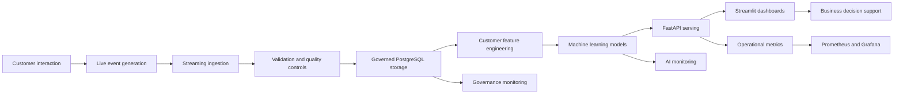
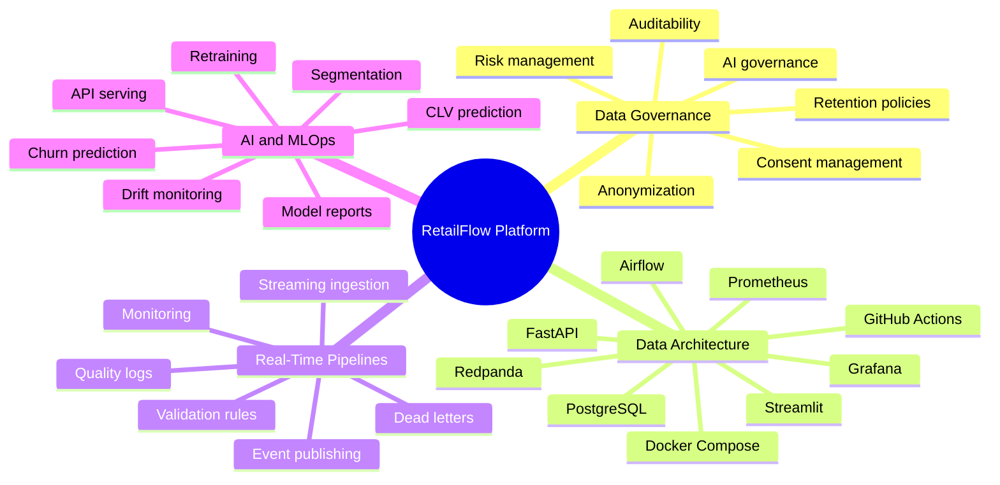
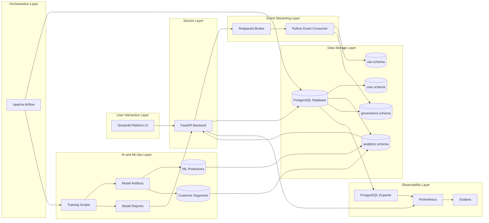
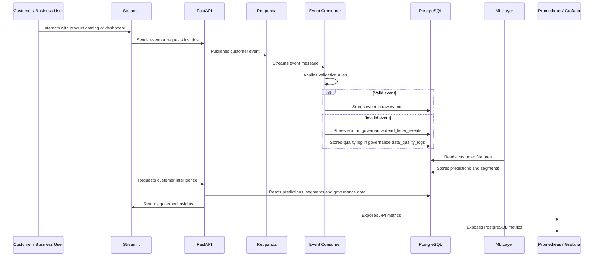
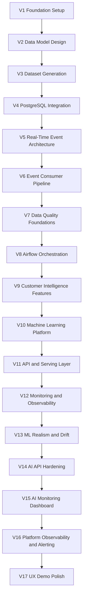

# RetailFlow — Executive Context and Integrated Project Presentation

## End-to-End Retail Intelligence Platform

**Real-Time Data Pipelines • AI-Powered Customer Intelligence • Data Governance • Observability**

---

## Document Purpose

This document presents the general context, business positioning, scope, architecture vision and integrated storyline of the RetailFlow project.

It is designed as the introductory part of a broader set of official project deliverables structured around five documents:

1. **Executive Context and Integrated Project Presentation**
2. **Data Governance Plan**
3. **Data Architecture Design**
4. **Real-Time Data Pipeline Design**
5. **Artificial Intelligence Solution Design**

The objective of this first document is to explain why RetailFlow was designed, what business problem it addresses, how the platform is structured, and how the four major capability areas connect into one coherent data product.

RetailFlow is not presented as a set of isolated technical components. I designed it as an integrated Retail Intelligence platform where customer events become governed data, governed data becomes customer intelligence, and customer intelligence becomes operational decision support.

---

# 1. Executive Summary

RetailFlow is a recently established company developing the **RetailFlow Platform**, an end-to-end Retail Intelligence solution for modern e-commerce organizations.

The platform is designed for retailers that need to transform large volumes of customer, product, transactional and behavioral data into reliable business insights, operational monitoring and AI-powered customer intelligence.

The main idea behind RetailFlow is simple:

```text
Customer behavior
        ↓
Real-time event ingestion
        ↓
Governed and quality-controlled data
        ↓
Customer intelligence models
        ↓
Business decision support
        ↓
Continuous monitoring and improvement
```

I designed RetailFlow to demonstrate how a modern data platform can combine:

- data governance;
- data architecture;
- real-time data pipelines;
- machine learning;
- API serving;
- orchestration;
- observability;
- dashboard-based business interaction.

The platform supports a multi-category e-commerce scenario where customer interactions generate events such as product views, cart actions and checkout events. These events are ingested through a streaming architecture, validated, persisted, transformed into analytical features, used by machine learning models and exposed to business users through dashboards and APIs.

RetailFlow therefore answers a central question:

> How can a modern e-commerce data platform combine real-time data pipelines, artificial intelligence, governance and observability in order to improve business decision-making?

To answer this question, I implemented RetailFlow as a complete platform using Docker Compose, PostgreSQL, Redpanda, FastAPI, Airflow, Streamlit, Prometheus, Grafana, Scikit-Learn and GitHub Actions.

---

# 2. Business Storytelling

## 2.1 Company Context

RetailFlow is a company that has recently entered the Retail Intelligence market.

Its product, the **RetailFlow Platform**, is designed for e-commerce organizations that operate across several product categories and want to better understand their customers, monitor their operations and industrialize their use of data and artificial intelligence.

The platform is demonstrated through the scenario of a multi-category retail e-commerce company.

This company generates data from:

- customer profiles;
- product catalogs;
- browsing sessions;
- product views;
- cart interactions;
- checkout flows;
- orders;
- payments;
- returns;
- reviews;
- support tickets;
- consent preferences;
- customer intelligence models;
- monitoring systems.

In this context, the key business challenge is not the absence of data. The challenge is the ability to transform this data into trusted, governed and actionable intelligence.

---

## 2.2 Business Problem

A modern e-commerce organization can face several data-related problems:

| Challenge | Business Impact |
|---|---|
| Fragmented customer data | Teams cannot easily build a unified view of customer behavior. |
| Uncontrolled event flows | Invalid events can affect reporting, analytics and ML models. |
| Limited customer intelligence | Marketing teams cannot reliably identify churn risks or high-value customers. |
| Weak governance | Consent, retention, privacy and auditability become difficult to control. |
| Poor model monitoring | AI outputs may become unreliable if model performance and drift are not monitored. |
| Low observability | Operational failures may remain invisible until they affect business users. |

RetailFlow addresses these problems by integrating data engineering, governance, machine learning and monitoring into a single architecture.

---

## 2.3 RetailFlow Storyline

The storyline of RetailFlow follows a logical platform journey.

A customer interacts with an e-commerce interface. These interactions generate events. The events are sent to a real-time pipeline. The pipeline validates them, stores valid events and isolates invalid events. The platform then uses governed data to create customer features, train models and expose intelligence through dashboards.

The same platform also monitors infrastructure health, API behavior, database status and ML drift.

The complete storyline is:



This design shows that RetailFlow is not only a dashboard and not only a machine learning project. It is a complete platform combining product thinking, data architecture, governance, AI and operations.

---

# 3. Product Vision

## 3.1 Vision Statement

The vision of RetailFlow is:

> To transform customer events into trusted data, trusted data into customer intelligence, and customer intelligence into measurable business decisions.

This vision is implemented through an end-to-end platform covering the full lifecycle of data:

```text
Generate
→ Ingest
→ Validate
→ Govern
→ Store
→ Transform
→ Predict
→ Serve
→ Monitor
→ Improve
```

---

## 3.2 Product Positioning

RetailFlow is positioned as a **Retail Intelligence Platform**.

It helps e-commerce organizations answer questions such as:

- Which customers are most likely to churn?
- Which customers have the highest future value?
- Which customer segments should receive specific business actions?
- Are customer events being processed correctly?
- Are data quality problems visible and traceable?
- Are customer data usages aligned with consent?
- Are the AI models monitored and explainable?
- Is the technical platform observable?

RetailFlow connects customer behavior, data governance, machine learning and operational monitoring into one integrated product.

---

## 3.3 Value Proposition

RetailFlow creates value for several types of stakeholders.

### Business teams

RetailFlow helps business teams:

- identify high-value customers;
- detect churn risk;
- understand customer segments;
- prioritize retention actions;
- support marketing campaigns;
- interpret customer intelligence outputs.

### Data teams

RetailFlow helps data teams:

- capture events reliably;
- validate incoming data;
- isolate invalid records;
- structure data into business domains;
- expose trusted datasets;
- monitor data quality.

### AI teams

RetailFlow helps AI teams:

- train customer models;
- monitor performance;
- analyze feature importance;
- detect drift;
- serve predictions through APIs;
- connect models to business workflows.

### Platform teams

RetailFlow helps platform teams:

- monitor service health;
- inspect API metrics;
- observe database status;
- visualize Prometheus metrics in Grafana;
- use alerting rules;
- verify orchestration workflows.

---

# 4. Project Objectives

I designed RetailFlow around seven main objectives.

## Objective 1 — Build an end-to-end Retail Intelligence platform

The first objective was to build a coherent platform rather than a set of disconnected tools.

RetailFlow connects:

- customer event generation;
- event streaming;
- data validation;
- PostgreSQL storage;
- governance tables;
- feature engineering;
- machine learning;
- API serving;
- dashboards;
- monitoring.

---

## Objective 2 — Implement real-time customer event ingestion

The second objective was to demonstrate how customer-facing actions can be converted into events and ingested by a streaming pipeline.

The platform supports events such as:

- product views;
- add-to-cart actions;
- checkout starts;
- purchases.

These events are published through FastAPI and processed through Redpanda and a Python consumer.

---

## Objective 3 — Operationalize data governance by design

Because RetailFlow is a recently established company, I designed the governance framework from the beginning instead of adding governance after the platform was already built.

This allowed me to integrate governance principles directly into:

- database schemas;
- consent management;
- data retention;
- anonymization;
- quality controls;
- audit logs;
- dashboards;
- AI usage rules.

This is a **Data Governance by Design** approach.

---

## Objective 4 — Provide customer intelligence through AI

The fourth objective was to transform customer behavior into actionable intelligence.

RetailFlow includes three customer intelligence models:

| Model | Purpose |
|---|---|
| Churn prediction | Identify customers at risk of leaving or disengaging. |
| CLV prediction | Estimate customer lifetime value. |
| Customer segmentation | Group customers into business-readable profiles. |

These models support decisions related to retention, loyalty, campaign targeting and customer prioritization.

---

## Objective 5 — Make data quality visible and traceable

Invalid events should not silently contaminate analytical tables or model inputs.

I implemented a data quality approach based on:

- validation rules;
- rejected events;
- dead-letter storage;
- quality logs;
- severity levels;
- dashboard visibility.

This makes data quality operational and auditable.

---

## Objective 6 — Monitor both the platform and the models

RetailFlow includes monitoring at two levels.

### Platform observability

- FastAPI health;
- PostgreSQL health;
- Prometheus targets;
- Grafana dashboards;
- Airflow health;
- PostgreSQL exporter metrics;
- alerting rules.

### AI monitoring

- model metrics;
- feature importance;
- prediction distribution;
- drift monitoring;
- cross-validation details;
- model reports.

---

## Objective 7 — Provide a clear demonstration and decision-support interface

The Streamlit interface was designed as a guided platform experience.

It includes:

- Platform Overview;
- Customer View;
- Customer Intelligence;
- Data Governance;
- Data Quality;
- AI Monitoring;
- Observability.

This navigation follows the logic of the platform and makes it possible to explain the end-to-end value of RetailFlow.

---

# 5. Project Scope

## 5.1 In Scope

The RetailFlow project includes the following capabilities.

### Data Governance

- consent management;
- retention policies;
- anonymization workflow;
- governance audit logs;
- data quality logs;
- dead-letter events;
- governance KPIs;
- risk register;
- governance operating model;
- AI governance principles.

### Data Architecture

- Docker Compose architecture;
- PostgreSQL database;
- multi-schema data model;
- FastAPI backend;
- Streamlit user interface;
- Redpanda event broker;
- Airflow orchestration;
- Prometheus monitoring;
- Grafana dashboards;
- PostgreSQL exporter;
- GitHub Actions CI/CD.

### Real-Time Data Pipelines

- event generation;
- event publishing;
- streaming ingestion;
- validation rules;
- event persistence;
- dead-letter handling;
- quality monitoring;
- pipeline orchestration.

### AI and MLOps

- churn model;
- CLV model;
- segmentation model;
- model reports;
- predictions stored in PostgreSQL;
- FastAPI serving;
- Streamlit AI dashboards;
- drift monitoring;
- Airflow retraining workflow;
- GitHub Actions CI/CD for test and deployment workflow.

### Observability

- FastAPI metrics;
- Prometheus scraping;
- Grafana dashboards;
- PostgreSQL exporter;
- Airflow health checks;
- documented alerting rules;
- Streamlit observability page.

---

## 5.2 Out of Scope

The following capabilities are considered outside the current scope of RetailFlow.

| Out-of-scope area | Reason |
|---|---|
| Enterprise Identity and Access Management | RetailFlow currently focuses on platform architecture and governance controls, not enterprise IAM integration. |
| Single Sign-On | Authentication federation is a future enterprise extension. |
| Multi-region deployment | The current architecture is designed for local reproducibility and clear platform demonstration. |
| 24/7 production support and on-call operations | Operational runbooks and alerts are documented, but full production support organization is outside the current scope. |
| Full enterprise data catalog platform | Data cataloging is included as a future improvement rather than a fully deployed enterprise catalog. |
| Advanced MDM platform | Core customer and product entities are modeled, but a full dedicated MDM platform is not implemented. |

This scoping decision keeps the project realistic while preserving a clear production evolution path.

---

# 6. Integrated Capability Map

RetailFlow is structured around four major capability domains.



---

## 6.1 Capability Summary

| Capability | Main question answered | Main RetailFlow implementation |
|---|---|---|
| Data Governance | How is data controlled, compliant and auditable? | Governance schema, consent flags, retention policies, anonymization, logs, dashboard. |
| Data Architecture | How is the infrastructure designed and deployed? | Docker Compose, PostgreSQL, Redpanda, FastAPI, Streamlit, Airflow, Prometheus, Grafana. |
| Real-Time Pipelines | How are customer events ingested and monitored? | FastAPI producer, Redpanda, Python consumer, validators, dead-letter events. |
| AI and MLOps | How is customer intelligence modeled, served and monitored? | Churn, CLV, segmentation, model reports, FastAPI endpoints, AI monitoring dashboard. |

---

# 7. Global Architecture

## 7.1 Architecture Overview

RetailFlow is deployed as a modular platform.

Each service has a clearly defined role.



---

## 7.2 Event-to-Decision Flow

The following diagram summarizes the complete path from customer interaction to decision support.



---

## 7.3 Architecture Principles

I designed RetailFlow around several architecture principles.

### Modularity

Each component is responsible for a specific function:

- Streamlit for interaction;
- FastAPI for services;
- Redpanda for event streaming;
- PostgreSQL for persistence;
- Airflow for orchestration;
- Scikit-Learn for ML;
- Prometheus and Grafana for monitoring.

### Separation of concerns

The architecture separates:

- UI;
- API;
- streaming;
- data quality;
- storage;
- analytics;
- governance;
- ML;
- monitoring.

This makes the platform easier to maintain and explain.

### Governance by design

Governance is embedded in the architecture through:

- consent fields;
- retention policies;
- anonymization workflow;
- quality logs;
- dead-letter events;
- audit trail;
- governed dashboards.

### Observability by design

Monitoring is implemented through:

- health endpoints;
- metrics endpoints;
- Prometheus scrape configuration;
- Grafana dashboards;
- PostgreSQL exporter;
- alerting rules.

### AI as a platform capability

AI is not isolated in notebooks.

Models are:

- trained;
- persisted;
- reported;
- stored in PostgreSQL;
- served through APIs;
- visualized in Streamlit;
- monitored for drift and performance.

---

# 8. Platform Components

## 8.1 Component Summary

| Component | Technology | Purpose |
|---|---|---|
| User interface | Streamlit | Platform navigation, dashboards and live demo. |
| Backend API | FastAPI | Service layer, event publication, governance and AI APIs. |
| Database | PostgreSQL | Central storage for raw, core, analytics and governance data. |
| Streaming broker | Redpanda | Kafka-compatible event ingestion. |
| Event consumer | Python | Event validation and persistence. |
| Orchestration | Apache Airflow | Scheduled workflows for quality, sales, ML and retention. |
| ML layer | Scikit-Learn | Churn, CLV and segmentation models. |
| Monitoring | Prometheus | Metrics collection. |
| Dashboards | Grafana | Operational observability. |
| Database monitoring | PostgreSQL Exporter | PostgreSQL metrics. |
| Containerization | Docker Compose | Local multi-service deployment. |
| CI/CD | GitHub Actions | Automated test, validation and deployment workflow. |

---

## 8.2 Streamlit

Streamlit is the user-facing platform interface.

I use it to provide:

- a guided platform overview;
- customer journey simulation;
- business intelligence dashboards;
- governance dashboards;
- data quality views;
- AI monitoring pages;
- observability pages.

The Streamlit platform follows a narrative flow:

```text
Platform Overview
→ Customer View
→ Customer Intelligence
→ Data Governance
→ Data Quality
→ AI Monitoring
→ Observability
```

---

## 8.3 FastAPI

FastAPI acts as the backend service layer.

It exposes:

- product endpoints;
- event endpoints;
- quality endpoints;
- governance endpoints;
- AI endpoints;
- health checks;
- metrics.

FastAPI is also responsible for publishing events to Redpanda when customer interactions are generated from the UI.

---

## 8.4 PostgreSQL

PostgreSQL is the central data platform.

It is organized into several schemas:

| Schema | Purpose |
|---|---|
| `raw` | Event-level and ingestion-oriented data. |
| `core` | Clean business entities such as customers, orders and products. |
| `analytics` | Features, predictions, segments and aggregates. |
| `governance` | Consent, retention, quality, dead letters and audit logs. |

This structure supports both operational and analytical use cases.

---

## 8.5 Redpanda

Redpanda is used as a Kafka-compatible broker.

It supports the real-time event architecture without requiring a full Kafka/Zookeeper setup.

The main event flow is:

```text
FastAPI producer
→ Redpanda topic
→ Python consumer
→ PostgreSQL
```

---

## 8.6 Airflow

Airflow orchestrates recurring workflows.

The platform includes four core DAGs:

| DAG | Schedule | Purpose |
|---|---|---|
| `daily_sales_aggregation` | Daily | Refreshes analytical sales aggregates. |
| `daily_data_quality` | Daily | Checks data quality and dead-letter counts. |
| `ml_retraining` | Weekly | Retrains models, refreshes predictions and evaluates drift. |
| `retention_cleanup` | Weekly | Applies governance retention and anonymization logic. |

---

## 8.7 Prometheus and Grafana

Prometheus collects platform metrics.

Grafana visualizes them.

The monitoring layer covers:

- FastAPI metrics;
- PostgreSQL metrics;
- service availability;
- API behavior;
- alerting rules;
- platform dashboards.

---

## 8.8 GitHub Actions CI/CD

I implemented GitHub Actions as the CI/CD layer of the project.

The expected production workflow includes:

```text
push / pull request
→ dependency installation
→ linting and static checks
→ unit tests
→ API tests
→ data quality tests
→ ML report structure tests
→ Docker build validation
→ deployment-ready artifact validation
```

This CI/CD layer supports quality control and prevents regressions when the platform evolves.

---

# 9. Data Domains

RetailFlow covers several business and technical domains.

## 9.1 Customer Domain

Customer data includes:

- customer profile;
- geographic information;
- loyalty status;
- account status;
- consent flags;
- behavioral features;
- churn score;
- CLV score;
- segment assignment.

## 9.2 Product Domain

Product data includes:

- product catalog;
- product categories;
- prices;
- suppliers;
- product interactions.

## 9.3 Order Domain

Order data includes:

- orders;
- order items;
- payments;
- shipments;
- returns;
- refunds.

## 9.4 Behavioral Event Domain

Event data includes:

- product views;
- cart actions;
- checkout actions;
- purchase events;
- session behavior.

## 9.5 Governance Domain

Governance data includes:

- consent records;
- retention policies;
- anonymization logs;
- quality logs;
- dead-letter events;
- audit trail.

## 9.6 AI Domain

AI data includes:

- model inputs;
- model reports;
- predictions;
- segments;
- feature importance;
- drift metrics.

---

# 10. Current Platform Maturity

Because RetailFlow was recently created, I had the opportunity to design governance, quality, observability and AI monitoring from the beginning.

This allowed the platform to reach a relatively advanced maturity level despite being new.

## 10.1 Maturity Assessment

| Dimension | Current Maturity | Justification |
|---|---|---|
| Data ownership | Advanced | Governance roles and responsibilities are defined. |
| Consent management | Advanced | Analytics, marketing and personalization consent are stored and used. |
| Data retention | Advanced | Retention policies and anonymization workflow are implemented. |
| Auditability | Advanced | Retention actions, dead letters and quality logs are traceable. |
| Data quality | Advanced | Validation rules and dead-letter mechanisms are implemented. |
| Platform observability | Advanced | Prometheus, Grafana and health checks are in place. |
| AI monitoring | Intermediate to advanced | Model metrics, reports and drift monitoring are available. |
| Metadata management | Developing | Metadata is documented but not yet fully automated through a catalog. |
| Enterprise data catalog | Planned | Identified as a future improvement. |
| Enterprise IAM | Planned | Out of scope for the current version. |

---

## 10.2 Governance by Design Impact

The governance-by-design approach produced several benefits:

- governance tables are part of the database model;
- consent is directly connected to customer intelligence;
- retention is connected to Airflow automation;
- anonymization produces audit logs;
- invalid events are isolated instead of ignored;
- ML monitoring is part of the platform experience;
- observability is integrated into the runtime architecture.

This improves trust in the data and makes governance visible to both technical and business users.

---

# 11. Integrated Platform Roadmap

RetailFlow has been developed incrementally.

The platform evolution can be summarized as follows.



## 11.1 Development Milestones

| Version | Milestone | Main Achievement |
|---|---|---|
| V1 | Foundation Setup | Project structure and development baseline. |
| V2 | Data Model Design | PostgreSQL schemas and e-commerce data model. |
| V3 | Dataset Generation | Retail dataset generation workflow. |
| V4 | PostgreSQL Integration | Data loading and database initialization. |
| V5 | Real-Time Event Architecture | Event-driven design with Redpanda. |
| V6 | Event Consumer Pipeline | Streaming consumer and PostgreSQL persistence. |
| V7 | Data Quality Foundations | Validation rules and dead-letter handling. |
| V8 | Airflow Orchestration | Scheduled workflows and operational DAGs. |
| V9 | Customer Intelligence Features | Customer feature engineering. |
| V10 | Machine Learning Platform | Churn, CLV and segmentation models. |
| V11 | API and Serving Layer | FastAPI endpoints and serving architecture. |
| V12 | Monitoring and Observability | Prometheus and Grafana foundations. |
| V13 | ML Realism and Drift | Improved ML reporting and drift monitoring. |
| V14 | AI API Hardening | Stronger AI endpoints and customer intelligence APIs. |
| V15 | AI Monitoring Dashboard | Streamlit AI monitoring page. |
| V16 | Platform Observability and Alerting | PostgreSQL exporter, dashboards and alert rules. |
| V17 | UX Demo Polish | Complete Streamlit platform and guided demo. |

---

# 12. Future Improvement Roadmap

RetailFlow already provides an integrated platform, but several improvements can strengthen its production maturity.

## 12.1 Short-Term Improvements

| Improvement | Objective |
|---|---|
| Expand governance KPIs | Add more detailed governance scorecards. |
| Add data catalog documentation | Improve discoverability and ownership visibility. |
| Strengthen API tests | Improve CI/CD regression protection. |
| Add Streamlit smoke tests | Validate dashboard availability automatically. |
| Expand alerting | Add more operational and ML alert rules. |

## 12.2 Medium-Term Improvements

| Improvement | Objective |
|---|---|
| Add role-based access control | Restrict features by user role. |
| Add model registry | Improve model versioning and promotion. |
| Add data lineage automation | Track source-to-dashboard lineage. |
| Add dbt transformation layer | Improve SQL transformation structure and testing. |
| Expand drift monitoring | Add automated thresholds and alert escalation. |

## 12.3 Long-Term Improvements

| Improvement | Objective |
|---|---|
| Kubernetes deployment | Move beyond Docker Compose for scalable deployment. |
| Cloud-native infrastructure | Prepare managed services for production. |
| Enterprise data catalog | Improve metadata and governance at scale. |
| Advanced IAM / SSO | Support enterprise authentication and authorization. |
| Recommendation engine | Add product recommendation use cases. |
| Real-time feature refresh | Move closer to near-real-time personalization. |

---

# 13. Deliverable Structure

The official RetailFlow deliverables are organized into five parts.

## Part 1 — Executive Context and Integrated Project Presentation

This document explains:

- company context;
- product vision;
- platform objectives;
- project scope;
- integrated architecture;
- capability mapping;
- roadmap;
- maturity positioning.

## Part 2 — Data Governance Plan

The Data Governance Plan explains:

- governance vision;
- governance operating model;
- personas and roles;
- data policies;
- consent management;
- retention and anonymization;
- data classification;
- business glossary;
- governance KPIs;
- audit and controls;
- inclusion and accessibility;
- governance roadmap.

## Part 3 — Data Architecture Design

The Data Architecture Design explains:

- infrastructure architecture;
- data model;
- schemas;
- Docker Compose deployment;
- service interactions;
- monitoring architecture;
- CI/CD architecture;
- cloud target architecture.

## Part 4 — Real-Time Data Pipeline Design

The Pipeline Design explains:

- event sources;
- Redpanda streaming;
- producer and consumer logic;
- validation rules;
- dead-letter handling;
- data quality monitoring;
- Airflow orchestration;
- pipeline controls.

## Part 5 — Artificial Intelligence Solution Design

The AI Solution Design explains:

- AI business use cases;
- churn model;
- CLV model;
- segmentation model;
- feature engineering;
- API serving;
- model monitoring;
- drift monitoring;
- retraining workflow;
- responsible AI principles;
- CI/CD for AI deployment.

---

# 14. Conclusion

RetailFlow was designed as a complete Retail Intelligence platform that integrates data governance, real-time pipelines, data architecture, machine learning and observability.

The project demonstrates how customer events can be transformed into governed and monitored customer intelligence.

The platform is built around a clear architecture:

```text
Customer event
→ real-time pipeline
→ data quality control
→ governed storage
→ machine learning
→ API serving
→ business dashboard
→ platform monitoring
```

By designing RetailFlow as a recently established company with governance by design, I was able to integrate accountability, quality, privacy, auditability and AI monitoring into the platform from the beginning.

This makes RetailFlow a coherent example of a modern data and AI platform for e-commerce organizations.

The next documents describe each core capability in detail:

1. Data Governance;
2. Data Architecture;
3. Real-Time Data Pipelines;
4. Artificial Intelligence Solution.

