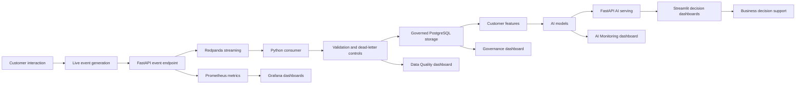
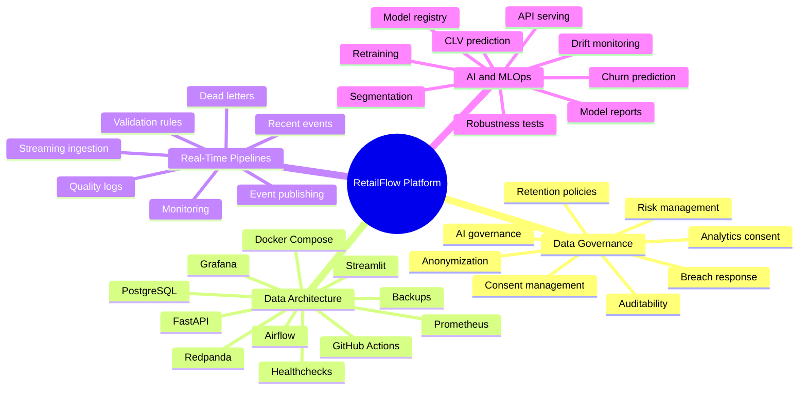
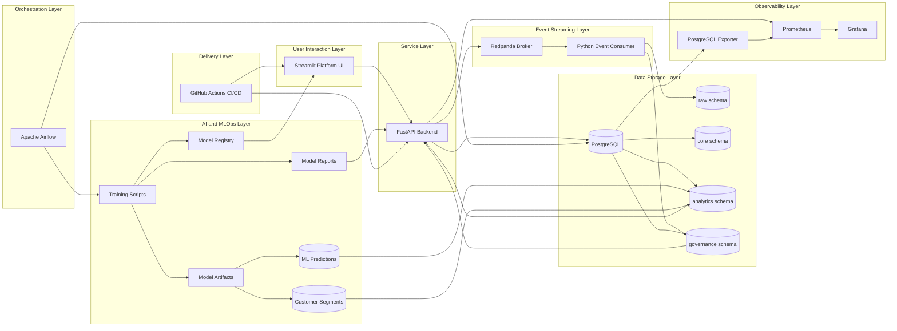
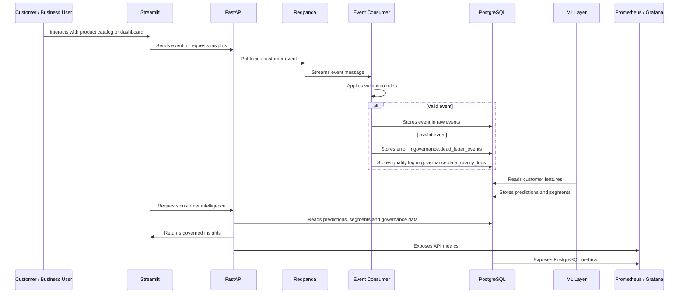

# RetailFlow — Executive Context and Integrated Project Presentation

## End-to-End Retail Intelligence Platform

**Real-Time Data Pipelines • AI-Powered Customer Intelligence • Data Governance • Observability • CI/CD Evidence**

**Document type:** Official written deliverable  
**Part:** P1 — Executive context and integrated project presentation  
**Platform:** RetailFlow Platform  
**Updated scope:** final Streamlit platform, governance-aware AI views, monitoring evidence, CI/CD evidence and project evidence matrix  
**Language:** English  

---

## Document Purpose

This document presents the general context, business positioning, implementation scope, architecture vision and integrated storyline of the RetailFlow project.

It is the first document in the official RetailFlow deliverable package:

1. **P1 — Executive Context and Integrated Project Presentation**
2. **P2 — Data Governance Plan**
3. **P3 — Data Architecture Design**
4. **P4 — Real-Time Data Pipeline Design**
5. **P5 — Artificial Intelligence Solution Design**

The objective of this first document is to explain why RetailFlow was designed, what business problem it addresses, how the platform is structured and how the main capability areas connect into one coherent data product.

RetailFlow is not presented as a set of isolated technical components.

I designed it as an integrated Retail Intelligence platform where:

```text
customer events
→ governed data
→ quality-controlled analytics
→ AI-powered customer intelligence
→ monitored operational decision support
```

---

# 1. Executive Summary

RetailFlow is a recently established company developing the **RetailFlow Platform**, an end-to-end Retail Intelligence solution for modern e-commerce organizations.

The platform is designed for retailers that need to transform large volumes of customer, product, transactional and behavioral data into reliable business insights, operational monitoring and AI-powered customer intelligence.

The main idea behind RetailFlow is:

```text
Customer behavior
        ↓
Real-time event ingestion
        ↓
Validation and quality controls
        ↓
Governed PostgreSQL storage
        ↓
Customer intelligence models
        ↓
Consent-aware business dashboards
        ↓
Monitoring, CI/CD and continuous improvement
```

I implemented RetailFlow as a complete data platform using:

- Docker Compose;
- PostgreSQL;
- Redpanda;
- FastAPI;
- Python event consumer;
- Apache Airflow;
- Streamlit;
- Scikit-Learn;
- Prometheus;
- Grafana;
- PostgreSQL exporter;
- GitHub Actions;
- WSL and VSCode.

RetailFlow demonstrates how a modern data platform can combine:

- data governance;
- data architecture;
- real-time data pipelines;
- machine learning;
- API serving;
- orchestration;
- observability;
- CI/CD;
- dashboard-based business interaction.

The platform supports a multi-category e-commerce scenario where customer interactions generate events such as product views, cart actions and checkout events.

These events are ingested through a streaming architecture, validated, persisted, transformed into analytical features, used by machine learning models and exposed to business users through dashboards and APIs.

RetailFlow therefore answers a central question:

> How can a modern e-commerce data platform combine real-time pipelines, artificial intelligence, governance and observability in order to improve business decision-making?

---

# 2. Business Storytelling

## 2.1 Company Context

RetailFlow is a company that has recently entered the Retail Intelligence market.

Its product, the **RetailFlow Platform**, is designed for e-commerce organizations that operate across several product categories and want to better understand their customers, monitor their operations and industrialize their use of data and artificial intelligence.

The platform is demonstrated through the scenario of a multi-category retail e-commerce company.

This company generates data from:

- customer profiles;
- consent preferences;
- product catalogs;
- browsing sessions;
- product views;
- cart interactions;
- checkout flows;
- orders;
- payments;
- returns;
- reviews;
- support tickets;
- customer intelligence models;
- monitoring systems.

In this context, the key business challenge is not the absence of data.

The challenge is the ability to transform this data into trusted, governed, observable and actionable intelligence.

---

## 2.2 Business Problem

A modern e-commerce organization can face several data-related problems.

| Challenge | Business Impact | RetailFlow Response |
|---|---|---|
| Fragmented customer data | Teams cannot easily build a unified customer view. | PostgreSQL schemas, customer features and dashboards. |
| Uncontrolled event flows | Invalid events can affect analytics and ML outputs. | Validation rules, dead-letter events and data quality dashboard. |
| Limited customer intelligence | Marketing teams cannot prioritize churn or value actions reliably. | Churn, CLV and segmentation models. |
| Weak governance | Consent, retention and auditability become difficult to control. | Governance schema, consent indicators, retention workflow and audit logs. |
| Poor model monitoring | AI outputs may become unreliable without monitoring. | AI Monitoring dashboard, model reports, drift report and retraining evidence. |
| Low observability | Operational failures may remain invisible. | Prometheus, Grafana, alert rules and Streamlit Observability. |
| Weak delivery controls | Code changes may introduce regressions. | GitHub Actions CI/CD, tests, Docker build checks and security reports. |

RetailFlow addresses these problems by integrating data engineering, governance, machine learning, operations and monitoring into a single platform.

---

## 2.3 RetailFlow Storyline

The RetailFlow storyline follows a logical platform journey.

A customer interacts with an e-commerce journey. These interactions generate events. The events are sent to a real-time pipeline. The pipeline validates them, stores valid events and isolates invalid events. The platform then uses governed data to create customer features, train AI models and expose intelligence through dashboards.

The same platform also monitors infrastructure health, API behavior, database status, data quality, CI/CD validation and ML drift.



This design shows that RetailFlow is not only a dashboard and not only a machine learning project.

It is a complete platform combining product thinking, data architecture, governance, real-time data engineering, AI, operations and evidence.

---

# 3. Product Vision

## 3.1 Vision Statement

The vision of RetailFlow is:

> To transform customer events into trusted data, trusted data into customer intelligence, and customer intelligence into measurable business decisions.

This vision is implemented through an end-to-end data lifecycle:

```text
Generate
→ Ingest
→ Validate
→ Govern
→ Store
→ Transform
→ Predict
→ Serve
→ Monitor
→ Improve
```

---

## 3.2 Product Positioning

RetailFlow is positioned as a **Retail Intelligence Platform**.

It helps e-commerce organizations answer questions such as:

- Which customers are most likely to churn?
- Which customers have the highest future value?
- Which customer segments should receive specific business actions?
- Are customer events being processed correctly?
- Are invalid events isolated and traceable?
- Are customer data usages aligned with consent?
- Are AI models monitored and explainable?
- Is the technical platform observable?
- Is the delivery workflow controlled by CI/CD evidence?

RetailFlow connects customer behavior, data governance, machine learning and operational monitoring into one integrated product.

---

## 3.3 Value Proposition

### Business teams

RetailFlow helps business teams:

- identify high-value customers;
- detect churn risk;
- understand customer segments;
- prioritize retention actions;
- support lifecycle marketing;
- interpret customer intelligence outputs.

### Data teams

RetailFlow helps data teams:

- capture events reliably;
- validate incoming data;
- isolate invalid records;
- structure data into domains;
- expose trusted datasets;
- monitor data quality.

### AI teams

RetailFlow helps AI teams:

- train customer models;
- monitor model performance;
- analyze feature importance;
- detect drift;
- serve predictions through APIs;
- connect models to business workflows.

### Platform teams

RetailFlow helps platform teams:

- monitor service health;
- inspect API metrics;
- observe database status;
- visualize Prometheus metrics in Grafana;
- use alerting rules;
- verify CI/CD and orchestration workflows.

---

# 4. Project Objectives

I designed RetailFlow around seven main objectives.

## Objective 1 — Build an end-to-end Retail Intelligence platform

The first objective was to build a coherent platform rather than a set of disconnected tools.

RetailFlow connects:

- customer event generation;
- event streaming;
- data validation;
- PostgreSQL storage;
- governance tables;
- feature engineering;
- machine learning;
- API serving;
- dashboards;
- monitoring;
- CI/CD validation.

## Objective 2 — Implement real-time customer event ingestion

The second objective was to demonstrate how customer-facing actions can be converted into events and ingested by a streaming pipeline.

The platform supports events such as:

- product views;
- add-to-cart actions;
- checkout starts;
- purchases;
- invalid demo events used to prove rejection and dead-letter handling.

These events are published through FastAPI and processed through Redpanda and a Python consumer.

## Objective 3 — Operationalize data governance by design

Because RetailFlow is a recently established company, I designed the governance framework from the beginning.

Governance is integrated directly into:

- database schemas;
- consent management;
- data retention;
- anonymization;
- quality controls;
- audit logs;
- dashboards;
- AI usage rules.

This is a **Data Governance by Design** approach.

## Objective 4 — Provide customer intelligence through AI

RetailFlow includes three customer intelligence models.

| Model | Purpose |
|---|---|
| Churn prediction | Identify customers at risk of leaving or disengaging. |
| CLV prediction | Estimate customer lifetime value. |
| Customer segmentation | Group customers into business-readable profiles. |

These models support decisions related to retention, loyalty, campaign targeting and customer prioritization.

## Objective 5 — Make data quality visible and traceable

Invalid events should not silently contaminate analytical tables or model inputs.

I implemented a data quality approach based on:

- validation rules;
- rejected events;
- dead-letter storage;
- quality logs;
- severity levels;
- dashboard visibility;
- remediation workflow explanation.

## Objective 6 — Monitor both the platform and the models

RetailFlow includes monitoring at two levels.

### Platform observability

- FastAPI health;
- PostgreSQL health;
- Prometheus targets;
- Grafana dashboards;
- Airflow health;
- PostgreSQL exporter metrics;
- Prometheus alert rules;
- Streamlit observability page.

### AI monitoring

- model registry;
- model reports;
- retraining runs;
- prediction availability;
- analytics-consent-based AI counts;
- drift monitoring;
- MLOps controls.

## Objective 7 — Provide a guided demonstration and evidence interface

The Streamlit interface was designed as a guided platform experience.

It now includes ten pages:

1. Platform Overview;
2. Customer View;
3. Customer Intelligence;
4. Data Governance;
5. Data Architecture;
6. Data Quality;
7. AI Monitoring;
8. Observability;
9. CI/CD and Operations;
10. Project Evidence.

This navigation follows the logic of the platform and makes it possible to explain the end-to-end value of RetailFlow.

The Project Evidence page also includes:

- a final evidence matrix;
- a skills evidence matrix;
- filters by block and skill ID;
- demo path;
- tool map;
- technical evidence.

---

# 5. Project Scope

## 5.1 In Scope

The RetailFlow project includes the following capabilities.

### Data Governance

- consent management;
- analytics-consent-aware AI usage;
- retention policies;
- anonymization workflow;
- governance audit logs;
- data quality logs;
- dead-letter events;
- governance KPIs;
- risk register;
- governance operating model;
- breach response procedure;
- accessibility and inclusion principles;
- AI governance principles.

### Data Architecture

- Docker Compose architecture;
- PostgreSQL database;
- multi-schema data model;
- FastAPI backend;
- Streamlit user interface;
- Redpanda event broker;
- event consumer;
- Airflow orchestration;
- Prometheus monitoring;
- Grafana dashboards;
- PostgreSQL exporter;
- healthchecks;
- backup and restore scripts;
- readonly database role;
- example environment configuration;
- GitHub Actions CI/CD.

### Real-Time Data Pipelines

- event generation;
- event publishing;
- Redpanda streaming ingestion;
- Python consumer;
- validation rules;
- event persistence;
- dead-letter handling;
- quality monitoring;
- recent events endpoint;
- invalid event demo;
- producer performance metrics;
- pipeline documentation.

### AI and MLOps

- churn model;
- CLV model;
- customer segmentation model;
- model reports;
- generated model registry;
- retraining run logs;
- predictions stored in PostgreSQL;
- FastAPI serving;
- consent-aware Customer Intelligence dashboard;
- AI Monitoring dashboard;
- drift monitoring;
- Airflow retraining workflow;
- AI robustness tests;
- GitHub Actions CI/CD validation.

### Observability and Operations

- FastAPI metrics;
- Prometheus scraping;
- Grafana dashboards;
- PostgreSQL exporter;
- Airflow health checks;
- documented alerting rules;
- Streamlit Observability page;
- CI/CD and Operations page;
- infrastructure operations documentation.

---

## 5.2 Out of Scope

The following capabilities are outside the current scope.

| Out-of-scope area | Reason |
|---|---|
| Enterprise Identity and Access Management | The project focuses on platform architecture, data governance controls and demo reproducibility. |
| Single Sign-On | Authentication federation is a future enterprise extension. |
| Multi-region deployment | The current architecture is designed for local reproducibility and clear platform demonstration. |
| 24/7 production support and on-call operations | Operational runbooks and alerts are documented, but full production support organization is outside the current scope. |
| Full enterprise data catalog platform | Data cataloging is documented as a future improvement rather than a fully deployed enterprise catalog. |
| Advanced MDM platform | Core customer and product entities are modeled, but a full dedicated MDM platform is not implemented. |
| Full production high availability | Healthchecks, monitoring and backup exist, but production-grade failover is not fully implemented. |
| Automated dead-letter replay workflow | Dead-letter handling is implemented; replay automation remains a future improvement. |
| Full production model registry | A generated registry exists; enterprise promotion, rollback and approval workflows remain future improvements. |

This scoping decision keeps the project realistic while preserving a clear production evolution path.

---

# 6. Integrated Capability Map

RetailFlow is structured around four major capability domains.



---

## 6.1 Capability Summary

| Capability | Main question answered | Main RetailFlow implementation |
|---|---|---|
| Data Governance | How is data controlled, compliant and auditable? | Governance schema, consent flags, retention policies, anonymization, logs and Data Governance page. |
| Data Architecture | How is the infrastructure designed and deployed? | Docker Compose, PostgreSQL, Redpanda, FastAPI, Streamlit, Airflow, Prometheus and Grafana. |
| Real-Time Pipelines | How are customer events ingested and monitored? | FastAPI producer, Redpanda, Python consumer, validators, dead-letter events and Data Quality page. |
| AI and MLOps | How is customer intelligence modeled, served and monitored? | Churn, CLV, segmentation, model reports, model registry, FastAPI endpoints and AI Monitoring page. |
| Observability and Operations | How is platform reliability demonstrated? | Prometheus targets, alert rules, Grafana dashboards, CI/CD page, healthchecks and operations documentation. |

---

# 7. Global Architecture

## 7.1 Architecture Overview

RetailFlow is deployed as a modular platform.

Each service has a clearly defined role.



---

## 7.2 Event-to-Decision Flow

The following diagram summarizes the complete path from customer interaction to decision support.



---

# 8. Platform Components

## 8.1 Component Summary

| Component | Technology | Purpose |
|---|---|---|
| User interface | Streamlit | Platform navigation, dashboards and live demo. |
| Backend API | FastAPI | Service layer, event publication, governance and AI APIs. |
| Database | PostgreSQL | Central storage for raw, core, analytics and governance data. |
| Streaming broker | Redpanda | Kafka-compatible event ingestion. |
| Event consumer | Python | Event validation and persistence. |
| Orchestration | Apache Airflow | Scheduled workflows for quality, sales, ML and retention. |
| ML layer | Scikit-Learn | Churn, CLV and segmentation models. |
| Monitoring | Prometheus | Metrics collection and alert evaluation. |
| Dashboards | Grafana | Operational observability. |
| Database monitoring | PostgreSQL Exporter | PostgreSQL metrics. |
| Containerization | Docker Compose | Local multi-service deployment. |
| CI/CD | GitHub Actions | Automated test, validation, security reporting and Docker build workflow. |
| Documentation | Markdown docs | Operations, CI/CD, monitoring and evidence documentation. |

---

## 8.2 Streamlit Platform

Streamlit is the user-facing platform interface.

The current platform contains ten pages.

| Page | Purpose |
|---|---|
| `1_Platform_Overview.py` | Presents the platform, architecture, tool links and project storyline. |
| `2_Customer_View.py` | Simulates customer journeys and generates valid or invalid events. |
| `3_Customer_Intelligence.py` | Displays governed AI decision support for customers and segments. |
| `4_Data_Governance.py` | Presents governance, consent, retention, roles, risks and compliance evidence. |
| `5_Data_Architecture.py` | Explains architecture, schemas, reliability and operational design. |
| `6_Data_Quality.py` | Shows dead letters, quality summaries and remediation workflow. |
| `7_AI_Monitoring.py` | Shows prediction availability, registry, reports, retraining and drift. |
| `8_Observability.py` | Shows Prometheus targets, alert rules and Grafana dashboards. |
| `9_CI_CD_and_Operations.py` | Shows CI/CD, operations, security reports and runbooks. |
| `10_Project_Evidence.py` | Consolidates final evidence, skills matrix, demo path and tool map. |

This interface makes the project demonstrable from both a business and technical perspective.

---

## 8.3 FastAPI

FastAPI acts as the backend service layer.

It exposes:

- product endpoints;
- event endpoints;
- recent event endpoint;
- quality endpoints;
- governance endpoints;
- AI endpoints;
- health checks;
- Prometheus metrics.

FastAPI is also responsible for publishing events to Redpanda when customer interactions are generated from the UI.

---

## 8.4 PostgreSQL

PostgreSQL is the central data platform.

It is organized into several schemas.

| Schema | Purpose |
|---|---|
| `raw` | Event-level and ingestion-oriented data. |
| `core` | Clean business entities such as customers, orders and products. |
| `analytics` | Features, predictions, segments and aggregates. |
| `governance` | Consent, retention, quality, dead letters and audit logs. |

This structure supports operational, analytical, AI and governance use cases.

---

## 8.5 Redpanda

Redpanda is used as a Kafka-compatible broker.

It supports the real-time event architecture without requiring a full Kafka and Zookeeper setup.

The main event flow is:

```text
FastAPI producer
→ Redpanda topic
→ Python consumer
→ PostgreSQL
```

---

## 8.6 Airflow

Airflow orchestrates recurring workflows.

| DAG | Schedule | Purpose |
|---|---|---|
| `daily_sales_aggregation` | Daily | Refreshes analytical sales aggregates. |
| `daily_data_quality` | Daily | Checks data quality and dead-letter counts. |
| `ml_retraining` | Weekly | Retrains models, refreshes predictions and evaluates drift. |
| `retention_cleanup` | Weekly | Applies governance retention and anonymization logic. |

---

## 8.7 Prometheus and Grafana

Prometheus collects platform metrics and evaluates alert rules.

Grafana visualizes operational dashboards.

The monitoring layer covers:

- FastAPI metrics;
- PostgreSQL metrics;
- service availability;
- API behavior;
- alert rules;
- platform dashboards.

The current dashboards include:

- RetailFlow API Overview;
- RetailFlow Platform Overview.

---

## 8.8 GitHub Actions CI/CD

GitHub Actions provides the automated validation layer.

The CI/CD workflow validates:

- Python syntax;
- automated tests;
- ML report availability;
- Docker Compose configuration;
- Docker image builds;
- repository checks;
- security report generation.

This supports reproducibility and reduces regression risk.

---

# 9. Data Domains

RetailFlow covers several business and technical domains.

## 9.1 Customer Domain

Customer data includes:

- customer profile;
- geographic information;
- loyalty status;
- account status;
- consent flags;
- behavioral features;
- churn score;
- CLV score;
- segment assignment.

## 9.2 Product Domain

Product data includes:

- product catalog;
- product categories;
- prices;
- suppliers;
- product interactions.

## 9.3 Order Domain

Order data includes:

- orders;
- order items;
- payments;
- shipments;
- returns;
- refunds.

## 9.4 Behavioral Event Domain

Event data includes:

- product views;
- cart actions;
- checkout actions;
- purchase events;
- session behavior;
- invalid demo events used for quality evidence.

## 9.5 Governance Domain

Governance data includes:

- consent records;
- retention policies;
- anonymization logs;
- quality logs;
- dead-letter events;
- audit trail;
- breach response evidence;
- risk register.

## 9.6 AI Domain

AI data includes:

- model inputs;
- model reports;
- generated model registry;
- predictions;
- segments;
- drift metrics;
- retraining run logs.

---

# 10. Current Platform Maturity

Because RetailFlow was recently created, I had the opportunity to design governance, quality, observability and AI monitoring from the beginning.

This allowed the platform to reach a relatively advanced maturity level despite being new.

## 10.1 Maturity Assessment

| Dimension | Current Maturity | Justification |
|---|---|---|
| Data ownership | Advanced | Governance roles and responsibilities are defined. |
| Consent management | Advanced | Marketing, analytics and personalization consent are stored and used. |
| Data retention | Advanced | Retention policies and anonymization workflow are implemented. |
| Auditability | Advanced | Retention actions, dead letters and quality logs are traceable. |
| Data quality | Advanced | Validation rules and dead-letter mechanisms are implemented. |
| Platform observability | Advanced | Prometheus, Grafana, health checks and alert rules are in place. |
| AI monitoring | Advanced | Model reports, model registry, retraining logs and drift monitoring are available. |
| CI/CD validation | Advanced | Tests, compile checks, Docker validation and security reports run in GitHub Actions. |
| Metadata management | Developing | Metadata is documented but not yet fully automated through a catalog. |
| Enterprise data catalog | Planned | Identified as a future improvement. |
| Enterprise IAM | Planned | Out of scope for the current version. |
| Full production HA | Developing | Healthchecks and backups exist; full failover remains a future improvement. |

This maturity profile is intentionally realistic.

It recognizes the controls already implemented while clearly identifying production hardening areas.

---

## 10.2 Governance by Design Impact

The governance-by-design approach produced several benefits:

- governance tables are part of the database model;
- consent is directly connected to customer intelligence;
- AI outputs are hidden in the interface when analytics consent is absent;
- AI Monitoring uses analytics-consented customer counts for visible prediction availability;
- retention is connected to Airflow automation;
- anonymization produces audit logs;
- invalid events are isolated instead of ignored;
- ML monitoring is part of the platform experience;
- observability is integrated into the runtime architecture.

---

# 11. Implemented Development Milestones

RetailFlow has been developed incrementally.

| Lot / Area | Main Achievement |
|---|---|
| Platform foundation | Project structure, Docker Compose runtime and PostgreSQL baseline. |
| Data model | Raw, core, analytics and governance schemas. |
| Data generator | Retail dataset generation and database initialization. |
| Real-time pipeline | FastAPI producer, Redpanda broker, event consumer and PostgreSQL persistence. |
| Data quality | Validation rules, dead-letter events and Data Quality page. |
| Airflow | Sales aggregation, data quality, retention cleanup and ML retraining DAGs. |
| AI solution | Churn, CLV, segmentation, prediction serving and model reports. |
| API serving | FastAPI endpoints for products, events, governance, quality and AI. |
| Monitoring | Prometheus, Grafana, PostgreSQL exporter and alert rules. |
| Infrastructure hardening | Healthchecks, backup/restore scripts, readonly DB role and operations docs. |
| CI/CD | GitHub Actions, tests, Docker validation and security reports. |
| Streamlit finalization | Ten-page interface, proof cards, academic mappings and project evidence matrix. |

---

# 12. Current Streamlit Demonstration Path

The recommended live demonstration path is:

| Step | Page / Tool | What to show |
|---|---|---|
| 1 | Streamlit > Platform Overview | Platform narrative, architecture and tool links. |
| 2 | Streamlit > Customer View | Generate a customer journey and an invalid event. |
| 3 | Streamlit > Data Quality | Show dead-letter evidence and quality remediation logic. |
| 4 | Streamlit > Customer Intelligence | Show governed AI decision support and consent behavior. |
| 5 | Streamlit > Data Governance | Show roles, consent, retention, risk register and breach response. |
| 6 | Streamlit > Data Architecture | Show schemas, services, reliability and scalability design. |
| 7 | Streamlit > AI Monitoring | Show model registry, reports, retraining, drift and prediction availability. |
| 8 | Streamlit > Observability | Show Prometheus targets, alert rules and Grafana dashboards. |
| 9 | Streamlit > CI/CD and Operations | Show CI/CD, security reports, runbooks and operational controls. |
| 10 | Streamlit > Project Evidence | Show final evidence matrix and skills evidence matrix. |
| 11 | GitHub Actions | Show CI green on the latest commit. |
| 12 | pgAdmin | Show raw events, dead letters, predictions and governance tables. |
| 13 | Airflow | Show operational DAGs. |
| 14 | Prometheus / Grafana | Show monitoring targets and dashboards. |

---

# 13. Evidence and Assessment Mapping

RetailFlow includes a dedicated Project Evidence page.

This page consolidates:

- evidence by block;
- proof locations;
- tools to open;
- final evidence matrix;
- skills evidence matrix;
- demo path;
- technical proof references.

The skills evidence matrix uses the following columns:

```text
Bloc
ID
Compétence
Preuve RetailFlow
Outils
Où chercher
Statut
```

It supports filtering by:

- block;
- skill ID.

This makes the final demonstration easier to connect to the official assessment criteria.

---

# 14. Operations and Reliability Evidence

RetailFlow includes several operational controls.

| Control | Implementation |
|---|---|
| Healthchecks | Docker Compose healthchecks for core services. |
| Backup | PostgreSQL backup script and local backup directory handling. |
| Restore | PostgreSQL restore script. |
| Readonly role | Dedicated readonly PostgreSQL role. |
| Environment configuration | Example environment file for reproducible setup. |
| Monitoring | Prometheus targets, alert rules and Grafana dashboards. |
| Documentation | Infrastructure operations, monitoring and CI/CD docs. |
| CI/CD | Automated checks on GitHub Actions. |

The current environment is appropriate for a reproducible local demonstration.

It is not presented as a fully hardened enterprise production deployment.

---

# 15. Future Improvement Roadmap

RetailFlow already provides an integrated platform, but several improvements can strengthen its production maturity.

## 15.1 Short-Term Improvements

| Improvement | Objective |
|---|---|
| Expand governance KPIs | Add more detailed governance scorecards. |
| Add data catalog documentation | Improve discoverability and ownership visibility. |
| Strengthen API tests | Improve CI/CD regression protection. |
| Add Streamlit smoke tests | Validate dashboard availability automatically. |
| Expand alerting | Add more operational and ML alert rules. |
| Automate dead-letter replay | Improve operational recovery after data quality errors. |

## 15.2 Medium-Term Improvements

| Improvement | Objective |
|---|---|
| Add role-based access control | Restrict features by user role. |
| Add production model registry | Improve model versioning, promotion and rollback. |
| Add data lineage automation | Track source-to-dashboard lineage. |
| Add dbt transformation layer | Improve SQL transformation structure and testing. |
| Expand drift monitoring | Add automated thresholds and alert escalation. |
| Add broker-level metrics | Improve Redpanda and consumer lag monitoring. |

## 15.3 Long-Term Improvements

| Improvement | Objective |
|---|---|
| Kubernetes deployment | Move beyond Docker Compose for scalable deployment. |
| Cloud-native infrastructure | Prepare managed services for production. |
| Enterprise data catalog | Improve metadata and governance at scale. |
| Advanced IAM / SSO | Support enterprise authentication and authorization. |
| Recommendation engine | Add product recommendation use cases. |
| Real-time feature refresh | Move closer to near-real-time personalization. |
| Multi-region availability | Improve business continuity for production. |

---

# 16. Deliverable Structure

The official RetailFlow deliverables are organized into five parts.

## Part 1 — Executive Context and Integrated Project Presentation

This document explains:

- company context;
- product vision;
- platform objectives;
- project scope;
- integrated architecture;
- capability mapping;
- maturity positioning;
- final demonstration path.

## Part 2 — Data Governance Plan

The Data Governance Plan explains:

- governance vision;
- governance operating model;
- personas and roles;
- data policies;
- consent management;
- retention and anonymization;
- data classification;
- business glossary;
- governance KPIs;
- audit and controls;
- inclusion and accessibility;
- governance roadmap.

## Part 3 — Data Architecture Design

The Data Architecture Design explains:

- infrastructure architecture;
- data model;
- schemas;
- Docker Compose deployment;
- service interactions;
- monitoring architecture;
- CI/CD architecture;
- reliability controls;
- future cloud target architecture.

## Part 4 — Real-Time Data Pipeline Design

The Pipeline Design explains:

- event sources;
- Redpanda streaming;
- producer and consumer design;
- validation rules;
- dead-letter handling;
- quality monitoring;
- Airflow automation;
- pipeline observability;
- error handling and recovery roadmap.

## Part 5 — Artificial Intelligence Solution Design

The AI Solution Design explains:

- AI use cases;
- feature engineering;
- model training;
- model reports;
- prediction persistence;
- FastAPI serving;
- customer intelligence dashboard;
- AI monitoring dashboard;
- drift monitoring;
- retraining;
- CI/CD and responsible AI.

---

# 17. Conclusion

RetailFlow demonstrates how a modern e-commerce data platform can combine real-time data engineering, governance, AI and observability into a coherent Retail Intelligence product.

The project is valuable because it does not stop at model training, dashboard creation or database design.

It connects all components into an operational storyline:

```text
Customer event
→ validated pipeline
→ governed storage
→ analytical features
→ AI prediction
→ consent-aware dashboard
→ monitoring and evidence
```

The final implementation includes:

- real-time event ingestion with Redpanda;
- FastAPI event and AI serving;
- PostgreSQL data platform with raw, core, analytics and governance schemas;
- data quality controls and dead-letter handling;
- governance policies, consent indicators, retention and anonymization evidence;
- AI models for churn, CLV and segmentation;
- model registry, reports, drift monitoring and retraining evidence;
- Streamlit dashboards for business, governance, AI, quality, observability, operations and final proof;
- Prometheus and Grafana observability;
- GitHub Actions CI/CD validation;
- project evidence and skills evidence matrix.

RetailFlow is therefore a complete, demonstrable and extensible Retail Intelligence platform.

It is not yet a fully hardened enterprise production system, but it provides a strong foundation for production evolution through cloud deployment, IAM, full model registry, advanced lineage and expanded alerting.

---

# Appendix A — Main Local URLs

| Tool | URL |
|---|---|
| Streamlit | `http://localhost:8501` |
| FastAPI Docs | `http://localhost:8000/docs` |
| pgAdmin | `http://localhost:5050` |
| Airflow | `http://localhost:8080` |
| Prometheus | `http://localhost:9090` |
| Grafana | `http://localhost:3000` |

---

# Appendix B — Main Evidence Files

| Area | Path |
|---|---|
| Streamlit pages | `streamlit_app/pages/` |
| Shared Streamlit components | `streamlit_app/components.py` |
| FastAPI app | `api/app/` |
| Event consumer | `pipeline/consumer/` |
| Airflow DAGs | `airflow/dags/` |
| ML scripts | `ml/src/` |
| ML reports | `ml/reports/` |
| Model registry | `ml/model_registry.json` |
| Monitoring configuration | `monitoring/` |
| CI/CD workflows | `.github/workflows/` |
| Infrastructure operations docs | `docs/INFRA_OPERATIONS.md` |
| Monitoring docs | `docs/MONITORING.md` and `docs/MONITORING_EVIDENCE.md` |
| CI/CD docs | `docs/CI_CD.md` |

---

# Appendix C — Implementation Boundaries

The current implementation demonstrates the main academic and technical requirements.

The following areas are intentionally positioned as future production hardening:

| Boundary | Current state | Future target |
|---|---|---|
| High availability | Healthchecks and monitoring | Multi-instance deployment, failover and disaster recovery. |
| Authentication | Local demo without enterprise IAM | RBAC, SSO and API authorization. |
| Model registry | Generated registry file | Full registry with promotion, approval and rollback. |
| Dead-letter replay | Reprocessing concept and evidence | Automated replay workflow with approval. |
| Alert routing | Prometheus rules and dashboards | Slack/email/on-call escalation. |
| Deployment | Docker Compose local runtime | Kubernetes and cloud-native managed services. |
