# Data Governance Plan

## RetailFlow Platform

**Official Deliverable — Data Governance**

**Document purpose:** present the data governance framework I designed for RetailFlow.

**Document language:** English.

**Document scope:** governance strategy, operating model, policies, standards, GDPR alignment, consent management, quality controls, auditability, AI governance, KPIs, change management and roadmap.

---

## Table of Contents

1. Executive Summary
2. Governance Context
3. Governance Vision
4. Governance Objectives
5. Governance Scope
6. Governance by Design
7. Operating Model
8. Roles, Responsibilities and Personas
9. Governance Decision Model
10. Data Domains Under Governance
11. Data Classification
12. Data Policies
13. Consent Management Policy
14. Retention and Anonymization Policy
15. Data Quality Policy
16. Data Security and Access Policy
17. AI Governance Policy
18. Business Glossary
19. Governance Processes
20. Data Quality Controls
21. Metadata, Lineage and Traceability
22. Auditability and Evidence
23. Technology and Tooling
24. Governance KPIs
25. Risk Management
26. Inclusion and Accessibility
27. Change Management
28. Implementation Roadmap
29. Future Improvements
30. Conclusion

---

## 1. Executive Summary

RetailFlow is a recently established company that develops the **RetailFlow Platform**, a Retail Intelligence platform designed for e-commerce organizations.

The purpose of RetailFlow Platform is to transform customer events into trusted data, trusted data into customer intelligence, and customer intelligence into operational and strategic decision support.

Because RetailFlow is a new organization, I had the opportunity to design its data governance framework from the ground up.

Instead of adding governance after the platform had already grown, I designed RetailFlow according to a **Data Governance by Design** approach.

This means that data ownership, consent management, retention policies, quality controls, auditability, privacy principles and AI monitoring were integrated directly into the platform architecture.

The governance framework I defined covers:

- governance vision and scope;
- operating model and decision rights;
- roles and personas;
- consent management;
- data retention and anonymization;
- data quality controls;
- data classification;
- data security and access principles;
- auditability and evidence;
- AI governance;
- governance KPIs;
- risk management;
- change management;
- inclusion and accessibility;
- continuous improvement roadmap.

The governance framework is not only theoretical.

I implemented governance mechanisms directly in the platform through PostgreSQL schemas, FastAPI endpoints, Airflow DAGs, Streamlit governance dashboards and operational logs.

The most important governance implementation areas are:

| Area | Implementation in RetailFlow |
|---|---|
| Consent management | Customer consent indicators and consent-aware analytics filtering |
| Data retention | Retention policy table and automated retention cleanup workflow |
| Anonymization | Customer anonymization logic and audit trail |
| Data quality | Validation rules, dead-letter events and quality logs |
| Auditability | Retention action logs, quality logs, dead-letter tables and operational evidence |
| AI governance | Consent-aware customer intelligence, model monitoring and drift reporting |
| Monitoring | Streamlit governance dashboard, FastAPI endpoints and Airflow workflows |

The result is a governance framework that is aligned with business value, technical implementation and regulatory expectations.

---

## 2. Governance Context

RetailFlow Platform is designed for an e-commerce context.

The platform collects and processes multiple categories of data:

- customer profiles;
- customer consent information;
- product catalog data;
- orders;
- payments;
- returns;
- shipments;
- sessions;
- product views;
- cart events;
- checkout events;
- support tickets;
- reviews;
- customer behavioral features;
- machine learning predictions;
- customer segments;
- data quality logs;
- retention and anonymization logs.

These data assets support different business and technical use cases:

- customer understanding;
- churn prevention;
- customer lifetime value estimation;
- segmentation;
- campaign prioritization;
- real-time event monitoring;
- ML performance monitoring;
- data quality management;
- compliance evidence;
- operational observability.

Because RetailFlow uses customer-level data and derived AI outputs, governance is a core platform requirement.

The main governance challenge is to ensure that data is:

- trusted;
- compliant;
- traceable;
- secure;
- usable;
- auditable;
- understandable;
- aligned with business purpose.

Without governance, the platform could expose the company to several risks:

- customer data misuse;
- analytics performed without consent;
- uncontrolled data retention;
- poor data quality affecting AI outputs;
- lack of accountability;
- unclear data ownership;
- inability to explain or audit decisions;
- model monitoring gaps;
- operational blind spots.

I therefore designed the governance layer as an integrated part of the platform rather than as a separate administrative document.

---

## 3. Governance Vision

The governance vision for RetailFlow is:

> I designed RetailFlow governance to ensure that customer data can be used as a trusted, compliant and valuable asset while preserving privacy, accountability, quality and auditability across the platform.

This vision supports the broader product vision:

```text
Customer Events
      ↓
Trusted Data
      ↓
Customer Intelligence
      ↓
Business Decisions
      ↓
Continuous Monitoring
```

The governance layer ensures that each step of this value chain remains controlled.

| Value chain step | Governance contribution |
|---|---|
| Customer Events | Validation rules and dead-letter handling |
| Trusted Data | Data quality controls and schema organization |
| Customer Intelligence | Consent-aware analytics and AI governance |
| Business Decisions | Clear definitions, roles and quality KPIs |
| Continuous Monitoring | Audit logs, dashboards and governance KPIs |

The key principle is simple:

> Data should only become intelligence if it is governed, reliable, traceable and used for a legitimate purpose.

---

## 4. Governance Objectives

I defined the following governance objectives for RetailFlow.

### 4.1 Ensure clear data ownership

Each critical data domain must have an accountable owner.

This avoids ambiguity around:

- who validates definitions;
- who approves business usage;
- who owns data quality targets;
- who resolves business conflicts;
- who decides whether a data product is fit for use.

### 4.2 Protect customer data

RetailFlow processes customer-related data.

I therefore integrated privacy principles such as:

- purpose limitation;
- consent management;
- minimization;
- storage limitation;
- anonymization;
- accountability;
- auditability.

### 4.3 Make analytics consent-aware

Customer intelligence can influence marketing, retention and personalization decisions.

For this reason, I implemented a consent-aware analytics principle:

```text
Customer intelligence exploration should prioritize customers with analytics consent.
```

This is visible in the Customer Intelligence interface, where the user can filter customers by analytics consent.

### 4.4 Control data quality

Invalid events must not silently enter trusted analytical tables.

I implemented a pipeline quality strategy based on:

- validation rules;
- rejection logic;
- dead-letter events;
- quality logs;
- monitoring dashboards.

### 4.5 Ensure auditability

Governance must produce evidence.

I therefore designed and implemented audit traces for:

- retention actions;
- anonymization actions;
- dead-letter events;
- data quality checks;
- ML reports;
- Airflow workflows;
- platform monitoring.

### 4.6 Govern the AI lifecycle

RetailFlow includes churn, CLV and segmentation models.

I included AI governance principles covering:

- model purpose;
- data eligibility;
- explainability;
- monitoring;
- drift detection;
- retraining;
- human oversight;
- responsible use of predictions.

### 4.7 Support business adoption

Governance should enable decision-making rather than slow down the business.

I therefore designed governance as:

- practical;
- role-based;
- measurable;
- integrated into tools;
- visible through dashboards;
- connected to business value.

---

## 5. Governance Scope

The governance scope is focused on the data domains that are most critical for RetailFlow Platform.

### 5.1 In scope

The following areas are in scope.

| Domain | Included assets |
|---|---|
| Customer Data | Customer profile, consent, account status, anonymization status |
| Behavioral Events | Product views, cart events, checkout events, purchase events |
| Transaction Data | Orders, order items, payments, returns, shipments |
| Product Data | Product catalog, categories, supplier references |
| Customer Features | Behavioral and transactional aggregates |
| AI Outputs | Churn predictions, CLV predictions, customer segments |
| Governance Data | Consent records, retention policies, retention action logs |
| Quality Data | Dead-letter events and data quality logs |
| Monitoring Data | Platform health, API metrics, PostgreSQL metrics, Airflow health |

### 5.2 Out of scope

The following areas are not covered by the current governance scope:

- Enterprise Identity and Access Management;
- Single Sign-On;
- multi-region deployment;
- 24/7 production support and on-call operations.

These areas are identified as future enterprise-level capabilities.

### 5.3 Scope rationale

I deliberately focused the governance scope on the most valuable and risky domains first.

Customer data, behavioral events and AI outputs are the most important areas because they directly affect:

- customer privacy;
- business decision-making;
- ML reliability;
- retention actions;
- customer segmentation;
- marketing activation;
- compliance obligations.

This phased governance scope avoids trying to govern everything at once while still covering the most critical platform risks.

---

## 6. Governance by Design

RetailFlow was designed as a new platform.

This created an opportunity to implement governance from the beginning rather than adding it later.

I used a **Governance by Design** approach.

This means that governance principles are integrated into the platform architecture, data model, pipelines, dashboards and operational workflows.

### 6.1 Governance by Design principles

| Principle | Implementation in RetailFlow |
|---|---|
| Privacy by Design | Consent fields, anonymization logic and retention policies are part of the data model. |
| Quality by Design | Event validation happens before event persistence. |
| Auditability by Design | Retention actions and quality issues are logged. |
| AI Governance by Design | ML predictions are monitored and linked to consent-aware exploration. |
| Observability by Design | Platform health and metrics are exposed through Prometheus, Grafana and Streamlit. |
| Accountability by Design | Roles and personas are defined for ownership, stewardship and compliance. |

### 6.2 Governance maturity

Although RetailFlow is a recently established organization, its governance maturity is relatively high because governance was integrated early.

I evaluate the current maturity as follows:

| Dimension | Current maturity | Explanation |
|---|---|---|
| Data ownership | Advanced | Roles and personas are defined by domain. |
| Consent management | Advanced | Consent flags are integrated into customer data and analytics usage. |
| Retention and anonymization | Advanced | Retention policies and anonymization workflow are implemented. |
| Auditability | Advanced | Logs exist for retention actions and quality issues. |
| Data quality | Advanced | Validation, dead-letter events and quality dashboards exist. |
| AI governance | Intermediate to Advanced | ML metrics, drift and explainability are implemented. |
| Metadata management | Developing | Technical metadata exists, but cataloging can be improved. |
| Enterprise data catalog | Planned | A full data catalog is a future improvement. |
| Access management | Developing | Future role-based access control can strengthen governance. |

This maturity profile is realistic.

It recognizes that the project already contains strong governance controls while also identifying areas that would need to be expanded in an enterprise environment.

---

## 7. Operating Model

I designed a hybrid governance operating model.

The central governance layer defines common policies, standards and controls.

Domain-specific actors apply these rules in their business or technical areas.

### 7.1 Hybrid governance model

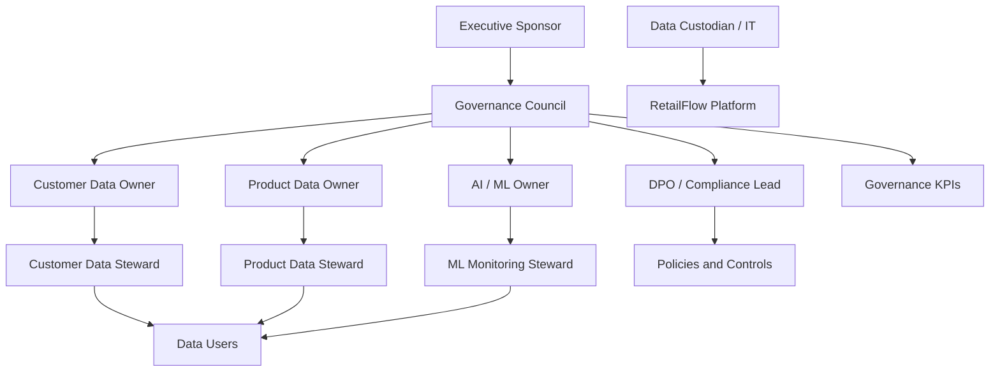

### 7.2 Why hybrid governance

A fully centralized model would be too rigid for a platform that includes business, engineering and AI topics.

A fully decentralized model would create inconsistent definitions and weak accountability.

The hybrid model provides:

- central consistency;
- domain accountability;
- faster operational execution;
- clear escalation paths;
- scalable governance practices.

### 7.3 Governance cadence

I defined the following governance cadence.

| Activity | Frequency | Responsible role |
|---|---|---|
| Governance KPI review | Monthly | Governance Council |
| Data quality issue review | Weekly | Data Steward |
| Retention action review | Monthly | DPO / Compliance Lead |
| ML monitoring review | Monthly | ML Owner |
| Risk register review | Quarterly | Governance Council |
| Policy review | Quarterly | Governance Council |
| Accessibility and training review | Quarterly | Executive Sponsor and Governance Council |

---

## 8. Roles, Responsibilities and Personas

To make the governance model concrete, I associated each governance role with a realistic RetailFlow persona.

These personas are not necessarily separate full-time positions.

They can be responsibilities assigned to existing job roles.

### 8.1 Role and persona mapping

| Governance role | RetailFlow persona | Main responsibility |
|---|---|---|
| Executive Sponsor | Chief Data & Analytics Officer | Sponsors the data governance program and validates strategic priorities. |
| Governance Council | Cross-functional governance committee | Approves policies, reviews risks and arbitrates decisions. |
| Data Owner | Head of Customer Intelligence | Owns customer analytics definitions, usage priorities and quality targets. |
| Data Steward | Senior CRM & Analytics Manager | Monitors quality, glossary definitions, consent usage and issue resolution. |
| Data Custodian | Lead Data Engineer | Operates data systems, pipelines, security controls and retention workflows. |
| DPO / Compliance Lead | Privacy & Compliance Manager | Oversees GDPR alignment, consent, retention and audit readiness. |
| ML Owner | Lead Machine Learning Engineer | Owns model monitoring, drift analysis, retraining and explainability. |
| Business Owner | Head of E-Commerce Performance | Uses customer intelligence for business decisions and campaign prioritization. |
| Data Users | Marketing analysts, CRM specialists, business analysts | Consume governed data and report quality issues. |

### 8.2 Executive Sponsor

**Persona:** Chief Data & Analytics Officer.

The Executive Sponsor provides authority, funding and visibility.

Responsibilities:

- approve the governance strategy;
- validate priorities;
- remove cross-functional blockers;
- sponsor the governance roadmap;
- ensure alignment with business objectives;
- review governance maturity.

### 8.3 Governance Council

**Persona:** Monthly cross-functional committee.

Typical members:

- Chief Data & Analytics Officer;
- Head of Customer Intelligence;
- Privacy & Compliance Manager;
- Lead Data Engineer;
- Lead Machine Learning Engineer;
- Head of E-Commerce Performance;
- Senior CRM & Analytics Manager.

Responsibilities:

- approve governance policies;
- define common standards;
- review KPIs;
- review risks;
- resolve ownership conflicts;
- prioritize governance improvements;
- validate change management actions.

### 8.4 Data Owner

**Persona:** Head of Customer Intelligence.

The Data Owner is accountable for the business meaning and usage of customer intelligence data.

Responsibilities:

- define business definitions;
- approve customer analytics use cases;
- validate quality targets;
- prioritize customer data improvements;
- arbitrate business conflicts around metrics;
- ensure the domain produces value.

### 8.5 Data Steward

**Persona:** Senior CRM & Analytics Manager.

The Data Steward manages governance in daily operations.

Responsibilities:

- monitor quality indicators;
- maintain glossary definitions;
- review data quality issues;
- validate consent usage practices;
- coordinate issue resolution;
- communicate governance rules to users.

### 8.6 Data Custodian

**Persona:** Lead Data Engineer.

The Data Custodian implements governance controls technically.

Responsibilities:

- operate PostgreSQL schemas;
- maintain pipelines;
- implement validation rules;
- maintain Airflow workflows;
- implement retention cleanup;
- maintain quality and audit logs;
- support monitoring and observability.

### 8.7 DPO / Compliance Lead

**Persona:** Privacy & Compliance Manager.

The DPO / Compliance Lead oversees privacy and regulatory alignment.

Responsibilities:

- validate GDPR alignment;
- review consent management;
- review retention policies;
- oversee anonymization logic;
- ensure audit evidence is available;
- review privacy risk controls;
- validate training material for privacy awareness.

### 8.8 ML Owner

**Persona:** Lead Machine Learning Engineer.

The ML Owner governs the AI lifecycle.

Responsibilities:

- validate model purpose;
- monitor model metrics;
- review feature importance;
- monitor drift reports;
- validate retraining workflows;
- ensure model outputs are explainable;
- document responsible use of predictions.

### 8.9 Business Owner

**Persona:** Head of E-Commerce Performance.

The Business Owner ensures that governed data supports decision-making.

Responsibilities:

- use churn, CLV and segmentation outputs;
- prioritize business actions;
- validate business usefulness;
- provide feedback on dashboards;
- ensure insights are used responsibly.

### 8.10 Data Users

**Personas:** Marketing analysts, CRM specialists and business analysts.

Data Users consume governed data under approved rules.

Responsibilities:

- follow data usage policies;
- respect consent constraints;
- use approved definitions;
- report data quality issues;
- request clarification when definitions are unclear;
- participate in training.

---

## 9. Governance Decision Model

I defined decision rights to clarify who decides what.

### 9.1 Decision rights matrix

| Decision area | Decision owner | Consulted roles | Evidence required |
|---|---|---|---|
| New customer analytics use case | Data Owner | DPO, ML Owner, Business Owner | Purpose, data fields, consent requirement |
| New data quality rule | Data Steward | Data Custodian, Data Owner | Rule definition, severity, remediation path |
| Retention policy update | DPO / Compliance Lead | Data Owner, Data Custodian | Legal basis, target table, action |
| Model retraining approval | ML Owner | Data Owner, Data Custodian | Metrics, drift report, validation output |
| Glossary definition update | Data Steward | Data Owner, Data Users | Definition, examples, owner approval |
| Governance KPI target update | Governance Council | Executive Sponsor | KPI history, business impact |
| Access policy update | Governance Council | DPO, Data Custodian | Role mapping and security impact |

### 9.2 Escalation path

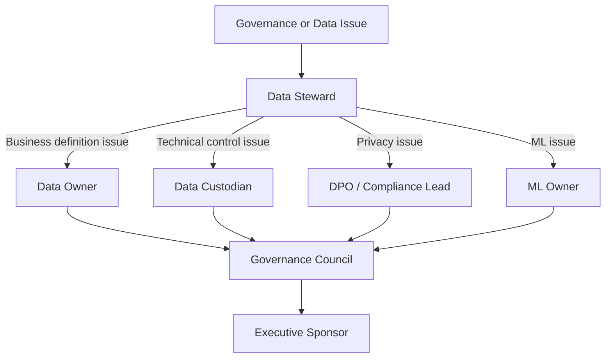

---

## 10. Data Domains Under Governance

I structured governance around core domains.

### 10.1 Customer domain

The customer domain includes:

- customer identifier;
- demographic attributes;
- account status;
- loyalty status;
- consent indicators;
- anonymization status;
- last interaction timestamp.

Governance focus:

- privacy;
- consent;
- retention;
- segmentation eligibility;
- analytics usage;
- anonymization.

### 10.2 Event domain

The event domain includes:

- product views;
- add-to-cart events;
- checkout events;
- purchase events;
- session events;
- raw payloads.

Governance focus:

- validation;
- traceability;
- timeliness;
- dead-letter handling;
- quality monitoring.

### 10.3 Transaction domain

The transaction domain includes:

- orders;
- order items;
- payments;
- shipments;
- returns;
- refunds.

Governance focus:

- accuracy;
- financial consistency;
- reporting reliability;
- retention requirements.

### 10.4 Product domain

The product domain includes:

- product catalog;
- category;
- supplier;
- product availability;
- price;
- product metadata.

Governance focus:

- completeness;
- consistency;
- reference values;
- product recommendations;
- catalog quality.

### 10.5 AI output domain

The AI output domain includes:

- churn scores;
- churn risk labels;
- CLV predictions;
- CLV value bands;
- customer segments;
- model versions;
- prediction timestamps;
- drift metrics.

Governance focus:

- explainability;
- monitoring;
- model versioning;
- responsible use;
- consent-aware exploration;
- retraining.

---

## 11. Data Classification

I defined a simple classification model adapted to RetailFlow.

The goal is to classify data by sensitivity and apply appropriate controls.

### 11.1 Classification levels

| Classification | Description | Examples | Governance controls |
|---|---|---|---|
| Public | Information that can be shared externally without customer risk. | Product catalog, product category labels, generic platform description | Basic integrity controls |
| Internal | Operational or analytical information intended for internal use. | Aggregated sales KPIs, model monitoring summaries, operational metrics | Internal access rules and documentation |
| Confidential | Customer-related or business-sensitive data requiring stronger controls. | Customer profiles, consent flags, transaction history, behavioral features, ML predictions | Consent rules, retention, audit logs, limited access |

### 11.2 Classification by data domain

| Data domain | Classification | Reason |
|---|---|---|
| Product catalog | Public / Internal | Product information can be public, but internal pricing or margin can be sensitive. |
| Customer profiles | Confidential | Contains customer-level information. |
| Consent data | Confidential | Directly related to privacy rights and permitted usage. |
| Orders and payments | Confidential | Transactional and potentially sensitive business data. |
| Behavioral events | Confidential | Can describe individual customer behavior. |
| Customer features | Confidential | Derived customer-level analytical data. |
| ML predictions | Confidential | Can influence customer treatment and marketing actions. |
| Aggregated KPIs | Internal | Business performance metrics should remain internal. |
| Monitoring metrics | Internal | Operational information for platform teams. |
| Public documentation | Public | Non-sensitive product and architecture descriptions. |

### 11.3 Handling rules

| Classification | Handling rules |
|---|---|
| Public | Can be documented and shared externally if validated. |
| Internal | Accessible to approved internal users only. |
| Confidential | Requires purpose, role, consent consideration, retention rule and auditability. |

### 11.4 Classification diagram

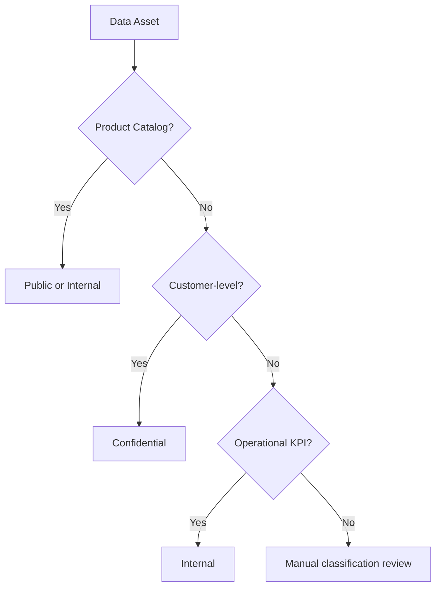

---

## 12. Data Policies

I defined governance policies that translate the governance principles into operational rules.

### 12.1 Policy overview

| Policy | Purpose |
|---|---|
| Customer data policy | Define how customer data may be used. |
| Consent management policy | Control marketing, analytics and personalization usage. |
| Retention policy | Define how long data is retained and what action is applied. |
| Anonymization policy | Define how customer identity data is removed or neutralized. |
| Data quality policy | Define validation rules and issue management. |
| AI governance policy | Define responsible use of ML predictions. |
| Access and security policy | Define access principles and technical controls. |
| Audit policy | Define evidence, logging and review expectations. |

### 12.2 Customer data policy

Customer data may only be used for approved purposes.

Approved purposes include:

- customer intelligence;
- service improvement;
- churn prevention;
- segmentation;
- CLV analysis;
- operational monitoring;
- data quality analysis;
- compliance and retention processes.

Customer data must not be used for undefined purposes without review.

The Data Owner and DPO / Compliance Lead must be consulted for any new customer-level analytical use case.

### 12.3 Acceptable use policy

Users consuming RetailFlow data must:

- use approved dashboards and endpoints;
- respect consent indicators;
- avoid exporting unnecessary customer-level data;
- use aggregated data where possible;
- report quality issues;
- follow glossary definitions;
- avoid unsupported interpretations of AI outputs.

### 12.4 Policy review

Policies must be reviewed quarterly by the Governance Council.

Policy updates should be triggered when:

- new data domains are added;
- new ML use cases are introduced;
- a privacy risk is identified;
- recurring quality issues appear;
- new compliance requirements emerge;
- business usage changes.

---

## 13. Consent Management Policy

Consent management is central to RetailFlow governance.

The platform tracks consent at customer level.

### 13.1 Consent dimensions

| Consent field | Purpose |
|---|---|
| `marketing_consent` | Indicates whether the customer can be targeted for marketing activation. |
| `analytics_consent` | Indicates whether the customer can be used in analytics and customer intelligence exploration. |
| `personalization_consent` | Indicates whether the customer can be used for personalization-related use cases. |

### 13.2 Consent usage principles

I defined the following principles:

1. Consent must be explicit enough to support the intended purpose.
2. Analytics exploration should prioritize customers with analytics consent.
3. Marketing activation should require marketing consent.
4. Personalization use cases should require personalization consent.
5. Consent values must be visible to data users where they affect usage.
6. Consent must be considered before using AI outputs for customer-level actions.

### 13.3 Consent-aware analytics

RetailFlow connects governance to analytics through the Customer Intelligence page.

The customer explorer contains a default filter:

```text
Show only customers with analytics consent
```

This ensures that AI profile exploration is aligned with consent-aware governance.

### 13.4 Consent flow

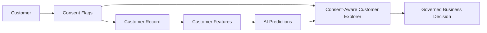

### 13.5 Consent monitoring

Consent rates are visible in the Data Governance dashboard.

The dashboard tracks:

- marketing consent rate;
- analytics consent rate;
- personalization consent rate;
- anonymized customers;
- customer count.

This makes consent not only stored but also monitored.

---

## 14. Retention and Anonymization Policy

RetailFlow includes a retention policy framework and automated anonymization workflow.

### 14.1 Retention policy table

Retention policies are stored in:

```text
governance.data_retention_policies
```

This table defines:

- policy identifier;
- target domain;
- target table;
- retention duration;
- retention action;
- owner role;
- legal basis or governance basis.

### 14.2 Retention principles

I defined the following retention principles:

1. Data should not be retained indefinitely without purpose.
2. Customer personal data should be anonymized when the retention condition is met.
3. Retention actions must be logged.
4. The retention workflow must be auditable.
5. Retention policies must be reviewed periodically.

### 14.3 Anonymization workflow

The Airflow DAG `retention_cleanup` supports the retention process.

The workflow:

1. identifies customers affected by the retention policy;
2. anonymizes personal fields;
3. disables consent flags;
4. changes account status to anonymized;
5. records the action in the retention audit log.

### 14.4 Anonymized fields

The anonymization process affects fields such as:

- first name;
- last name;
- email;
- phone number;
- birth date;
- gender;
- city;
- postal code;
- consent flags;
- account status.

### 14.5 Retention action log

Retention actions are logged in:

```text
governance.retention_actions_log
```

The log stores:

- action identifier;
- policy identifier;
- table name;
- record identifier;
- action type;
- action status;
- execution timestamp;
- executing component;
- action details.

### 14.6 Retention workflow diagram

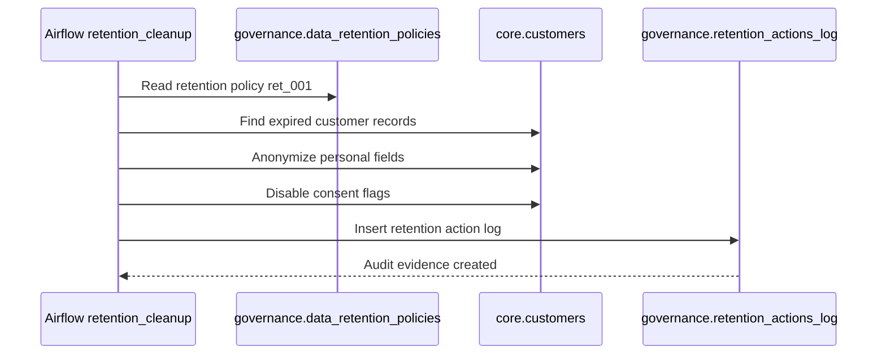

---

## 15. Data Quality Policy

Data quality is a governance requirement in RetailFlow.

The objective is to prevent incorrect data from contaminating downstream analytics and ML outputs.

### 15.1 Quality dimensions

I defined quality controls around the following dimensions:

| Dimension | Meaning in RetailFlow |
|---|---|
| Completeness | Required fields must be present. |
| Validity | Event types and values must be allowed. |
| Consistency | Events must reference existing customers and products. |
| Timeliness | Timestamps must be valid and usable. |
| Traceability | Errors must be logged and explainable. |

### 15.2 Quality validation rules

The real-time pipeline includes validation rules such as:

| Rule | Purpose | Action |
|---|---|---|
| Event identifier required | Ensure event traceability | Reject invalid event |
| Event type allowed | Prevent unsupported event categories | Reject invalid event |
| Customer exists | Ensure customer referential integrity | Reject invalid event |
| Product exists | Ensure product referential integrity | Reject invalid event |
| Timestamp valid | Ensure event chronology is usable | Reject invalid event |

### 15.3 Dead-letter handling

Invalid events are stored in:

```text
governance.dead_letter_events
```

This prevents invalid data from entering trusted analytical tables.

### 15.4 Quality logs

Failed rules are logged in:

```text
governance.data_quality_logs
```

This allows quality issues to be:

- counted;
- reviewed;
- categorized;
- assigned;
- monitored;
- audited.

### 15.5 Quality monitoring

The Data Quality dashboard displays:

- dead-letter events;
- failed rules;
- severity distribution;
- impacted event types;
- quality rule summaries;
- technical evidence.

### 15.6 Quality workflow diagram

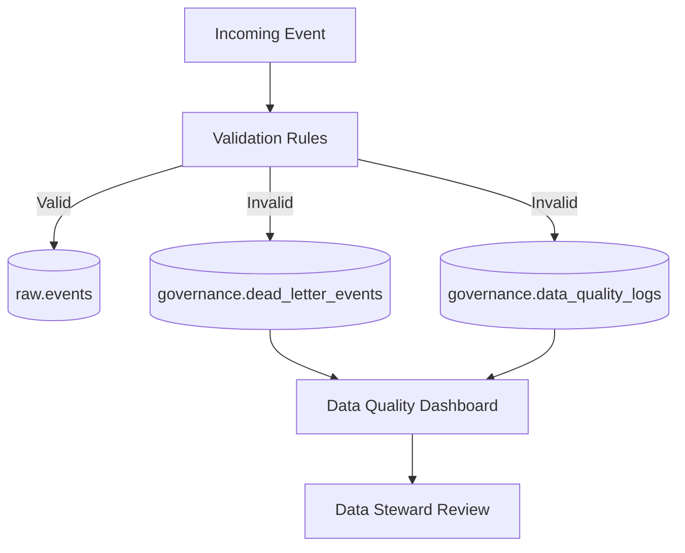

---

## 16. Data Security and Access Policy

RetailFlow is not currently positioned as a complete enterprise IAM platform.

However, I defined security principles that guide data access and future implementation.

### 16.1 Security principles

| Principle | Description |
|---|---|
| Least privilege | Users should access only what they need. |
| Purpose-based access | Access should be linked to a business purpose. |
| Confidentiality | Customer-level data should be protected. |
| Auditability | Sensitive actions should be traceable. |
| Segregation of duties | Governance decisions and technical implementation should not be controlled by one person only. |
| Secure defaults | Sensitive data should not be exposed by default. |

### 16.2 Access expectations by role

| Role | Expected access |
|---|---|
| Data Owner | Domain-level KPIs, definitions and governance reports |
| Data Steward | Quality logs, glossary, consent indicators and issue tracking |
| Data Custodian | Technical schemas, pipelines, logs and platform operations |
| DPO / Compliance Lead | Consent, retention, anonymization and audit trails |
| ML Owner | Features, model reports, prediction summaries and drift outputs |
| Business User | Approved dashboards and aggregated insights |

### 16.3 Future access improvements

Future access improvements should include:

- role-based access control;
- authentication;
- API authorization scopes;
- audit logging for user-level access;
- secrets management;
- masking for sensitive attributes;
- stronger separation between user personas.

---

## 17. AI Governance Policy

RetailFlow includes AI outputs that can influence business decisions.

I therefore designed a specific AI governance policy.

### 17.1 Governed AI use cases

| Model | Use case | Governance concern |
|---|---|---|
| Churn model | Identify customers at risk | Avoid over-automated treatment and ensure explainability |
| CLV model | Estimate customer value | Avoid unfair resource allocation without business review |
| Segmentation model | Group customers | Ensure segments are understandable and actionable |

### 17.2 AI governance principles

I defined the following principles:

1. AI predictions must support decisions, not replace human judgment.
2. Customer-level AI exploration must consider analytics consent.
3. Models must be monitored with metrics and drift signals.
4. Model outputs must be explainable to business users.
5. Retraining must be scheduled and traceable.
6. AI outputs must be versioned and timestamped.
7. Business users must understand the limits of model predictions.

### 17.3 Model monitoring

RetailFlow monitors:

- churn ROC AUC;
- churn F1;
- churn precision;
- churn recall;
- Brier score;
- CLV MAE;
- CLV RMSE;
- CLV R²;
- segmentation quality;
- feature importance;
- prediction distribution;
- drift status.

### 17.4 Drift monitoring

Drift monitoring detects changes in customer behavior that may reduce model reliability.

The AI Monitoring page displays drift status and drifted feature count.

### 17.5 Retraining governance

The Airflow DAG `ml_retraining` orchestrates:

- churn model training;
- segmentation training;
- CLV model training;
- prediction refresh;
- drift evaluation.

### 17.6 AI governance lifecycle

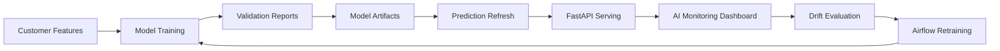

---

## 18. Business Glossary

I defined a business glossary to clarify key terms used in RetailFlow.

| Term | Definition | Owner |
|---|---|---|
| Active customer | A customer with recent purchase or behavioral activity in the platform. | Head of Customer Intelligence |
| Analytics consent | Permission indicator allowing customer data to be used for analytics and customer intelligence exploration. | DPO / Compliance Lead |
| Marketing consent | Permission indicator allowing marketing activation. | DPO / Compliance Lead |
| Personalization consent | Permission indicator allowing personalized recommendations or experiences. | DPO / Compliance Lead |
| Customer event | A behavioral action generated by a customer, such as product view, cart or checkout activity. | Data Steward |
| Valid event | An event that passes required validation rules before persistence. | Data Custodian |
| Dead-letter event | An event rejected by validation and isolated for review. | Data Steward |
| Churn risk | Probability or label indicating the likelihood of customer disengagement. | ML Owner |
| CLV | Customer Lifetime Value, the estimated future value of a customer. | Head of Customer Intelligence |
| Customer segment | Business-readable group of customers with similar behavior or value profile. | ML Owner |
| Retention policy | Rule defining how long a data asset is kept and what action is applied. | DPO / Compliance Lead |
| Anonymization | Process of removing or neutralizing identifying customer attributes. | DPO / Compliance Lead |
| Data quality rule | A rule used to validate data completeness, validity or consistency. | Data Steward |
| Drift | A change in data distribution that can affect model reliability. | ML Owner |
| Audit trail | Recorded evidence of governance-related actions. | Governance Council |

---

## 19. Governance Processes

I defined governance processes to make policies operational.

### 19.1 Consent review process

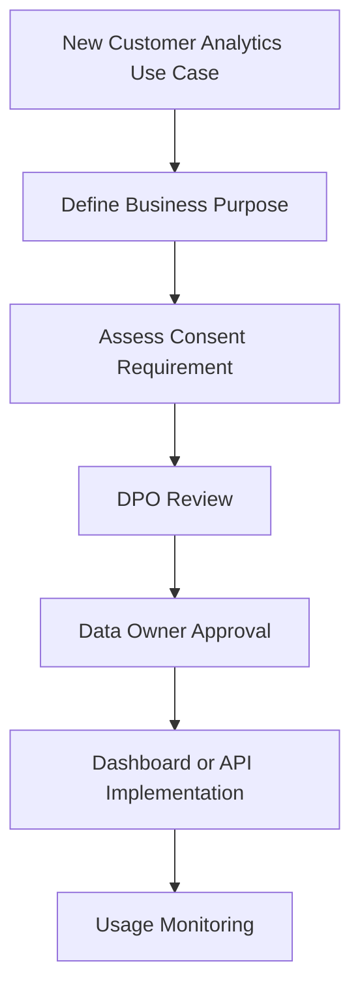

### 19.2 Data quality issue process

1. Data quality issue is detected.
2. Issue is logged in the governance schema.
3. Data Steward reviews severity.
4. Data Custodian investigates technical cause.
5. Data Owner validates business impact.
6. Corrective action is implemented.
7. Issue is monitored for recurrence.

### 19.3 Retention process

1. Retention policy is defined.
2. Airflow retention workflow identifies eligible records.
3. Customer record is anonymized.
4. Consent flags are disabled.
5. Retention action is logged.
6. Governance dashboard exposes the action.
7. Compliance Lead reviews the audit trail.

### 19.4 AI monitoring process

1. Models are trained.
2. Predictions are refreshed.
3. Metrics are generated.
4. Drift is evaluated.
5. AI Monitoring dashboard displays outputs.
6. ML Owner reviews model status.
7. Retraining or investigation is triggered if needed.

---

## 20. Data Quality Controls

Data quality controls protect the platform from poor input data.

### 20.1 Preventive controls

| Control | Description |
|---|---|
| API schemas | Incoming requests must follow expected structures. |
| Event validation | The consumer validates business and technical rules. |
| Referential checks | Customer and product identifiers are checked. |
| Allowed event types | Unsupported event types are rejected. |
| Timestamp validation | Invalid timestamps are rejected. |

### 20.2 Detective controls

| Control | Description |
|---|---|
| Dead-letter monitoring | Rejected events are visible in dashboards. |
| Quality summaries | Failed rules are counted and reviewed. |
| Airflow data quality DAG | Quality checks are scheduled. |
| Streamlit Data Quality page | Quality issues are exposed to users. |

### 20.3 Corrective controls

| Control | Description |
|---|---|
| Dead-letter review | Data Steward reviews rejected events. |
| Rule adjustment | Data quality rules can be adjusted if needed. |
| Pipeline correction | Data Custodian fixes technical causes. |
| Reprocessing path | Future improvement for corrected events. |

---

## 21. Metadata, Lineage and Traceability

Metadata and lineage are important for trust.

RetailFlow currently implements practical traceability through schemas, logs and dashboards.

### 21.1 Technical metadata

Technical metadata exists through:

- PostgreSQL schemas;
- table names;
- column structures;
- model report files;
- Airflow DAGs;
- API endpoints;
- dashboard pages.

### 21.2 Business metadata

Business metadata exists through:

- glossary definitions;
- role ownership;
- retention policies;
- quality rule names;
- segment labels;
- model labels;
- dashboard descriptions.

### 21.3 Lineage overview

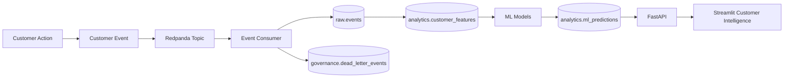

### 21.4 Future lineage improvements

Future improvements include:

- formal data catalog;
- automated lineage extraction;
- data asset owner registry;
- metadata tables;
- dbt documentation;
- OpenLineage integration.

---

## 22. Auditability and Evidence

Auditability is a core part of the RetailFlow governance framework.

Governance decisions and technical controls must produce evidence.

### 22.1 Audit evidence sources

| Evidence source | Purpose |
|---|---|
| `governance.retention_actions_log` | Proves retention and anonymization actions. |
| `governance.dead_letter_events` | Proves invalid event isolation. |
| `governance.data_quality_logs` | Proves quality rule execution and failures. |
| Airflow DAG logs | Prove scheduled workflow execution. |
| ML reports | Prove model validation and monitoring. |
| Prometheus metrics | Prove platform monitoring. |
| Grafana dashboards | Visualize operational health. |
| Streamlit governance page | Provides governance visibility. |

### 22.2 Audit questions RetailFlow can answer

RetailFlow can answer governance questions such as:

- Which customers have analytics consent?
- Which retention policies exist?
- Which customer records were anonymized?
- When was an anonymization action executed?
- Which component executed the action?
- Which events were rejected?
- Why were events rejected?
- Which quality rule failed?
- Are AI models monitored?
- Has drift been detected?
- Are platform services healthy?

### 22.3 Audit flow

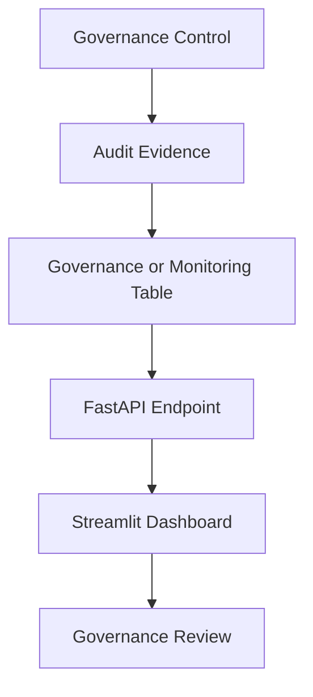

---

## 23. Technology and Tooling

RetailFlow uses technical tools to make governance operational.

### 23.1 Governance technology map

| Capability | Tool / component |
|---|---|
| Consent storage | PostgreSQL customer and governance tables |
| Retention policy storage | `governance.data_retention_policies` |
| Retention automation | Airflow `retention_cleanup` DAG |
| Anonymization audit | `governance.retention_actions_log` |
| Event validation | Python event consumer validators |
| Dead-letter handling | `governance.dead_letter_events` |
| Quality logs | `governance.data_quality_logs` |
| Governance API | FastAPI `/governance/*` endpoints |
| Governance dashboard | Streamlit Data Governance page |
| Quality dashboard | Streamlit Data Quality page |
| AI monitoring | Streamlit AI Monitoring page |
| Operational monitoring | Prometheus and Grafana |
| Workflow orchestration | Airflow |

### 23.2 Governance dashboard architecture

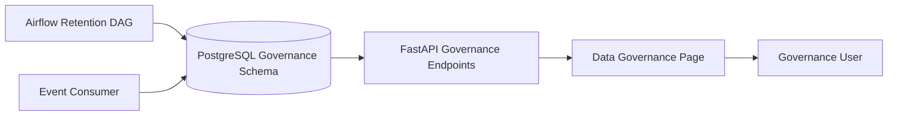

---

## 24. Governance KPIs

I defined governance KPIs to make governance measurable.

### 24.1 KPI table

| KPI | Definition | Target | Owner |
|---|---|---|---|
| Analytics consent coverage | Share of customers with analytics consent enabled. | >= 75% | DPO / Compliance Lead |
| Marketing consent coverage | Share of customers with marketing consent enabled. | >= 50% | Business Owner |
| Personalization consent coverage | Share of customers with personalization consent enabled. | >= 50% | Business Owner |
| Retention policy coverage | Share of critical governed domains covered by a retention policy. | 100% for critical domains | DPO / Compliance Lead |
| Retention action traceability | Share of executed retention actions recorded in the audit log. | 100% | Data Custodian |
| Data quality execution rate | Share of scheduled quality checks executed successfully. | >= 95% | Data Steward |
| Dead-letter rate | Share of rejected events among ingested events. | < 2% | Data Steward |
| High severity issue resolution time | Average time to resolve high severity quality issues. | < 5 business days | Data Steward |
| ML monitoring coverage | Share of production ML models with metrics and drift monitoring. | 100% | ML Owner |
| Governance review cadence | Share of planned governance reviews completed. | >= 90% | Governance Council |

### 24.2 KPI dashboard logic

Governance KPIs should be reviewed monthly.

They should be presented to the Governance Council with:

- current value;
- target;
- trend;
- owner;
- issue explanation;
- corrective actions.

### 24.3 KPI diagram

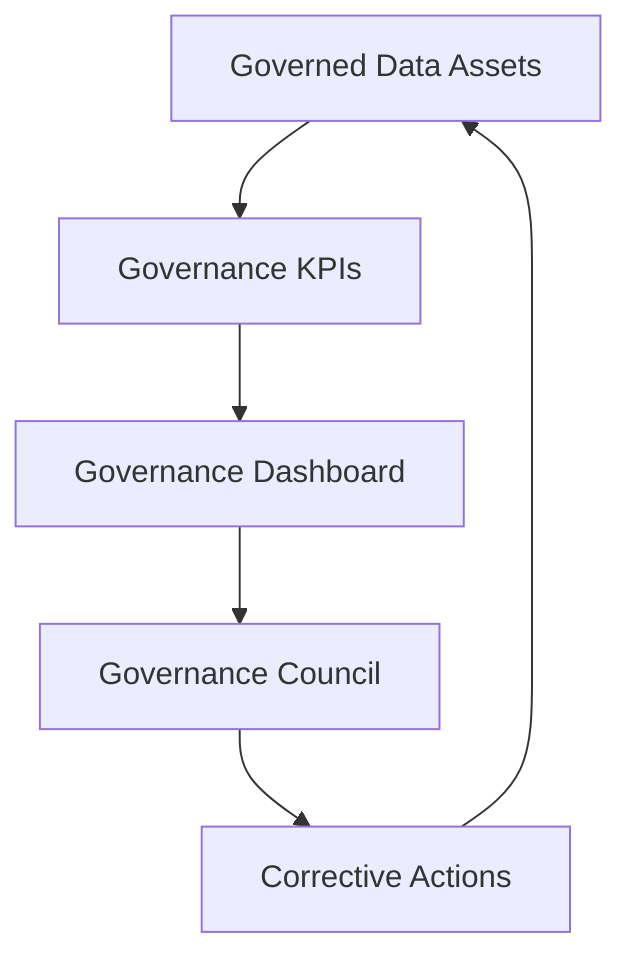

---

## 25. Risk Management

I defined a governance risk register to identify and mitigate data risks.

### 25.1 Risk register

| Risk | Description | Impact | Mitigation | Owner |
|---|---|---|---|---|
| Personal data exposure | Customer data may be accessed or used beyond intended purpose. | High | Consent management, classification, access principles, anonymization | DPO / Compliance Lead |
| Consent misuse | Customer data may be used for analytics or marketing without appropriate consent. | High | Consent-aware dashboards and policy review | DPO / Compliance Lead |
| Retention failure | Data may be kept longer than needed. | High | Retention policies, Airflow cleanup, audit logs | Data Custodian |
| Poor data quality | Invalid events may affect analytics and ML models. | High | Validation rules, quality logs, dead-letter handling | Data Steward |
| ML drift | Customer behavior may change and reduce model reliability. | Medium | Drift monitoring and retraining DAG | ML Owner |
| Unclear ownership | Issues may remain unresolved if accountability is unclear. | Medium | Operating model and role mapping | Governance Council |
| Dashboard misuse | Users may overinterpret AI outputs. | Medium | Training, metric guides and human oversight | Business Owner |
| Metadata gaps | Users may misunderstand data meaning or lineage. | Medium | Glossary and future catalog roadmap | Data Steward |
| Accessibility gap | Some users may not be able to follow standard training formats. | Medium | Accessible materials and multi-format training | Executive Sponsor |

### 25.2 Risk review process

Risks should be reviewed quarterly by the Governance Council.

For each risk, the council should review:

- current likelihood;
- current impact;
- controls in place;
- control effectiveness;
- open actions;
- owner;
- deadline.

---

## 26. Inclusion and Accessibility

I included inclusion and accessibility in the governance framework because governance only works if users understand and can apply it.

Training and adoption cannot assume that every employee has the same language, learning style, availability or accessibility needs.

### 26.1 Inclusion principles

I defined the following principles:

1. Governance training should be understandable for both technical and non-technical users.
2. Training should be available in multiple languages when teams are international.
3. Documentation should avoid unnecessary jargon.
4. Important policies should be available in accessible formats.
5. Alternative training formats should be provided when needed.
6. Reasonable accommodations should be planned for people with disabilities.
7. Governance adoption should be measured without excluding users who need adapted support.

### 26.2 Multi-language training

RetailFlow should provide governance awareness material in multiple languages when required by the organization.

Priority languages should be based on workforce composition.

Training should cover:

- data ownership;
- consent usage;
- data quality responsibilities;
- retention and anonymization;
- AI output interpretation;
- incident reporting.

### 26.3 Accessibility accommodations

Training and documentation should support:

- screen-reader compatible documents;
- captions for recorded training;
- clear visual contrast;
- readable font sizes;
- non-visual alternatives for diagrams;
- extra time or assisted sessions when needed;
- simplified summaries for non-specialist audiences.

### 26.4 Inclusion in change management

Inclusion must not be treated as a separate afterthought.

It should be integrated into the governance change management plan.

This ensures that governance adoption is fair, accessible and realistic.

---

## 27. Change Management

Governance succeeds only if people adopt it.

I therefore included a change management plan.

### 27.1 Change management objectives

The change management plan aims to:

- explain why governance matters;
- clarify responsibilities;
- train data users;
- reduce resistance;
- make governance part of daily work;
- support inclusion and accessibility;
- create feedback loops.

### 27.2 Stakeholder communication

| Audience | Message |
|---|---|
| Executive Sponsor | Governance protects data value, trust and platform scalability. |
| Data Owners | Governance clarifies accountability and improves decision quality. |
| Data Stewards | Governance gives structure to quality and issue resolution. |
| Data Custodians | Governance requirements are translated into technical controls. |
| Business Users | Governance makes dashboards more trustworthy and usable. |
| ML Users | Governance improves responsible use of predictions. |

### 27.3 Training plan

| Training module | Audience | Format |
|---|---|---|
| Governance fundamentals | All data users | Short online module |
| Consent and privacy | Marketing, analytics, business users | Workshop and quick reference sheet |
| Data quality issue reporting | Data users and stewards | Practical session |
| AI output interpretation | Business and ML users | Dashboard walkthrough |
| Retention and anonymization | DPO, data custodians, stewards | Process training |
| Accessibility and inclusion | Managers and trainers | Awareness session |

### 27.4 Adoption strategy

I defined the following adoption strategy:

1. Start with customer and event domains.
2. Train the most active data users first.
3. Use dashboards to make governance visible.
4. Review KPIs monthly.
5. Collect feedback from users.
6. Improve policies based on recurring issues.
7. Extend governance to additional domains.

---

## 28. Implementation Roadmap

RetailFlow already includes several governance components.

The roadmap therefore includes both completed work and future improvements.

### 28.1 Completed governance implementation

| Area | Completed implementation |
|---|---|
| Consent management | Customer consent fields and consent dashboard |
| Analytics consent | Consent-aware customer explorer |
| Retention policies | Retention policy table |
| Retention workflow | Airflow `retention_cleanup` DAG |
| Anonymization | Customer anonymization logic |
| Audit trail | Retention action log |
| Data quality | Validation rules and quality logs |
| Dead-letter handling | Invalid events stored in governance dead-letter table |
| Governance dashboard | Streamlit Data Governance page |
| Data Quality dashboard | Streamlit Data Quality page |
| AI governance | AI monitoring, drift and explainability views |
| Orchestration | Airflow governance and ML workflows |

### 28.2 Future roadmap

| Phase | Improvement | Purpose |
|---|---|---|
| Phase 1 | Formal data catalog | Improve discoverability and ownership visibility. |
| Phase 2 | Automated lineage | Trace data from source events to dashboards and ML outputs. |
| Phase 3 | Role-based access control | Strengthen access governance by persona. |
| Phase 4 | User-level audit logging | Track who accessed sensitive datasets or dashboards. |
| Phase 5 | Advanced privacy impact assessment | Formalize privacy review for new use cases. |
| Phase 6 | Extended AI governance | Add fairness checks, model registry and approval workflow. |
| Phase 7 | Governance training program | Institutionalize awareness and adoption. |
| Phase 8 | Accessibility governance | Ensure training and documentation remain inclusive. |

### 28.3 Roadmap diagram

```mermaid
flowchart LR
    Done[Current Implementation] --> Catalog[Data Catalog]
    Catalog --> Lineage[Automated Lineage]
    Lineage --> RBAC[Role-Based Access Control]
    RBAC --> Audit[User-Level Audit Logging]
    Audit --> PIA[Privacy Impact Assessment]
    PIA --> AIGov[Advanced AI Governance]
    AIGov --> Training[Governance Training Program]
    Training --> Accessibility[Accessibility Governance]
```

---

## 29. Future Improvements

The governance framework is already strong for the current stage of RetailFlow, but I identified several future improvements.

### 29.1 Data catalog

A data catalog would make assets easier to find and understand.

It should include:

- table descriptions;
- column descriptions;
- owner;
- steward;
- classification;
- retention policy;
- glossary links;
- quality rules;
- lineage.

### 29.2 Metadata automation

Metadata is currently documented through schemas, code and dashboards.

A future improvement would automate metadata collection.

### 29.3 Advanced lineage

Lineage should be extended to show:

```text
source event
→ raw table
→ feature table
→ ML prediction
→ API endpoint
→ Streamlit dashboard
```

### 29.4 Role-based access control

Future platform versions should enforce access based on roles such as:

- Data Steward;
- Business User;
- ML Engineer;
- Compliance Lead;
- Platform Engineer.

### 29.5 Model registry and AI approval

The AI governance framework can be strengthened with:

- model registry;
- approval workflow;
- deployment stages;
- rollback strategy;
- production validation checklist.

### 29.6 Governance issue tracker

A dedicated governance issue tracker would help manage:

- quality issues;
- glossary updates;
- policy questions;
- access requests;
- privacy reviews.

### 29.7 Accessibility review process

Accessibility should be reviewed periodically for:

- training content;
- dashboards;
- documentation;
- diagrams;
- onboarding material.

---

## 30. Conclusion

I designed the RetailFlow data governance framework as an operational component of the platform, not as a separate theoretical layer.

The framework covers ownership, policies, consent, retention, anonymization, quality, AI monitoring, auditability, inclusion and continuous improvement.

The main strength of the approach is that governance is embedded directly into the platform design.

This is visible through:

- consent-aware customer intelligence;
- retention policies and anonymization workflow;
- dead-letter event handling;
- quality logs;
- governance APIs;
- dashboards;
- Airflow workflows;
- AI monitoring;
- risk and KPI management.

RetailFlow therefore demonstrates a mature approach to data governance for a modern Retail Intelligence platform.

The governance framework makes customer data more trustworthy, business intelligence more reliable, AI outputs more responsible and platform operations more auditable.

