# Bloc 2 — Data Architecture Design

# RetailFlow Data Architecture Plan

## Executive Summary

I designed the RetailFlow Platform as an end-to-end Retail Intelligence architecture for modern e-commerce organizations.

The purpose of this data architecture is to transform customer events, operational retail data and machine learning outputs into a governed, observable and decision-ready platform.

The architecture combines:

- a modular Docker-based infrastructure;
- a PostgreSQL analytical and operational data layer;
- a Redpanda Kafka-compatible streaming broker;
- a FastAPI service layer;
- a Streamlit business and monitoring interface;
- Apache Airflow orchestration;
- Prometheus and Grafana observability;
- PostgreSQL exporter metrics;
- GitHub Actions CI/CD workflows;
- a future-ready cloud and Kubernetes deployment path.

The architecture is designed to support the following core capabilities:

| Capability | Architectural Response |
|---|---|
| Real-time customer event processing | Redpanda, FastAPI event producer, Python event consumer |
| Reliable storage | PostgreSQL with separated schemas |
| Data governance | Dedicated governance schema, retention logs, consent data, quality logs |
| Customer intelligence | Analytics schema, ML predictions, customer segments |
| ML serving | FastAPI endpoints exposing model outputs and reports |
| Orchestration | Airflow DAGs for quality, sales aggregation, ML retraining and retention cleanup |
| Observability | Prometheus, Grafana, PostgreSQL exporter, application metrics |
| Developer workflow | Git, GitHub, Docker Compose, GitHub Actions CI/CD |

This document presents the architecture from both a conceptual and implementation point of view.

It explains the main design decisions, the infrastructure components, the data model, the deployment approach, the monitoring layer and the future architecture roadmap.

---

## 1. Architecture Objectives

I designed the RetailFlow architecture around the idea that a data platform should not only store data.

It should provide a complete operating environment where events become trusted data, trusted data becomes intelligence, and intelligence becomes actionable business insight.

The main objectives are:

1. provide a coherent end-to-end data platform;
2. support real-time event ingestion;
3. separate operational, raw, analytical and governance data layers;
4. make customer intelligence accessible through APIs and dashboards;
5. support orchestration and automation;
6. provide platform observability;
7. support governance, privacy and auditability by design;
8. remain reproducible through Docker Compose;
9. support a future migration toward cloud and Kubernetes.

---

## 2. Business and Technical Context

RetailFlow is a Retail Intelligence platform designed for e-commerce organizations.

The platform captures and processes customer activity such as:

- product views;
- add-to-cart events;
- checkout events;
- purchases;
- returns;
- support interactions;
- reviews;
- customer consent updates;
- browsing behavior.

The platform must support business questions such as:

- Which customers are most valuable?
- Which customers are at risk of churn?
- Which customer segments require different actions?
- Are live customer events being ingested correctly?
- Are invalid events isolated and traceable?
- Are ML models monitored and explainable?
- Are platform components healthy and observable?

To answer these questions, I designed a modular architecture where each component has a clear responsibility.

---

## 3. High-Level Architecture

The RetailFlow architecture follows a layered approach.

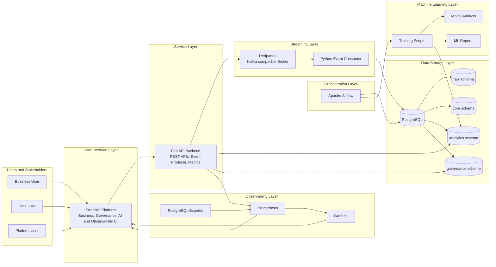

This architecture separates responsibilities across several layers.

| Layer | Role |
|---|---|
| User interface | Exposes the platform to users through Streamlit |
| API layer | Provides service access to data, events, ML and governance |
| Streaming layer | Decouples event production and event persistence |
| Storage layer | Centralizes structured data in PostgreSQL |
| Orchestration layer | Automates scheduled workflows |
| Machine learning layer | Trains, stores, reports and serves customer models |
| Observability layer | Monitors services, metrics and platform health |

---

## 4. Architecture Design Principles

### 4.1 Modularity

I separated the platform into specialized services.

Each component has a clear role:

| Component | Responsibility |
|---|---|
| Streamlit | User interface and dashboard layer |
| FastAPI | Backend API and event publishing layer |
| Redpanda | Event broker |
| Event consumer | Validation and persistence of events |
| PostgreSQL | Central storage and analytical database |
| Airflow | Workflow orchestration |
| ML scripts | Training, prediction and monitoring artifacts |
| Prometheus | Metrics collection |
| Grafana | Metrics visualization |
| GitHub Actions | CI/CD automation |

This modularity makes the platform easier to maintain and easier to explain.

---

### 4.2 Separation of Concerns

I designed the architecture so that each layer solves a different problem.

For example:

- Streamlit does not write directly to the database for live events.
- FastAPI produces events but does not persist them directly into the raw event table.
- Redpanda decouples event publishing from consumption.
- The consumer validates and persists events.
- PostgreSQL stores trusted, analytical and governance data.
- Airflow runs scheduled jobs.
- Prometheus and Grafana monitor the platform.

This separation supports scalability, maintainability and reliability.

---

### 4.3 Event-Driven Architecture

The customer journey is event-driven.

A customer action generates an event that flows through the platform.

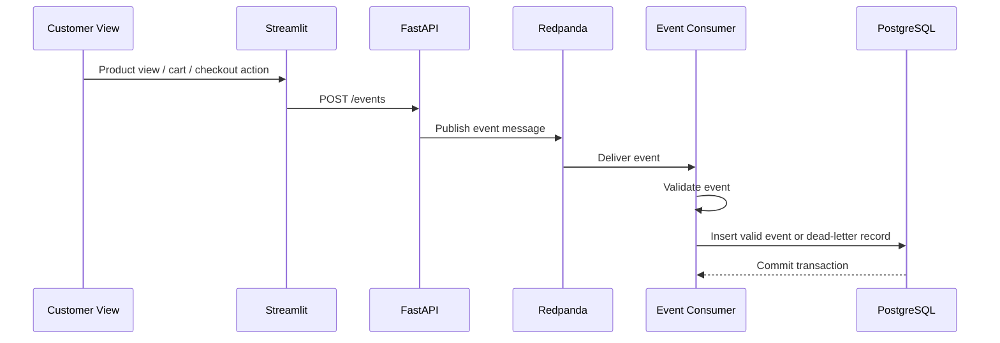

This design is closer to production e-commerce platforms than direct synchronous database writes.

It provides:

- decoupling;
- resilience;
- extensibility;
- traceability;
- clear data quality control points.

---

### 4.4 Governance by Design

I integrated governance directly into the architecture.

Governance is represented through:

- consent fields;
- retention policies;
- retention action logs;
- anonymization workflow;
- data quality logs;
- dead-letter events;
- API governance endpoints;
- Streamlit governance dashboards.

This makes governance operational rather than purely documentary.

---

### 4.5 Observability by Design

RetailFlow exposes platform metrics and health information.

Observability is available through:

- FastAPI `/metrics` endpoint;
- Prometheus scrape configuration;
- PostgreSQL exporter;
- Grafana dashboards;
- Airflow health endpoint;
- Streamlit Observability page.

This provides visibility into platform state and operational reliability.

---

### 4.6 Local Reproducibility

The platform runs locally through Docker Compose.

This enables:

- consistent setup;
- reproducible deployment;
- simplified evaluation;
- easier debugging;
- clear service orchestration.

---

### 4.7 Future-Ready Deployment

Although the current environment is Docker Compose-based, I designed the architecture so that it can evolve toward:

- Kubernetes;
- cloud-managed PostgreSQL;
- managed Kafka-compatible streaming;
- cloud monitoring;
- container registry deployment;
- production-grade IAM and SSO.

The `/k8s` directory is considered part of a future deployment roadmap rather than the current primary runtime.

---

## 5. Runtime Infrastructure

RetailFlow runs as a multi-container platform.

The main services are:

| Service | Role |
|---|---|
| PostgreSQL | Main database |
| pgAdmin | Database administration interface |
| Redpanda | Kafka-compatible event broker |
| FastAPI | Backend service layer |
| Event consumer | Streaming consumer and validation process |
| Streamlit | Platform user interface |
| Airflow webserver | Orchestration UI |
| Airflow scheduler | DAG scheduling |
| Airflow PostgreSQL | Airflow metadata database |
| Prometheus | Metrics collection |
| Grafana | Metrics visualization |
| PostgreSQL exporter | Database metrics exporter |

---

## 6. Docker Compose Architecture

Docker Compose is used as the main local deployment mechanism.

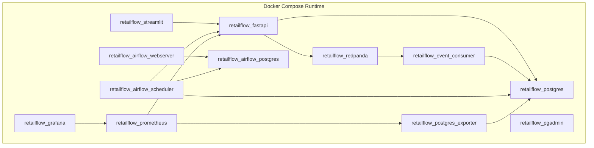

This setup allows the full platform to run with a single command:

```bash
docker compose up -d
```

---

## 7. Service Responsibilities

### 7.1 PostgreSQL

PostgreSQL is the central data platform.

It stores:

- raw events;
- clean business entities;
- analytical features;
- ML predictions;
- customer segments;
- governance policies;
- retention logs;
- data quality logs;
- dead-letter events.

PostgreSQL provides a stable relational foundation for both operational and analytical data.

---

### 7.2 Redpanda

Redpanda is used as the event broker.

It receives customer events from FastAPI and exposes them to the event consumer.

I selected Redpanda because it provides Kafka-compatible streaming capabilities with a simpler local deployment model.

---

### 7.3 FastAPI

FastAPI is the backend service layer.

It exposes:

- product endpoints;
- event publishing endpoints;
- recent event endpoints;
- quality endpoints;
- governance endpoints;
- AI endpoints;
- model report endpoints;
- health and metrics endpoints.

FastAPI also produces live events to Redpanda.

---

### 7.4 Event Consumer

The event consumer processes messages from Redpanda.

It is responsible for:

- consuming messages;
- parsing payloads;
- applying validation rules;
- writing valid events to PostgreSQL;
- writing invalid events to dead-letter tables;
- writing failed quality checks to governance logs.

---

### 7.5 Streamlit

Streamlit is the product interface.

It provides pages for:

- platform overview;
- customer journey simulation;
- customer intelligence;
- data governance;
- data quality;
- AI monitoring;
- observability.

---

### 7.6 Airflow

Airflow orchestrates scheduled workflows.

Main DAGs:

| DAG | Schedule | Purpose |
|---|---|---|
| `daily_sales_aggregation` | Daily | Build daily sales aggregates |
| `daily_data_quality` | Daily | Check data quality indicators |
| `ml_retraining` | Weekly | Retrain ML models and refresh predictions |
| `retention_cleanup` | Weekly | Apply retention and anonymization logic |

---

### 7.7 Prometheus

Prometheus collects metrics from FastAPI and PostgreSQL exporter.

It supports operational monitoring and observability.

---

### 7.8 Grafana

Grafana visualizes Prometheus metrics.

It provides operational dashboards for platform health.

---

### 7.9 PostgreSQL Exporter

The PostgreSQL exporter exposes database metrics to Prometheus.

It allows monitoring of PostgreSQL availability and operational behavior.

---

### 7.10 GitHub Actions

GitHub Actions provides the CI/CD automation layer.

It supports:

- code quality checks;
- automated tests;
- Docker build validation;
- API smoke checks;
- deployment-readiness validation.

The CI/CD layer is part of the platform industrialization strategy.

---

## 8. Network and Communication Design

RetailFlow services communicate through the Docker network.

Internal service names are used inside containers.

Examples:

| From | To | Internal URL |
|---|---|---|
| Streamlit | FastAPI | `http://fastapi:8000` |
| FastAPI | PostgreSQL | `postgres:5432` |
| FastAPI | Redpanda | `redpanda:9092` |
| Event consumer | Redpanda | `redpanda:9092` |
| Event consumer | PostgreSQL | `postgres:5432` |
| Prometheus | FastAPI | `fastapi:8000/metrics` |
| Prometheus | PostgreSQL exporter | `postgres_exporter:9187/metrics` |
| Grafana | Prometheus | `prometheus:9090` |

External access uses localhost ports.

| Component | Local URL |
|---|---|
| Streamlit | `http://127.0.0.1:8501` |
| FastAPI | `http://127.0.0.1:8000` |
| FastAPI Docs | `http://127.0.0.1:8000/docs` |
| PostgreSQL | `localhost:5432` |
| Airflow | `http://127.0.0.1:8080` |
| Prometheus | `http://127.0.0.1:9090` |
| Grafana | `http://127.0.0.1:3000` |
| PostgreSQL exporter | `http://127.0.0.1:9187/metrics` |

---

## 9. PostgreSQL Data Architecture

PostgreSQL is organized into logical schemas.

This schema separation is one of the most important architecture choices.

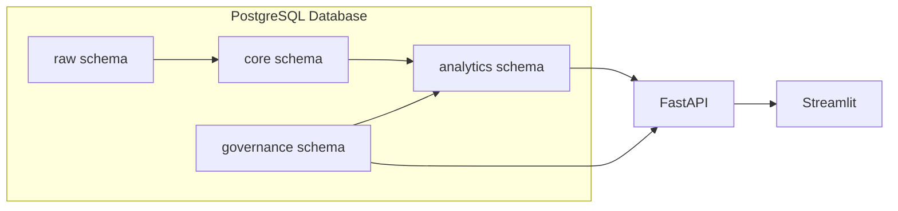

---

## 10. Database Schemas

### 10.1 Raw Schema

The `raw` schema stores ingested events and raw behavioral information.

Purpose:

- preserve event-level data;
- support replay and traceability;
- keep ingestion data separate from clean analytical entities.

Example table:

```text
raw.events
```

---

### 10.2 Core Schema

The `core` schema stores business entities.

Examples:

- customers;
- products;
- orders;
- order items;
- payments;
- shipments;
- returns;
- reviews;
- support tickets.

The core schema represents the trusted business layer.

---

### 10.3 Analytics Schema

The `analytics` schema stores derived and analytical data.

Examples:

- customer features;
- daily sales aggregates;
- ML predictions;
- customer segments;
- analytical views.

This layer supports dashboards, ML workflows and business intelligence.

---

### 10.4 Governance Schema

The `governance` schema stores governance, compliance, retention and quality data.

Examples:

- customer consents;
- data retention policies;
- retention action logs;
- data quality logs;
- dead-letter events.

This schema makes governance observable and auditable.

---

## 11. Advanced Data Model Overview

### 11.1 Core Business Entities

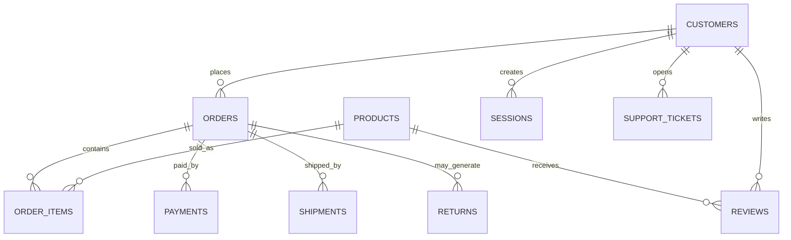

This model reflects a realistic multi-category e-commerce business.

It supports transactional, behavioral and customer relationship analysis.

---

### 11.2 Analytical Entities

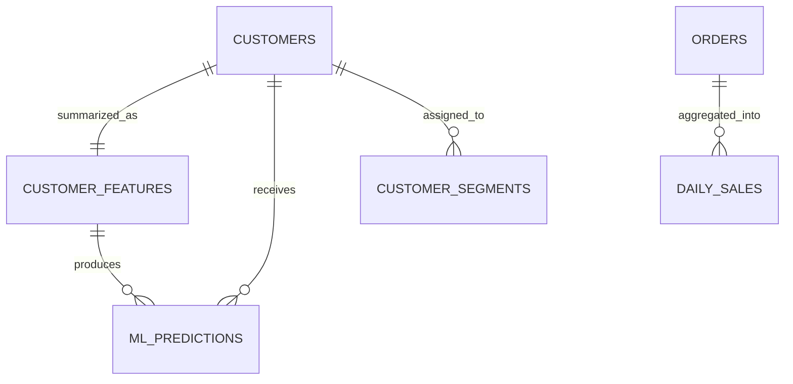

The analytical layer translates operational data into decision-support assets.

---

### 11.3 Governance Entities

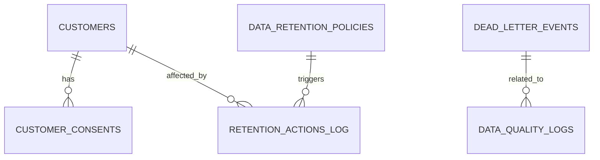

The governance model connects data usage, retention and quality to auditable records.

---

## 12. Main Tables and Domains

### 12.1 Customer Domain

| Table | Schema | Purpose |
|---|---|---|
| `customers` | `core` | Customer master records |
| `customer_consents` | `governance` | Consent history and consent indicators |
| `customer_features` | `analytics` | Customer-level analytical features |
| `customer_segments` | `analytics` | Customer segment assignments |
| `ml_predictions` | `analytics` | Churn and CLV predictions |

---

### 12.2 Product Domain

| Table | Schema | Purpose |
|---|---|---|
| `products` | `core` | Product catalog |
| `suppliers` | `core` | Supplier data |
| `reviews` | `core` | Product and customer feedback |

---

### 12.3 Sales Domain

| Table | Schema | Purpose |
|---|---|---|
| `orders` | `core` | Customer orders |
| `order_items` | `core` | Items inside orders |
| `payments` | `core` | Payment records |
| `shipments` | `core` | Delivery data |
| `returns` | `core` | Return and refund data |
| `daily_sales` | `analytics` | Daily aggregated sales metrics |

---

### 12.4 Event Domain

| Table | Schema | Purpose |
|---|---|---|
| `events` | `raw` | Valid customer events |
| `dead_letter_events` | `governance` | Rejected events |
| `data_quality_logs` | `governance` | Quality rule failures |

---

### 12.5 Governance Domain

| Table | Schema | Purpose |
|---|---|---|
| `data_retention_policies` | `governance` | Retention rules |
| `retention_actions_log` | `governance` | Retention and anonymization audit trail |
| `customer_consents` | `governance` | Consent records |

---

## 13. Data Flow Architecture

### 13.1 Historical Data Flow

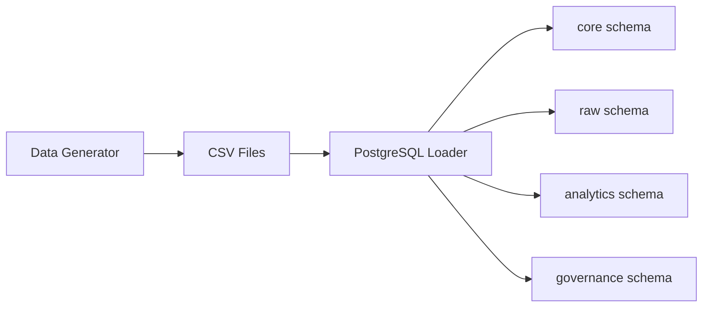

This flow initializes the platform with structured retail data.

---

### 13.2 Real-Time Event Flow

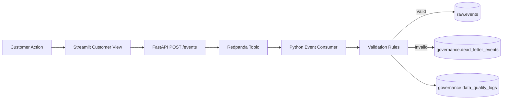

This flow captures customer events and validates them before persistence.

---

### 13.3 Analytics Flow

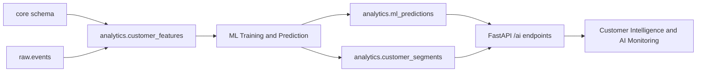

This flow turns customer and event data into AI-driven customer intelligence.

---

### 13.4 Governance Flow

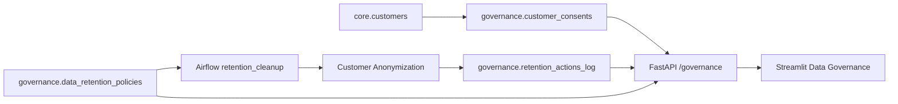

This flow shows how governance data becomes visible and auditable.

---

### 13.5 Observability Flow

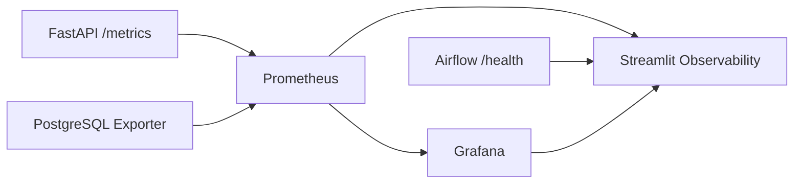

This flow monitors the operational state of the platform.

---

## 14. API Architecture

FastAPI is the central access layer for Streamlit and external clients.

```mermaid
flowchart TB
    Streamlit[Streamlit UI] --> API[FastAPI]

    API --> ProductRoutes[Product Routes]
    API --> EventRoutes[Event Routes]
    API --> QualityRoutes[Quality Routes]
    API --> GovernanceRoutes[Governance Routes]
    API --> AIRoutes[AI Routes]
    API --> MetricsRoute[/metrics]

    ProductRoutes --> DB[(PostgreSQL)]
    EventRoutes --> Redpanda[Redpanda]
    QualityRoutes --> DB
    GovernanceRoutes --> DB
    AIRoutes --> DB
    AIRoutes --> Reports[ML Report Files]
    MetricsRoute --> Prometheus[Prometheus]
```

Main endpoint groups:

| Endpoint group | Purpose |
|---|---|
| `/products` | Product catalog and product details |
| `/events` | Event publishing and recent events |
| `/quality` | Dead letters and quality summaries |
| `/governance` | Consent, retention and auditability |
| `/ai` | Predictions, segments and ML reports |
| `/health` | API and database status |
| `/metrics` | Prometheus metrics |

---

## 15. Streamlit Architecture

Streamlit is structured as a multi-page platform.

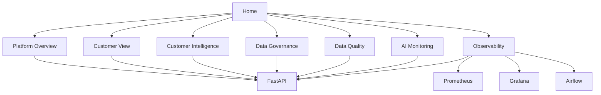

This UI architecture supports both business storytelling and technical proof.

---

## 16. Orchestration Architecture

Airflow is used to orchestrate recurring platform workflows.

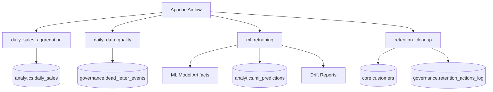

---

## 17. Airflow DAG Design

### 17.1 daily_sales_aggregation

I implemented the `daily_sales_aggregation` DAG to refresh daily sales indicators.

The DAG:

- reads orders and returns;
- computes daily revenue;
- computes average order value;
- counts returns;
- updates `analytics.daily_sales`;
- validates that the aggregate table contains rows.

This DAG supports the analytics layer.

---

### 17.2 daily_data_quality

I implemented the `daily_data_quality` DAG to verify platform quality signals.

The DAG:

- checks PostgreSQL connectivity;
- counts records in `governance.dead_letter_events`;
- provides a scheduled data quality control point.

This DAG supports the quality monitoring strategy.

---

### 17.3 ml_retraining

I implemented the `ml_retraining` DAG to orchestrate the ML lifecycle.

It runs:

1. churn model training;
2. segmentation model training;
3. CLV model training;
4. prediction refresh;
5. lightweight drift evaluation.

The dependency structure is:

```text
[train_churn, train_segmentation, train_clv]
→ refresh_predictions
→ evaluate_drift
```

This DAG supports the MLOps architecture.

---

### 17.4 retention_cleanup

I implemented the `retention_cleanup` DAG to support governance and GDPR-aligned retention.

The DAG:

- identifies expired customer records based on retention policy `ret_001`;
- anonymizes personal attributes;
- disables marketing, analytics and personalization consent flags;
- updates the customer status;
- inserts an audit record into `governance.retention_actions_log`.

This DAG is a central proof that governance policies are operationalized.

---

## 18. Machine Learning Architecture

The ML architecture is integrated with the data platform.

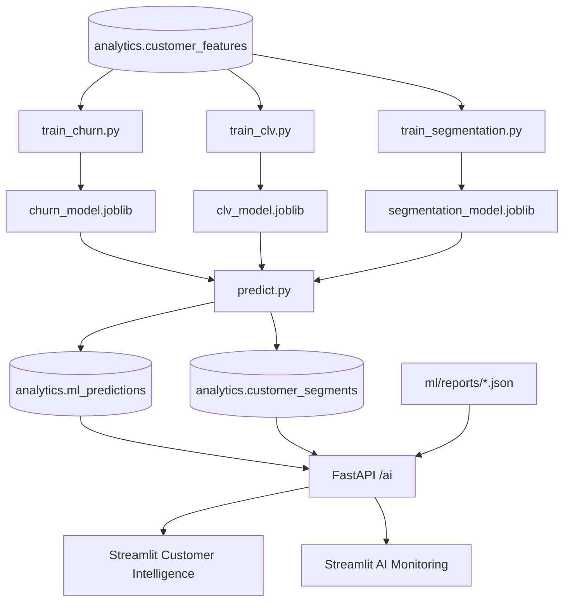

ML is not isolated in notebooks.

It is integrated into:

- storage;
- orchestration;
- API serving;
- monitoring;
- business dashboards.

---

## 19. Observability Architecture

RetailFlow includes service and database observability.

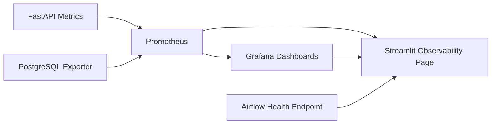

Main monitoring assets:

| Asset | Purpose |
|---|---|
| `/metrics` | FastAPI Prometheus metrics |
| `pg_up` | PostgreSQL availability metric |
| Prometheus targets | Service scrape status |
| Grafana dashboard | Visual platform monitoring |
| Alert rules documentation | Operational alert definitions |
| Streamlit Observability | Consolidated health view |

---

## 20. Monitoring and Alerting

The architecture includes documented alerting rules.

Main alert categories:

| Alert | Purpose |
|---|---|
| FastAPI Down | Detect API unavailability |
| PostgreSQL Down | Detect database unavailability |
| High API Error Rate | Detect server-side API errors |
| High API Latency | Detect performance degradation |
| Drift Detected | Connect ML monitoring to operational alerting |

These alerts show a production-oriented approach to platform operations.

---

## 21. CI/CD Architecture

I implemented GitHub Actions as the CI/CD automation layer.

The CI/CD pipeline is designed to validate the platform before changes are integrated.

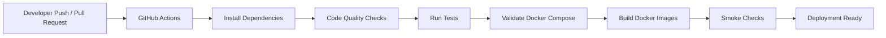

The pipeline supports:

- Python dependency setup;
- unit tests;
- API tests;
- ML tests;
- data quality tests;
- Docker Compose validation;
- container build validation;
- smoke checks.

This CI/CD design ensures that the platform is not only functional locally but also validated automatically before release.

---

## 22. Infrastructure as Code Approach

RetailFlow uses Docker Compose as the main infrastructure definition.

The infrastructure is described through:

- `docker-compose.yml`;
- Dockerfiles for FastAPI, Streamlit and consumer services;
- Prometheus configuration;
- Grafana provisioning;
- Airflow DAG definitions;
- database initialization scripts;
- GitHub Actions workflows.

Future infrastructure expansion can include:

- Kubernetes manifests;
- Terraform modules;
- cloud-managed services;
- secrets management;
- cloud monitoring integrations.

---

## 23. Cloud Target Architecture

The current platform is local and containerized.

However, the architecture can evolve toward a cloud deployment.

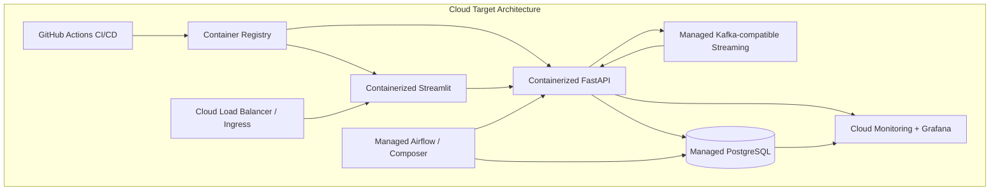

Potential migration strategy:

1. container registry integration;
2. managed PostgreSQL;
3. managed streaming;
4. deployed API and UI services;
5. managed Airflow;
6. cloud-native monitoring;
7. enterprise IAM and SSO;
8. multi-region deployment.

---

## 24. Kubernetes Roadmap

The `/k8s` folder is part of the future deployment roadmap.

Kubernetes can be used to deploy:

- FastAPI deployment;
- Streamlit deployment;
- event consumer deployment;
- service manifests;
- ConfigMaps;
- Secrets;
- Ingress;
- horizontal scaling rules.

Future Kubernetes architecture:

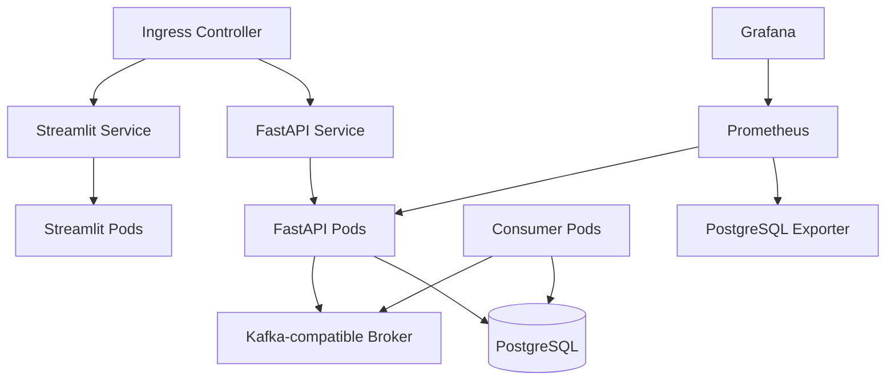

Kubernetes is not the primary runtime for the current stable version.

It is part of the scalability and production-readiness roadmap.

---

## 25. Security Architecture

RetailFlow includes several security-oriented design decisions.

Current controls:

| Control | Description |
|---|---|
| Environment variables | Configuration separated from code |
| Docker network isolation | Services communicate inside a controlled network |
| Consent-based analytics | Customer intelligence can be filtered by analytics consent |
| Retention and anonymization | Personal attributes can be anonymized through Airflow |
| Audit logs | Retention actions are logged |
| Dead-letter isolation | Invalid data is isolated from trusted tables |
| Observability | Service health is monitored |

Future security controls:

- API authentication;
- role-based access control;
- enterprise IAM;
- SSO;
- secrets management;
- encryption policy;
- audit logging for API access;
- network segmentation;
- vulnerability scanning.

---

## 26. Data Governance Integration

Data architecture and governance are tightly connected.

Governance is not external to the architecture.

It is implemented through:

- governance schema;
- consent data;
- retention policies;
- anonymization workflow;
- retention logs;
- data quality logs;
- dead-letter tables;
- governed customer intelligence interface.

This design ensures that the architecture supports compliance and accountability.

---

## 27. Data Quality Integration

Data quality is integrated into the pipeline architecture.

```mermaid
flowchart LR
    Event[Incoming Event] --> Validator[Validation Layer]
    Validator -->|Passed| RawEvents[(raw.events)]
    Validator -->|Failed| DeadLetters[(governance.dead_letter_events)]
    Validator -->|Failed| QualityLogs[(governance.data_quality_logs)]
    DeadLetters --> DataQualityUI[Streamlit Data Quality]
    QualityLogs --> DataQualityUI
```

Invalid events are not ignored.

They are:

- rejected;
- stored;
- categorized;
- made visible;
- available for audit and debugging.

---

## 28. Architecture Trade-Offs

### 28.1 Docker Compose vs Kubernetes

I used Docker Compose as the main runtime because it provides strong local reproducibility.

| Docker Compose | Kubernetes |
|---|---|
| Easier local setup | Better production scaling |
| Lower complexity | More operational control |
| Faster iteration | Better enterprise deployment |
| Suitable for demonstration | Suitable for production clusters |

Current choice:

```text
Docker Compose for local deployment and evaluation.
```

Future path:

```text
Kubernetes for production-grade deployment.
```

---

### 28.2 PostgreSQL vs Distributed Warehouse

PostgreSQL was chosen because it is:

- reliable;
- simple to run locally;
- SQL-native;
- suitable for structured retail data;
- compatible with analytics and governance use cases.

A distributed warehouse could be considered later for larger scale.

---

### 28.3 Redpanda vs Kafka

Redpanda was chosen because it is Kafka-compatible but easier to run locally.

It preserves the streaming design pattern while reducing deployment complexity.

---

### 28.4 Streamlit vs Custom Frontend

Streamlit was chosen because it enables fast development of analytical and monitoring dashboards.

A custom frontend could be considered later for a production SaaS experience.

---

### 28.5 FastAPI vs Flask

FastAPI was chosen because it provides:

- automatic OpenAPI documentation;
- strong performance;
- modern Python typing;
- clean API structure;
- easy monitoring integration.

---

## 29. Architecture Evaluation Against Requirements

| Requirement | Architecture Response |
|---|---|
| Identify technical needs | Architecture covers streaming, storage, ML, governance and monitoring |
| Design a complete infrastructure | Docker Compose deploys all main services |
| Define data models | PostgreSQL schemas separate raw, core, analytics and governance layers |
| Design database structures | Tables support retail operations, analytics, ML and governance |
| Deploy server infrastructure | Docker Compose deploys multi-service local platform |
| Set up monitoring tools | Prometheus, Grafana and PostgreSQL exporter are integrated |
| Document architecture clearly | README and architecture documents include diagrams and explanations |
| Support observability | FastAPI metrics, DB metrics and Airflow health are visible |
| Support automation | Airflow and GitHub Actions provide workflow automation |

---

## 30. Architecture Strengths

The main strengths of the architecture are:

1. end-to-end integration;
2. clear service separation;
3. governed storage model;
4. real-time event capability;
5. ML and API integration;
6. operational observability;
7. orchestration through Airflow;
8. CI/CD through GitHub Actions;
9. strong demonstration flow;
10. future cloud and Kubernetes roadmap.

---

## 31. Architecture Limitations

The current architecture does not yet include:

- enterprise IAM;
- SSO;
- multi-region deployment;
- 24/7 production support and on-call operations;
- fully automated data lineage;
- managed cloud infrastructure;
- enterprise data catalog;
- production-grade secrets management.

These limitations are expected at the current platform stage and are addressed in the future roadmap.

---

## 32. Architecture Roadmap

### 32.1 Completed Architecture Capabilities

I have already implemented:

- Docker Compose multi-service infrastructure;
- PostgreSQL schema separation;
- Redpanda event streaming;
- FastAPI service layer;
- Python event consumer;
- Airflow orchestration;
- Streamlit dashboards;
- Prometheus metrics;
- Grafana dashboards;
- PostgreSQL exporter;
- GitHub Actions CI/CD;
- governance schema;
- AI serving layer;
- ML monitoring dashboards.

---

### 32.2 Future Improvements

Planned architecture improvements:

| Area | Improvement |
|---|---|
| Cloud deployment | Deploy services to managed cloud infrastructure |
| Kubernetes | Build production manifests and deployment strategy |
| IAM | Add enterprise authentication and authorization |
| Data catalog | Add searchable metadata and ownership catalog |
| Lineage | Add automated lineage across pipelines and transformations |
| Model registry | Add formal model versioning and promotion workflow |
| Secrets management | Move secrets to a dedicated secret manager |
| Scaling | Add horizontal scaling for API and consumer services |
| Alerting | Add notification channels and runbooks |
| Security | Add vulnerability scanning and API authorization |

---

## 33. Conclusion

I designed the RetailFlow data architecture as a coherent, modular and production-oriented platform.

The architecture connects:

```text
customer events
→ event streaming
→ validation
→ PostgreSQL storage
→ governance
→ analytics
→ machine learning
→ API serving
→ Streamlit dashboards
→ observability
```

The platform demonstrates the main capabilities expected from a modern data architecture:

- structured data modeling;
- real-time ingestion;
- governed data storage;
- AI integration;
- orchestration;
- monitoring;
- CI/CD;
- future-ready deployment planning.

The current architecture is intentionally designed for local reproducibility while remaining aligned with a future cloud and Kubernetes deployment path.

This makes RetailFlow both demonstrable and extensible.

