# Bloc 2 — RetailFlow Data Architecture Design

## Official Deliverable — Updated Version

**Project:** RetailFlow Platform  
**Document type:** Official written deliverable  
**Scope:** Data architecture, infrastructure, data model, deployment, observability, security foundations and operational readiness  
**Language:** English  
**Updated with latest implementation:** Streamlit final evidence pages, AI consent metrics, Prometheus alert rules, Grafana dashboards, CI/CD security checks, healthchecks, backup/restore scripts and readonly database role.

---

## Table of Contents

1. Executive Summary
2. Architecture Objectives
3. Business and Technical Context
4. Current Implementation Snapshot
5. High-Level Architecture
6. Design Principles
7. Runtime Infrastructure
8. Service Responsibilities
9. Network and Communication Design
10. PostgreSQL Data Architecture
11. Data Model and Domains
12. Analytical Star Schema Design
13. Data Flow Architecture
14. API Architecture
15. Streamlit Application Architecture
16. Airflow Orchestration Architecture
17. Machine Learning Integration
18. Observability and Alerting Architecture
19. CI/CD Architecture
20. Security and Privacy Architecture
21. Backup, Restore and Continuity
22. Infrastructure as Code Approach
23. Operational Runbook
24. Block 2 Competency Mapping
25. Limitations and Risk Awareness
26. Future Architecture Roadmap
27. Conclusion
28. Appendix A — Component Inventory
29. Appendix B — Main Evidence Locations

---

# 1. Executive Summary

I designed the RetailFlow Platform as an end-to-end Retail Intelligence architecture for modern e-commerce organizations.

The platform transforms customer events, operational retail data, governance controls and machine learning outputs into a governed, observable and decision-ready system.

The architecture combines:

- Docker Compose for reproducible local deployment;
- PostgreSQL as the central operational, analytical and governance database;
- Redpanda as a Kafka-compatible streaming broker;
- FastAPI as the service and event publication layer;
- a Python event consumer for validation and persistence;
- Streamlit as the guided business, governance, AI and evidence interface;
- Apache Airflow for scheduled workflows;
- Prometheus and Grafana for observability;
- PostgreSQL exporter for database metrics;
- GitHub Actions for CI/CD validation;
- security and operations controls such as healthchecks, readonly role, backup and restore scripts and automated security reports.

The architecture is not limited to a set of isolated tools. I designed it as a coherent data platform where each component has a clear responsibility and where governance, observability and AI are integrated by design.

The main architecture value chain is:

```text
Customer interaction
→ event publication
→ streaming ingestion
→ validation and quality control
→ governed PostgreSQL storage
→ analytical features
→ AI predictions and segments
→ API serving
→ Streamlit decision support
→ monitoring, CI/CD and operations
```

This document presents the architecture from both a conceptual and implementation point of view.

---

# 2. Architecture Objectives

The RetailFlow architecture was designed around the following objectives.

| Objective | Architectural Response |
|---|---|
| Build an end-to-end data platform | Docker Compose stack integrating UI, API, streaming, database, orchestration, monitoring and ML |
| Support real-time event ingestion | FastAPI event producer, Redpanda topic and Python consumer |
| Separate data concerns | PostgreSQL schemas: `raw`, `core`, `analytics`, `governance` |
| Make governance operational | Consent, retention, audit, quality logs and dead-letter tables |
| Support AI and MLOps | Feature tables, prediction tables, model reports, AI API endpoints and AI Monitoring dashboard |
| Improve reliability | Docker healthchecks, Prometheus targets, alert rules and documented operations |
| Support security foundations | readonly database role, environment configuration example, security CI reports |
| Support maintainability | modular codebase, CI/CD validation, documentation and evidence matrix |
| Prepare future production evolution | cloud and Kubernetes roadmap, monitoring roadmap and access-control roadmap |

The goal is to demonstrate a realistic architecture that is understandable, maintainable and defendable during the master thesis evaluation.

---

# 3. Business and Technical Context

RetailFlow is a Retail Intelligence platform designed for a multi-category e-commerce organization.

The platform must handle multiple types of information:

- customer profiles;
- product catalog data;
- browsing sessions;
- product view events;
- cart and checkout events;
- orders, payments, shipments and returns;
- reviews and support tickets;
- consent indicators;
- data quality evidence;
- ML features, predictions and segments;
- monitoring and operational metrics.

The architecture supports business questions such as:

- Which customers are likely to churn?
- Which customers have high future value?
- Which customer segments require differentiated actions?
- Are customer events being ingested correctly?
- Are invalid events isolated and traceable?
- Are customer intelligence outputs aligned with analytics consent?
- Are the platform services healthy?
- Are the models monitored and retrainable?

From a technical point of view, the platform demonstrates:

- event-driven ingestion;
- relational data modeling;
- governance by design;
- ML serving;
- observability;
- CI/CD;
- operational documentation;
- reproducible deployment.

---

# 4. Current Implementation Snapshot

The latest implementation includes the following major components.

| Area | Current implementation |
|---|---|
| Runtime | Docker Compose local multi-service platform |
| Database | PostgreSQL with `raw`, `core`, `analytics`, `governance` schemas |
| Streaming | Redpanda topic `retailflow_events` |
| API | FastAPI endpoints for products, events, quality, governance, AI, health and metrics |
| Consumer | Python consumer with validation and dead-letter persistence |
| UI | Streamlit 10-page guided platform |
| Orchestration | Airflow DAGs for sales aggregation, data quality, ML retraining and retention cleanup |
| Monitoring | Prometheus targets, Grafana dashboards and Streamlit Observability page |
| Alerting | Prometheus alert rules for API, PostgreSQL exporter, latency, error rate and DB connections |
| CI/CD | GitHub Actions with tests, compile checks, Docker validation and security reports |
| Security foundation | readonly PostgreSQL role, environment example, dependency audit and static security checks |
| Continuity | PostgreSQL backup and restore scripts |
| Evidence | Project Evidence page with final evidence matrix and Skills evidence matrix |

The latest Streamlit structure is:

| Page | Purpose |
|---|---|
| `1_Platform_Overview.py` | Global architecture and platform entry point |
| `2_Customer_View.py` | Customer event demo and event generation |
| `3_Customer_Intelligence.py` | Governed AI decision support and consent-aware customer intelligence |
| `4_Data_Governance.py` | Governance operating model, consent, retention, risks and policies |
| `5_Data_Architecture.py` | Architecture evidence and technical mapping |
| `6_Data_Quality.py` | Dead-letter events, quality rules and remediation workflow |
| `7_AI_Monitoring.py` | Model registry, reports, drift, retraining and consent-aware AI metrics |
| `8_Observability.py` | Prometheus, Grafana, targets, alerts and platform health |
| `9_CI_CD_and_Operations.py` | CI/CD, operations, backup, restore and security evidence |
| `10_Project_Evidence.py` | Final evidence matrix and Skills evidence matrix |

---

# 5. High-Level Architecture

RetailFlow follows a layered platform architecture.

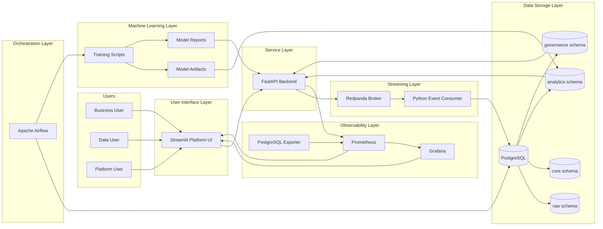

The design separates:

- user interaction;
- service access;
- streaming transport;
- persistence;
- orchestration;
- AI lifecycle;
- monitoring;
- evidence and documentation.

---

# 6. Design Principles

## 6.1 Modularity

Each component has a dedicated responsibility.

| Component | Main responsibility |
|---|---|
| Streamlit | Guided interface and proof dashboard |
| FastAPI | Backend service, API contract and event producer |
| Redpanda | Event broker |
| Event consumer | Event validation and persistence |
| PostgreSQL | Central database |
| Airflow | Scheduled workflows |
| ML scripts | Training, prediction, drift and model registry generation |
| Prometheus | Metrics collection |
| Grafana | Metrics visualization |
| GitHub Actions | Continuous validation |

This modularity improves explainability and maintainability.

## 6.2 Separation of Concerns

The platform separates UI, API, streaming, storage, governance, analytics, ML and monitoring concerns.

For example:

- Streamlit does not write live events directly into `raw.events`;
- FastAPI publishes events to Redpanda;
- the consumer validates events before database insertion;
- governance evidence is stored in dedicated governance tables;
- AI predictions are stored in analytics tables and served through API endpoints;
- monitoring is handled by Prometheus and Grafana rather than by business pages only.

## 6.3 Governance by Design

Governance is embedded in the architecture through:

- consent fields;
- retention policies;
- retention action logs;
- anonymization workflow;
- dead-letter events;
- quality logs;
- AI consent controls;
- governance dashboards.

## 6.4 Observability by Design

Observability is embedded through:

- service healthchecks;
- FastAPI `/metrics`;
- PostgreSQL exporter metrics;
- Prometheus targets;
- Grafana dashboards;
- alert rules;
- Streamlit Observability page.

## 6.5 Local Reproducibility

Docker Compose is used as the main runtime.

This allows the complete project to be launched and evaluated consistently on a local machine.

## 6.6 Future-Ready Deployment

The current runtime is local, but the architecture can evolve toward:

- Kubernetes;
- managed PostgreSQL;
- managed Kafka-compatible broker;
- container registry;
- managed Airflow;
- cloud monitoring;
- IAM and SSO;
- production secrets management.

---

# 7. Runtime Infrastructure

The Docker Compose runtime contains the following services.

| Service | Container name | Role |
|---|---|---|
| PostgreSQL | `retailflow_postgres` | Main database |
| pgAdmin | `retailflow_pgadmin` | Database administration |
| Redpanda | `retailflow_redpanda` | Kafka-compatible broker |
| FastAPI | `retailflow_fastapi` | Backend service layer |
| Event consumer | `retailflow_event_consumer` | Streaming ingestion and validation |
| Streamlit | `retailflow_streamlit` | Platform UI |
| Airflow webserver | `retailflow_airflow_webserver` | Airflow UI |
| Airflow scheduler | `retailflow_airflow_scheduler` | DAG scheduler |
| Airflow PostgreSQL | `retailflow_airflow_postgres` | Airflow metadata database |
| Prometheus | `retailflow_prometheus` | Metrics collection |
| Grafana | `retailflow_grafana` | Dashboards |
| PostgreSQL exporter | `retailflow_postgres_exporter` | Database metrics exporter |

The platform is started with:

```bash
docker compose up -d
```

The Streamlit and FastAPI images are buildable from their Dockerfiles, and the event consumer has its own Dockerfile.

---

# 8. Service Responsibilities

## 8.1 PostgreSQL

PostgreSQL is the central database of RetailFlow.

It stores:

- raw events;
- clean business entities;
- analytical features;
- ML predictions;
- customer segments;
- retention policies;
- retention action logs;
- quality logs;
- dead-letter events.

## 8.2 pgAdmin

pgAdmin provides a visual database administration interface.

It is useful for demonstrating:

- schemas;
- tables;
- records;
- dead-letter evidence;
- retention logs;
- AI prediction records.

## 8.3 Redpanda

Redpanda provides the streaming layer.

It receives customer events from FastAPI and exposes them to the event consumer.

## 8.4 FastAPI

FastAPI exposes service endpoints for:

- product data;
- customer events;
- recent events;
- quality summaries;
- governance summaries;
- AI predictions;
- model reports;
- health checks;
- Prometheus metrics.

## 8.5 Event Consumer

The consumer reads from Redpanda and applies validation rules.

It persists:

- valid events into `raw.events`;
- invalid events into `governance.dead_letter_events`;
- quality failures into `governance.data_quality_logs`.

## 8.6 Streamlit

Streamlit is the main guided demonstration interface.

It exposes business, technical and academic evidence in a structured way.

## 8.7 Airflow

Airflow orchestrates recurring workflows:

- daily sales aggregation;
- daily data quality checks;
- weekly ML retraining;
- retention cleanup.

## 8.8 Prometheus and Grafana

Prometheus collects metrics, while Grafana visualizes platform health.

The Observability page links these tools and summarizes their evidence.

## 8.9 GitHub Actions

GitHub Actions validates code, tests, Docker configuration, Docker builds and security checks.

This makes the architecture maintainable and safer to evolve.

---

# 9. Network and Communication Design

Services communicate through the Docker Compose network using service names.

| From | To | Internal endpoint |
|---|---|---|
| Streamlit | FastAPI | `http://fastapi:8000` |
| FastAPI | PostgreSQL | `postgres:5432` |
| FastAPI | Redpanda | `redpanda:9092` |
| Consumer | Redpanda | `redpanda:9092` |
| Consumer | PostgreSQL | `postgres:5432` |
| Airflow | PostgreSQL | `postgres:5432` |
| Prometheus | FastAPI | `fastapi:8000/metrics` |
| Prometheus | PostgreSQL exporter | `postgres_exporter:9187/metrics` |
| Grafana | Prometheus | `prometheus:9090` |

External access is available through localhost ports.

| Component | Local URL |
|---|---|
| Streamlit | `http://localhost:8501` |
| FastAPI Docs | `http://localhost:8000/docs` |
| PostgreSQL | `localhost:5432` |
| pgAdmin | `http://localhost:5050` |
| Airflow | `http://localhost:8080` |
| Prometheus | `http://localhost:9090` |
| Grafana | `http://localhost:3000` |
| PostgreSQL exporter | `http://localhost:9187/metrics` |

This network design keeps internal service communication stable while allowing the evaluator to access tools through a browser.

---

# 10. PostgreSQL Data Architecture

PostgreSQL is organized into four main schemas.

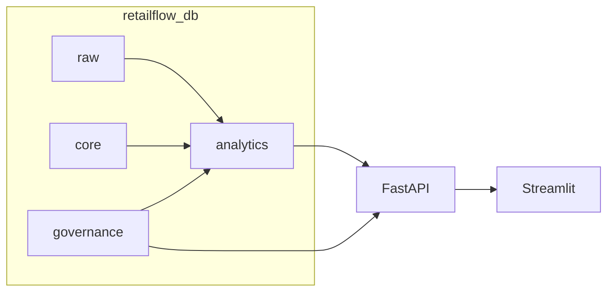

| Schema | Purpose |
|---|---|
| `raw` | Ingested event-level data |
| `core` | Clean business entities |
| `analytics` | Derived features, aggregates, predictions and segments |
| `governance` | Consent, retention, quality, dead-letter and audit records |

This separation is important because it avoids mixing raw ingestion, trusted operational data, analytical outputs and governance evidence.

---

# 11. Data Model and Domains

RetailFlow is organized around business and technical domains.

| Domain | Main tables | Purpose |
|---|---|---|
| Customer | `core.customers`, `governance.customer_consents` | Customer identity, account state and consent context |
| Product | `core.products`, `core.suppliers` | Product catalog and supplier reference |
| Commerce | `core.orders`, `core.order_items`, `core.payments`, `core.shipments`, `core.returns` | Transaction lifecycle |
| Interaction | `raw.events`, `core.sessions`, `core.reviews`, `core.support_tickets` | Behavior and experience signals |
| Analytics | `analytics.customer_features`, `analytics.daily_sales` | BI and ML-ready indicators |
| AI | `analytics.ml_predictions`, `analytics.customer_segments` | Customer intelligence outputs |
| Governance | `governance.data_retention_policies`, `governance.retention_actions_log`, `governance.dead_letter_events`, `governance.data_quality_logs` | Compliance, audit and quality evidence |

## 11.1 Main Relationships

| Relationship | Meaning |
|---|---|
| `customers → orders` | A customer can place multiple orders |
| `orders → order_items` | An order contains one or more products |
| `products → order_items` | A product can be sold in many order lines |
| `customers → sessions` | A customer can generate multiple browsing sessions |
| `sessions → raw.events` | A session contains customer events |
| `customers → analytics.customer_features` | Features summarize customer behavior |
| `customers → analytics.ml_predictions` | Predictions are generated at customer level |
| `customers → analytics.customer_segments` | Customers are assigned to segments |
| `dead_letter_events → data_quality_logs` | Rejected events are linked to rule failures |
| `retention_policies → retention_actions_log` | Retention actions are executed under policy control |

## 11.2 Logical ERD

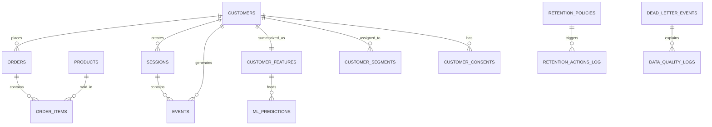

---

# 12. Analytical Star Schema Design

The relational model is normalized for consistency and governance.

On top of it, the analytical layer behaves like star schemas for reporting, dashboards and AI.

## 12.1 Sales Analytics Star Schema

| Star object | Implemented physical representation |
|---|---|
| `fact_sales` | `core.orders`, `core.order_items`, `core.payments`, `core.returns`, `analytics.daily_sales` |
| `dim_customer` | `core.customers` |
| `dim_product` | `core.products` |
| `dim_supplier` | `core.suppliers` |
| `dim_date` | derived from order timestamps and aggregation dates |
| `dim_category` | product category from `core.products` |

Supported questions:

- How does revenue evolve by day?
- Which categories generate revenue?
- Which products or customers contribute most?
- How do returns affect net revenue?

## 12.2 Customer Activity Star Schema

| Star object | Implemented physical representation |
|---|---|
| `fact_customer_activity` | `raw.events`, `core.sessions` |
| `dim_customer` | `core.customers` |
| `dim_product` | `core.products` |
| `dim_event_type` | validated event type values |
| `dim_session` | `core.sessions` |

Supported questions:

- Which event types occur most often?
- Which customers are active?
- Which products generate views or cart actions?
- Where do invalid events appear?

## 12.3 AI Predictions Star Schema

| Star object | Implemented physical representation |
|---|---|
| `fact_ai_predictions` | `analytics.ml_predictions` |
| `dim_customer` | `core.customers` |
| `dim_segment` | `analytics.customer_segments` |
| `dim_model` | model metadata and report files |
| `dim_date` | derived from prediction timestamps |

Supported questions:

- Which customers have high churn risk?
- Which customers have high predicted CLV?
- Which segments contain the most customers?
- Which model version generated the prediction?

---

# 13. Data Flow Architecture

## 13.1 Historical Data Flow

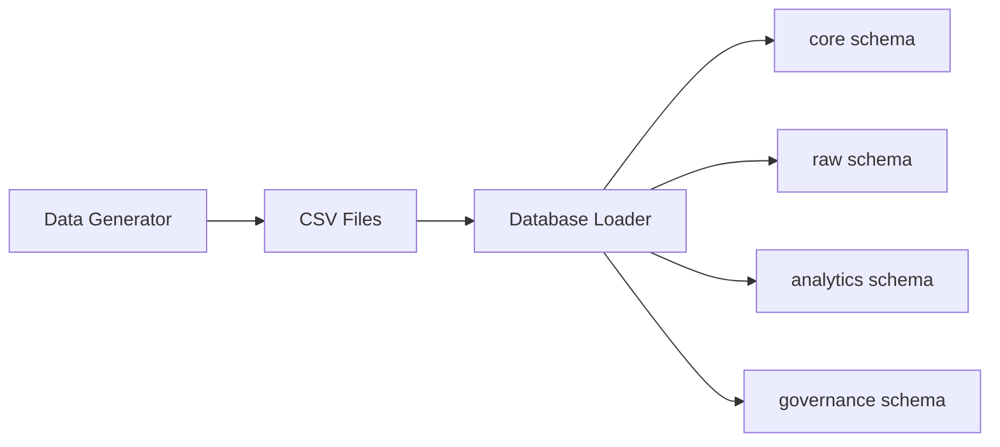

This initializes the platform with realistic e-commerce data.

## 13.2 Real-Time Event Flow

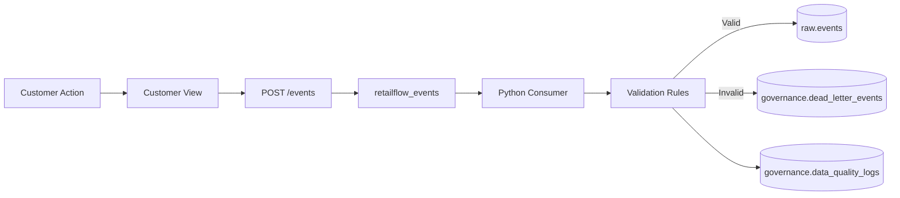

This flow shows how customer behavior becomes trusted or rejected event data.

## 13.3 Analytics and AI Flow

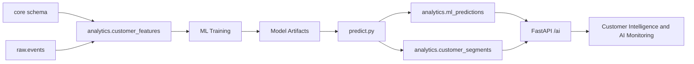

## 13.4 Governance Flow

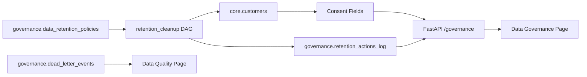

## 13.5 Observability Flow

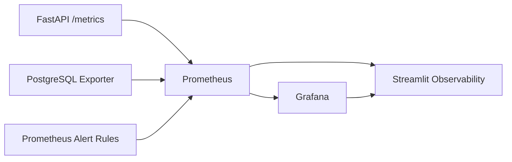

---

# 14. API Architecture

FastAPI is the central access layer between Streamlit, the database, Redpanda and monitoring tools.

```mermaid
flowchart TB
    Streamlit --> API[FastAPI]
    API --> ProductRoutes[/products]
    API --> EventRoutes[/events]
    API --> QualityRoutes[/quality]
    API --> GovernanceRoutes[/governance]
    API --> AIRoutes[/ai]
    API --> Health[/health]
    API --> Metrics[/metrics]
    EventRoutes --> Redpanda
    ProductRoutes --> PostgreSQL
    QualityRoutes --> PostgreSQL
    GovernanceRoutes --> PostgreSQL
    AIRoutes --> PostgreSQL
    AIRoutes --> Reports[ml/reports]
    Metrics --> Prometheus
```

Main endpoint groups:

| Endpoint group | Purpose |
|---|---|
| `/products` | Product catalog and product details |
| `/events` | Event publication and recent events |
| `/quality` | Dead-letter and quality summaries |
| `/governance` | Consent, retention and governance summaries |
| `/ai` | Predictions, segments, customer profiles and model reports |
| `/health` | Service and database status |
| `/metrics` | Prometheus-compatible metrics |

The AI endpoints support consent-aware customer exploration through parameters such as `analytics_consent_only`.

---

# 15. Streamlit Application Architecture

Streamlit is structured as a multi-page product interface and evidence layer.

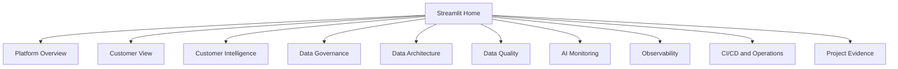

The latest UI improvements include:

- block badges on pages;
- shared UI components in `streamlit_app/components.py`;
- business-friendly proof cards;
- technical evidence expanders;
- academic mapping tables;
- final Project Evidence matrix;
- Skills evidence matrix;
- consent-aware AI display logic;
- Streamlit pages aligned with the four competency blocks.

## 15.1 Customer Intelligence Consent Logic

The Customer Intelligence page uses analytics consent as an architectural governance boundary.

If a customer does not have analytics consent, the page displays a governance message and hides:

- churn prediction;
- CLV prediction;
- segmentation output;
- AI recommendations;
- raw AI profile.

This demonstrates that architecture and governance are connected in the application layer.

## 15.2 AI Monitoring Consent Metric

The AI Monitoring page uses `analytics_consent_count` as the visible count for AI-authorized customers and prediction availability.

This prevents confusion between raw technical prediction rows and authorized visible AI outputs.

## 15.3 Project Evidence Architecture

The Project Evidence page provides:

- a final evidence matrix by block;
- a Skills evidence matrix by competency ID;
- tool map;
- live demo path;
- academic mapping;
- technical evidence inventory.

This page acts as the final presentation layer for the architecture work.

---

# 16. Airflow Orchestration Architecture

Airflow orchestrates recurring data and MLOps workflows.

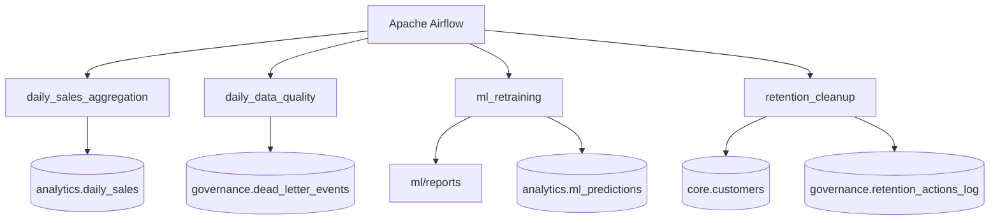

| DAG | Purpose |
|---|---|
| `daily_sales_aggregation` | Refreshes analytical sales aggregates |
| `daily_data_quality` | Checks data quality and dead-letter signals |
| `ml_retraining` | Retrains models, refreshes predictions and evaluates drift |
| `retention_cleanup` | Applies retention and anonymization logic |

Airflow provides scheduling, operational visibility and repeatability.

---

# 17. Machine Learning Integration

The ML layer is integrated into the data architecture rather than being isolated in notebooks.

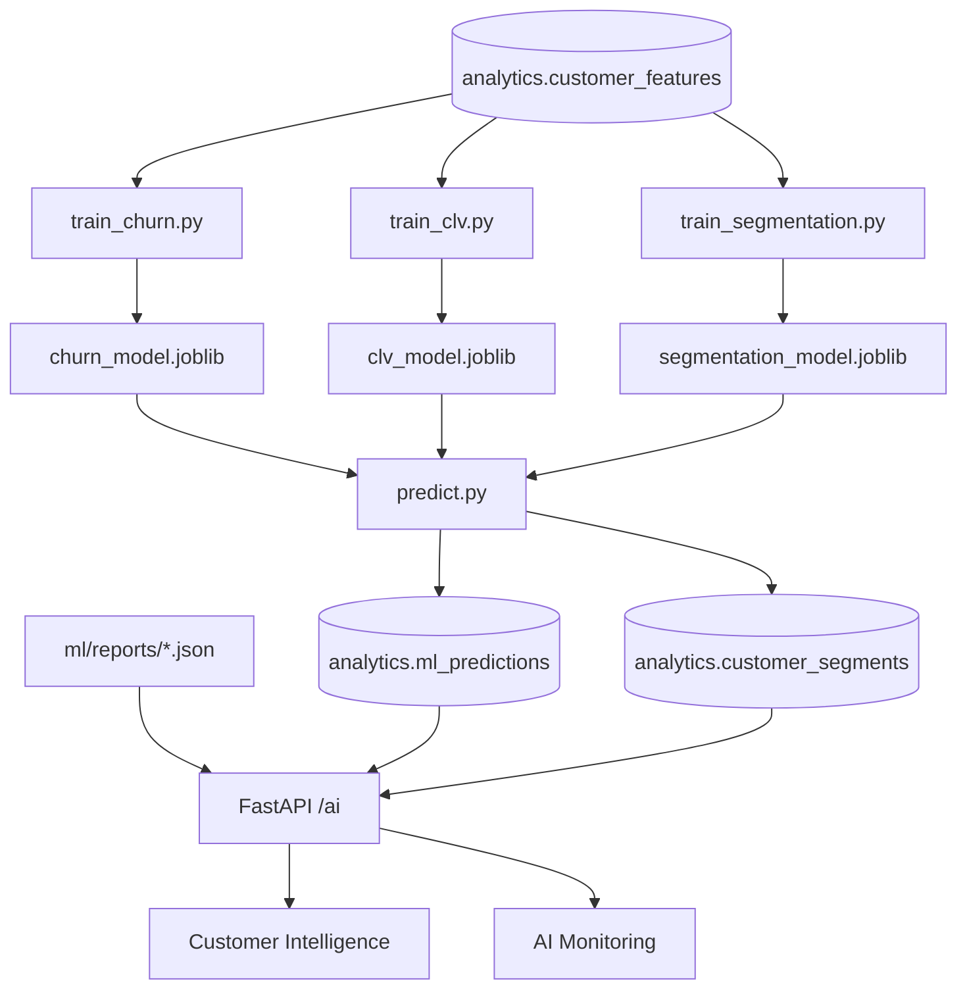

Implemented AI use cases:

| Use case | Output | Storage |
|---|---|---|
| Churn prediction | churn probability and risk label | `analytics.ml_predictions` |
| CLV prediction | predicted customer lifetime value and band | `analytics.ml_predictions` |
| Customer segmentation | business-readable segment label | `analytics.customer_segments` |

The Streamlit Dockerfile copies the `ml` directory so that model reports are available to the AI Monitoring page inside the container.

---

# 18. Observability and Alerting Architecture

RetailFlow includes operational monitoring through Prometheus, Grafana and Streamlit.

## 18.1 Monitoring Components

| Component | Role |
|---|---|
| FastAPI `/metrics` | Exposes application metrics |
| PostgreSQL exporter | Exposes database metrics |
| Prometheus | Scrapes metrics and evaluates alert rules |
| Grafana | Visualizes operational dashboards |
| Streamlit Observability | Provides a guided evidence page |

## 18.2 Grafana Dashboards

The implemented Grafana dashboards include:

- `RetailFlow API Overview`;
- `RetailFlow Platform Overview`.

These dashboards support evidence of platform monitoring and operational visibility.

## 18.3 Prometheus Alert Rules

The implemented alert rules include:

| Alert | Purpose |
|---|---|
| `RetailFlowFastAPIDown` | Detect FastAPI unavailability |
| `RetailFlowPostgresExporterDown` | Detect PostgreSQL exporter unavailability |
| `RetailFlowHighFastAPIRequestLatency` | Detect latency degradation |
| `RetailFlowFastAPIHighErrorRate` | Detect API error rate increase |
| `RetailFlowPostgresTooManyConnections` | Detect excessive PostgreSQL connections |

These rules provide production-oriented monitoring evidence.

## 18.4 Observability Evidence

The monitoring evidence is documented and visible through:

- `docs/MONITORING.md`;
- `docs/MONITORING_EVIDENCE.md`;
- Streamlit Observability page;
- Prometheus targets;
- Prometheus alerts;
- Grafana dashboards.

---

# 19. CI/CD Architecture

GitHub Actions validates the platform before changes are considered stable.

```mermaid
flowchart LR
    Push[Push / Pull Request] --> CI[GitHub Actions]
    CI --> Install[Install Dependencies]
    Install --> Compile[Python compileall]
    Compile --> Tests[Run tests]
    Tests --> Compose[Docker Compose validation]
    Compose --> Security[Security checks]
    Security --> Build[Docker image validation]
    Build --> Result[CI result]
```

## 19.1 Implemented CI/CD Capabilities

| Capability | Implementation |
|---|---|
| Python validation | `python -m compileall` |
| Test execution | `pytest` tests |
| Docker Compose validation | `docker compose config` |
| Docker image validation | FastAPI, Streamlit and consumer Docker builds |
| Security static checks | Bandit-style security scan |
| Dependency audit | pip-audit dependency report |
| Report artifacts | CI security reports stored as artifacts |
| Documentation | `docs/CI_CD.md` |

## 19.2 CI/CD Scope Boundary

The current pipeline validates code and build readiness.

It does not automatically deploy to a production Kubernetes cluster.

The current maturity is therefore:

```text
code validation
→ test validation
→ security report generation
→ container build readiness
```

The future production evolution would be:

```text
build image
→ push to registry
→ deploy to Kubernetes
→ run smoke tests
→ monitor rollout
```

---

# 20. Security and Privacy Architecture

RetailFlow includes security foundations adapted to the project scope.

## 20.1 Current Security Controls

| Control | Implementation |
|---|---|
| Database schema separation | `raw`, `core`, `analytics`, `governance` |
| Least privilege foundation | readonly PostgreSQL role |
| Environment configuration | `.env.example` |
| CI security checks | automated static and dependency checks |
| Consent-aware AI display | Customer Intelligence hides AI outputs without analytics consent |
| Retention workflow | Airflow `retention_cleanup` |
| Auditability | retention logs, dead-letter records and quality logs |
| Container separation | services isolated by Docker Compose |

## 20.2 Privacy Controls

Privacy is addressed through:

- customer consent fields;
- analytics consent count;
- consent-aware AI dashboards;
- data retention policies;
- anonymization workflow;
- audit logs;
- governance documentation;
- responsible AI principles.

## 20.3 Security Roadmap

Future security hardening should include:

- API authentication;
- RBAC in dashboards;
- secret manager integration;
- encrypted production storage;
- centralized audit logs;
- SSO;
- network policies;
- production-grade IAM.

---

# 21. Backup, Restore and Continuity

RetailFlow includes backup and restore scripts for PostgreSQL.

This supports operational continuity in a local demonstration and future production design.

## 21.1 Backup Strategy

The current backup strategy includes:

- PostgreSQL SQL backups;
- backup directory tracked with `.gitkeep` but SQL dump files ignored;
- documented backup and restore commands;
- operations documentation.

## 21.2 Continuity Controls

| Control | Current status |
|---|---|
| PostgreSQL backup script | Implemented |
| PostgreSQL restore script | Implemented |
| Docker healthchecks | Implemented for core services |
| Monitoring targets | Implemented |
| Alert rules | Implemented |
| Full HA / failover cluster | Future improvement |

This is realistic for the current local platform scope.

---

# 22. Infrastructure as Code Approach

RetailFlow uses configuration files as infrastructure evidence.

| Asset | Purpose |
|---|---|
| `docker-compose.yml` | Main local runtime definition |
| `api/Dockerfile` | FastAPI container build |
| `streamlit_app/Dockerfile` | Streamlit container build |
| `pipeline/consumer/Dockerfile` | Event consumer build |
| `monitoring/prometheus/` | Prometheus configuration and alert rules |
| `monitoring/grafana/` | Grafana provisioning and dashboards |
| `database/init/` | PostgreSQL initialization scripts |
| `airflow/dags/` | Workflow definitions |
| `.github/workflows/` | CI/CD workflows |
| `docs/` | Operations, monitoring and CI/CD documentation |

This approach makes the platform reproducible, reviewable and version-controlled.

---

# 23. Operational Runbook

## 23.1 Start the Platform

```bash
docker compose up -d
```

## 23.2 Rebuild Streamlit After UI Changes

```bash
docker compose up -d --build streamlit
```

## 23.3 Check Core Services

```bash
docker compose ps
```

## 23.4 Check FastAPI Health

```bash
curl -i http://localhost:8000/health
```

## 23.5 Check Streamlit Health

```bash
curl -i http://localhost:8501/_stcore/health
```

## 23.6 Check Prometheus Targets

Open:

```text
http://localhost:9090/targets
```

## 23.7 Check Prometheus Alerts

Open:

```text
http://localhost:9090/alerts
```

## 23.8 Check Grafana

Open:

```text
http://localhost:3000
```

Dashboards:

```text
RetailFlow API Overview
RetailFlow Platform Overview
```

## 23.9 Check Airflow

Open:

```text
http://localhost:8080
```

Main DAGs:

```text
daily_sales_aggregation
daily_data_quality
ml_retraining
retention_cleanup
```

## 23.10 Check Git Status

```bash
git status
git log --oneline -5
```

---

# 24. Block 2 Competency Mapping

| Competency Area | RetailFlow Evidence |
|---|---|
| Architecture adapted to project requirements | Modular platform covering e-commerce events, governance, analytics, AI and monitoring |
| Flexibility | Docker Compose services separated by responsibility and API-based integration |
| Volume, variety and velocity | Redpanda event flow, PostgreSQL schemas, JSON payloads, ML reports and monitoring metrics |
| Reliability and availability | healthchecks, backup/restore, Prometheus targets, alert rules and Grafana dashboards |
| Scalability | broker/consumer/API separation, future partitioning and Kubernetes roadmap |
| Continuity | backup/restore scripts and operations documentation |
| Security and privacy | readonly DB role, consent-aware AI views, retention policies and CI security reports |
| GDPR alignment | consent, retention, anonymization and auditability integrated into schemas and workflows |
| Documentation | README, operations docs, monitoring docs, CI/CD docs and Streamlit evidence pages |
| Code quality | modular repository, tests, compileall and GitHub Actions CI |

---

# 25. Limitations and Risk Awareness

The current architecture is strong for a master thesis demonstrator, but it is not a fully production-hardened enterprise platform.

| Limitation | Explanation | Future improvement |
|---|---|---|
| Local runtime | Docker Compose is the primary runtime | Kubernetes or cloud deployment |
| No enterprise IAM | Authentication and authorization are not fully implemented | SSO, RBAC, API auth |
| No full HA database cluster | PostgreSQL runs as a local service | managed PostgreSQL, replicas, failover |
| Limited broker monitoring | Basic service observability exists | broker metrics, consumer lag dashboards |
| No fully automated DLQ replay | Dead-letter evidence exists | controlled replay workflow |
| Limited production deployment automation | CI validates builds but does not deploy to cloud | registry push and Kubernetes rollout |
| Lightweight ML monitoring | Drift report exists | advanced model monitoring and alerting |

These limitations are explicitly identified because the objective is to demonstrate architecture design, implementation and risk awareness, not to overclaim enterprise production maturity.

---

# 26. Future Architecture Roadmap

## 26.1 Short-Term Improvements

| Improvement | Value |
|---|---|
| Add API authentication | Protect endpoints |
| Add Streamlit smoke tests | Improve CI coverage for dashboards |
| Add broker metrics | Monitor topic throughput and consumer lag |
| Expand PostgreSQL indexes | Improve query performance |
| Add more integration tests | Strengthen regression protection |

## 26.2 Medium-Term Improvements

| Improvement | Value |
|---|---|
| Add RBAC | Control access by role |
| Add data catalog | Improve discoverability and lineage |
| Add dbt layer | Improve SQL transformations and documentation |
| Add model registry | Improve ML lifecycle governance |
| Add automated DLQ replay | Improve data quality operations |

## 26.3 Long-Term Improvements

| Improvement | Value |
|---|---|
| Kubernetes deployment | Production-grade orchestration |
| Cloud-managed PostgreSQL | Reliability and scalability |
| Managed Kafka-compatible broker | Operational resilience |
| Managed Airflow | Scalable orchestration |
| Enterprise IAM / SSO | Security and user governance |
| Advanced observability | Alert routing, SLOs and incident management |

---

# 27. Conclusion

The RetailFlow data architecture demonstrates a coherent and integrated platform for retail intelligence.

It combines:

- real-time event ingestion;
- relational data modeling;
- governance by design;
- analytical data preparation;
- AI integration;
- API serving;
- Streamlit dashboards;
- Airflow orchestration;
- Prometheus and Grafana observability;
- CI/CD automation;
- operational documentation;
- security and continuity foundations.

The architecture is realistic because it includes both implemented capabilities and honest boundaries.

It is not presented as a fully production-hardened enterprise system.

It is presented as a complete, reproducible, observable and governed platform demonstrator with a clear path toward production maturity.

---

# Appendix A — Component Inventory

| Component | Path or Location | Role |
|---|---|---|
| Docker Compose | `docker-compose.yml` | Local multi-service runtime |
| FastAPI app | `api/app/` | Backend service layer |
| FastAPI Dockerfile | `api/Dockerfile` | API image build |
| Streamlit app | `streamlit_app/` | Platform UI |
| Streamlit Dockerfile | `streamlit_app/Dockerfile` | Streamlit image build |
| Event consumer | `pipeline/consumer/` | Redpanda consumer and validation |
| Consumer Dockerfile | `pipeline/consumer/Dockerfile` | Consumer image build |
| Database scripts | `database/init/` | PostgreSQL schemas and seed logic |
| Airflow DAGs | `airflow/dags/` | Scheduled workflows |
| ML scripts | `ml/src/` | Training, prediction and drift |
| ML reports | `ml/reports/` | Model reports and monitoring evidence |
| Model registry | `ml/model_registry.json` | Model metadata evidence |
| Prometheus config | `monitoring/prometheus/` | Metrics and alert rules |
| Grafana dashboards | `monitoring/grafana/` | Operational dashboards |
| CI workflow | `.github/workflows/` | GitHub Actions validation |
| Operations docs | `docs/INFRA_OPERATIONS.md` | Infrastructure operations |
| Monitoring docs | `docs/MONITORING.md`, `docs/MONITORING_EVIDENCE.md` | Observability evidence |
| CI/CD docs | `docs/CI_CD.md` | CI/CD evidence |

---

# Appendix B — Main Evidence Locations

| Evidence | Where to show it |
|---|---|
| Architecture overview | Streamlit > Data Architecture |
| Service health | Docker Compose and Streamlit > Observability |
| Database schemas | pgAdmin > retailflow_db |
| Real-time events | Streamlit > Customer View and pgAdmin > raw.events |
| Dead-letter evidence | Streamlit > Data Quality and pgAdmin > governance.dead_letter_events |
| Governance controls | Streamlit > Data Governance |
| Consent-aware AI | Streamlit > Customer Intelligence |
| AI monitoring | Streamlit > AI Monitoring |
| Prometheus targets | Prometheus > Targets |
| Alert rules | Prometheus > Alerts |
| Grafana dashboards | Grafana > RetailFlow dashboards |
| Airflow DAGs | Airflow > DAGs |
| CI/CD | GitHub > Actions |
| Final proof matrix | Streamlit > Project Evidence |
| Skills evidence | Streamlit > Project Evidence > Skills evidence matrix |

