# Bloc 3 — Real-Time Data Pipelines

## RetailFlow Platform

## Real-Time Data Pipeline Design, Automation, Quality Controls and Monitoring

---

## Document Purpose

This document presents the real-time data pipeline layer that I designed and implemented for the RetailFlow Platform.

The objective of this block is to demonstrate how I built a complete data pipeline capable of ingesting customer events, validating them, storing them, monitoring their quality, isolating invalid records and connecting the resulting data to downstream analytics and machine learning workflows.

The pipeline is not presented as an isolated technical component.

It is part of the broader RetailFlow architecture.

It connects customer behavior to business intelligence, data governance, machine learning and observability.

---

## Executive Summary

RetailFlow is a Retail Intelligence platform designed to transform customer events into trusted, usable and monitored business data.

The real-time data pipeline is the operational layer that enables this transformation.

I implemented an event-driven architecture based on a Kafka-compatible broker, a Python consumer, validation rules, PostgreSQL persistence, data quality logs, dead-letter handling and Airflow orchestration.

The pipeline follows this core flow:

```text
Customer interaction
→ FastAPI event endpoint
→ Redpanda topic
→ Python event consumer
→ validation rules
→ PostgreSQL storage
→ data quality monitoring
→ downstream analytics and AI
```

The design ensures that customer events are not inserted blindly into analytical storage.

Every event is validated before persistence.

Valid events are inserted into trusted event tables.

Invalid events are isolated in a dead-letter mechanism and logged for quality analysis.

This approach supports three important objectives:

1. reliable streaming ingestion;
2. data quality by design;
3. traceability and auditability of pipeline errors.

---

## Scope of the Pipeline Block

This document covers the following areas:

| Area | Scope |
|---|---|
| Event ingestion | Customer events are generated through the RetailFlow interface and published through FastAPI. |
| Streaming transport | Events are transported through Redpanda, a Kafka-compatible streaming broker. |
| Event consumption | A Python consumer reads events from the broker. |
| Validation | Events are checked against quality and consistency rules. |
| Persistence | Valid events are stored in PostgreSQL. |
| Error isolation | Invalid events are redirected to dead-letter tables. |
| Quality monitoring | Failed rules and rejected records are made visible through quality logs and dashboards. |
| Orchestration | Airflow schedules recurring quality and analytics workflows. |
| Observability | Pipeline health is supported through application metrics, dashboards and operational checks. |

---

## Pipeline Objectives

I designed the RetailFlow pipeline around several objectives.

### Objective 1 — Capture Customer Behavior

The first objective is to capture customer actions as events.

The platform records interactions such as:

- product view;
- add to cart;
- checkout started;
- purchase completed.

These events represent the behavioral foundation of the platform.

They are used later for analytics, customer intelligence and ML-based decision support.

---

### Objective 2 — Decouple the Frontend from Persistence

The second objective is to avoid direct database writes from the user interface.

Instead of writing events directly into PostgreSQL, the platform uses an event-driven flow:

```text
Streamlit
→ FastAPI
→ Redpanda
→ Consumer
→ PostgreSQL
```

This separation improves modularity and reflects the design of modern event-based systems.

---

### Objective 3 — Validate Events Before Trusting Them

The third objective is to prevent invalid data from entering trusted analytical layers.

The consumer validates each event before insertion.

This ensures that analytical tables and ML workflows are protected from malformed or inconsistent records.

---

### Objective 4 — Isolate Invalid Events

When an event fails validation, it is not ignored.

It is redirected to a dead-letter mechanism.

This allows errors to be analyzed, corrected and audited.

---

### Objective 5 — Make Data Quality Observable

The fifth objective is to make pipeline quality measurable and visible.

Rejected events, failed rules and severity levels are exposed through the Data Quality dashboard.

This turns data quality from a hidden technical concern into an operational monitoring capability.

---

### Objective 6 — Support Downstream Analytics and AI

The pipeline is designed to feed downstream components:

- customer features;
- sales aggregations;
- churn prediction;
- CLV prediction;
- segmentation;
- monitoring dashboards.

This means that the pipeline is directly connected to the value produced by the platform.

---

## Business Context

RetailFlow is used in the context of a multi-category e-commerce retailer.

The retailer generates customer events continuously through browsing, shopping and checkout behavior.

These events must be transformed into reliable data assets.

Without a governed and monitored pipeline, several issues may appear:

- incomplete customer journeys;
- unreliable behavioral analytics;
- incorrect customer features;
- biased or degraded ML models;
- poor traceability of data errors;
- lack of confidence in dashboards.

The pipeline solves these issues by implementing validation, controlled persistence and quality monitoring.

---

## Real-Time Pipeline Architecture

The real-time pipeline is organized around five main layers:

1. event source;
2. API producer;
3. streaming broker;
4. event consumer;
5. storage and monitoring.

---

## High-Level Architecture Diagram

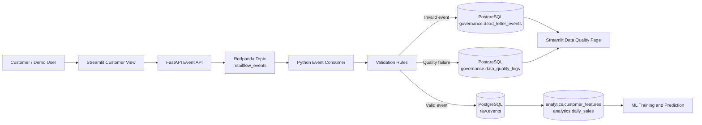

---

## Detailed Event Flow

The pipeline begins when a user interacts with the Customer View page.

The interface simulates a normal e-commerce journey.

A customer can view products, add items to the cart, start checkout and complete a purchase.

Each interaction can trigger an event.

The event is sent to FastAPI.

FastAPI publishes the event to Redpanda.

The event consumer reads the message from Redpanda and applies validation rules.

If the event is valid, it is written to PostgreSQL.

If the event is invalid, it is sent to a dead-letter table and a data quality log is created.

---

## Event Sequence Diagram

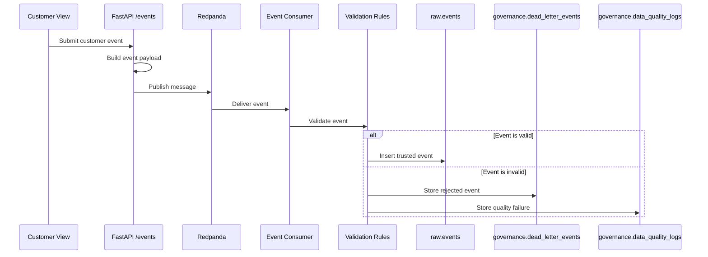

---

## Event Sources

The primary event source is the RetailFlow Customer View page.

This page simulates the customer-facing side of the platform.

The supported events include:

| Event type | Description | Business value |
|---|---|---|
| `product_view` | A customer views a product page. | Measures product interest and browsing behavior. |
| `add_to_cart` | A customer adds an item to the cart. | Captures purchase intent. |
| `checkout_started` | A customer begins checkout. | Tracks conversion funnel progress. |
| `purchase` | A customer completes an order. | Confirms conversion and business value. |

These event types cover the main stages of a basic e-commerce funnel.

---

## Event Payload Design

A RetailFlow event contains business and technical attributes.

Typical event fields include:

| Field | Description |
|---|---|
| `event_id` | Unique event identifier. |
| `customer_id` | Customer associated with the event. |
| `session_id` | Session identifier. |
| `event_type` | Type of customer interaction. |
| `product_id` | Product involved in the event, when applicable. |
| `event_timestamp` | Time of event creation. |
| `page_url` | Page or context of the interaction. |
| `raw_payload` | Additional event-specific information. |

Example event payload:

```json
{
  "event_id": "evt_live_abc123",
  "customer_id": "cust_000002",
  "session_id": "sess_demo_001",
  "event_type": "add_to_cart",
  "product_id": "prod_000001",
  "page_url": "/product/prod_000001",
  "raw_payload": {
    "cart_size": 1,
    "price_incl_tax": 129.99
  }
}
```

---

## FastAPI Event Producer

FastAPI acts as the event producer.

The event endpoint receives payloads from Streamlit and publishes them to Redpanda.

This design allows the user interface to remain lightweight.

It also centralizes event publication logic in the API layer.

---

## Producer Responsibilities

The producer layer is responsible for:

- receiving event requests;
- validating basic request structure;
- generating or forwarding event identifiers;
- publishing events to the broker;
- returning publication status to the frontend;
- supporting demo feedback messages.

---

## Producer Design Pattern

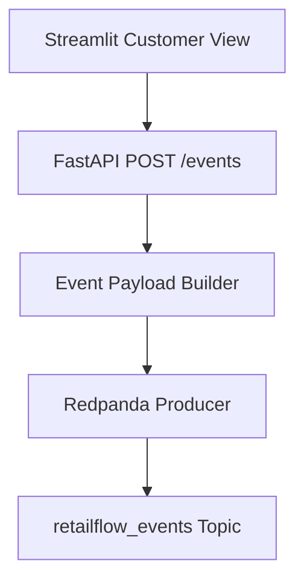

---

## Redpanda Streaming Broker

RetailFlow uses Redpanda as the streaming broker.

Redpanda is Kafka-compatible and supports standard streaming concepts such as:

- topics;
- producers;
- consumers;
- offsets;
- message retention;
- asynchronous event processing.

I selected Redpanda because it provides Kafka-compatible streaming behavior while remaining simpler to deploy locally with Docker Compose.

---

## Broker Role

The broker decouples event production from event consumption.

This means the API does not need to know exactly when or how the event will be persisted.

The broker provides a buffer between the customer-facing interaction and the persistence layer.

This is important for resilience and scalability.

---

## Topic Design

The main event topic is:

```text
retailflow_events
```

This topic receives customer behavioral events.

A future evolution could split topics by domain:

| Future topic | Purpose |
|---|---|
| `retailflow.customer_events` | Browsing and customer behavior. |
| `retailflow.order_events` | Order lifecycle events. |
| `retailflow.payment_events` | Payment status events. |
| `retailflow.support_events` | Support and service interactions. |

For the current platform, a single customer event topic is sufficient and easier to demonstrate.

---

## Event Consumer

The event consumer is implemented in Python.

Its purpose is to read messages from Redpanda and write them to PostgreSQL after validation.

The consumer is a central component of the real-time pipeline.

It transforms streamed messages into trusted database records.

---

## Consumer Responsibilities

The consumer performs the following operations:

1. connect to Redpanda;
2. subscribe to the event topic;
3. poll messages;
4. parse event payloads;
5. apply validation rules;
6. insert valid events into PostgreSQL;
7. insert invalid events into dead-letter storage;
8. create quality log records;
9. commit processing state.

---

## Consumer Processing Diagram

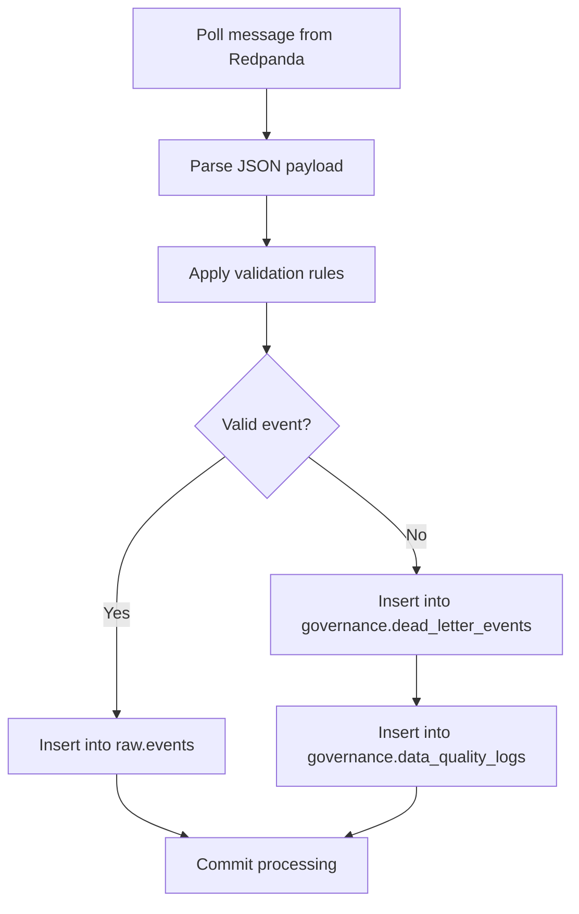

---

## Validation Layer

The validation layer is responsible for checking whether an event can be trusted.

Validation is performed before database insertion.

This protects downstream analytical layers from invalid records.

---

## Validation Principles

I designed the validation rules around five principles:

1. traceability;
2. business consistency;
3. referential integrity;
4. event type control;
5. timestamp validity.

---

## Core Validation Rules

| Rule ID | Rule name | Description | Action |
|---|---|---|---|
| R001 | `event_id_not_null` | The event must have an identifier. | Reject |
| R002 | `event_type_allowed` | The event type must belong to the authorized list. | Reject |
| R003 | `customer_exists` | The customer must exist in the customer domain. | Reject |
| R004 | `product_exists` | Product references must be valid when required. | Reject |
| R005 | `timestamp_valid` | The event timestamp must be valid and interpretable. | Reject |

---

## Why These Rules Matter

### Event identifier rule

Every event must have an identifier.

Without an event identifier, traceability becomes difficult.

This affects debugging, monitoring and auditability.

---

### Event type rule

Only supported event types should enter the platform.

This avoids polluting the event table with undefined or unexpected messages.

---

### Customer existence rule

Customer events must refer to known customers.

This protects customer-level analytics from broken joins and orphan records.

---

### Product existence rule

Product-related events must reference valid products.

This protects product analytics, funnel analytics and recommendation features.

---

### Timestamp rule

A valid timestamp is required to analyze event order, recency and temporal behavior.

Invalid timestamps can break time-based reporting and ML features.

---

## Valid Event Persistence

Valid events are inserted into PostgreSQL.

The main target is the raw event layer.

The raw layer keeps behavioral event history available for analytics and downstream processing.

---

## Trusted Event Flow

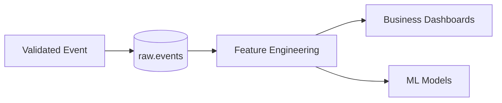

---

## Dead-Letter Handling

Dead-letter handling is used for invalid events.

A dead-letter event is an event that could not be inserted into the trusted event table because it failed one or more validation rules.

The purpose of the dead-letter mechanism is not only to reject data.

Its purpose is to preserve evidence of the failure.

---

## Dead-Letter Storage

Invalid events are stored in:

```text
governance.dead_letter_events
```

This table captures:

- original event id;
- event type;
- source topic;
- error reason;
- severity;
- raw payload;
- creation timestamp;
- reprocessing status.

---

## Dead-Letter Design

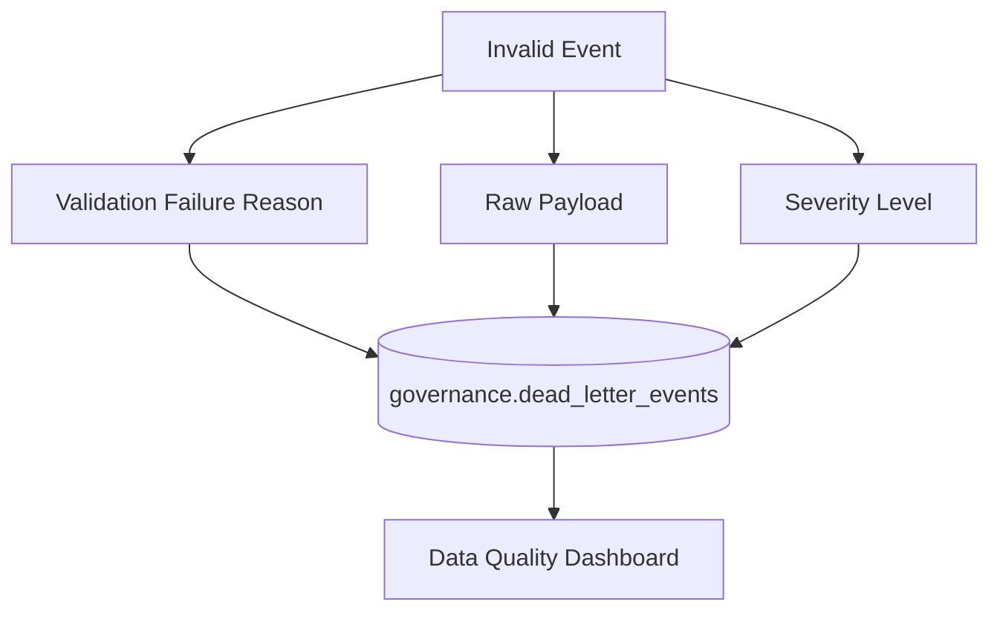

---

## Data Quality Logs

In addition to dead-letter storage, quality failures are logged in:

```text
governance.data_quality_logs
```

This creates a structured record of rule failures.

The quality log allows aggregation by:

- rule id;
- rule name;
- severity;
- source table;
- record id;
- failure status;
- error message;
- timestamp.

---

## Quality Log Purpose

The quality log supports:

- operational monitoring;
- pipeline debugging;
- auditability;
- quality KPI calculation;
- recurring issue analysis;
- governance reporting.

---

## Error Handling Strategy

The error handling strategy follows four steps:

1. detect the invalid record;
2. isolate the invalid record;
3. preserve the error context;
4. expose the error through monitoring.

This approach prevents silent failures.

---

## Error Handling Diagram

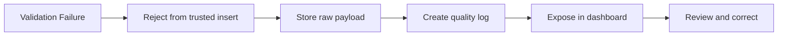

---

## Data Quality Dashboard

The Data Quality dashboard is implemented in Streamlit.

It provides a business-readable view of pipeline errors.

The page shows:

- number of dead-letter events;
- failed rules;
- high-severity errors;
- impacted event types;
- rejected event details;
- rules summary;
- error distribution by severity;
- error distribution by event type.

---

## Data Quality Dashboard Role

The dashboard answers the following question:

> How does RetailFlow detect, isolate and monitor errors in real-time data flows?

The dashboard is important because it makes pipeline quality visible.

It also connects the technical pipeline to the governance framework.

---

## Data Quality Page Flow

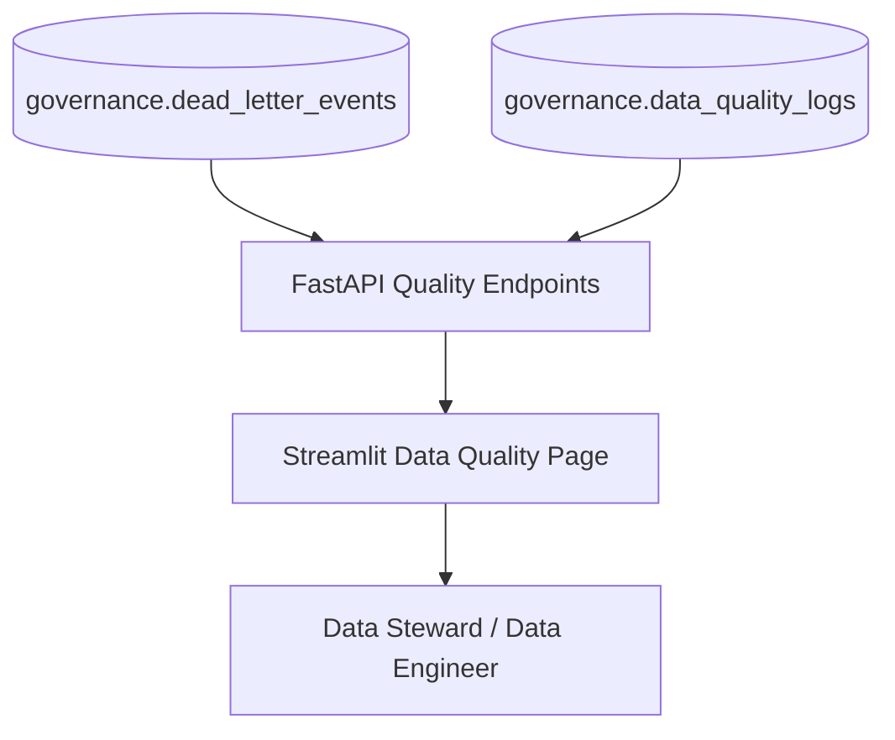

---

## Quality Endpoints

RetailFlow exposes quality data through FastAPI endpoints.

| Endpoint | Purpose |
|---|---|
| `GET /quality/dead-letters` | Returns rejected events. |
| `GET /quality/summary` | Returns quality rule summaries. |
| `GET /quality/dead-letter-summary` | Returns aggregated dead-letter statistics. |

These endpoints are consumed by the Data Quality page.

---

## Pipeline and Governance Integration

The pipeline is integrated with the governance layer.

This integration is one of the most important design choices.

Data quality failures are not only treated as technical errors.

They are treated as governance evidence.

---

## Governance Connection

The real-time pipeline contributes to governance through:

- error traceability;
- dead-letter records;
- quality logs;
- rule-based validation;
- audit-ready error context;
- dashboard visibility.

This supports accountability for data quality.

---

## Governance-Aware Pipeline Diagram

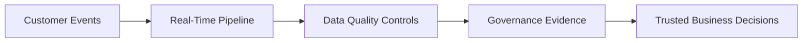

---

## Airflow Orchestration

RetailFlow uses Airflow to orchestrate recurring data workflows.

For the pipeline block, two DAGs are particularly relevant:

1. `daily_data_quality`;
2. `daily_sales_aggregation`.

These DAGs demonstrate how pipeline monitoring and analytical aggregation can be scheduled and automated.

---

## Daily Data Quality DAG

The `daily_data_quality` DAG runs every day.

Its responsibilities include:

- checking PostgreSQL connectivity;
- counting dead-letter events;
- providing a scheduled control point for pipeline quality.

This DAG supports operational monitoring of the data quality layer.

---

## Daily Data Quality DAG Diagram

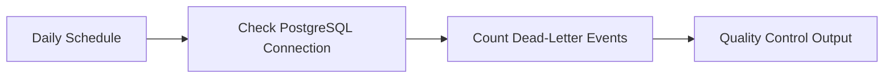

---

## Daily Sales Aggregation DAG

The `daily_sales_aggregation` DAG refreshes analytical sales aggregates.

It inserts or updates records in the `analytics.daily_sales` table.

The workflow computes:

- number of orders;
- revenue excluding tax;
- tax amount;
- revenue including tax;
- average order value;
- returns count;
- refund amount.

This DAG demonstrates scheduled transformation and analytical preparation.

---

## Daily Sales Aggregation DAG Diagram

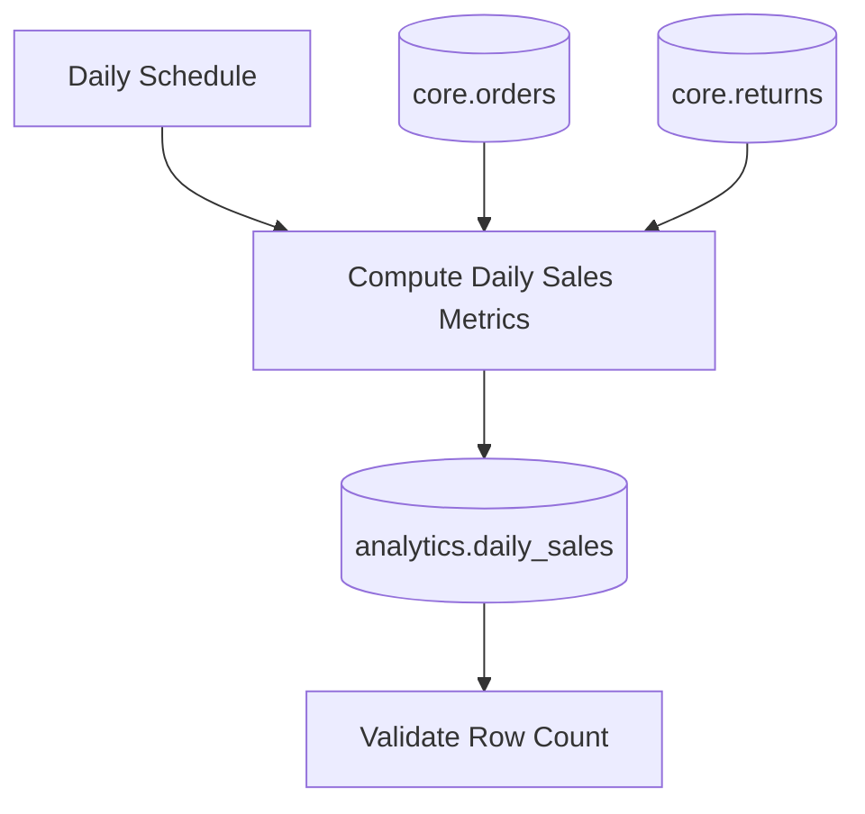

---

## Orchestration Value

Airflow adds value because it provides:

- scheduling;
- retry logic;
- workflow visibility;
- clear task dependencies;
- operational traceability;
- separation between streaming ingestion and batch controls.

---

## Streaming and Batch Complementarity

RetailFlow combines two types of data processing:

| Processing type | Role |
|---|---|
| Streaming | Handles live customer events. |
| Batch orchestration | Refreshes aggregates, quality checks and ML workflows. |

The combination is intentional.

Real-time ingestion captures behavior as it happens.

Batch jobs ensure recurring controls, aggregations and model refreshes.

---

## End-to-End Pipeline View

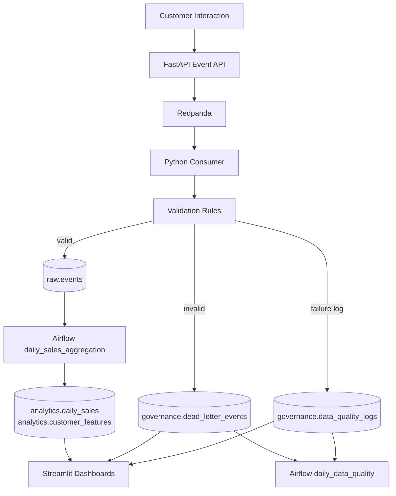

---

## Pipeline Monitoring

RetailFlow monitors the pipeline through several mechanisms:

- Streamlit Data Quality dashboard;
- FastAPI quality endpoints;
- Airflow DAG execution;
- Prometheus metrics;
- Grafana dashboards;
- container logs;
- PostgreSQL queries.

---

## Monitoring Layers

| Layer | Monitoring mechanism |
|---|---|
| API | FastAPI metrics and health endpoint. |
| Broker | Redpanda container and event flow behavior. |
| Consumer | Docker logs and persisted outputs. |
| Database | PostgreSQL exporter and SQL checks. |
| Quality | Dead-letter and quality summary endpoints. |
| Orchestration | Airflow DAG status. |
| UI | Streamlit Data Quality page. |

---

## Observability Connection

The pipeline benefits from the platform observability layer.

Prometheus and Grafana are used to monitor service-level metrics.

The Observability page exposes platform health and links to technical tools.

This means the pipeline can be evaluated from both a data quality angle and an operational angle.

---

## Pipeline KPIs

I defined several KPIs to evaluate pipeline reliability.

| KPI | Definition | Target |
|---|---|---|
| Event ingestion availability | Availability of the event API and consumer path. | > 99% in demonstration environment |
| Event validation coverage | Share of incoming events evaluated by validation rules. | 100% |
| Dead-letter rate | Share of events rejected by validation. | < 2% during normal operation |
| High-severity error count | Number of high-severity rejected events. | 0 unresolved high-severity errors |
| Quality log completeness | Share of rejected events with quality log context. | 100% |
| Data quality DAG success rate | Successful execution of scheduled quality checks. | 100% expected in stable runs |
| Sales aggregation freshness | Daily sales aggregates refreshed by schedule. | Daily |
| Event traceability | Share of persisted events with event identifier. | 100% |

---

## Data Quality Dimensions

The pipeline quality controls address several data quality dimensions.

| Dimension | Example in RetailFlow |
|---|---|
| Completeness | Required event fields must be present. |
| Validity | Event type must belong to the authorized list. |
| Consistency | Product and customer references must be coherent. |
| Timeliness | Timestamps must be valid. |
| Traceability | Every event must have an identifier. |
| Integrity | Invalid events must not enter trusted tables. |

---

## Pipeline Security Considerations

The current pipeline is designed for a controlled platform environment.

Security considerations include:

- controlled API endpoints;
- Docker network isolation;
- database schema separation;
- limited component responsibilities;
- future API authentication;
- future role-based access control;
- future secrets management improvements.

---

## Data Protection in the Pipeline

Customer events may contain identifiers and behavioral information.

Therefore, the pipeline must align with data governance principles.

Key protections include:

- limiting event payloads to useful business attributes;
- storing rejected payloads only for diagnostic purposes;
- linking customer intelligence usage to consent controls;
- connecting retention policies to customer data lifecycle.

---

## Issue Resolution Workflow

When a pipeline issue is detected, the resolution workflow is:

1. identify the failed rule;
2. inspect the dead-letter record;
3. review the raw payload;
4. determine whether the issue comes from the producer, payload or reference data;
5. correct the source if needed;
6. reprocess or archive the event depending on severity;
7. update validation rules if the issue is recurring.

---

## Issue Resolution Diagram

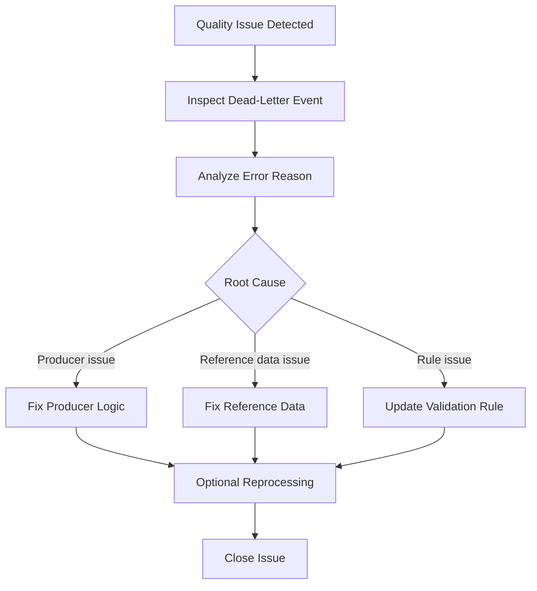

---

## Data Stewardship in the Pipeline

Pipeline quality involves both technical and business responsibilities.

| Role | Pipeline responsibility |
|---|---|
| Data Engineer | Maintains producer, consumer, validation and persistence logic. |
| Data Steward | Reviews recurring quality issues and rule definitions. |
| Data Owner | Validates business definitions and acceptable data quality thresholds. |
| Data Custodian | Operates the database, broker and infrastructure services. |
| Business User | Reports downstream anomalies visible in dashboards. |

---

## Pipeline Control Points

The pipeline includes several control points.

| Control point | Purpose |
|---|---|
| FastAPI request validation | Prevent malformed API requests. |
| Broker topic boundary | Decouple producers and consumers. |
| Consumer parsing | Ensure message can be interpreted. |
| Business validation rules | Protect analytical consistency. |
| Dead-letter insertion | Preserve invalid events. |
| Quality log insertion | Preserve rule-level evidence. |
| Airflow daily check | Monitor accumulated issues. |
| Streamlit dashboard | Make quality visible. |

---

## Testing Strategy

The pipeline testing strategy includes several types of tests.

| Test type | Purpose |
|---|---|
| API tests | Verify that event endpoints respond correctly. |
| Validator tests | Verify that invalid events are rejected. |
| Database tests | Verify that records are inserted into correct tables. |
| Quality tests | Verify that dead-letter and quality logs are populated. |
| Integration tests | Verify the full event flow. |
| Smoke tests | Verify service availability after deployment. |

---

## CI/CD Integration

The pipeline is integrated into the GitHub Actions CI/CD workflow.

The CI/CD workflow is designed to validate code quality and platform reliability before changes are merged.

The recommended checks include:

- Python dependency installation;
- linting;
- unit tests;
- data quality tests;
- API tests;
- Docker Compose validation;
- Docker image build checks;
- smoke tests for health endpoints.

---

## CI/CD Pipeline Diagram

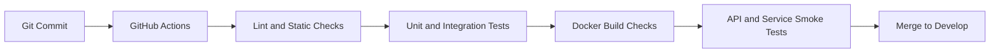

---

## Pipeline Deployment Model

The current pipeline runs through Docker Compose.

Docker Compose manages the following pipeline-related services:

- FastAPI;
- Redpanda;
- event consumer;
- PostgreSQL;
- Streamlit;
- Airflow;
- Prometheus;
- Grafana.

This deployment model makes the pipeline reproducible locally.

---

## Cloud Target Architecture

The current implementation is Docker Compose based, but the architecture is designed to be portable.

A future cloud architecture could map components as follows:

| Current component | Cloud equivalent |
|---|---|
| FastAPI container | Managed container service |
| Redpanda | Managed Kafka-compatible broker |
| PostgreSQL | Managed relational database |
| Event consumer | Containerized worker |
| Airflow | Managed Airflow or orchestrator |
| Prometheus/Grafana | Managed observability stack |
| GitHub Actions | CI/CD pipeline |

---

## Scalability Considerations

The pipeline can scale across several dimensions.

### Producer scaling

FastAPI instances can be replicated behind a load balancer.

### Broker scaling

Streaming topics can be partitioned by customer, event type or region.

### Consumer scaling

Multiple consumers can process partitions in parallel.

### Database scaling

PostgreSQL can be optimized through indexes, partitioning and read replicas.

### Monitoring scaling

Prometheus and Grafana dashboards can be expanded with more service metrics.

---

## Future Partitioning Strategy

A future streaming design could partition events by:

- customer id;
- event type;
- country;
- timestamp bucket;
- business domain.

The recommended first strategy would be partitioning by customer id.

This keeps customer event ordering easier to reason about.

---

## Reprocessing Strategy

Dead-letter events may be reprocessed if the root cause is corrected.

A future reprocessing workflow could include:

1. select unresolved dead-letter events;
2. review error reason;
3. fix missing reference or malformed payload;
4. republish corrected event;
5. mark original dead-letter as reprocessed;
6. retain the original record for audit.

---

## Reprocessing Diagram

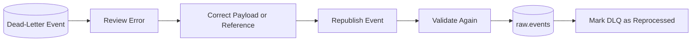

---

## Data Lineage

The pipeline provides a clear lineage from event generation to downstream usage.

```text
Customer interaction
→ Event payload
→ Redpanda message
→ Consumer validation
→ raw.events
→ customer features
→ ML predictions
→ dashboards
```

This lineage helps explain how business dashboards are connected to original customer behavior.

---

## Lineage Diagram

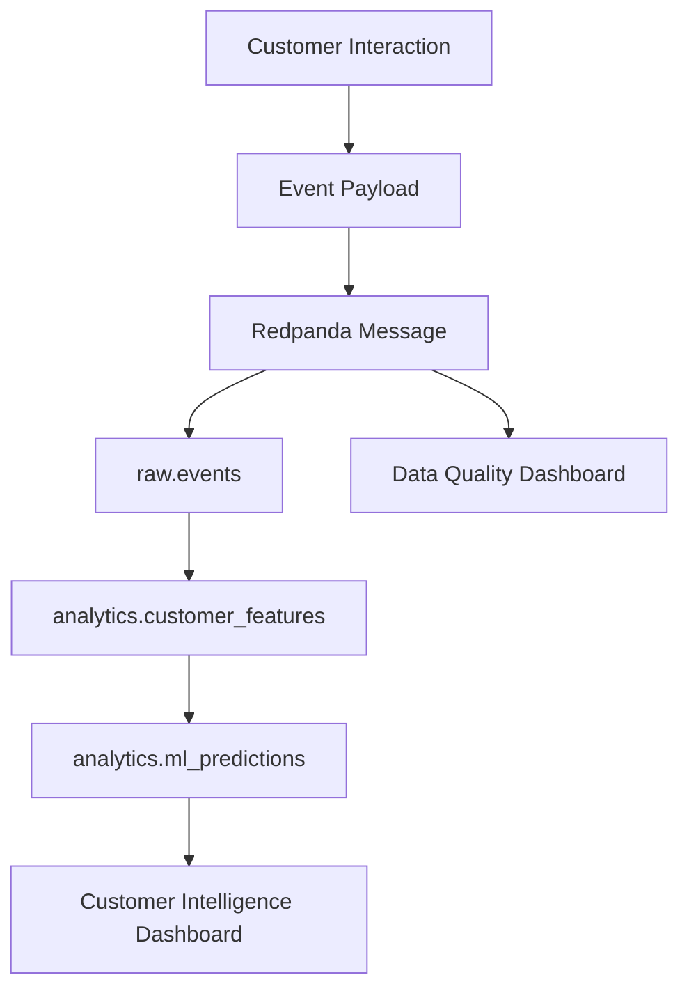

---

## Pipeline Dependencies

The pipeline depends on several platform components.

| Dependency | Reason |
|---|---|
| FastAPI | Receives and publishes event requests. |
| Redpanda | Transports event messages. |
| Event consumer | Processes messages. |
| PostgreSQL | Stores valid and invalid records. |
| Governance schema | Stores quality logs and dead letters. |
| Streamlit | Generates events and displays quality state. |
| Airflow | Schedules quality and aggregation jobs. |

---

## Failure Scenarios

I identified several possible failure scenarios.

| Scenario | Impact | Mitigation |
|---|---|---|
| FastAPI unavailable | Events cannot be published. | Health checks and observability. |
| Broker unavailable | Events cannot be transported. | Container monitoring and restart strategy. |
| Consumer stopped | Events remain unprocessed. | Docker logs and service monitoring. |
| PostgreSQL unavailable | Events cannot be persisted. | Health checks and exporter metrics. |
| Invalid payload spike | Dead-letter volume increases. | Data Quality dashboard and root cause analysis. |
| Validation rule too strict | Valid events may be rejected. | Steward review and rule adjustment. |
| Validation rule too weak | Bad data may enter trusted tables. | Quality monitoring and periodic rule review. |

---

## Operational Runbook

The following commands can be used to operate or validate the pipeline.

---

## Start the Platform

```bash
docker compose up -d
```

---

## Check Services

```bash
docker compose ps
```

---

## Check FastAPI Health

```bash
curl http://127.0.0.1:8000/health
```

---

## Check Recent Events

```bash
curl -s "http://127.0.0.1:8000/events/recent" | python -m json.tool
```

---

## Check Data Quality Summary

```bash
curl -s "http://127.0.0.1:8000/quality/summary" | python -m json.tool
```

---

## Check Dead Letters

```bash
curl -s "http://127.0.0.1:8000/quality/dead-letters?limit=10" | python -m json.tool
```

---

## Check Airflow Health

```bash
curl http://127.0.0.1:8080/health
```

---

## Check Event Consumer Logs

```bash
docker logs retailflow_event_consumer --tail 100
```

---

## Check Redpanda Container

```bash
docker compose ps redpanda
```

---

## Check PostgreSQL Metrics

```bash
curl -s "http://127.0.0.1:9090/api/v1/query?query=pg_up"
```

---

## Operational Roles

| Role | Operational responsibility |
|---|---|
| Data Engineer | Maintains the pipeline code and consumer processing. |
| Data Steward | Reviews quality issues and recurring rule failures. |
| Platform Engineer | Monitors services and infrastructure health. |
| Business Owner | Defines business impact of pipeline failures. |
| ML Engineer | Assesses downstream model impact of pipeline issues. |

---

## Relationship with AI Workflows

The pipeline feeds the AI workflows indirectly through customer features.

Events and transactional data are used to build behavioral indicators.

Those indicators then feed:

- churn prediction;
- customer lifetime value prediction;
- segmentation.

This means data quality issues in the pipeline can affect ML quality.

For this reason, pipeline monitoring is also a prerequisite for AI monitoring.

---

## AI Dependency Diagram

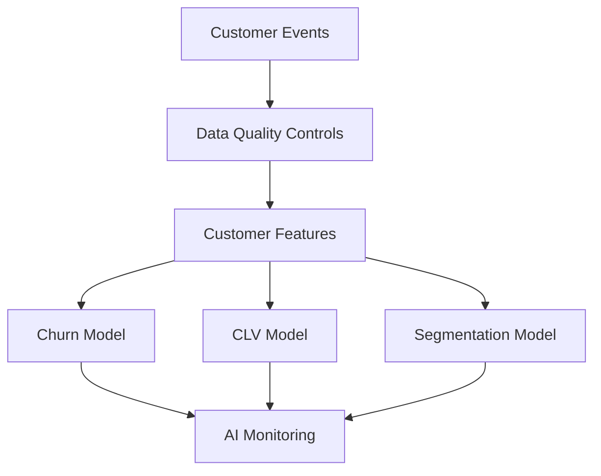

---

## Relationship with Data Governance

The pipeline supports governance because it creates evidence.

Every rejected event can be traced.

Every quality failure can be reviewed.

Every validation rule has a purpose.

This supports the governance principles of accountability, transparency and control.

---

## Relationship with Data Architecture

The pipeline is implemented as part of the broader architecture.

It uses:

- FastAPI for service entry;
- Redpanda for streaming;
- Python for processing;
- PostgreSQL for storage;
- Streamlit for visibility;
- Airflow for scheduled controls;
- Prometheus and Grafana for monitoring.

The pipeline therefore demonstrates how architecture choices support data engineering requirements.

---

## Relationship with Observability

The pipeline is supported by operational observability.

The platform can monitor:

- API health;
- database health;
- Prometheus targets;
- Airflow scheduler health;
- PostgreSQL exporter status;
- Grafana dashboards.

This provides confidence that the pipeline is not only designed but also operationally visible.

---

## Strengths of the Pipeline Design

The main strengths are:

- clear separation between event production and persistence;
- Kafka-compatible streaming architecture;
- validation before storage;
- dead-letter handling;
- governance-oriented quality logs;
- dashboard visibility;
- Airflow automation;
- downstream AI integration;
- monitoring and observability integration.

---

## Limitations

The current implementation has several limitations.

| Limitation | Explanation |
|---|---|
| Local deployment | The runtime is currently Docker Compose based. |
| Limited event types | The current event taxonomy focuses on the customer journey. |
| No advanced stream processing engine | The pipeline uses a Python consumer rather than Flink or Spark Streaming. |
| Limited replay automation | Dead-letter reprocessing is conceptually defined but can be automated further. |
| Limited broker monitoring | Broker-level metrics can be expanded. |
| Limited event partitioning | The current demo does not require complex partitioning. |

---

## Improvement Roadmap

I identified several future improvements for the pipeline.

---

## Improvement 1 — Automated Dead-Letter Reprocessing

A future version should include a controlled reprocessing mechanism.

This would allow data stewards or data engineers to correct and replay selected events.

---

## Improvement 2 — Advanced Broker Monitoring

Broker-level metrics could be added to Prometheus and Grafana.

Examples:

- topic throughput;
- consumer lag;
- message retention;
- partition health.

---

## Improvement 3 — More Event Domains

Additional event domains could be added:

- payment events;
- delivery events;
- return events;
- support events;
- marketing campaign events.

---

## Improvement 4 — Stream Processing Engine

A future production version could introduce a stream processing engine.

Possible options:

- Apache Flink;
- Spark Structured Streaming;
- Kafka Streams;
- Redpanda-compatible stream processing.

---

## Improvement 5 — Near Real-Time Feature Updates

The platform could evolve toward near real-time customer feature updates.

This would allow faster refresh of customer intelligence signals.

---

## Improvement 6 — Data Contract Management

Producer and consumer contracts could be formalized.

This would improve compatibility between event producers and downstream consumers.

Potential tools:

- JSON Schema;
- Avro schema registry;
- Protobuf;
- data contract YAML files.

---

## Improvement 7 — Pipeline SLA Dashboard

A future dashboard could include:

- ingestion latency;
- event throughput;
- dead-letter rate;
- consumer lag;
- DAG success rate;
- freshness of downstream tables.

---

## Improvement 8 — Cloud-Native Deployment

The pipeline could be deployed to a cloud target with:

- managed Kafka-compatible streaming;
- managed PostgreSQL;
- containerized consumers;
- managed Airflow;
- managed monitoring.

---

## Current Implementation Summary

| Capability | Status |
|---|---|
| Event publishing | Implemented |
| Redpanda streaming | Implemented |
| Python consumer | Implemented |
| Event validation | Implemented |
| PostgreSQL persistence | Implemented |
| Dead-letter handling | Implemented |
| Data quality logs | Implemented |
| Data Quality dashboard | Implemented |
| Airflow quality DAG | Implemented |
| Airflow sales aggregation DAG | Implemented |
| Monitoring integration | Implemented |
| CI/CD validation | Implemented through GitHub Actions workflow |
| Advanced replay automation | Future improvement |
| Advanced broker observability | Future improvement |

---

## Conclusion

The real-time data pipeline is a central component of RetailFlow.

I designed it to transform customer events into reliable, traceable and governed data.

The pipeline combines event-driven ingestion, validation, persistence, error isolation, quality monitoring and orchestration.

It supports downstream analytics and machine learning by ensuring that behavioral data is captured and controlled before it is used.

The most important design choice is the integration between pipeline engineering and data governance.

Invalid events are not simply dropped.

They are captured, explained, stored and monitored.

This makes the pipeline reliable, auditable and suitable for a broader Retail Intelligence platform.

---

## Appendix — Pipeline Components

| Component | File or location | Role |
|---|---|---|
| Customer View | `streamlit_app/pages/2_Customer_View.py` | Generates customer interactions. |
| Event API | `api/app/routes/events.py` | Publishes events. |
| Event consumer | `pipeline/consumer/event_consumer.py` | Consumes and processes events. |
| Validators | `pipeline/consumer/validators.py` | Applies quality rules. |
| Writer | `pipeline/consumer/writer.py` | Writes events and errors to PostgreSQL. |
| Topics config | `pipeline/config/topics.yaml` | Defines streaming topics. |
| Data Quality page | `streamlit_app/pages/5_Data_Quality.py` | Displays quality monitoring. |
| Daily data quality DAG | `airflow/dags/daily_data_quality.py` | Schedules quality checks. |
| Daily sales DAG | `airflow/dags/daily_sales_aggregation.py` | Refreshes sales analytics. |
| PostgreSQL schema | `database/init/` | Defines storage structures. |

---

## Appendix — Key Tables

| Table | Purpose |
|---|---|
| `raw.events` | Stores valid event records. |
| `governance.dead_letter_events` | Stores rejected events. |
| `governance.data_quality_logs` | Stores validation failures. |
| `analytics.daily_sales` | Stores daily sales aggregates. |
| `analytics.customer_features` | Stores customer-level features used by AI. |

---

## Appendix — Quality Rule Examples

| Rule | Example failure |
|---|---|
| Event ID required | Event has no unique identifier. |
| Allowed event type | Event type is not recognized. |
| Customer exists | Customer id does not exist. |
| Product exists | Product id does not exist for product event. |
| Timestamp valid | Event timestamp is missing or invalid. |

---

## Appendix — Mermaid Diagram Index

This document includes the following diagrams:

1. High-Level Architecture Diagram.
2. Event Sequence Diagram.
3. Producer Design Pattern.
4. Consumer Processing Diagram.
5. Trusted Event Flow.
6. Dead-Letter Design.
7. Error Handling Diagram.
8. Data Quality Page Flow.
9. Governance-Aware Pipeline Diagram.
10. Daily Data Quality DAG Diagram.
11. Daily Sales Aggregation DAG Diagram.
12. End-to-End Pipeline View.
13. Issue Resolution Diagram.
14. CI/CD Pipeline Diagram.
15. Reprocessing Diagram.
16. Lineage Diagram.
17. AI Dependency Diagram.

---

