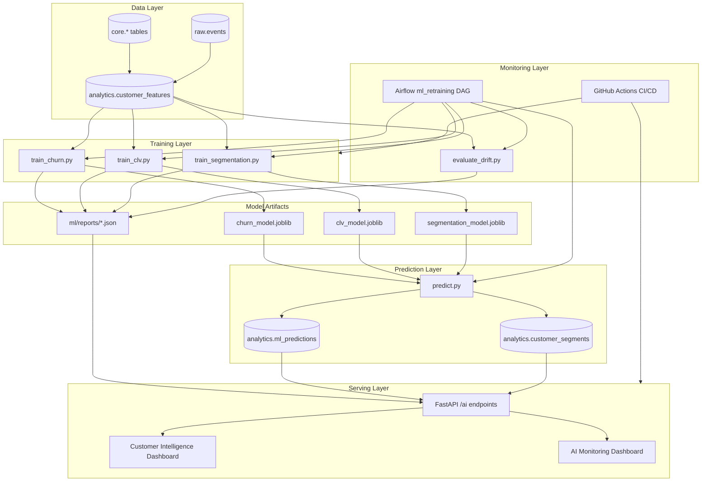
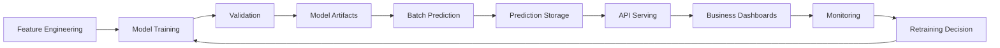
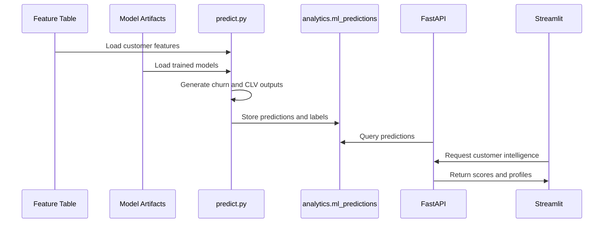
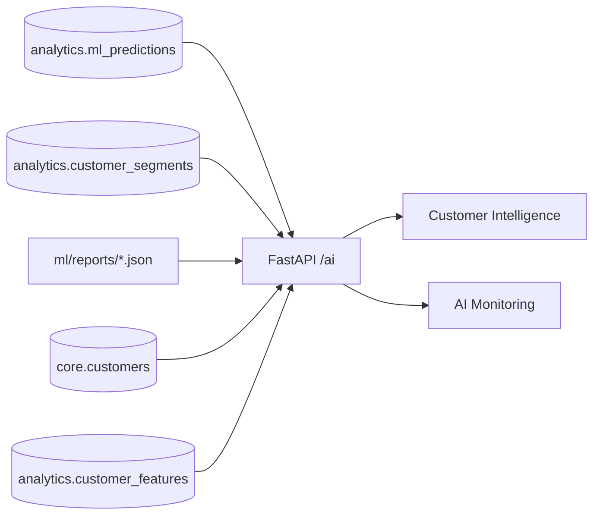
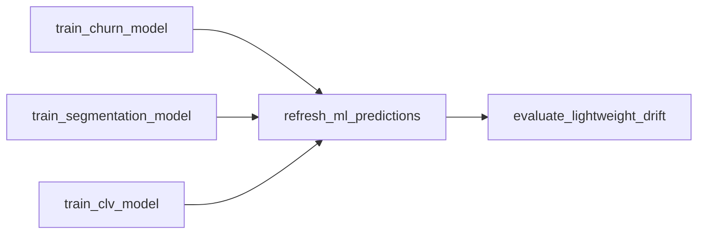
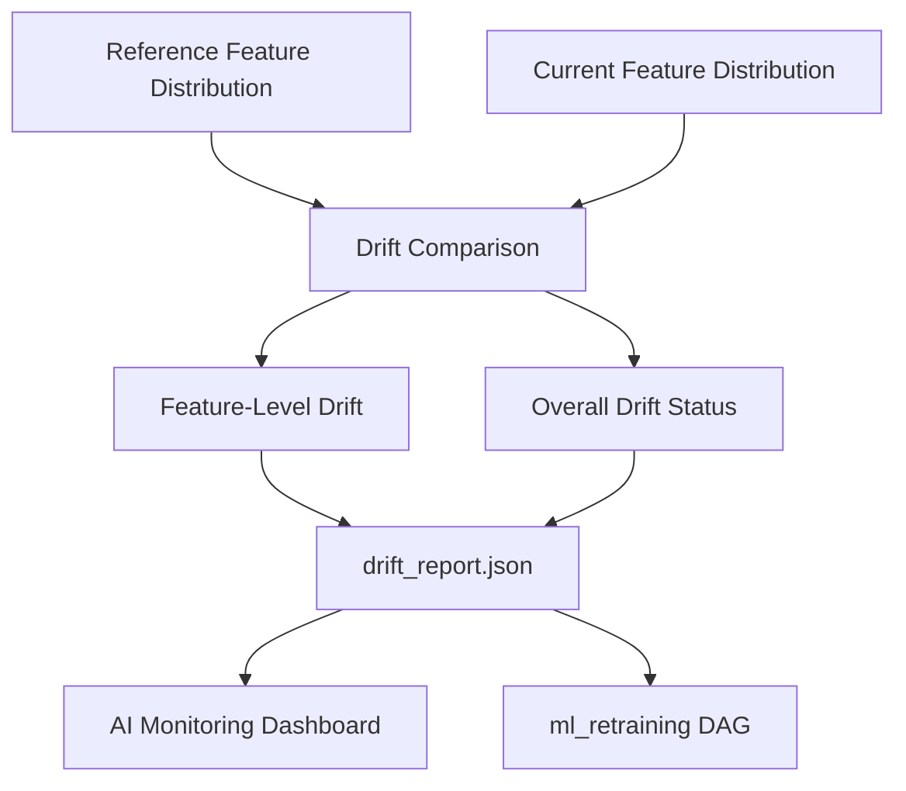
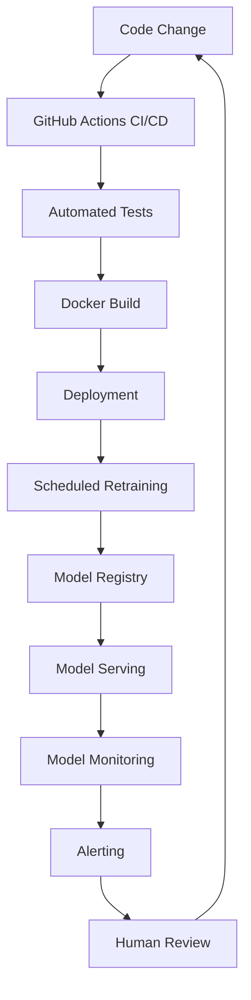

# RetailFlow AI Solution Design

## Block 4 — End-to-End Artificial Intelligence Solution

**Document type:** Official written deliverable  
**Scope:** AI solution design, model implementation, API serving, retraining, CI/CD and monitoring  
**Platform:** RetailFlow Platform  
**Language:** English  

---

## 1. Executive Summary

I designed and implemented the AI layer of RetailFlow as an end-to-end customer intelligence solution for a modern e-commerce organization.

The objective of this AI solution is to transform customer behavior, transactional history and engagement signals into actionable business intelligence.

The solution covers three complementary use cases:

| AI Use Case | Objective | Business Value |
|---|---|---|
| Churn prediction | Estimate the probability that a customer may disengage or stop purchasing | Prioritize retention actions |
| Customer Lifetime Value estimation | Estimate the future value potential of a customer | Prioritize loyalty, upsell and retention investments |
| Customer segmentation | Group customers into interpretable behavioral segments | Support targeting, lifecycle marketing and portfolio analysis |

I implemented the solution as a platform capability rather than as isolated notebooks.

The AI layer is integrated with:

- PostgreSQL for feature storage and prediction persistence;
- Scikit-Learn for model training and validation;
- Airflow for automated retraining and monitoring workflows;
- FastAPI for prediction and report serving;
- Streamlit for business-facing and monitoring dashboards;
- Prometheus and Grafana for operational observability;
- GitHub Actions for CI/CD validation;
- governance controls for consent-aware analytics and responsible AI usage.

The final design follows the lifecycle below:

```text
Customer behavior
→ feature engineering
→ model training
→ model validation
→ artifact persistence
→ batch prediction
→ database storage
→ API serving
→ dashboard visualization
→ model monitoring
→ retraining workflow
```

This approach demonstrates how an AI solution can be industrialized inside a broader data platform.

## 2. AI Solution Vision

The vision of the RetailFlow AI solution is to make customer intelligence operational, explainable and monitorable.

I did not design the AI layer as a standalone experiment.

I designed it as a product capability embedded into the platform.

The AI solution must therefore answer three types of questions.

### 2.1 Business Questions

- Which customers require retention attention?
- Which customers are expected to generate the highest future value?
- Which customer segments should receive differentiated actions?
- Which behavioral drivers influence churn or customer value?
- How can marketing and CRM teams prioritize actions?

### 2.2 Technical Questions

- How are features built and stored?
- Where are predictions persisted?
- How are model outputs exposed through APIs?
- How is retraining automated?
- How are model reports made available to dashboards?
- How is drift monitored over time?

### 2.3 Governance Questions

- Are customer intelligence views aligned with analytics consent?
- Can model outputs be traced back to model versions?
- Are model reports available for review?
- Are drift and performance metrics visible?
- Are AI decisions supported by explainability artifacts?

The AI solution is therefore designed around the principle:

> AI should support business decisions only when the data, the model lifecycle and the monitoring process are controlled and traceable.

## 3. Business Context

RetailFlow Platform is designed for e-commerce organizations that generate large volumes of behavioral and transactional data.

The platform captures and uses data related to:

- customer profiles;
- orders;
- payments;
- returns;
- browsing sessions;
- product views;
- cart events;
- checkout events;
- support tickets;
- product reviews;
- customer consent;
- customer features;
- model predictions;
- customer segments.

These data assets become valuable when they are transformed into decision support.

For an e-commerce organization, the most important customer intelligence needs are:

| Need | Business Challenge | AI Contribution |
|---|---|---|
| Retention | Identify customers likely to disengage | Churn scoring |
| Value management | Identify customers with high potential value | CLV prediction |
| Targeting | Understand behavior patterns | Segmentation |
| Prioritization | Decide which customer actions matter first | Combined AI profile |
| Monitoring | Ensure models remain reliable | Metrics and drift monitoring |

The AI layer addresses these needs through a structured ML architecture integrated into the platform.

## 4. Scope of the AI Solution

### 4.1 In Scope

The AI solution includes:

- customer feature engineering;
- churn model training;
- CLV model training;
- customer segmentation model training;
- model artifact persistence;
- model report generation;
- feature importance generation;
- cross-validation outputs;
- batch prediction generation;
- prediction persistence in PostgreSQL;
- customer segment persistence;
- FastAPI serving endpoints;
- Streamlit Customer Intelligence dashboard;
- Streamlit AI Monitoring dashboard;
- Airflow retraining workflow;
- drift monitoring;
- GitHub Actions CI/CD validation;
- responsible AI principles;
- consent-aware customer intelligence usage.

### 4.2 Out of Scope

The following elements are not part of the current implementation scope:

- enterprise IAM;
- single sign-on;
- multi-region deployment;
- 24/7 on-call support;
- online real-time model inference at every click;
- advanced feature store deployment;
- deep learning recommender system;
- multi-armed bandit experimentation;
- advanced causal uplift modeling.

These elements are listed as potential future improvements.

## 5. AI Architecture Overview

The AI architecture connects the analytical feature layer to model training, prediction storage, API serving and monitoring dashboards.



The architecture separates:

- feature production;
- model training;
- model artifacts;
- prediction storage;
- API serving;
- dashboards;
- monitoring;
- orchestration;
- CI/CD validation.

This separation makes the solution easier to maintain, monitor and extend.

## 6. AI Lifecycle

I implemented the AI lifecycle as a repeatable process.



The lifecycle contains the following stages.

| Stage | Description | Output |
|---|---|---|
| Feature engineering | Build customer-level behavioral features | `analytics.customer_features` |
| Training | Train churn, CLV and segmentation models | `.joblib` model artifacts |
| Validation | Evaluate model quality | JSON and TXT reports |
| Prediction | Generate customer scores and segments | `analytics.ml_predictions`, `analytics.customer_segments` |
| Serving | Expose results through APIs | `/ai/*` endpoints |
| Visualization | Display business and monitoring views | Streamlit dashboards |
| Monitoring | Track metrics, drift and distribution | AI Monitoring page, drift report |
| Retraining | Refresh models and predictions | Airflow `ml_retraining` DAG |

## 7. Feature Engineering Layer

### 7.1 Feature Table

The main feature table is:

```text
analytics.customer_features
```

This table is the analytical foundation of the AI solution.

It contains customer-level features derived from transactional, behavioral and engagement data.

### 7.2 Main Feature Families

| Feature Family | Examples | Purpose |
|---|---|---|
| Purchase behavior | `total_orders`, `total_spent`, `avg_order_value` | Measure customer value and activity |
| Recency | `days_since_last_order` | Detect disengagement or inactivity |
| Returns | `return_rate` | Detect friction and return-prone behavior |
| Cart behavior | `cart_abandon_rate` | Measure purchase friction |
| Engagement | `session_count_30d`, `pages_viewed_30d` | Measure recent interest |
| Support | `support_tickets_count` | Detect customer service issues |
| Satisfaction | `avg_rating_given` | Approximate satisfaction level |
| Price sensitivity | `discount_usage_rate` | Identify promotion-sensitive behavior |
| Category preference | `preferred_category` | Support targeting and segmentation |

### 7.3 Feature Design Rationale

I designed the feature layer to support both predictive and descriptive intelligence.

For churn prediction, features such as recency, returns, cart abandonment and support tickets are important because they may indicate disengagement or friction.

For CLV estimation, features such as total spending, average order value, order frequency and category preference are important because they reflect customer value potential.

For segmentation, a broader feature set is useful because the goal is not a single prediction but a behavioral grouping.

### 7.4 Feature Governance

The feature layer is governed by several principles:

- features should be interpretable;
- features should be customer-level;
- features should be reusable across models;
- features should be stored in a stable analytics schema;
- features should be compatible with monitoring and reporting;
- features should be used in a consent-aware analytics context.

## 8. Churn Prediction Model

### 8.1 Objective

I implemented the churn model to estimate customer churn risk and support retention prioritization.

The model answers the question:

> Which customers should be prioritized for retention actions?

The churn model is not designed to make fully automated decisions.

It is designed to rank customers and support human decision-making.

### 8.2 Business Use

The churn score supports:

- retention campaign prioritization;
- CRM follow-up;
- customer care prioritization;
- lifecycle marketing;
- early detection of disengagement.

### 8.3 Training Script

The training workflow is implemented in:

```text
ml/src/train_churn.py
```

### 8.4 Model Artifact

The trained model is stored as:

```text
ml/models/churn_model.joblib
```

### 8.5 Reports

The churn training process produces:

```text
ml/reports/churn_model_report.json
ml/reports/churn_model_report.txt
```

These reports include model metrics, feature importance and validation information.

### 8.6 Prediction Labels

The churn model outputs business-readable labels.

| Label | Interpretation | Business Action |
|---|---|---|
| `low_risk` | Customer is not currently a high retention priority | Standard lifecycle engagement |
| `medium_risk` | Customer should be monitored | Soft retention action |
| `high_risk` | Customer requires attention | Targeted retention campaign |

### 8.7 Key Metrics

The churn model is evaluated using classification and calibration metrics.

| Metric | Purpose | Business Interpretation |
|---|---|---|
| ROC AUC | Measures ranking ability | Can the model rank customers by risk? |
| F1 Score | Balances precision and recall | Is the risk detection balanced? |
| Precision | Measures reliability of positive alerts | Are predicted risky customers really risky? |
| Recall | Measures coverage of risky customers | How many risky customers are detected? |
| Brier Score | Measures probability calibration | Can risk probabilities be trusted? |

### 8.8 Business Interpretation of Metrics

A high ROC AUC indicates that the model can rank customers from lower to higher risk.

A good F1 score indicates that the model balances false positives and false negatives.

High precision reduces unnecessary retention actions.

High recall reduces the risk of missing customers who should be contacted.

A low Brier score indicates better probability calibration.

### 8.9 Churn Explainability

Feature importance is used to explain what drives churn predictions.

The AI Monitoring dashboard displays the top churn drivers.

This supports:

- model transparency;
- business discussion;
- validation of feature relevance;
- trust in customer intelligence outputs.

## 9. Customer Lifetime Value Model

### 9.1 Objective

I implemented the CLV model to estimate customer value potential.

The model answers the question:

> Which customers are expected to generate the highest future value?

### 9.2 Business Use

The CLV model supports:

- loyalty program prioritization;
- upsell and cross-sell strategies;
- retention budget allocation;
- customer portfolio analysis;
- high-value customer identification.

### 9.3 Training Script

The CLV training workflow is implemented in:

```text
ml/src/train_clv.py
```

### 9.4 Model Artifact

The trained model is stored as:

```text
ml/models/clv_model.joblib
```

### 9.5 Reports

The CLV training process produces:

```text
ml/reports/clv_model_report.json
ml/reports/clv_model_report.txt
```

### 9.6 Prediction Labels

The CLV model outputs business-readable value bands.

| Label | Interpretation | Business Action |
|---|---|---|
| `low_value` | Lower estimated future value | Low-cost lifecycle campaigns |
| `medium_value` | Moderate estimated future value | Engagement and repeat purchase strategy |
| `high_value` | High estimated future value | VIP treatment, loyalty and retention priority |

### 9.7 Key Metrics

The CLV model is evaluated using regression metrics.

| Metric | Purpose | Business Interpretation |
|---|---|---|
| MAE | Average absolute prediction error | Average monetary deviation |
| RMSE | Penalizes large errors | Detects large mistakes on valuable customers |
| R² | Share of variance explained | Measures how well value differences are captured |

### 9.8 Business Interpretation of Metrics

MAE is easy to explain because it represents the average error in monetary terms.

RMSE is useful because large CLV errors can be more damaging than small errors.

R² indicates how much customer value variability is explained by the model.

### 9.9 CLV Explainability

The AI Monitoring dashboard displays CLV feature importance.

This helps explain why some customers are predicted as high value.

It also helps verify whether the model relies on meaningful business drivers.

## 10. Customer Segmentation Model

### 10.1 Objective

I implemented customer segmentation to group customers into interpretable business segments.

The segmentation model answers the question:

> What types of customers exist in the customer base?

Unlike churn and CLV, segmentation is descriptive rather than directly predictive.

It helps translate complex behavioral data into usable marketing and customer strategy groups.

### 10.2 Training Script

The segmentation training workflow is implemented in:

```text
ml/src/train_segmentation.py
```

### 10.3 Model Artifact

The trained segmentation model is stored as:

```text
ml/models/segmentation_model.joblib
```

### 10.4 Reports

The segmentation training process produces:

```text
ml/reports/segmentation_model_report.json
ml/reports/segmentation_model_report.txt
```

### 10.5 Segment Storage

Customer segments are persisted in:

```text
analytics.customer_segments
```

### 10.6 Business Segments

RetailFlow translates clusters into business-readable segments.

| Segment | Interpretation | Recommended Action |
|---|---|---|
| High Value Loyal Customers | Strong value and engagement | VIP loyalty and premium retention |
| Standard Active Customers | Balanced activity and value | Standard lifecycle marketing |
| Promo-Sensitive Browsers | Price-sensitive and promotion-driven | Targeted promotional campaigns |
| Return-Prone Customers | High return behavior | Improve product information and support |
| Dormant Low Value Customers | Low activity and low value | Low-cost reactivation |

### 10.7 Segmentation Value

Segmentation supports:

- campaign targeting;
- lifecycle strategy;
- customer portfolio analysis;
- business communication;
- customer behavior understanding;
- segment-level recommendations.

### 10.8 Segment Explorer

The Customer Intelligence page includes a segment-level explorer.

I implemented this to make segmentation operational.

The user can select a segment and see customers belonging to that segment.

This transforms segmentation from a static model output into a business exploration tool.

## 11. Prediction Persistence

### 11.1 Prediction Table

Predictions are stored in:

```text
analytics.ml_predictions
```

This table centralizes churn and CLV predictions.

### 11.2 Prediction Fields

| Field | Purpose |
|---|---|
| `prediction_id` | Unique prediction identifier |
| `customer_id` | Customer scored by the model |
| `model_name` | Model name, such as `churn_model` or `clv_model` |
| `model_version` | Model version used for the prediction |
| `prediction_value` | Numeric prediction output |
| `prediction_label` | Business-readable label |
| `prediction_timestamp` | Timestamp of prediction generation |
| `input_features_hash` | Hash of features used for traceability |

### 11.3 Why Predictions Are Stored

I persisted predictions in PostgreSQL because model outputs should be reusable across platform components.

Stored predictions can be consumed by:

- FastAPI endpoints;
- Customer Intelligence dashboards;
- AI Monitoring dashboards;
- business reporting;
- future alerting;
- future campaign automation;
- audit and traceability processes.

### 11.4 Prediction Storage Pattern



## 12. Model Reports

### 12.1 Report Directory

Model reports are stored in:

```text
ml/reports/
```

### 12.2 Main Reports

| Report | Purpose |
|---|---|
| `model_summary.json` | Consolidated model overview |
| `churn_model_report.json` | Churn metrics, calibration and feature importance |
| `clv_model_report.json` | CLV metrics and feature importance |
| `segmentation_model_report.json` | Cluster summaries and selection information |
| `drift_report.json` | Drift monitoring output |

### 12.3 Report Value

The reports provide evidence for:

- model selection;
- model validation;
- feature importance;
- prediction distribution;
- drift monitoring;
- business interpretation;
- model traceability.

### 12.4 Report Serving

FastAPI exposes model reports through:

```text
GET /ai/model-report/{report_name}
```

The AI Monitoring dashboard consumes these reports and displays them in a readable format.

## 13. FastAPI Serving Layer

### 13.1 Serving Objective

I implemented FastAPI endpoints so that model outputs can be consumed by applications rather than remaining in files or notebooks.

The API layer makes the AI solution usable by Streamlit dashboards and future external services.

### 13.2 Main AI Endpoints

| Endpoint | Purpose |
|---|---|
| `GET /ai/summary` | Global prediction and segment summary |
| `GET /ai/churn-top` | Highest churn risk customers |
| `GET /ai/clv-top` | Highest predicted CLV customers |
| `GET /ai/segments` | Segment-level summary |
| `GET /ai/customers` | Enriched customer list with AI outputs and consent fields |
| `GET /ai/customer/{customer_id}` | Full AI profile for one customer |
| `GET /ai/model-reports` | Available model reports |
| `GET /ai/model-report/{report_name}` | Detailed model report content |

### 13.3 Customer AI Profile

The customer AI profile combines:

- customer features;
- churn prediction;
- CLV prediction;
- segment assignment;
- consent information;
- behavioral indicators.

This endpoint enables the Customer Intelligence dashboard to display a complete customer profile.

### 13.4 Consent-Aware AI Access

The endpoint:

```text
GET /ai/customers
```

supports an analytics consent filter.

The customer explorer can therefore limit the available customers to those with analytics consent.

This connects AI serving to data governance.

### 13.5 API Serving Diagram



## 14. Customer Intelligence Dashboard

### 14.1 Purpose

The Customer Intelligence page is the business-facing AI dashboard.

It translates model outputs into business actions.

### 14.2 Main Sections

The dashboard includes:

- business overview;
- top churn risk customers;
- top predicted CLV customers;
- customer segments;
- segment customer explorer;
- segment recommendations;
- consent-aware customer explorer;
- customer AI profile;
- behavioral features;
- business recommendations.

### 14.3 Churn View

The churn section identifies customers requiring retention attention.

The table excludes customers with no order history from the business churn view.

This is important because churn analysis is meaningful when applied to existing customers.

### 14.4 CLV View

The CLV section identifies customers with the highest predicted future value.

This supports loyalty and upsell prioritization.

### 14.5 Segment View

The segment explorer allows users to select a customer segment and inspect the customers in that segment.

Each segment is connected to a business recommendation.

### 14.6 Consent-Aware Exploration

The customer explorer includes the option:

```text
Show only customers with analytics consent
```

This option is enabled by default.

It demonstrates responsible and governed AI usage.

### 14.7 Customer Recommendations

The dashboard generates recommendations based on:

- churn risk;
- CLV band;
- customer segment;
- recency;
- cart abandonment;
- return rate.

This turns model outputs into business action guidance.

## 15. AI Monitoring Dashboard

### 15.1 Purpose

The AI Monitoring page is the model-facing dashboard.

It answers the question:

> Are the models performant, monitored and explainable?

### 15.2 Main Sections

The dashboard includes:

- executive model overview;
- churn model section;
- CLV model section;
- segmentation model section;
- prediction distribution;
- feature importance;
- lightweight drift monitoring;
- validation details;
- technical evidence.

### 15.3 Executive Overview Metrics

The executive overview displays:

- Churn ROC AUC;
- Churn F1;
- CLV R²;
- drift status;
- CLV MAE;
- CLV RMSE;
- selected K for segmentation;
- number of drifted features.

### 15.4 Metric Interpretation Guides

I added interpretation guides to explain model metrics in business terms.

This is important because model monitoring should be understandable by both technical and business stakeholders.

### 15.5 Feature Importance

Feature importance sections show the main drivers for:

- churn prediction;
- CLV prediction.

These outputs help explain model behavior.

### 15.6 Prediction Distribution

The prediction distribution section shows how predictions are distributed across labels.

This helps detect whether a model produces unrealistic or imbalanced outputs.

### 15.7 Drift Monitoring

The drift monitoring section explains how behavioral changes can affect model reliability.

It displays feature-level drift outputs from the drift report.

## 16. Airflow Retraining Workflow

### 16.1 Objective

I implemented an Airflow workflow to automate the ML lifecycle.

The DAG is named:

```text
ml_retraining
```

It is scheduled weekly.

### 16.2 DAG Tasks

The DAG includes the following tasks:

| Task | Command | Purpose |
|---|---|---|
| `train_churn_model` | `python -m ml.src.train_churn` | Retrain churn model |
| `train_segmentation_model` | `python -m ml.src.train_segmentation` | Retrain segmentation model |
| `train_clv_model` | `python -m ml.src.train_clv` | Retrain CLV model |
| `refresh_ml_predictions` | `python -m ml.src.predict` | Refresh predictions |
| `evaluate_lightweight_drift` | `python -m ml.src.evaluate_drift` | Generate drift report |

### 16.3 DAG Dependency Structure



### 16.4 Retraining Value

This workflow demonstrates that model training is not a manual one-off activity.

It is integrated into platform operations.

The retraining DAG supports:

- scheduled model refresh;
- prediction refresh;
- drift evaluation;
- repeatability;
- operational visibility;
- production-oriented MLOps design.

## 17. Drift Monitoring

### 17.1 Objective

I implemented lightweight drift monitoring to detect changes in customer behavior.

The drift process compares current customer feature distributions against reference distributions.

### 17.2 Drift Script

The drift evaluation process is implemented in:

```text
ml/src/evaluate_drift.py
```

### 17.3 Drift Report

The drift output is stored in:

```text
ml/reports/drift_report.json
ml/reports/drift_report.txt
```

### 17.4 Drift Outputs

The drift report includes:

- global drift status;
- number of drifted features;
- threshold;
- feature-level relative changes;
- feature drift table.

### 17.5 Drift Interpretation

Drift can indicate that customer behavior has changed.

Examples:

- purchase frequency changes;
- returns increase;
- cart abandonment changes;
- support interactions increase;
- discount sensitivity changes;
- browsing behavior changes.

### 17.6 Business Impact

If drift increases, model reliability may decrease.

The appropriate response may include:

- reviewing feature distributions;
- validating model metrics;
- retraining models;
- adjusting thresholds;
- updating business interpretation;
- investigating business changes.

### 17.7 Drift Monitoring Diagram



## 18. CI/CD with GitHub Actions

### 18.1 Objective

I implemented GitHub Actions CI/CD to validate the platform whenever changes are pushed or proposed through pull requests.

The CI/CD workflow is designed to reduce regression risk and support a production-oriented development process.

### 18.2 CI/CD Scope

The CI/CD pipeline covers:

- repository checkout;
- Python environment setup;
- dependency installation;
- code quality checks;
- unit tests;
- API tests;
- ML tests;
- data quality tests;
- Docker Compose validation;
- Docker image build checks;
- application smoke tests.

### 18.3 CI/CD Workflow

```mermaid
flowchart LR
    Push[Git Push / Pull Request] --> Checkout[Checkout Repository]
    Checkout --> Setup[Setup Python]
    Setup --> Install[Install Dependencies]
    Install --> Lint[Lint and Format Checks]
    Lint --> Tests[Run Automated Tests]
    Tests --> Compose[Validate Docker Compose]
    Compose --> Build[Build Containers]
    Build --> Smoke[Run Smoke Tests]
    Smoke --> Result[CI Result]
```



### 18.4 Test Categories

| Test Category | Purpose |
|---|---|
| API tests | Validate FastAPI endpoints |
| Data quality tests | Validate event validation and dead-letter logic |
| ML tests | Validate model report structure and prediction workflows |
| Docker checks | Ensure services can be built |
| Smoke tests | Validate basic service availability |

### 18.5 CI/CD Value

GitHub Actions improves:

- development reliability;
- pull request validation;
- deployment confidence;
- reproducibility;
- collaboration readiness;
- platform maintainability.

### 18.6 Production Orientation

The CI/CD workflow supports the MLOps objective because ML systems should not be deployed manually without validation.

For RetailFlow, CI/CD is used to verify that the platform remains stable when changes affect:

- APIs;
- models;
- reports;
- pipelines;
- dashboards;
- Docker services.

## 19. Responsible AI

### 19.1 Responsible AI Principles

I designed the AI solution around responsible AI principles.

| Principle | RetailFlow Implementation |
|---|---|
| Transparency | Model reports and feature importance are available |
| Explainability | Dashboards show model drivers and interpretation guides |
| Human oversight | AI outputs support decisions rather than automate final actions |
| Consent awareness | Customer exploration can be filtered by analytics consent |
| Monitoring | Metrics, drift and prediction distributions are visible |
| Traceability | Predictions include model metadata and timestamps |
| Business alignment | Outputs are translated into actionable customer recommendations |

### 19.2 Human Oversight

The AI solution does not automatically contact customers or execute campaigns.

It provides signals and recommendations.

Business users remain responsible for final decisions.

This is important for:

- customer trust;
- ethical decision-making;
- campaign quality;
- avoiding over-automation;
- reducing the risk of incorrect model-driven actions.

### 19.3 Explainability

Explainability is supported through:

- feature importance;
- metric interpretation guides;
- business labels;
- customer-level profiles;
- segment recommendations;
- model reports.

### 19.4 Fairness and Bias Awareness

RetailFlow includes fairness and bias awareness as part of responsible AI governance.

Potential risks include:

- over-targeting some customer groups;
- excluding customers based on incomplete behavior;
- treating low-value customers unfairly;
- using features that indirectly encode sensitive patterns;
- making retention decisions based only on predicted value.

Mitigations include:

- using AI outputs as decision support;
- reviewing model drivers;
- monitoring prediction distributions;
- requiring human oversight;
- avoiding automated exclusion decisions;
- keeping consent and governance constraints visible.

### 19.5 Consent-Aware Intelligence

Customer intelligence is connected to consent management.

The customer explorer can be restricted to customers with analytics consent.

This demonstrates how AI usage can respect governance rules.

## 20. AI Governance

### 20.1 Objective

AI governance ensures that model outputs are controlled, interpretable, monitored and aligned with business and privacy rules.

### 20.2 AI Governance Controls

| Control | Implementation |
|---|---|
| Model versioning | Model reports and prediction records include version metadata |
| Prediction traceability | Predictions are stored in `analytics.ml_predictions` |
| Report availability | Reports are stored in `ml/reports/` and exposed by FastAPI |
| Drift monitoring | Drift reports are generated and displayed |
| Explainability | Feature importance is shown in dashboards |
| Consent-aware access | Analytics consent filtering in Customer Intelligence |
| Retraining | Airflow `ml_retraining` DAG |
| CI/CD validation | GitHub Actions workflow |

### 20.3 AI Risk Register

| Risk | Description | Mitigation |
|---|---|---|
| Model drift | Customer behavior changes over time | Drift monitoring and retraining |
| Poor calibration | Scores may be overconfident | Brier score and calibration review |
| False positives | Customers may be incorrectly classified as high risk | Precision monitoring and human review |
| False negatives | At-risk customers may be missed | Recall monitoring |
| Business misuse | Users may interpret model outputs as final decisions | Interpretation guides and human oversight |
| Consent misuse | Analytics outputs may be used without proper consent | Consent-aware filtering |
| Feature instability | Input distributions may shift | Feature drift monitoring |
| CI/CD regression | Code changes may break AI serving | GitHub Actions validation |

### 20.4 AI Governance Maturity

| Dimension | Current Maturity | Rationale |
|---|---|---|
| Model reporting | Advanced | JSON and TXT reports are generated |
| API serving | Advanced | AI outputs are exposed through FastAPI |
| Dashboard monitoring | Advanced | AI Monitoring page exists |
| Drift monitoring | Intermediate to Advanced | Lightweight drift process is implemented |
| Model registry | Developing | Model artifacts exist but no full registry yet |
| Automated retraining | Advanced | Airflow retraining DAG exists |
| CI/CD | Advanced | GitHub Actions production CI/CD is in place |
| Responsible AI | Intermediate to Advanced | Explainability, consent and oversight principles are integrated |

## 21. Security and Privacy Considerations

### 21.1 Customer Data Sensitivity

The AI layer uses customer-level behavioral and transactional features.

These features may be sensitive because they can reveal:

- purchasing behavior;
- engagement level;
- return behavior;
- discount sensitivity;
- churn risk;
- customer value potential;
- segment membership.

### 21.2 Privacy Controls

RetailFlow includes several privacy-oriented controls:

- analytics consent filtering;
- retention policies;
- anonymization workflow;
- audit logs;
- governance dashboard;
- separation between governance, analytics and core schemas.

### 21.3 Data Minimization

AI features should remain focused on business-relevant signals.

The solution avoids unnecessary personal attributes in model interpretation.

### 21.4 Access Control Roadmap

Future improvements include:

- role-based dashboard access;
- API authentication;
- service-level authorization;
- audit logging for AI endpoint access;
- advanced secrets management;
- model artifact access controls.

## 22. Monitoring and Observability Integration

### 22.1 Platform Observability

The AI solution is integrated into the broader RetailFlow observability approach.

FastAPI metrics are exposed through:

```text
/metrics
```

Prometheus collects platform metrics.

Grafana visualizes operational health.

### 22.2 AI Monitoring vs Platform Monitoring

| Monitoring Type | Purpose | Tooling |
|---|---|---|
| AI monitoring | Model metrics, drift, feature importance | AI Monitoring page, reports |
| API monitoring | Request count, latency, errors | FastAPI metrics, Prometheus |
| Database monitoring | PostgreSQL availability and metrics | PostgreSQL exporter, Prometheus |
| Platform monitoring | Service status and target health | Streamlit Observability page, Grafana |

### 22.3 Model Monitoring Signals

The AI solution monitors:

- holdout metrics;
- cross-validation outputs;
- feature importance;
- prediction distributions;
- drift status;
- drifted feature count;
- model report freshness;
- prediction row counts.

### 22.4 Alerting Direction

Future alerting can include:

- drift detected;
- high prediction imbalance;
- missing model reports;
- failed retraining DAG;
- stale predictions;
- API model endpoint failures;
- high API latency;
- high error rate.

## 23. Testing Strategy

### 23.1 Test Objectives

Testing is required to ensure that AI components remain stable across changes.

The testing strategy covers:

- API behavior;
- data quality logic;
- model report structure;
- prediction pipeline behavior;
- CI/CD validation;
- smoke testing.

### 23.2 Existing Test Areas

RetailFlow includes tests in:

```text
tests/test_api.py
tests/test_data_quality.py
tests/test_ml.py
```

### 23.3 Recommended Test Expansion

| Test Area | Example |
|---|---|
| Churn report validation | Verify required metrics exist |
| CLV report validation | Verify MAE, RMSE and R² exist |
| Segmentation report validation | Verify selected K and cluster summary exist |
| Drift report validation | Verify drift status and feature drift rows exist |
| AI endpoints | Verify `/ai/summary`, `/ai/customers`, `/ai/customer/{id}` |
| Consent filtering | Verify analytics consent filter works |
| Prediction storage | Verify predictions exist after refresh |
| Retraining DAG | Verify commands and dependency order |

### 23.4 CI/CD Testing

The GitHub Actions workflow supports automated validation through:

```text
push / pull request
→ install dependencies
→ run tests
→ validate Docker Compose
→ build services
→ smoke checks
```

This reduces the risk of deploying broken AI or API changes.

## 24. Operational Runbook for AI

### 24.1 Manual Training Commands

Churn model:

```bash
python -m ml.src.train_churn
```

CLV model:

```bash
python -m ml.src.train_clv
```

Segmentation model:

```bash
python -m ml.src.train_segmentation
```

Prediction refresh:

```bash
python -m ml.src.predict
```

Drift evaluation:

```bash
python -m ml.src.evaluate_drift
```

### 24.2 Airflow Retraining

The preferred operational workflow is to use Airflow.

DAG:

```text
ml_retraining
```

Schedule:

```text
weekly
```

### 24.3 API Validation

AI summary:

```bash
curl -s "http://127.0.0.1:8000/ai/summary" | python -m json.tool
```

Customer list:

```bash
curl -s "http://127.0.0.1:8000/ai/customers?limit=3&analytics_consent_only=true" | python -m json.tool
```

Model report:

```bash
curl -s "http://127.0.0.1:8000/ai/model-report/churn" | python -m json.tool
```

### 24.4 Dashboard Validation

Validate:

- Customer Intelligence page;
- AI Monitoring page;
- Observability page;
- Airflow DAG status;
- FastAPI Swagger UI;
- model report availability.

## 25. AI Solution Roadmap

### 25.1 Achievements Already Implemented

I have already implemented:

- churn model training;
- CLV model training;
- customer segmentation;
- model artifact persistence;
- model reports;
- prediction persistence;
- FastAPI serving;
- Customer Intelligence dashboard;
- AI Monitoring dashboard;
- drift reporting;
- Airflow retraining workflow;
- GitHub Actions CI/CD;
- consent-aware customer exploration;
- interpretation guides;
- feature importance visualization.

### 25.2 Future Improvements

Future improvements include:

| Improvement | Value |
|---|---|
| Full model registry | Stronger model versioning and promotion workflow |
| Advanced drift monitoring | More robust production ML monitoring |
| Real-time feature updates | More responsive intelligence layer |
| Recommendation engine | Next-best-product or next-best-action |
| Campaign feedback loop | Measure effectiveness of AI-driven actions |
| Advanced fairness analysis | Stronger responsible AI validation |
| API authentication | Secure AI endpoints |
| Role-based dashboard access | Control visibility by business role |
| Model rollback workflow | Safer production operations |
| Automated alerting | Notify teams on drift or failed retraining |

### 25.3 Target Future MLOps Architecture



## 26. Strengths of the AI Solution

The AI solution has several strengths.

### 26.1 End-to-End Integration

The solution covers the full path from features to dashboards.

It is not limited to notebooks.

### 26.2 Business Interpretability

Model outputs are translated into business labels and recommendations.

### 26.3 API-Based Serving

AI outputs are exposed through FastAPI and can be consumed by applications.

### 26.4 Monitoring

Metrics, feature importance, prediction distribution and drift are visible.

### 26.5 Governance Integration

The Customer Intelligence dashboard supports analytics consent filtering.

### 26.6 Automation

The Airflow retraining DAG automates recurring model refresh steps.

### 26.7 CI/CD

GitHub Actions validates changes and supports production-oriented development.

## 27. Limitations and Risk Awareness

### 27.1 Current Limitations

Current limitations include:

- no full model registry yet;
- no enterprise feature store yet;
- no online low-latency inference service yet;
- no advanced fairness dashboard yet;
- no automated alert routing to Slack or email yet;
- no role-based access control in the UI yet.

### 27.2 Why These Limitations Are Acceptable

The current implementation already demonstrates the core requirements of an industrialized AI solution:

- model design;
- training;
- validation;
- deployment through API;
- retraining automation;
- monitoring;
- drift detection;
- CI/CD;
- governance integration.

The limitations mainly concern enterprise hardening rather than the core AI lifecycle.

### 27.3 Risk Reduction

I reduced AI risks by implementing:

- validation metrics;
- feature importance;
- report storage;
- drift monitoring;
- consent-aware exploration;
- human-readable labels;
- Airflow retraining;
- CI/CD testing;
- monitoring dashboards.

## 28. Conclusion

I designed the RetailFlow AI solution as an end-to-end MLOps and customer intelligence layer integrated into the broader data platform.

The solution demonstrates how an e-commerce organization can move from customer behavior to business decisions through a controlled AI lifecycle.

The AI layer includes:

- churn prediction;
- customer lifetime value estimation;
- customer segmentation;
- feature engineering;
- model reports;
- prediction persistence;
- API serving;
- Streamlit dashboards;
- Airflow retraining;
- drift monitoring;
- GitHub Actions CI/CD;
- responsible AI principles;
- governance-aware customer intelligence.

The final result is not only a set of ML models.

It is a platform capability that connects data engineering, governance, AI, monitoring and business decision-making.

RetailFlow therefore demonstrates the industrialization of AI inside a modern Retail Intelligence platform.

---

## Appendix A — AI Component Inventory

| Component | Path / Location | Role |
|---|---|---|
| Churn training | `ml/src/train_churn.py` | Train churn model |
| CLV training | `ml/src/train_clv.py` | Train CLV model |
| Segmentation training | `ml/src/train_segmentation.py` | Train segmentation model |
| Prediction generation | `ml/src/predict.py` | Refresh predictions |
| Drift evaluation | `ml/src/evaluate_drift.py` | Generate drift report |
| ML utilities | `ml/src/ml_utils.py` | Shared ML utilities |
| Feature building | `ml/src/build_features.py` | Feature preparation |
| Churn artifact | `ml/models/churn_model.joblib` | Persisted churn model |
| CLV artifact | `ml/models/clv_model.joblib` | Persisted CLV model |
| Segmentation artifact | `ml/models/segmentation_model.joblib` | Persisted segmentation model |
| Prediction table | `analytics.ml_predictions` | Churn and CLV outputs |
| Segment table | `analytics.customer_segments` | Segment assignments |
| API route | `api/app/routes/ai.py` | AI serving endpoints |
| AI dashboard | `streamlit_app/pages/6_AI_Monitoring.py` | Model monitoring UI |
| Customer dashboard | `streamlit_app/pages/3_Customer_Intelligence.py` | Business AI UI |
| Retraining DAG | `airflow/dags/ml_retraining.py` | Scheduled ML workflow |

## Appendix B — Model Report Checklist

A complete model report should include:

### Churn Report

- model name;
- model version;
- selected model;
- class distribution;
- holdout metrics;
- calibrated metrics;
- ROC AUC;
- F1;
- precision;
- recall;
- Brier score;
- feature importance;
- cross-validation results.

### CLV Report

- model name;
- model version;
- selected model;
- target summary;
- holdout metrics;
- MAE;
- RMSE;
- R²;
- feature importance;
- cross-validation results.

### Segmentation Report

- selected K;
- selection metric;
- cluster summary;
- business labels;
- cluster sizes;
- K evaluation.

### Drift Report

- overall drift status;
- drifted feature count;
- threshold;
- feature-level drift records;
- absolute relative mean change;
- monitoring timestamp.

## Appendix C — AI Endpoint Contract Overview

### `GET /ai/summary`

Purpose:

```text
Return global prediction and segmentation summary.
```

Used by:

```text
Platform Overview
Customer Intelligence
AI Monitoring
```

### `GET /ai/churn-top`

Purpose:

```text
Return customers ranked by churn probability.
```

Used by:

```text
Customer Intelligence
```

### `GET /ai/clv-top`

Purpose:

```text
Return customers ranked by predicted CLV.
```

Used by:

```text
Customer Intelligence
```

### `GET /ai/segments`

Purpose:

```text
Return customer segment summaries.
```

Used by:

```text
Customer Intelligence
```

### `GET /ai/customers`

Purpose:

```text
Return enriched customer records with consent fields, features, churn, CLV and segment labels.
```

Parameters:

| Parameter | Purpose |
|---|---|
| `limit` | Limit number of customers |
| `segment_label` | Filter by segment |
| `analytics_consent_only` | Restrict to analytics-consented customers |
| `min_orders` | Filter by minimum number of orders |

### `GET /ai/customer/{customer_id}`

Purpose:

```text
Return a complete customer AI profile.
```

Includes:

- customer attributes;
- churn prediction;
- CLV prediction;
- segment assignment;
- behavioral features.

### `GET /ai/model-report/{report_name}`

Purpose:

```text
Expose model report JSON content.
```

Allowed report names:

- `model_summary`;
- `churn`;
- `clv`;
- `segmentation`;
- `drift`.

## Appendix D — AI Dashboard Review Checklist

Before a presentation or release, I verify the following items.

### Customer Intelligence

- Business overview metrics load correctly.
- Top churn customers are displayed.
- Top CLV customers are displayed.
- Segment table is available.
- Segment dropdown works.
- Segment recommendation is displayed.
- Analytics consent filter is enabled by default.
- Customer selector works.
- Customer AI profile loads.
- Recommendations are displayed.

### AI Monitoring

- Executive model overview loads.
- Churn metrics load.
- Churn interpretation guide opens.
- CLV metrics load.
- CLV interpretation guide opens.
- Segmentation summary loads.
- Prediction distribution chart loads.
- Feature importance charts load.
- Drift monitoring section loads.
- Validation details expanders work.
- Technical evidence is visible.

## Appendix E — AI Quality Gates

The AI solution can be controlled with quality gates.

| Quality Gate | Condition | Action if Failed |
|---|---|---|
| Feature availability | `analytics.customer_features` is populated | Stop training |
| Churn report exists | `churn_model_report.json` is generated | Investigate training |
| CLV report exists | `clv_model_report.json` is generated | Investigate training |
| Segmentation report exists | `segmentation_model_report.json` is generated | Investigate training |
| Drift report exists | `drift_report.json` is generated | Re-run drift evaluation |
| Predictions exist | `analytics.ml_predictions` contains rows | Re-run prediction |
| Segments exist | `analytics.customer_segments` contains rows | Re-run segmentation |
| API responds | `/ai/summary` returns JSON | Check FastAPI |
| Dashboard loads | AI Monitoring displays metrics | Check Streamlit/API |
| CI/CD passes | GitHub Actions workflow successful | Block merge |

## Appendix F — Business Decision Matrix

RetailFlow AI outputs can be translated into business actions.

| Churn Risk | CLV Band | Suggested Business Priority |
|---|---|---|
| High | High | Immediate premium retention action |
| High | Medium | Targeted retention campaign |
| High | Low | Low-cost retention or reactivation test |
| Medium | High | Monitor and strengthen loyalty engagement |
| Medium | Medium | Standard lifecycle marketing |
| Medium | Low | Automated low-cost engagement |
| Low | High | VIP loyalty and upsell |
| Low | Medium | Cross-sell and engagement |
| Low | Low | Standard nurture strategy |

This matrix is useful because it combines risk and value.

A customer with high churn risk and high CLV should not be treated the same way as a customer with high churn risk and low CLV.

## Appendix G — Segment Action Matrix

| Segment | Priority | Recommended Action |
|---|---|---|
| High Value Loyal Customers | Very high | VIP loyalty program and premium service |
| Standard Active Customers | Medium | Lifecycle marketing and cross-sell |
| Promo-Sensitive Browsers | Medium | Discount campaign and targeted offers |
| Return-Prone Customers | Medium to high | Improve product guidance and support follow-up |
| Dormant Low Value Customers | Low to medium | Low-cost reactivation campaign |

The objective is to transform segments into operational actions.

## Appendix H — Responsible AI Review Questions

Before using model outputs for business actions, the following questions should be reviewed.

1. Is the model output understandable?
2. Is the customer eligible for analytics usage?
3. Is the prediction recent enough?
4. Is the model version known?
5. Is the prediction label clear?
6. Are the main drivers available?
7. Is the recommendation proportionate?
8. Could the action negatively impact the customer experience?
9. Is human review required?
10. Are monitoring signals stable?
11. Has drift been detected?
12. Is the business action aligned with consent?
13. Is the outcome measurable?
14. Can the decision be explained?
15. Is the customer segment interpreted correctly?

## Appendix I — MLOps Responsibility Matrix

| Activity | Primary Responsibility | Supporting Roles |
|---|---|---|
| Feature engineering | Data Engineer | ML Engineer, Data Steward |
| Model training | ML Engineer | Data Scientist |
| Model validation | ML Engineer | Business Owner |
| Model report review | ML Engineer | Data Steward, Business Owner |
| Prediction refresh | ML Engineer | Data Engineer |
| API serving | Data Engineer | ML Engineer |
| Dashboard usage | Business User | Data Analyst |
| Drift monitoring | ML Engineer | Data Steward |
| Retraining | ML Engineer | Platform Engineer |
| CI/CD maintenance | Platform Engineer | ML Engineer |
| Consent controls | DPO / Compliance | Data Steward |
| Responsible AI review | Governance Council | ML Owner, Business Owner |

## Appendix J — Final AI Solution Statement

I implemented RetailFlow's AI solution as an integrated platform layer.

It combines:

- customer analytics;
- machine learning;
- model serving;
- model monitoring;
- orchestration;
- CI/CD;
- governance;
- business dashboards.

The solution demonstrates how AI can be operationalized inside a modern data platform rather than remaining a standalone experiment.

The result is an AI capability that is:

- business-oriented;
- explainable;
- monitored;
- governed;
- API-driven;
- automated;
- extensible.
