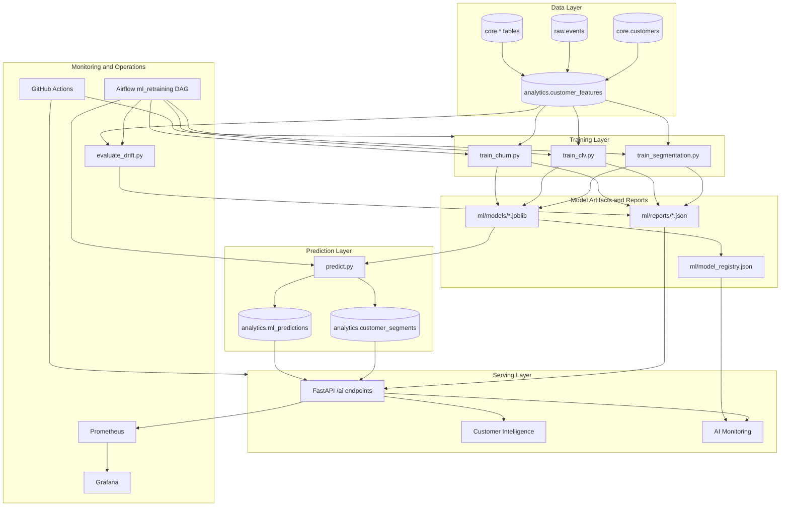
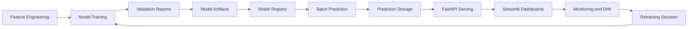
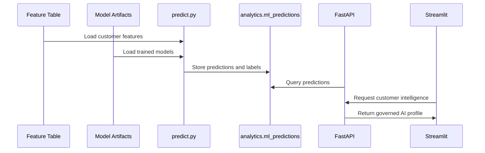
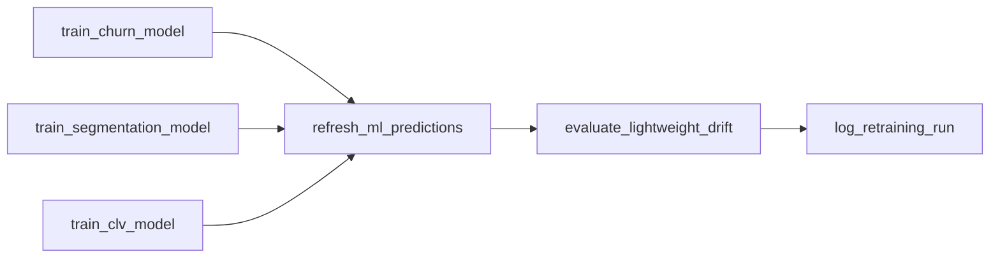
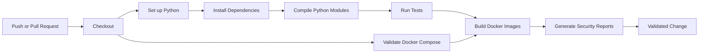
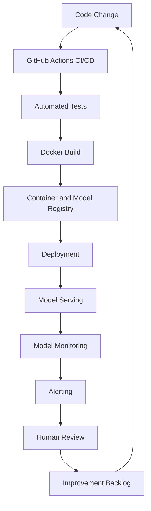

# RetailFlow AI Solution Design

## Block 4 — End-to-End Artificial Intelligence Solution

**Document type:** Official written deliverable  
**Scope:** AI solution design, model implementation, API serving, retraining, CI/CD, AI monitoring and responsible AI governance  
**Platform:** RetailFlow Platform  
**Language:** English  
**Updated version:** v3 — updated after final Streamlit, monitoring, CI/CD and consent-governance improvements  

---

## Table of Contents

1. Executive Summary
2. AI Solution Vision
3. Business Context
4. Scope of the AI Solution
5. Current Implementation Baseline
6. AI Architecture Overview
7. AI Lifecycle
8. Feature Engineering Layer
9. Churn Prediction Model
10. Customer Lifetime Value Model
11. Customer Segmentation Model
12. Prediction Persistence
13. Model Reports and Registry
14. FastAPI Serving Layer
15. Customer Intelligence Dashboard
16. AI Monitoring Dashboard
17. Airflow Retraining Workflow
18. Drift Monitoring
19. Responsible AI Principles
20. AI Governance Controls
21. Security and Privacy Considerations
22. Monitoring and Observability Integration
23. CI/CD and Security Validation
24. Testing Strategy and Robustness
25. Operational Runbook for AI
26. Evidence Matrix for Block 4
27. Limitations and Risk Awareness
28. Future Improvement Roadmap
29. Conclusion
30. Appendices

---

## 1. Executive Summary

I designed and implemented the AI layer of RetailFlow as an end-to-end customer intelligence capability for a modern retail e-commerce organization.

The objective is to transform customer behavior, transactional history and engagement signals into actionable and governed business intelligence.

The AI solution covers three complementary use cases.

| AI use case | Objective | Business value |
|---|---|---|
| Churn prediction | Estimate whether a customer may disengage or stop purchasing | Prioritize retention actions |
| Customer Lifetime Value estimation | Estimate the future value potential of a customer | Prioritize loyalty, upsell and retention investment |
| Customer segmentation | Group customers into interpretable behavioral segments | Support targeting, lifecycle marketing and portfolio analysis |

I implemented the solution as a platform capability rather than as isolated notebooks.

The AI layer is integrated with:

- PostgreSQL for feature storage and prediction persistence;
- Scikit-Learn for training and validation;
- model artifacts and JSON reports for traceability;
- FastAPI for AI serving endpoints;
- Streamlit for Customer Intelligence and AI Monitoring dashboards;
- Airflow for scheduled retraining, prediction refresh and drift evaluation;
- Prometheus and Grafana for operational observability;
- GitHub Actions for automated CI validation, Docker build checks and security reports;
- governance controls for consent-aware analytics and responsible AI usage.

The final AI lifecycle follows this path:

```text
Customer behavior
→ customer features
→ model training
→ model validation
→ model artifacts and reports
→ batch prediction
→ PostgreSQL persistence
→ FastAPI serving
→ Streamlit dashboards
→ monitoring and drift review
→ retraining workflow
```

This demonstrates how an AI solution can be industrialized inside a broader data platform.

---

## 2. AI Solution Vision

The vision of the RetailFlow AI solution is to make customer intelligence operational, explainable, monitorable and governed.

The AI layer must answer three categories of questions.

### 2.1 Business questions

- Which customers should be prioritized for retention?
- Which customers have the highest future value?
- Which customer segments require specific business actions?
- Which customers should receive lifecycle marketing, premium treatment or low-cost reactivation?
- How can business users translate model outputs into decisions?

### 2.2 Technical questions

- How are customer features generated?
- Where are model outputs persisted?
- Which model versions and reports are available?
- How are predictions served to dashboards?
- How are retraining runs logged?
- How is drift monitored?
- How are code changes validated before integration?

### 2.3 Governance questions

- Are AI outputs used in a consent-aware context?
- Are predictions hidden when analytics consent is missing?
- Can model outputs be traced back to artifacts and reports?
- Are dashboards clear enough for business users?
- Are limitations and future production hardening needs documented?

The guiding principle is:

> AI should support business decisions only when data eligibility, model lifecycle, monitoring and governance controls are visible and traceable.

---

## 3. Business Context

RetailFlow Platform is designed for e-commerce organizations that generate large volumes of behavioral and transactional data.

The platform uses data related to:

- customer profiles;
- orders;
- payments;
- returns;
- sessions;
- product views;
- cart events;
- checkout events;
- support tickets;
- product reviews;
- consent preferences;
- customer features;
- model predictions;
- customer segments.

For an e-commerce organization, customer intelligence needs are mainly related to retention, value, targeting and operational monitoring.

| Need | Business challenge | AI contribution |
|---|---|---|
| Retention | Detect customers likely to disengage | Churn scoring |
| Value management | Identify high-potential customers | CLV prediction |
| Targeting | Understand behavior patterns | Customer segmentation |
| Prioritization | Decide which action matters first | Combined AI profile |
| Monitoring | Ensure models remain reliable | Reports, drift and lifecycle evidence |

The AI layer addresses these needs through a structured ML architecture integrated into the platform.

---

## 4. Scope of the AI Solution

### 4.1 In scope

The AI solution includes:

- customer feature engineering;
- churn model training;
- CLV model training;
- segmentation model training;
- model artifact persistence;
- model report generation;
- model registry generation;
- batch prediction generation;
- prediction persistence in PostgreSQL;
- customer segment persistence;
- FastAPI AI serving endpoints;
- Customer Intelligence dashboard;
- AI Monitoring dashboard;
- consent-aware AI visualization;
- Airflow retraining workflow;
- retraining run logging;
- drift monitoring;
- CI/CD validation;
- automated security reports in CI;
- Streamlit evidence pages for academic proof;
- responsible AI principles.

### 4.2 Out of scope

The following elements are not part of the current implementation scope:

- enterprise IAM and SSO;
- role-based access control inside Streamlit;
- multi-region deployment;
- 24/7 on-call production organization;
- online inference for every click;
- advanced production feature store;
- managed enterprise model registry;
- automated model promotion workflow;
- automated campaign execution;
- advanced fairness dashboard;
- automated alert routing to Slack or email.

These items are future production hardening opportunities.

---

## 5. Current Implementation Baseline

The current implementation includes the following AI and MLOps assets.

| Capability | Current status | Main proof |
|---|---|---|
| Churn training | Implemented | `ml/src/train_churn.py` |
| CLV training | Implemented | `ml/src/train_clv.py` |
| Segmentation training | Implemented | `ml/src/train_segmentation.py` |
| Prediction refresh | Implemented | `ml/src/predict.py` |
| Model registry | Implemented as generated JSON registry | `ml/model_registry.json` |
| Model reports | Implemented | `ml/reports/*.json` |
| Drift report | Implemented | `ml/reports/drift_report.json` |
| Retraining log | Implemented | `ml/reports/retraining_runs.json` |
| AI serving | Implemented | FastAPI `/ai/*` endpoints |
| Customer Intelligence UI | Implemented and consent-aware | `streamlit_app/pages/3_Customer_Intelligence.py` |
| AI Monitoring UI | Implemented | `streamlit_app/pages/7_AI_Monitoring.py` |
| CI validation | Implemented | `.github/workflows/ci.yml` |
| Security reports | Implemented in CI | Bandit and pip-audit reports |

The final Streamlit implementation also includes a Project Evidence page with a Skills Evidence Matrix mapping block competencies to project proofs.

---

## 6. AI Architecture Overview

The AI architecture connects the analytical feature layer to training, prediction storage, API serving, dashboards and monitoring.



The architecture separates:

- feature production;
- model training;
- artifact management;
- prediction generation;
- prediction persistence;
- API serving;
- dashboard visualization;
- monitoring;
- orchestration;
- CI/CD validation.

---

## 7. AI Lifecycle

The lifecycle is repeatable and operational.



| Stage | Description | Output |
|---|---|---|
| Feature engineering | Build customer-level behavioral features | `analytics.customer_features` |
| Training | Train churn, CLV and segmentation models | `.joblib` artifacts |
| Validation | Evaluate model quality | JSON and TXT reports |
| Registry | Register model metadata | `ml/model_registry.json` |
| Prediction | Generate customer scores and segments | PostgreSQL prediction and segment tables |
| Serving | Expose AI outputs through API | `/ai/*` endpoints |
| Visualization | Display business and technical views | Streamlit dashboards |
| Monitoring | Track reports, drift and availability | AI Monitoring page |
| Retraining | Refresh models and predictions | Airflow `ml_retraining` DAG |

---

## 8. Feature Engineering Layer

### 8.1 Feature table

The main feature table is:

```text
analytics.customer_features
```

It contains customer-level features derived from transactional, behavioral and engagement data.

### 8.2 Feature families

| Feature family | Examples | Purpose |
|---|---|---|
| Purchase behavior | `total_orders`, `total_spent`, `avg_order_value` | Customer value and activity |
| Recency | `days_since_last_order` | Disengagement or inactivity |
| Returns | `return_rate` | Friction and return-prone behavior |
| Cart behavior | `cart_abandon_rate` | Checkout friction |
| Engagement | `session_count_30d`, `pages_viewed_30d` | Recent interest |
| Support | `support_tickets_count` | Customer service friction |
| Satisfaction | `avg_rating_given` | Approximate satisfaction |
| Price sensitivity | `discount_usage_rate` | Promotion sensitivity |
| Category preference | `preferred_category` | Targeting and segmentation |

### 8.3 Feature governance

The feature layer follows these principles:

- features are interpretable;
- features are customer-level;
- features are reusable across models;
- features are stored in a stable analytics schema;
- features support monitoring and reporting;
- customer-level AI usage must respect analytics consent in the interface.

---

## 9. Churn Prediction Model

### 9.1 Objective

The churn model estimates customer churn risk and supports retention prioritization.

It answers:

> Which customers should be prioritized for retention actions?

The model supports decisions but does not automatically execute campaigns.

### 9.2 Business use

The churn score supports:

- retention campaign prioritization;
- CRM follow-up;
- lifecycle marketing;
- early detection of disengagement.

### 9.3 Implementation

| Item | Value |
|---|---|
| Training script | `ml/src/train_churn.py` |
| Model artifact | `ml/models/churn_model.joblib` |
| Reports | `ml/reports/churn_model_report.json`, `ml/reports/churn_model_report.txt` |
| Prediction storage | `analytics.ml_predictions` |
| API serving | `/ai/customer/{customer_id}`, `/ai/churn-top` |
| Dashboard | Customer Intelligence and AI Monitoring |

### 9.4 Prediction labels

| Label | Interpretation | Business action |
|---|---|---|
| `low_risk` | Customer is not currently a high retention priority | Standard lifecycle engagement |
| `medium_risk` | Customer should be monitored | Soft retention action |
| `high_risk` | Customer requires attention | Targeted retention campaign |

### 9.5 Key metrics

| Metric | Purpose | Business interpretation |
|---|---|---|
| ROC AUC | Ranking ability | Can the model rank customers by risk? |
| F1 Score | Balance between precision and recall | Is risk detection balanced? |
| Precision | Reliability of positive alerts | Are predicted risky customers really risky? |
| Recall | Coverage of risky customers | How many risky customers are detected? |
| Brier Score | Probability calibration | Can probabilities be trusted? |

---

## 10. Customer Lifetime Value Model

### 10.1 Objective

The CLV model estimates the future value potential of each customer.

It answers:

> Which customers are expected to generate the highest future value?

### 10.2 Business use

The CLV model supports:

- loyalty program prioritization;
- upsell and cross-sell strategies;
- retention budget allocation;
- customer portfolio analysis.

### 10.3 Implementation

| Item | Value |
|---|---|
| Training script | `ml/src/train_clv.py` |
| Model artifact | `ml/models/clv_model.joblib` |
| Reports | `ml/reports/clv_model_report.json`, `ml/reports/clv_model_report.txt` |
| Prediction storage | `analytics.ml_predictions` |
| API serving | `/ai/customer/{customer_id}`, `/ai/clv-top` |
| Dashboard | Customer Intelligence and AI Monitoring |

### 10.4 Prediction labels

| Label | Interpretation | Business action |
|---|---|---|
| `low_value` | Lower estimated future value | Low-cost lifecycle campaigns |
| `medium_value` | Moderate estimated future value | Repeat purchase strategy |
| `high_value` | High estimated future value | VIP treatment, loyalty and retention priority |

### 10.5 Key metrics

| Metric | Purpose | Business interpretation |
|---|---|---|
| MAE | Average absolute prediction error | Average monetary deviation |
| RMSE | Penalizes large errors | Detects large mistakes on valuable customers |
| R² | Share of variance explained | Measures how well value differences are captured |

---

## 11. Customer Segmentation Model

### 11.1 Objective

The segmentation model groups customers into business-readable behavioral segments.

It answers:

> What types of customers exist in the customer base?

Segmentation is descriptive rather than directly predictive.

### 11.2 Implementation

| Item | Value |
|---|---|
| Training script | `ml/src/train_segmentation.py` |
| Model artifact | `ml/models/segmentation_model.joblib` |
| Reports | `ml/reports/segmentation_model_report.json`, `ml/reports/segmentation_model_report.txt` |
| Segment storage | `analytics.customer_segments` |
| API serving | `/ai/customer/{customer_id}`, `/ai/segments` |
| Dashboard | Customer Intelligence and AI Monitoring |

### 11.3 Business segments

| Segment | Interpretation | Recommended action |
|---|---|---|
| High Value Loyal Customers | Strong value and engagement | VIP loyalty and premium retention |
| Standard Active Customers | Balanced activity and value | Standard lifecycle marketing |
| Promo-Sensitive Browsers | Price-sensitive behavior | Targeted promotional campaigns |
| Return-Prone Customers | High return behavior | Improve product information and support |
| Dormant Low Value Customers | Low activity and low value | Low-cost reactivation |

### 11.4 Segment explorer

The Customer Intelligence page includes a segment explorer.

The segment view is filtered to customers with analytics consent.

This prevents the business-facing AI interface from displaying customer-level AI outputs for non-authorized customers.

---

## 12. Prediction Persistence

### 12.1 Prediction table

Churn and CLV predictions are stored in:

```text
analytics.ml_predictions
```

Segmentation assignments are stored in:

```text
analytics.customer_segments
```

### 12.2 Main prediction fields

| Field | Purpose |
|---|---|
| `prediction_id` | Unique prediction identifier |
| `customer_id` | Customer scored by the model |
| `model_name` | Model name such as `churn_model` or `clv_model` |
| `model_version` | Version used for prediction |
| `prediction_value` | Numeric model output |
| `prediction_label` | Business-readable label |
| `prediction_timestamp` | Timestamp of prediction generation |
| `input_features_hash` | Traceability hash of the input features |

### 12.3 Why predictions are stored

Stored predictions can be consumed by:

- FastAPI endpoints;
- Customer Intelligence dashboards;
- AI Monitoring dashboards;
- future reporting;
- future campaign automation;
- audit and traceability processes.



---

## 13. Model Reports and Registry

### 13.1 Report directory

Model reports are stored in:

```text
ml/reports/
```

### 13.2 Main reports

| Report | Purpose |
|---|---|
| `model_summary.json` | Consolidated model overview |
| `churn_model_report.json` | Churn metrics and model details |
| `clv_model_report.json` | CLV metrics and model details |
| `segmentation_model_report.json` | Segmentation report and cluster information |
| `drift_report.json` | Drift monitoring output |
| `retraining_runs.json` | Retraining execution evidence |

### 13.3 Model registry

The generated model registry is stored in:

```text
ml/model_registry.json
```

It documents model artifacts and metadata used by the AI Monitoring page.

Current registry maturity is practical and project-oriented.

It is not yet a full enterprise model registry with approval stages, model promotion, rollback and access controls.

### 13.4 Report value

The reports provide evidence for:

- model selection;
- validation metrics;
- feature importance;
- prediction distribution;
- drift monitoring;
- business interpretation;
- model traceability;
- retraining evidence.

---

## 14. FastAPI Serving Layer

### 14.1 Serving objective

FastAPI exposes AI outputs so that models can be consumed by dashboards and future applications.

The AI layer is therefore operational and API-based, not notebook-only.

### 14.2 Main AI endpoints

| Endpoint | Purpose |
|---|---|
| `GET /ai/summary` | Global prediction and segment summary |
| `GET /ai/churn-top` | Highest churn risk customers |
| `GET /ai/clv-top` | Highest predicted CLV customers |
| `GET /ai/segments` | Segment-level summary |
| `GET /ai/customers` | Enriched customer list with AI outputs and consent fields |
| `GET /ai/customer/{customer_id}` | Full AI profile for one customer |
| `GET /ai/model-reports` | Available model reports |
| `GET /ai/model-report/{report_name}` | Detailed model report content |

### 14.3 Governance endpoint used by AI Monitoring

The AI Monitoring page also uses:

```text
GET /governance/summary
```

This endpoint provides consent information, including:

```text
analytics_consent_count
```

The AI Monitoring page uses this value as the visible count for AI-authorized predictions.

### 14.4 Customer AI profile

The customer AI profile combines:

- customer attributes;
- analytics consent flag;
- churn prediction;
- CLV prediction;
- segment assignment;
- behavioral indicators.

The profile is displayed only when analytics consent is granted in the Customer Intelligence interface.

---

## 15. Customer Intelligence Dashboard

### 15.1 Purpose

The Customer Intelligence page is the business-facing AI dashboard.

It translates model outputs into decisions and recommended actions.

### 15.2 Main sections

The dashboard includes:

- business overview;
- decision framework;
- customer decision explorer;
- retention priorities;
- customer value;
- segment explorer;
- segment action guide;
- governance and technical evidence.

### 15.3 Consent-aware AI display

The customer explorer includes:

```text
Show only customers with analytics consent
```

This option is enabled by default.

When the option is disabled, all customers can be selected for governance demonstration.

However, if the selected customer does not have analytics consent, the dashboard hides:

- churn risk;
- predicted CLV;
- segmentation result;
- AI recommendation actions;
- raw AI profile.

The dashboard displays the message:

```text
Ce client n’a pas donné son consentement analytics. Les prédictions IA ne sont donc pas disponibles.
```

This implementation demonstrates a concrete governance control at the interface level.

### 15.4 Authorized customer views

Customer intelligence views are filtered to analytics-authorized customers.

The Segment tab no longer displays `avg_cart_abandon_rate` and `avg_discount_usage_rate` as segment-level visible columns, because the business view is kept focused on interpretable and useful decision fields.

### 15.5 Decision framework

The decision framework translates AI outputs into business priorities.

| Condition | Decision |
|---|---|
| High churn + high CLV | Premium retention priority |
| High churn | Targeted retention campaign |
| High CLV | Loyalty and upsell |
| Dormant segment | Low-cost reactivation |
| Promo-sensitive segment | Promotional offer |
| Standard customer | Lifecycle marketing |

### 15.6 Recommendations

Recommendations are based on:

- churn risk;
- CLV band;
- segment label;
- recency;
- cart abandonment;
- return rate.

The dashboard therefore turns AI outputs into operational business guidance.

---

## 16. AI Monitoring Dashboard

### 16.1 Purpose

The AI Monitoring page is the model-facing and MLOps-facing dashboard.

It answers:

> Are the AI outputs available, traceable, monitored and connected to governance?

### 16.2 Current main sections

The current AI Monitoring page includes:

- AI monitoring overview;
- AI use cases;
- prediction availability;
- model registry;
- training and retraining evidence;
- model reports;
- drift monitoring;
- MLOps controls;
- AI operational lifecycle;
- academic mapping;
- technical evidence.

### 16.3 Executive metrics

The overview displays:

| Metric | Source |
|---|---|
| Predicted customers | `analytics_consent_count` from `/governance/summary` |
| Prediction rows | Prediction freshness from `/ai/summary` |
| Registered models | `ml/model_registry.json` |
| Retraining runs | `ml/reports/retraining_runs.json` |

The use of `analytics_consent_count` connects AI Monitoring to data governance.

### 16.4 Prediction availability

The Prediction Availability table displays one row per AI use case.

| Model | Prediction rows value used | Business usage |
|---|---|---|
| `churn_model` | `analytics_consent_count` | Retention prioritization |
| `clv_model` | `analytics_consent_count` | Customer value prioritization |
| `segmentation_model` | `analytics_consent_count` | Marketing segmentation |

This avoids presenting segmentation as unavailable simply because segmentation is stored in a different table from churn and CLV predictions.

### 16.5 MLOps controls

The page includes the following controls.

| Control | Purpose | Evidence |
|---|---|---|
| Model versioning | Identify models and artifacts | `ml/model_registry.json` |
| Reproducible training | Trace scripts and reports | `ml/src/train_*.py`, `ml/reports/*.json` |
| Prediction serving | Expose AI outputs through API | `/ai/customer/{customer_id}` |
| Retraining | Refresh models and predictions | Airflow `ml_retraining`, `retraining_runs.json` |
| Drift monitoring | Detect changes in data distribution | `ml/reports/drift_report.json` |
| Robustness | Avoid regressions | Tests and GitHub Actions |

---

## 17. Airflow Retraining Workflow

### 17.1 Objective

The Airflow DAG `ml_retraining` automates the ML lifecycle.

It demonstrates that model training is not a one-off manual task.

### 17.2 DAG tasks

| Task | Command | Purpose |
|---|---|---|
| `train_churn_model` | `python -m ml.src.train_churn` | Retrain churn model |
| `train_segmentation_model` | `python -m ml.src.train_segmentation` | Retrain segmentation model |
| `train_clv_model` | `python -m ml.src.train_clv` | Retrain CLV model |
| `refresh_ml_predictions` | `python -m ml.src.predict` | Refresh predictions |
| `evaluate_lightweight_drift` | `python -m ml.src.evaluate_drift` | Generate drift report |
| `log_retraining_run` | `python -m ml.src.log_retraining_run` | Write retraining execution evidence |

### 17.3 Dependency structure



### 17.4 Retraining value

The retraining workflow supports:

- scheduled model refresh;
- prediction refresh;
- drift evaluation;
- operational visibility;
- repeatability;
- MLOps evidence.

---

## 18. Drift Monitoring

### 18.1 Objective

Drift monitoring detects whether customer behavior has changed compared with reference distributions.

The drift process helps identify when models may need review or retraining.

### 18.2 Implementation

| Item | Value |
|---|---|
| Drift script | `ml/src/evaluate_drift.py` |
| Drift report | `ml/reports/drift_report.json` |
| Dashboard | AI Monitoring > Drift monitoring |
| Orchestration | Airflow `ml_retraining` DAG |

### 18.3 Drift outputs

The drift report includes:

- global drift status;
- drifted feature count;
- threshold;
- feature-level drift records;
- monitoring timestamp.

### 18.4 Business impact

If drift increases, model reliability may decrease.

Appropriate responses include:

- reviewing feature distributions;
- validating model metrics;
- retraining models;
- adjusting thresholds;
- investigating business changes.

---

## 19. Responsible AI Principles

I designed the AI solution around responsible AI principles.

| Principle | RetailFlow implementation |
|---|---|
| Transparency | Model reports and evidence are visible |
| Explainability | Business labels and recommendations are shown |
| Human oversight | AI supports decisions, it does not execute campaigns automatically |
| Consent awareness | AI outputs are hidden without analytics consent |
| Monitoring | Reports, drift and retraining are available |
| Traceability | Predictions include model metadata and timestamps |
| Business alignment | Outputs are translated into decision actions |

### 19.1 Human oversight

The AI solution does not automatically contact customers or execute campaigns.

Business users remain responsible for final decisions.

### 19.2 Explainability

Explainability is supported through:

- business-readable labels;
- segment descriptions;
- recommendation logic;
- model reports;
- metric interpretation;
- Customer Intelligence decision framework.

### 19.3 Fairness and bias awareness

Potential risks include:

- over-targeting some customer groups;
- excluding customers based on incomplete behavior;
- allocating retention budget only by predicted value;
- over-interpreting segment labels;
- using AI outputs without consent.

Mitigations include:

- human oversight;
- visible governance rules;
- consent-aware display;
- model monitoring;
- business interpretation guides;
- limitations documented in official deliverables.

---

## 20. AI Governance Controls

### 20.1 Control table

| Control | Implementation |
|---|---|
| Model purpose | Churn, CLV and segmentation use cases are documented |
| Model versioning | Reports and registry document model artifacts |
| Prediction traceability | Predictions are stored in PostgreSQL |
| Consent-aware access | Customer Intelligence hides predictions when analytics consent is absent |
| Monitoring | AI Monitoring displays registry, reports, drift and retraining evidence |
| Retraining | Airflow `ml_retraining` DAG |
| CI/CD validation | GitHub Actions validates code, tests and builds |
| Security checks | Bandit and pip-audit reports are generated in CI |
| Business explainability | Recommendations and decision framework are visible |

### 20.2 AI risk register

| Risk | Description | Mitigation |
|---|---|---|
| Model drift | Customer behavior changes over time | Drift monitoring and retraining |
| Poor calibration | Scores may be overconfident | Metrics review and monitoring |
| False positives | Customers may be incorrectly classified as high risk | Human review and precision monitoring |
| False negatives | At-risk customers may be missed | Recall monitoring |
| Business misuse | Users may treat model output as final decision | Interpretation guides and human oversight |
| Consent misuse | AI outputs may be used without analytics consent | Interface-level blocking |
| Feature instability | Input distributions may shift | Drift report |
| CI regression | Code changes may break serving or reports | GitHub Actions validation |

### 20.3 AI governance maturity

| Dimension | Current maturity | Rationale |
|---|---|---|
| Model reporting | Advanced | JSON and TXT reports are generated |
| API serving | Advanced | AI outputs are exposed through FastAPI |
| Dashboard monitoring | Advanced | AI Monitoring page exists |
| Drift monitoring | Intermediate to advanced | Lightweight drift process exists |
| Model registry | Intermediate | Practical generated registry exists, but not enterprise-grade |
| Retraining | Advanced for demonstration | Airflow DAG and retraining log exist |
| CI/CD | Advanced for project stage | Tests, builds and security reports are automated |
| Responsible AI | Intermediate to advanced | Consent, explainability and oversight are integrated |

---

## 21. Security and Privacy Considerations

### 21.1 Customer data sensitivity

The AI layer uses customer-level behavioral and transactional features.

These features can reveal:

- purchase behavior;
- engagement level;
- return behavior;
- discount sensitivity;
- churn risk;
- value potential;
- segment membership.

### 21.2 Privacy controls

RetailFlow includes:

- analytics consent filtering;
- AI output blocking when analytics consent is absent;
- retention policies;
- anonymization workflow;
- governance audit logs;
- separation between governance, analytics and core schemas.

### 21.3 Data minimization

AI features remain focused on business-relevant signals.

The dashboard avoids exposing unnecessary sensitive details in business views.

### 21.4 Security roadmap

Future improvements include:

- API authentication;
- role-based access control;
- service-level authorization;
- audit logging for AI endpoint access;
- advanced secrets management;
- model artifact access controls.

---

## 22. Monitoring and Observability Integration

### 22.1 Platform observability

FastAPI metrics are exposed through:

```text
/metrics
```

Prometheus collects platform metrics.

Grafana visualizes operational health.

The Streamlit Observability page consolidates:

- Prometheus targets;
- alert rules;
- Grafana dashboard links;
- platform status indicators;
- technical evidence.

### 22.2 Monitoring types

| Monitoring type | Purpose | Tooling |
|---|---|---|
| AI monitoring | Model registry, reports, drift and retraining evidence | AI Monitoring page |
| API monitoring | Request count, latency and errors | FastAPI metrics, Prometheus |
| Database monitoring | PostgreSQL availability and metrics | PostgreSQL exporter, Prometheus |
| Platform monitoring | Service status and dashboards | Streamlit Observability, Grafana |
| CI monitoring | Test, build and security validation | GitHub Actions |

### 22.3 Alerting integration

Prometheus alert rules are implemented for platform operations, including:

- FastAPI availability;
- PostgreSQL exporter availability;
- FastAPI latency;
- FastAPI error rate;
- PostgreSQL connection pressure.

AI-specific alerting is identified as a future improvement, especially for drift, stale reports and failed retraining runs.

---

## 23. CI/CD and Security Validation

### 23.1 Objective

GitHub Actions validates the RetailFlow platform and AI solution before changes are considered stable.

The CI/CD workflow supports:

- syntax validation;
- automated tests;
- Docker Compose validation;
- Docker image build validation;
- non-interactive security report generation;
- repository consistency checks.

### 23.2 Workflow file

The CI workflow is implemented in:

```text
.github/workflows/ci.yml
```

### 23.3 CI jobs

| Job area | Purpose |
|---|---|
| Python validation | Install dependencies, compile Python modules and run tests |
| Docker Compose validation | Validate deployment configuration |
| Docker build validation | Build FastAPI, Streamlit and event consumer images |
| Security reports | Run automated security checks and produce report artifacts |
| Repository checks | Validate expected project structure and files |

### 23.4 Security reports

The CI produces security-oriented reports such as:

- Bandit report for common Python security-sensitive patterns;
- pip-audit report for Python dependency vulnerabilities.

These reports support security awareness and continuous improvement.

### 23.5 CI/CD diagram



### 23.6 Current CD boundary

The current workflow validates readiness but does not automatically deploy to production Kubernetes or a cloud environment.

The next production step would be:

```text
Docker image build
→ container registry push
→ Kubernetes deployment
→ production smoke tests
→ monitored rollout
```

---

## 24. Testing Strategy and Robustness

### 24.1 Testing objectives

The testing strategy ensures that AI and platform components remain stable across changes.

It covers:

- API behavior;
- data quality logic;
- ML report availability;
- model registry compatibility;
- robustness checks;
- CI validation.

### 24.2 Current test areas

| Test area | Purpose |
|---|---|
| API tests | Validate core FastAPI contract |
| Data quality tests | Validate event quality rules and rejection behavior |
| ML tests | Validate model reports and artifacts |
| Registry tests | Validate generated registry compatibility |
| Robustness tests | Validate behavior on edge cases |
| Compile checks | Detect syntax errors across modules |

### 24.3 CI-compatible testing

The automated tests are intentionally lightweight and CI-friendly.

They do not require a live production database, Redpanda broker or full Airflow runtime.

This keeps the CI stable while validating important project contracts.

### 24.4 Recommended expansion

Future test expansion should include:

- AI endpoint integration tests with temporary PostgreSQL;
- Streamlit smoke tests;
- Airflow DAG validation;
- drift report schema validation;
- end-to-end event ingestion tests;
- production smoke tests after deployment.

---

## 25. Operational Runbook for AI

### 25.1 Manual training commands

Churn model:

```bash
python -m ml.src.train_churn
```

CLV model:

```bash
python -m ml.src.train_clv
```

Segmentation model:

```bash
python -m ml.src.train_segmentation
```

Prediction refresh:

```bash
python -m ml.src.predict
```

Drift evaluation:

```bash
python -m ml.src.evaluate_drift
```

Model registry generation:

```bash
python -m ml.src.generate_model_registry
```

Retraining run logging:

```bash
python -m ml.src.log_retraining_run
```

### 25.2 API validation commands

AI summary:

```bash
curl -s "http://127.0.0.1:8000/ai/summary" | python -m json.tool
```

Governance summary:

```bash
curl -s "http://127.0.0.1:8000/governance/summary" | python -m json.tool
```

Customer list with analytics consent:

```bash
curl -s "http://127.0.0.1:8000/ai/customers?limit=3&analytics_consent_only=true" | python -m json.tool
```

Customer AI profile:

```bash
curl -s "http://127.0.0.1:8000/ai/customer/cust_000001" | python -m json.tool
```

### 25.3 Dashboard validation

Validate:

- Customer Intelligence page;
- AI Monitoring page;
- Data Governance page;
- Observability page;
- Project Evidence page;
- Airflow DAG status;
- FastAPI Swagger UI;
- GitHub Actions status.

### 25.4 Docker and Streamlit validation

```bash
python -m compileall streamlit_app

docker compose config --quiet

docker compose up -d --build streamlit

curl -i http://localhost:8501/_stcore/health
```

---

## 26. Evidence Matrix for Block 4

| Block 4 expectation | RetailFlow evidence | Where to show |
|---|---|---|
| AI use case definition | Churn, CLV and segmentation are documented and implemented | Customer Intelligence, AI Monitoring |
| Model implementation | Training scripts and model artifacts exist | `ml/src/`, `ml/models/` |
| Model quality | JSON reports include model metrics | `ml/reports/`, AI Monitoring |
| Explainability | Decision framework and recommendations translate outputs | Customer Intelligence |
| API serving | AI endpoints expose predictions and profiles | FastAPI `/docs` |
| Integration | Streamlit consumes FastAPI AI endpoints | Customer Intelligence, AI Monitoring |
| Consent-aware AI | Predictions hidden without analytics consent | Customer Intelligence |
| MLOps evidence | Registry, reports, drift and retraining log are visible | AI Monitoring |
| Retraining | Airflow DAG refreshes models and predictions | Airflow `ml_retraining` |
| Drift monitoring | Drift report generated and displayed | AI Monitoring |
| CI/CD | Tests, builds and security reports run in GitHub Actions | GitHub Actions |
| Documentation | Official deliverables and Project Evidence page | Markdown docs, Streamlit Project Evidence |

---

## 27. Limitations and Risk Awareness

### 27.1 Current limitations

| Limitation | Explanation |
|---|---|
| Local runtime | The current runtime is Docker Compose, not production Kubernetes |
| No enterprise IAM | Authentication and RBAC are future improvements |
| Practical model registry | The registry is generated JSON, not a full enterprise registry |
| No automated model promotion | Model approval and promotion workflow are not automated |
| Lightweight drift monitoring | Drift exists but can be extended for production |
| No automatic AI alert escalation | Alert routing to Slack/email is not implemented |
| No online per-click inference | Current design uses batch predictions served through API |
| No advanced fairness dashboard | Fairness risks are documented but not fully automated |

### 27.2 Why these limitations are acceptable for the project

The current implementation demonstrates the core requirements of an industrialized AI solution:

- model training;
- validation;
- report generation;
- model artifacts;
- prediction persistence;
- API serving;
- business dashboarding;
- governance control;
- retraining automation;
- drift monitoring;
- CI/CD validation.

The limitations mainly concern enterprise production hardening.

### 27.3 Risk reduction

I reduced AI risks through:

- validation metrics;
- model reports;
- registry metadata;
- drift monitoring;
- analytics consent blocking;
- human-readable decisions;
- Airflow retraining;
- CI tests;
- security report generation;
- monitoring dashboards.

---

## 28. Future Improvement Roadmap

| Improvement | Value |
|---|---|
| Enterprise model registry | Stronger versioning, promotion and rollback workflow |
| Advanced drift monitoring | More robust production ML monitoring |
| Online feature service | Lower-latency personalization and scoring |
| Recommendation engine | Next-best-product or next-best-action |
| Campaign feedback loop | Measure effectiveness of AI-driven actions |
| Fairness analysis dashboard | Stronger responsible AI validation |
| API authentication | Secure AI endpoints |
| Role-based dashboard access | Control visibility by business role |
| Model rollback workflow | Safer production operations |
| AI alerting | Notify teams on drift or failed retraining |
| Cloud deployment | Move from Docker Compose to Kubernetes or managed services |

### 28.1 Target future MLOps architecture



---

## 29. Conclusion

I designed the RetailFlow AI solution as an end-to-end MLOps and customer intelligence layer integrated into the broader RetailFlow Platform.

The solution demonstrates how an e-commerce organization can move from customer behavior to governed business decision support.

The AI layer includes:

- churn prediction;
- customer lifetime value estimation;
- customer segmentation;
- feature engineering;
- model reports;
- model registry;
- prediction persistence;
- FastAPI serving;
- Customer Intelligence dashboard;
- AI Monitoring dashboard;
- consent-aware AI controls;
- Airflow retraining;
- drift monitoring;
- GitHub Actions CI/CD;
- automated security reports;
- responsible AI principles;
- governance-aware customer intelligence.

The final result is not only a set of ML models.

It is a platform capability connecting data engineering, governance, AI, monitoring and business decision-making.

---

## 30. Appendices

### Appendix A — AI Component Inventory

| Component | Path / location | Role |
|---|---|---|
| Churn training | `ml/src/train_churn.py` | Train churn model |
| CLV training | `ml/src/train_clv.py` | Train CLV model |
| Segmentation training | `ml/src/train_segmentation.py` | Train segmentation model |
| Prediction generation | `ml/src/predict.py` | Refresh predictions |
| Drift evaluation | `ml/src/evaluate_drift.py` | Generate drift report |
| Model registry generation | `ml/src/generate_model_registry.py` | Generate model registry |
| Retraining logging | `ml/src/log_retraining_run.py` | Log retraining runs |
| ML utilities | `ml/src/ml_utils.py` | Shared ML utilities |
| Feature building | `ml/src/build_features.py` | Feature preparation |
| Churn artifact | `ml/models/churn_model.joblib` | Persisted churn model |
| CLV artifact | `ml/models/clv_model.joblib` | Persisted CLV model |
| Segmentation artifact | `ml/models/segmentation_model.joblib` | Persisted segmentation model |
| Prediction table | `analytics.ml_predictions` | Churn and CLV outputs |
| Segment table | `analytics.customer_segments` | Segment assignments |
| API route | `api/app/routes/ai.py` | AI serving endpoints |
| Customer dashboard | `streamlit_app/pages/3_Customer_Intelligence.py` | Business AI UI |
| AI dashboard | `streamlit_app/pages/7_AI_Monitoring.py` | MLOps monitoring UI |
| Evidence dashboard | `streamlit_app/pages/10_Project_Evidence.py` | Academic proof matrix |
| Retraining DAG | `airflow/dags/ml_retraining.py` | Scheduled ML workflow |
| CI workflow | `.github/workflows/ci.yml` | Automated validation |

### Appendix B — Model Report Checklist

#### Churn report

- model name;
- model version;
- selected model;
- class distribution;
- holdout metrics;
- ROC AUC;
- F1;
- precision;
- recall;
- Brier score;
- feature importance;
- cross-validation results.

#### CLV report

- model name;
- model version;
- selected model;
- target summary;
- holdout metrics;
- MAE;
- RMSE;
- R²;
- feature importance;
- cross-validation results.

#### Segmentation report

- selected K;
- selection metric;
- cluster summary;
- business labels;
- cluster sizes;
- K evaluation.

#### Drift report

- overall drift status;
- drifted feature count;
- threshold;
- feature-level drift records;
- monitoring timestamp.

### Appendix C — AI Endpoint Contract Overview

| Endpoint | Purpose |
|---|---|
| `GET /ai/summary` | Return global prediction and segmentation summary |
| `GET /ai/churn-top` | Return customers ranked by churn probability |
| `GET /ai/clv-top` | Return customers ranked by predicted CLV |
| `GET /ai/segments` | Return customer segment summaries |
| `GET /ai/customers` | Return enriched customer records with consent fields and AI outputs |
| `GET /ai/customer/{customer_id}` | Return full AI profile for a customer |
| `GET /ai/model-reports` | Return list of model reports |
| `GET /ai/model-report/{report_name}` | Return one detailed model report |
| `GET /governance/summary` | Return governance and consent summary used by AI Monitoring |

### Appendix D — Streamlit AI Pages

| Page | Role |
|---|---|
| `3_Customer_Intelligence.py` | Business-facing AI decisions, consent-aware customer exploration and recommendations |
| `7_AI_Monitoring.py` | MLOps dashboard for registry, reports, retraining, drift and prediction availability |
| `10_Project_Evidence.py` | Final project evidence and skills matrix |

### Appendix E — Final Validation Commands

```bash
python -m compileall streamlit_app

docker compose config --quiet

docker compose up -d --build streamlit

curl -i http://localhost:8501/_stcore/health

git status

git log --oneline -5
```
