---


# RetailFlow — Executive Context and Integrated Project Presentation

## End-to-End Retail Intelligence Platform

**Real-Time Data Pipelines • AI-Powered Customer Intelligence • Data Governance • Observability**

---

## Document Purpose

This document presents the general context, business positioning, scope, architecture vision and integrated storyline of the RetailFlow project.

It is designed as the introductory part of a broader set of official project deliverables structured around five documents:

1. **Executive Context and Integrated Project Presentation**
2. **Data Governance Plan**
3. **Data Architecture Design**
4. **Real-Time Data Pipeline Design**
5. **Artificial Intelligence Solution Design**

The objective of this first document is to explain why RetailFlow was designed, what business problem it addresses, how the platform is structured, and how the four major capability areas connect into one coherent data product.

RetailFlow is not presented as a set of isolated technical components. I designed it as an integrated Retail Intelligence platform where customer events become governed data, governed data becomes customer intelligence, and customer intelligence becomes operational decision support.

---

# 1. Executive Summary

RetailFlow is a recently established company developing the **RetailFlow Platform**, an end-to-end Retail Intelligence solution for modern e-commerce organizations.

The platform is designed for retailers that need to transform large volumes of customer, product, transactional and behavioral data into reliable business insights, operational monitoring and AI-powered customer intelligence.

The main idea behind RetailFlow is simple:

```text
Customer behavior
        ↓
Real-time event ingestion
        ↓
Governed and quality-controlled data
        ↓
Customer intelligence models
        ↓
Business decision support
        ↓
Continuous monitoring and improvement
```

I designed RetailFlow to demonstrate how a modern data platform can combine:

- data governance;
- data architecture;
- real-time data pipelines;
- machine learning;
- API serving;
- orchestration;
- observability;
- dashboard-based business interaction.

The platform supports a multi-category e-commerce scenario where customer interactions generate events such as product views, cart actions and checkout events. These events are ingested through a streaming architecture, validated, persisted, transformed into analytical features, used by machine learning models and exposed to business users through dashboards and APIs.

RetailFlow therefore answers a central question:

> How can a modern e-commerce data platform combine real-time data pipelines, artificial intelligence, governance and observability in order to improve business decision-making?

To answer this question, I implemented RetailFlow as a complete platform using Docker Compose, PostgreSQL, Redpanda, FastAPI, Airflow, Streamlit, Prometheus, Grafana, Scikit-Learn and GitHub Actions.

---

# 2. Business Storytelling

## 2.1 Company Context

RetailFlow is a company that has recently entered the Retail Intelligence market.

Its product, the **RetailFlow Platform**, is designed for e-commerce organizations that operate across several product categories and want to better understand their customers, monitor their operations and industrialize their use of data and artificial intelligence.

The platform is demonstrated through the scenario of a multi-category retail e-commerce company.

This company generates data from:

- customer profiles;
- product catalogs;
- browsing sessions;
- product views;
- cart interactions;
- checkout flows;
- orders;
- payments;
- returns;
- reviews;
- support tickets;
- consent preferences;
- customer intelligence models;
- monitoring systems.

In this context, the key business challenge is not the absence of data. The challenge is the ability to transform this data into trusted, governed and actionable intelligence.

---

## 2.2 Business Problem

A modern e-commerce organization can face several data-related problems:

| Challenge | Business Impact |
|---|---|
| Fragmented customer data | Teams cannot easily build a unified view of customer behavior. |
| Uncontrolled event flows | Invalid events can affect reporting, analytics and ML models. |
| Limited customer intelligence | Marketing teams cannot reliably identify churn risks or high-value customers. |
| Weak governance | Consent, retention, privacy and auditability become difficult to control. |
| Poor model monitoring | AI outputs may become unreliable if model performance and drift are not monitored. |
| Low observability | Operational failures may remain invisible until they affect business users. |

RetailFlow addresses these problems by integrating data engineering, governance, machine learning and monitoring into a single architecture.

---

## 2.3 RetailFlow Storyline

The storyline of RetailFlow follows a logical platform journey.

A customer interacts with an e-commerce interface. These interactions generate events. The events are sent to a real-time pipeline. The pipeline validates them, stores valid events and isolates invalid events. The platform then uses governed data to create customer features, train models and expose intelligence through dashboards.

The same platform also monitors infrastructure health, API behavior, database status and ML drift.

The complete storyline is:

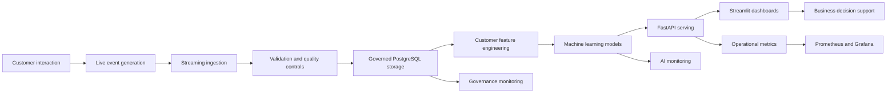

This design shows that RetailFlow is not only a dashboard and not only a machine learning project. It is a complete platform combining product thinking, data architecture, governance, AI and operations.

---

# 3. Product Vision

## 3.1 Vision Statement

The vision of RetailFlow is:

> To transform customer events into trusted data, trusted data into customer intelligence, and customer intelligence into measurable business decisions.

This vision is implemented through an end-to-end platform covering the full lifecycle of data:

```text
Generate
→ Ingest
→ Validate
→ Govern
→ Store
→ Transform
→ Predict
→ Serve
→ Monitor
→ Improve
```

---

## 3.2 Product Positioning

RetailFlow is positioned as a **Retail Intelligence Platform**.

It helps e-commerce organizations answer questions such as:

- Which customers are most likely to churn?
- Which customers have the highest future value?
- Which customer segments should receive specific business actions?
- Are customer events being processed correctly?
- Are data quality problems visible and traceable?
- Are customer data usages aligned with consent?
- Are the AI models monitored and explainable?
- Is the technical platform observable?

RetailFlow connects customer behavior, data governance, machine learning and operational monitoring into one integrated product.

---

## 3.3 Value Proposition

RetailFlow creates value for several types of stakeholders.

### Business teams

RetailFlow helps business teams:

- identify high-value customers;
- detect churn risk;
- understand customer segments;
- prioritize retention actions;
- support marketing campaigns;
- interpret customer intelligence outputs.

### Data teams

RetailFlow helps data teams:

- capture events reliably;
- validate incoming data;
- isolate invalid records;
- structure data into business domains;
- expose trusted datasets;
- monitor data quality.

### AI teams

RetailFlow helps AI teams:

- train customer models;
- monitor performance;
- analyze feature importance;
- detect drift;
- serve predictions through APIs;
- connect models to business workflows.

### Platform teams

RetailFlow helps platform teams:

- monitor service health;
- inspect API metrics;
- observe database status;
- visualize Prometheus metrics in Grafana;
- use alerting rules;
- verify orchestration workflows.

---

# 4. Project Objectives

I designed RetailFlow around seven main objectives.

## Objective 1 — Build an end-to-end Retail Intelligence platform

The first objective was to build a coherent platform rather than a set of disconnected tools.

RetailFlow connects:

- customer event generation;
- event streaming;
- data validation;
- PostgreSQL storage;
- governance tables;
- feature engineering;
- machine learning;
- API serving;
- dashboards;
- monitoring.

---

## Objective 2 — Implement real-time customer event ingestion

The second objective was to demonstrate how customer-facing actions can be converted into events and ingested by a streaming pipeline.

The platform supports events such as:

- product views;
- add-to-cart actions;
- checkout starts;
- purchases.

These events are published through FastAPI and processed through Redpanda and a Python consumer.

---

## Objective 3 — Operationalize data governance by design

Because RetailFlow is a recently established company, I designed the governance framework from the beginning instead of adding governance after the platform was already built.

This allowed me to integrate governance principles directly into:

- database schemas;
- consent management;
- data retention;
- anonymization;
- quality controls;
- audit logs;
- dashboards;
- AI usage rules.

This is a **Data Governance by Design** approach.

---

## Objective 4 — Provide customer intelligence through AI

The fourth objective was to transform customer behavior into actionable intelligence.

RetailFlow includes three customer intelligence models:

| Model | Purpose |
|---|---|
| Churn prediction | Identify customers at risk of leaving or disengaging. |
| CLV prediction | Estimate customer lifetime value. |
| Customer segmentation | Group customers into business-readable profiles. |

These models support decisions related to retention, loyalty, campaign targeting and customer prioritization.

---

## Objective 5 — Make data quality visible and traceable

Invalid events should not silently contaminate analytical tables or model inputs.

I implemented a data quality approach based on:

- validation rules;
- rejected events;
- dead-letter storage;
- quality logs;
- severity levels;
- dashboard visibility.

This makes data quality operational and auditable.

---

## Objective 6 — Monitor both the platform and the models

RetailFlow includes monitoring at two levels.

### Platform observability

- FastAPI health;
- PostgreSQL health;
- Prometheus targets;
- Grafana dashboards;
- Airflow health;
- PostgreSQL exporter metrics;
- alerting rules.

### AI monitoring

- model metrics;
- feature importance;
- prediction distribution;
- drift monitoring;
- cross-validation details;
- model reports.

---

## Objective 7 — Provide a clear demonstration and decision-support interface

The Streamlit interface was designed as a guided platform experience.

It includes:

- Platform Overview;
- Customer View;
- Customer Intelligence;
- Data Governance;
- Data Quality;
- AI Monitoring;
- Observability.

This navigation follows the logic of the platform and makes it possible to explain the end-to-end value of RetailFlow.

---

# 5. Project Scope

## 5.1 In Scope

The RetailFlow project includes the following capabilities.

### Data Governance

- consent management;
- retention policies;
- anonymization workflow;
- governance audit logs;
- data quality logs;
- dead-letter events;
- governance KPIs;
- risk register;
- governance operating model;
- AI governance principles.

### Data Architecture

- Docker Compose architecture;
- PostgreSQL database;
- multi-schema data model;
- FastAPI backend;
- Streamlit user interface;
- Redpanda event broker;
- Airflow orchestration;
- Prometheus monitoring;
- Grafana dashboards;
- PostgreSQL exporter;
- GitHub Actions CI/CD.

### Real-Time Data Pipelines

- event generation;
- event publishing;
- streaming ingestion;
- validation rules;
- event persistence;
- dead-letter handling;
- quality monitoring;
- pipeline orchestration.

### AI and MLOps

- churn model;
- CLV model;
- segmentation model;
- model reports;
- predictions stored in PostgreSQL;
- FastAPI serving;
- Streamlit AI dashboards;
- drift monitoring;
- Airflow retraining workflow;
- GitHub Actions CI/CD for test and deployment workflow.

### Observability

- FastAPI metrics;
- Prometheus scraping;
- Grafana dashboards;
- PostgreSQL exporter;
- Airflow health checks;
- documented alerting rules;
- Streamlit observability page.

---

## 5.2 Out of Scope

The following capabilities are considered outside the current scope of RetailFlow.

| Out-of-scope area | Reason |
|---|---|
| Enterprise Identity and Access Management | RetailFlow currently focuses on platform architecture and governance controls, not enterprise IAM integration. |
| Single Sign-On | Authentication federation is a future enterprise extension. |
| Multi-region deployment | The current architecture is designed for local reproducibility and clear platform demonstration. |
| 24/7 production support and on-call operations | Operational runbooks and alerts are documented, but full production support organization is outside the current scope. |
| Full enterprise data catalog platform | Data cataloging is included as a future improvement rather than a fully deployed enterprise catalog. |
| Advanced MDM platform | Core customer and product entities are modeled, but a full dedicated MDM platform is not implemented. |

This scoping decision keeps the project realistic while preserving a clear production evolution path.

---

# 6. Integrated Capability Map

RetailFlow is structured around four major capability domains.

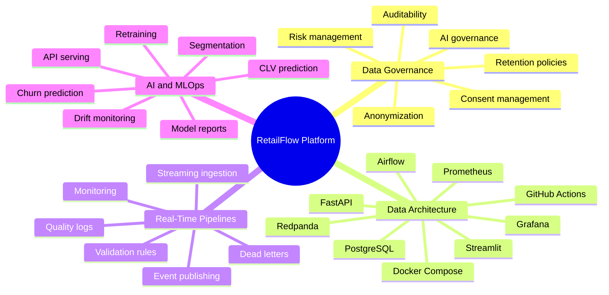

---

## 6.1 Capability Summary

| Capability | Main question answered | Main RetailFlow implementation |
|---|---|---|
| Data Governance | How is data controlled, compliant and auditable? | Governance schema, consent flags, retention policies, anonymization, logs, dashboard. |
| Data Architecture | How is the infrastructure designed and deployed? | Docker Compose, PostgreSQL, Redpanda, FastAPI, Streamlit, Airflow, Prometheus, Grafana. |
| Real-Time Pipelines | How are customer events ingested and monitored? | FastAPI producer, Redpanda, Python consumer, validators, dead-letter events. |
| AI and MLOps | How is customer intelligence modeled, served and monitored? | Churn, CLV, segmentation, model reports, FastAPI endpoints, AI monitoring dashboard. |

---

# 7. Global Architecture

## 7.1 Architecture Overview

RetailFlow is deployed as a modular platform.

Each service has a clearly defined role.

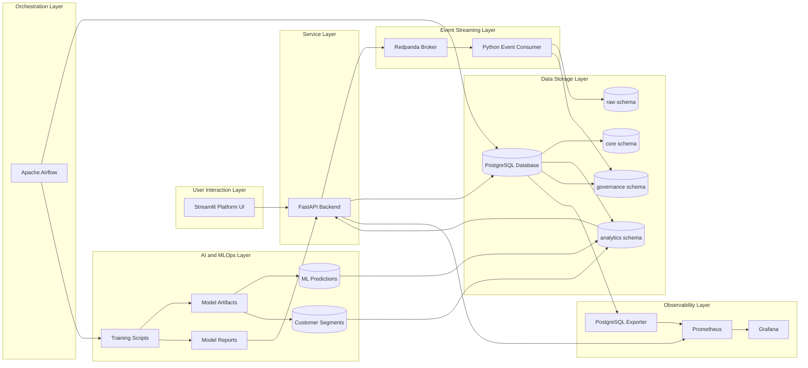

---

## 7.2 Event-to-Decision Flow

The following diagram summarizes the complete path from customer interaction to decision support.

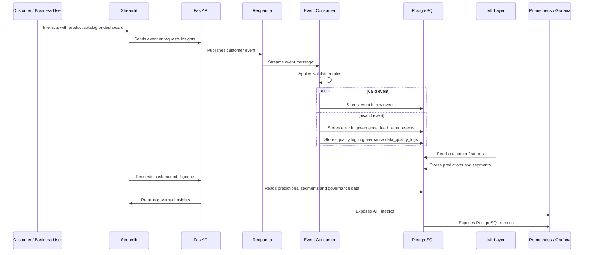

---

## 7.3 Architecture Principles

I designed RetailFlow around several architecture principles.

### Modularity

Each component is responsible for a specific function:

- Streamlit for interaction;
- FastAPI for services;
- Redpanda for event streaming;
- PostgreSQL for persistence;
- Airflow for orchestration;
- Scikit-Learn for ML;
- Prometheus and Grafana for monitoring.

### Separation of concerns

The architecture separates:

- UI;
- API;
- streaming;
- data quality;
- storage;
- analytics;
- governance;
- ML;
- monitoring.

This makes the platform easier to maintain and explain.

### Governance by design

Governance is embedded in the architecture through:

- consent fields;
- retention policies;
- anonymization workflow;
- quality logs;
- dead-letter events;
- audit trail;
- governed dashboards.

### Observability by design

Monitoring is implemented through:

- health endpoints;
- metrics endpoints;
- Prometheus scrape configuration;
- Grafana dashboards;
- PostgreSQL exporter;
- alerting rules.

### AI as a platform capability

AI is not isolated in notebooks.

Models are:

- trained;
- persisted;
- reported;
- stored in PostgreSQL;
- served through APIs;
- visualized in Streamlit;
- monitored for drift and performance.

---

# 8. Platform Components

## 8.1 Component Summary

| Component | Technology | Purpose |
|---|---|---|
| User interface | Streamlit | Platform navigation, dashboards and live demo. |
| Backend API | FastAPI | Service layer, event publication, governance and AI APIs. |
| Database | PostgreSQL | Central storage for raw, core, analytics and governance data. |
| Streaming broker | Redpanda | Kafka-compatible event ingestion. |
| Event consumer | Python | Event validation and persistence. |
| Orchestration | Apache Airflow | Scheduled workflows for quality, sales, ML and retention. |
| ML layer | Scikit-Learn | Churn, CLV and segmentation models. |
| Monitoring | Prometheus | Metrics collection. |
| Dashboards | Grafana | Operational observability. |
| Database monitoring | PostgreSQL Exporter | PostgreSQL metrics. |
| Containerization | Docker Compose | Local multi-service deployment. |
| CI/CD | GitHub Actions | Automated test, validation and deployment workflow. |

---

## 8.2 Streamlit

Streamlit is the user-facing platform interface.

I use it to provide:

- a guided platform overview;
- customer journey simulation;
- business intelligence dashboards;
- governance dashboards;
- data quality views;
- AI monitoring pages;
- observability pages.

The Streamlit platform follows a narrative flow:

```text
Platform Overview
→ Customer View
→ Customer Intelligence
→ Data Governance
→ Data Quality
→ AI Monitoring
→ Observability
```

---

## 8.3 FastAPI

FastAPI acts as the backend service layer.

It exposes:

- product endpoints;
- event endpoints;
- quality endpoints;
- governance endpoints;
- AI endpoints;
- health checks;
- metrics.

FastAPI is also responsible for publishing events to Redpanda when customer interactions are generated from the UI.

---

## 8.4 PostgreSQL

PostgreSQL is the central data platform.

It is organized into several schemas:

| Schema | Purpose |
|---|---|
| `raw` | Event-level and ingestion-oriented data. |
| `core` | Clean business entities such as customers, orders and products. |
| `analytics` | Features, predictions, segments and aggregates. |
| `governance` | Consent, retention, quality, dead letters and audit logs. |

This structure supports both operational and analytical use cases.

---

## 8.5 Redpanda

Redpanda is used as a Kafka-compatible broker.

It supports the real-time event architecture without requiring a full Kafka/Zookeeper setup.

The main event flow is:

```text
FastAPI producer
→ Redpanda topic
→ Python consumer
→ PostgreSQL
```

---

## 8.6 Airflow

Airflow orchestrates recurring workflows.

The platform includes four core DAGs:

| DAG | Schedule | Purpose |
|---|---|---|
| `daily_sales_aggregation` | Daily | Refreshes analytical sales aggregates. |
| `daily_data_quality` | Daily | Checks data quality and dead-letter counts. |
| `ml_retraining` | Weekly | Retrains models, refreshes predictions and evaluates drift. |
| `retention_cleanup` | Weekly | Applies governance retention and anonymization logic. |

---

## 8.7 Prometheus and Grafana

Prometheus collects platform metrics.

Grafana visualizes them.

The monitoring layer covers:

- FastAPI metrics;
- PostgreSQL metrics;
- service availability;
- API behavior;
- alerting rules;
- platform dashboards.

---

## 8.8 GitHub Actions CI/CD

I implemented GitHub Actions as the CI/CD layer of the project.

The expected production workflow includes:

```text
push / pull request
→ dependency installation
→ linting and static checks
→ unit tests
→ API tests
→ data quality tests
→ ML report structure tests
→ Docker build validation
→ deployment-ready artifact validation
```

This CI/CD layer supports quality control and prevents regressions when the platform evolves.

---

# 9. Data Domains

RetailFlow covers several business and technical domains.

## 9.1 Customer Domain

Customer data includes:

- customer profile;
- geographic information;
- loyalty status;
- account status;
- consent flags;
- behavioral features;
- churn score;
- CLV score;
- segment assignment.

## 9.2 Product Domain

Product data includes:

- product catalog;
- product categories;
- prices;
- suppliers;
- product interactions.

## 9.3 Order Domain

Order data includes:

- orders;
- order items;
- payments;
- shipments;
- returns;
- refunds.

## 9.4 Behavioral Event Domain

Event data includes:

- product views;
- cart actions;
- checkout actions;
- purchase events;
- session behavior.

## 9.5 Governance Domain

Governance data includes:

- consent records;
- retention policies;
- anonymization logs;
- quality logs;
- dead-letter events;
- audit trail.

## 9.6 AI Domain

AI data includes:

- model inputs;
- model reports;
- predictions;
- segments;
- feature importance;
- drift metrics.

---

# 10. Current Platform Maturity

Because RetailFlow was recently created, I had the opportunity to design governance, quality, observability and AI monitoring from the beginning.

This allowed the platform to reach a relatively advanced maturity level despite being new.

## 10.1 Maturity Assessment

| Dimension | Current Maturity | Justification |
|---|---|---|
| Data ownership | Advanced | Governance roles and responsibilities are defined. |
| Consent management | Advanced | Analytics, marketing and personalization consent are stored and used. |
| Data retention | Advanced | Retention policies and anonymization workflow are implemented. |
| Auditability | Advanced | Retention actions, dead letters and quality logs are traceable. |
| Data quality | Advanced | Validation rules and dead-letter mechanisms are implemented. |
| Platform observability | Advanced | Prometheus, Grafana and health checks are in place. |
| AI monitoring | Intermediate to advanced | Model metrics, reports and drift monitoring are available. |
| Metadata management | Developing | Metadata is documented but not yet fully automated through a catalog. |
| Enterprise data catalog | Planned | Identified as a future improvement. |
| Enterprise IAM | Planned | Out of scope for the current version. |

---

## 10.2 Governance by Design Impact

The governance-by-design approach produced several benefits:

- governance tables are part of the database model;
- consent is directly connected to customer intelligence;
- retention is connected to Airflow automation;
- anonymization produces audit logs;
- invalid events are isolated instead of ignored;
- ML monitoring is part of the platform experience;
- observability is integrated into the runtime architecture.

This improves trust in the data and makes governance visible to both technical and business users.

---

# 11. Integrated Platform Roadmap

RetailFlow has been developed incrementally.

The platform evolution can be summarized as follows.

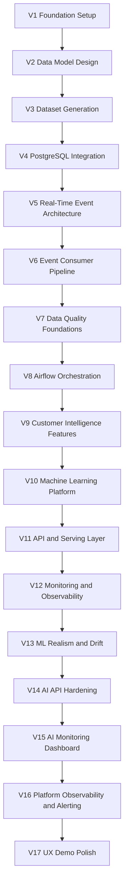

## 11.1 Development Milestones

| Version | Milestone | Main Achievement |
|---|---|---|
| V1 | Foundation Setup | Project structure and development baseline. |
| V2 | Data Model Design | PostgreSQL schemas and e-commerce data model. |
| V3 | Dataset Generation | Retail dataset generation workflow. |
| V4 | PostgreSQL Integration | Data loading and database initialization. |
| V5 | Real-Time Event Architecture | Event-driven design with Redpanda. |
| V6 | Event Consumer Pipeline | Streaming consumer and PostgreSQL persistence. |
| V7 | Data Quality Foundations | Validation rules and dead-letter handling. |
| V8 | Airflow Orchestration | Scheduled workflows and operational DAGs. |
| V9 | Customer Intelligence Features | Customer feature engineering. |
| V10 | Machine Learning Platform | Churn, CLV and segmentation models. |
| V11 | API and Serving Layer | FastAPI endpoints and serving architecture. |
| V12 | Monitoring and Observability | Prometheus and Grafana foundations. |
| V13 | ML Realism and Drift | Improved ML reporting and drift monitoring. |
| V14 | AI API Hardening | Stronger AI endpoints and customer intelligence APIs. |
| V15 | AI Monitoring Dashboard | Streamlit AI monitoring page. |
| V16 | Platform Observability and Alerting | PostgreSQL exporter, dashboards and alert rules. |
| V17 | UX Demo Polish | Complete Streamlit platform and guided demo. |

---

# 12. Future Improvement Roadmap

RetailFlow already provides an integrated platform, but several improvements can strengthen its production maturity.

## 12.1 Short-Term Improvements

| Improvement | Objective |
|---|---|
| Expand governance KPIs | Add more detailed governance scorecards. |
| Add data catalog documentation | Improve discoverability and ownership visibility. |
| Strengthen API tests | Improve CI/CD regression protection. |
| Add Streamlit smoke tests | Validate dashboard availability automatically. |
| Expand alerting | Add more operational and ML alert rules. |

## 12.2 Medium-Term Improvements

| Improvement | Objective |
|---|---|
| Add role-based access control | Restrict features by user role. |
| Add model registry | Improve model versioning and promotion. |
| Add data lineage automation | Track source-to-dashboard lineage. |
| Add dbt transformation layer | Improve SQL transformation structure and testing. |
| Expand drift monitoring | Add automated thresholds and alert escalation. |

## 12.3 Long-Term Improvements

| Improvement | Objective |
|---|---|
| Kubernetes deployment | Move beyond Docker Compose for scalable deployment. |
| Cloud-native infrastructure | Prepare managed services for production. |
| Enterprise data catalog | Improve metadata and governance at scale. |
| Advanced IAM / SSO | Support enterprise authentication and authorization. |
| Recommendation engine | Add product recommendation use cases. |
| Real-time feature refresh | Move closer to near-real-time personalization. |

---

# 13. Deliverable Structure

The official RetailFlow deliverables are organized into five parts.

## Part 1 — Executive Context and Integrated Project Presentation

This document explains:

- company context;
- product vision;
- platform objectives;
- project scope;
- integrated architecture;
- capability mapping;
- roadmap;
- maturity positioning.

## Part 2 — Data Governance Plan

The Data Governance Plan explains:

- governance vision;
- governance operating model;
- personas and roles;
- data policies;
- consent management;
- retention and anonymization;
- data classification;
- business glossary;
- governance KPIs;
- audit and controls;
- inclusion and accessibility;
- governance roadmap.

## Part 3 — Data Architecture Design

The Data Architecture Design explains:

- infrastructure architecture;
- data model;
- schemas;
- Docker Compose deployment;
- service interactions;
- monitoring architecture;
- CI/CD architecture;
- cloud target architecture.

## Part 4 — Real-Time Data Pipeline Design

The Pipeline Design explains:

- event sources;
- Redpanda streaming;
- producer and consumer logic;
- validation rules;
- dead-letter handling;
- data quality monitoring;
- Airflow orchestration;
- pipeline controls.

## Part 5 — Artificial Intelligence Solution Design

The AI Solution Design explains:

- AI business use cases;
- churn model;
- CLV model;
- segmentation model;
- feature engineering;
- API serving;
- model monitoring;
- drift monitoring;
- retraining workflow;
- responsible AI principles;
- CI/CD for AI deployment.

---

# 14. Conclusion

RetailFlow was designed as a complete Retail Intelligence platform that integrates data governance, real-time pipelines, data architecture, machine learning and observability.

The project demonstrates how customer events can be transformed into governed and monitored customer intelligence.

The platform is built around a clear architecture:

```text
Customer event
→ real-time pipeline
→ data quality control
→ governed storage
→ machine learning
→ API serving
→ business dashboard
→ platform monitoring
```

By designing RetailFlow as a recently established company with governance by design, I was able to integrate accountability, quality, privacy, auditability and AI monitoring into the platform from the beginning.

This makes RetailFlow a coherent example of a modern data and AI platform for e-commerce organizations.

The next documents describe each core capability in detail:

1. Data Governance;
2. Data Architecture;
3. Real-Time Data Pipelines;
4. Artificial Intelligence Solution.


---


# Data Governance Plan

## RetailFlow Platform

**Official Deliverable — Data Governance**

**Document purpose:** present the data governance framework I designed for RetailFlow.

**Document language:** English.

**Document scope:** governance strategy, operating model, policies, standards, GDPR alignment, consent management, quality controls, auditability, AI governance, KPIs, change management and roadmap.

---

## Table of Contents

1. Executive Summary
2. Governance Context
3. Governance Vision
4. Governance Objectives
5. Governance Scope
6. Governance by Design
7. Operating Model
8. Roles, Responsibilities and Personas
9. Governance Decision Model
10. Data Domains Under Governance
11. Data Classification
12. Data Policies
13. Consent Management Policy
14. Retention and Anonymization Policy
15. Data Quality Policy
16. Data Security and Access Policy
17. AI Governance Policy
18. Business Glossary
19. Governance Processes
20. Data Quality Controls
21. Metadata, Lineage and Traceability
22. Auditability and Evidence
23. Technology and Tooling
24. Governance KPIs
25. Risk Management
26. Inclusion and Accessibility
27. Change Management
28. Implementation Roadmap
29. Future Improvements
30. Conclusion

---

## 1. Executive Summary

RetailFlow is a recently established company that develops the **RetailFlow Platform**, a Retail Intelligence platform designed for e-commerce organizations.

The purpose of RetailFlow Platform is to transform customer events into trusted data, trusted data into customer intelligence, and customer intelligence into operational and strategic decision support.

Because RetailFlow is a new organization, I had the opportunity to design its data governance framework from the ground up.

Instead of adding governance after the platform had already grown, I designed RetailFlow according to a **Data Governance by Design** approach.

This means that data ownership, consent management, retention policies, quality controls, auditability, privacy principles and AI monitoring were integrated directly into the platform architecture.

The governance framework I defined covers:

- governance vision and scope;
- operating model and decision rights;
- roles and personas;
- consent management;
- data retention and anonymization;
- data quality controls;
- data classification;
- data security and access principles;
- auditability and evidence;
- AI governance;
- governance KPIs;
- risk management;
- change management;
- inclusion and accessibility;
- continuous improvement roadmap.

The governance framework is not only theoretical.

I implemented governance mechanisms directly in the platform through PostgreSQL schemas, FastAPI endpoints, Airflow DAGs, Streamlit governance dashboards and operational logs.

The most important governance implementation areas are:

| Area | Implementation in RetailFlow |
|---|---|
| Consent management | Customer consent indicators and consent-aware analytics filtering |
| Data retention | Retention policy table and automated retention cleanup workflow |
| Anonymization | Customer anonymization logic and audit trail |
| Data quality | Validation rules, dead-letter events and quality logs |
| Auditability | Retention action logs, quality logs, dead-letter tables and operational evidence |
| AI governance | Consent-aware customer intelligence, model monitoring and drift reporting |
| Monitoring | Streamlit governance dashboard, FastAPI endpoints and Airflow workflows |

The result is a governance framework that is aligned with business value, technical implementation and regulatory expectations.

---

## 2. Governance Context

RetailFlow Platform is designed for an e-commerce context.

The platform collects and processes multiple categories of data:

- customer profiles;
- customer consent information;
- product catalog data;
- orders;
- payments;
- returns;
- shipments;
- sessions;
- product views;
- cart events;
- checkout events;
- support tickets;
- reviews;
- customer behavioral features;
- machine learning predictions;
- customer segments;
- data quality logs;
- retention and anonymization logs.

These data assets support different business and technical use cases:

- customer understanding;
- churn prevention;
- customer lifetime value estimation;
- segmentation;
- campaign prioritization;
- real-time event monitoring;
- ML performance monitoring;
- data quality management;
- compliance evidence;
- operational observability.

Because RetailFlow uses customer-level data and derived AI outputs, governance is a core platform requirement.

The main governance challenge is to ensure that data is:

- trusted;
- compliant;
- traceable;
- secure;
- usable;
- auditable;
- understandable;
- aligned with business purpose.

Without governance, the platform could expose the company to several risks:

- customer data misuse;
- analytics performed without consent;
- uncontrolled data retention;
- poor data quality affecting AI outputs;
- lack of accountability;
- unclear data ownership;
- inability to explain or audit decisions;
- model monitoring gaps;
- operational blind spots.

I therefore designed the governance layer as an integrated part of the platform rather than as a separate administrative document.

---

## 3. Governance Vision

The governance vision for RetailFlow is:

> I designed RetailFlow governance to ensure that customer data can be used as a trusted, compliant and valuable asset while preserving privacy, accountability, quality and auditability across the platform.

This vision supports the broader product vision:

```text
Customer Events
      ↓
Trusted Data
      ↓
Customer Intelligence
      ↓
Business Decisions
      ↓
Continuous Monitoring
```

The governance layer ensures that each step of this value chain remains controlled.

| Value chain step | Governance contribution |
|---|---|
| Customer Events | Validation rules and dead-letter handling |
| Trusted Data | Data quality controls and schema organization |
| Customer Intelligence | Consent-aware analytics and AI governance |
| Business Decisions | Clear definitions, roles and quality KPIs |
| Continuous Monitoring | Audit logs, dashboards and governance KPIs |

The key principle is simple:

> Data should only become intelligence if it is governed, reliable, traceable and used for a legitimate purpose.

---

## 4. Governance Objectives

I defined the following governance objectives for RetailFlow.

### 4.1 Ensure clear data ownership

Each critical data domain must have an accountable owner.

This avoids ambiguity around:

- who validates definitions;
- who approves business usage;
- who owns data quality targets;
- who resolves business conflicts;
- who decides whether a data product is fit for use.

### 4.2 Protect customer data

RetailFlow processes customer-related data.

I therefore integrated privacy principles such as:

- purpose limitation;
- consent management;
- minimization;
- storage limitation;
- anonymization;
- accountability;
- auditability.

### 4.3 Make analytics consent-aware

Customer intelligence can influence marketing, retention and personalization decisions.

For this reason, I implemented a consent-aware analytics principle:

```text
Customer intelligence exploration should prioritize customers with analytics consent.
```

This is visible in the Customer Intelligence interface, where the user can filter customers by analytics consent.

### 4.4 Control data quality

Invalid events must not silently enter trusted analytical tables.

I implemented a pipeline quality strategy based on:

- validation rules;
- rejection logic;
- dead-letter events;
- quality logs;
- monitoring dashboards.

### 4.5 Ensure auditability

Governance must produce evidence.

I therefore designed and implemented audit traces for:

- retention actions;
- anonymization actions;
- dead-letter events;
- data quality checks;
- ML reports;
- Airflow workflows;
- platform monitoring.

### 4.6 Govern the AI lifecycle

RetailFlow includes churn, CLV and segmentation models.

I included AI governance principles covering:

- model purpose;
- data eligibility;
- explainability;
- monitoring;
- drift detection;
- retraining;
- human oversight;
- responsible use of predictions.

### 4.7 Support business adoption

Governance should enable decision-making rather than slow down the business.

I therefore designed governance as:

- practical;
- role-based;
- measurable;
- integrated into tools;
- visible through dashboards;
- connected to business value.

---

## 5. Governance Scope

The governance scope is focused on the data domains that are most critical for RetailFlow Platform.

### 5.1 In scope

The following areas are in scope.

| Domain | Included assets |
|---|---|
| Customer Data | Customer profile, consent, account status, anonymization status |
| Behavioral Events | Product views, cart events, checkout events, purchase events |
| Transaction Data | Orders, order items, payments, returns, shipments |
| Product Data | Product catalog, categories, supplier references |
| Customer Features | Behavioral and transactional aggregates |
| AI Outputs | Churn predictions, CLV predictions, customer segments |
| Governance Data | Consent records, retention policies, retention action logs |
| Quality Data | Dead-letter events and data quality logs |
| Monitoring Data | Platform health, API metrics, PostgreSQL metrics, Airflow health |

### 5.2 Out of scope

The following areas are not covered by the current governance scope:

- Enterprise Identity and Access Management;
- Single Sign-On;
- multi-region deployment;
- 24/7 production support and on-call operations.

These areas are identified as future enterprise-level capabilities.

### 5.3 Scope rationale

I deliberately focused the governance scope on the most valuable and risky domains first.

Customer data, behavioral events and AI outputs are the most important areas because they directly affect:

- customer privacy;
- business decision-making;
- ML reliability;
- retention actions;
- customer segmentation;
- marketing activation;
- compliance obligations.

This phased governance scope avoids trying to govern everything at once while still covering the most critical platform risks.

---

## 6. Governance by Design

RetailFlow was designed as a new platform.

This created an opportunity to implement governance from the beginning rather than adding it later.

I used a **Governance by Design** approach.

This means that governance principles are integrated into the platform architecture, data model, pipelines, dashboards and operational workflows.

### 6.1 Governance by Design principles

| Principle | Implementation in RetailFlow |
|---|---|
| Privacy by Design | Consent fields, anonymization logic and retention policies are part of the data model. |
| Quality by Design | Event validation happens before event persistence. |
| Auditability by Design | Retention actions and quality issues are logged. |
| AI Governance by Design | ML predictions are monitored and linked to consent-aware exploration. |
| Observability by Design | Platform health and metrics are exposed through Prometheus, Grafana and Streamlit. |
| Accountability by Design | Roles and personas are defined for ownership, stewardship and compliance. |

### 6.2 Governance maturity

Although RetailFlow is a recently established organization, its governance maturity is relatively high because governance was integrated early.

I evaluate the current maturity as follows:

| Dimension | Current maturity | Explanation |
|---|---|---|
| Data ownership | Advanced | Roles and personas are defined by domain. |
| Consent management | Advanced | Consent flags are integrated into customer data and analytics usage. |
| Retention and anonymization | Advanced | Retention policies and anonymization workflow are implemented. |
| Auditability | Advanced | Logs exist for retention actions and quality issues. |
| Data quality | Advanced | Validation, dead-letter events and quality dashboards exist. |
| AI governance | Intermediate to Advanced | ML metrics, drift and explainability are implemented. |
| Metadata management | Developing | Technical metadata exists, but cataloging can be improved. |
| Enterprise data catalog | Planned | A full data catalog is a future improvement. |
| Access management | Developing | Future role-based access control can strengthen governance. |

This maturity profile is realistic.

It recognizes that the project already contains strong governance controls while also identifying areas that would need to be expanded in an enterprise environment.

---

## 7. Operating Model

I designed a hybrid governance operating model.

The central governance layer defines common policies, standards and controls.

Domain-specific actors apply these rules in their business or technical areas.

### 7.1 Hybrid governance model

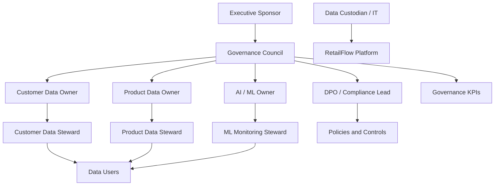

### 7.2 Why hybrid governance

A fully centralized model would be too rigid for a platform that includes business, engineering and AI topics.

A fully decentralized model would create inconsistent definitions and weak accountability.

The hybrid model provides:

- central consistency;
- domain accountability;
- faster operational execution;
- clear escalation paths;
- scalable governance practices.

### 7.3 Governance cadence

I defined the following governance cadence.

| Activity | Frequency | Responsible role |
|---|---|---|
| Governance KPI review | Monthly | Governance Council |
| Data quality issue review | Weekly | Data Steward |
| Retention action review | Monthly | DPO / Compliance Lead |
| ML monitoring review | Monthly | ML Owner |
| Risk register review | Quarterly | Governance Council |
| Policy review | Quarterly | Governance Council |
| Accessibility and training review | Quarterly | Executive Sponsor and Governance Council |

---

## 8. Roles, Responsibilities and Personas

To make the governance model concrete, I associated each governance role with a realistic RetailFlow persona.

These personas are not necessarily separate full-time positions.

They can be responsibilities assigned to existing job roles.

### 8.1 Role and persona mapping

| Governance role | RetailFlow persona | Main responsibility |
|---|---|---|
| Executive Sponsor | Chief Data & Analytics Officer | Sponsors the data governance program and validates strategic priorities. |
| Governance Council | Cross-functional governance committee | Approves policies, reviews risks and arbitrates decisions. |
| Data Owner | Head of Customer Intelligence | Owns customer analytics definitions, usage priorities and quality targets. |
| Data Steward | Senior CRM & Analytics Manager | Monitors quality, glossary definitions, consent usage and issue resolution. |
| Data Custodian | Lead Data Engineer | Operates data systems, pipelines, security controls and retention workflows. |
| DPO / Compliance Lead | Privacy & Compliance Manager | Oversees GDPR alignment, consent, retention and audit readiness. |
| ML Owner | Lead Machine Learning Engineer | Owns model monitoring, drift analysis, retraining and explainability. |
| Business Owner | Head of E-Commerce Performance | Uses customer intelligence for business decisions and campaign prioritization. |
| Data Users | Marketing analysts, CRM specialists, business analysts | Consume governed data and report quality issues. |

### 8.2 Executive Sponsor

**Persona:** Chief Data & Analytics Officer.

The Executive Sponsor provides authority, funding and visibility.

Responsibilities:

- approve the governance strategy;
- validate priorities;
- remove cross-functional blockers;
- sponsor the governance roadmap;
- ensure alignment with business objectives;
- review governance maturity.

### 8.3 Governance Council

**Persona:** Monthly cross-functional committee.

Typical members:

- Chief Data & Analytics Officer;
- Head of Customer Intelligence;
- Privacy & Compliance Manager;
- Lead Data Engineer;
- Lead Machine Learning Engineer;
- Head of E-Commerce Performance;
- Senior CRM & Analytics Manager.

Responsibilities:

- approve governance policies;
- define common standards;
- review KPIs;
- review risks;
- resolve ownership conflicts;
- prioritize governance improvements;
- validate change management actions.

### 8.4 Data Owner

**Persona:** Head of Customer Intelligence.

The Data Owner is accountable for the business meaning and usage of customer intelligence data.

Responsibilities:

- define business definitions;
- approve customer analytics use cases;
- validate quality targets;
- prioritize customer data improvements;
- arbitrate business conflicts around metrics;
- ensure the domain produces value.

### 8.5 Data Steward

**Persona:** Senior CRM & Analytics Manager.

The Data Steward manages governance in daily operations.

Responsibilities:

- monitor quality indicators;
- maintain glossary definitions;
- review data quality issues;
- validate consent usage practices;
- coordinate issue resolution;
- communicate governance rules to users.

### 8.6 Data Custodian

**Persona:** Lead Data Engineer.

The Data Custodian implements governance controls technically.

Responsibilities:

- operate PostgreSQL schemas;
- maintain pipelines;
- implement validation rules;
- maintain Airflow workflows;
- implement retention cleanup;
- maintain quality and audit logs;
- support monitoring and observability.

### 8.7 DPO / Compliance Lead

**Persona:** Privacy & Compliance Manager.

The DPO / Compliance Lead oversees privacy and regulatory alignment.

Responsibilities:

- validate GDPR alignment;
- review consent management;
- review retention policies;
- oversee anonymization logic;
- ensure audit evidence is available;
- review privacy risk controls;
- validate training material for privacy awareness.

### 8.8 ML Owner

**Persona:** Lead Machine Learning Engineer.

The ML Owner governs the AI lifecycle.

Responsibilities:

- validate model purpose;
- monitor model metrics;
- review feature importance;
- monitor drift reports;
- validate retraining workflows;
- ensure model outputs are explainable;
- document responsible use of predictions.

### 8.9 Business Owner

**Persona:** Head of E-Commerce Performance.

The Business Owner ensures that governed data supports decision-making.

Responsibilities:

- use churn, CLV and segmentation outputs;
- prioritize business actions;
- validate business usefulness;
- provide feedback on dashboards;
- ensure insights are used responsibly.

### 8.10 Data Users

**Personas:** Marketing analysts, CRM specialists and business analysts.

Data Users consume governed data under approved rules.

Responsibilities:

- follow data usage policies;
- respect consent constraints;
- use approved definitions;
- report data quality issues;
- request clarification when definitions are unclear;
- participate in training.

---

## 9. Governance Decision Model

I defined decision rights to clarify who decides what.

### 9.1 Decision rights matrix

| Decision area | Decision owner | Consulted roles | Evidence required |
|---|---|---|---|
| New customer analytics use case | Data Owner | DPO, ML Owner, Business Owner | Purpose, data fields, consent requirement |
| New data quality rule | Data Steward | Data Custodian, Data Owner | Rule definition, severity, remediation path |
| Retention policy update | DPO / Compliance Lead | Data Owner, Data Custodian | Legal basis, target table, action |
| Model retraining approval | ML Owner | Data Owner, Data Custodian | Metrics, drift report, validation output |
| Glossary definition update | Data Steward | Data Owner, Data Users | Definition, examples, owner approval |
| Governance KPI target update | Governance Council | Executive Sponsor | KPI history, business impact |
| Access policy update | Governance Council | DPO, Data Custodian | Role mapping and security impact |

### 9.2 Escalation path

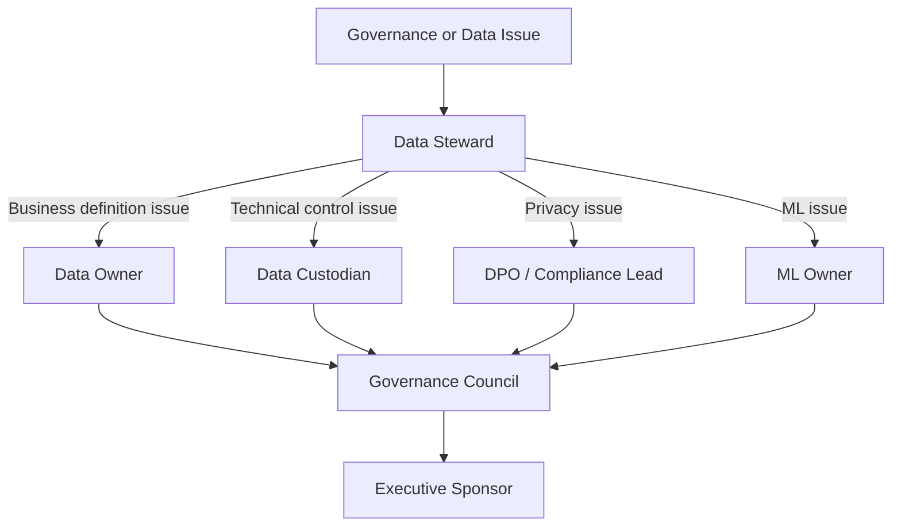

---

## 10. Data Domains Under Governance

I structured governance around core domains.

### 10.1 Customer domain

The customer domain includes:

- customer identifier;
- demographic attributes;
- account status;
- loyalty status;
- consent indicators;
- anonymization status;
- last interaction timestamp.

Governance focus:

- privacy;
- consent;
- retention;
- segmentation eligibility;
- analytics usage;
- anonymization.

### 10.2 Event domain

The event domain includes:

- product views;
- add-to-cart events;
- checkout events;
- purchase events;
- session events;
- raw payloads.

Governance focus:

- validation;
- traceability;
- timeliness;
- dead-letter handling;
- quality monitoring.

### 10.3 Transaction domain

The transaction domain includes:

- orders;
- order items;
- payments;
- shipments;
- returns;
- refunds.

Governance focus:

- accuracy;
- financial consistency;
- reporting reliability;
- retention requirements.

### 10.4 Product domain

The product domain includes:

- product catalog;
- category;
- supplier;
- product availability;
- price;
- product metadata.

Governance focus:

- completeness;
- consistency;
- reference values;
- product recommendations;
- catalog quality.

### 10.5 AI output domain

The AI output domain includes:

- churn scores;
- churn risk labels;
- CLV predictions;
- CLV value bands;
- customer segments;
- model versions;
- prediction timestamps;
- drift metrics.

Governance focus:

- explainability;
- monitoring;
- model versioning;
- responsible use;
- consent-aware exploration;
- retraining.

---

## 11. Data Classification

I defined a simple classification model adapted to RetailFlow.

The goal is to classify data by sensitivity and apply appropriate controls.

### 11.1 Classification levels

| Classification | Description | Examples | Governance controls |
|---|---|---|---|
| Public | Information that can be shared externally without customer risk. | Product catalog, product category labels, generic platform description | Basic integrity controls |
| Internal | Operational or analytical information intended for internal use. | Aggregated sales KPIs, model monitoring summaries, operational metrics | Internal access rules and documentation |
| Confidential | Customer-related or business-sensitive data requiring stronger controls. | Customer profiles, consent flags, transaction history, behavioral features, ML predictions | Consent rules, retention, audit logs, limited access |

### 11.2 Classification by data domain

| Data domain | Classification | Reason |
|---|---|---|
| Product catalog | Public / Internal | Product information can be public, but internal pricing or margin can be sensitive. |
| Customer profiles | Confidential | Contains customer-level information. |
| Consent data | Confidential | Directly related to privacy rights and permitted usage. |
| Orders and payments | Confidential | Transactional and potentially sensitive business data. |
| Behavioral events | Confidential | Can describe individual customer behavior. |
| Customer features | Confidential | Derived customer-level analytical data. |
| ML predictions | Confidential | Can influence customer treatment and marketing actions. |
| Aggregated KPIs | Internal | Business performance metrics should remain internal. |
| Monitoring metrics | Internal | Operational information for platform teams. |
| Public documentation | Public | Non-sensitive product and architecture descriptions. |

### 11.3 Handling rules

| Classification | Handling rules |
|---|---|
| Public | Can be documented and shared externally if validated. |
| Internal | Accessible to approved internal users only. |
| Confidential | Requires purpose, role, consent consideration, retention rule and auditability. |

### 11.4 Classification diagram

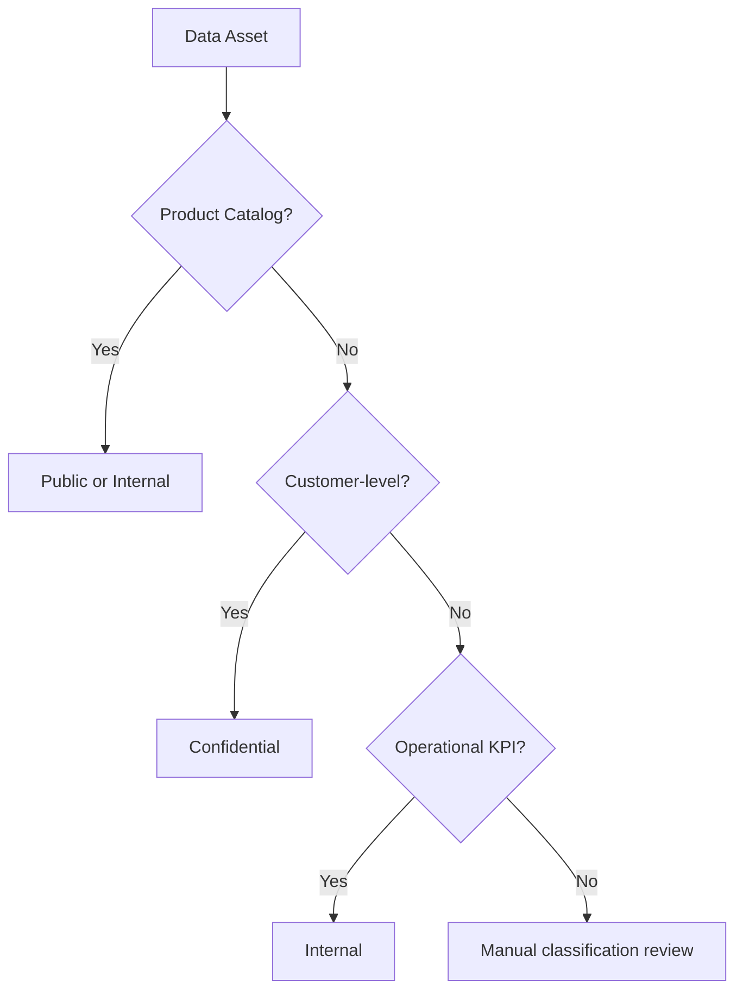

---

## 12. Data Policies

I defined governance policies that translate the governance principles into operational rules.

### 12.1 Policy overview

| Policy | Purpose |
|---|---|
| Customer data policy | Define how customer data may be used. |
| Consent management policy | Control marketing, analytics and personalization usage. |
| Retention policy | Define how long data is retained and what action is applied. |
| Anonymization policy | Define how customer identity data is removed or neutralized. |
| Data quality policy | Define validation rules and issue management. |
| AI governance policy | Define responsible use of ML predictions. |
| Access and security policy | Define access principles and technical controls. |
| Audit policy | Define evidence, logging and review expectations. |

### 12.2 Customer data policy

Customer data may only be used for approved purposes.

Approved purposes include:

- customer intelligence;
- service improvement;
- churn prevention;
- segmentation;
- CLV analysis;
- operational monitoring;
- data quality analysis;
- compliance and retention processes.

Customer data must not be used for undefined purposes without review.

The Data Owner and DPO / Compliance Lead must be consulted for any new customer-level analytical use case.

### 12.3 Acceptable use policy

Users consuming RetailFlow data must:

- use approved dashboards and endpoints;
- respect consent indicators;
- avoid exporting unnecessary customer-level data;
- use aggregated data where possible;
- report quality issues;
- follow glossary definitions;
- avoid unsupported interpretations of AI outputs.

### 12.4 Policy review

Policies must be reviewed quarterly by the Governance Council.

Policy updates should be triggered when:

- new data domains are added;
- new ML use cases are introduced;
- a privacy risk is identified;
- recurring quality issues appear;
- new compliance requirements emerge;
- business usage changes.

---

## 13. Consent Management Policy

Consent management is central to RetailFlow governance.

The platform tracks consent at customer level.

### 13.1 Consent dimensions

| Consent field | Purpose |
|---|---|
| `marketing_consent` | Indicates whether the customer can be targeted for marketing activation. |
| `analytics_consent` | Indicates whether the customer can be used in analytics and customer intelligence exploration. |
| `personalization_consent` | Indicates whether the customer can be used for personalization-related use cases. |

### 13.2 Consent usage principles

I defined the following principles:

1. Consent must be explicit enough to support the intended purpose.
2. Analytics exploration should prioritize customers with analytics consent.
3. Marketing activation should require marketing consent.
4. Personalization use cases should require personalization consent.
5. Consent values must be visible to data users where they affect usage.
6. Consent must be considered before using AI outputs for customer-level actions.

### 13.3 Consent-aware analytics

RetailFlow connects governance to analytics through the Customer Intelligence page.

The customer explorer contains a default filter:

```text
Show only customers with analytics consent
```

This ensures that AI profile exploration is aligned with consent-aware governance.

### 13.4 Consent flow

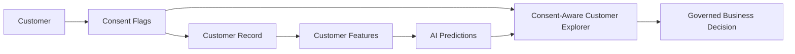

### 13.5 Consent monitoring

Consent rates are visible in the Data Governance dashboard.

The dashboard tracks:

- marketing consent rate;
- analytics consent rate;
- personalization consent rate;
- anonymized customers;
- customer count.

This makes consent not only stored but also monitored.

---

## 14. Retention and Anonymization Policy

RetailFlow includes a retention policy framework and automated anonymization workflow.

### 14.1 Retention policy table

Retention policies are stored in:

```text
governance.data_retention_policies
```

This table defines:

- policy identifier;
- target domain;
- target table;
- retention duration;
- retention action;
- owner role;
- legal basis or governance basis.

### 14.2 Retention principles

I defined the following retention principles:

1. Data should not be retained indefinitely without purpose.
2. Customer personal data should be anonymized when the retention condition is met.
3. Retention actions must be logged.
4. The retention workflow must be auditable.
5. Retention policies must be reviewed periodically.

### 14.3 Anonymization workflow

The Airflow DAG `retention_cleanup` supports the retention process.

The workflow:

1. identifies customers affected by the retention policy;
2. anonymizes personal fields;
3. disables consent flags;
4. changes account status to anonymized;
5. records the action in the retention audit log.

### 14.4 Anonymized fields

The anonymization process affects fields such as:

- first name;
- last name;
- email;
- phone number;
- birth date;
- gender;
- city;
- postal code;
- consent flags;
- account status.

### 14.5 Retention action log

Retention actions are logged in:

```text
governance.retention_actions_log
```

The log stores:

- action identifier;
- policy identifier;
- table name;
- record identifier;
- action type;
- action status;
- execution timestamp;
- executing component;
- action details.

### 14.6 Retention workflow diagram

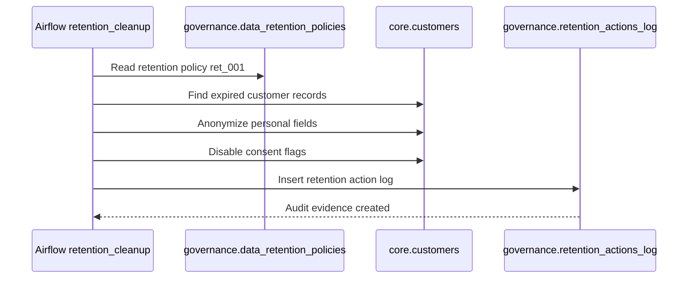

---

## 15. Data Quality Policy

Data quality is a governance requirement in RetailFlow.

The objective is to prevent incorrect data from contaminating downstream analytics and ML outputs.

### 15.1 Quality dimensions

I defined quality controls around the following dimensions:

| Dimension | Meaning in RetailFlow |
|---|---|
| Completeness | Required fields must be present. |
| Validity | Event types and values must be allowed. |
| Consistency | Events must reference existing customers and products. |
| Timeliness | Timestamps must be valid and usable. |
| Traceability | Errors must be logged and explainable. |

### 15.2 Quality validation rules

The real-time pipeline includes validation rules such as:

| Rule | Purpose | Action |
|---|---|---|
| Event identifier required | Ensure event traceability | Reject invalid event |
| Event type allowed | Prevent unsupported event categories | Reject invalid event |
| Customer exists | Ensure customer referential integrity | Reject invalid event |
| Product exists | Ensure product referential integrity | Reject invalid event |
| Timestamp valid | Ensure event chronology is usable | Reject invalid event |

### 15.3 Dead-letter handling

Invalid events are stored in:

```text
governance.dead_letter_events
```

This prevents invalid data from entering trusted analytical tables.

### 15.4 Quality logs

Failed rules are logged in:

```text
governance.data_quality_logs
```

This allows quality issues to be:

- counted;
- reviewed;
- categorized;
- assigned;
- monitored;
- audited.

### 15.5 Quality monitoring

The Data Quality dashboard displays:

- dead-letter events;
- failed rules;
- severity distribution;
- impacted event types;
- quality rule summaries;
- technical evidence.

### 15.6 Quality workflow diagram

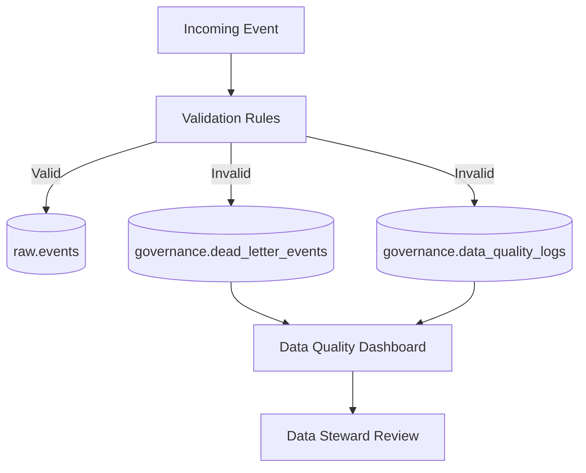

---

## 16. Data Security and Access Policy

RetailFlow is not currently positioned as a complete enterprise IAM platform.

However, I defined security principles that guide data access and future implementation.

### 16.1 Security principles

| Principle | Description |
|---|---|
| Least privilege | Users should access only what they need. |
| Purpose-based access | Access should be linked to a business purpose. |
| Confidentiality | Customer-level data should be protected. |
| Auditability | Sensitive actions should be traceable. |
| Segregation of duties | Governance decisions and technical implementation should not be controlled by one person only. |
| Secure defaults | Sensitive data should not be exposed by default. |

### 16.2 Access expectations by role

| Role | Expected access |
|---|---|
| Data Owner | Domain-level KPIs, definitions and governance reports |
| Data Steward | Quality logs, glossary, consent indicators and issue tracking |
| Data Custodian | Technical schemas, pipelines, logs and platform operations |
| DPO / Compliance Lead | Consent, retention, anonymization and audit trails |
| ML Owner | Features, model reports, prediction summaries and drift outputs |
| Business User | Approved dashboards and aggregated insights |

### 16.3 Future access improvements

Future access improvements should include:

- role-based access control;
- authentication;
- API authorization scopes;
- audit logging for user-level access;
- secrets management;
- masking for sensitive attributes;
- stronger separation between user personas.

---

## 17. AI Governance Policy

RetailFlow includes AI outputs that can influence business decisions.

I therefore designed a specific AI governance policy.

### 17.1 Governed AI use cases

| Model | Use case | Governance concern |
|---|---|---|
| Churn model | Identify customers at risk | Avoid over-automated treatment and ensure explainability |
| CLV model | Estimate customer value | Avoid unfair resource allocation without business review |
| Segmentation model | Group customers | Ensure segments are understandable and actionable |

### 17.2 AI governance principles

I defined the following principles:

1. AI predictions must support decisions, not replace human judgment.
2. Customer-level AI exploration must consider analytics consent.
3. Models must be monitored with metrics and drift signals.
4. Model outputs must be explainable to business users.
5. Retraining must be scheduled and traceable.
6. AI outputs must be versioned and timestamped.
7. Business users must understand the limits of model predictions.

### 17.3 Model monitoring

RetailFlow monitors:

- churn ROC AUC;
- churn F1;
- churn precision;
- churn recall;
- Brier score;
- CLV MAE;
- CLV RMSE;
- CLV R²;
- segmentation quality;
- feature importance;
- prediction distribution;
- drift status.

### 17.4 Drift monitoring

Drift monitoring detects changes in customer behavior that may reduce model reliability.

The AI Monitoring page displays drift status and drifted feature count.

### 17.5 Retraining governance

The Airflow DAG `ml_retraining` orchestrates:

- churn model training;
- segmentation training;
- CLV model training;
- prediction refresh;
- drift evaluation.

### 17.6 AI governance lifecycle

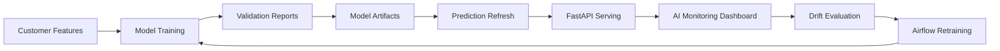

---

## 18. Business Glossary

I defined a business glossary to clarify key terms used in RetailFlow.

| Term | Definition | Owner |
|---|---|---|
| Active customer | A customer with recent purchase or behavioral activity in the platform. | Head of Customer Intelligence |
| Analytics consent | Permission indicator allowing customer data to be used for analytics and customer intelligence exploration. | DPO / Compliance Lead |
| Marketing consent | Permission indicator allowing marketing activation. | DPO / Compliance Lead |
| Personalization consent | Permission indicator allowing personalized recommendations or experiences. | DPO / Compliance Lead |
| Customer event | A behavioral action generated by a customer, such as product view, cart or checkout activity. | Data Steward |
| Valid event | An event that passes required validation rules before persistence. | Data Custodian |
| Dead-letter event | An event rejected by validation and isolated for review. | Data Steward |
| Churn risk | Probability or label indicating the likelihood of customer disengagement. | ML Owner |
| CLV | Customer Lifetime Value, the estimated future value of a customer. | Head of Customer Intelligence |
| Customer segment | Business-readable group of customers with similar behavior or value profile. | ML Owner |
| Retention policy | Rule defining how long a data asset is kept and what action is applied. | DPO / Compliance Lead |
| Anonymization | Process of removing or neutralizing identifying customer attributes. | DPO / Compliance Lead |
| Data quality rule | A rule used to validate data completeness, validity or consistency. | Data Steward |
| Drift | A change in data distribution that can affect model reliability. | ML Owner |
| Audit trail | Recorded evidence of governance-related actions. | Governance Council |

---

## 19. Governance Processes

I defined governance processes to make policies operational.

### 19.1 Consent review process

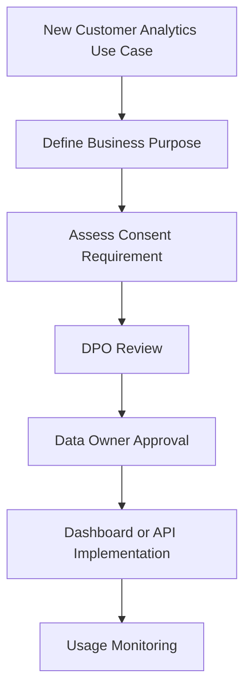

### 19.2 Data quality issue process

1. Data quality issue is detected.
2. Issue is logged in the governance schema.
3. Data Steward reviews severity.
4. Data Custodian investigates technical cause.
5. Data Owner validates business impact.
6. Corrective action is implemented.
7. Issue is monitored for recurrence.

### 19.3 Retention process

1. Retention policy is defined.
2. Airflow retention workflow identifies eligible records.
3. Customer record is anonymized.
4. Consent flags are disabled.
5. Retention action is logged.
6. Governance dashboard exposes the action.
7. Compliance Lead reviews the audit trail.

### 19.4 AI monitoring process

1. Models are trained.
2. Predictions are refreshed.
3. Metrics are generated.
4. Drift is evaluated.
5. AI Monitoring dashboard displays outputs.
6. ML Owner reviews model status.
7. Retraining or investigation is triggered if needed.

---

## 20. Data Quality Controls

Data quality controls protect the platform from poor input data.

### 20.1 Preventive controls

| Control | Description |
|---|---|
| API schemas | Incoming requests must follow expected structures. |
| Event validation | The consumer validates business and technical rules. |
| Referential checks | Customer and product identifiers are checked. |
| Allowed event types | Unsupported event types are rejected. |
| Timestamp validation | Invalid timestamps are rejected. |

### 20.2 Detective controls

| Control | Description |
|---|---|
| Dead-letter monitoring | Rejected events are visible in dashboards. |
| Quality summaries | Failed rules are counted and reviewed. |
| Airflow data quality DAG | Quality checks are scheduled. |
| Streamlit Data Quality page | Quality issues are exposed to users. |

### 20.3 Corrective controls

| Control | Description |
|---|---|
| Dead-letter review | Data Steward reviews rejected events. |
| Rule adjustment | Data quality rules can be adjusted if needed. |
| Pipeline correction | Data Custodian fixes technical causes. |
| Reprocessing path | Future improvement for corrected events. |

---

## 21. Metadata, Lineage and Traceability

Metadata and lineage are important for trust.

RetailFlow currently implements practical traceability through schemas, logs and dashboards.

### 21.1 Technical metadata

Technical metadata exists through:

- PostgreSQL schemas;
- table names;
- column structures;
- model report files;
- Airflow DAGs;
- API endpoints;
- dashboard pages.

### 21.2 Business metadata

Business metadata exists through:

- glossary definitions;
- role ownership;
- retention policies;
- quality rule names;
- segment labels;
- model labels;
- dashboard descriptions.

### 21.3 Lineage overview

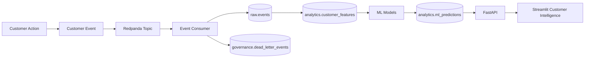

### 21.4 Future lineage improvements

Future improvements include:

- formal data catalog;
- automated lineage extraction;
- data asset owner registry;
- metadata tables;
- dbt documentation;
- OpenLineage integration.

---

## 22. Auditability and Evidence

Auditability is a core part of the RetailFlow governance framework.

Governance decisions and technical controls must produce evidence.

### 22.1 Audit evidence sources

| Evidence source | Purpose |
|---|---|
| `governance.retention_actions_log` | Proves retention and anonymization actions. |
| `governance.dead_letter_events` | Proves invalid event isolation. |
| `governance.data_quality_logs` | Proves quality rule execution and failures. |
| Airflow DAG logs | Prove scheduled workflow execution. |
| ML reports | Prove model validation and monitoring. |
| Prometheus metrics | Prove platform monitoring. |
| Grafana dashboards | Visualize operational health. |
| Streamlit governance page | Provides governance visibility. |

### 22.2 Audit questions RetailFlow can answer

RetailFlow can answer governance questions such as:

- Which customers have analytics consent?
- Which retention policies exist?
- Which customer records were anonymized?
- When was an anonymization action executed?
- Which component executed the action?
- Which events were rejected?
- Why were events rejected?
- Which quality rule failed?
- Are AI models monitored?
- Has drift been detected?
- Are platform services healthy?

### 22.3 Audit flow

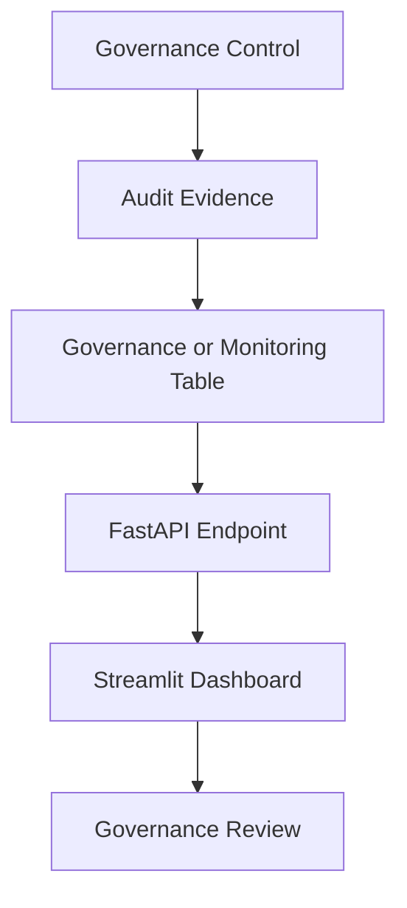

---

## 23. Technology and Tooling

RetailFlow uses technical tools to make governance operational.

### 23.1 Governance technology map

| Capability | Tool / component |
|---|---|
| Consent storage | PostgreSQL customer and governance tables |
| Retention policy storage | `governance.data_retention_policies` |
| Retention automation | Airflow `retention_cleanup` DAG |
| Anonymization audit | `governance.retention_actions_log` |
| Event validation | Python event consumer validators |
| Dead-letter handling | `governance.dead_letter_events` |
| Quality logs | `governance.data_quality_logs` |
| Governance API | FastAPI `/governance/*` endpoints |
| Governance dashboard | Streamlit Data Governance page |
| Quality dashboard | Streamlit Data Quality page |
| AI monitoring | Streamlit AI Monitoring page |
| Operational monitoring | Prometheus and Grafana |
| Workflow orchestration | Airflow |

### 23.2 Governance dashboard architecture

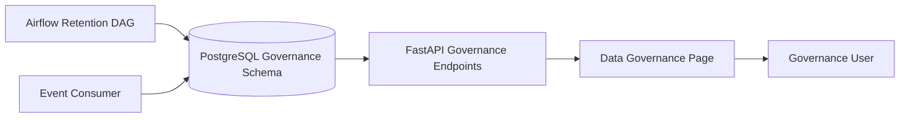

---

## 24. Governance KPIs

I defined governance KPIs to make governance measurable.

### 24.1 KPI table

| KPI | Definition | Target | Owner |
|---|---|---|---|
| Analytics consent coverage | Share of customers with analytics consent enabled. | >= 75% | DPO / Compliance Lead |
| Marketing consent coverage | Share of customers with marketing consent enabled. | >= 50% | Business Owner |
| Personalization consent coverage | Share of customers with personalization consent enabled. | >= 50% | Business Owner |
| Retention policy coverage | Share of critical governed domains covered by a retention policy. | 100% for critical domains | DPO / Compliance Lead |
| Retention action traceability | Share of executed retention actions recorded in the audit log. | 100% | Data Custodian |
| Data quality execution rate | Share of scheduled quality checks executed successfully. | >= 95% | Data Steward |
| Dead-letter rate | Share of rejected events among ingested events. | < 2% | Data Steward |
| High severity issue resolution time | Average time to resolve high severity quality issues. | < 5 business days | Data Steward |
| ML monitoring coverage | Share of production ML models with metrics and drift monitoring. | 100% | ML Owner |
| Governance review cadence | Share of planned governance reviews completed. | >= 90% | Governance Council |

### 24.2 KPI dashboard logic

Governance KPIs should be reviewed monthly.

They should be presented to the Governance Council with:

- current value;
- target;
- trend;
- owner;
- issue explanation;
- corrective actions.

### 24.3 KPI diagram

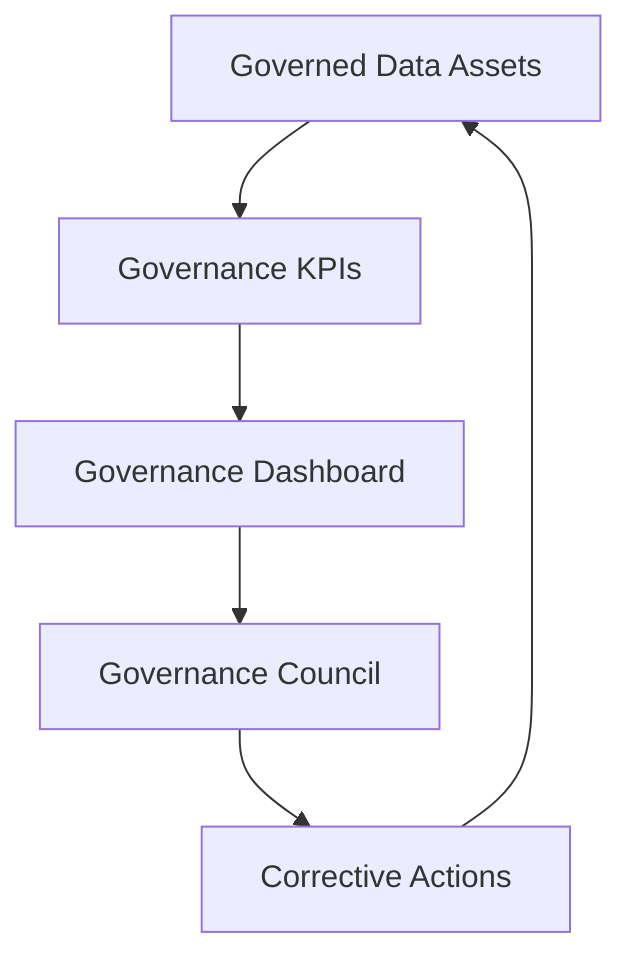

---

## 25. Risk Management

I defined a governance risk register to identify and mitigate data risks.

### 25.1 Risk register

| Risk | Description | Impact | Mitigation | Owner |
|---|---|---|---|---|
| Personal data exposure | Customer data may be accessed or used beyond intended purpose. | High | Consent management, classification, access principles, anonymization | DPO / Compliance Lead |
| Consent misuse | Customer data may be used for analytics or marketing without appropriate consent. | High | Consent-aware dashboards and policy review | DPO / Compliance Lead |
| Retention failure | Data may be kept longer than needed. | High | Retention policies, Airflow cleanup, audit logs | Data Custodian |
| Poor data quality | Invalid events may affect analytics and ML models. | High | Validation rules, quality logs, dead-letter handling | Data Steward |
| ML drift | Customer behavior may change and reduce model reliability. | Medium | Drift monitoring and retraining DAG | ML Owner |
| Unclear ownership | Issues may remain unresolved if accountability is unclear. | Medium | Operating model and role mapping | Governance Council |
| Dashboard misuse | Users may overinterpret AI outputs. | Medium | Training, metric guides and human oversight | Business Owner |
| Metadata gaps | Users may misunderstand data meaning or lineage. | Medium | Glossary and future catalog roadmap | Data Steward |
| Accessibility gap | Some users may not be able to follow standard training formats. | Medium | Accessible materials and multi-format training | Executive Sponsor |

### 25.2 Risk review process

Risks should be reviewed quarterly by the Governance Council.

For each risk, the council should review:

- current likelihood;
- current impact;
- controls in place;
- control effectiveness;
- open actions;
- owner;
- deadline.

---

## 26. Inclusion and Accessibility

I included inclusion and accessibility in the governance framework because governance only works if users understand and can apply it.

Training and adoption cannot assume that every employee has the same language, learning style, availability or accessibility needs.

### 26.1 Inclusion principles

I defined the following principles:

1. Governance training should be understandable for both technical and non-technical users.
2. Training should be available in multiple languages when teams are international.
3. Documentation should avoid unnecessary jargon.
4. Important policies should be available in accessible formats.
5. Alternative training formats should be provided when needed.
6. Reasonable accommodations should be planned for people with disabilities.
7. Governance adoption should be measured without excluding users who need adapted support.

### 26.2 Multi-language training

RetailFlow should provide governance awareness material in multiple languages when required by the organization.

Priority languages should be based on workforce composition.

Training should cover:

- data ownership;
- consent usage;
- data quality responsibilities;
- retention and anonymization;
- AI output interpretation;
- incident reporting.

### 26.3 Accessibility accommodations

Training and documentation should support:

- screen-reader compatible documents;
- captions for recorded training;
- clear visual contrast;
- readable font sizes;
- non-visual alternatives for diagrams;
- extra time or assisted sessions when needed;
- simplified summaries for non-specialist audiences.

### 26.4 Inclusion in change management

Inclusion must not be treated as a separate afterthought.

It should be integrated into the governance change management plan.

This ensures that governance adoption is fair, accessible and realistic.

---

## 27. Change Management

Governance succeeds only if people adopt it.

I therefore included a change management plan.

### 27.1 Change management objectives

The change management plan aims to:

- explain why governance matters;
- clarify responsibilities;
- train data users;
- reduce resistance;
- make governance part of daily work;
- support inclusion and accessibility;
- create feedback loops.

### 27.2 Stakeholder communication

| Audience | Message |
|---|---|
| Executive Sponsor | Governance protects data value, trust and platform scalability. |
| Data Owners | Governance clarifies accountability and improves decision quality. |
| Data Stewards | Governance gives structure to quality and issue resolution. |
| Data Custodians | Governance requirements are translated into technical controls. |
| Business Users | Governance makes dashboards more trustworthy and usable. |
| ML Users | Governance improves responsible use of predictions. |

### 27.3 Training plan

| Training module | Audience | Format |
|---|---|---|
| Governance fundamentals | All data users | Short online module |
| Consent and privacy | Marketing, analytics, business users | Workshop and quick reference sheet |
| Data quality issue reporting | Data users and stewards | Practical session |
| AI output interpretation | Business and ML users | Dashboard walkthrough |
| Retention and anonymization | DPO, data custodians, stewards | Process training |
| Accessibility and inclusion | Managers and trainers | Awareness session |

### 27.4 Adoption strategy

I defined the following adoption strategy:

1. Start with customer and event domains.
2. Train the most active data users first.
3. Use dashboards to make governance visible.
4. Review KPIs monthly.
5. Collect feedback from users.
6. Improve policies based on recurring issues.
7. Extend governance to additional domains.

---

## 28. Implementation Roadmap

RetailFlow already includes several governance components.

The roadmap therefore includes both completed work and future improvements.

### 28.1 Completed governance implementation

| Area | Completed implementation |
|---|---|
| Consent management | Customer consent fields and consent dashboard |
| Analytics consent | Consent-aware customer explorer |
| Retention policies | Retention policy table |
| Retention workflow | Airflow `retention_cleanup` DAG |
| Anonymization | Customer anonymization logic |
| Audit trail | Retention action log |
| Data quality | Validation rules and quality logs |
| Dead-letter handling | Invalid events stored in governance dead-letter table |
| Governance dashboard | Streamlit Data Governance page |
| Data Quality dashboard | Streamlit Data Quality page |
| AI governance | AI monitoring, drift and explainability views |
| Orchestration | Airflow governance and ML workflows |

### 28.2 Future roadmap

| Phase | Improvement | Purpose |
|---|---|---|
| Phase 1 | Formal data catalog | Improve discoverability and ownership visibility. |
| Phase 2 | Automated lineage | Trace data from source events to dashboards and ML outputs. |
| Phase 3 | Role-based access control | Strengthen access governance by persona. |
| Phase 4 | User-level audit logging | Track who accessed sensitive datasets or dashboards. |
| Phase 5 | Advanced privacy impact assessment | Formalize privacy review for new use cases. |
| Phase 6 | Extended AI governance | Add fairness checks, model registry and approval workflow. |
| Phase 7 | Governance training program | Institutionalize awareness and adoption. |
| Phase 8 | Accessibility governance | Ensure training and documentation remain inclusive. |

### 28.3 Roadmap diagram

```mermaid
flowchart LR
    Done[Current Implementation] --> Catalog[Data Catalog]
    Catalog --> Lineage[Automated Lineage]
    Lineage --> RBAC[Role-Based Access Control]
    RBAC --> Audit[User-Level Audit Logging]
    Audit --> PIA[Privacy Impact Assessment]
    PIA --> AIGov[Advanced AI Governance]
    AIGov --> Training[Governance Training Program]
    Training --> Accessibility[Accessibility Governance]
```

---

## 29. Future Improvements

The governance framework is already strong for the current stage of RetailFlow, but I identified several future improvements.

### 29.1 Data catalog

A data catalog would make assets easier to find and understand.

It should include:

- table descriptions;
- column descriptions;
- owner;
- steward;
- classification;
- retention policy;
- glossary links;
- quality rules;
- lineage.

### 29.2 Metadata automation

Metadata is currently documented through schemas, code and dashboards.

A future improvement would automate metadata collection.

### 29.3 Advanced lineage

Lineage should be extended to show:

```text
source event
→ raw table
→ feature table
→ ML prediction
→ API endpoint
→ Streamlit dashboard
```

### 29.4 Role-based access control

Future platform versions should enforce access based on roles such as:

- Data Steward;
- Business User;
- ML Engineer;
- Compliance Lead;
- Platform Engineer.

### 29.5 Model registry and AI approval

The AI governance framework can be strengthened with:

- model registry;
- approval workflow;
- deployment stages;
- rollback strategy;
- production validation checklist.

### 29.6 Governance issue tracker

A dedicated governance issue tracker would help manage:

- quality issues;
- glossary updates;
- policy questions;
- access requests;
- privacy reviews.

### 29.7 Accessibility review process

Accessibility should be reviewed periodically for:

- training content;
- dashboards;
- documentation;
- diagrams;
- onboarding material.

---

## 30. Conclusion

I designed the RetailFlow data governance framework as an operational component of the platform, not as a separate theoretical layer.

The framework covers ownership, policies, consent, retention, anonymization, quality, AI monitoring, auditability, inclusion and continuous improvement.

The main strength of the approach is that governance is embedded directly into the platform design.

This is visible through:

- consent-aware customer intelligence;
- retention policies and anonymization workflow;
- dead-letter event handling;
- quality logs;
- governance APIs;
- dashboards;
- Airflow workflows;
- AI monitoring;
- risk and KPI management.

RetailFlow therefore demonstrates a mature approach to data governance for a modern Retail Intelligence platform.

The governance framework makes customer data more trustworthy, business intelligence more reliable, AI outputs more responsible and platform operations more auditable.


---


# Bloc 2 — Data Architecture Design

# RetailFlow Data Architecture Plan

## Executive Summary

I designed the RetailFlow Platform as an end-to-end Retail Intelligence architecture for modern e-commerce organizations.

The purpose of this data architecture is to transform customer events, operational retail data and machine learning outputs into a governed, observable and decision-ready platform.

The architecture combines:

- a modular Docker-based infrastructure;
- a PostgreSQL analytical and operational data layer;
- a Redpanda Kafka-compatible streaming broker;
- a FastAPI service layer;
- a Streamlit business and monitoring interface;
- Apache Airflow orchestration;
- Prometheus and Grafana observability;
- PostgreSQL exporter metrics;
- GitHub Actions CI/CD workflows;
- a future-ready cloud and Kubernetes deployment path.

The architecture is designed to support the following core capabilities:

| Capability | Architectural Response |
|---|---|
| Real-time customer event processing | Redpanda, FastAPI event producer, Python event consumer |
| Reliable storage | PostgreSQL with separated schemas |
| Data governance | Dedicated governance schema, retention logs, consent data, quality logs |
| Customer intelligence | Analytics schema, ML predictions, customer segments |
| ML serving | FastAPI endpoints exposing model outputs and reports |
| Orchestration | Airflow DAGs for quality, sales aggregation, ML retraining and retention cleanup |
| Observability | Prometheus, Grafana, PostgreSQL exporter, application metrics |
| Developer workflow | Git, GitHub, Docker Compose, GitHub Actions CI/CD |

This document presents the architecture from both a conceptual and implementation point of view.

It explains the main design decisions, the infrastructure components, the data model, the deployment approach, the monitoring layer and the future architecture roadmap.

---

## 1. Architecture Objectives

I designed the RetailFlow architecture around the idea that a data platform should not only store data.

It should provide a complete operating environment where events become trusted data, trusted data becomes intelligence, and intelligence becomes actionable business insight.

The main objectives are:

1. provide a coherent end-to-end data platform;
2. support real-time event ingestion;
3. separate operational, raw, analytical and governance data layers;
4. make customer intelligence accessible through APIs and dashboards;
5. support orchestration and automation;
6. provide platform observability;
7. support governance, privacy and auditability by design;
8. remain reproducible through Docker Compose;
9. support a future migration toward cloud and Kubernetes.

---

## 2. Business and Technical Context

RetailFlow is a Retail Intelligence platform designed for e-commerce organizations.

The platform captures and processes customer activity such as:

- product views;
- add-to-cart events;
- checkout events;
- purchases;
- returns;
- support interactions;
- reviews;
- customer consent updates;
- browsing behavior.

The platform must support business questions such as:

- Which customers are most valuable?
- Which customers are at risk of churn?
- Which customer segments require different actions?
- Are live customer events being ingested correctly?
- Are invalid events isolated and traceable?
- Are ML models monitored and explainable?
- Are platform components healthy and observable?

To answer these questions, I designed a modular architecture where each component has a clear responsibility.

---

## 3. High-Level Architecture

The RetailFlow architecture follows a layered approach.

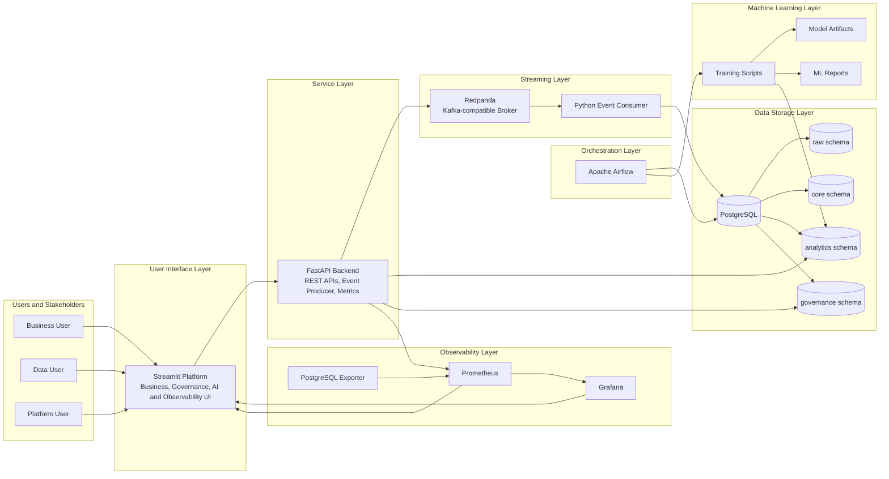

This architecture separates responsibilities across several layers.

| Layer | Role |
|---|---|
| User interface | Exposes the platform to users through Streamlit |
| API layer | Provides service access to data, events, ML and governance |
| Streaming layer | Decouples event production and event persistence |
| Storage layer | Centralizes structured data in PostgreSQL |
| Orchestration layer | Automates scheduled workflows |
| Machine learning layer | Trains, stores, reports and serves customer models |
| Observability layer | Monitors services, metrics and platform health |

---

## 4. Architecture Design Principles

### 4.1 Modularity

I separated the platform into specialized services.

Each component has a clear role:

| Component | Responsibility |
|---|---|
| Streamlit | User interface and dashboard layer |
| FastAPI | Backend API and event publishing layer |
| Redpanda | Event broker |
| Event consumer | Validation and persistence of events |
| PostgreSQL | Central storage and analytical database |
| Airflow | Workflow orchestration |
| ML scripts | Training, prediction and monitoring artifacts |
| Prometheus | Metrics collection |
| Grafana | Metrics visualization |
| GitHub Actions | CI/CD automation |

This modularity makes the platform easier to maintain and easier to explain.

---

### 4.2 Separation of Concerns

I designed the architecture so that each layer solves a different problem.

For example:

- Streamlit does not write directly to the database for live events.
- FastAPI produces events but does not persist them directly into the raw event table.
- Redpanda decouples event publishing from consumption.
- The consumer validates and persists events.
- PostgreSQL stores trusted, analytical and governance data.
- Airflow runs scheduled jobs.
- Prometheus and Grafana monitor the platform.

This separation supports scalability, maintainability and reliability.

---

### 4.3 Event-Driven Architecture

The customer journey is event-driven.

A customer action generates an event that flows through the platform.

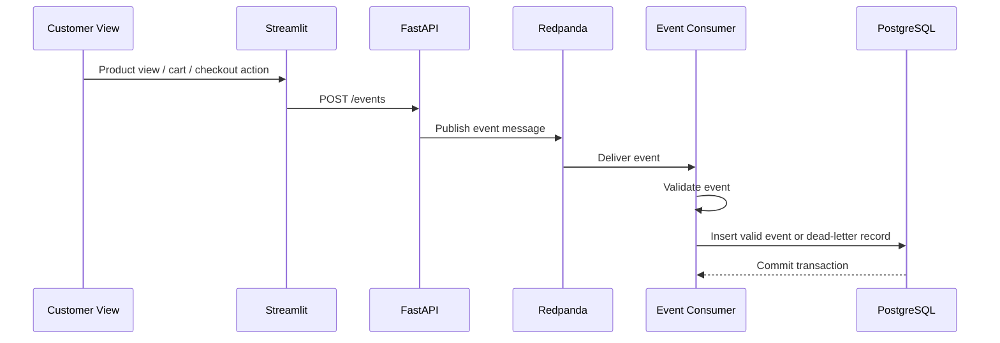

This design is closer to production e-commerce platforms than direct synchronous database writes.

It provides:

- decoupling;
- resilience;
- extensibility;
- traceability;
- clear data quality control points.

---

### 4.4 Governance by Design

I integrated governance directly into the architecture.

Governance is represented through:

- consent fields;
- retention policies;
- retention action logs;
- anonymization workflow;
- data quality logs;
- dead-letter events;
- API governance endpoints;
- Streamlit governance dashboards.

This makes governance operational rather than purely documentary.

---

### 4.5 Observability by Design

RetailFlow exposes platform metrics and health information.

Observability is available through:

- FastAPI `/metrics` endpoint;
- Prometheus scrape configuration;
- PostgreSQL exporter;
- Grafana dashboards;
- Airflow health endpoint;
- Streamlit Observability page.

This provides visibility into platform state and operational reliability.

---

### 4.6 Local Reproducibility

The platform runs locally through Docker Compose.

This enables:

- consistent setup;
- reproducible deployment;
- simplified evaluation;
- easier debugging;
- clear service orchestration.

---

### 4.7 Future-Ready Deployment

Although the current environment is Docker Compose-based, I designed the architecture so that it can evolve toward:

- Kubernetes;
- cloud-managed PostgreSQL;
- managed Kafka-compatible streaming;
- cloud monitoring;
- container registry deployment;
- production-grade IAM and SSO.

The `/k8s` directory is considered part of a future deployment roadmap rather than the current primary runtime.

---

## 5. Runtime Infrastructure

RetailFlow runs as a multi-container platform.

The main services are:

| Service | Role |
|---|---|
| PostgreSQL | Main database |
| pgAdmin | Database administration interface |
| Redpanda | Kafka-compatible event broker |
| FastAPI | Backend service layer |
| Event consumer | Streaming consumer and validation process |
| Streamlit | Platform user interface |
| Airflow webserver | Orchestration UI |
| Airflow scheduler | DAG scheduling |
| Airflow PostgreSQL | Airflow metadata database |
| Prometheus | Metrics collection |
| Grafana | Metrics visualization |
| PostgreSQL exporter | Database metrics exporter |

---

## 6. Docker Compose Architecture

Docker Compose is used as the main local deployment mechanism.

```mermaid
flowchart TB
    subgraph DockerCompose[Docker Compose Runtime]
        Postgres[retailflow_postgres]
        PgAdmin[retailflow_pgadmin]
        Redpanda[retailflow_redpanda]
        FastAPI[retailflow_fastapi]
        Consumer[retailflow_event_consumer]
        Streamlit[retailflow_streamlit]
        AirflowWeb[retailflow_airflow_webserver]
        AirflowScheduler[retailflow_airflow_scheduler]
        AirflowDB[retailflow_airflow_postgres]
        Prometheus[retailflow_prometheus]
        Grafana[retailflow_grafana]
        PgExporter[retailflow_postgres_exporter]
    end

    FastAPI --> Postgres
    FastAPI --> Redpanda
    Streamlit --> FastAPI
    Redpanda --> Consumer
    Consumer --> Postgres
    AirflowWeb --> AirflowDB
    AirflowScheduler --> AirflowDB
    AirflowScheduler --> Postgres
    AirflowScheduler --> FastAPI
    PgExporter --> Postgres
    Prometheus --> FastAPI
    Prometheus --> PgExporter
    Grafana --> Prometheus
```

This setup allows the full platform to run with a single command:

```bash
docker compose up -d
```

---

## 7. Service Responsibilities

### 7.1 PostgreSQL

PostgreSQL is the central data platform.

It stores:

- raw events;
- clean business entities;
- analytical features;
- ML predictions;
- customer segments;
- governance policies;
- retention logs;
- data quality logs;
- dead-letter events.

PostgreSQL provides a stable relational foundation for both operational and analytical data.

---

### 7.2 Redpanda

Redpanda is used as the event broker.

It receives customer events from FastAPI and exposes them to the event consumer.

I selected Redpanda because it provides Kafka-compatible streaming capabilities with a simpler local deployment model.

---

### 7.3 FastAPI

FastAPI is the backend service layer.

It exposes:

- product endpoints;
- event publishing endpoints;
- recent event endpoints;
- quality endpoints;
- governance endpoints;
- AI endpoints;
- model report endpoints;
- health and metrics endpoints.

FastAPI also produces live events to Redpanda.

---

### 7.4 Event Consumer

The event consumer processes messages from Redpanda.

It is responsible for:

- consuming messages;
- parsing payloads;
- applying validation rules;
- writing valid events to PostgreSQL;
- writing invalid events to dead-letter tables;
- writing failed quality checks to governance logs.

---

### 7.5 Streamlit

Streamlit is the product interface.

It provides pages for:

- platform overview;
- customer journey simulation;
- customer intelligence;
- data governance;
- data quality;
- AI monitoring;
- observability.

---

### 7.6 Airflow

Airflow orchestrates scheduled workflows.

Main DAGs:

| DAG | Schedule | Purpose |
|---|---|---|
| `daily_sales_aggregation` | Daily | Build daily sales aggregates |
| `daily_data_quality` | Daily | Check data quality indicators |
| `ml_retraining` | Weekly | Retrain ML models and refresh predictions |
| `retention_cleanup` | Weekly | Apply retention and anonymization logic |

---

### 7.7 Prometheus

Prometheus collects metrics from FastAPI and PostgreSQL exporter.

It supports operational monitoring and observability.

---

### 7.8 Grafana

Grafana visualizes Prometheus metrics.

It provides operational dashboards for platform health.

---

### 7.9 PostgreSQL Exporter

The PostgreSQL exporter exposes database metrics to Prometheus.

It allows monitoring of PostgreSQL availability and operational behavior.

---

### 7.10 GitHub Actions

GitHub Actions provides the CI/CD automation layer.

It supports:

- code quality checks;
- automated tests;
- Docker build validation;
- API smoke checks;
- deployment-readiness validation.

The CI/CD layer is part of the platform industrialization strategy.

---

## 8. Network and Communication Design

RetailFlow services communicate through the Docker network.

Internal service names are used inside containers.

Examples:

| From | To | Internal URL |
|---|---|---|
| Streamlit | FastAPI | `http://fastapi:8000` |
| FastAPI | PostgreSQL | `postgres:5432` |
| FastAPI | Redpanda | `redpanda:9092` |
| Event consumer | Redpanda | `redpanda:9092` |
| Event consumer | PostgreSQL | `postgres:5432` |
| Prometheus | FastAPI | `fastapi:8000/metrics` |
| Prometheus | PostgreSQL exporter | `postgres_exporter:9187/metrics` |
| Grafana | Prometheus | `prometheus:9090` |

External access uses localhost ports.

| Component | Local URL |
|---|---|
| Streamlit | `http://127.0.0.1:8501` |
| FastAPI | `http://127.0.0.1:8000` |
| FastAPI Docs | `http://127.0.0.1:8000/docs` |
| PostgreSQL | `localhost:5432` |
| Airflow | `http://127.0.0.1:8080` |
| Prometheus | `http://127.0.0.1:9090` |
| Grafana | `http://127.0.0.1:3000` |
| PostgreSQL exporter | `http://127.0.0.1:9187/metrics` |

---

## 9. PostgreSQL Data Architecture

PostgreSQL is organized into logical schemas.

This schema separation is one of the most important architecture choices.

```mermaid
flowchart LR
    subgraph Database[PostgreSQL Database]
        Raw[raw schema]
        Core[core schema]
        Analytics[analytics schema]
        Governance[governance schema]
    end

    Raw --> Core
    Core --> Analytics
    Governance --> Analytics
    Analytics --> API[FastAPI]
    Governance --> API
    API --> UI[Streamlit]
```

---

## 10. Database Schemas

### 10.1 Raw Schema

The `raw` schema stores ingested events and raw behavioral information.

Purpose:

- preserve event-level data;
- support replay and traceability;
- keep ingestion data separate from clean analytical entities.

Example table:

```text
raw.events
```

---

### 10.2 Core Schema

The `core` schema stores business entities.

Examples:

- customers;
- products;
- orders;
- order items;
- payments;
- shipments;
- returns;
- reviews;
- support tickets.

The core schema represents the trusted business layer.

---

### 10.3 Analytics Schema

The `analytics` schema stores derived and analytical data.

Examples:

- customer features;
- daily sales aggregates;
- ML predictions;
- customer segments;
- analytical views.

This layer supports dashboards, ML workflows and business intelligence.

---

### 10.4 Governance Schema

The `governance` schema stores governance, compliance, retention and quality data.

Examples:

- customer consents;
- data retention policies;
- retention action logs;
- data quality logs;
- dead-letter events.

This schema makes governance observable and auditable.

---

## 11. Data Modeling Architecture

The RetailFlow data model is designed to support both operational retail workflows and analytical decision-making.

The model follows a layered approach:

```text
raw event data
→ trusted business entities
→ analytical features and aggregates
→ machine learning predictions
→ governed business dashboards
```

This design gives the platform a clear separation between:

- raw ingestion;
- operational truth;
- analytical consumption;
- governance and auditability;
- AI-ready features.

The data model is customer-centric because the main business questions of RetailFlow are centered on customer behavior, customer value, churn risk, consent, lifecycle and segmentation.

---

### 11.1 Conceptual Data Domains

The data model is organized into seven business domains.

| Domain | Main Tables | Purpose |
|---|---|---|
| Customer domain | `core.customers`, `governance.customer_consents` | Identify customers, statuses and consent context |
| Product domain | `core.products`, `core.suppliers` | Manage catalog and supplier relationships |
| Commerce domain | `core.orders`, `core.order_items`, `core.payments`, `core.shipments`, `core.returns` | Represent the complete transaction lifecycle |
| Interaction domain | `raw.events`, `core.sessions`, `core.reviews`, `core.support_tickets` | Capture behavioral and service interactions |
| Analytics domain | `analytics.customer_features`, `analytics.daily_sales` | Store derived indicators and BI-ready aggregates |
| AI domain | `analytics.ml_predictions`, `analytics.customer_segments` | Store model outputs, customer intelligence and segmentation |
| Governance domain | `governance.data_retention_policies`, `governance.retention_actions_log`, `governance.dead_letter_events`, `governance.data_quality_logs` | Support privacy, retention, auditability and data quality |

This domain structure allows RetailFlow to cover operational, analytical, governance and AI use cases in a single coherent PostgreSQL architecture.

---

### 11.2 Complete Implemented Entity Relationship Diagram

The following ERD describes the complete implemented RetailFlow relational model.

The diagram uses logical entity names to make the relationships readable. The physical implementation is organized across PostgreSQL schemas: `raw`, `core`, `analytics` and `governance`.

```mermaid
erDiagram
    CORE_CUSTOMERS {
        string customer_id PK
        string country
        string city
        string loyalty_status
        string account_status
        boolean marketing_consent
        boolean analytics_consent
        boolean personalization_consent
        boolean is_anonymized
        timestamp created_at
    }

    GOVERNANCE_CUSTOMER_CONSENTS {
        string consent_id PK
        string customer_id FK
        boolean marketing_consent
        boolean analytics_consent
        boolean personalization_consent
        timestamp consent_timestamp
        string consent_source
    }

    CORE_SUPPLIERS {
        string supplier_id PK
        string supplier_name
        string country
        string reliability_tier
    }

    CORE_PRODUCTS {
        string product_id PK
        string supplier_id FK
        string product_name
        string category
        numeric price
        numeric margin_rate
        boolean is_active
    }

    CORE_ORDERS {
        string order_id PK
        string customer_id FK
        timestamp order_timestamp
        string order_status
        numeric total_amount
        string currency
    }

    CORE_ORDER_ITEMS {
        string order_item_id PK
        string order_id FK
        string product_id FK
        int quantity
        numeric unit_price
        numeric line_amount
    }

    CORE_PAYMENTS {
        string payment_id PK
        string order_id FK
        string payment_method
        string payment_status
        numeric payment_amount
        timestamp payment_timestamp
    }

    CORE_SHIPMENTS {
        string shipment_id PK
        string order_id FK
        string shipment_status
        string carrier
        timestamp shipped_at
        timestamp delivered_at
    }

    CORE_RETURNS {
        string return_id PK
        string order_id FK
        string customer_id FK
        string product_id FK
        string return_reason
        numeric refund_amount
        timestamp return_timestamp
    }

    CORE_SESSIONS {
        string session_id PK
        string customer_id FK
        timestamp session_start
        timestamp session_end
        string device_type
        string traffic_source
    }

    RAW_EVENTS {
        string event_id PK
        string session_id FK
        string customer_id FK
        string product_id FK
        string event_type
        timestamp event_timestamp
        json payload
    }

    CORE_REVIEWS {
        string review_id PK
        string customer_id FK
        string product_id FK
        int rating
        string review_text
        timestamp review_timestamp
    }

    CORE_SUPPORT_TICKETS {
        string ticket_id PK
        string customer_id FK
        string ticket_category
        string ticket_status
        string priority
        timestamp created_at
        timestamp resolved_at
    }

    ANALYTICS_CUSTOMER_FEATURES {
        string customer_id PK
        int total_orders
        numeric total_spent
        numeric avg_order_value
        int days_since_last_order
        numeric return_rate
        numeric cart_abandon_rate
        int session_count_30d
        int pages_viewed_30d
        int support_tickets_count
        string preferred_category
    }

    ANALYTICS_ML_PREDICTIONS {
        string prediction_id PK
        string customer_id FK
        string model_name
        string model_version
        numeric prediction_value
        string prediction_label
        timestamp prediction_timestamp
    }

    ANALYTICS_CUSTOMER_SEGMENTS {
        string segment_id PK
        string customer_id FK
        string segment_label
        string segment_description
        string model_version
        timestamp assigned_at
    }

    ANALYTICS_DAILY_SALES {
        date sales_date PK
        string category
        int orders_count
        int items_sold
        numeric gross_revenue
        numeric net_revenue
        numeric avg_order_value
        int returns_count
    }

    GOVERNANCE_DATA_RETENTION_POLICIES {
        string policy_id PK
        string data_domain
        string retention_period
        string retention_action
        boolean is_active
    }

    GOVERNANCE_RETENTION_ACTIONS_LOG {
        string action_id PK
        string policy_id FK
        string customer_id FK
        string action_type
        string action_status
        timestamp action_timestamp
    }

    GOVERNANCE_DEAD_LETTER_EVENTS {
        string dead_letter_id PK
        string event_id
        string event_type
        string rejection_reason
        string raw_payload
        timestamp created_at
    }

    GOVERNANCE_DATA_QUALITY_LOGS {
        string log_id PK
        string dead_letter_id FK
        string rule_id
        string rule_name
        string severity
        string action
        timestamp created_at
    }

    CORE_CUSTOMERS ||--o{ GOVERNANCE_CUSTOMER_CONSENTS : has_consent_history
    CORE_CUSTOMERS ||--o{ CORE_ORDERS : places
    CORE_CUSTOMERS ||--o{ CORE_SESSIONS : creates
    CORE_CUSTOMERS ||--o{ RAW_EVENTS : generates
    CORE_CUSTOMERS ||--o{ CORE_REVIEWS : writes
    CORE_CUSTOMERS ||--o{ CORE_SUPPORT_TICKETS : opens
    CORE_CUSTOMERS ||--o{ CORE_RETURNS : requests
    CORE_CUSTOMERS ||--|| ANALYTICS_CUSTOMER_FEATURES : summarized_as
    CORE_CUSTOMERS ||--o{ ANALYTICS_ML_PREDICTIONS : receives
    CORE_CUSTOMERS ||--o{ ANALYTICS_CUSTOMER_SEGMENTS : assigned_to
    CORE_CUSTOMERS ||--o{ GOVERNANCE_RETENTION_ACTIONS_LOG : affected_by

    CORE_SUPPLIERS ||--o{ CORE_PRODUCTS : supplies
    CORE_PRODUCTS ||--o{ CORE_ORDER_ITEMS : sold_in
    CORE_PRODUCTS ||--o{ RAW_EVENTS : viewed_or_used_in
    CORE_PRODUCTS ||--o{ CORE_REVIEWS : receives
    CORE_PRODUCTS ||--o{ CORE_RETURNS : returned_as

    CORE_ORDERS ||--o{ CORE_ORDER_ITEMS : contains
    CORE_ORDERS ||--o{ CORE_PAYMENTS : paid_by
    CORE_ORDERS ||--o{ CORE_SHIPMENTS : shipped_by
    CORE_ORDERS ||--o{ CORE_RETURNS : may_generate

    CORE_SESSIONS ||--o{ RAW_EVENTS : contains

    GOVERNANCE_DATA_RETENTION_POLICIES ||--o{ GOVERNANCE_RETENTION_ACTIONS_LOG : triggers
    GOVERNANCE_DEAD_LETTER_EVENTS ||--o{ GOVERNANCE_DATA_QUALITY_LOGS : explains
```

This ERD shows that RetailFlow is not a flat dataset.

It is a normalized and governed relational model that supports:

- customer analytics;
- commerce analytics;
- event streaming;
- quality control;
- AI features;
- retention and consent auditability;
- observability of data failures.

---

### 11.3 Relationship Explanation

| Relationship | Meaning |
|---|---|
| `customers → orders` | A customer can place multiple orders |
| `orders → order_items` | Each order contains one or more products |
| `products → order_items` | A product can appear in many order lines |
| `orders → payments` | An order can have one or more payment records |
| `orders → shipments` | An order can be associated with shipment tracking |
| `orders → returns` | An order can generate return records |
| `customers → sessions` | A customer can create multiple browsing sessions |
| `sessions → events` | A session contains a sequence of customer events |
| `customers → events` | Events are linked to customers when available |
| `products → events` | Product-level events support product analytics |
| `customers → reviews` | A customer can write reviews |
| `products → reviews` | A product can receive reviews |
| `customers → support_tickets` | A customer can open support cases |
| `customers → customer_features` | Customer features summarize behavioral and transactional history |
| `customers → ml_predictions` | AI predictions are generated at customer level |
| `customers → customer_segments` | Segments assign customers to business-readable groups |
| `customers → customer_consents` | Consent history is attached to the customer profile |
| `retention_policies → retention_actions_log` | Retention actions are executed according to governance policies |
| `dead_letter_events → data_quality_logs` | Rejected events are linked to the quality rules that failed |

---

### 11.4 Core Entity Descriptions

#### Customers

`core.customers` is the central master entity of the platform.

It stores customer identity, geographic context, loyalty status, account status and consent flags.

Primary use cases:

- customer portfolio analysis;
- churn prediction;
- CLV prediction;
- consent-aware analytics;
- retention and anonymization workflows.

Primary key:

```text
customer_id
```

Main relationships:

```text
customers → orders
customers → sessions
customers → events
customers → customer_features
customers → ml_predictions
customers → customer_segments
customers → customer_consents
```

---

#### Products

`core.products` stores the product catalog.

It connects sales, events, reviews, returns and supplier relationships.

Primary use cases:

- sales analysis;
- category performance;
- product interaction tracking;
- return analysis;
- product-level customer journey analysis.

Primary key:

```text
product_id
```

Main relationships:

```text
products → order_items
products → reviews
products → returns
products → events
suppliers → products
```

---

#### Orders and Order Items

`core.orders` represents the order header.

`core.order_items` represents product-level order lines.

This split is important because one order can contain several products.

Primary use cases:

- revenue analytics;
- average order value;
- product sales performance;
- customer purchase history;
- CLV feature engineering.

Primary keys:

```text
order_id
order_item_id
```

Main relationships:

```text
customers → orders
orders → order_items
products → order_items
orders → payments
orders → shipments
orders → returns
```

---

#### Payments

`core.payments` stores payment information attached to orders.

Primary use cases:

- payment validation;
- payment status tracking;
- transaction completeness checks;
- revenue reconciliation.

---

#### Shipments

`core.shipments` stores delivery information.

Primary use cases:

- delivery monitoring;
- fulfillment tracking;
- operational analysis;
- customer experience analysis.

---

#### Returns

`core.returns` stores returned products and refund information.

Primary use cases:

- return rate computation;
- customer dissatisfaction signals;
- product quality analysis;
- churn feature engineering.

---

#### Sessions and Events

`core.sessions` describes browsing sessions.

`raw.events` stores event-level customer activity.

This separation supports both session-level analysis and event-level replay.

Primary use cases:

- behavioral analytics;
- cart abandonment analysis;
- product view analysis;
- funnel tracking;
- real-time pipeline validation.

---

#### Reviews and Support Tickets

`core.reviews` captures customer feedback on products.

`core.support_tickets` captures service interactions.

Primary use cases:

- satisfaction analysis;
- customer experience monitoring;
- support load analysis;
- churn risk feature engineering.

---

#### Customer Features

`analytics.customer_features` is the customer-level feature table used by machine learning and dashboards.

It combines transactional, behavioral and service signals.

Examples:

- total orders;
- total spent;
- days since last order;
- return rate;
- cart abandonment rate;
- support ticket count;
- preferred category.

---

#### ML Predictions and Segments

`analytics.ml_predictions` stores churn and CLV outputs.

`analytics.customer_segments` stores segmentation assignments.

These tables make the ML layer queryable and auditable through SQL and FastAPI.

---

#### Governance Tables

The governance schema contains:

- consent history;
- retention policies;
- retention action logs;
- dead-letter events;
- data quality logs.

These entities make governance measurable and traceable.

---

## 12. Implemented Star Schema Architecture

The RetailFlow relational model is normalized for consistency and governance.

On top of this normalized model, I implemented analytical structures that behave like star schemas for reporting, dashboards and AI features.

In this document, I use analytical names such as `fact_sales`, `fact_customer_activity` and `fact_ai_predictions` to describe the star schema design.

In the current PostgreSQL implementation, these fact structures are represented by existing physical tables and aggregates:

| Analytical Fact Name | Implemented Physical Representation |
|---|---|
| `fact_sales` | `core.orders`, `core.order_items`, `core.payments`, `core.returns`, `analytics.daily_sales` |
| `fact_customer_activity` | `raw.events`, `core.sessions`, `analytics.customer_features` |
| `fact_ai_predictions` | `analytics.ml_predictions`, `analytics.customer_segments`, `analytics.customer_features` |

This means that the star schemas are not only theoretical.

They are implemented through the current PostgreSQL tables and used by dashboards, API endpoints and ML workflows.

---

### 12.1 Sales Analytics Star Schema

The sales star schema is centered on order and order line transactions.

It supports revenue analysis, category performance, product performance and customer value analysis.

```mermaid
erDiagram
    FACT_SALES {
        string order_id FK
        string order_item_id FK
        string customer_id FK
        string product_id FK
        string supplier_id FK
        date sales_date FK
        int quantity
        numeric unit_price
        numeric line_amount
        numeric order_total_amount
        numeric refund_amount
        boolean is_returned
    }

    DIM_CUSTOMER {
        string customer_id PK
        string country
        string city
        string loyalty_status
        string account_status
        boolean analytics_consent
    }

    DIM_PRODUCT {
        string product_id PK
        string product_name
        string category
        numeric price
        numeric margin_rate
        boolean is_active
    }

    DIM_SUPPLIER {
        string supplier_id PK
        string supplier_name
        string country
        string reliability_tier
    }

    DIM_DATE {
        date date_key PK
        int year
        int quarter
        int month
        int week
        int day
        string day_name
    }

    DIM_CATEGORY {
        string category PK
        string category_group
        string category_description
    }

    FACT_SALES }o--|| DIM_CUSTOMER : customer_id
    FACT_SALES }o--|| DIM_PRODUCT : product_id
    FACT_SALES }o--|| DIM_SUPPLIER : supplier_id
    FACT_SALES }o--|| DIM_DATE : sales_date
    FACT_SALES }o--|| DIM_CATEGORY : category
```

Implementation mapping:

| Star Schema Object | Implemented Tables |
|---|---|
| `fact_sales` | `core.orders`, `core.order_items`, `core.payments`, `core.returns`, `analytics.daily_sales` |
| `dim_customer` | `core.customers` |
| `dim_product` | `core.products` |
| `dim_supplier` | `core.suppliers` |
| `dim_date` | derived from order timestamps and aggregation dates |
| `dim_category` | product category attribute in `core.products` |

Main measures:

| Measure | Meaning |
|---|---|
| `orders_count` | Number of orders |
| `items_sold` | Number of product units sold |
| `gross_revenue` | Revenue before returns |
| `net_revenue` | Revenue after returns |
| `avg_order_value` | Average value per order |
| `returns_count` | Number of returned items or orders |
| `return_rate` | Ratio of returns compared with purchases |

Business questions supported:

- What are the highest revenue categories?
- Which customer groups generate the most sales?
- Which products have high sales but also high returns?
- How does daily revenue evolve?
- Which suppliers contribute most to revenue?

---

### 12.2 Customer Activity Star Schema

The customer activity star schema is centered on event-level behavior.

It supports funnel monitoring, product engagement, browsing analysis and behavioral feature engineering.

```mermaid
erDiagram
    FACT_CUSTOMER_ACTIVITY {
        string event_id PK
        string customer_id FK
        string session_id FK
        string product_id FK
        date event_date FK
        string event_type FK
        string device_type FK
        string traffic_source FK
        int event_count
        int page_view_flag
        int product_view_flag
        int cart_action_flag
        int purchase_flag
    }

    DIM_CUSTOMER {
        string customer_id PK
        string country
        string city
        string loyalty_status
        boolean analytics_consent
    }

    DIM_PRODUCT {
        string product_id PK
        string product_name
        string category
        numeric price
    }

    DIM_DATE {
        date date_key PK
        int year
        int month
        int week
        int day
    }

    DIM_EVENT_TYPE {
        string event_type PK
        string event_family
        string funnel_stage
    }

    DIM_SESSION {
        string session_id PK
        string device_type
        string traffic_source
        timestamp session_start
        timestamp session_end
    }

    FACT_CUSTOMER_ACTIVITY }o--|| DIM_CUSTOMER : customer_id
    FACT_CUSTOMER_ACTIVITY }o--|| DIM_PRODUCT : product_id
    FACT_CUSTOMER_ACTIVITY }o--|| DIM_DATE : event_date
    FACT_CUSTOMER_ACTIVITY }o--|| DIM_EVENT_TYPE : event_type
    FACT_CUSTOMER_ACTIVITY }o--|| DIM_SESSION : session_id
```

Implementation mapping:

| Star Schema Object | Implemented Tables |
|---|---|
| `fact_customer_activity` | `raw.events`, `core.sessions` |
| `dim_customer` | `core.customers` |
| `dim_product` | `core.products` |
| `dim_date` | derived from `event_timestamp` |
| `dim_event_type` | event type values validated by the consumer |
| `dim_session` | `core.sessions` |

Main measures:

| Measure | Meaning |
|---|---|
| `event_count` | Number of customer events |
| `session_count` | Number of sessions |
| `page_views` | Number of page views |
| `product_views` | Number of product views |
| `add_to_cart_count` | Number of add-to-cart actions |
| `checkout_started_count` | Number of checkout starts |
| `purchase_count` | Number of purchase events |
| `cart_abandon_rate` | Behavioral signal used for customer intelligence |

Business questions supported:

- Which event types occur most frequently?
- Where do customers abandon the journey?
- Which products generate views but not purchases?
- Which customers have high activity but low conversion?
- Are incoming events valid and complete?

---

### 12.3 AI Predictions Star Schema

The AI predictions star schema is centered on model outputs.

It supports AI monitoring, customer prioritization, segmentation analysis and model explainability.

```mermaid
erDiagram
    FACT_AI_PREDICTIONS {
        string prediction_id PK
        string customer_id FK
        string model_name FK
        string model_version FK
        date prediction_date FK
        string segment_id FK
        numeric prediction_value
        string prediction_label
        timestamp prediction_timestamp
    }

    DIM_CUSTOMER {
        string customer_id PK
        string country
        string city
        string loyalty_status
        boolean analytics_consent
        boolean personalization_consent
    }

    DIM_SEGMENT {
        string segment_id PK
        string segment_label
        string segment_description
        string model_version
    }

    DIM_MODEL {
        string model_name PK
        string model_type
        string target
        string model_version
    }

    DIM_DATE {
        date date_key PK
        int year
        int month
        int week
        int day
    }

    FACT_AI_PREDICTIONS }o--|| DIM_CUSTOMER : customer_id
    FACT_AI_PREDICTIONS }o--|| DIM_SEGMENT : segment_id
    FACT_AI_PREDICTIONS }o--|| DIM_MODEL : model_name
    FACT_AI_PREDICTIONS }o--|| DIM_DATE : prediction_date
```

Implementation mapping:

| Star Schema Object | Implemented Tables |
|---|---|
| `fact_ai_predictions` | `analytics.ml_predictions` |
| `dim_customer` | `core.customers` |
| `dim_segment` | `analytics.customer_segments` |
| `dim_model` | model metadata from `ml/reports/*.json` and prediction fields |
| `dim_date` | derived from `prediction_timestamp` |

Main measures:

| Measure | Meaning |
|---|---|
| `prediction_value` | Churn probability or predicted CLV value |
| `predictions_count` | Number of generated predictions |
| `avg_prediction_value` | Average model output by label or segment |
| `high_risk_customers_count` | Number of customers with high churn risk |
| `high_value_customers_count` | Number of customers with high CLV band |
| `segment_customers_count` | Number of customers assigned to each segment |

Business questions supported:

- Which customers have the highest churn risk?
- Which customers have the highest predicted CLV?
- Which segments contain the highest-value customers?
- Are predictions distributed consistently?
- Which model version generated each prediction?

---

### 12.4 Dimension Strategy

The dimension layer is designed to make analytics readable and reusable.

| Dimension | Source | Purpose |
|---|---|---|
| `dim_customer` | `core.customers` | Customer segmentation, geography, loyalty and consent filtering |
| `dim_product` | `core.products` | Product and category analysis |
| `dim_date` | timestamps in operational and analytical tables | Time-based reporting |
| `dim_category` | `core.products.category` | Category-level performance |
| `dim_country` | `core.customers.country`, `core.suppliers.country` | Geographic analysis |
| `dim_supplier` | `core.suppliers` | Supplier performance |
| `dim_segment` | `analytics.customer_segments` | Segment-level customer intelligence |
| `dim_event_type` | event validation rules and `raw.events.event_type` | Funnel and behavioral analysis |
| `dim_model` | ML reports and prediction metadata | Model monitoring and version traceability |

This strategy avoids duplicating business definitions across dashboards and APIs.

---

### 12.5 Granularity and Analytical Grain

Each fact structure has a clear grain.

| Fact | Grain | Why It Matters |
|---|---|---|
| `fact_sales` | one order item / sales line | Allows product, customer, category and supplier analysis |
| `fact_customer_activity` | one customer event | Allows funnel analysis and behavioral monitoring |
| `fact_ai_predictions` | one model prediction per customer, model and timestamp | Allows model versioning, monitoring and traceability |

Defining grain is important because it prevents ambiguous metrics.

For example:

- revenue belongs to sales facts;
- event counts belong to activity facts;
- churn probability belongs to AI prediction facts.

This separation makes dashboards easier to validate and maintain.

---

### 12.6 Star Schema Usage in RetailFlow

The star schema design is used by several platform components.

| Component | Star Schema Usage |
|---|---|
| Streamlit Platform Overview | sales, customers, events and monitoring indicators |
| Streamlit Customer Intelligence | customer features, predictions and segments |
| Streamlit Data Quality | activity validation and rejected event analysis |
| Streamlit AI Monitoring | AI prediction and model report analysis |
| FastAPI `/analytics` | aggregated analytical data |
| FastAPI `/ai` | predictions, segments and model reports |
| Airflow `daily_sales_aggregation` | sales fact aggregation |
| Airflow `ml_retraining` | feature generation and prediction refresh |

---

## 13. Data Modeling Design Decisions

### 13.1 Normalized Core Model

The `core` schema is normalized to preserve data consistency.

This is important because orders, products, payments, shipments, returns and customers have different lifecycles.

For example:

```text
one order
→ many order items
→ one product per order line
```

A flat table would duplicate product and customer attributes across order lines.

The normalized model avoids this duplication.

---

### 13.2 Analytical Layer for Decision-Making

The `analytics` schema stores derived data that is optimized for analysis and ML consumption.

Examples:

- `analytics.customer_features`;
- `analytics.daily_sales`;
- `analytics.ml_predictions`;
- `analytics.customer_segments`.

This avoids forcing dashboards and ML scripts to recompute expensive metrics from raw transactional tables every time.

---

### 13.3 Governance Layer for Accountability

The `governance` schema stores consent, retention, quality and audit records.

This design supports privacy and compliance use cases directly in the data architecture.

Examples:

```text
governance.customer_consents
governance.data_retention_policies
governance.retention_actions_log
governance.dead_letter_events
governance.data_quality_logs
```

---

### 13.4 Event Layer for Traceability

The `raw` schema stores customer events.

This layer supports:

- replay;
- debugging;
- behavioral analysis;
- feature engineering;
- data quality investigation.

Valid events are stored in `raw.events`.

Invalid events are isolated in `governance.dead_letter_events`.

---

### 13.5 AI-Ready Modeling

The data model is designed to support machine learning without requiring a separate data platform.

Customer intelligence is built from:

```text
core.customers
core.orders
core.order_items
core.returns
core.reviews
core.support_tickets
core.sessions
raw.events
analytics.customer_features
```

Model outputs are stored back into PostgreSQL:

```text
analytics.ml_predictions
analytics.customer_segments
```

This makes AI outputs accessible through SQL, FastAPI and Streamlit.

---

### 13.6 Architecture Objectives Achieved by the Data Model

| Objective | Data Modeling Response |
|---|---|
| Support operational retail data | Normalized `core` schema |
| Support event-driven ingestion | `raw.events` and streaming consumer |
| Support analytics | `analytics.daily_sales` and customer features |
| Support AI | ML features, predictions and segments |
| Support governance | consent, retention, quality and dead-letter tables |
| Support auditability | retention logs and quality logs |
| Support dashboarding | star-schema-oriented facts and dimensions |
| Support scalability | separated domains and reusable analytical tables |

---

## 14. Data Flow Architecture

### 13.1 Historical Data Flow

```mermaid
flowchart LR
    Generator[Data Generator] --> CSV[CSV Files]
    CSV --> Loader[PostgreSQL Loader]
    Loader --> Core[core schema]
    Loader --> Raw[raw schema]
    Loader --> Analytics[analytics schema]
    Loader --> Governance[governance schema]
```

This flow initializes the platform with structured retail data.

---

### 13.2 Real-Time Event Flow

```mermaid
flowchart LR
    CustomerAction[Customer Action] --> Streamlit[Streamlit Customer View]
    Streamlit --> FastAPI[FastAPI POST /events]
    FastAPI --> Redpanda[Redpanda Topic]
    Redpanda --> Consumer[Python Event Consumer]
    Consumer --> Validation[Validation Rules]
    Validation -->|Valid| RawEvents[(raw.events)]
    Validation -->|Invalid| DeadLetters[(governance.dead_letter_events)]
    Validation --> QualityLogs[(governance.data_quality_logs)]
```

This flow captures customer events and validates them before persistence.

---

### 13.3 Analytics Flow

```mermaid
flowchart LR
    Core[core schema] --> Features[analytics.customer_features]
    Raw[raw.events] --> Features
    Features --> ML[ML Training and Prediction]
    ML --> Predictions[analytics.ml_predictions]
    ML --> Segments[analytics.customer_segments]
    Predictions --> API[FastAPI /ai endpoints]
    Segments --> API
    API --> Streamlit[Customer Intelligence and AI Monitoring]
```

This flow turns customer and event data into AI-driven customer intelligence.

---

### 13.4 Governance Flow

```mermaid
flowchart LR
    Customers[core.customers] --> Consents[governance.customer_consents]
    Policies[governance.data_retention_policies] --> RetentionDAG[Airflow retention_cleanup]
    RetentionDAG --> Anonymization[Customer Anonymization]
    Anonymization --> Logs[governance.retention_actions_log]
    Consents --> GovAPI[FastAPI /governance]
    Logs --> GovAPI
    Policies --> GovAPI
    GovAPI --> GovernanceUI[Streamlit Data Governance]
```

This flow shows how governance data becomes visible and auditable.

---

### 13.5 Observability Flow

```mermaid
flowchart LR
    FastAPI[FastAPI /metrics] --> Prometheus[Prometheus]
    PgExporter[PostgreSQL Exporter] --> Prometheus
    Prometheus --> Grafana[Grafana]
    Prometheus --> ObservabilityUI[Streamlit Observability]
    Airflow[Airflow /health] --> ObservabilityUI
    Grafana --> ObservabilityUI
```

This flow monitors the operational state of the platform.

---

## 15. API Architecture

FastAPI is the central access layer for Streamlit and external clients.

```mermaid
flowchart TB
    Streamlit[Streamlit UI] --> API[FastAPI]

    API --> ProductRoutes[Product Routes]
    API --> EventRoutes[Event Routes]
    API --> QualityRoutes[Quality Routes]
    API --> GovernanceRoutes[Governance Routes]
    API --> AIRoutes[AI Routes]
    API --> MetricsRoute[/metrics]

    ProductRoutes --> DB[(PostgreSQL)]
    EventRoutes --> Redpanda[Redpanda]
    QualityRoutes --> DB
    GovernanceRoutes --> DB
    AIRoutes --> DB
    AIRoutes --> Reports[ML Report Files]
    MetricsRoute --> Prometheus[Prometheus]
```

Main endpoint groups:

| Endpoint group | Purpose |
|---|---|
| `/products` | Product catalog and product details |
| `/events` | Event publishing and recent events |
| `/quality` | Dead letters and quality summaries |
| `/governance` | Consent, retention and auditability |
| `/ai` | Predictions, segments and ML reports |
| `/health` | API and database status |
| `/metrics` | Prometheus metrics |

---

## 16. Streamlit Architecture

Streamlit is structured as a multi-page platform.

```mermaid
flowchart TB
    Home[Home] --> Overview[Platform Overview]
    Home --> CustomerView[Customer View]
    Home --> CustomerIntel[Customer Intelligence]
    Home --> Governance[Data Governance]
    Home --> Quality[Data Quality]
    Home --> AIMonitoring[AI Monitoring]
    Home --> Observability[Observability]

    Overview --> API[FastAPI]
    CustomerView --> API
    CustomerIntel --> API
    Governance --> API
    Quality --> API
    AIMonitoring --> API
    Observability --> API
    Observability --> Prometheus[Prometheus]
    Observability --> Grafana[Grafana]
    Observability --> Airflow[Airflow]
```

This UI architecture supports both business storytelling and technical proof.

---

## 17. Orchestration Architecture

Airflow is used to orchestrate recurring platform workflows.

```mermaid
flowchart TB
    Airflow[Apache Airflow]

    Airflow --> SalesDAG[daily_sales_aggregation]
    Airflow --> QualityDAG[daily_data_quality]
    Airflow --> MLDAG[ml_retraining]
    Airflow --> RetentionDAG[retention_cleanup]

    SalesDAG --> DailySales[(analytics.daily_sales)]
    QualityDAG --> DeadLetters[(governance.dead_letter_events)]
    MLDAG --> Models[ML Model Artifacts]
    MLDAG --> Predictions[(analytics.ml_predictions)]
    MLDAG --> DriftReports[Drift Reports]
    RetentionDAG --> Customers[(core.customers)]
    RetentionDAG --> RetentionLogs[(governance.retention_actions_log)]
```

---

## 18. Airflow DAG Design

### 17.1 daily_sales_aggregation

I implemented the `daily_sales_aggregation` DAG to refresh daily sales indicators.

The DAG:

- reads orders and returns;
- computes daily revenue;
- computes average order value;
- counts returns;
- updates `analytics.daily_sales`;
- validates that the aggregate table contains rows.

This DAG supports the analytics layer.

---

### 17.2 daily_data_quality

I implemented the `daily_data_quality` DAG to verify platform quality signals.

The DAG:

- checks PostgreSQL connectivity;
- counts records in `governance.dead_letter_events`;
- provides a scheduled data quality control point.

This DAG supports the quality monitoring strategy.

---

### 17.3 ml_retraining

I implemented the `ml_retraining` DAG to orchestrate the ML lifecycle.

It runs:

1. churn model training;
2. segmentation model training;
3. CLV model training;
4. prediction refresh;
5. lightweight drift evaluation.

The dependency structure is:

```text
[train_churn, train_segmentation, train_clv]
→ refresh_predictions
→ evaluate_drift
```

This DAG supports the MLOps architecture.

---

### 17.4 retention_cleanup

I implemented the `retention_cleanup` DAG to support governance and GDPR-aligned retention.

The DAG:

- identifies expired customer records based on retention policy `ret_001`;
- anonymizes personal attributes;
- disables marketing, analytics and personalization consent flags;
- updates the customer status;
- inserts an audit record into `governance.retention_actions_log`.

This DAG is a central proof that governance policies are operationalized.

---

## 19. Machine Learning Architecture

The ML architecture is integrated with the data platform.

```mermaid
flowchart TB
    Features[(analytics.customer_features)] --> TrainChurn[train_churn.py]
    Features --> TrainCLV[train_clv.py]
    Features --> TrainSeg[train_segmentation.py]

    TrainChurn --> ChurnModel[churn_model.joblib]
    TrainCLV --> CLVModel[clv_model.joblib]
    TrainSeg --> SegModel[segmentation_model.joblib]

    ChurnModel --> Predict[predict.py]
    CLVModel --> Predict
    SegModel --> Predict

    Predict --> Predictions[(analytics.ml_predictions)]
    Predict --> Segments[(analytics.customer_segments)]

    Predictions --> AIRoutes[FastAPI /ai]
    Segments --> AIRoutes
    Reports[ml/reports/*.json] --> AIRoutes
    AIRoutes --> CustomerIntel[Streamlit Customer Intelligence]
    AIRoutes --> AIMonitoring[Streamlit AI Monitoring]
```

ML is not isolated in notebooks.

It is integrated into:

- storage;
- orchestration;
- API serving;
- monitoring;
- business dashboards.

---

## 20. Observability Architecture

RetailFlow includes service and database observability.

```mermaid
flowchart LR
    FastAPI[FastAPI Metrics] --> Prometheus[Prometheus]
    PgExporter[PostgreSQL Exporter] --> Prometheus
    Prometheus --> Grafana[Grafana Dashboards]
    Prometheus --> ObservabilityPage[Streamlit Observability Page]
    Grafana --> ObservabilityPage
    AirflowHealth[Airflow Health Endpoint] --> ObservabilityPage
```

Main monitoring assets:

| Asset | Purpose |
|---|---|
| `/metrics` | FastAPI Prometheus metrics |
| `pg_up` | PostgreSQL availability metric |
| Prometheus targets | Service scrape status |
| Grafana dashboard | Visual platform monitoring |
| Alert rules documentation | Operational alert definitions |
| Streamlit Observability | Consolidated health view |

---

## 21. Monitoring and Alerting

The architecture includes documented alerting rules.

Main alert categories:

| Alert | Purpose |
|---|---|
| FastAPI Down | Detect API unavailability |
| PostgreSQL Down | Detect database unavailability |
| High API Error Rate | Detect server-side API errors |
| High API Latency | Detect performance degradation |
| Drift Detected | Connect ML monitoring to operational alerting |

These alerts show a production-oriented approach to platform operations.

---

## 22. CI/CD Architecture

I implemented GitHub Actions as the CI/CD automation layer.

The CI/CD pipeline validates the platform before changes are integrated into the main development branch.

```mermaid
flowchart LR
    Dev[Developer Push / Pull Request] --> GitHub[GitHub Actions]
    GitHub --> Install[Install Dependencies]
    Install --> Syntax[Python Syntax Validation]
    Syntax --> Tests[Automated Test Suite]
    Tests --> Compose[Docker Compose Configuration Validation]
    Compose --> Build[Docker Image Build Validation]
    Build --> Ready[Release Candidate Ready]
```

The implemented CI/CD pipeline includes:

| Stage | Purpose |
|---|---|
| Dependency installation | Install project, API, ML, pipeline and Streamlit dependencies |
| Python syntax validation | Compile Python modules to detect syntax errors |
| Automated tests | Run API, data quality and ML artifact tests |
| Docker Compose validation | Validate the deployment configuration |
| Docker image build validation | Build FastAPI, Streamlit and event consumer images |

The current CI/CD workflow validates:

```text
.github/workflows/ci.yml
api/Dockerfile
streamlit_app/Dockerfile
pipeline/consumer/Dockerfile
docker-compose.yml
tests/test_api.py
tests/test_data_quality.py
tests/test_ml.py
```

This creates a deployment-readiness gate.

At the current stage, the pipeline validates the application, tests and container builds.

The remaining production evolution is automated deployment to a target environment such as Kubernetes or a managed cloud platform.


## 23. Infrastructure as Code Approach

RetailFlow uses Docker Compose as the main infrastructure definition.

The infrastructure is described through:

- `docker-compose.yml`;
- Dockerfiles for FastAPI, Streamlit and consumer services;
- Prometheus configuration;
- Grafana provisioning;
- Airflow DAG definitions;
- database initialization scripts;
- GitHub Actions workflows.

Future infrastructure expansion can include:

- Kubernetes manifests;
- Terraform modules;
- cloud-managed services;
- secrets management;
- cloud monitoring integrations.

---

## 24. Cloud Target Architecture

The current platform is local and containerized.

However, the architecture can evolve toward a cloud deployment.

```mermaid
flowchart TB
    subgraph Cloud[Cloud Target Architecture]
        Ingress[Cloud Load Balancer / Ingress]
        UI[Containerized Streamlit]
        API[Containerized FastAPI]
        Broker[Managed Kafka-compatible Streaming]
        DB[(Managed PostgreSQL)]
        Scheduler[Managed Airflow / Composer]
        Registry[Container Registry]
        Monitoring[Cloud Monitoring + Grafana]
        CICD[GitHub Actions CI/CD]
    end

    CICD --> Registry
    Registry --> UI
    Registry --> API
    Ingress --> UI
    UI --> API
    API --> Broker
    API --> DB
    Broker --> API
    Scheduler --> DB
    Scheduler --> API
    API --> Monitoring
    DB --> Monitoring
```

Potential migration strategy:

1. container registry integration;
2. managed PostgreSQL;
3. managed streaming;
4. deployed API and UI services;
5. managed Airflow;
6. cloud-native monitoring;
7. enterprise IAM and SSO;
8. multi-region deployment.

---

## 25. Kubernetes Roadmap

The `/k8s` folder is part of the future deployment roadmap.

Kubernetes can be used to deploy:

- FastAPI deployment;
- Streamlit deployment;
- event consumer deployment;
- service manifests;
- ConfigMaps;
- Secrets;
- Ingress;
- horizontal scaling rules.

Future Kubernetes architecture:

```mermaid
flowchart TB
    Ingress[Ingress Controller] --> StreamlitSvc[Streamlit Service]
    Ingress --> APISvc[FastAPI Service]

    StreamlitSvc --> StreamlitPods[Streamlit Pods]
    APISvc --> APIPods[FastAPI Pods]
    ConsumerPods[Consumer Pods] --> Broker[Kafka-compatible Broker]
    APIPods --> Broker
    APIPods --> Postgres[(PostgreSQL)]
    ConsumerPods --> Postgres
    Prometheus[Prometheus] --> APIPods
    Prometheus --> PostgresExporter[PostgreSQL Exporter]
    Grafana[Grafana] --> Prometheus
```

Kubernetes is not the primary runtime for the current stable version.

It is part of the scalability and production-readiness roadmap.

---

## 26. Security Architecture

RetailFlow includes several security-oriented design decisions.

Current controls:

| Control | Description |
|---|---|
| Environment variables | Configuration separated from code |
| Docker network isolation | Services communicate inside a controlled network |
| Consent-based analytics | Customer intelligence can be filtered by analytics consent |
| Retention and anonymization | Personal attributes can be anonymized through Airflow |
| Audit logs | Retention actions are logged |
| Dead-letter isolation | Invalid data is isolated from trusted tables |
| Observability | Service health is monitored |

Future security controls:

- API authentication;
- role-based access control;
- enterprise IAM;
- SSO;
- secrets management;
- encryption policy;
- audit logging for API access;
- network segmentation;
- vulnerability scanning.

---

## 27. Data Governance Integration

Data architecture and governance are tightly connected.

Governance is not external to the architecture.

It is implemented through:

- governance schema;
- consent data;
- retention policies;
- anonymization workflow;
- retention logs;
- data quality logs;
- dead-letter tables;
- governed customer intelligence interface.

This design ensures that the architecture supports compliance and accountability.

---

## 28. Data Quality Integration

Data quality is integrated into the pipeline architecture.

```mermaid
flowchart LR
    Event[Incoming Event] --> Validator[Validation Layer]
    Validator -->|Passed| RawEvents[(raw.events)]
    Validator -->|Failed| DeadLetters[(governance.dead_letter_events)]
    Validator -->|Failed| QualityLogs[(governance.data_quality_logs)]
    DeadLetters --> DataQualityUI[Streamlit Data Quality]
    QualityLogs --> DataQualityUI
```

Invalid events are not ignored.

They are:

- rejected;
- stored;
- categorized;
- made visible;
- available for audit and debugging.

---

## 29. Architecture Trade-Offs

### 28.1 Docker Compose vs Kubernetes

I used Docker Compose as the main runtime because it provides strong local reproducibility.

| Docker Compose | Kubernetes |
|---|---|
| Easier local setup | Better production scaling |
| Lower complexity | More operational control |
| Faster iteration | Better enterprise deployment |
| Suitable for demonstration | Suitable for production clusters |

Current choice:

```text
Docker Compose for local deployment and evaluation.
```

Future path:

```text
Kubernetes for production-grade deployment.
```

---

### 28.2 PostgreSQL vs Distributed Warehouse

PostgreSQL was chosen because it is:

- reliable;
- simple to run locally;
- SQL-native;
- suitable for structured retail data;
- compatible with analytics and governance use cases.

A distributed warehouse could be considered later for larger scale.

---

### 28.3 Redpanda vs Kafka

Redpanda was chosen because it is Kafka-compatible but easier to run locally.

It preserves the streaming design pattern while reducing deployment complexity.

---

### 28.4 Streamlit vs Custom Frontend

Streamlit was chosen because it enables fast development of analytical and monitoring dashboards.

A custom frontend could be considered later for a production SaaS experience.

---

### 28.5 FastAPI vs Flask

FastAPI was chosen because it provides:

- automatic OpenAPI documentation;
- strong performance;
- modern Python typing;
- clean API structure;
- easy monitoring integration.

---

## 30. Architecture Evaluation Against Requirements

| Requirement | Architecture Response |
|---|---|
| Identify technical needs | Architecture covers streaming, storage, ML, governance and monitoring |
| Design a complete infrastructure | Docker Compose deploys all main services |
| Define data models | PostgreSQL schemas separate raw, core, analytics and governance layers |
| Design database structures | Tables support retail operations, analytics, ML and governance |
| Deploy server infrastructure | Docker Compose deploys multi-service local platform |
| Set up monitoring tools | Prometheus, Grafana and PostgreSQL exporter are integrated |
| Document architecture clearly | README and architecture documents include diagrams and explanations |
| Support observability | FastAPI metrics, DB metrics and Airflow health are visible |
| Support automation | Airflow and GitHub Actions provide workflow automation |

---

## 31. Architecture Strengths

The main strengths of the architecture are:

1. end-to-end integration;
2. clear service separation;
3. governed storage model;
4. real-time event capability;
5. ML and API integration;
6. operational observability;
7. orchestration through Airflow;
8. CI/CD through GitHub Actions;
9. strong demonstration flow;
10. future cloud and Kubernetes roadmap.

---

## 32. Architecture Limitations

The current architecture does not yet include:

- enterprise IAM;
- SSO;
- multi-region deployment;
- 24/7 production support and on-call operations;
- fully automated data lineage;
- managed cloud infrastructure;
- enterprise data catalog;
- production-grade secrets management.

These limitations are expected at the current platform stage and are addressed in the future roadmap.

---

## 33. Architecture Roadmap

### 32.1 Completed Architecture Capabilities

I have already implemented:

- Docker Compose multi-service infrastructure;
- PostgreSQL schema separation;
- Redpanda event streaming;
- FastAPI service layer;
- Python event consumer;
- Airflow orchestration;
- Streamlit dashboards;
- Prometheus metrics;
- Grafana dashboards;
- PostgreSQL exporter;
- GitHub Actions CI/CD;
- governance schema;
- AI serving layer;
- ML monitoring dashboards.

---

### 32.2 Future Improvements

Planned architecture improvements:

| Area | Improvement |
|---|---|
| Cloud deployment | Deploy services to managed cloud infrastructure |
| Kubernetes | Build production manifests and deployment strategy |
| IAM | Add enterprise authentication and authorization |
| Data catalog | Add searchable metadata and ownership catalog |
| Lineage | Add automated lineage across pipelines and transformations |
| Model registry | Add formal model versioning and promotion workflow |
| Secrets management | Move secrets to a dedicated secret manager |
| Scaling | Add horizontal scaling for API and consumer services |
| Alerting | Add notification channels and runbooks |
| Security | Add vulnerability scanning and API authorization |

---

## 34. Conclusion

I designed the RetailFlow data architecture as a coherent, modular and production-oriented platform.

The architecture connects:

```text
customer events
→ event streaming
→ validation
→ PostgreSQL storage
→ governance
→ analytics
→ machine learning
→ API serving
→ Streamlit dashboards
→ observability
```

The platform demonstrates the main capabilities expected from a modern data architecture:

- structured data modeling;
- real-time ingestion;
- governed data storage;
- AI integration;
- orchestration;
- monitoring;
- CI/CD;
- future-ready deployment planning.

The current architecture is intentionally designed for local reproducibility while remaining aligned with a future cloud and Kubernetes deployment path.

This makes RetailFlow both demonstrable and extensible.


---


# Bloc 3 — Real-Time Data Pipelines

## RetailFlow Platform

## Real-Time Data Pipeline Design, Automation, Quality Controls and Monitoring

---

## Document Purpose

This document presents the real-time data pipeline layer that I designed and implemented for the RetailFlow Platform.

The objective of this block is to demonstrate how I built a complete data pipeline capable of ingesting customer events, validating them, storing them, monitoring their quality, isolating invalid records and connecting the resulting data to downstream analytics and machine learning workflows.

The pipeline is not presented as an isolated technical component.

It is part of the broader RetailFlow architecture.

It connects customer behavior to business intelligence, data governance, machine learning and observability.

---

## Executive Summary

RetailFlow is a Retail Intelligence platform designed to transform customer events into trusted, usable and monitored business data.

The real-time data pipeline is the operational layer that enables this transformation.

I implemented an event-driven architecture based on a Kafka-compatible broker, a Python consumer, validation rules, PostgreSQL persistence, data quality logs, dead-letter handling and Airflow orchestration.

The pipeline follows this core flow:

```text
Customer interaction
→ FastAPI event endpoint
→ Redpanda topic
→ Python event consumer
→ validation rules
→ PostgreSQL storage
→ data quality monitoring
→ downstream analytics and AI
```

The design ensures that customer events are not inserted blindly into analytical storage.

Every event is validated before persistence.

Valid events are inserted into trusted event tables.

Invalid events are isolated in a dead-letter mechanism and logged for quality analysis.

This approach supports three important objectives:

1. reliable streaming ingestion;
2. data quality by design;
3. traceability and auditability of pipeline errors.

---

## Scope of the Pipeline Block

This document covers the following areas:

| Area | Scope |
|---|---|
| Event ingestion | Customer events are generated through the RetailFlow interface and published through FastAPI. |
| Streaming transport | Events are transported through Redpanda, a Kafka-compatible streaming broker. |
| Event consumption | A Python consumer reads events from the broker. |
| Validation | Events are checked against quality and consistency rules. |
| Persistence | Valid events are stored in PostgreSQL. |
| Error isolation | Invalid events are redirected to dead-letter tables. |
| Quality monitoring | Failed rules and rejected records are made visible through quality logs and dashboards. |
| Orchestration | Airflow schedules recurring quality and analytics workflows. |
| Observability | Pipeline health is supported through application metrics, dashboards and operational checks. |

---

## Pipeline Objectives

I designed the RetailFlow pipeline around several objectives.

### Objective 1 — Capture Customer Behavior

The first objective is to capture customer actions as events.

The platform records interactions such as:

- product view;
- add to cart;
- checkout started;
- purchase completed.

These events represent the behavioral foundation of the platform.

They are used later for analytics, customer intelligence and ML-based decision support.

---

### Objective 2 — Decouple the Frontend from Persistence

The second objective is to avoid direct database writes from the user interface.

Instead of writing events directly into PostgreSQL, the platform uses an event-driven flow:

```text
Streamlit
→ FastAPI
→ Redpanda
→ Consumer
→ PostgreSQL
```

This separation improves modularity and reflects the design of modern event-based systems.

---

### Objective 3 — Validate Events Before Trusting Them

The third objective is to prevent invalid data from entering trusted analytical layers.

The consumer validates each event before insertion.

This ensures that analytical tables and ML workflows are protected from malformed or inconsistent records.

---

### Objective 4 — Isolate Invalid Events

When an event fails validation, it is not ignored.

It is redirected to a dead-letter mechanism.

This allows errors to be analyzed, corrected and audited.

---

### Objective 5 — Make Data Quality Observable

The fifth objective is to make pipeline quality measurable and visible.

Rejected events, failed rules and severity levels are exposed through the Data Quality dashboard.

This turns data quality from a hidden technical concern into an operational monitoring capability.

---

### Objective 6 — Support Downstream Analytics and AI

The pipeline is designed to feed downstream components:

- customer features;
- sales aggregations;
- churn prediction;
- CLV prediction;
- segmentation;
- monitoring dashboards.

This means that the pipeline is directly connected to the value produced by the platform.

---

## Business Context

RetailFlow is used in the context of a multi-category e-commerce retailer.

The retailer generates customer events continuously through browsing, shopping and checkout behavior.

These events must be transformed into reliable data assets.

Without a governed and monitored pipeline, several issues may appear:

- incomplete customer journeys;
- unreliable behavioral analytics;
- incorrect customer features;
- biased or degraded ML models;
- poor traceability of data errors;
- lack of confidence in dashboards.

The pipeline solves these issues by implementing validation, controlled persistence and quality monitoring.

---

## Real-Time Pipeline Architecture

The real-time pipeline is organized around five main layers:

1. event source;
2. API producer;
3. streaming broker;
4. event consumer;
5. storage and monitoring.

---

## High-Level Architecture Diagram

```mermaid
flowchart LR
    User[Customer / Demo User]
    UI[Streamlit Customer View]
    API[FastAPI Event API]
    Broker[Redpanda Topic<br/>retailflow_events]
    Consumer[Python Event Consumer]
    Validator[Validation Rules]
    RawEvents[(PostgreSQL<br/>raw.events)]
    DeadLetters[(PostgreSQL<br/>governance.dead_letter_events)]
    QualityLogs[(PostgreSQL<br/>governance.data_quality_logs)]
    QualityUI[Streamlit Data Quality Page]
    Analytics[(analytics.customer_features<br/>analytics.daily_sales)]
    ML[ML Training and Prediction]

    User --> UI
    UI --> API
    API --> Broker
    Broker --> Consumer
    Consumer --> Validator
    Validator -->|Valid event| RawEvents
    Validator -->|Invalid event| DeadLetters
    Validator -->|Quality failure| QualityLogs
    RawEvents --> Analytics
    Analytics --> ML
    DeadLetters --> QualityUI
    QualityLogs --> QualityUI
```

---

## Detailed Event Flow

The pipeline begins when a user interacts with the Customer View page.

The interface simulates a normal e-commerce journey.

A customer can view products, add items to the cart, start checkout and complete a purchase.

Each interaction can trigger an event.

The event is sent to FastAPI.

FastAPI publishes the event to Redpanda.

The event consumer reads the message from Redpanda and applies validation rules.

If the event is valid, it is written to PostgreSQL.

If the event is invalid, it is sent to a dead-letter table and a data quality log is created.

---

## Event Sequence Diagram

```mermaid
sequenceDiagram
    participant Customer as Customer View
    participant API as FastAPI /events
    participant Broker as Redpanda
    participant Consumer as Event Consumer
    participant Rules as Validation Rules
    participant Raw as raw.events
    participant DLQ as governance.dead_letter_events
    participant DQ as governance.data_quality_logs

    Customer->>API: Submit customer event
    API->>API: Build event payload
    API->>Broker: Publish message
    Broker->>Consumer: Deliver event
    Consumer->>Rules: Validate event
    alt Event is valid
        Rules->>Raw: Insert trusted event
    else Event is invalid
        Rules->>DLQ: Store rejected event
        Rules->>DQ: Store quality failure
    end
```

---

## Event Sources

The primary event source is the RetailFlow Customer View page.

This page simulates the customer-facing side of the platform.

The supported events include:

| Event type | Description | Business value |
|---|---|---|
| `product_view` | A customer views a product page. | Measures product interest and browsing behavior. |
| `add_to_cart` | A customer adds an item to the cart. | Captures purchase intent. |
| `checkout_started` | A customer begins checkout. | Tracks conversion funnel progress. |
| `purchase` | A customer completes an order. | Confirms conversion and business value. |

These event types cover the main stages of a basic e-commerce funnel.

---

## Event Payload Design

A RetailFlow event contains business and technical attributes.

Typical event fields include:

| Field | Description |
|---|---|
| `event_id` | Unique event identifier. |
| `customer_id` | Customer associated with the event. |
| `session_id` | Session identifier. |
| `event_type` | Type of customer interaction. |
| `product_id` | Product involved in the event, when applicable. |
| `event_timestamp` | Time of event creation. |
| `page_url` | Page or context of the interaction. |
| `raw_payload` | Additional event-specific information. |

Example event payload:

```json
{
  "event_id": "evt_live_abc123",
  "customer_id": "cust_000002",
  "session_id": "sess_demo_001",
  "event_type": "add_to_cart",
  "product_id": "prod_000001",
  "page_url": "/product/prod_000001",
  "raw_payload": {
    "cart_size": 1,
    "price_incl_tax": 129.99
  }
}
```

---

## FastAPI Event Producer

FastAPI acts as the event producer.

The event endpoint receives payloads from Streamlit and publishes them to Redpanda.

This design allows the user interface to remain lightweight.

It also centralizes event publication logic in the API layer.

---

## Producer Responsibilities

The producer layer is responsible for:

- receiving event requests;
- validating basic request structure;
- generating or forwarding event identifiers;
- publishing events to the broker;
- returning publication status to the frontend;
- supporting demo feedback messages.

---

## Producer Design Pattern

```mermaid
flowchart TD
    Streamlit[Streamlit Customer View]
    Endpoint[FastAPI POST /events]
    Payload[Event Payload Builder]
    BrokerProducer[Redpanda Producer]
    Topic[retailflow_events Topic]

    Streamlit --> Endpoint
    Endpoint --> Payload
    Payload --> BrokerProducer
    BrokerProducer --> Topic
```

---

## Redpanda Streaming Broker

RetailFlow uses Redpanda as the streaming broker.

Redpanda is Kafka-compatible and supports standard streaming concepts such as:

- topics;
- producers;
- consumers;
- offsets;
- message retention;
- asynchronous event processing.

I selected Redpanda because it provides Kafka-compatible streaming behavior while remaining simpler to deploy locally with Docker Compose.

---

## Broker Role

The broker decouples event production from event consumption.

This means the API does not need to know exactly when or how the event will be persisted.

The broker provides a buffer between the customer-facing interaction and the persistence layer.

This is important for resilience and scalability.

---

## Topic Design

The main event topic is:

```text
retailflow_events
```

This topic receives customer behavioral events.

A future evolution could split topics by domain:

| Future topic | Purpose |
|---|---|
| `retailflow.customer_events` | Browsing and customer behavior. |
| `retailflow.order_events` | Order lifecycle events. |
| `retailflow.payment_events` | Payment status events. |
| `retailflow.support_events` | Support and service interactions. |

For the current platform, a single customer event topic is sufficient and easier to demonstrate.

---

## Event Consumer

The event consumer is implemented in Python.

Its purpose is to read messages from Redpanda and write them to PostgreSQL after validation.

The consumer is a central component of the real-time pipeline.

It transforms streamed messages into trusted database records.

---

## Consumer Responsibilities

The consumer performs the following operations:

1. connect to Redpanda;
2. subscribe to the event topic;
3. poll messages;
4. parse event payloads;
5. apply validation rules;
6. insert valid events into PostgreSQL;
7. insert invalid events into dead-letter storage;
8. create quality log records;
9. commit processing state.

---

## Consumer Processing Diagram

```mermaid
flowchart TD
    Start[Poll message from Redpanda]
    Parse[Parse JSON payload]
    Validate[Apply validation rules]
    Decision{Valid event?}
    InsertRaw[Insert into raw.events]
    InsertDLQ[Insert into governance.dead_letter_events]
    InsertDQ[Insert into governance.data_quality_logs]
    Commit[Commit processing]

    Start --> Parse
    Parse --> Validate
    Validate --> Decision
    Decision -->|Yes| InsertRaw
    Decision -->|No| InsertDLQ
    InsertDLQ --> InsertDQ
    InsertRaw --> Commit
    InsertDQ --> Commit
```

---

## Validation Layer

The validation layer is responsible for checking whether an event can be trusted.

Validation is performed before database insertion.

This protects downstream analytical layers from invalid records.

---

## Validation Principles

I designed the validation rules around five principles:

1. traceability;
2. business consistency;
3. referential integrity;
4. event type control;
5. timestamp validity.

---

## Core Validation Rules

| Rule ID | Rule name | Description | Action |
|---|---|---|---|
| R001 | `event_id_not_null` | The event must have an identifier. | Reject |
| R002 | `event_type_allowed` | The event type must belong to the authorized list. | Reject |
| R003 | `customer_exists` | The customer must exist in the customer domain. | Reject |
| R004 | `product_exists` | Product references must be valid when required. | Reject |
| R005 | `timestamp_valid` | The event timestamp must be valid and interpretable. | Reject |

---

## Why These Rules Matter

### Event identifier rule

Every event must have an identifier.

Without an event identifier, traceability becomes difficult.

This affects debugging, monitoring and auditability.

---

### Event type rule

Only supported event types should enter the platform.

This avoids polluting the event table with undefined or unexpected messages.

---

### Customer existence rule

Customer events must refer to known customers.

This protects customer-level analytics from broken joins and orphan records.

---

### Product existence rule

Product-related events must reference valid products.

This protects product analytics, funnel analytics and recommendation features.

---

### Timestamp rule

A valid timestamp is required to analyze event order, recency and temporal behavior.

Invalid timestamps can break time-based reporting and ML features.

---

## Valid Event Persistence

Valid events are inserted into PostgreSQL.

The main target is the raw event layer.

The raw layer keeps behavioral event history available for analytics and downstream processing.

---

## Trusted Event Flow

```mermaid
flowchart LR
    Event[Validated Event]
    Raw[(raw.events)]
    Analytics[Feature Engineering]
    Reports[Business Dashboards]
    ML[ML Models]

    Event --> Raw
    Raw --> Analytics
    Analytics --> Reports
    Analytics --> ML
```

---

## Dead-Letter Handling

Dead-letter handling is used for invalid events.

A dead-letter event is an event that could not be inserted into the trusted event table because it failed one or more validation rules.

The purpose of the dead-letter mechanism is not only to reject data.

Its purpose is to preserve evidence of the failure.

---

## Dead-Letter Storage

Invalid events are stored in:

```text
governance.dead_letter_events
```

This table captures:

- original event id;
- event type;
- source topic;
- error reason;
- severity;
- raw payload;
- creation timestamp;
- reprocessing status.

---

## Dead-Letter Design

```mermaid
flowchart TD
    Invalid[Invalid Event]
    Reason[Validation Failure Reason]
    Payload[Raw Payload]
    Severity[Severity Level]
    DLQ[(governance.dead_letter_events)]
    UI[Data Quality Dashboard]

    Invalid --> Reason
    Invalid --> Payload
    Invalid --> Severity
    Reason --> DLQ
    Payload --> DLQ
    Severity --> DLQ
    DLQ --> UI
```

---

## Data Quality Logs

In addition to dead-letter storage, quality failures are logged in:

```text
governance.data_quality_logs
```

This creates a structured record of rule failures.

The quality log allows aggregation by:

- rule id;
- rule name;
- severity;
- source table;
- record id;
- failure status;
- error message;
- timestamp.

---

## Quality Log Purpose

The quality log supports:

- operational monitoring;
- pipeline debugging;
- auditability;
- quality KPI calculation;
- recurring issue analysis;
- governance reporting.

---

## Error Handling Strategy

The error handling strategy follows four steps:

1. detect the invalid record;
2. isolate the invalid record;
3. preserve the error context;
4. expose the error through monitoring.

This approach prevents silent failures.

---

## Error Handling Diagram

```mermaid
flowchart LR
    Failure[Validation Failure]
    Reject[Reject from trusted insert]
    Store[Store raw payload]
    Log[Create quality log]
    Monitor[Expose in dashboard]
    Review[Review and correct]

    Failure --> Reject
    Reject --> Store
    Store --> Log
    Log --> Monitor
    Monitor --> Review
```

---

## Data Quality Dashboard

The Data Quality dashboard is implemented in Streamlit.

It provides a business-readable view of pipeline errors.

The page shows:

- number of dead-letter events;
- failed rules;
- high-severity errors;
- impacted event types;
- rejected event details;
- rules summary;
- error distribution by severity;
- error distribution by event type.

---

## Data Quality Dashboard Role

The dashboard answers the following question:

> How does RetailFlow detect, isolate and monitor errors in real-time data flows?

The dashboard is important because it makes pipeline quality visible.

It also connects the technical pipeline to the governance framework.

---

## Data Quality Page Flow

```mermaid
flowchart TD
    DLQ[(governance.dead_letter_events)]
    Logs[(governance.data_quality_logs)]
    API[FastAPI Quality Endpoints]
    Streamlit[Streamlit Data Quality Page]
    User[Data Steward / Data Engineer]

    DLQ --> API
    Logs --> API
    API --> Streamlit
    Streamlit --> User
```

---

## Quality Endpoints

RetailFlow exposes quality data through FastAPI endpoints.

| Endpoint | Purpose |
|---|---|
| `GET /quality/dead-letters` | Returns rejected events. |
| `GET /quality/summary` | Returns quality rule summaries. |
| `GET /quality/dead-letter-summary` | Returns aggregated dead-letter statistics. |

These endpoints are consumed by the Data Quality page.

---

## Pipeline and Governance Integration

The pipeline is integrated with the governance layer.

This integration is one of the most important design choices.

Data quality failures are not only treated as technical errors.

They are treated as governance evidence.

---

## Governance Connection

The real-time pipeline contributes to governance through:

- error traceability;
- dead-letter records;
- quality logs;
- rule-based validation;
- audit-ready error context;
- dashboard visibility.

This supports accountability for data quality.

---

## Governance-Aware Pipeline Diagram

```mermaid
flowchart LR
    Events[Customer Events]
    Pipeline[Real-Time Pipeline]
    Controls[Data Quality Controls]
    Governance[Governance Evidence]
    Decisions[Trusted Business Decisions]

    Events --> Pipeline
    Pipeline --> Controls
    Controls --> Governance
    Governance --> Decisions
```

---

## Airflow Orchestration

RetailFlow uses Airflow to orchestrate recurring data workflows.

For the pipeline block, two DAGs are particularly relevant:

1. `daily_data_quality`;
2. `daily_sales_aggregation`.

These DAGs demonstrate how pipeline monitoring and analytical aggregation can be scheduled and automated.

---

## Daily Data Quality DAG

The `daily_data_quality` DAG runs every day.

Its responsibilities include:

- checking PostgreSQL connectivity;
- counting dead-letter events;
- providing a scheduled control point for pipeline quality.

This DAG supports operational monitoring of the data quality layer.

---

## Daily Data Quality DAG Diagram

```mermaid
flowchart LR
    Start[Daily Schedule]
    Check[Check PostgreSQL Connection]
    Count[Count Dead-Letter Events]
    Result[Quality Control Output]

    Start --> Check
    Check --> Count
    Count --> Result
```

---

## Daily Sales Aggregation DAG

The `daily_sales_aggregation` DAG refreshes analytical sales aggregates.

It inserts or updates records in the `analytics.daily_sales` table.

The workflow computes:

- number of orders;
- revenue excluding tax;
- tax amount;
- revenue including tax;
- average order value;
- returns count;
- refund amount.

This DAG demonstrates scheduled transformation and analytical preparation.

---

## Daily Sales Aggregation DAG Diagram

```mermaid
flowchart TD
    Schedule[Daily Schedule]
    Orders[(core.orders)]
    Returns[(core.returns)]
    Aggregate[Compute Daily Sales Metrics]
    Upsert[(analytics.daily_sales)]
    Validate[Validate Row Count]

    Schedule --> Aggregate
    Orders --> Aggregate
    Returns --> Aggregate
    Aggregate --> Upsert
    Upsert --> Validate
```

---

## Orchestration Value

Airflow adds value because it provides:

- scheduling;
- retry logic;
- workflow visibility;
- clear task dependencies;
- operational traceability;
- separation between streaming ingestion and batch controls.

---

## Streaming and Batch Complementarity

RetailFlow combines two types of data processing:

| Processing type | Role |
|---|---|
| Streaming | Handles live customer events. |
| Batch orchestration | Refreshes aggregates, quality checks and ML workflows. |

The combination is intentional.

Real-time ingestion captures behavior as it happens.

Batch jobs ensure recurring controls, aggregations and model refreshes.

---

## End-to-End Pipeline View

```mermaid
flowchart TD
    Customer[Customer Interaction]
    EventAPI[FastAPI Event API]
    Broker[Redpanda]
    Consumer[Python Consumer]
    Validation[Validation Rules]
    Raw[(raw.events)]
    DLQ[(governance.dead_letter_events)]
    DQLogs[(governance.data_quality_logs)]
    AirflowQuality[Airflow daily_data_quality]
    AirflowSales[Airflow daily_sales_aggregation]
    Analytics[(analytics.daily_sales<br/>analytics.customer_features)]
    Dashboards[Streamlit Dashboards]

    Customer --> EventAPI
    EventAPI --> Broker
    Broker --> Consumer
    Consumer --> Validation
    Validation -->|valid| Raw
    Validation -->|invalid| DLQ
    Validation -->|failure log| DQLogs
    DLQ --> AirflowQuality
    DQLogs --> AirflowQuality
    Raw --> AirflowSales
    AirflowSales --> Analytics
    Analytics --> Dashboards
    DLQ --> Dashboards
    DQLogs --> Dashboards
```

---

## Pipeline Monitoring

RetailFlow monitors the pipeline through several mechanisms:

- Streamlit Data Quality dashboard;
- FastAPI quality endpoints;
- Airflow DAG execution;
- Prometheus metrics;
- Grafana dashboards;
- container logs;
- PostgreSQL queries.

---

## Monitoring Layers

| Layer | Monitoring mechanism |
|---|---|
| API | FastAPI metrics and health endpoint. |
| Broker | Redpanda container and event flow behavior. |
| Consumer | Docker logs and persisted outputs. |
| Database | PostgreSQL exporter and SQL checks. |
| Quality | Dead-letter and quality summary endpoints. |
| Orchestration | Airflow DAG status. |
| UI | Streamlit Data Quality page. |

---

## Observability Connection

The pipeline benefits from the platform observability layer.

Prometheus and Grafana are used to monitor service-level metrics.

The Observability page exposes platform health and links to technical tools.

This means the pipeline can be evaluated from both a data quality angle and an operational angle.

---

## Pipeline KPIs

I defined several KPIs to evaluate pipeline reliability.

| KPI | Definition | Target |
|---|---|---|
| Event ingestion availability | Availability of the event API and consumer path. | > 99% in demonstration environment |
| Event validation coverage | Share of incoming events evaluated by validation rules. | 100% |
| Dead-letter rate | Share of events rejected by validation. | < 2% during normal operation |
| High-severity error count | Number of high-severity rejected events. | 0 unresolved high-severity errors |
| Quality log completeness | Share of rejected events with quality log context. | 100% |
| Data quality DAG success rate | Successful execution of scheduled quality checks. | 100% expected in stable runs |
| Sales aggregation freshness | Daily sales aggregates refreshed by schedule. | Daily |
| Event traceability | Share of persisted events with event identifier. | 100% |

---

## Data Quality Dimensions

The pipeline quality controls address several data quality dimensions.

| Dimension | Example in RetailFlow |
|---|---|
| Completeness | Required event fields must be present. |
| Validity | Event type must belong to the authorized list. |
| Consistency | Product and customer references must be coherent. |
| Timeliness | Timestamps must be valid. |
| Traceability | Every event must have an identifier. |
| Integrity | Invalid events must not enter trusted tables. |

---

## Pipeline Security Considerations

The current pipeline is designed for a controlled platform environment.

Security considerations include:

- controlled API endpoints;
- Docker network isolation;
- database schema separation;
- limited component responsibilities;
- future API authentication;
- future role-based access control;
- future secrets management improvements.

---

## Data Protection in the Pipeline

Customer events may contain identifiers and behavioral information.

Therefore, the pipeline must align with data governance principles.

Key protections include:

- limiting event payloads to useful business attributes;
- storing rejected payloads only for diagnostic purposes;
- linking customer intelligence usage to consent controls;
- connecting retention policies to customer data lifecycle.

---

## Issue Resolution Workflow

When a pipeline issue is detected, the resolution workflow is:

1. identify the failed rule;
2. inspect the dead-letter record;
3. review the raw payload;
4. determine whether the issue comes from the producer, payload or reference data;
5. correct the source if needed;
6. reprocess or archive the event depending on severity;
7. update validation rules if the issue is recurring.

---

## Issue Resolution Diagram

```mermaid
flowchart TD
    Alert[Quality Issue Detected]
    Inspect[Inspect Dead-Letter Event]
    Analyze[Analyze Error Reason]
    Source{Root Cause}
    Producer[Fix Producer Logic]
    Data[Fix Reference Data]
    Rule[Update Validation Rule]
    Reprocess[Optional Reprocessing]
    Close[Close Issue]

    Alert --> Inspect
    Inspect --> Analyze
    Analyze --> Source
    Source -->|Producer issue| Producer
    Source -->|Reference data issue| Data
    Source -->|Rule issue| Rule
    Producer --> Reprocess
    Data --> Reprocess
    Rule --> Reprocess
    Reprocess --> Close
```

---

## Data Stewardship in the Pipeline

Pipeline quality involves both technical and business responsibilities.

| Role | Pipeline responsibility |
|---|---|
| Data Engineer | Maintains producer, consumer, validation and persistence logic. |
| Data Steward | Reviews recurring quality issues and rule definitions. |
| Data Owner | Validates business definitions and acceptable data quality thresholds. |
| Data Custodian | Operates the database, broker and infrastructure services. |
| Business User | Reports downstream anomalies visible in dashboards. |

---

## Pipeline Control Points

The pipeline includes several control points.

| Control point | Purpose |
|---|---|
| FastAPI request validation | Prevent malformed API requests. |
| Broker topic boundary | Decouple producers and consumers. |
| Consumer parsing | Ensure message can be interpreted. |
| Business validation rules | Protect analytical consistency. |
| Dead-letter insertion | Preserve invalid events. |
| Quality log insertion | Preserve rule-level evidence. |
| Airflow daily check | Monitor accumulated issues. |
| Streamlit dashboard | Make quality visible. |

---

## Testing Strategy

The pipeline testing strategy includes several types of tests.

| Test type | Purpose |
|---|---|
| API tests | Verify that event endpoints respond correctly. |
| Validator tests | Verify that invalid events are rejected. |
| Database tests | Verify that records are inserted into correct tables. |
| Quality tests | Verify that dead-letter and quality logs are populated. |
| Integration tests | Verify the full event flow. |
| Smoke tests | Verify service availability after deployment. |

---

## CI/CD Integration

The pipeline is integrated into the GitHub Actions CI/CD workflow.

The CI/CD workflow is designed to validate code quality and platform reliability before changes are merged.

The recommended checks include:

- Python dependency installation;
- linting;
- unit tests;
- data quality tests;
- API tests;
- Docker Compose validation;
- Docker image build checks;
- smoke tests for health endpoints.

---

## CI/CD Pipeline Diagram

```mermaid
flowchart LR
    Commit[Git Commit]
    CI[GitHub Actions]
    Lint[Lint and Static Checks]
    Tests[Unit and Integration Tests]
    Docker[Docker Build Checks]
    Smoke[API and Service Smoke Tests]
    Merge[Merge to Develop]

    Commit --> CI
    CI --> Lint
    Lint --> Tests
    Tests --> Docker
    Docker --> Smoke
    Smoke --> Merge
```

---

## Pipeline Deployment Model

The current pipeline runs through Docker Compose.

Docker Compose manages the following pipeline-related services:

- FastAPI;
- Redpanda;
- event consumer;
- PostgreSQL;
- Streamlit;
- Airflow;
- Prometheus;
- Grafana.

This deployment model makes the pipeline reproducible locally.

---

## Cloud Target Architecture

The current implementation is Docker Compose based, but the architecture is designed to be portable.

A future cloud architecture could map components as follows:

| Current component | Cloud equivalent |
|---|---|
| FastAPI container | Managed container service |
| Redpanda | Managed Kafka-compatible broker |
| PostgreSQL | Managed relational database |
| Event consumer | Containerized worker |
| Airflow | Managed Airflow or orchestrator |
| Prometheus/Grafana | Managed observability stack |
| GitHub Actions | CI/CD pipeline |

---

## Scalability Considerations

The pipeline can scale across several dimensions.

### Producer scaling

FastAPI instances can be replicated behind a load balancer.

### Broker scaling

Streaming topics can be partitioned by customer, event type or region.

### Consumer scaling

Multiple consumers can process partitions in parallel.

### Database scaling

PostgreSQL can be optimized through indexes, partitioning and read replicas.

### Monitoring scaling

Prometheus and Grafana dashboards can be expanded with more service metrics.

---

## Future Partitioning Strategy

A future streaming design could partition events by:

- customer id;
- event type;
- country;
- timestamp bucket;
- business domain.

The recommended first strategy would be partitioning by customer id.

This keeps customer event ordering easier to reason about.

---

## Reprocessing Strategy

Dead-letter events may be reprocessed if the root cause is corrected.

A future reprocessing workflow could include:

1. select unresolved dead-letter events;
2. review error reason;
3. fix missing reference or malformed payload;
4. republish corrected event;
5. mark original dead-letter as reprocessed;
6. retain the original record for audit.

---

## Reprocessing Diagram

```mermaid
flowchart LR
    DLQ[(Dead-Letter Event)]
    Review[Review Error]
    Fix[Correct Payload or Reference]
    Republish[Republish Event]
    Validate[Validate Again]
    Raw[(raw.events)]
    Mark[Mark DLQ as Reprocessed]

    DLQ --> Review
    Review --> Fix
    Fix --> Republish
    Republish --> Validate
    Validate --> Raw
    Raw --> Mark
```

---

## Data Lineage

The pipeline provides a clear lineage from event generation to downstream usage.

```text
Customer interaction
→ Event payload
→ Redpanda message
→ Consumer validation
→ raw.events
→ customer features
→ ML predictions
→ dashboards
```

This lineage helps explain how business dashboards are connected to original customer behavior.

---

## Lineage Diagram

```mermaid
flowchart TD
    Interaction[Customer Interaction]
    Event[Event Payload]
    Broker[Redpanda Message]
    Raw[raw.events]
    Features[analytics.customer_features]
    Predictions[analytics.ml_predictions]
    BI[Customer Intelligence Dashboard]
    Quality[Data Quality Dashboard]

    Interaction --> Event
    Event --> Broker
    Broker --> Raw
    Raw --> Features
    Features --> Predictions
    Predictions --> BI
    Broker --> Quality
```

---

## Pipeline Dependencies

The pipeline depends on several platform components.

| Dependency | Reason |
|---|---|
| FastAPI | Receives and publishes event requests. |
| Redpanda | Transports event messages. |
| Event consumer | Processes messages. |
| PostgreSQL | Stores valid and invalid records. |
| Governance schema | Stores quality logs and dead letters. |
| Streamlit | Generates events and displays quality state. |
| Airflow | Schedules quality and aggregation jobs. |

---

## Failure Scenarios

I identified several possible failure scenarios.

| Scenario | Impact | Mitigation |
|---|---|---|
| FastAPI unavailable | Events cannot be published. | Health checks and observability. |
| Broker unavailable | Events cannot be transported. | Container monitoring and restart strategy. |
| Consumer stopped | Events remain unprocessed. | Docker logs and service monitoring. |
| PostgreSQL unavailable | Events cannot be persisted. | Health checks and exporter metrics. |
| Invalid payload spike | Dead-letter volume increases. | Data Quality dashboard and root cause analysis. |
| Validation rule too strict | Valid events may be rejected. | Steward review and rule adjustment. |
| Validation rule too weak | Bad data may enter trusted tables. | Quality monitoring and periodic rule review. |

---

## Operational Runbook

The following commands can be used to operate or validate the pipeline.

---

## Start the Platform

```bash
docker compose up -d
```

---

## Check Services

```bash
docker compose ps
```

---

## Check FastAPI Health

```bash
curl http://127.0.0.1:8000/health
```

---

## Check Recent Events

```bash
curl -s "http://127.0.0.1:8000/events/recent" | python -m json.tool
```

---

## Check Data Quality Summary

```bash
curl -s "http://127.0.0.1:8000/quality/summary" | python -m json.tool
```

---

## Check Dead Letters

```bash
curl -s "http://127.0.0.1:8000/quality/dead-letters?limit=10" | python -m json.tool
```

---

## Check Airflow Health

```bash
curl http://127.0.0.1:8080/health
```

---

## Check Event Consumer Logs

```bash
docker logs retailflow_event_consumer --tail 100
```

---

## Check Redpanda Container

```bash
docker compose ps redpanda
```

---

## Check PostgreSQL Metrics

```bash
curl -s "http://127.0.0.1:9090/api/v1/query?query=pg_up"
```

---

## Operational Roles

| Role | Operational responsibility |
|---|---|
| Data Engineer | Maintains the pipeline code and consumer processing. |
| Data Steward | Reviews quality issues and recurring rule failures. |
| Platform Engineer | Monitors services and infrastructure health. |
| Business Owner | Defines business impact of pipeline failures. |
| ML Engineer | Assesses downstream model impact of pipeline issues. |

---

## Relationship with AI Workflows

The pipeline feeds the AI workflows indirectly through customer features.

Events and transactional data are used to build behavioral indicators.

Those indicators then feed:

- churn prediction;
- customer lifetime value prediction;
- segmentation.

This means data quality issues in the pipeline can affect ML quality.

For this reason, pipeline monitoring is also a prerequisite for AI monitoring.

---

## AI Dependency Diagram

```mermaid
flowchart TD
    Events[Customer Events]
    Quality[Data Quality Controls]
    Features[Customer Features]
    Churn[Churn Model]
    CLV[CLV Model]
    Segments[Segmentation Model]
    Monitoring[AI Monitoring]

    Events --> Quality
    Quality --> Features
    Features --> Churn
    Features --> CLV
    Features --> Segments
    Churn --> Monitoring
    CLV --> Monitoring
    Segments --> Monitoring
```

---

## Relationship with Data Governance

The pipeline supports governance because it creates evidence.

Every rejected event can be traced.

Every quality failure can be reviewed.

Every validation rule has a purpose.

This supports the governance principles of accountability, transparency and control.

---

## Relationship with Data Architecture

The pipeline is implemented as part of the broader architecture.

It uses:

- FastAPI for service entry;
- Redpanda for streaming;
- Python for processing;
- PostgreSQL for storage;
- Streamlit for visibility;
- Airflow for scheduled controls;
- Prometheus and Grafana for monitoring.

The pipeline therefore demonstrates how architecture choices support data engineering requirements.

---

## Relationship with Observability

The pipeline is supported by operational observability.

The platform can monitor:

- API health;
- database health;
- Prometheus targets;
- Airflow scheduler health;
- PostgreSQL exporter status;
- Grafana dashboards.

This provides confidence that the pipeline is not only designed but also operationally visible.

---

## Strengths of the Pipeline Design

The main strengths are:

- clear separation between event production and persistence;
- Kafka-compatible streaming architecture;
- validation before storage;
- dead-letter handling;
- governance-oriented quality logs;
- dashboard visibility;
- Airflow automation;
- downstream AI integration;
- monitoring and observability integration.

---

## Limitations

The current implementation has several limitations.

| Limitation | Explanation |
|---|---|
| Local deployment | The runtime is currently Docker Compose based. |
| Limited event types | The current event taxonomy focuses on the customer journey. |
| No advanced stream processing engine | The pipeline uses a Python consumer rather than Flink or Spark Streaming. |
| Limited replay automation | Dead-letter reprocessing is conceptually defined but can be automated further. |
| Limited broker monitoring | Broker-level metrics can be expanded. |
| Limited event partitioning | The current demo does not require complex partitioning. |

---

## Improvement Roadmap

I identified several future improvements for the pipeline.

---

## Improvement 1 — Automated Dead-Letter Reprocessing

A future version should include a controlled reprocessing mechanism.

This would allow data stewards or data engineers to correct and replay selected events.

---

## Improvement 2 — Advanced Broker Monitoring

Broker-level metrics could be added to Prometheus and Grafana.

Examples:

- topic throughput;
- consumer lag;
- message retention;
- partition health.

---

## Improvement 3 — More Event Domains

Additional event domains could be added:

- payment events;
- delivery events;
- return events;
- support events;
- marketing campaign events.

---

## Improvement 4 — Stream Processing Engine

A future production version could introduce a stream processing engine.

Possible options:

- Apache Flink;
- Spark Structured Streaming;
- Kafka Streams;
- Redpanda-compatible stream processing.

---

## Improvement 5 — Near Real-Time Feature Updates

The platform could evolve toward near real-time customer feature updates.

This would allow faster refresh of customer intelligence signals.

---

## Improvement 6 — Data Contract Management

Producer and consumer contracts could be formalized.

This would improve compatibility between event producers and downstream consumers.

Potential tools:

- JSON Schema;
- Avro schema registry;
- Protobuf;
- data contract YAML files.

---

## Improvement 7 — Pipeline SLA Dashboard

A future dashboard could include:

- ingestion latency;
- event throughput;
- dead-letter rate;
- consumer lag;
- DAG success rate;
- freshness of downstream tables.

---

## Improvement 8 — Cloud-Native Deployment

The pipeline could be deployed to a cloud target with:

- managed Kafka-compatible streaming;
- managed PostgreSQL;
- containerized consumers;
- managed Airflow;
- managed monitoring.

---

## Current Implementation Summary

| Capability | Status |
|---|---|
| Event publishing | Implemented |
| Redpanda streaming | Implemented |
| Python consumer | Implemented |
| Event validation | Implemented |
| PostgreSQL persistence | Implemented |
| Dead-letter handling | Implemented |
| Data quality logs | Implemented |
| Data Quality dashboard | Implemented |
| Airflow quality DAG | Implemented |
| Airflow sales aggregation DAG | Implemented |
| Monitoring integration | Implemented |
| CI/CD validation | Implemented through GitHub Actions workflow |
| Advanced replay automation | Future improvement |
| Advanced broker observability | Future improvement |

---

## Conclusion

The real-time data pipeline is a central component of RetailFlow.

I designed it to transform customer events into reliable, traceable and governed data.

The pipeline combines event-driven ingestion, validation, persistence, error isolation, quality monitoring and orchestration.

It supports downstream analytics and machine learning by ensuring that behavioral data is captured and controlled before it is used.

The most important design choice is the integration between pipeline engineering and data governance.

Invalid events are not simply dropped.

They are captured, explained, stored and monitored.

This makes the pipeline reliable, auditable and suitable for a broader Retail Intelligence platform.

---

## Appendix — Pipeline Components

| Component | File or location | Role |
|---|---|---|
| Customer View | `streamlit_app/pages/2_Customer_View.py` | Generates customer interactions. |
| Event API | `api/app/routes/events.py` | Publishes events. |
| Event consumer | `pipeline/consumer/event_consumer.py` | Consumes and processes events. |
| Validators | `pipeline/consumer/validators.py` | Applies quality rules. |
| Writer | `pipeline/consumer/writer.py` | Writes events and errors to PostgreSQL. |
| Topics config | `pipeline/config/topics.yaml` | Defines streaming topics. |
| Data Quality page | `streamlit_app/pages/5_Data_Quality.py` | Displays quality monitoring. |
| Daily data quality DAG | `airflow/dags/daily_data_quality.py` | Schedules quality checks. |
| Daily sales DAG | `airflow/dags/daily_sales_aggregation.py` | Refreshes sales analytics. |
| PostgreSQL schema | `database/init/` | Defines storage structures. |

---

## Appendix — Key Tables

| Table | Purpose |
|---|---|
| `raw.events` | Stores valid event records. |
| `governance.dead_letter_events` | Stores rejected events. |
| `governance.data_quality_logs` | Stores validation failures. |
| `analytics.daily_sales` | Stores daily sales aggregates. |
| `analytics.customer_features` | Stores customer-level features used by AI. |

---

## Appendix — Quality Rule Examples

| Rule | Example failure |
|---|---|
| Event ID required | Event has no unique identifier. |
| Allowed event type | Event type is not recognized. |
| Customer exists | Customer id does not exist. |
| Product exists | Product id does not exist for product event. |
| Timestamp valid | Event timestamp is missing or invalid. |

---

## Appendix — Mermaid Diagram Index

This document includes the following diagrams:

1. High-Level Architecture Diagram.
2. Event Sequence Diagram.
3. Producer Design Pattern.
4. Consumer Processing Diagram.
5. Trusted Event Flow.
6. Dead-Letter Design.
7. Error Handling Diagram.
8. Data Quality Page Flow.
9. Governance-Aware Pipeline Diagram.
10. Daily Data Quality DAG Diagram.
11. Daily Sales Aggregation DAG Diagram.
12. End-to-End Pipeline View.
13. Issue Resolution Diagram.
14. CI/CD Pipeline Diagram.
15. Reprocessing Diagram.
16. Lineage Diagram.
17. AI Dependency Diagram.

---


---


# RetailFlow AI Solution Design

## Block 4 — End-to-End Artificial Intelligence Solution

**Document type:** Official written deliverable  
**Scope:** AI solution design, model implementation, API serving, retraining, CI/CD and monitoring  
**Platform:** RetailFlow Platform  
**Language:** English  

---

## 1. Executive Summary

I designed and implemented the AI layer of RetailFlow as an end-to-end customer intelligence solution for a modern e-commerce organization.

The objective of this AI solution is to transform customer behavior, transactional history and engagement signals into actionable business intelligence.

The solution covers three complementary use cases:

| AI Use Case | Objective | Business Value |
|---|---|---|
| Churn prediction | Estimate the probability that a customer may disengage or stop purchasing | Prioritize retention actions |
| Customer Lifetime Value estimation | Estimate the future value potential of a customer | Prioritize loyalty, upsell and retention investments |
| Customer segmentation | Group customers into interpretable behavioral segments | Support targeting, lifecycle marketing and portfolio analysis |

I implemented the solution as a platform capability rather than as isolated notebooks.

The AI layer is integrated with:

- PostgreSQL for feature storage and prediction persistence;
- Scikit-Learn for model training and validation;
- Airflow for automated retraining and monitoring workflows;
- FastAPI for prediction and report serving;
- Streamlit for business-facing and monitoring dashboards;
- Prometheus and Grafana for operational observability;
- GitHub Actions for CI/CD validation, automated tests and Docker image build validation;
- governance controls for consent-aware analytics and responsible AI usage.

The final design follows the lifecycle below:

```text
Customer behavior
→ feature engineering
→ model training
→ model validation
→ artifact persistence
→ batch prediction
→ database storage
→ API serving
→ dashboard visualization
→ model monitoring
→ retraining workflow
```

This approach demonstrates how an AI solution can be industrialized inside a broader data platform.

## 2. AI Solution Vision

The vision of the RetailFlow AI solution is to make customer intelligence operational, explainable and monitorable.

I did not design the AI layer as a standalone experiment.

I designed it as a product capability embedded into the platform.

The AI solution must therefore answer three types of questions.

### 2.1 Business Questions

- Which customers require retention attention?
- Which customers are expected to generate the highest future value?
- Which customer segments should receive differentiated actions?
- Which behavioral drivers influence churn or customer value?
- How can marketing and CRM teams prioritize actions?

### 2.2 Technical Questions

- How are features built and stored?
- Where are predictions persisted?
- How are model outputs exposed through APIs?
- How is retraining automated?
- How are model reports made available to dashboards?
- How is drift monitored over time?

### 2.3 Governance Questions

- Are customer intelligence views aligned with analytics consent?
- Can model outputs be traced back to model versions?
- Are model reports available for review?
- Are drift and performance metrics visible?
- Are AI decisions supported by explainability artifacts?

The AI solution is therefore designed around the principle:

> AI should support business decisions only when the data, the model lifecycle and the monitoring process are controlled and traceable.

## 3. Business Context

RetailFlow Platform is designed for e-commerce organizations that generate large volumes of behavioral and transactional data.

The platform captures and uses data related to:

- customer profiles;
- orders;
- payments;
- returns;
- browsing sessions;
- product views;
- cart events;
- checkout events;
- support tickets;
- product reviews;
- customer consent;
- customer features;
- model predictions;
- customer segments.

These data assets become valuable when they are transformed into decision support.

For an e-commerce organization, the most important customer intelligence needs are:

| Need | Business Challenge | AI Contribution |
|---|---|---|
| Retention | Identify customers likely to disengage | Churn scoring |
| Value management | Identify customers with high potential value | CLV prediction |
| Targeting | Understand behavior patterns | Segmentation |
| Prioritization | Decide which customer actions matter first | Combined AI profile |
| Monitoring | Ensure models remain reliable | Metrics and drift monitoring |

The AI layer addresses these needs through a structured ML architecture integrated into the platform.

## 4. Scope of the AI Solution

### 4.1 In Scope

The AI solution includes:

- customer feature engineering;
- churn model training;
- CLV model training;
- customer segmentation model training;
- model artifact persistence;
- model report generation;
- feature importance generation;
- cross-validation outputs;
- batch prediction generation;
- prediction persistence in PostgreSQL;
- customer segment persistence;
- FastAPI serving endpoints;
- Streamlit Customer Intelligence dashboard;
- Streamlit AI Monitoring dashboard;
- Airflow retraining workflow;
- drift monitoring;
- GitHub Actions CI/CD validation;
- responsible AI principles;
- consent-aware customer intelligence usage.

### 4.2 Out of Scope

The following elements are not part of the current implementation scope:

- enterprise IAM;
- single sign-on;
- multi-region deployment;
- 24/7 on-call support;
- online real-time model inference at every click;
- advanced feature store deployment;
- deep learning recommender system;
- multi-armed bandit experimentation;
- advanced causal uplift modeling.

These elements are listed as potential future improvements.

## 5. AI Architecture Overview

The AI architecture connects the analytical feature layer to model training, prediction storage, API serving and monitoring dashboards.

```mermaid
flowchart TD
    subgraph DataLayer[Data Layer]
        Core[(core.* tables)]
        Raw[(raw.events)]
        Features[(analytics.customer_features)]
    end

    subgraph TrainingLayer[Training Layer]
        ChurnTrain[train_churn.py]
        CLVTrain[train_clv.py]
        SegTrain[train_segmentation.py]
    end

    subgraph ArtifactLayer[Model Artifacts]
        ChurnModel[churn_model.joblib]
        CLVModel[clv_model.joblib]
        SegModel[segmentation_model.joblib]
        Reports[ml/reports/*.json]
    end

    subgraph PredictionLayer[Prediction Layer]
        Predict[predict.py]
        Predictions[(analytics.ml_predictions)]
        Segments[(analytics.customer_segments)]
    end

    subgraph ServingLayer[Serving Layer]
        FastAPI[FastAPI /ai endpoints]
        CustomerDash[Customer Intelligence Dashboard]
        AIDash[AI Monitoring Dashboard]
    end

    subgraph MonitoringLayer[Monitoring Layer]
        Drift[evaluate_drift.py]
        Airflow[Airflow ml_retraining DAG]
        CICD[GitHub Actions CI/CD]
    end

    Core --> Features
    Raw --> Features
    Features --> ChurnTrain
    Features --> CLVTrain
    Features --> SegTrain
    ChurnTrain --> ChurnModel
    CLVTrain --> CLVModel
    SegTrain --> SegModel
    ChurnTrain --> Reports
    CLVTrain --> Reports
    SegTrain --> Reports
    ChurnModel --> Predict
    CLVModel --> Predict
    SegModel --> Predict
    Predict --> Predictions
    Predict --> Segments
    Reports --> FastAPI
    Predictions --> FastAPI
    Segments --> FastAPI
    FastAPI --> CustomerDash
    FastAPI --> AIDash
    Features --> Drift
    Drift --> Reports
    Airflow --> ChurnTrain
    Airflow --> CLVTrain
    Airflow --> SegTrain
    Airflow --> Predict
    Airflow --> Drift
    CICD --> TrainingLayer
    CICD --> ServingLayer
```

The architecture separates:

- feature production;
- model training;
- model artifacts;
- prediction storage;
- API serving;
- dashboards;
- monitoring;
- orchestration;
- CI/CD validation.

This separation makes the solution easier to maintain, monitor and extend.

## 6. AI Lifecycle

I implemented the AI lifecycle as a repeatable process.

```mermaid
flowchart LR
    A[Feature Engineering] --> B[Model Training]
    B --> C[Validation]
    C --> D[Model Artifacts]
    D --> E[Batch Prediction]
    E --> F[Prediction Storage]
    F --> G[API Serving]
    G --> H[Business Dashboards]
    H --> I[Monitoring]
    I --> J[Retraining Decision]
    J --> B
```

The lifecycle contains the following stages.

| Stage | Description | Output |
|---|---|---|
| Feature engineering | Build customer-level behavioral features | `analytics.customer_features` |
| Training | Train churn, CLV and segmentation models | `.joblib` model artifacts |
| Validation | Evaluate model quality | JSON and TXT reports |
| Prediction | Generate customer scores and segments | `analytics.ml_predictions`, `analytics.customer_segments` |
| Serving | Expose results through APIs | `/ai/*` endpoints |
| Visualization | Display business and monitoring views | Streamlit dashboards |
| Monitoring | Track metrics, drift and distribution | AI Monitoring page, drift report |
| Retraining | Refresh models and predictions | Airflow `ml_retraining` DAG |

## 7. Feature Engineering Layer

### 7.1 Feature Table

The main feature table is:

```text
analytics.customer_features
```

This table is the analytical foundation of the AI solution.

It contains customer-level features derived from transactional, behavioral and engagement data.

### 7.2 Main Feature Families

| Feature Family | Examples | Purpose |
|---|---|---|
| Purchase behavior | `total_orders`, `total_spent`, `avg_order_value` | Measure customer value and activity |
| Recency | `days_since_last_order` | Detect disengagement or inactivity |
| Returns | `return_rate` | Detect friction and return-prone behavior |
| Cart behavior | `cart_abandon_rate` | Measure purchase friction |
| Engagement | `session_count_30d`, `pages_viewed_30d` | Measure recent interest |
| Support | `support_tickets_count` | Detect customer service issues |
| Satisfaction | `avg_rating_given` | Approximate satisfaction level |
| Price sensitivity | `discount_usage_rate` | Identify promotion-sensitive behavior |
| Category preference | `preferred_category` | Support targeting and segmentation |

### 7.3 Feature Design Rationale

I designed the feature layer to support both predictive and descriptive intelligence.

For churn prediction, features such as recency, returns, cart abandonment and support tickets are important because they may indicate disengagement or friction.

For CLV estimation, features such as total spending, average order value, order frequency and category preference are important because they reflect customer value potential.

For segmentation, a broader feature set is useful because the goal is not a single prediction but a behavioral grouping.

### 7.4 Feature Governance

The feature layer is governed by several principles:

- features should be interpretable;
- features should be customer-level;
- features should be reusable across models;
- features should be stored in a stable analytics schema;
- features should be compatible with monitoring and reporting;
- features should be used in a consent-aware analytics context.

## 8. Churn Prediction Model

### 8.1 Objective

I implemented the churn model to estimate customer churn risk and support retention prioritization.

The model answers the question:

> Which customers should be prioritized for retention actions?

The churn model is not designed to make fully automated decisions.

It is designed to rank customers and support human decision-making.

### 8.2 Business Use

The churn score supports:

- retention campaign prioritization;
- CRM follow-up;
- customer care prioritization;
- lifecycle marketing;
- early detection of disengagement.

### 8.3 Training Script

The training workflow is implemented in:

```text
ml/src/train_churn.py
```

### 8.4 Model Artifact

The trained model is stored as:

```text
ml/models/churn_model.joblib
```

### 8.5 Reports

The churn training process produces:

```text
ml/reports/churn_model_report.json
ml/reports/churn_model_report.txt
```

These reports include model metrics, feature importance and validation information.

### 8.6 Prediction Labels

The churn model outputs business-readable labels.

| Label | Interpretation | Business Action |
|---|---|---|
| `low_risk` | Customer is not currently a high retention priority | Standard lifecycle engagement |
| `medium_risk` | Customer should be monitored | Soft retention action |
| `high_risk` | Customer requires attention | Targeted retention campaign |

### 8.7 Key Metrics

The churn model is evaluated using classification and calibration metrics.

| Metric | Purpose | Business Interpretation |
|---|---|---|
| ROC AUC | Measures ranking ability | Can the model rank customers by risk? |
| F1 Score | Balances precision and recall | Is the risk detection balanced? |
| Precision | Measures reliability of positive alerts | Are predicted risky customers really risky? |
| Recall | Measures coverage of risky customers | How many risky customers are detected? |
| Brier Score | Measures probability calibration | Can risk probabilities be trusted? |

### 8.8 Business Interpretation of Metrics

A high ROC AUC indicates that the model can rank customers from lower to higher risk.

A good F1 score indicates that the model balances false positives and false negatives.

High precision reduces unnecessary retention actions.

High recall reduces the risk of missing customers who should be contacted.

A low Brier score indicates better probability calibration.

### 8.9 Churn Explainability

Feature importance is used to explain what drives churn predictions.

The AI Monitoring dashboard displays the top churn drivers.

This supports:

- model transparency;
- business discussion;
- validation of feature relevance;
- trust in customer intelligence outputs.

## 9. Customer Lifetime Value Model

### 9.1 Objective

I implemented the CLV model to estimate customer value potential.

The model answers the question:

> Which customers are expected to generate the highest future value?

### 9.2 Business Use

The CLV model supports:

- loyalty program prioritization;
- upsell and cross-sell strategies;
- retention budget allocation;
- customer portfolio analysis;
- high-value customer identification.

### 9.3 Training Script

The CLV training workflow is implemented in:

```text
ml/src/train_clv.py
```

### 9.4 Model Artifact

The trained model is stored as:

```text
ml/models/clv_model.joblib
```

### 9.5 Reports

The CLV training process produces:

```text
ml/reports/clv_model_report.json
ml/reports/clv_model_report.txt
```

### 9.6 Prediction Labels

The CLV model outputs business-readable value bands.

| Label | Interpretation | Business Action |
|---|---|---|
| `low_value` | Lower estimated future value | Low-cost lifecycle campaigns |
| `medium_value` | Moderate estimated future value | Engagement and repeat purchase strategy |
| `high_value` | High estimated future value | VIP treatment, loyalty and retention priority |

### 9.7 Key Metrics

The CLV model is evaluated using regression metrics.

| Metric | Purpose | Business Interpretation |
|---|---|---|
| MAE | Average absolute prediction error | Average monetary deviation |
| RMSE | Penalizes large errors | Detects large mistakes on valuable customers |
| R² | Share of variance explained | Measures how well value differences are captured |

### 9.8 Business Interpretation of Metrics

MAE is easy to explain because it represents the average error in monetary terms.

RMSE is useful because large CLV errors can be more damaging than small errors.

R² indicates how much customer value variability is explained by the model.

### 9.9 CLV Explainability

The AI Monitoring dashboard displays CLV feature importance.

This helps explain why some customers are predicted as high value.

It also helps verify whether the model relies on meaningful business drivers.

## 10. Customer Segmentation Model

### 10.1 Objective

I implemented customer segmentation to group customers into interpretable business segments.

The segmentation model answers the question:

> What types of customers exist in the customer base?

Unlike churn and CLV, segmentation is descriptive rather than directly predictive.

It helps translate complex behavioral data into usable marketing and customer strategy groups.

### 10.2 Training Script

The segmentation training workflow is implemented in:

```text
ml/src/train_segmentation.py
```

### 10.3 Model Artifact

The trained segmentation model is stored as:

```text
ml/models/segmentation_model.joblib
```

### 10.4 Reports

The segmentation training process produces:

```text
ml/reports/segmentation_model_report.json
ml/reports/segmentation_model_report.txt
```

### 10.5 Segment Storage

Customer segments are persisted in:

```text
analytics.customer_segments
```

### 10.6 Business Segments

RetailFlow translates clusters into business-readable segments.

| Segment | Interpretation | Recommended Action |
|---|---|---|
| High Value Loyal Customers | Strong value and engagement | VIP loyalty and premium retention |
| Standard Active Customers | Balanced activity and value | Standard lifecycle marketing |
| Promo-Sensitive Browsers | Price-sensitive and promotion-driven | Targeted promotional campaigns |
| Return-Prone Customers | High return behavior | Improve product information and support |
| Dormant Low Value Customers | Low activity and low value | Low-cost reactivation |

### 10.7 Segmentation Value

Segmentation supports:

- campaign targeting;
- lifecycle strategy;
- customer portfolio analysis;
- business communication;
- customer behavior understanding;
- segment-level recommendations.

### 10.8 Segment Explorer

The Customer Intelligence page includes a segment-level explorer.

I implemented this to make segmentation operational.

The user can select a segment and see customers belonging to that segment.

This transforms segmentation from a static model output into a business exploration tool.

## 11. Prediction Persistence

### 11.1 Prediction Table

Predictions are stored in:

```text
analytics.ml_predictions
```

This table centralizes churn and CLV predictions.

### 11.2 Prediction Fields

| Field | Purpose |
|---|---|
| `prediction_id` | Unique prediction identifier |
| `customer_id` | Customer scored by the model |
| `model_name` | Model name, such as `churn_model` or `clv_model` |
| `model_version` | Model version used for the prediction |
| `prediction_value` | Numeric prediction output |
| `prediction_label` | Business-readable label |
| `prediction_timestamp` | Timestamp of prediction generation |
| `input_features_hash` | Hash of features used for traceability |

### 11.3 Why Predictions Are Stored

I persisted predictions in PostgreSQL because model outputs should be reusable across platform components.

Stored predictions can be consumed by:

- FastAPI endpoints;
- Customer Intelligence dashboards;
- AI Monitoring dashboards;
- business reporting;
- future alerting;
- future campaign automation;
- audit and traceability processes.

### 11.4 Prediction Storage Pattern

```mermaid
sequenceDiagram
    participant F as Feature Table
    participant M as Model Artifacts
    participant P as predict.py
    participant DB as analytics.ml_predictions
    participant API as FastAPI
    participant UI as Streamlit

    F->>P: Load customer features
    M->>P: Load trained models
    P->>P: Generate churn and CLV outputs
    P->>DB: Store predictions and labels
    API->>DB: Query predictions
    UI->>API: Request customer intelligence
    API->>UI: Return scores and profiles
```

## 12. Model Reports

### 12.1 Report Directory

Model reports are stored in:

```text
ml/reports/
```

### 12.2 Main Reports

| Report | Purpose |
|---|---|
| `model_summary.json` | Consolidated model overview |
| `churn_model_report.json` | Churn metrics, calibration and feature importance |
| `clv_model_report.json` | CLV metrics and feature importance |
| `segmentation_model_report.json` | Cluster summaries and selection information |
| `drift_report.json` | Drift monitoring output |

### 12.3 Report Value

The reports provide evidence for:

- model selection;
- model validation;
- feature importance;
- prediction distribution;
- drift monitoring;
- business interpretation;
- model traceability.

### 12.4 Report Serving

FastAPI exposes model reports through:

```text
GET /ai/model-report/{report_name}
```

The AI Monitoring dashboard consumes these reports and displays them in a readable format.

## 13. FastAPI Serving Layer

### 13.1 Serving Objective

I implemented FastAPI endpoints so that model outputs can be consumed by applications rather than remaining in files or notebooks.

The API layer makes the AI solution usable by Streamlit dashboards and future external services.

### 13.2 Main AI Endpoints

| Endpoint | Purpose |
|---|---|
| `GET /ai/summary` | Global prediction and segment summary |
| `GET /ai/churn-top` | Highest churn risk customers |
| `GET /ai/clv-top` | Highest predicted CLV customers |
| `GET /ai/segments` | Segment-level summary |
| `GET /ai/customers` | Enriched customer list with AI outputs and consent fields |
| `GET /ai/customer/{customer_id}` | Full AI profile for one customer |
| `GET /ai/model-reports` | Available model reports |
| `GET /ai/model-report/{report_name}` | Detailed model report content |

### 13.3 Customer AI Profile

The customer AI profile combines:

- customer features;
- churn prediction;
- CLV prediction;
- segment assignment;
- consent information;
- behavioral indicators.

This endpoint enables the Customer Intelligence dashboard to display a complete customer profile.

### 13.4 Consent-Aware AI Access

The endpoint:

```text
GET /ai/customers
```

supports an analytics consent filter.

The customer explorer can therefore limit the available customers to those with analytics consent.

This connects AI serving to data governance.

### 13.5 API Serving Diagram

```mermaid
flowchart LR
    Predictions[(analytics.ml_predictions)] --> AIAPI[FastAPI /ai]
    Segments[(analytics.customer_segments)] --> AIAPI
    Reports[ml/reports/*.json] --> AIAPI
    Customers[(core.customers)] --> AIAPI
    Features[(analytics.customer_features)] --> AIAPI
    AIAPI --> CustomerIntel[Customer Intelligence]
    AIAPI --> AIMonitoring[AI Monitoring]
```

## 14. Customer Intelligence Dashboard

### 14.1 Purpose

The Customer Intelligence page is the business-facing AI dashboard.

It translates model outputs into business actions.

### 14.2 Main Sections

The dashboard includes:

- business overview;
- top churn risk customers;
- top predicted CLV customers;
- customer segments;
- segment customer explorer;
- segment recommendations;
- consent-aware customer explorer;
- customer AI profile;
- behavioral features;
- business recommendations.

### 14.3 Churn View

The churn section identifies customers requiring retention attention.

The table excludes customers with no order history from the business churn view.

This is important because churn analysis is meaningful when applied to existing customers.

### 14.4 CLV View

The CLV section identifies customers with the highest predicted future value.

This supports loyalty and upsell prioritization.

### 14.5 Segment View

The segment explorer allows users to select a customer segment and inspect the customers in that segment.

Each segment is connected to a business recommendation.

### 14.6 Consent-Aware Exploration

The customer explorer includes the option:

```text
Show only customers with analytics consent
```

This option is enabled by default.

It demonstrates responsible and governed AI usage.

### 14.7 Customer Recommendations

The dashboard generates recommendations based on:

- churn risk;
- CLV band;
- customer segment;
- recency;
- cart abandonment;
- return rate.

This turns model outputs into business action guidance.

## 15. AI Monitoring Dashboard

### 15.1 Purpose

The AI Monitoring page is the model-facing dashboard.

It answers the question:

> Are the models performant, monitored and explainable?

### 15.2 Main Sections

The dashboard includes:

- executive model overview;
- churn model section;
- CLV model section;
- segmentation model section;
- prediction distribution;
- feature importance;
- lightweight drift monitoring;
- validation details;
- technical evidence.

### 15.3 Executive Overview Metrics

The executive overview displays:

- Churn ROC AUC;
- Churn F1;
- CLV R²;
- drift status;
- CLV MAE;
- CLV RMSE;
- selected K for segmentation;
- number of drifted features.

### 15.4 Metric Interpretation Guides

I added interpretation guides to explain model metrics in business terms.

This is important because model monitoring should be understandable by both technical and business stakeholders.

### 15.5 Feature Importance

Feature importance sections show the main drivers for:

- churn prediction;
- CLV prediction.

These outputs help explain model behavior.

### 15.6 Prediction Distribution

The prediction distribution section shows how predictions are distributed across labels.

This helps detect whether a model produces unrealistic or imbalanced outputs.

### 15.7 Drift Monitoring

The drift monitoring section explains how behavioral changes can affect model reliability.

It displays feature-level drift outputs from the drift report.

## 16. Airflow Retraining Workflow

### 16.1 Objective

I implemented an Airflow workflow to automate the ML lifecycle.

The DAG is named:

```text
ml_retraining
```

It is scheduled weekly.

### 16.2 DAG Tasks

The DAG includes the following tasks:

| Task | Command | Purpose |
|---|---|---|
| `train_churn_model` | `python -m ml.src.train_churn` | Retrain churn model |
| `train_segmentation_model` | `python -m ml.src.train_segmentation` | Retrain segmentation model |
| `train_clv_model` | `python -m ml.src.train_clv` | Retrain CLV model |
| `refresh_ml_predictions` | `python -m ml.src.predict` | Refresh predictions |
| `evaluate_lightweight_drift` | `python -m ml.src.evaluate_drift` | Generate drift report |

### 16.3 DAG Dependency Structure

```mermaid
flowchart LR
    Churn[train_churn_model] --> Predict[refresh_ml_predictions]
    Segmentation[train_segmentation_model] --> Predict
    CLV[train_clv_model] --> Predict
    Predict --> Drift[evaluate_lightweight_drift]
```

### 16.4 Retraining Value

This workflow demonstrates that model training is not a manual one-off activity.

It is integrated into platform operations.

The retraining DAG supports:

- scheduled model refresh;
- prediction refresh;
- drift evaluation;
- repeatability;
- operational visibility;
- production-oriented MLOps design.

## 17. Drift Monitoring

### 17.1 Objective

I implemented lightweight drift monitoring to detect changes in customer behavior.

The drift process compares current customer feature distributions against reference distributions.

### 17.2 Drift Script

The drift evaluation process is implemented in:

```text
ml/src/evaluate_drift.py
```

### 17.3 Drift Report

The drift output is stored in:

```text
ml/reports/drift_report.json
ml/reports/drift_report.txt
```

### 17.4 Drift Outputs

The drift report includes:

- global drift status;
- number of drifted features;
- threshold;
- feature-level relative changes;
- feature drift table.

### 17.5 Drift Interpretation

Drift can indicate that customer behavior has changed.

Examples:

- purchase frequency changes;
- returns increase;
- cart abandonment changes;
- support interactions increase;
- discount sensitivity changes;
- browsing behavior changes.

### 17.6 Business Impact

If drift increases, model reliability may decrease.

The appropriate response may include:

- reviewing feature distributions;
- validating model metrics;
- retraining models;
- adjusting thresholds;
- updating business interpretation;
- investigating business changes.

### 17.7 Drift Monitoring Diagram

```mermaid
flowchart TD
    Reference[Reference Feature Distribution] --> Compare[Drift Comparison]
    Current[Current Feature Distribution] --> Compare
    Compare --> FeatureDrift[Feature-Level Drift]
    Compare --> Overall[Overall Drift Status]
    FeatureDrift --> Report[drift_report.json]
    Overall --> Report
    Report --> AIPage[AI Monitoring Dashboard]
    Report --> Airflow[ml_retraining DAG]
```

## 18. CI/CD with GitHub Actions

### 18.1 Objective

I implemented GitHub Actions as the CI/CD automation layer for the RetailFlow AI solution and the wider RetailFlow platform.

The objective is to ensure that every important code change is automatically validated before it is considered stable.

For the AI solution, CI/CD is important because the model layer depends on several connected components:

- training scripts;
- feature engineering code;
- model report files;
- FastAPI serving routes;
- Streamlit monitoring dashboards;
- Dockerized runtime services;
- orchestration and monitoring configuration.

The CI/CD workflow reduces the risk of introducing regressions in the AI serving layer, the ML reporting layer, or the deployment configuration.

---

### 18.2 Current CI/CD Implementation

The workflow is implemented in:

```text
.github/workflows/ci.yml
```

It is triggered on:

```text
push to develop
push to feature/** branches
pull requests targeting develop
```

This trigger strategy ensures that both feature development and integration into the stable branch are validated automatically.

---

### 18.3 CI/CD Jobs

The workflow contains three main jobs.

| Job | Purpose | Result |
|---|---|---|
| `python-tests` | Validate Python dependencies, syntax and automated tests | Confirms that the Python codebase and baseline tests are valid |
| `docker-compose-validation` | Validate the Docker Compose configuration | Confirms that the multi-service deployment file is structurally valid |
| `docker-build` | Build the main Docker images | Confirms that the FastAPI, Streamlit and event consumer services can be containerized |

The `docker-build` job depends on the two previous jobs.

This means Docker images are only built after the Python validation and Docker Compose validation have succeeded.

---

### 18.4 Python Validation

The Python validation job performs the following checks:

```text
repository checkout
→ Python 3.11 setup
→ pip upgrade
→ dependency installation
→ Python syntax validation
→ automated tests
```

The dependency installation covers the main project components:

```text
requirements.txt
requirements-dev.txt
api/requirements.txt
ml/requirements.txt
pipeline/requirements.txt
streamlit_app/requirements.txt
```

The syntax validation is executed with:

```bash
python -m compileall api ml pipeline data_generator tests streamlit_app
```

This provides a basic but useful guardrail against syntax errors across the API, ML, pipeline, data generation, Streamlit and test layers.

---

### 18.5 Automated Test Suite

The CI/CD workflow executes baseline automated tests located in:

```text
tests/
```

The test command is:

```bash
python -m pytest tests/test_*.py -q
```

The baseline test suite covers three important areas.

| Test File | Coverage |
|---|---|
| `tests/test_api.py` | Validates that the FastAPI OpenAPI contract is available |
| `tests/test_data_quality.py` | Validates core event quality rules and rejection behavior |
| `tests/test_ml.py` | Validates the presence and JSON readability of ML report artifacts |

These tests are intentionally lightweight and CI-friendly.

They do not require a live PostgreSQL database, Redpanda broker, Airflow scheduler, or Streamlit runtime.

This makes the CI pipeline reliable and fast while still validating core architecture contracts.

---

### 18.6 Docker Compose Validation

The CI/CD workflow validates the Docker Compose configuration with:

```bash
docker compose config
```

This check ensures that the platform deployment definition can be parsed correctly by Docker Compose.

It validates the structure of the multi-service infrastructure before a release is considered stable.

This is important because RetailFlow relies on Docker Compose to deploy:

- FastAPI;
- Streamlit;
- PostgreSQL;
- Redpanda;
- event consumer;
- Airflow;
- Prometheus;
- Grafana;
- PostgreSQL exporter.

---

### 18.7 Docker Image Build Validation

I also added Docker image build validation to strengthen the deployment part of the CI/CD pipeline.

The workflow builds the following images:

| Image Validation | Dockerfile |
|---|---|
| FastAPI service image | `api/Dockerfile` |
| Streamlit service image | `streamlit_app/Dockerfile` |
| Event consumer image | `pipeline/consumer/Dockerfile` |

The build commands are:

```bash
docker build -t retailflow-api-ci -f api/Dockerfile .
docker build -t retailflow-streamlit-ci -f streamlit_app/Dockerfile .
docker build -t retailflow-consumer-ci -f pipeline/consumer/Dockerfile .
```

This confirms that the main deployable services can be containerized successfully.

For Block 4, this is especially important because the AI solution is not only code-based.

It is served through an API, visualized through dashboards, and integrated into a containerized platform.

---

### 18.8 CI/CD Workflow Diagram

```mermaid
flowchart LR
    Push[Push or Pull Request] --> Checkout[Checkout Repository]
    Checkout --> Setup[Set up Python 3.11]
    Setup --> Install[Install Dependencies]
    Install --> Compile[Compile Python Modules]
    Compile --> Tests[Run Automated Tests]

    Checkout --> Compose[Validate Docker Compose]

    Tests --> Build[Docker Image Build Validation]
    Compose --> Build

    Build --> Result[CI/CD Result]
```

---

### 18.9 CI/CD Implementation Evidence

The stable CI/CD implementation includes:

| Capability | Implementation |
|---|---|
| Workflow engine | GitHub Actions |
| Workflow file | `.github/workflows/ci.yml` |
| Python version | Python 3.11 |
| Dependency validation | Multiple requirements files installed in CI |
| Syntax validation | `python -m compileall` |
| Test execution | `python -m pytest tests/test_*.py -q` |
| Docker Compose validation | `docker compose config` |
| Docker image validation | FastAPI, Streamlit and consumer image builds |
| Stable tag | `v18-1-github-actions-docker-build-stable` |

---

### 18.10 CI/CD Value for the AI Solution

The CI/CD pipeline improves the AI solution in several ways.

| Area | CI/CD Contribution |
|---|---|
| API serving | Validates the FastAPI application contract |
| Data quality | Validates event quality rule behavior |
| ML monitoring | Validates model report artifacts |
| Deployment | Validates Docker Compose and Docker image builds |
| Maintainability | Prevents basic regressions from being merged unnoticed |
| Reproducibility | Confirms that the platform can be rebuilt in a clean environment |

This supports the industrialization objective of Block 4.

The AI solution is not only trained locally.

It is validated automatically through a repeatable CI/CD process.

---

### 18.11 Current Boundary of CD

The current implementation provides a strong CI/CD foundation up to deployment readiness.

It validates:

```text
code
→ dependencies
→ syntax
→ tests
→ Docker Compose
→ Docker image builds
```

The workflow does not yet automatically deploy to a production Kubernetes cluster or cloud environment.

This is an intentional boundary of the current project stage.

The next production step would be:

```text
Docker image build
→ container registry push
→ Kubernetes deployment
→ production smoke tests
→ monitored rollout
```

Therefore, RetailFlow currently has CI/CD for automated validation and build readiness, with Kubernetes production deployment identified as the next evolution.

## 19. Responsible AI

### 19.1 Responsible AI Principles

I designed the AI solution around responsible AI principles.

| Principle | RetailFlow Implementation |
|---|---|
| Transparency | Model reports and feature importance are available |
| Explainability | Dashboards show model drivers and interpretation guides |
| Human oversight | AI outputs support decisions rather than automate final actions |
| Consent awareness | Customer exploration can be filtered by analytics consent |
| Monitoring | Metrics, drift and prediction distributions are visible |
| Traceability | Predictions include model metadata and timestamps |
| Business alignment | Outputs are translated into actionable customer recommendations |

### 19.2 Human Oversight

The AI solution does not automatically contact customers or execute campaigns.

It provides signals and recommendations.

Business users remain responsible for final decisions.

This is important for:

- customer trust;
- ethical decision-making;
- campaign quality;
- avoiding over-automation;
- reducing the risk of incorrect model-driven actions.

### 19.3 Explainability

Explainability is supported through:

- feature importance;
- metric interpretation guides;
- business labels;
- customer-level profiles;
- segment recommendations;
- model reports.

### 19.4 Fairness and Bias Awareness

RetailFlow includes fairness and bias awareness as part of responsible AI governance.

Potential risks include:

- over-targeting some customer groups;
- excluding customers based on incomplete behavior;
- treating low-value customers unfairly;
- using features that indirectly encode sensitive patterns;
- making retention decisions based only on predicted value.

Mitigations include:

- using AI outputs as decision support;
- reviewing model drivers;
- monitoring prediction distributions;
- requiring human oversight;
- avoiding automated exclusion decisions;
- keeping consent and governance constraints visible.

### 19.5 Consent-Aware Intelligence

Customer intelligence is connected to consent management.

The customer explorer can be restricted to customers with analytics consent.

This demonstrates how AI usage can respect governance rules.

## 20. AI Governance

### 20.1 Objective

AI governance ensures that model outputs are controlled, interpretable, monitored and aligned with business and privacy rules.

### 20.2 AI Governance Controls

| Control | Implementation |
|---|---|
| Model versioning | Model reports and prediction records include version metadata |
| Prediction traceability | Predictions are stored in `analytics.ml_predictions` |
| Report availability | Reports are stored in `ml/reports/` and exposed by FastAPI |
| Drift monitoring | Drift reports are generated and displayed |
| Explainability | Feature importance is shown in dashboards |
| Consent-aware access | Analytics consent filtering in Customer Intelligence |
| Retraining | Airflow `ml_retraining` DAG |
| CI/CD validation | GitHub Actions workflow |

### 20.3 AI Risk Register

| Risk | Description | Mitigation |
|---|---|---|
| Model drift | Customer behavior changes over time | Drift monitoring and retraining |
| Poor calibration | Scores may be overconfident | Brier score and calibration review |
| False positives | Customers may be incorrectly classified as high risk | Precision monitoring and human review |
| False negatives | At-risk customers may be missed | Recall monitoring |
| Business misuse | Users may interpret model outputs as final decisions | Interpretation guides and human oversight |
| Consent misuse | Analytics outputs may be used without proper consent | Consent-aware filtering |
| Feature instability | Input distributions may shift | Feature drift monitoring |
| CI/CD regression | Code changes may break AI serving | GitHub Actions validation |

### 20.4 AI Governance Maturity

| Dimension | Current Maturity | Rationale |
|---|---|---|
| Model reporting | Advanced | JSON and TXT reports are generated |
| API serving | Advanced | AI outputs are exposed through FastAPI |
| Dashboard monitoring | Advanced | AI Monitoring page exists |
| Drift monitoring | Intermediate to Advanced | Lightweight drift process is implemented |
| Model registry | Developing | Model artifacts exist but no full registry yet |
| Automated retraining | Advanced | Airflow retraining DAG exists |
| CI/CD | Advanced | GitHub Actions CI/CD is in place with automated tests, Docker Compose validation and Docker image build validation |
| Responsible AI | Intermediate to Advanced | Explainability, consent and oversight principles are integrated |

## 21. Security and Privacy Considerations

### 21.1 Customer Data Sensitivity

The AI layer uses customer-level behavioral and transactional features.

These features may be sensitive because they can reveal:

- purchasing behavior;
- engagement level;
- return behavior;
- discount sensitivity;
- churn risk;
- customer value potential;
- segment membership.

### 21.2 Privacy Controls

RetailFlow includes several privacy-oriented controls:

- analytics consent filtering;
- retention policies;
- anonymization workflow;
- audit logs;
- governance dashboard;
- separation between governance, analytics and core schemas.

### 21.3 Data Minimization

AI features should remain focused on business-relevant signals.

The solution avoids unnecessary personal attributes in model interpretation.

### 21.4 Access Control Roadmap

Future improvements include:

- role-based dashboard access;
- API authentication;
- service-level authorization;
- audit logging for AI endpoint access;
- advanced secrets management;
- model artifact access controls.

## 22. Monitoring and Observability Integration

### 22.1 Platform Observability

The AI solution is integrated into the broader RetailFlow observability approach.

FastAPI metrics are exposed through:

```text
/metrics
```

Prometheus collects platform metrics.

Grafana visualizes operational health.

### 22.2 AI Monitoring vs Platform Monitoring

| Monitoring Type | Purpose | Tooling |
|---|---|---|
| AI monitoring | Model metrics, drift, feature importance | AI Monitoring page, reports |
| API monitoring | Request count, latency, errors | FastAPI metrics, Prometheus |
| Database monitoring | PostgreSQL availability and metrics | PostgreSQL exporter, Prometheus |
| Platform monitoring | Service status and target health | Streamlit Observability page, Grafana |

### 22.3 Model Monitoring Signals

The AI solution monitors:

- holdout metrics;
- cross-validation outputs;
- feature importance;
- prediction distributions;
- drift status;
- drifted feature count;
- model report freshness;
- prediction row counts.

### 22.4 Alerting Direction

Future alerting can include:

- drift detected;
- high prediction imbalance;
- missing model reports;
- failed retraining DAG;
- stale predictions;
- API model endpoint failures;
- high API latency;
- high error rate.

## 23. Testing Strategy

### 23.1 Test Objectives

Testing is required to ensure that AI components remain stable across changes.

The testing strategy covers:

- API behavior;
- data quality logic;
- model report structure;
- prediction pipeline behavior;
- CI/CD validation;
- smoke testing.

### 23.2 Existing Test Areas

RetailFlow includes tests in:

```text
tests/test_api.py
tests/test_data_quality.py
tests/test_ml.py
```

### 23.3 Recommended Test Expansion

| Test Area | Example |
|---|---|
| Churn report validation | Verify required metrics exist |
| CLV report validation | Verify MAE, RMSE and R² exist |
| Segmentation report validation | Verify selected K and cluster summary exist |
| Drift report validation | Verify drift status and feature drift rows exist |
| AI endpoints | Verify `/ai/summary`, `/ai/customers`, `/ai/customer/{id}` |
| Consent filtering | Verify analytics consent filter works |
| Prediction storage | Verify predictions exist after refresh |
| Retraining DAG | Verify commands and dependency order |

### 23.4 CI/CD Testing

The GitHub Actions workflow supports automated validation through the following sequence:

```text
push / pull request
→ install dependencies
→ validate Python syntax
→ run automated tests
→ validate Docker Compose
→ build deployable Docker images
```

The CI test suite currently validates:

- FastAPI contract availability through `/openapi.json`;
- data quality validation behavior;
- ML report artifact existence and JSON readability.

The CI/CD workflow also validates that the main platform services can be built as Docker images:

- FastAPI;
- Streamlit;
- event consumer.

This reduces the risk of releasing broken AI serving code, invalid ML monitoring artifacts, or non-buildable deployment components.

Future test expansion should include API route tests requiring a temporary PostgreSQL service, end-to-end event ingestion tests, Airflow DAG validation and production smoke tests after Kubernetes deployment.

## 24. Operational Runbook for AI

### 24.1 Manual Training Commands

Churn model:

```bash
python -m ml.src.train_churn
```

CLV model:

```bash
python -m ml.src.train_clv
```

Segmentation model:

```bash
python -m ml.src.train_segmentation
```

Prediction refresh:

```bash
python -m ml.src.predict
```

Drift evaluation:

```bash
python -m ml.src.evaluate_drift
```

### 24.2 Airflow Retraining

The preferred operational workflow is to use Airflow.

DAG:

```text
ml_retraining
```

Schedule:

```text
weekly
```

### 24.3 API Validation

AI summary:

```bash
curl -s "http://127.0.0.1:8000/ai/summary" | python -m json.tool
```

Customer list:

```bash
curl -s "http://127.0.0.1:8000/ai/customers?limit=3&analytics_consent_only=true" | python -m json.tool
```

Model report:

```bash
curl -s "http://127.0.0.1:8000/ai/model-report/churn" | python -m json.tool
```

### 24.4 Dashboard Validation

Validate:

- Customer Intelligence page;
- AI Monitoring page;
- Observability page;
- Airflow DAG status;
- FastAPI Swagger UI;
- model report availability.

## 25. AI Solution Roadmap

### 25.1 Achievements Already Implemented

I have already implemented:

- churn model training;
- CLV model training;
- customer segmentation;
- model artifact persistence;
- model reports;
- prediction persistence;
- FastAPI serving;
- Customer Intelligence dashboard;
- AI Monitoring dashboard;
- drift reporting;
- Airflow retraining workflow;
- GitHub Actions CI/CD with automated tests and Docker image build validation;
- consent-aware customer exploration;
- interpretation guides;
- feature importance visualization.

### 25.2 Future Improvements

Future improvements include:

| Improvement | Value |
|---|---|
| Full model registry | Stronger model versioning and promotion workflow |
| Advanced drift monitoring | More robust production ML monitoring |
| Real-time feature updates | More responsive intelligence layer |
| Recommendation engine | Next-best-product or next-best-action |
| Campaign feedback loop | Measure effectiveness of AI-driven actions |
| Advanced fairness analysis | Stronger responsible AI validation |
| API authentication | Secure AI endpoints |
| Role-based dashboard access | Control visibility by business role |
| Model rollback workflow | Safer production operations |
| Automated alerting | Notify teams on drift or failed retraining |

### 25.3 Target Future MLOps Architecture

```mermaid
flowchart TD
    Code[Code Change] --> CICD[GitHub Actions CI/CD]
    CICD --> Tests[Automated Tests]
    Tests --> Build[Docker Build]
    Build --> Deploy[Deployment]
    Deploy --> Airflow[Scheduled Retraining]
    Airflow --> Registry[Model Registry]
    Registry --> Serving[Model Serving]
    Serving --> Monitoring[Model Monitoring]
    Monitoring --> Alerting[Alerting]
    Alerting --> Review[Human Review]
    Review --> Code
```

## 26. Strengths of the AI Solution

The AI solution has several strengths.

### 26.1 End-to-End Integration

The solution covers the full path from features to dashboards.

It is not limited to notebooks.

### 26.2 Business Interpretability

Model outputs are translated into business labels and recommendations.

### 26.3 API-Based Serving

AI outputs are exposed through FastAPI and can be consumed by applications.

### 26.4 Monitoring

Metrics, feature importance, prediction distribution and drift are visible.

### 26.5 Governance Integration

The Customer Intelligence dashboard supports analytics consent filtering.

### 26.6 Automation

The Airflow retraining DAG automates recurring model refresh steps.

### 26.7 CI/CD

GitHub Actions validates changes and supports production-oriented development.

## 27. Limitations and Risk Awareness

### 27.1 Current Limitations

Current limitations include:

- no full model registry yet;
- no enterprise feature store yet;
- no online low-latency inference service yet;
- no advanced fairness dashboard yet;
- no automated alert routing to Slack or email yet;
- no role-based access control in the UI yet.

### 27.2 Why These Limitations Are Acceptable

The current implementation already demonstrates the core requirements of an industrialized AI solution:

- model design;
- training;
- validation;
- deployment through API;
- retraining automation;
- monitoring;
- drift detection;
- CI/CD;
- governance integration.

The limitations mainly concern enterprise hardening rather than the core AI lifecycle.

### 27.3 Risk Reduction

I reduced AI risks by implementing:

- validation metrics;
- feature importance;
- report storage;
- drift monitoring;
- consent-aware exploration;
- human-readable labels;
- Airflow retraining;
- CI/CD testing;
- monitoring dashboards.

## 28. Conclusion

I designed the RetailFlow AI solution as an end-to-end MLOps and customer intelligence layer integrated into the broader data platform.

The solution demonstrates how an e-commerce organization can move from customer behavior to business decisions through a controlled AI lifecycle.

The AI layer includes:

- churn prediction;
- customer lifetime value estimation;
- customer segmentation;
- feature engineering;
- model reports;
- prediction persistence;
- API serving;
- Streamlit dashboards;
- Airflow retraining;
- drift monitoring;
- GitHub Actions CI/CD with automated tests and Docker image build validation;
- responsible AI principles;
- governance-aware customer intelligence.

The final result is not only a set of ML models.

It is a platform capability that connects data engineering, governance, AI, monitoring and business decision-making.

RetailFlow therefore demonstrates the industrialization of AI inside a modern Retail Intelligence platform.

---

## Appendix A — AI Component Inventory

| Component | Path / Location | Role |
|---|---|---|
| Churn training | `ml/src/train_churn.py` | Train churn model |
| CLV training | `ml/src/train_clv.py` | Train CLV model |
| Segmentation training | `ml/src/train_segmentation.py` | Train segmentation model |
| Prediction generation | `ml/src/predict.py` | Refresh predictions |
| Drift evaluation | `ml/src/evaluate_drift.py` | Generate drift report |
| ML utilities | `ml/src/ml_utils.py` | Shared ML utilities |
| Feature building | `ml/src/build_features.py` | Feature preparation |
| Churn artifact | `ml/models/churn_model.joblib` | Persisted churn model |
| CLV artifact | `ml/models/clv_model.joblib` | Persisted CLV model |
| Segmentation artifact | `ml/models/segmentation_model.joblib` | Persisted segmentation model |
| Prediction table | `analytics.ml_predictions` | Churn and CLV outputs |
| Segment table | `analytics.customer_segments` | Segment assignments |
| API route | `api/app/routes/ai.py` | AI serving endpoints |
| AI dashboard | `streamlit_app/pages/6_AI_Monitoring.py` | Model monitoring UI |
| Customer dashboard | `streamlit_app/pages/3_Customer_Intelligence.py` | Business AI UI |
| Retraining DAG | `airflow/dags/ml_retraining.py` | Scheduled ML workflow |

## Appendix B — Model Report Checklist

A complete model report should include:

### Churn Report

- model name;
- model version;
- selected model;
- class distribution;
- holdout metrics;
- calibrated metrics;
- ROC AUC;
- F1;
- precision;
- recall;
- Brier score;
- feature importance;
- cross-validation results.

### CLV Report

- model name;
- model version;
- selected model;
- target summary;
- holdout metrics;
- MAE;
- RMSE;
- R²;
- feature importance;
- cross-validation results.

### Segmentation Report

- selected K;
- selection metric;
- cluster summary;
- business labels;
- cluster sizes;
- K evaluation.

### Drift Report

- overall drift status;
- drifted feature count;
- threshold;
- feature-level drift records;
- absolute relative mean change;
- monitoring timestamp.

## Appendix C — AI Endpoint Contract Overview

### `GET /ai/summary`

Purpose:

```text
Return global prediction and segmentation summary.
```

Used by:

```text
Platform Overview
Customer Intelligence
AI Monitoring
```

### `GET /ai/churn-top`

Purpose:

```text
Return customers ranked by churn probability.
```

Used by:

```text
Customer Intelligence
```

### `GET /ai/clv-top`

Purpose:

```text
Return customers ranked by predicted CLV.
```

Used by:

```text
Customer Intelligence
```

### `GET /ai/segments`

Purpose:

```text
Return customer segment summaries.
```

Used by:

```text
Customer Intelligence
```

### `GET /ai/customers`

Purpose:

```text
Return enriched customer records with consent fields, features, churn, CLV and segment labels.
```

Parameters:

| Parameter | Purpose |
|---|---|
| `limit` | Limit number of customers |
| `segment_label` | Filter by segment |
| `analytics_consent_only` | Restrict to analytics-consented customers |
| `min_orders` | Filter by minimum number of orders |

### `GET /ai/customer/{customer_id}`

Purpose:

```text
Return a complete customer AI profile.
```

Includes:

- customer attributes;
- churn prediction;
- CLV prediction;
- segment assignment;
- behavioral features.

### `GET /ai/model-report/{report_name}`

Purpose:

```text
Expose model report JSON content.
```

Allowed report names:

- `model_summary`;
- `churn`;
- `clv`;
- `segmentation`;
- `drift`.

## Appendix D — AI Dashboard Review Checklist

Before a presentation or release, I verify the following items.

### Customer Intelligence

- Business overview metrics load correctly.
- Top churn customers are displayed.
- Top CLV customers are displayed.
- Segment table is available.
- Segment dropdown works.
- Segment recommendation is displayed.
- Analytics consent filter is enabled by default.
- Customer selector works.
- Customer AI profile loads.
- Recommendations are displayed.

### AI Monitoring

- Executive model overview loads.
- Churn metrics load.
- Churn interpretation guide opens.
- CLV metrics load.
- CLV interpretation guide opens.
- Segmentation summary loads.
- Prediction distribution chart loads.
- Feature importance charts load.
- Drift monitoring section loads.
- Validation details expanders work.
- Technical evidence is visible.

## Appendix E — AI Quality Gates

The AI solution can be controlled with quality gates.

| Quality Gate | Condition | Action if Failed |
|---|---|---|
| Feature availability | `analytics.customer_features` is populated | Stop training |
| Churn report exists | `churn_model_report.json` is generated | Investigate training |
| CLV report exists | `clv_model_report.json` is generated | Investigate training |
| Segmentation report exists | `segmentation_model_report.json` is generated | Investigate training |
| Drift report exists | `drift_report.json` is generated | Re-run drift evaluation |
| Predictions exist | `analytics.ml_predictions` contains rows | Re-run prediction |
| Segments exist | `analytics.customer_segments` contains rows | Re-run segmentation |
| API responds | `/ai/summary` returns JSON | Check FastAPI |
| Dashboard loads | AI Monitoring displays metrics | Check Streamlit/API |
| CI/CD passes | GitHub Actions workflow successful | Block merge |

## Appendix F — Business Decision Matrix

RetailFlow AI outputs can be translated into business actions.

| Churn Risk | CLV Band | Suggested Business Priority |
|---|---|---|
| High | High | Immediate premium retention action |
| High | Medium | Targeted retention campaign |
| High | Low | Low-cost retention or reactivation test |
| Medium | High | Monitor and strengthen loyalty engagement |
| Medium | Medium | Standard lifecycle marketing |
| Medium | Low | Automated low-cost engagement |
| Low | High | VIP loyalty and upsell |
| Low | Medium | Cross-sell and engagement |
| Low | Low | Standard nurture strategy |

This matrix is useful because it combines risk and value.

A customer with high churn risk and high CLV should not be treated the same way as a customer with high churn risk and low CLV.

## Appendix G — Segment Action Matrix

| Segment | Priority | Recommended Action |
|---|---|---|
| High Value Loyal Customers | Very high | VIP loyalty program and premium service |
| Standard Active Customers | Medium | Lifecycle marketing and cross-sell |
| Promo-Sensitive Browsers | Medium | Discount campaign and targeted offers |
| Return-Prone Customers | Medium to high | Improve product guidance and support follow-up |
| Dormant Low Value Customers | Low to medium | Low-cost reactivation campaign |

The objective is to transform segments into operational actions.

## Appendix H — Responsible AI Review Questions

Before using model outputs for business actions, the following questions should be reviewed.

1. Is the model output understandable?
2. Is the customer eligible for analytics usage?
3. Is the prediction recent enough?
4. Is the model version known?
5. Is the prediction label clear?
6. Are the main drivers available?
7. Is the recommendation proportionate?
8. Could the action negatively impact the customer experience?
9. Is human review required?
10. Are monitoring signals stable?
11. Has drift been detected?
12. Is the business action aligned with consent?
13. Is the outcome measurable?
14. Can the decision be explained?
15. Is the customer segment interpreted correctly?

## Appendix I — MLOps Responsibility Matrix

| Activity | Primary Responsibility | Supporting Roles |
|---|---|---|
| Feature engineering | Data Engineer | ML Engineer, Data Steward |
| Model training | ML Engineer | Data Scientist |
| Model validation | ML Engineer | Business Owner |
| Model report review | ML Engineer | Data Steward, Business Owner |
| Prediction refresh | ML Engineer | Data Engineer |
| API serving | Data Engineer | ML Engineer |
| Dashboard usage | Business User | Data Analyst |
| Drift monitoring | ML Engineer | Data Steward |
| Retraining | ML Engineer | Platform Engineer |
| CI/CD maintenance | Platform Engineer | ML Engineer |
| Consent controls | DPO / Compliance | Data Steward |
| Responsible AI review | Governance Council | ML Owner, Business Owner |

## Appendix J — Final AI Solution Statement

I implemented RetailFlow's AI solution as an integrated platform layer.

It combines:

- customer analytics;
- machine learning;
- model serving;
- model monitoring;
- orchestration;
- CI/CD;
- governance;
- business dashboards.

The solution demonstrates how AI can be operationalized inside a modern data platform rather than remaining a standalone experiment.

The result is an AI capability that is:

- business-oriented;
- explainable;
- monitored;
- governed;
- API-driven;
- automated;
- extensible.
